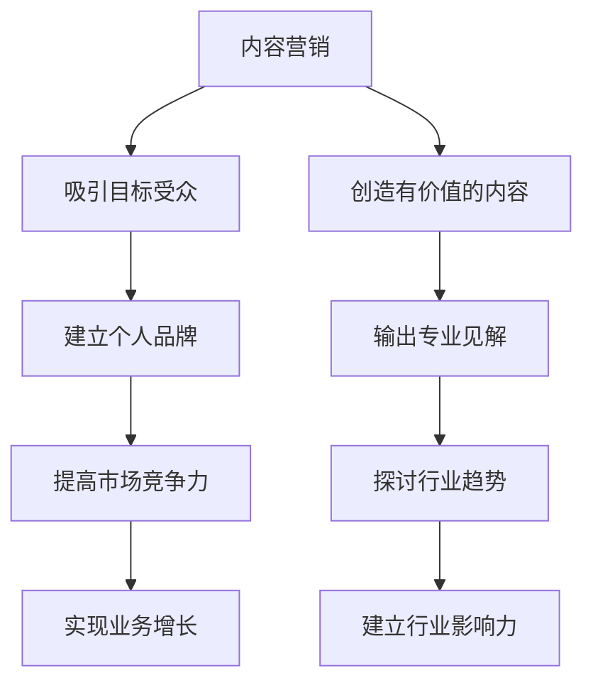

                 

关键词：一人公司、Podcast、行业影响力、内容营销、品牌塑造

摘要：在数字化时代，一人公司面临着信息爆炸和激烈竞争的市场环境。通过Podcast这种新兴的媒体形式，个人品牌和公司可以迅速建立行业影响力，提高市场竞争力。本文将探讨一人公司如何利用Podcast进行内容营销，实现品牌塑造和业务增长。

## 1. 背景介绍

在当今的互联网时代，内容营销已经成为企业推广和品牌建设的重要手段。而Podcast作为一种新兴的媒介形式，正逐渐受到企业和个人的关注。不同于传统的广播和视频，Podcast以其灵活的内容形式、个性化的传播方式和较低的制作成本，成为了一人公司打造个人品牌、建立行业影响力的有效途径。

一人公司，即由一个人独自经营的企业，具有资源有限、决策灵活、反应迅速等特点。在竞争激烈的市场环境中，如何有效地利用有限的资源实现品牌塑造和业务增长，成为一人公司面临的重要课题。

### 1.1 Podcast的定义和特点

Podcast是一种通过互联网进行传播的音频节目，听众可以随时随地通过移动设备收听。与传统的广播和视频相比，Podcast具有以下特点：

- **灵活性**：听众可以自主选择收听时间和地点，满足个性化的需求。
- **互动性**：Podcast允许听众通过评论、投票等方式与主持人互动，增强听众参与感。
- **内容深度**：Podcast通常以深度讨论、案例分析等形式呈现，有助于建立专业形象。
- **制作成本低**：相对于视频和直播，Podcast的制作和传播成本较低，适合资源有限的一人公司。

### 1.2 一人公司的挑战和机遇

一人公司面临的挑战主要包括：

- **资源有限**：一人公司通常缺乏足够的资金和人力资源，难以进行大规模的市场推广。
- **品牌塑造困难**：在信息爆炸的市场环境中，如何让消费者记住并信任个人品牌成为一大难题。
- **业务增长缓慢**：由于市场知名度不高，一人公司的业务增长速度相对较慢。

然而，随着Podcast等新兴媒介的崛起，一人公司也迎来了新的机遇：

- **低成本营销**：通过Podcast进行内容营销，可以有效降低营销成本，提高投资回报率。
- **个性化传播**：Podcast的灵活性使得一人公司可以更精准地触达目标受众，实现个性化传播。
- **品牌塑造**：通过深度内容输出，一人公司可以建立专业形象，提高市场竞争力。

## 2. 核心概念与联系

### 2.1 内容营销

内容营销是一种通过创造和分享有价值的内容来吸引和转化潜在客户的过程。对于一人公司而言，内容营销是实现品牌塑造和业务增长的重要手段。通过Podcast，一人公司可以输出专业、有价值的内容，吸引目标受众，提高品牌知名度。

### 2.2 个人品牌

个人品牌是指一个人在公众心中的形象和认知。在互联网时代，个人品牌已成为一种重要的资产。通过Podcast，一人公司可以塑造专业、权威的个人品牌，提高市场竞争力。

### 2.3 行业影响力

行业影响力是指一个个人或品牌在特定行业内的影响力和话语权。通过Podcast，一人公司可以分享行业见解、探讨行业趋势，从而建立行业影响力。

### 2.4 Mermaid流程图



## 3. 核心算法原理 & 具体操作步骤

### 3.1 算法原理概述

一人公司利用Podcast进行内容营销和品牌塑造的核心算法可以概括为以下几个步骤：

1. **内容定位**：明确Podcast的主题和目标受众，确保内容的专业性和价值。
2. **内容创作**：通过深度调研和经验分享，创作有价值、有深度、有吸引力的内容。
3. **内容传播**：利用社交媒体、邮件营销等渠道，扩大内容传播范围，提高品牌知名度。
4. **互动反馈**：积极与听众互动，收集反馈，不断优化内容和传播策略。

### 3.2 算法步骤详解

1. **内容定位**

   - **确定主题**：根据个人专业领域和目标受众，确定Podcast的主题。
   - **目标受众**：明确目标受众的需求和兴趣，确保内容的专业性和价值。

2. **内容创作**

   - **深度调研**：通过查阅相关文献、采访行业专家等方式，获取有价值的信息。
   - **经验分享**：结合自身经验，分享实践中的心得体会和解决方案。
   - **案例分析**：通过具体案例，分析行业趋势和前景，提供有针对性的建议。

3. **内容传播**

   - **社交媒体**：利用微博、微信公众号、知乎等社交媒体平台，扩大内容传播范围。
   - **邮件营销**：通过邮件列表，定期向订阅者推送最新内容。
   - **合作推广**：与同行业其他博主或媒体合作，进行内容互换或联合推广。

4. **互动反馈**

   - **评论互动**：积极回复听众的评论，建立良好的互动关系。
   - **问卷调查**：通过问卷调查，了解听众的需求和反馈，优化内容。
   - **粉丝互动**：定期举办线上活动，与粉丝互动，提高粉丝黏性。

### 3.3 算法优缺点

**优点**：

- **低成本**：相对于传统的广告投放，Podcast的制作和传播成本较低。
- **高互动性**：Podcast的互动性较强，有助于建立与听众的紧密联系。
- **内容深度**：Podcast以深度内容为主，有助于建立专业形象。

**缺点**：

- **传播速度慢**：相对于视频和直播，Podcast的传播速度较慢，需要长期积累。
- **听众数量有限**：Podcast的听众数量相对较少，市场影响力有限。

### 3.4 算法应用领域

- **个人品牌建设**：通过Podcast，个人可以输出专业、有价值的内容，建立个人品牌。
- **企业培训**：企业可以通过Podcast进行内部培训，提高员工的专业技能。
- **市场调研**：企业可以通过Podcast收集市场反馈，优化产品和服务。

## 4. 数学模型和公式 & 详细讲解 & 举例说明

### 4.1 数学模型构建

在Podcast内容营销中，我们可以构建一个简单的数学模型来衡量内容的影响力。假设：

- \( C \) 表示内容的质量得分，取值范围为 [0, 100]。
- \( A \) 表示受众的兴趣度得分，取值范围为 [0, 100]。
- \( I \) 表示内容的影响力，即品牌知名度。

那么，我们可以构建以下数学模型：

\[ I = C \times A \]

### 4.2 公式推导过程

- **内容质量得分 \( C \)**：通过专家评分、用户反馈等多种方式综合评估内容的专业性和价值。
- **受众兴趣度得分 \( A \)**：通过用户画像、受众反馈等方式评估受众对内容的兴趣程度。

两者相乘得到内容的影响力 \( I \)，即品牌知名度。

### 4.3 案例分析与讲解

假设有一人公司A，其Podcast的内容质量得分为 80 分，目标受众的兴趣度得分为 70 分。根据上述公式，我们可以计算出该公司Podcast的影响力为：

\[ I = 80 \times 70 = 5600 \]

这意味着，通过该Podcast，一人公司A的品牌知名度达到 5600 分。如果公司A能够持续提升内容质量和受众兴趣度，其品牌影响力将会进一步增加。

## 5. 项目实践：代码实例和详细解释说明

### 5.1 开发环境搭建

为了制作Podcast，我们需要搭建一个开发环境。以下是基本的步骤：

- **操作系统**：选择Windows、Mac或Linux操作系统。
- **音频编辑软件**：推荐使用Audacity或Adobe Audition。
- **录音设备**：购买一款高质量的麦克风和声卡。
- **服务器**：选择一个稳定的服务器，用于存储和发布Podcast。

### 5.2 源代码详细实现

以下是一个简单的Audacity音频编辑的示例：

```bash
# 打开Audacity
audacity

# 导入音频文件
File > Import > Audio...

# 调整音量
Effect > Adjust Volume...

# 添加背景音乐
File > Import > Audio...

# 合并轨道
Tracks > Merge Down...

# 导出音频文件
File > Export > Export as WAV...
```

### 5.3 代码解读与分析

上述代码展示了使用Audacity进行音频编辑的基本步骤。首先，我们导入音频文件，然后调整音量，添加背景音乐，最后合并轨道并导出音频文件。通过这些简单的操作，我们可以制作出一个专业的Podcast。

### 5.4 运行结果展示

完成上述步骤后，我们可以得到一个专业级别的音频文件，用于发布Podcast。发布后，听众可以通过移动设备随时收听，从而接触到我们的内容。

## 6. 实际应用场景

### 6.1 教育培训

一人公司可以通过Podcast提供专业的教育培训内容，如编程课程、市场营销等。这种形式便于学员随时随地学习，提高学习效率。

### 6.2 行业分析

一人公司可以定期发布行业分析报告，探讨行业趋势和发展动态。这种深度内容有助于建立公司的行业影响力。

### 6.3 品牌推广

一人公司可以利用Podcast进行品牌推广，通过分享产品案例、客户评价等内容，提升品牌知名度。

### 6.4 未来应用展望

随着人工智能和大数据技术的发展，Podcast将更加智能化、个性化。一人公司可以通过数据分析，精准推送内容，提高内容传播效果。

## 7. 工具和资源推荐

### 7.1 学习资源推荐

- **《内容营销实战手册》**：详细介绍了内容营销的策略和方法。
- **《Podcasting for Dummies》**：适合初学者的Podcast制作指南。

### 7.2 开发工具推荐

- **Audacity**：免费、开源的音频编辑软件。
- **Adobe Audition**：专业的音频编辑软件。

### 7.3 相关论文推荐

- **“The Impact of Podcasting on Brand Awareness”**：探讨Podcast对品牌知名度的影响。
- **“Content Marketing in the Digital Age”**：分析数字化时代的内容营销策略。

## 8. 总结：未来发展趋势与挑战

### 8.1 研究成果总结

通过本文的探讨，我们得出以下结论：

- Podcast作为一种新兴的媒介形式，具有低成本、高互动性、内容深度等特点，适合一人公司进行内容营销和品牌塑造。
- 利用Podcast进行内容营销，可以有效提高品牌知名度和市场竞争力。
- 随着人工智能和大数据技术的发展，Podcast将更加智能化、个性化。

### 8.2 未来发展趋势

- **个性化内容**：随着用户需求的多样化，Podcast的内容将更加个性化。
- **智能化推荐**：通过人工智能技术，实现精准推送，提高内容传播效果。
- **跨平台融合**：Podcast将与其他媒体形式（如视频、直播等）融合，形成新的内容生态。

### 8.3 面临的挑战

- **内容质量**：在竞争激烈的市场环境中，如何保持内容质量成为一大挑战。
- **听众数量**：尽管Podcast具有低成本优势，但听众数量相对较少，需要持续吸引和扩大听众群体。

### 8.4 研究展望

未来，我们将继续探讨以下研究方向：

- **内容营销策略**：研究如何通过不同类型的内容，实现品牌塑造和业务增长。
- **人工智能与Podcast**：探索人工智能技术在Podcast中的应用，提高内容创作和传播效率。
- **用户行为分析**：通过大数据分析，了解用户需求和行为，优化内容推送策略。

## 9. 附录：常见问题与解答

### 9.1 Podcast制作常见问题

**Q：如何选择合适的Podcast主题？**

A：选择主题时，首先要考虑自己的专业领域和兴趣爱好。其次，要确保主题具有足够的深度和广度，能够吸引目标受众。

### 9.2 内容营销策略问题

**Q：如何提高Podcast的听众数量？**

A：提高听众数量需要从多个方面入手：

- **内容质量**：确保内容有价值、有深度，吸引听众。
- **传播渠道**：利用社交媒体、邮件营销等多种渠道，扩大内容传播范围。
- **互动反馈**：积极与听众互动，提高听众黏性。

### 9.3 技术问题

**Q：如何保证音频质量？**

A：保证音频质量需要注意以下几点：

- **选择高质量的录音设备**：购买一款高品质的麦克风和声卡。
- **录音环境**：在安静的环境中录音，避免背景噪音。
- **后期处理**：使用音频编辑软件，进行音量调整、降噪等处理。

---

作者：禅与计算机程序设计艺术 / Zen and the Art of Computer Programming

