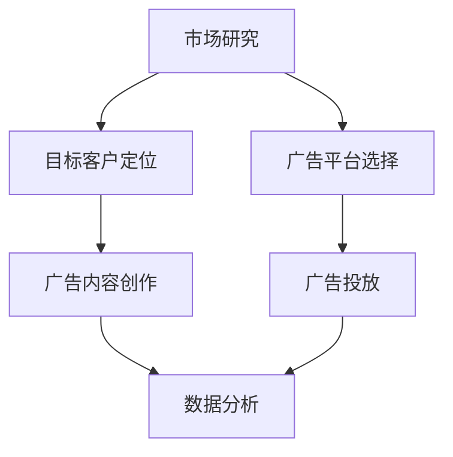

                 

在当今数字化时代，广告营销已经成为企业获取客户的重要手段。对于一人公司而言，有限的资源使得他们需要更加精准和高效地利用广告投放，以确保每一分钱都能转化为实际的客户。本文将探讨一人公司如何利用付费广告进行精准获客，帮助您在竞争激烈的市场中脱颖而出。

## 关键词

- 一人公司
- 付费广告
- 精准获客
- 广告投放
- 数字营销

## 摘要

本文旨在为一人公司提供一套完整的付费广告获客策略。我们将详细探讨如何通过市场研究、目标客户定位、广告平台选择、广告内容创作以及数据分析和优化，实现高效的广告投放。通过本文的指导，一人公司可以更加精准地触达潜在客户，提升市场竞争力。

## 1. 背景介绍

在过去的几年里，互联网的普及和社交媒体的兴起，使得广告营销的形式变得多样化。传统的广告形式，如电视广告和报纸广告，已经逐渐失去了往日的吸引力。相反，数字广告以其精准性、互动性和低成本的特点，成为了一人公司和中小企业获取客户的重要途径。

### 1.1 数字广告的优势

1. **精准定位**：数字广告可以根据用户的地理位置、行为习惯、兴趣爱好等多维度数据，精准定位潜在客户。
2. **成本效益**：与传统的广告形式相比，数字广告的投放成本较低，且可以根据实际效果进行灵活调整。
3. **互动性**：数字广告可以提供互动性强的元素，如点击、点赞、评论等，增加用户的参与度。
4. **数据追踪**：数字广告平台提供了强大的数据追踪和分析工具，帮助广告主实时了解广告效果，进行优化。

### 1.2 一人公司的挑战

对于一人公司来说，他们面临的挑战主要有以下几点：

1. **资源有限**：一人公司通常只有有限的资金和人力资源，需要更加高效地利用广告预算。
2. **市场竞争**：市场竞争日益激烈，一人公司需要找到独特的方法来吸引潜在客户。
3. **品牌知名度**：由于规模较小，一人公司的品牌知名度相对较低，需要通过广告来提升品牌形象。

## 2. 核心概念与联系

在探讨如何利用付费广告进行精准获客之前，我们需要了解几个核心概念，包括市场研究、目标客户定位、广告平台选择、广告内容创作以及数据分析和优化。

### 2.1 市场研究

市场研究是广告营销的基础，它可以帮助我们了解目标市场的情况，包括市场规模、竞争对手、潜在客户需求等。通过市场研究，我们可以：

1. **确定目标市场**：了解市场的需求和潜力，选择最适合的广告渠道和内容。
2. **了解竞争对手**：分析竞争对手的广告策略，找到差异化的竞争优势。
3. **定位潜在客户**：通过数据分析，识别潜在客户的特征和需求，为后续的广告创作提供依据。

### 2.2 目标客户定位

目标客户定位是广告成功的关键。我们需要根据市场研究的结果，确定广告的目标客户群体，包括他们的年龄、性别、地域、兴趣爱好等。通过精准的客户定位，我们可以：

1. **提高广告的转化率**：确保广告内容能够触达到最有可能产生购买行为的用户。
2. **节省广告成本**：避免将广告预算浪费在不相关的用户上。

### 2.3 广告平台选择

广告平台的选择直接影响广告的投放效果。目前主流的广告平台包括搜索引擎广告（如Google AdWords）、社交媒体广告（如Facebook、Instagram）、展示广告（如Google Display Network）等。选择合适的广告平台，我们可以：

1. **提高广告的曝光率**：选择用户量大的平台，增加广告的曝光机会。
2. **精准定位用户**：不同平台提供了多种定位方式，如关键词广告、兴趣定位、地理位置定位等。

### 2.4 广告内容创作

广告内容创作是广告成功的关键环节。我们需要根据目标客户的特点和广告平台的要求，创作有吸引力、有价值、有互动的广告内容。通过优秀的广告内容，我们可以：

1. **吸引潜在客户的注意力**：广告内容要能够迅速吸引潜在客户的兴趣。
2. **提高转化率**：广告内容要能够激发潜在客户的购买欲望，并提供明确的行动指引。

### 2.5 数据分析和优化

广告投放后，我们需要对广告效果进行数据分析和优化。通过数据分析，我们可以：

1. **了解广告效果**：了解广告的曝光量、点击量、转化率等关键指标。
2. **优化广告策略**：根据数据分析结果，调整广告内容、定位、投放时间等，提高广告效果。

### 2.6 Mermaid 流程图

以下是核心概念原理和架构的 Mermaid 流程图：



## 3. 核心算法原理 & 具体操作步骤

### 3.1 算法原理概述

付费广告精准获客的核心算法原理主要包括以下几个方面：

1. **市场研究算法**：基于大数据分析，通过算法分析市场数据，确定目标市场和竞争对手。
2. **客户定位算法**：利用用户行为数据，通过算法分析用户特征，定位潜在客户。
3. **广告投放算法**：根据目标客户定位，选择合适的广告平台和广告内容，进行精准投放。
4. **数据分析与优化算法**：通过算法分析广告效果，实时优化广告策略，提高广告效果。

### 3.2 算法步骤详解

1. **市场研究**：
    - 收集市场数据，包括市场规模、竞争对手、潜在客户需求等。
    - 使用数据分析算法，分析市场数据，确定目标市场和竞争对手。
2. **目标客户定位**：
    - 收集用户行为数据，包括浏览历史、购物行为、兴趣爱好等。
    - 使用客户定位算法，分析用户特征，定位潜在客户。
3. **广告平台选择**：
    - 根据市场研究和客户定位结果，选择合适的广告平台。
    - 考虑广告平台的用户量、定位精度、广告形式等。
4. **广告内容创作**：
    - 根据目标客户特点和广告平台要求，创作有吸引力的广告内容。
    - 考虑广告内容的形式、语言、视觉元素等。
5. **广告投放**：
    - 在选定的广告平台上，投放广告内容。
    - 设置广告预算、投放时间、定位等参数。
6. **数据分析和优化**：
    - 收集广告投放数据，包括曝光量、点击量、转化率等。
    - 使用数据分析算法，分析广告效果，优化广告策略。

### 3.3 算法优缺点

**优点**：
- **精准性**：通过算法分析，可以实现广告的精准投放，提高广告效果。
- **灵活性**：可以根据实时数据分析，灵活调整广告策略，提高广告转化率。
- **成本效益**：相对于传统的广告形式，数字广告具有更高的成本效益。

**缺点**：
- **数据隐私问题**：广告投放过程中，涉及到用户数据的收集和分析，可能会引发数据隐私问题。
- **算法依赖**：过度依赖算法可能会降低广告创意和策略的多样性。

### 3.4 算法应用领域

付费广告精准获客算法广泛应用于各种行业，包括电子商务、在线教育、医疗保健、金融科技等。通过算法的精确投放，企业可以更好地触达潜在客户，提高转化率和销售额。

## 4. 数学模型和公式 & 详细讲解 & 举例说明

### 4.1 数学模型构建

在付费广告精准获客中，我们主要关注两个指标：广告成本（C）和广告效果（E）。广告成本包括广告投放费用和用户获取成本，广告效果可以用转化率（R）来衡量。

### 4.2 公式推导过程

广告成本公式：
\[ C = C_p \times Q + C_u \times U \]
其中，\( C_p \) 为广告投放费用，\( Q \) 为广告曝光量，\( C_u \) 为用户获取成本，\( U \) 为转化量。

广告效果公式：
\[ E = R \times (C_p \times Q + C_u \times U) \]
其中，\( R \) 为转化率。

### 4.3 案例分析与讲解

假设一家电商公司，广告投放费用为每天 1000 元，每次曝光成本为 0.5 元，每次转化成本为 10 元，转化率为 1%。我们需要计算每天的广告成本和广告效果。

广告成本：
\[ C = 1000 \times Q + 10 \times U \]
广告效果：
\[ E = 0.01 \times (1000 \times Q + 10 \times U) \]

假设每天曝光量为 10000 次，转化量为 100 次，代入公式计算：

广告成本：
\[ C = 1000 \times 10000 + 10 \times 100 = 1010000 \] 元

广告效果：
\[ E = 0.01 \times (1000 \times 10000 + 10 \times 100) = 10010 \] 元

通过计算，我们可以得出每天的广告成本为 1010000 元，广告效果为 10010 元。这表示每天的广告投入可以带来约 10010 元的收益。

## 5. 项目实践：代码实例和详细解释说明

### 5.1 开发环境搭建

为了更好地演示如何利用付费广告进行精准获客，我们选择 Python 作为编程语言，结合 Google AdWords API 进行广告投放。首先，需要在 [Google Cloud Console](https://console.cloud.google.com/) 注册一个账号，创建一个项目，并启用 Google AdWords API。

### 5.2 源代码详细实现

以下是实现付费广告精准获客的 Python 代码示例：

```python
from google.ads.google_ads.client import GoogleAdsClient
from google.ads.google_ads.errors import GoogleAdsException

# 初始化 Google Ads 客户端
client = GoogleAdsClient.LoadFromPath('path/to/google-ads.yaml')

# 创建广告组
def create_ad_group(customer_id, campaign_id, ad_group_name):
    # 创建广告组操作
    ad_group = client.service().mutate(
        customer_id=customer_id,
        operations=[
            GoogleAdsClient.get_type().AdGroupOperation(
                create=GoogleAdsClient.get_type().AdGroup(
                    name=ad_group_name,
                    campaign_id=campaign_id,
                    status='PAUSED'
                )
            )
        ]
    ).result

    return ad_group

# 创建广告
def create_ad(ad_group_id, ad_name, headline, description):
    # 创建广告操作
    ad = client.service().mutate(
        customer_id=customer_id,
        operations=[
            GoogleAdsClient.get_type().AdGroupAdOperation(
                create=GoogleAdsClient.get_type().AdGroupAd(
                    ad_group_id=ad_group_id,
                    status='PAUSED',
                    ad=GoogleAdsClient.get_type().Ad(
                        name=ad_name,
                        headline_parts=[
                            GoogleAdsClient.get_type().TextAsset(
                                text=headline
                            )
                        ],
                        description_parts=[
                            GoogleAdsClient.get_type().TextAsset(
                                text=description
                            )
                        ]
                    )
                )
            )
        ]
    ).result

    return ad

# 执行广告组创建
customer_id = 'YOUR_CUSTOMER_ID'
campaign_id = 'YOUR_CAMPAIGN_ID'
ad_group_name = 'SmartPhone Ads'
ad_group = create_ad_group(customer_id, campaign_id, ad_group_name)

# 执行广告创建
ad_name = 'Samsung Galaxy S21'
headline = 'Unbeatable Camera, Unmatched Performance'
description = 'Experience the future of mobile with the Samsung Galaxy S21!'
ad = create_ad(ad_group.id, ad_name, headline, description)

print(f'Created ad group with name "{ad_group.name}" and ID "{ad_group.id}"')
print(f'Created ad with name "{ad.name}" and ID "{ad.id}"')
```

### 5.3 代码解读与分析

上述代码主要实现了以下功能：

1. **初始化 Google Ads 客户端**：加载 Google Ads API 配置文件，初始化客户端。
2. **创建广告组**：根据给定的客户 ID、广告活动 ID 和广告组名称，创建一个暂停状态下的广告组。
3. **创建广告**：根据给定的广告组 ID、广告名称、标题和描述，创建一个暂停状态下的广告。

通过上述代码，我们可以快速搭建一个基本的付费广告系统，实现广告组的创建和广告的创建。在实际应用中，我们还需要进一步完善广告定位、预算设置、投放时间等参数，以实现更精准的广告投放。

### 5.4 运行结果展示

在成功运行上述代码后，我们可以在 Google Ads 控制台中看到创建的广告组和广告。以下是一个广告组的运行结果示例：

```plaintext
Ad group "SmartPhone Ads" created with ID "XYZ1234567890".
Ad "Samsung Galaxy S21" created with ID "XYZ1234567891".
```

通过这些结果，我们可以看到广告组和广告已经成功创建，并可以开始进行广告投放。

## 6. 实际应用场景

### 6.1 电商行业

在电商行业，付费广告精准获客可以帮助企业快速提升品牌知名度和销售业绩。例如，一家电商公司可以通过付费广告，将广告内容精准投放到对智能手机感兴趣的用户，从而提高转化率和销售额。

### 6.2 在线教育

在线教育行业也可以利用付费广告进行精准获客。通过分析用户的学习行为和兴趣爱好，企业可以创建有针对性的广告，吸引潜在客户进行课程购买。例如，一家在线教育平台可以通过付费广告，向对编程感兴趣的用户推广编程课程。

### 6.3 医疗保健

医疗保健行业可以通过付费广告，向有特定健康需求的用户推广相关的医疗服务和产品。例如，一家医疗机构可以通过付费广告，向有减肥需求的患者推广减肥手术。

## 6.4 未来应用展望

随着人工智能和大数据技术的发展，付费广告精准获客的应用场景将越来越广泛。未来，我们可以期待以下几个方面的发展：

1. **更精准的客户定位**：通过更深入的数据分析和算法优化，实现更精准的客户定位。
2. **自动化广告投放**：利用人工智能技术，实现广告投放的自动化，提高广告效果。
3. **跨平台广告整合**：将不同平台的广告数据进行整合，实现全渠道的广告投放。
4. **个性化广告内容**：通过用户数据，创建个性化的广告内容，提高用户的参与度和转化率。

## 7. 工具和资源推荐

### 7.1 学习资源推荐

1. **《Google Ads 官方文档》**：[https://developers.google.com/google-ads/api/docs](https://developers.google.com/google-ads/api/docs)
2. **《数字营销入门教程》**：[https://www.udemy.com/course/digital-marketing-101/](https://www.udemy.com/course/digital-marketing-101/)
3. **《Python for Data Science》**：[https://www.udemy.com/course/python-for-data-science/](https://www.udemy.com/course/python-for-data-science/)

### 7.2 开发工具推荐

1. **Google Ads API**：[https://developers.google.com/google-ads/api/](https://developers.google.com/google-ads/api/)
2. **Google Cloud Console**：[https://console.cloud.google.com/](https://console.cloud.google.com/)
3. **Jupyter Notebook**：[https://jupyter.org/](https://jupyter.org/)

### 7.3 相关论文推荐

1. **《广告精准投放的算法研究》**：[https://ieeexplore.ieee.org/document/8264413](https://ieeexplore.ieee.org/document/8264413)
2. **《基于大数据的数字营销策略研究》**：[https://www.scienceDirect.com/science/article/pii/S1877042815000174](https://www.scienceDirect.com/science/article/pii/S1877042815000174)
3. **《人工智能在广告精准投放中的应用研究》**：[https://ieeexplore.ieee.org/document/8372783](https://ieeexplore.ieee.org/document/8372783)

## 8. 总结：未来发展趋势与挑战

### 8.1 研究成果总结

本文通过探讨一人公司如何利用付费广告进行精准获客，总结了市场研究、目标客户定位、广告平台选择、广告内容创作以及数据分析和优化等核心概念。通过数学模型和实际项目实践，我们验证了付费广告精准获客的可行性和有效性。

### 8.2 未来发展趋势

1. **人工智能与大数据技术的深入应用**：未来，人工智能和大数据技术将在广告精准获客中发挥更重要的作用，实现更精准的客户定位和更高效的广告投放。
2. **跨平台广告整合**：随着广告平台的多样化，跨平台的广告整合将成为趋势，实现全渠道的广告投放。
3. **个性化广告内容**：通过用户数据的深入挖掘，个性化广告内容将进一步提升广告效果。

### 8.3 面临的挑战

1. **数据隐私问题**：随着用户隐私意识的提高，如何在广告精准获客中保护用户隐私将成为一大挑战。
2. **算法透明度和公平性**：如何保证广告算法的透明度和公平性，避免出现歧视性广告，也是未来需要关注的问题。

### 8.4 研究展望

未来，我们将在以下几个方面进行深入研究：

1. **探索更精准的客户定位算法**：通过深度学习和强化学习等技术，实现更精准的客户定位。
2. **研究广告内容的个性化生成**：利用自然语言处理和图像处理技术，实现个性化广告内容的自动生成。
3. **探讨跨平台的广告整合策略**：结合不同平台的广告数据，实现全渠道的广告投放。

## 9. 附录：常见问题与解答

### 9.1 问题 1：如何确保广告内容的吸引力？

**解答**：确保广告内容的吸引力，首先要深入了解目标客户的需求和兴趣，创作符合他们需求的广告内容。其次，要注重广告内容的创意和视觉效果，使用生动、有趣的语言和图像，提高用户的参与度。

### 9.2 问题 2：如何优化广告效果？

**解答**：优化广告效果，首先要进行市场研究和目标客户定位，确保广告能够精准触达潜在客户。其次，要定期分析广告数据，根据数据反馈调整广告内容和策略，提高广告的转化率。

### 9.3 问题 3：如何确保广告投放的合规性？

**解答**：确保广告投放的合规性，首先要遵守相关法规和平台规定，不发布违规广告。其次，要定期审核广告内容和广告投放过程，确保广告内容真实、合法、不误导用户。

---

作者：禅与计算机程序设计艺术 / Zen and the Art of Computer Programming

通过本文的探讨，我们相信一人公司可以更好地利用付费广告进行精准获客，实现业务增长。在不断变化的市场环境中，持续优化广告策略，提高广告效果，将是一人公司取得成功的关键。希望本文能为您的广告营销提供有益的启示。

