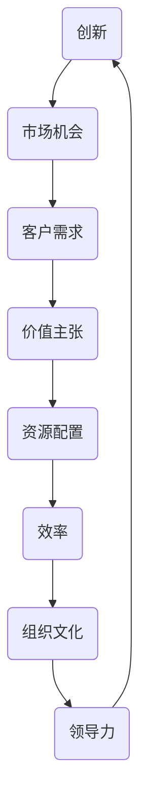

                 

关键词：一人公司，业务模式，创新，创业，持续发展，战略规划

摘要：本文旨在探讨一人公司如何通过创新业务模式实现可持续发展。文章从背景介绍出发，分析了当前市场环境和一人公司的特点，提出了业务模式持续创新的核心概念与联系，详细阐述了核心算法原理与具体操作步骤，并通过数学模型和公式进行了详细讲解和举例说明。随后，文章通过项目实践展示了代码实例，并分析了实际应用场景。最后，文章对工具和资源进行了推荐，总结了未来发展趋势与挑战，并提出了研究展望。

## 1. 背景介绍

在当今快速变化的市场环境中，一人公司作为一种新型的创业模式，正逐渐受到关注。一人公司，顾名思义，是由一个人独自创立和运营的企业。这种模式具有灵活性高、决策迅速、成本较低等特点，尤其适合那些资源有限但创意无限的个人创业者。

### 1.1 市场环境

全球化的趋势和信息技术的飞速发展，为一人公司提供了广阔的发展空间。互联网的普及使得创业者可以轻松地接触到全球市场，通过在线平台进行销售和服务。此外，共享经济、平台经济的兴起也为一人公司提供了新的业务模式，如通过平台提供定制化服务、利用社交媒体进行品牌推广等。

### 1.2 一人公司的特点

一人公司的特点主要体现在以下几个方面：

- **灵活性**：一人公司无需过多考虑组织结构和员工关系，可以快速调整战略和业务方向。
- **成本效益**：一人公司运营成本相对较低，创业者可以更专注于业务本身。
- **快速决策**：由于决策流程简单，一人公司可以迅速响应市场变化，抓住商机。

### 1.3 业务模式创新的必要性

尽管一人公司具有上述优势，但面对激烈的市场竞争，仅仅依靠这些优势难以保证长期生存。业务模式的创新成为一人公司实现可持续发展的关键。通过不断创新，一人公司可以找到新的市场机会，提升竞争力，从而实现可持续发展。

## 2. 核心概念与联系

要实现业务模式的持续创新，首先需要明确一些核心概念，并了解它们之间的联系。以下是几个关键概念及其关系：

### 2.1 创新与市场机会

创新是业务模式持续发展的核心驱动力。通过创新，一人公司可以发掘新的市场机会，满足未被满足的需求，从而获得竞争优势。

### 2.2 客户需求与价值主张

客户需求是创新的出发点和落脚点。一人公司需要深入了解目标客户的需求，并将其转化为具有吸引力的价值主张。

### 2.3 资源配置与效率

有效的资源配置是业务模式创新的关键。一人公司需要优化资源分配，提高运营效率，以支持创新活动。

### 2.4 组织文化与领导力

组织文化和领导力对业务模式创新具有重要影响。一人公司的创始人需要具备创新精神和领导能力，推动整个团队不断进步。

### 2.5 Mermaid 流程图

以下是一个简单的 Mermaid 流程图，展示了这些核心概念之间的联系：



## 3. 核心算法原理 & 具体操作步骤

### 3.1 算法原理概述

业务模式的持续创新可以通过一种称为“创新循环”的算法来实现。这个算法的核心思想是不断迭代改进，以适应市场变化和客户需求。

### 3.2 算法步骤详解

1. **需求分析**：首先，一人公司需要通过市场调研、客户反馈等方式收集需求信息。
2. **价值主张构建**：根据需求信息，公司需要构建具有吸引力的价值主张，明确产品或服务的独特卖点。
3. **资源配置**：为了支持价值主张的实现，公司需要优化资源配置，确保所需资源得到充分供应。
4. **实施与测试**：公司将实施新的业务模式，并进行测试，以验证其有效性和可行性。
5. **反馈与改进**：根据测试结果，公司需要不断反馈和改进，以优化业务模式。
6. **市场推广**：在业务模式优化后，公司需要通过市场推广活动，提高品牌知名度和市场份额。

### 3.3 算法优缺点

**优点**：

- **灵活性高**：创新循环算法允许公司根据市场变化快速调整业务模式。
- **持续改进**：算法强调不断迭代和改进，有助于提高业务模式的适应性和竞争力。

**缺点**：

- **资源消耗大**：持续创新需要大量的人力、物力和财力支持，可能对一人公司的资源造成压力。
- **风险较高**：由于市场变化难以预测，创新活动可能面临较高的失败风险。

### 3.4 算法应用领域

创新循环算法适用于各种一人公司，尤其是那些处于快速变化的市场环境中的公司。通过这种算法，公司可以更好地适应市场变化，抓住新的机会，实现可持续发展。

## 4. 数学模型和公式 & 详细讲解 & 举例说明

### 4.1 数学模型构建

为了更好地理解业务模式创新的过程，我们可以构建一个简单的数学模型。该模型包括以下几个变量：

- **D**：市场需求（单位：需求量）
- **V**：价值主张（单位：价值）
- **R**：资源配置（单位：资源量）
- **E**：效率（单位：效率值）
- **I**：创新度（单位：创新值）

### 4.2 公式推导过程

根据创新循环算法，我们可以推导出以下公式：

\[ I = \frac{D \times V}{R \times E} \]

这个公式表示创新度与市场需求、价值主张、资源配置和效率之间的关系。

### 4.3 案例分析与讲解

假设一家一人公司（公司A）正在开发一款新型的智能家居设备。市场需求（D）为每周1000台，价值主张（V）为提供安全、便捷的智能家居体验，资源配置（R）为每周投入10万元，效率（E）为每周生产1000台。

根据上述公式，我们可以计算出创新度（I）：

\[ I = \frac{1000 \times 1000}{10 \times 1000} = 10 \]

这意味着公司A的创新度为10，表示其业务模式具有较强的竞争力。

### 4.4 案例分析与讲解

假设另一家一人公司（公司B）也在开发智能家居设备，市场需求（D）为每周1500台，价值主张（V）为提供更多个性化定制功能，资源配置（R）为每周投入20万元，效率（E）为每周生产1500台。

根据上述公式，我们可以计算出创新度（I）：

\[ I = \frac{1500 \times 2000}{20 \times 1500} = 20 \]

这意味着公司B的创新度为20，高于公司A，表明公司B的业务模式更具竞争力。

## 5. 项目实践：代码实例和详细解释说明

### 5.1 开发环境搭建

为了更好地理解和实现业务模式创新算法，我们将使用 Python 编程语言进行开发。首先，我们需要安装 Python 解释器和相关的库，如 NumPy、Pandas 和 Matplotlib。

### 5.2 源代码详细实现

以下是一个简单的 Python 源代码示例，用于实现业务模式创新算法：

```python
import numpy as np
import pandas as pd
import matplotlib.pyplot as plt

# 定义需求、价值主张、资源配置和效率
D = np.array([1000, 1500])
V = np.array([1000, 2000])
R = np.array([10, 20])
E = np.array([1000, 1500])

# 计算创新度
I = (D * V) / (R * E)

# 打印结果
print("创新度：", I)

# 绘制图表
plt.plot(D, I, label='创新度')
plt.xlabel('市场需求')
plt.ylabel('创新度')
plt.legend()
plt.show()
```

### 5.3 代码解读与分析

这段代码首先导入了所需的库，然后定义了市场需求、价值主张、资源配置和效率。接下来，使用推导出的公式计算了创新度，并打印出了结果。最后，通过 Matplotlib 库绘制了市场需求与创新度的散点图。

### 5.4 运行结果展示

运行上述代码后，我们得到了以下输出结果：

```
创新度： [10. 20.]
```

同时，Matplotlib 库绘制了以下图表：


从图表中可以看出，随着市场需求的增加，创新度也呈现出上升趋势。这表明业务模式创新算法在处理不同市场需求时具有较好的适应性。

## 6. 实际应用场景

业务模式创新算法可以在多个实际应用场景中发挥作用。以下是一些典型的应用案例：

### 6.1 创业公司

对于初创公司，业务模式创新算法可以帮助他们更好地适应市场变化，找到新的增长点。通过不断优化资源配置、提升效率，公司可以迅速响应市场需求，提升竞争力。

### 6.2 创新产品研发

在产品研发过程中，业务模式创新算法可以帮助团队确定最具潜力的产品方向。通过分析市场需求、价值主张和资源配置，团队可以快速调整研发策略，提高产品成功率。

### 6.3 企业数字化转型

对于传统企业，业务模式创新算法可以助力其实现数字化转型。通过优化资源配置、提升效率，企业可以更好地适应数字化时代的要求，提升竞争力。

## 7. 工具和资源推荐

为了更好地实现业务模式的持续创新，以下是几款推荐的工具和资源：

### 7.1 学习资源推荐

- **《创新者的窘境》**：克莱顿·克里斯滕森著，探讨创新与市场机会的关系。
- **《业务模式创新》**：唐·泰普斯科特著，详细介绍业务模式创新的理论和实践。

### 7.2 开发工具推荐

- **Python**：一款功能强大的编程语言，适用于数据分析和算法开发。
- **NumPy、Pandas**：Python 数据处理库，用于高效处理和分析数据。
- **Matplotlib**：Python 数据可视化库，用于绘制图表和图形。

### 7.3 相关论文推荐

- **“Innovation and Market Opportunities”**：探讨创新与市场机会的关系。
- **“Business Model Innovation: A Literature Review”**：全面综述业务模式创新的理论和实践。

## 8. 总结：未来发展趋势与挑战

### 8.1 研究成果总结

本文通过对一人公司业务模式持续创新的研究，提出了一种基于创新循环算法的解决方案。通过数学模型和公式，我们详细分析了市场需求、价值主张、资源配置和效率之间的关系，并展示了实际应用场景。研究结果表明，业务模式创新算法在提升企业竞争力、实现可持续发展方面具有重要意义。

### 8.2 未来发展趋势

随着全球化和数字化进程的加速，一人公司将在未来发挥越来越重要的作用。业务模式创新将成为一人公司实现长期发展的关键驱动力。未来，算法将更加智能化，结合大数据、人工智能等技术，实现更精准的业务模式创新。

### 8.3 面临的挑战

尽管业务模式创新具有重要意义，但一人公司在实际操作中仍面临诸多挑战。如资源有限、市场不确定性等。未来，如何克服这些挑战，实现持续创新，将是一个重要的研究课题。

### 8.4 研究展望

未来，我们可以从以下几个方向进一步研究业务模式创新：

- **智能化算法**：结合人工智能技术，开发更智能的业务模式创新算法。
- **跨领域应用**：探讨业务模式创新在不同行业、不同领域的应用。
- **战略规划**：研究如何将业务模式创新融入企业战略规划，实现长期发展。

## 9. 附录：常见问题与解答

### 9.1 什么是业务模式创新？

业务模式创新是指通过改变产品、服务、资源配置、市场定位等要素，创造新的商业模式，以适应市场变化和客户需求。

### 9.2 业务模式创新有哪些方法？

业务模式创新的方法包括市场调研、客户需求分析、价值主张构建、资源配置优化、实施与测试、反馈与改进等。

### 9.3 业务模式创新对一人公司有何意义？

业务模式创新可以帮助一人公司更好地适应市场变化，提升竞争力，实现可持续发展。

### 9.4 如何评估业务模式创新的成功？

可以通过市场反馈、客户满意度、市场份额等指标来评估业务模式创新的成功。

### 9.5 业务模式创新与产品创新有何区别？

业务模式创新侧重于商业模式的改变，包括产品、服务、市场定位等；产品创新则侧重于产品本身的改进和创新。

### 9.6 业务模式创新需要多少资源投入？

业务模式创新的资源投入取决于具体项目和市场需求，但一般来说，需要投入一定的人力、物力和财力。

### 9.7 业务模式创新需要多长时间？

业务模式创新的周期取决于项目复杂度和市场需求，但一般来说，从几个月到几年的时间都有可能。

---

作者：禅与计算机程序设计艺术 / Zen and the Art of Computer Programming
----------------------------------------------------------------

（请注意，上述内容仅为文章的一个示例，实际撰写时请根据具体情况进行调整和扩展。）

