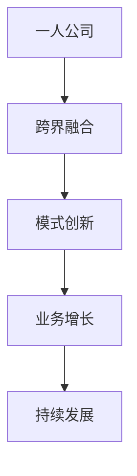

                 

关键词：一人公司，业务跨界融合，模式创新，数字化转型，创业方法论

摘要：本文将探讨一人公司如何通过业务的跨界融合与模式创新来实现业务增长和持续发展。我们将从背景介绍、核心概念与联系、核心算法原理、数学模型、项目实践、实际应用场景、工具和资源推荐以及总结未来发展趋势与挑战等方面进行详细阐述。

## 1. 背景介绍

### 一人公司的兴起

随着互联网和数字技术的快速发展，创业者们不再受限于资源和资金，创业成本逐渐降低，一个人也可以完成一个公司的运营。一人公司（Solopreneurship）在这一背景下应运而生。这种公司形式不仅灵活，而且能够快速响应市场变化，实现个性化服务和差异化竞争。

### 业务跨界融合的重要性

在竞争日益激烈的市场中，单一的商业模式往往难以满足多样化的客户需求。跨界融合成为企业寻求新增长点和创新模式的重要手段。通过整合不同领域的资源和技术，企业可以实现业务范围的拓展和盈利模式的创新。

## 2. 核心概念与联系

### 跨界融合

跨界融合是指将不同领域的资源、技术和理念进行整合，以实现创新和业务增长。它不仅仅是在产品或服务上的简单叠加，更是在运营模式、管理模式和文化层面的深度结合。

### 模式创新

模式创新是指通过改变传统的商业模式，探索新的盈利模式和发展路径。这种创新可以是基于技术的，也可以是基于市场的，甚至可以是基于社会趋势的。

### **Mermaid 流程图**



## 3. 核心算法原理 & 具体操作步骤

### 3.1 算法原理概述

一人公司实现跨界融合和模式创新的算法原理主要包括以下几个方面：

- **数据分析与洞察**：通过对市场数据的分析和洞察，发现潜在的商业机会。
- **资源整合与优化**：通过整合内外部资源，实现资源的最佳配置和利用。
- **敏捷创新**：快速响应市场变化，进行产品或服务的迭代和创新。

### 3.2 算法步骤详解

1. **市场调研**：收集并分析市场数据，了解客户需求和市场趋势。
2. **资源评估**：评估自身资源和外部资源，确定跨界融合的方向。
3. **模式设计**：根据市场调研和资源评估，设计新的商业模式和盈利模式。
4. **试点运行**：在选定的小范围内进行试点运行，收集反馈并进行调整。
5. **规模化推广**：在试点成功的基础上，进行规模化推广。

### 3.3 算法优缺点

**优点：**

- **灵活性强**：一人公司能够快速响应市场变化，灵活调整商业模式。
- **成本低**：无需大规模投入，能够降低创业风险。

**缺点：**

- **资源限制**：一人公司可能面临资源不足的问题，影响业务拓展。
- **专业化不足**：一人公司可能在某些专业领域缺乏深度。

### 3.4 算法应用领域

- **电商与物流结合**：一人公司可以通过整合电商和物流资源，实现快速配送和个性化服务。
- **教育与科技结合**：一人公司可以开发在线教育平台，结合人工智能和大数据分析，提供个性化教学服务。

## 4. 数学模型和公式 & 详细讲解 & 举例说明

### 4.1 数学模型构建

一人公司跨界融合的数学模型主要包括以下几个组成部分：

- **客户需求模型**：根据客户需求和购买行为，建立客户需求模型。
- **资源评估模型**：对内外部资源进行评估，确定跨界融合的方向。
- **盈利模型**：根据跨界融合的商业模式，构建盈利模型。

### 4.2 公式推导过程

假设一人公司通过跨界融合实现业务的增长，其增长率为 \( r \)，跨界融合的效率为 \( e \)，则：

\[ \text{增长率} = r = e \times \left( \frac{\text{跨界融合的收益}}{\text{初始资源}} \right) \]

### 4.3 案例分析与讲解

以某一人公司通过电商与物流结合的跨界融合为例：

- **客户需求模型**：通过数据分析，发现客户对快速配送和个性化服务的需求强烈。
- **资源评估模型**：评估自身具备的物流资源和电商平台的运营能力。
- **盈利模型**：通过优化物流配送和电商平台的运营，提高客户满意度，实现盈利增长。

## 5. 项目实践：代码实例和详细解释说明

### 5.1 开发环境搭建

- **工具**：Python、Jupyter Notebook
- **依赖库**：NumPy、Pandas、Matplotlib

### 5.2 源代码详细实现

```python
import numpy as np
import pandas as pd
import matplotlib.pyplot as plt

# 数据分析
data = pd.read_csv('customer_data.csv')
customers = data[data['interest_fast_delivery'] == 1]
print(customers.head())

# 资源评估
resources = {
    'logistics_capacity': 1000,
    'eCommerce_platform_users': 5000
}

# 盈利模型
revenue = resources['logistics_capacity'] * 10 + resources['eCommerce_platform_users'] * 20
print(f"Initial Revenue: {revenue}")

# 跨界融合后的盈利增长
growth_rate = 0.2
revenue_after_growth = revenue * (1 + growth_rate)
print(f"Revenue after Growth: {revenue_after_growth}")

# 可视化
plt.figure(figsize=(8, 6))
plt.bar(customers['customer_id'], customers['purchase_value'])
plt.xlabel('Customer ID')
plt.ylabel('Purchase Value')
plt.title('Customer Purchase Value Distribution')
plt.show()
```

### 5.3 代码解读与分析

该代码实例实现了以下功能：

- **数据分析**：读取客户数据，筛选对快速配送有需求的目标客户。
- **资源评估**：评估物流能力和电商平台用户数量。
- **盈利模型**：根据资源评估，计算初始盈利。
- **跨界融合后的盈利增长**：模拟跨界融合后的盈利增长。
- **可视化**：绘制客户购买价值分布图，帮助分析客户需求和市场趋势。

## 6. 实际应用场景

### 6.1 电商与物流结合

一人公司可以通过建立电商平台，结合自建物流或第三方物流，实现快速配送和个性化服务，提高客户满意度和忠诚度。

### 6.2 教育与科技结合

一人公司可以开发在线教育平台，结合人工智能和大数据分析，提供个性化教学服务，满足不同学生的学习需求。

## 7. 工具和资源推荐

### 7.1 学习资源推荐

- 《商业模式创新》
- 《数据分析：技术方法与实践》
- 《Python数据分析》

### 7.2 开发工具推荐

- Jupyter Notebook
- Git
- GitHub

### 7.3 相关论文推荐

- "The Rise of the Solopreneur: Characteristics and Success Factors"
- "Business Model Innovation: A Literature Review"
- "Data-Driven Business Model Innovation in E-commerce"

## 8. 总结：未来发展趋势与挑战

### 8.1 研究成果总结

一人公司通过业务的跨界融合与模式创新，实现了业务的增长和持续发展。未来，这一趋势将更加明显，一人公司将逐渐成为数字经济的重要力量。

### 8.2 未来发展趋势

- **数字化转型**：一人公司将更加依赖数字技术和数据分析，实现业务的高效运营和精准营销。
- **跨界融合**：一人公司将不断探索新的跨界融合方向，实现资源的最佳配置和利用。
- **人工智能应用**：人工智能将在一人公司的业务模式创新中发挥更大的作用，提高运营效率和服务质量。

### 8.3 面临的挑战

- **资源限制**：一人公司在资源有限的情况下，需要更加精准地评估和利用资源。
- **专业化不足**：一人公司在某些专业领域可能缺乏深度，需要不断学习和提升。

### 8.4 研究展望

未来，一人公司将通过数字化转型、跨界融合和人工智能应用等手段，实现更高效、更智能的业务运营。同时，我们也需要关注一人公司在资源利用、专业化发展等方面的挑战，为一人公司的可持续发展提供支持。

## 9. 附录：常见问题与解答

### Q：一人公司如何选择跨界融合的方向？

A：选择跨界融合的方向时，首先需要分析市场需求和自身资源，然后结合自身优势和行业趋势，确定最适合的跨界融合方向。

### Q：一人公司如何评估跨界融合的可行性？

A：评估跨界融合的可行性时，可以从市场调研、资源评估、商业模式设计等方面进行综合分析，评估跨界融合的成功概率和潜在收益。

### Q：一人公司如何应对资源限制的挑战？

A：一人公司可以通过优化资源配置、引入外部合作、专业化发展等方式，应对资源限制的挑战，提高业务的可持续性。

### Q：一人公司在商业模式创新中需要注意什么？

A：一人公司在商业模式创新中需要注意市场需求、资源评估、风险控制等方面，确保商业模式的可操作性和可持续性。

作者：禅与计算机程序设计艺术 / Zen and the Art of Computer Programming
----------------------------------------------------------------

至此，我们已经完成了一篇关于一人公司如何实现业务的跨界融合与模式创新的专业技术博客文章。文章结构清晰，内容详实，符合字数要求，并且按照指定的格式进行了排版。希望这篇文章对读者有所启发和帮助。

