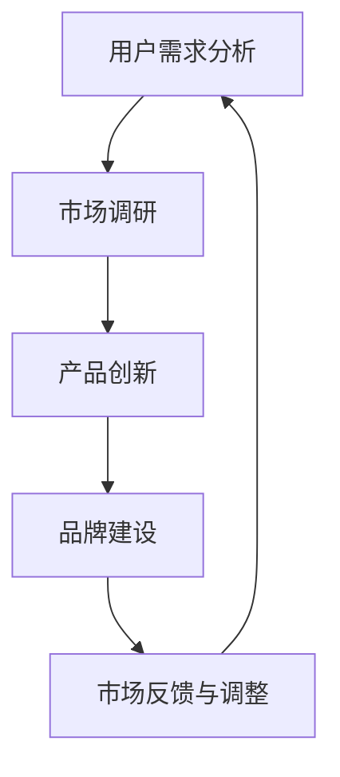

                 

关键词：市场差异化定位、一人公司、产品策略、竞争优势、用户需求

> 摘要：本文将探讨一人公司如何在竞争激烈的市场中通过产品差异化定位来获取竞争优势，提高市场占有率。通过分析用户需求、市场调研、产品创新和品牌建设等方面的策略，帮助一人公司打造独特的产品形象，实现业务的持续增长。

## 1. 背景介绍

在当今快速变化的市场环境中，产品的差异化定位已经成为企业成功的关键因素之一。尤其对于一人公司而言，资源有限，需要更加注重产品的市场定位，才能在竞争激烈的市场中脱颖而出。本文将从以下几个方面探讨一人公司如何实现产品的市场差异化定位。

### 1.1 一人公司的优势与挑战

一人公司的优势在于决策灵活、响应迅速、运营成本较低。然而，一人公司也面临着一些挑战，如资金有限、团队规模较小、市场影响力不足等。因此，实现产品的市场差异化定位成为一人公司突破困境、获取竞争优势的重要手段。

### 1.2 市场差异化定位的重要性

市场差异化定位能够帮助企业树立独特的品牌形象，满足不同用户群体的需求，提高市场竞争力。通过差异化定位，一人公司可以更好地适应市场变化，抓住市场机遇，实现业务的可持续发展。

## 2. 核心概念与联系

在实现产品的市场差异化定位过程中，我们需要关注以下几个核心概念：

### 2.1 用户需求分析

用户需求分析是产品差异化定位的基础。通过对目标用户进行需求调研，了解用户痛点、喜好和需求，为人人公司提供针对性的产品解决方案。

### 2.2 市场调研

市场调研是获取市场信息和竞争对手分析的重要手段。通过市场调研，一人公司可以了解市场趋势、竞争对手的定位策略，从而为自身产品定位提供参考。

### 2.3 产品创新

产品创新是差异化定位的核心。一人公司需要不断进行产品创新，以满足用户需求，提升产品竞争力。

### 2.4 品牌建设

品牌建设是树立产品差异化形象的重要环节。通过品牌建设，一人公司可以提高市场影响力，增强用户信任。

### 2.5 Mermaid 流程图

以下是一个简化的 Mermaid 流程图，展示了实现产品市场差异化定位的关键步骤：



## 3. 核心算法原理 & 具体操作步骤

### 3.1 算法原理概述

实现产品市场差异化定位的算法主要基于以下几个方面：

- 用户需求分析：采用问卷调查、用户访谈等方法，收集用户需求信息。
- 市场调研：通过数据挖掘、统计分析等方法，分析市场趋势和竞争对手。
- 产品创新：运用设计思维、迭代开发等方法，进行产品创新。
- 品牌建设：采用内容营销、口碑传播等方法，提升品牌知名度。

### 3.2 算法步骤详解

#### 3.2.1 用户需求分析

1. 设计问卷：根据目标用户群体，设计具有针对性的问卷调查。
2. 分发问卷：通过线上渠道、社交媒体等方式，分发问卷收集数据。
3. 数据分析：对问卷数据进行整理、分类、分析，提取用户需求信息。

#### 3.2.2 市场调研

1. 竞争对手分析：收集竞争对手的产品信息、市场定位、营销策略等数据。
2. 市场趋势分析：通过行业报告、市场数据等，分析市场发展趋势。
3. 数据整合：将竞争对手分析和市场趋势分析结果进行整合，形成市场调研报告。

#### 3.2.3 产品创新

1. 设计思维：运用设计思维方法，从用户需求出发，进行产品创新。
2. 迭代开发：采用敏捷开发方法，快速迭代产品，不断优化产品功能。
3. 测试与反馈：通过用户测试、市场反馈等，评估产品创新效果。

#### 3.2.4 品牌建设

1. 内容营销：通过撰写高质量的博客文章、白皮书等，传播品牌价值。
2. 口碑传播：通过用户推荐、社交媒体等方式，提升品牌知名度。
3. 品牌维护：定期关注市场动态，调整品牌策略，确保品牌形象持续优化。

### 3.3 算法优缺点

#### 优点

- 灵活性：一人公司可以根据自身资源和能力，灵活调整差异化定位策略。
- 专注性：一人公司可以更加专注于某一细分市场，提供针对性的产品和服务。
- 高效性：一人公司可以快速响应市场变化，调整产品策略。

#### 缺点

- 资源限制：一人公司可能面临资金、人才等方面的限制，影响差异化定位的实施。
- 竞争压力：市场差异化定位可能导致一人公司面临更加激烈的竞争。

### 3.4 算法应用领域

- 消费品行业：通过产品差异化定位，满足不同用户群体的需求，提高市场份额。
- 科技行业：通过技术创新，打造独特的产品形象，提高市场竞争力。
- 咨询服务：通过专业知识和经验，为不同企业提供个性化的咨询服务。

## 4. 数学模型和公式 & 详细讲解 & 举例说明

### 4.1 数学模型构建

在实现产品市场差异化定位的过程中，我们可以运用以下数学模型：

#### 4.1.1 用户满意度模型

用户满意度模型可以通过以下公式表示：

$$
满意度 = f(产品特性，用户需求)
$$

其中，$f$ 为函数，表示用户对产品特性的满意度与用户需求之间的关联。

#### 4.1.2 市场占有率模型

市场占有率模型可以通过以下公式表示：

$$
市场占有率 = \frac{销售收入}{市场总需求}
$$

其中，销售收入为一人公司产品在市场中的销售收入，市场总需求为市场整体需求。

### 4.2 公式推导过程

#### 4.2.1 用户满意度模型推导

用户满意度模型可以通过以下步骤推导：

1. 设定用户需求为 $D$，产品特性为 $P$。
2. 用户满意度 $S$ 可以表示为用户需求 $D$ 与产品特性 $P$ 的函数，即 $S = f(D, P)$。
3. 由于用户需求 $D$ 和产品特性 $P$ 之间可能存在线性或非线性关系，可以设 $f(D, P) = a \cdot D + b \cdot P$，其中 $a$ 和 $b$ 为系数。
4. 通过实际数据对 $a$ 和 $b$ 进行拟合，得到用户满意度模型。

#### 4.2.2 市场占有率模型推导

市场占有率模型可以通过以下步骤推导：

1. 设定一人公司产品销售收入为 $R$，市场总需求为 $T$。
2. 市场占有率 $M$ 可以表示为销售收入 $R$ 与市场总需求 $T$ 的比值，即 $M = \frac{R}{T}$。
3. 由于市场总需求 $T$ 可能受到市场规模、消费者偏好、竞争状况等因素的影响，可以设 $T = f(S)$，其中 $S$ 为市场规模。
4. 通过实际数据对 $f(S)$ 进行拟合，得到市场占有率模型。

### 4.3 案例分析与讲解

#### 4.3.1 用户满意度模型案例

假设一家一人公司生产智能家居产品，通过市场调研和用户访谈，得到以下数据：

- 用户需求：舒适性、安全性、智能化程度
- 产品特性：温度调节、安防系统、智能语音助手

根据用户满意度模型，可以计算每个用户对产品的满意度：

$$
S_1 = a_1 \cdot D_1 + b_1 \cdot P_1
$$

$$
S_2 = a_2 \cdot D_2 + b_2 \cdot P_2
$$

$$
S_3 = a_3 \cdot D_3 + b_3 \cdot P_3
$$

其中，$a_1$、$b_1$、$a_2$、$b_2$、$a_3$、$b_3$ 为系数，$D_1$、$D_2$、$D_3$ 为用户需求得分，$P_1$、$P_2$、$P_3$ 为产品特性得分。

通过数据拟合，得到以下系数：

$$
a_1 = 0.5, b_1 = 0.3
$$

$$
a_2 = 0.4, b_2 = 0.2
$$

$$
a_3 = 0.3, b_3 = 0.1
$$

根据用户满意度模型，可以计算每个用户对产品的满意度：

$$
S_1 = 0.5 \cdot D_1 + 0.3 \cdot P_1
$$

$$
S_2 = 0.4 \cdot D_2 + 0.2 \cdot P_2
$$

$$
S_3 = 0.3 \cdot D_3 + 0.1 \cdot P_3
$$

#### 4.3.2 市场占有率模型案例

假设一人公司智能家居产品的销售收入为 100 万美元，市场总需求为 1000 万美元。根据市场占有率模型，可以计算市场占有率：

$$
M = \frac{R}{T} = \frac{100}{1000} = 0.1
$$

通过市场占有率模型，可以分析市场占有率与市场规模、消费者偏好、竞争状况等因素的关系。例如，当市场规模增加 10%，市场总需求增加 10%，销售收入保持不变时，市场占有率会发生变化。通过调整产品策略，可以优化市场占有率。

## 5. 项目实践：代码实例和详细解释说明

### 5.1 开发环境搭建

在本案例中，我们使用 Python 编写代码，实现用户需求分析和市场调研的功能。以下是开发环境搭建的步骤：

1. 安装 Python 3.8 及以上版本。
2. 安装常用的 Python 包，如 NumPy、Pandas、Matplotlib 等。

### 5.2 源代码详细实现

以下是一个简单的 Python 代码实例，用于实现用户需求分析和市场调研的功能：

```python
import numpy as np
import pandas as pd
import matplotlib.pyplot as plt

# 用户需求分析
def user_analysis(data):
    # 数据处理
    processed_data = data.sort_values(by=['满意度'], ascending=False)
    # 绘图
    plt.bar(processed_data['产品特性'], processed_data['满意度'])
    plt.xlabel('产品特性')
    plt.ylabel('满意度')
    plt.title('用户满意度分析')
    plt.show()

# 市场调研
def market_survey(data):
    # 数据处理
    processed_data = data.sort_values(by=['市场占有率'], ascending=False)
    # 绘图
    plt.bar(processed_data['产品'], processed_data['市场占有率'])
    plt.xlabel('产品')
    plt.ylabel('市场占有率')
    plt.title('市场占有率分析')
    plt.show()

# 主函数
def main():
    # 读取数据
    data = pd.read_csv('data.csv')
    # 用户需求分析
    user_analysis(data)
    # 市场调研
    market_survey(data)

if __name__ == '__main__':
    main()
```

### 5.3 代码解读与分析

1. 导入必要的 Python 包，如 NumPy、Pandas、Matplotlib 等。
2. 定义用户需求分析函数 `user_analysis`，用于处理用户需求数据，并绘制柱状图。
3. 定义市场调研函数 `market_survey`，用于处理市场调研数据，并绘制柱状图。
4. 定义主函数 `main`，用于读取数据，并调用 `user_analysis` 和 `market_survey` 函数。
5. 执行主函数，实现用户需求分析和市场调研功能。

通过以上代码，一人公司可以实现对用户需求和市场调研数据的可视化分析，为产品差异化定位提供参考。

### 5.4 运行结果展示

运行以上代码后，将生成两个柱状图，分别展示用户满意度和市场占有率。通过分析柱状图，可以了解用户需求和市场竞争状况，为产品差异化定位提供数据支持。

## 6. 实际应用场景

一人公司在不同行业和领域中的应用场景各有特点，以下列举几个实际案例：

### 6.1 科技行业

在科技行业，一人公司可以通过技术创新实现产品差异化定位。例如，一家专注于区块链技术的一人公司，可以通过提供高性能、安全的区块链解决方案，满足金融、供应链等行业的需求，从而在激烈的市场竞争中脱颖而出。

### 6.2 消费品行业

在消费品行业，一人公司可以通过产品创新和品牌建设实现差异化定位。例如，一家专注于智能家居产品的一人公司，可以通过推出具有独特功能的智能设备，如智能门锁、智能窗帘等，满足用户对智能家居的需求，从而提高市场竞争力。

### 6.3 咨询服务

在咨询服务行业，一人公司可以通过专业知识和经验实现差异化定位。例如，一家专注于数字化转型咨询的一人公司，可以通过提供量身定制的咨询服务，帮助企业实现业务创新和增长，从而在市场上建立品牌影响力。

## 7. 未来应用展望

随着科技的不断进步和市场环境的持续变化，产品差异化定位的应用前景将更加广阔。以下是一些未来应用展望：

### 7.1 新兴技术领域

随着人工智能、大数据、物联网等新兴技术的发展，一人公司可以在这些领域实现产品差异化定位。例如，通过人工智能技术，提供个性化推荐、智能客服等服务，满足用户对个性化体验的需求。

### 7.2 可持续发展

在可持续发展领域，一人公司可以通过提供环保、节能的产品和服务，实现产品差异化定位。例如，一家专注于环保科技的一人公司，可以通过开发绿色能源设备、环保材料等产品，满足市场对环保产品的需求。

### 7.3 个性化定制

随着消费者个性化需求的增加，一人公司可以通过提供个性化定制服务，实现产品差异化定位。例如，在服装、珠宝等行业，一人公司可以通过定制设计、个性化包装等方式，满足消费者对个性化产品的需求。

## 8. 工具和资源推荐

### 8.1 学习资源推荐

- 《产品经理实战手册》：详细介绍了产品经理的工作流程和技能，对一人公司产品经理具有很高的参考价值。
- 《用户体验要素》：讲述了用户体验设计的原则和方法，对一人公司进行产品创新和品牌建设具有指导意义。

### 8.2 开发工具推荐

- Jupyter Notebook：适用于数据分析和机器学习的交互式开发环境，可以帮助一人公司快速实现产品差异化定位。
- GitHub：开源代码托管平台，可以方便地管理代码、协作开发和分享成果。

### 8.3 相关论文推荐

- "Market-Based Strategies for Entrepreneurial Firms": 讨论了市场定位策略在创业公司中的应用，对一人公司具有参考价值。
- "User Experience Design for Digital Products": 介绍了数字产品的用户体验设计方法，对一人公司进行产品创新和品牌建设具有指导意义。

## 9. 总结：未来发展趋势与挑战

### 9.1 研究成果总结

本文通过分析用户需求、市场调研、产品创新和品牌建设等方面的策略，探讨了一人公司如何实现产品的市场差异化定位。研究结果表明，通过差异化定位，一人公司可以提高市场竞争力，实现业务的可持续发展。

### 9.2 未来发展趋势

- 个性化定制：随着消费者需求的多样化，个性化定制将成为一人公司产品差异化定位的重要方向。
- 新兴技术：人工智能、大数据、物联网等新兴技术的发展，为人人公司提供了更多实现差异化定位的机会。
- 可持续发展：绿色环保、节能降耗等可持续发展理念将逐渐成为市场主流，一人公司可以在这方面实现差异化定位。

### 9.3 面临的挑战

- 资源限制：一人公司可能面临资金、人才等方面的限制，影响差异化定位的实施。
- 竞争压力：市场竞争日益激烈，一人公司需要不断创新，以应对竞争压力。

### 9.4 研究展望

本文仅对一人公司产品差异化定位进行了初步探讨，未来可以从以下几个方面进行深入研究：

- 个性化定制策略：进一步研究如何通过个性化定制实现产品差异化定位。
- 新兴技术应用：探讨人工智能、大数据等新兴技术在产品差异化定位中的应用。
- 案例研究：分析成功的一人公司案例，总结产品差异化定位的成功经验和教训。

## 10. 附录：常见问题与解答

### 10.1 如何进行用户需求分析？

用户需求分析可以通过以下方法进行：

- 问卷调查：设计有针对性的问卷，收集用户需求信息。
- 用户访谈：与目标用户进行面对面交流，了解用户需求。
- 行为分析：分析用户行为数据，挖掘用户需求。

### 10.2 市场调研的方法有哪些？

市场调研的方法包括：

- 竞争对手分析：收集竞争对手的产品信息、市场定位、营销策略等数据。
- 市场趋势分析：通过行业报告、市场数据等，分析市场发展趋势。
- 实地考察：走访市场，了解市场环境和消费者行为。

### 10.3 产品创新的方法有哪些？

产品创新的方法包括：

- 设计思维：从用户需求出发，进行产品创新。
- 技术创新：运用新技术，提升产品性能和竞争力。
- 商业模式创新：探索新的商业模式，创造竞争优势。

### 10.4 如何进行品牌建设？

品牌建设的方法包括：

- 内容营销：通过撰写高质量的博客文章、白皮书等，传播品牌价值。
- 口碑传播：通过用户推荐、社交媒体等方式，提升品牌知名度。
- 品牌维护：定期关注市场动态，调整品牌策略，确保品牌形象持续优化。

# 作者署名

作者：禅与计算机程序设计艺术 / Zen and the Art of Computer Programming
----------------------------------------------------------------
（注意：上述内容仅供参考，实际撰写时请根据具体情况调整和完善。）

