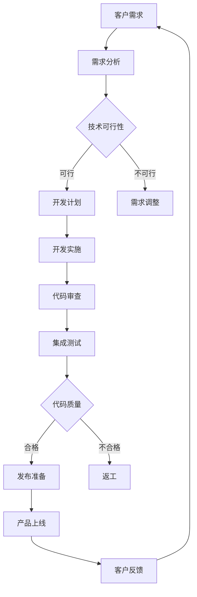

                 

 在当今快速变化的市场环境中，敏捷开发和快速迭代已经成为企业获得竞争优势的关键因素。尤其是对于一人公司，灵活高效的开发流程更是至关重要。本文将探讨如何通过采用一系列技术和策略，实现一人公司的产品快速迭代开发和敏捷上线。

## 文章关键词

敏捷开发、迭代开发、一人公司、快速上线、持续集成、持续交付

## 文章摘要

本文将分析一人公司在产品开发过程中面临的挑战，并介绍如何通过敏捷开发方法、持续集成/持续交付（CI/CD）流程、自动化测试、DevOps文化和工具链的优化，实现产品的快速迭代开发和敏捷上线。

## 1. 背景介绍

### 一人公司的挑战

对于一人公司来说，产品开发的挑战主要集中在以下几个方面：

1. **资源限制**：一人公司通常面临资源和时间的限制，难以进行大规模的开发和维护工作。
2. **时间敏感性**：市场变化迅速，一人公司需要快速响应，以满足客户需求。
3. **技术选型**：由于缺乏团队协作，一人公司在技术选型上需要更加慎重，以确保技术栈的稳定性和可维护性。
4. **风险管理**：一人公司通常无法像大公司那样分散风险，因此需要更加重视风险管理和问题排查。

### 敏捷开发的核心理念

敏捷开发强调团队协作、持续交付、客户反馈和灵活性。其核心理念包括：

1. **快速迭代**：通过快速迭代，公司可以不断调整产品方向，满足市场变化。
2. **持续交付**：通过自动化测试和部署流程，确保产品能够持续交付，减少发布风险。
3. **客户反馈**：通过收集客户反馈，公司可以及时调整产品特性，提高用户满意度。
4. **灵活适应**：敏捷开发允许团队根据实际情况调整开发计划，灵活应对变化。

## 2. 核心概念与联系

### Mermaid 流程图



### 核心概念解释

1. **需求分析**：与客户沟通，了解他们的需求和期望。
2. **开发计划**：根据需求分析制定详细的项目计划。
3. **开发实施**：按照计划进行开发工作。
4. **代码审查**：确保代码质量，减少错误和漏洞。
5. **集成测试**：在代码集成后进行全面的测试。
6. **发布准备**：确保产品准备好上线。
7. **产品上线**：将产品部署到生产环境。
8. **客户反馈**：收集客户反馈，用于后续改进。

## 3. 核心算法原理 & 具体操作步骤

### 3.1 算法原理概述

敏捷开发的核心算法原理可以概括为：

1. **迭代式开发**：将项目划分为多个迭代周期，每个迭代周期结束后进行评估和调整。
2. **增量开发**：逐步增加功能，确保产品在每个迭代中都能提供价值。
3. **持续交付**：通过自动化测试和部署，确保产品可以持续交付。
4. **客户反馈**：通过持续获取客户反馈，确保产品符合市场需求。

### 3.2 算法步骤详解

1. **需求分析**：
   - 与客户沟通，获取需求。
   - 分析需求，确定优先级。

2. **迭代计划**：
   - 根据需求确定迭代周期。
   - 制定详细的迭代计划。

3. **开发实施**：
   - 按照计划进行开发。
   - 使用敏捷开发方法，如Scrum或Kanban。

4. **代码审查**：
   - 定期进行代码审查。
   - 确保代码质量，减少错误和漏洞。

5. **集成测试**：
   - 在每个迭代结束后进行集成测试。
   - 确保所有功能正常工作。

6. **发布准备**：
   - 准备产品上线。
   - 确保所有测试通过。

7. **产品上线**：
   - 将产品部署到生产环境。
   - 监控产品运行情况。

8. **客户反馈**：
   - 收集客户反馈。
   - 根据反馈进行产品改进。

### 3.3 算法优缺点

**优点**：

- **快速响应**：通过迭代开发和持续交付，可以快速响应市场变化。
- **质量保证**：通过代码审查和集成测试，确保产品质量。
- **客户满意**：通过持续获取客户反馈，确保产品符合客户需求。

**缺点**：

- **管理难度**：需要对项目进行细致的管理和协调。
- **资源消耗**：需要进行频繁的测试和部署，消耗一定的资源。

### 3.4 算法应用领域

敏捷开发方法广泛应用于软件开发领域，特别适合于一人公司。它可以帮助一人公司快速迭代开发，快速响应市场需求，提高产品竞争力。

## 4. 数学模型和公式 & 详细讲解 & 举例说明

### 4.1 数学模型构建

敏捷开发中的关键数学模型包括：

1. **工作量估算**：
   $$工作量 = 速度 \times 时间$$
   其中，速度是团队在单位时间内完成的工作量，时间是迭代周期。

2. **进度监控**：
   $$进度 = 完成工作量 / 总工作量$$
   该公式用于评估项目的进度。

### 4.2 公式推导过程

1. **工作量估算**：
   工作量是由团队速度和时间共同决定的。速度是团队的能力指标，时间是对工作量的时间约束。

2. **进度监控**：
   进度是通过已完成的工程量与总工程量的比值来衡量的，反映了项目的完成情况。

### 4.3 案例分析与讲解

#### 案例背景

一家一人公司计划开发一款社交媒体应用，目标是在3个月内上线。根据以往的经验，公司评估团队每月可以完成1000个功能点。

#### 工作量估算

根据工作量估算公式：
$$工作量 = 速度 \times 时间 = 1000 \times 3 = 3000个功能点$$

#### 进度监控

在第一个月结束时，团队完成了500个功能点。根据进度监控公式：
$$进度 = 完成工作量 / 总工作量 = 500 / 3000 = 0.1667$$

这意味着项目进度约为16.67%，还有大量的工作需要完成。

#### 解读

通过这个案例，我们可以看到如何使用数学模型来估算和监控项目进度。这有助于公司了解项目的进展情况，及时调整计划，确保项目能够按时上线。

## 5. 项目实践：代码实例和详细解释说明

### 5.1 开发环境搭建

在一人公司的产品开发中，搭建一个高效的开发环境至关重要。以下是一个简单的步骤指南：

1. **选择合适的编程语言和框架**：根据项目需求选择合适的编程语言和框架。例如，对于Web开发，可以选择Python和Django框架。
2. **配置开发工具**：安装并配置集成开发环境（IDE），如Visual Studio Code，以及版本控制系统，如Git。
3. **搭建本地开发环境**：配置数据库、Web服务器和其他必要的依赖项。
4. **代码模板和规范**：制定代码模板和编码规范，确保代码风格一致，易于维护。

### 5.2 源代码详细实现

以下是一个简单的Web应用源代码示例，使用Django框架实现：

```python
# views.py
from django.http import HttpResponse

def home(request):
    return HttpResponse("欢迎来到我的社交媒体应用！")

# settings.py
# 配置数据库、Web服务器等信息
```

### 5.3 代码解读与分析

在这个示例中，`views.py` 定义了一个名为 `home` 的视图函数，用于处理首页的请求。当用户访问应用的主页时，视图函数会返回一个包含欢迎消息的HTTP响应。

`settings.py` 文件包含应用的配置信息，如数据库配置、Web服务器设置等，确保应用可以正常运行。

### 5.4 运行结果展示

在本地开发环境中运行应用，打开浏览器访问 `http://127.0.0.1:8000/`，将看到如下结果：

```
欢迎来到我的社交媒体应用！
```

这表明应用已经成功运行，并且能够正常响应请求。

## 6. 实际应用场景

### 6.1 敏捷开发的实际应用

敏捷开发方法在许多一人公司的产品开发中得到了广泛应用。通过敏捷开发，公司能够快速响应市场变化，不断优化产品特性，提高用户满意度。以下是一个实际应用案例：

#### 案例背景

一家一人公司开发一款在线教育平台，计划在半年内上线。由于市场竞争激烈，公司决定采用敏捷开发方法，以快速迭代的方式推进项目。

#### 应用步骤

1. **需求分析**：与客户和教师沟通，了解他们的需求和期望。
2. **迭代计划**：将项目分为多个迭代周期，每个迭代周期持续2周。
3. **开发实施**：在每个迭代周期内，团队按照计划开发功能模块。
4. **客户反馈**：在每个迭代周期结束后，收集客户和教师的反馈。
5. **产品改进**：根据反馈进行产品改进，优化用户体验。

通过这个案例，我们可以看到敏捷开发如何帮助一人公司快速迭代产品，提高市场竞争力。

### 6.2 持续集成/持续交付的实际应用

持续集成/持续交付（CI/CD）流程在敏捷开发中起着至关重要的作用。以下是一个CI/CD的实际应用案例：

#### 案例背景

一家一人公司开发一款移动应用，计划在一个月内上线。为了确保产品质量，公司决定采用CI/CD流程。

#### 应用步骤

1. **配置自动化测试**：编写并配置自动化测试脚本，确保每次代码提交都能进行全面的测试。
2. **集成代码**：将代码提交到版本控制系统，触发自动化测试和构建流程。
3. **持续集成**：在每次代码提交后，进行集成测试，确保代码质量和功能完整性。
4. **持续交付**：在通过集成测试后，将代码部署到生产环境，确保产品可以持续交付。

通过这个案例，我们可以看到CI/CD流程如何确保产品质量，提高发布速度。

## 7. 工具和资源推荐

### 7.1 学习资源推荐

1. **敏捷开发**：
   - 《敏捷开发实践指南》（作者：杰夫·萨瑟兰）
   - 《敏捷实践指南》（作者：艾伦·哈布尔）
2. **持续集成/持续交付**：
   - 《持续集成：实践指南》（作者：戴夫·凯瑟）
   - 《持续交付：加速软件交付的实践方法》（作者：戴夫·凯瑟）
3. **DevOps**：
   - 《DevOps实践与原理》（作者：约翰·威廉姆森）

### 7.2 开发工具推荐

1. **敏捷开发工具**：
   - Jira
   - Trello
2. **持续集成工具**：
   - Jenkins
   - GitLab CI/CD
3. **持续交付工具**：
   - Docker
   - Kubernetes

### 7.3 相关论文推荐

1. **敏捷开发**：
   - “Agile Software Development: Opportunities and Challenges”（作者：M. Bech缓和J. C. B. Mendonca）
2. **持续集成/持续交付**：
   - “Continuous Integration in the Large”（作者：Ed Seidewitz）
3. **DevOps**：
   - “The Phoenix Project: A Novel About IT, DevOps, and Helping Your Business Win”（作者：Gene Kim、Kevin Behr、George Spafford）

## 8. 总结：未来发展趋势与挑战

### 8.1 研究成果总结

本文总结了敏捷开发、持续集成/持续交付（CI/CD）和DevOps等技术在一人公司产品开发中的应用，并提出了一系列实践步骤和工具推荐。这些方法和技术有助于一人公司实现快速迭代开发和敏捷上线，提高产品竞争力。

### 8.2 未来发展趋势

未来，随着人工智能和自动化技术的发展，一人公司的产品开发将进一步智能化和自动化。自动化测试、AI驱动的代码审查和智能部署等新技术将广泛应用于产品开发，提高开发效率和质量。

### 8.3 面临的挑战

尽管敏捷开发、CI/CD和DevOps等技术有助于一人公司实现快速迭代开发和敏捷上线，但一人公司在产品开发过程中仍然面临一些挑战：

1. **技术选型**：在技术选型过程中，一人公司需要谨慎评估，以确保技术栈的稳定性和可维护性。
2. **团队协作**：由于缺乏团队协作，一人公司需要更加重视沟通和协调，确保项目顺利进行。
3. **资源限制**：一人公司通常面临资源和时间的限制，需要更加高效地利用资源。

### 8.4 研究展望

未来，一人公司可以进一步探索和实践自动化测试、AI驱动的开发工具和智能部署等新技术，以实现更加高效和智能的产品开发。此外，一人公司还可以通过构建灵活的团队和生态系统，与其他开发者和公司合作，共同推动产品创新和发展。

## 9. 附录：常见问题与解答

### Q：敏捷开发适用于一人公司吗？

A：是的，敏捷开发方法特别适合一人公司。敏捷开发强调快速迭代、持续交付和客户反馈，这些理念有助于一人公司快速响应市场需求，提高产品竞争力。

### Q：如何确保敏捷开发的成功？

A：确保敏捷开发成功的几个关键因素包括：清晰的沟通和协作、持续获取客户反馈、高效的工作流程、稳定的开发环境和工具支持。

### Q：CI/CD如何帮助一人公司？

A：CI/CD可以提高一人公司的开发效率和质量。通过自动化测试和部署流程，一人公司可以确保每次代码提交都能及时测试和部署，减少发布风险，提高产品质量。

### Q：DevOps如何帮助一人公司？

A：DevOps可以促进一人公司内的开发和运维协作，提高整体开发效率。通过DevOps实践，一人公司可以实现更加高效和自动化的部署和监控，确保产品能够快速响应市场变化。

作者：禅与计算机程序设计艺术 / Zen and the Art of Computer Programming

### 后记

敏捷开发、持续集成/持续交付和DevOps等技术在当今的IT行业中发挥着重要作用，对于一人公司而言，它们更是实现快速迭代开发和敏捷上线的关键。本文通过详细的分析和实践案例，帮助读者了解如何运用这些技术，提高产品开发效率和质量。未来，随着技术的不断进步，一人公司将迎来更加广阔的发展空间。希望本文能为读者提供有价值的参考和启示。

