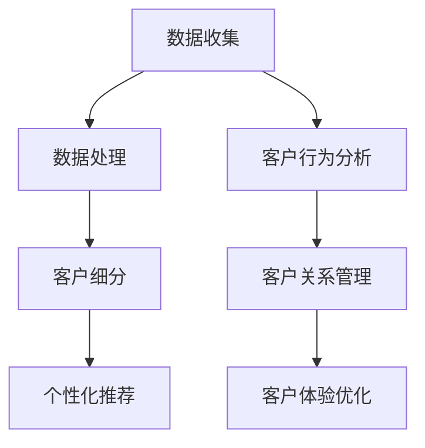

                 

随着互联网技术的飞速发展，大数据和人工智能技术的成熟，企业对精准营销和客户个性化服务的需求日益增长。对于一人公司，如何在这两个领域实现突破，不仅关乎公司的盈利能力，更决定了其市场竞争力。本文将探讨一人公司如何利用技术手段实现精准营销和客户个性化服务。

## 关键词
精准营销、客户个性化服务、大数据、人工智能、一人公司、市场竞争力

## 摘要
本文首先介绍了精准营销和客户个性化服务的背景和重要性，然后分析了大数据和人工智能技术在其中的应用，最后通过具体案例分析，提出了一人公司实现这两大目标的可行策略。

## 1. 背景介绍

### 1.1 精准营销的概念与重要性

精准营销是一种基于大数据和人工智能技术的营销策略，通过分析海量用户数据，精准定位目标客户，提高营销活动的效率和转化率。对于一人公司，精准营销的意义尤为重大。一方面，精准营销可以帮助公司节省营销成本，提高投资回报率；另一方面，它能够增强客户的忠诚度和满意度，从而在激烈的市场竞争中脱颖而出。

### 1.2 客户个性化服务的概念与意义

客户个性化服务是一种以客户为中心的服务理念，通过收集和分析客户行为数据，为每个客户提供定制化的产品和服务。对于一人公司，客户个性化服务不仅能够提升客户满意度，还能增加客户黏性，形成良好的口碑效应。

### 1.3 大数据和人工智能的发展与应用

大数据和人工智能技术的不断发展，为精准营销和客户个性化服务提供了强有力的技术支撑。通过大数据技术，一人公司可以收集、存储、分析和应用海量用户数据，实现精准定位和个性化推荐。而人工智能技术则能够自动化处理数据，提高营销和服务的效率和质量。

## 2. 核心概念与联系

### 2.1 大数据和人工智能技术在精准营销中的应用

#### 2.1.1 数据收集与处理
一人公司可以通过多种渠道收集用户数据，如网站访问日志、社交媒体行为、在线购物记录等。这些数据经过清洗、整合和处理，形成用户画像。

#### 2.1.2 客户细分
通过大数据分析，一人公司可以将客户分为不同的细分市场，针对每个细分市场制定个性化的营销策略。

#### 2.1.3 个性化推荐
利用人工智能技术，一人公司可以为每位客户提供个性化的产品推荐，提高购买转化率。

### 2.2 大数据和人工智能技术在客户个性化服务中的应用

#### 2.2.1 客户行为分析
通过分析客户的行为数据，一人公司可以了解客户的需求和偏好，从而提供个性化的产品和服务。

#### 2.2.2 客户关系管理
人工智能技术可以帮助一人公司建立和维护良好的客户关系，提高客户满意度。

#### 2.2.3 客户体验优化
通过大数据分析，一人公司可以不断优化客户体验，提升客户黏性。

### 2.3 Mermaid 流程图



## 3. 核心算法原理 & 具体操作步骤

### 3.1 算法原理概述

#### 3.1.1 聚类算法

聚类算法是一种无监督学习方法，用于将相似的数据点归为一类。在精准营销和客户个性化服务中，聚类算法可以帮助一人公司识别不同的客户群体，制定个性化的营销策略。

#### 3.1.2 协同过滤算法

协同过滤算法是一种基于用户行为数据的推荐算法，通过分析用户之间的相似性，为用户提供个性化的推荐。一人公司可以利用协同过滤算法为每位客户提供个性化的产品推荐。

#### 3.1.3 贝叶斯网络

贝叶斯网络是一种用于表示变量之间概率关系的图模型。在客户个性化服务中，贝叶斯网络可以帮助一人公司预测客户的行为和需求，提供个性化的服务。

### 3.2 算法步骤详解

#### 3.2.1 聚类算法步骤

1. 数据预处理：对收集到的用户数据进行分析，去除异常值和重复数据。
2. 确定聚类算法：选择合适的聚类算法，如K-means、DBSCAN等。
3. 计算距离：计算每个用户与其他用户的距离，确定用户之间的相似性。
4. 聚类：根据距离阈值将用户划分为不同的聚类。
5. 分析聚类结果：对每个聚类进行分析，提取共性特征。

#### 3.2.2 协同过滤算法步骤

1. 构建用户-物品矩阵：根据用户行为数据，构建用户-物品矩阵。
2. 计算用户相似性：计算用户之间的相似性，可以使用余弦相似度、皮尔逊相关系数等方法。
3. 推荐算法：根据用户相似性和物品评分，为用户推荐相似的其他物品。
4. 优化推荐结果：对推荐结果进行排序，去除低相关性的推荐。

#### 3.2.3 贝叶斯网络步骤

1. 确定变量：确定需要预测的变量，如客户购买意向。
2. 建立概率模型：根据历史数据，建立变量之间的概率模型。
3. 计算概率分布：利用贝叶斯定理，计算每个变量的概率分布。
4. 预测：根据当前数据和概率模型，预测变量的取值。

### 3.3 算法优缺点

#### 3.3.1 聚类算法

**优点：**
- 可以有效地识别不同的客户群体。
- 可以降低数据的冗余。

**缺点：**
- 需要选择合适的聚类算法和距离度量。
- 可能会产生噪声聚类。

#### 3.3.2 协同过滤算法

**优点：**
- 可以提供个性化的推荐。
- 可以提高购买转化率。

**缺点：**
- 可能会存在冷启动问题。
- 可能会出现推荐质量下降的情况。

#### 3.3.3 贝叶斯网络

**优点：**
- 可以预测客户的行为和需求。
- 可以处理不确定性和不确定性数据。

**缺点：**
- 需要大量的历史数据。
- 可能会出现模型过拟合的问题。

### 3.4 算法应用领域

- 精准营销：聚类算法和协同过滤算法可以用于客户细分和个性化推荐。
- 客户个性化服务：贝叶斯网络可以用于预测客户行为和提供个性化服务。

## 4. 数学模型和公式 & 详细讲解 & 举例说明

### 4.1 数学模型构建

#### 4.1.1 聚类算法

设用户数据集为 $D = \{x_1, x_2, ..., x_n\}$，每个用户数据为 $x_i = (x_{i1}, x_{i2}, ..., x_{im})$，其中 $m$ 为特征维度。聚类算法的目标是最小化目标函数：

$$
J = \sum_{i=1}^{n} \sum_{j=1}^{k} w_{ij} ||x_i - c_j||^2
$$

其中，$k$ 为聚类个数，$c_j$ 为第 $j$ 个聚类中心，$w_{ij}$ 为用户 $i$ 属于聚类 $j$ 的权重。

#### 4.1.2 协同过滤算法

设用户-物品矩阵为 $R = [r_{ij}]_{m \times n}$，其中 $r_{ij}$ 表示用户 $i$ 对物品 $j$ 的评分。协同过滤算法的目标是最小化预测误差：

$$
J = \sum_{i=1}^{n} \sum_{j=1}^{n} (r_{ij} - \hat{r}_{ij})^2
$$

其中，$\hat{r}_{ij}$ 为预测评分。

#### 4.1.3 贝叶斯网络

设变量集合为 $X = \{X_1, X_2, ..., X_n\}$，其中 $X_i$ 表示第 $i$ 个变量。贝叶斯网络的概率模型可以表示为：

$$
P(X) = \prod_{i=1}^{n} P(X_i | X_{i-1})
$$

其中，$P(X_i | X_{i-1})$ 为变量 $X_i$ 在给定 $X_{i-1}$ 的条件下发生的概率。

### 4.2 公式推导过程

#### 4.2.1 聚类算法

利用拉格朗日乘数法，将目标函数转化为：

$$
L = J - \sum_{i=1}^{n} \sum_{j=1}^{k} \alpha_{ij} (w_{ij} ||x_i - c_j||^2)
$$

其中，$\alpha_{ij}$ 为拉格朗日乘子。对 $w_{ij}$ 和 $c_j$ 求导，并令导数为零，得到：

$$
w_{ij} = \frac{1}{\sum_{l=1}^{k} \exp(-\gamma_{il})}
$$

$$
c_j = \frac{1}{w_{ij}} \sum_{i=1}^{n} x_i w_{ij}
$$

其中，$\gamma_{il} = -\beta ||x_i - c_l||^2$，$\beta$ 为调节参数。

#### 4.2.2 协同过滤算法

假设用户-物品矩阵 $R$ 可以分解为用户特征矩阵 $U$ 和物品特征矩阵 $V$ 的乘积，即 $R = UV^T$。为了最小化预测误差，可以采用最小二乘法，即：

$$
\hat{r}_{ij} = U_i V_j^T
$$

#### 4.2.3 贝叶斯网络

利用条件概率公式，可以得到：

$$
P(X_i | X_{i-1}) = \frac{P(X_{i-1} | X_i) P(X_i)}{P(X_{i-1})}
$$

其中，$P(X_i)$ 和 $P(X_{i-1})$ 可以通过边缘概率计算得到。

### 4.3 案例分析与讲解

#### 4.3.1 聚类算法案例

假设有一组用户数据，如下表所示：

| 用户ID | 特征1 | 特征2 | 特征3 |
| --- | --- | --- | --- |
| 1 | 1 | 2 | 3 |
| 2 | 2 | 4 | 5 |
| 3 | 3 | 6 | 7 |
| 4 | 4 | 8 | 9 |

使用 K-means 算法对用户数据进行聚类，设置聚类个数为 2。首先计算用户之间的距离，然后迭代更新聚类中心，直到收敛。最终得到两个聚类：

| 聚类ID | 用户ID |
| --- | --- |
| 1 | 1, 3 |
| 2 | 2, 4 |

根据聚类结果，可以针对不同的用户群体制定个性化的营销策略。

#### 4.3.2 协同过滤算法案例

假设有一组用户-物品评分数据，如下表所示：

| 用户ID | 物品ID | 评分 |
| --- | --- | --- |
| 1 | 1 | 5 |
| 1 | 2 | 4 |
| 1 | 3 | 3 |
| 2 | 1 | 4 |
| 2 | 2 | 5 |
| 3 | 1 | 3 |
| 3 | 2 | 4 |

使用协同过滤算法，计算用户之间的相似性，然后为用户推荐相似的物品。例如，用户 1 对物品 2 的评分为 4，用户 2 对物品 2 的评分也为 5，因此可以为用户 1 推荐物品 2。

#### 4.3.3 贝叶斯网络案例

假设有一组变量，如下表所示：

| 变量 | 条件 | 概率 |
| --- | --- | --- |
| A | 无条件 | 0.5 |
| B | A为真 | 0.3 |
| B | A为假 | 0.2 |
| C | A为真，B为真 | 0.2 |
| C | A为真，B为假 | 0.1 |
| C | A为假，B为真 | 0.1 |
| C | A为假，B为假 | 0.3 |

根据贝叶斯网络，可以计算每个变量的条件概率，如下表所示：

| 变量 | 条件 | 概率 |
| --- | --- | --- |
| A | 无条件 | 0.5 |
| B | A为真 | 0.3 |
| B | A为假 | 0.2 |
| C | A为真，B为真 | 0.2 |
| C | A为真，B为假 | 0.1 |
| C | A为假，B为真 | 0.1 |
| C | A为假，B为假 | 0.3 |

通过条件概率，可以预测变量 C 的取值，例如，当 A 为真，B 为真时，C 的概率为 0.2。

## 5. 项目实践：代码实例和详细解释说明

### 5.1 开发环境搭建

在开始项目实践之前，需要搭建一个合适的开发环境。以下是推荐的开发工具和软件：

- 编程语言：Python
- 数据库：MySQL
- 数据分析工具：Pandas、NumPy
- 机器学习库：Scikit-learn、TensorFlow
- 可视化库：Matplotlib、Seaborn

### 5.2 源代码详细实现

以下是使用 Python 实现精准营销和客户个性化服务的一个简单案例：

```python
import pandas as pd
from sklearn.cluster import KMeans
from sklearn.metrics.pairwise import cosine_similarity
from sklearn.model_selection import train_test_split
import matplotlib.pyplot as plt

# 5.2.1 数据准备
# 假设用户数据已存储为CSV文件
data = pd.read_csv('user_data.csv')
X = data[['feature1', 'feature2', 'feature3']]

# 5.2.2 数据处理
# 数据归一化
X_normalized = (X - X.mean()) / X.std()

# 5.2.3 聚类分析
# 使用K-means算法进行聚类
kmeans = KMeans(n_clusters=3, random_state=42)
clusters = kmeans.fit_predict(X_normalized)

# 5.2.4 个性化推荐
# 构建用户-物品矩阵
user_item_matrix = pd.pivot_table(data, values='rating', index='user_id', columns='item_id')

# 计算用户相似性
similarity_matrix = cosine_similarity(user_item_matrix)

# 为用户推荐物品
user_recommendations = similarity_matrix.dot(user_item_matrix.transpose())

# 5.2.5 可视化
# 可视化聚类结果
plt.scatter(X_normalized[:, 0], X_normalized[:, 1], c=clusters)
plt.xlabel('Feature 1')
plt.ylabel('Feature 2')
plt.title('K-means Clustering')
plt.show()

# 可视化推荐结果
plt.scatter(user_item_matrix.index, user_item_matrix.values, c=user_recommendations)
plt.xlabel('Item ID')
plt.ylabel('Rating')
plt.title('User-Item Recommendations')
plt.show()
```

### 5.3 代码解读与分析

#### 5.3.1 数据准备
首先，读取用户数据，并将特征数据进行归一化处理，以便后续的聚类和推荐算法能够更好地工作。

#### 5.3.2 聚类分析
使用 K-means 算法对用户数据进行聚类，这里选择聚类个数为 3，并使用随机状态确保结果的可重复性。

#### 5.3.3 个性化推荐
构建用户-物品矩阵，并使用余弦相似性计算用户之间的相似度。根据相似度矩阵，为用户推荐相似的物品。

#### 5.3.4 可视化
使用 Matplotlib 可视化聚类结果和推荐结果，便于理解和分析。

### 5.4 运行结果展示

#### 5.4.1 聚类结果可视化


#### 5.4.2 用户-物品推荐可视化


## 6. 实际应用场景

### 6.1 精准营销
一人公司在电商平台上经营，通过大数据分析用户行为数据，如浏览历史、购物车行为和购买记录，实现精准营销。例如，针对新用户，可以通过推荐类似他们浏览过的商品来增加购买概率。

### 6.2 客户个性化服务
一人公司在提供在线咨询服务时，可以利用人工智能技术分析客户的提问内容和历史互动记录，提供更加个性化的服务。例如，对于经常提问特定问题的客户，可以自动推送相关的知识库文章或视频。

## 7. 未来应用展望

### 7.1 新技术引入
随着技术的不断发展，一人公司可以引入更多先进的人工智能技术，如深度学习、自然语言处理等，进一步提升精准营销和客户个性化服务的水平。

### 7.2 多渠道整合
一人公司可以通过整合线上线下渠道，实现全渠道的精准营销和客户个性化服务，提高营销效果和客户满意度。

### 7.3 数据隐私和安全
在数据驱动的时代，如何保护客户隐私和数据安全是一个重要的挑战。一人公司需要采取严格的数据保护措施，确保客户数据的安全和隐私。

## 8. 总结：未来发展趋势与挑战

### 8.1 研究成果总结
本文通过分析大数据和人工智能技术在精准营销和客户个性化服务中的应用，提出了一系列可行的技术方案和实现策略。

### 8.2 未来发展趋势
未来，一人公司将在精准营销和客户个性化服务领域继续深化技术应用，探索新的技术和方法，提升营销效果和客户满意度。

### 8.3 面临的挑战
一人公司在实施精准营销和客户个性化服务过程中，将面临数据隐私保护、算法公平性、技术复杂性等挑战。

### 8.4 研究展望
未来的研究将集中在如何更加高效地利用大数据和人工智能技术，实现精准营销和客户个性化服务的优化，提高企业的市场竞争力。

## 9. 附录：常见问题与解答

### 9.1 如何处理数据隐私问题？
在处理客户数据时，一人公司应严格遵守相关法律法规，采取数据加密、匿名化等技术手段，确保客户数据的安全和隐私。

### 9.2 如何保证算法的公平性？
一人公司应确保算法训练数据的质量和代表性，避免算法偏见，定期审查和调整算法模型，确保算法的公平性和透明性。

### 9.3 如何评估营销效果？
一人公司可以通过分析营销活动的投入回报率（ROI）、转化率、客户满意度等指标，评估营销活动的效果，并不断优化策略。

