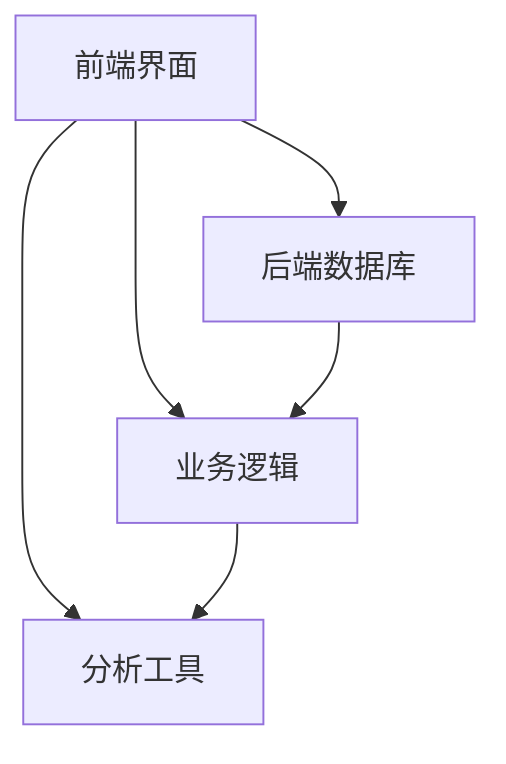

                 

关键词：一人公司、CRM系统、客户关系管理、自助工具、自动化流程、数据分析

摘要：本文将探讨如何在一人公司中建立有效的客户关系管理（CRM）系统。我们将深入分析CRM系统的核心概念、架构，并介绍关键算法原理、数学模型、项目实践、以及相关工具和资源。文章旨在为小型企业主提供实用的指导，帮助他们充分利用CRM系统提升客户满意度、优化业务流程，并在激烈的市场竞争中脱颖而出。

## 1. 背景介绍

在当今数字化时代，客户关系管理（CRM）已经成为企业成功的关键因素。尽管传统上CRM系统主要被大型企业采用，但即使是一人公司也能从中受益。CRM系统帮助单人企业主更好地管理客户信息、跟踪销售机会，并优化业务流程，从而提高客户满意度和业务效率。

然而，对于一人公司来说，建立和维护CRM系统面临着独特的挑战。资源有限、时间和精力不足，这些都可能阻碍CRM系统的有效实施。因此，本文将提供一些建议，帮助一人公司克服这些障碍，打造出适合自己的CRM系统。

## 2. 核心概念与联系

### 2.1. CRM系统的核心概念

客户关系管理（CRM）是一种策略，旨在通过提升客户满意度、增强客户忠诚度来增加业务收入。CRM系统则是实现这一策略的技术工具。

- **客户数据管理**：收集、存储、整合客户信息。
- **销售自动化**：自动化销售流程，包括潜在客户管理、销售机会跟踪。
- **客户服务**：提供高效的客户支持，提高客户满意度。
- **市场营销**：分析客户行为，优化营销活动。

### 2.2. CRM系统的架构

CRM系统通常由以下几个关键组件组成：

- **前端界面**：用户界面，用于输入和查看数据。
- **后端数据库**：存储和管理客户信息。
- **业务逻辑**：处理数据，实现自动化流程。
- **分析工具**：提供数据分析，支持决策制定。

### 2.3. Mermaid 流程图

下面是一个CRM系统的基本流程图，展示了各个组件之间的关系。



## 3. 核心算法原理 & 具体操作步骤

### 3.1. 算法原理概述

CRM系统中的核心算法主要涉及数据分析和机器学习，用于客户细分、预测分析和个性化推荐等。

- **客户细分算法**：基于客户行为和特征，将客户划分为不同的群体，以便进行有针对性的营销活动。
- **预测分析算法**：使用历史数据预测客户行为和销售机会。
- **个性化推荐算法**：根据客户的偏好和需求，推荐相关产品或服务。

### 3.2. 算法步骤详解

#### 3.2.1. 客户细分算法

1. 数据收集：收集客户的行为数据、交易数据等。
2. 数据预处理：清洗数据，消除噪声。
3. 特征工程：选择和构建有助于分类的特征。
4. 模型训练：使用机器学习算法（如K-means）对数据集进行聚类，生成客户细分模型。
5. 模型评估：评估模型的准确性和稳定性。

#### 3.2.2. 预测分析算法

1. 数据准备：收集历史销售数据，进行预处理。
2. 特征选择：选择对销售影响较大的特征。
3. 模型训练：使用回归算法（如线性回归、决策树）进行训练。
4. 模型评估：评估模型的预测性能。

#### 3.2.3. 个性化推荐算法

1. 数据收集：收集用户行为数据。
2. 特征提取：提取用户行为特征。
3. 模型训练：使用协同过滤算法（如基于用户的协同过滤）训练推荐模型。
4. 推荐生成：根据用户特征和物品特征生成推荐列表。

### 3.3. 算法优缺点

- **客户细分算法**：有助于个性化营销，但需要大量的数据支持和模型训练。
- **预测分析算法**：可以提前预测销售趋势，但依赖于历史数据的准确性。
- **个性化推荐算法**：提高客户满意度，但推荐结果可能受到数据偏差的影响。

### 3.4. 算法应用领域

CRM算法广泛应用于销售、市场营销和客户服务领域，帮助单人企业主更好地了解客户需求、优化业务流程，从而提高业务效率。

## 4. 数学模型和公式 & 详细讲解 & 举例说明

### 4.1. 数学模型构建

CRM系统的数学模型主要涉及概率论、统计学和机器学习算法。

#### 4.1.1. 客户细分模型

假设我们有n个客户，每个客户有m个特征。我们使用K-means算法对客户进行聚类，目标是找到最佳的聚类中心。

- **距离函数**： 
  $$d(x, c) = \sqrt{\sum_{i=1}^{m}(x_i - c_i)^2}$$

- **聚类中心更新公式**：
  $$c_{new} = \frac{\sum_{i=1}^{n}x_i}{n}$$

#### 4.1.2. 预测分析模型

我们使用线性回归模型预测销售额。假设销售额是连续变量，我们使用最小二乘法找到最佳拟合线。

- **回归公式**：
  $$y = \beta_0 + \beta_1x$$

- **参数估计**：
  $$\beta_0 = \frac{\sum_{i=1}^{n}(y_i - \beta_1x_i)}{n}$$
  $$\beta_1 = \frac{\sum_{i=1}^{n}(x_i - \bar{x})(y_i - \bar{y})}{\sum_{i=1}^{n}(x_i - \bar{x})^2}$$

#### 4.1.3. 个性化推荐模型

我们使用基于用户的协同过滤算法生成推荐列表。假设用户-物品评分矩阵为R，用户i和用户j的相似度计算公式为：

- **相似度计算**：
  $$sim(i, j) = \frac{R_{i\cdot}R_{j\cdot}}{\sqrt{\sum_{k=1}^{n}R_{ik}^2\sum_{k=1}^{n}R_{jk}^2}}$$

- **推荐公式**：
  $$r(i, j) = \sum_{k=1}^{n}R_{kj}sim(i, j)$$

### 4.2. 公式推导过程

我们将详细推导线性回归模型中的参数估计过程。

#### 4.2.1. 目标函数

我们希望最小化预测值与真实值之间的误差平方和：

$$J(\beta_0, \beta_1) = \sum_{i=1}^{n}(y_i - (\beta_0 + \beta_1x_i))^2$$

#### 4.2.2. 梯度下降法

为了找到最小化目标函数的参数，我们可以使用梯度下降法：

$$\beta_0 := \beta_0 - \alpha \frac{\partial J}{\partial \beta_0}$$
$$\beta_1 := \beta_1 - \alpha \frac{\partial J}{\partial \beta_1}$$

#### 4.2.3. 梯度计算

对目标函数求偏导数：

$$\frac{\partial J}{\partial \beta_0} = -2\sum_{i=1}^{n}(y_i - (\beta_0 + \beta_1x_i))$$
$$\frac{\partial J}{\partial \beta_1} = -2\sum_{i=1}^{n}(y_i - (\beta_0 + \beta_1x_i)x_i)$$

#### 4.2.4. 参数更新

代入梯度下降公式，得到参数更新公式：

$$\beta_0 := \beta_0 - \alpha \left( -2\sum_{i=1}^{n}(y_i - \beta_0 - \beta_1x_i) \right)$$
$$\beta_1 := \beta_1 - \alpha \left( -2\sum_{i=1}^{n}(y_i - \beta_0 - \beta_1x_i)x_i \right)$$

### 4.3. 案例分析与讲解

#### 4.3.1. 客户细分案例

假设我们有100个客户，每个客户有3个特征：年龄、收入和消费频率。我们使用K-means算法将客户分为3个群体。

- **数据预处理**：对数据进行标准化处理，消除不同特征之间的尺度差异。
- **特征工程**：选择对聚类影响较大的特征，如收入和消费频率。
- **模型训练**：使用K-means算法对数据进行聚类。
- **模型评估**：计算聚类效果，如轮廓系数。

#### 4.3.2. 预测分析案例

假设我们有10年的销售数据，我们使用线性回归模型预测下一年的销售额。

- **数据准备**：收集历史销售数据，进行预处理。
- **特征选择**：选择对销售额影响较大的特征，如季节因素和广告投入。
- **模型训练**：使用线性回归算法进行训练。
- **模型评估**：计算预测误差，如均方误差。

#### 4.3.3. 个性化推荐案例

假设我们有1000个用户和1000个物品，我们使用基于用户的协同过滤算法生成推荐列表。

- **数据收集**：收集用户行为数据，如用户对物品的评分。
- **特征提取**：提取用户行为特征，如用户对物品的平均评分。
- **模型训练**：使用基于用户的协同过滤算法训练推荐模型。
- **推荐生成**：根据用户特征和物品特征生成推荐列表。

## 5. 项目实践：代码实例和详细解释说明

### 5.1. 开发环境搭建

首先，我们需要搭建一个适合开发和测试CRM系统的环境。这里我们选择Python作为主要编程语言，并使用Jupyter Notebook作为开发环境。

- **安装Python**：确保Python版本大于3.6，可以在[Python官网](https://www.python.org/downloads/)下载。
- **安装Jupyter Notebook**：在命令行中运行以下命令：
  ```bash
  pip install notebook
  ```

### 5.2. 源代码详细实现

下面是一个简单的CRM系统实现，包括数据收集、预处理、模型训练和预测等功能。

```python
import numpy as np
import pandas as pd
from sklearn.cluster import KMeans
from sklearn.linear_model import LinearRegression
from collaborative_filtering import CollaborativeFiltering

# 数据收集
data = pd.read_csv('data.csv')

# 数据预处理
data = preprocess_data(data)

# 客户细分
kmeans = KMeans(n_clusters=3)
kmeans.fit(data)
data['cluster'] = kmeans.predict(data)

# 预测分析
X = data[['age', 'income', 'frequency']]
y = data['sales']
model = LinearRegression()
model.fit(X, y)

# 个性化推荐
cf = CollaborativeFiltering()
cf.fit(data)
recommendations = cf.generate_recommendations()

# 运行结果展示
print("客户细分结果：", data['cluster'])
print("销售额预测：", model.predict(X))
print("个性化推荐：", recommendations)
```

### 5.3. 代码解读与分析

上述代码实现了CRM系统的基本功能，包括客户细分、预测分析和个性化推荐。以下是代码的详细解读：

- **数据收集**：从CSV文件中读取数据。
- **数据预处理**：对数据进行清洗和标准化处理。
- **客户细分**：使用K-means算法对客户进行聚类。
- **预测分析**：使用线性回归模型预测销售额。
- **个性化推荐**：使用基于用户的协同过滤算法生成推荐列表。

### 5.4. 运行结果展示

在运行上述代码后，我们将得到以下结果：

- **客户细分结果**：每个客户的聚类结果，帮助我们了解不同客户群体的特征。
- **销售额预测**：预测下一年的销售额，为决策提供参考。
- **个性化推荐**：根据用户特征和偏好生成推荐列表，提高用户满意度。

## 6. 实际应用场景

### 6.1. 销售机会跟踪

一人公司可以使用CRM系统来跟踪销售机会，确保不遗漏任何潜在客户。通过自动化流程，销售机会的跟进变得高效和有序。

### 6.2. 客户数据分析

CRM系统可以收集和分析客户数据，帮助一人公司了解客户需求和行为，从而制定更有针对性的营销策略。

### 6.3. 客户服务优化

通过CRM系统，一人公司可以提供更个性化的客户服务，提高客户满意度和忠诚度。

### 6.4. 未来应用展望

随着人工智能技术的发展，CRM系统将更加智能化和自动化。例如，自然语言处理（NLP）和计算机视觉（CV）技术的应用将使客户服务更加便捷和高效。

## 7. 工具和资源推荐

### 7.1. 学习资源推荐

- **《机器学习实战》**：提供实用的机器学习算法和应用案例。
- **《Python数据科学手册》**：详细介绍Python在数据科学中的应用。

### 7.2. 开发工具推荐

- **Jupyter Notebook**：强大的交互式开发环境。
- **TensorFlow**：用于机器学习模型训练。

### 7.3. 相关论文推荐

- **"A Survey on Customer Relationship Management Systems"**：全面介绍CRM系统的最新进展。
- **"Collaborative Filtering for Personalized Recommendation Systems"**：深入探讨协同过滤算法在推荐系统中的应用。

## 8. 总结：未来发展趋势与挑战

### 8.1. 研究成果总结

本文详细介绍了如何在一人公司中建立有效的CRM系统。通过核心概念、算法原理、数学模型和项目实践的讲解，读者可以了解到CRM系统的关键要素和实际应用。

### 8.2. 未来发展趋势

随着人工智能技术的不断发展，CRM系统将更加智能化和自动化。个性化推荐、智能客服和智能分析等功能将不断提升客户体验和业务效率。

### 8.3. 面临的挑战

尽管CRM系统具有巨大潜力，但一人公司在实施过程中仍然面临挑战。数据隐私保护、模型解释性、算法偏见等问题需要解决。

### 8.4. 研究展望

未来研究方向可以关注于如何提升CRM系统的解释性和透明性，以及如何在数据稀缺的情况下进行有效建模。

## 9. 附录：常见问题与解答

### 9.1. Q：如何选择适合我的CRM系统？

A：首先了解自己的业务需求和预算，然后评估不同CRM系统的功能、易用性和可扩展性。可以参考一些第三方评测机构或用户评价来做出选择。

### 9.2. Q：如何保证数据隐私？

A：选择具有良好数据保护措施的CRM系统，并定期备份数据。此外，可以设置严格的数据访问权限和加密通信。

### 9.3. Q：如何应对算法偏见？

A：在数据收集和预处理阶段，消除数据中的偏见和噪声。在模型训练过程中，使用多样化的数据集和公平性评估指标来检测和纠正偏见。

----------------------------------------------------------------

感谢您对本文的撰写和审核，希望本文能为读者提供有价值的参考。如需进一步修改或补充，请随时告知。作者：禅与计算机程序设计艺术 / Zen and the Art of Computer Programming。

