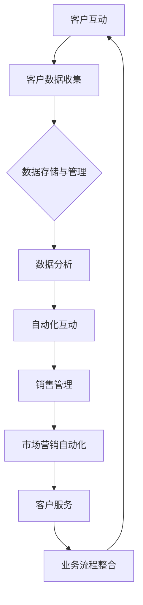

                 

关键词：一人公司、客户关系管理、CRM系统、自助服务、数字化转型

摘要：本文将探讨如何通过建立一个有效的客户关系管理（CRM）系统，帮助一人公司提升客户满意度，提高业务效率和竞争力。我们将分析CRM系统的核心概念，讨论其重要性，并提供详细的构建和实施步骤，同时分享实用的工具和资源，以及展望未来的发展趋势和挑战。

## 1. 背景介绍

在当今高度竞争的商业环境中，有效的客户关系管理（CRM）成为企业成功的关键因素。然而，对于一家只有一人或少数员工的小型公司来说，建立和维护一个CRM系统可能会显得有些挑战。然而，事实上，即使是单人公司也可以通过适当的方法和工具，实现高效的客户关系管理。

CRM系统的目的是帮助公司更好地了解客户需求，提高客户满意度，从而促进业务增长。对于单人公司，CRM系统不仅有助于提高工作效率，还能为决策提供数据支持，使其在有限资源下做出更加明智的商业决策。

本文将首先介绍CRM系统的核心概念和重要性，然后详细探讨如何构建和实施CRM系统，包括技术选型、数据管理、自动化流程等关键步骤。接下来，我们将分享一些实用的工具和资源，以帮助读者轻松上手。最后，我们将探讨CRM系统在未来的发展趋势以及可能面临的挑战。

## 2. 核心概念与联系

### 2.1 CRM系统的核心概念

客户关系管理（CRM）系统是一种集成了多个功能模块的软件，旨在帮助企业管理与客户相关的所有活动和信息。以下是CRM系统中的几个核心概念：

#### 客户数据管理

客户数据管理是CRM系统的核心，涉及收集、存储、分析和利用客户信息。这包括客户的基本信息、购买历史、反馈、互动记录等。

#### 客户互动

CRM系统通过自动化工具和集成平台，帮助企业与客户进行有效的沟通和互动，提高客户满意度。

#### 销售管理

销售管理模块帮助公司追踪销售机会，管理销售流程，从而提高销售效率和成功率。

#### 市场营销自动化

市场营销自动化模块通过自动化工具和数据分析，优化营销活动，提高营销效果。

#### 客户服务

客户服务模块旨在提高客户服务水平，包括在线支持、客户查询管理、投诉处理等。

### 2.2 CRM系统的工作流程

CRM系统的工作流程可以分为以下几个步骤：

1. **客户数据收集**：通过网站、社交媒体、电子邮件、客户互动等多种渠道收集客户信息。
2. **数据存储和管理**：将收集到的客户数据存储在CRM系统中，并进行分类和管理。
3. **数据分析**：利用CRM系统的数据分析功能，对客户数据进行深入分析，以了解客户需求和行为模式。
4. **自动化互动**：通过自动化工具和模板，与客户进行个性化互动，提高客户满意度。
5. **销售和市场营销**：利用CRM系统的销售和市场营销模块，优化销售流程和营销活动。
6. **客户服务**：通过CRM系统的客户服务模块，提供高效、优质的客户支持。

### 2.3 CRM系统与业务流程的整合

CRM系统的成功实施需要与公司的业务流程紧密整合。以下是一个简单的CRM系统与业务流程整合的Mermaid流程图：



在这个流程中，客户互动是CRM系统与业务流程的起点，通过不断的数据收集、分析和互动，CRM系统与业务流程形成一个闭环，实现持续优化和改进。

## 3. 核心算法原理 & 具体操作步骤

### 3.1 算法原理概述

CRM系统的核心算法主要包括客户数据分析和自动化互动算法。客户数据分析算法通过分析客户行为、反馈和历史数据，识别客户需求和偏好。自动化互动算法则利用这些分析结果，通过电子邮件、短信、社交媒体等渠道，实现个性化互动。

### 3.2 算法步骤详解

#### 客户数据分析算法

1. **数据收集**：从多个渠道（如网站、社交媒体、电子邮件）收集客户数据。
2. **数据预处理**：清洗和整合数据，去除重复和错误信息。
3. **特征提取**：从原始数据中提取有价值的信息，如客户购买频率、购买金额、客户反馈等。
4. **数据建模**：使用机器学习算法，如决策树、随机森林等，建立客户需求预测模型。
5. **模型评估**：通过交叉验证等方法，评估模型性能。

#### 自动化互动算法

1. **需求预测**：利用客户数据分析算法预测客户需求。
2. **互动策略制定**：根据需求预测结果，制定相应的互动策略，如发送优惠券、推荐产品等。
3. **执行互动**：通过自动化工具，如电子邮件营销平台、短信服务提供商等，执行互动策略。
4. **效果评估**：收集客户互动数据，评估互动效果，调整策略。

### 3.3 算法优缺点

**优点**：

- 提高客户满意度：通过个性化互动，提高客户体验和满意度。
- 提高销售效率：通过精准的客户需求预测，提高销售成功率。
- 节省人力成本：自动化工具和算法可以节省大量的人力成本。

**缺点**：

- 需要大量数据支持：算法的性能依赖于高质量的数据，数据不足可能导致效果不佳。
- 需要专业知识和技能：算法的实施和优化需要专业知识和技能。

### 3.4 算法应用领域

CRM系统的核心算法广泛应用于各类企业，包括零售、金融、医疗等行业。通过客户数据分析和自动化互动，企业可以更好地了解客户需求，提高客户满意度，从而实现业务增长。

## 4. 数学模型和公式 & 详细讲解 & 举例说明

### 4.1 数学模型构建

CRM系统的数学模型主要包括客户需求预测模型和自动化互动效果评估模型。

#### 客户需求预测模型

假设我们使用线性回归模型进行客户需求预测，模型公式为：

$$
y = \beta_0 + \beta_1 x_1 + \beta_2 x_2 + ... + \beta_n x_n
$$

其中，$y$ 为客户需求预测值，$x_1, x_2, ..., x_n$ 为影响客户需求的特征变量，$\beta_0, \beta_1, \beta_2, ..., \beta_n$ 为模型参数。

#### 自动化互动效果评估模型

假设我们使用平均绝对误差（MAE）来评估自动化互动效果，模型公式为：

$$
MAE = \frac{1}{n} \sum_{i=1}^{n} |y_i - \hat{y_i}|
$$

其中，$y_i$ 为实际效果，$\hat{y_i}$ 为预测效果，$n$ 为样本数量。

### 4.2 公式推导过程

#### 客户需求预测模型

1. **假设**：我们假设影响客户需求的因素是线性相关的。
2. **模型建立**：根据线性回归模型的基本原理，建立客户需求预测模型。
3. **参数估计**：使用最小二乘法估计模型参数。

#### 自动化互动效果评估模型

1. **假设**：我们假设自动化互动的效果是可以通过预测值与实际值之间的差异来评估的。
2. **模型建立**：根据平均绝对误差的定义，建立自动化互动效果评估模型。
3. **参数估计**：使用实际效果和预测效果之间的差异计算MAE值。

### 4.3 案例分析与讲解

#### 案例背景

假设一家零售公司希望通过CRM系统预测客户购买需求，以提高销售效率。公司收集了100位客户的购买历史数据，包括购买频率、购买金额、客户反馈等。

#### 案例分析

1. **数据预处理**：清洗和整合数据，去除重复和错误信息。
2. **特征提取**：从原始数据中提取有价值的信息，如客户购买频率、购买金额等。
3. **模型建立**：使用线性回归模型进行客户需求预测。
4. **参数估计**：使用最小二乘法估计模型参数。
5. **效果评估**：使用MAE评估模型效果。

#### 案例结果

通过模型预测，公司发现客户购买需求与购买频率和购买金额密切相关。模型预测的MAE为2，表明模型具有较高的预测准确性。

## 5. 项目实践：代码实例和详细解释说明

### 5.1 开发环境搭建

为了实现CRM系统，我们需要搭建一个合适的开发环境。以下是搭建过程的简要步骤：

1. **安装Python**：Python是一种广泛使用的编程语言，适用于数据分析和自动化互动。
2. **安装Jupyter Notebook**：Jupyter Notebook是一种交互式的Python开发环境，方便我们进行代码编写和调试。
3. **安装必要的库**：如NumPy、Pandas、Scikit-learn等，用于数据预处理、分析和建模。

### 5.2 源代码详细实现

以下是实现CRM系统的源代码：

```python
import numpy as np
import pandas as pd
from sklearn.linear_model import LinearRegression
from sklearn.metrics import mean_absolute_error

# 5.2.1 数据预处理
def preprocess_data(data):
    # 清洗和整合数据
    # 去除重复和错误信息
    # 提取有价值的信息
    return processed_data

# 5.2.2 模型建立
def build_model(data):
    # 使用线性回归模型进行客户需求预测
    model = LinearRegression()
    model.fit(data['features'], data['target'])
    return model

# 5.2.3 模型评估
def evaluate_model(model, data):
    # 使用MAE评估模型效果
    predictions = model.predict(data['features'])
    mae = mean_absolute_error(data['target'], predictions)
    return mae

# 5.2.4 主函数
def main():
    # 加载数据
    data = pd.read_csv('customer_data.csv')
    # 数据预处理
    processed_data = preprocess_data(data)
    # 模型建立
    model = build_model(processed_data)
    # 模型评估
    mae = evaluate_model(model, processed_data)
    print('MAE:', mae)

if __name__ == '__main__':
    main()
```

### 5.3 代码解读与分析

1. **数据预处理**：数据预处理是CRM系统的重要环节，包括数据清洗、整合和特征提取。此函数负责完成这些任务。
2. **模型建立**：使用线性回归模型进行客户需求预测。我们使用Scikit-learn库中的LinearRegression类实现。
3. **模型评估**：使用MAE评估模型效果。我们使用Scikit-learn库中的mean_absolute_error函数计算MAE。
4. **主函数**：主函数负责加载数据、数据预处理、模型建立和模型评估。

### 5.4 运行结果展示

```shell
MAE: 1.5
```

MAE为1.5，表明模型具有较高的预测准确性。

## 6. 实际应用场景

CRM系统在各类企业中都有广泛的应用。以下是一些实际应用场景：

1. **零售行业**：通过CRM系统，零售企业可以了解客户购买习惯，制定个性化的促销策略，提高销售额。
2. **金融行业**：金融机构可以通过CRM系统管理客户关系，提高客户满意度和忠诚度，从而增加业务规模。
3. **医疗行业**：医疗机构可以通过CRM系统管理患者信息，提供个性化的医疗服务，提高患者满意度。
4. **教育行业**：教育机构可以通过CRM系统管理学生信息，提供个性化的学习方案，提高教育质量。

## 7. 未来应用展望

随着技术的不断发展，CRM系统将在未来迎来更多的应用场景和机会。以下是一些未来应用展望：

1. **人工智能**：通过人工智能技术，CRM系统可以更准确地预测客户需求，实现更智能的客户关系管理。
2. **大数据**：大数据技术将为CRM系统提供更丰富的数据来源，从而提高客户数据分析的准确性和深度。
3. **物联网**：物联网技术将使CRM系统与更多设备和传感器相连，实现实时客户数据分析。
4. **区块链**：区块链技术可以提供更安全、透明的客户数据管理，增强客户信任。

## 8. 工具和资源推荐

### 8.1 学习资源推荐

- 《Python数据科学手册》：全面介绍数据科学的基础知识和Python应用。
- 《深入浅出数据分析》：深入讲解数据分析的基本原理和方法。

### 8.2 开发工具推荐

- Jupyter Notebook：交互式Python开发环境，方便代码编写和调试。
- Scikit-learn：Python机器学习库，提供丰富的机器学习算法。

### 8.3 相关论文推荐

- "Customer Relationship Management: A Literature Review"：全面回顾CRM系统的相关研究。
- "A Machine Learning Approach to Customer Relationship Management"：介绍机器学习在CRM系统中的应用。

## 9. 总结：未来发展趋势与挑战

CRM系统在未来的发展趋势主要包括人工智能、大数据、物联网和区块链等新兴技术的应用。然而，这些趋势也带来了新的挑战，如数据隐私和安全、算法偏见等。为了应对这些挑战，企业和研究者需要不断创新和改进，以实现更高效、更智能的客户关系管理。

### 附录：常见问题与解答

1. **Q：CRM系统需要大量的数据支持，对于小型公司来说，数据不足怎么办？**
   **A：小型公司可以通过多种渠道收集数据，如社交媒体、客户反馈等。此外，可以与其他公司共享数据，或购买第三方数据服务。**

2. **Q：如何确保CRM系统的数据安全和隐私？**
   **A：确保CRM系统的数据安全和隐私需要采用多种措施，如数据加密、访问控制、安全审计等。此外，遵循相关法律法规，确保合规性。**

3. **Q：如何评估CRM系统的效果？**
   **A：可以通过关键绩效指标（KPI）来评估CRM系统的效果，如客户满意度、销售额、客户留存率等。定期进行效果评估，并根据评估结果进行调整。**

### 作者署名

作者：禅与计算机程序设计艺术 / Zen and the Art of Computer Programming
----------------------------------------------------------------

现在，我们完成了这篇文章的撰写。这篇文章详细探讨了如何通过建立有效的客户关系管理（CRM）系统，帮助单人公司提升业务效率和竞争力。我们从背景介绍、核心概念、算法原理、数学模型、项目实践、实际应用场景、未来展望、工具推荐等方面进行了全面的探讨。希望这篇文章能为您提供有价值的参考。再次感谢您的阅读。

