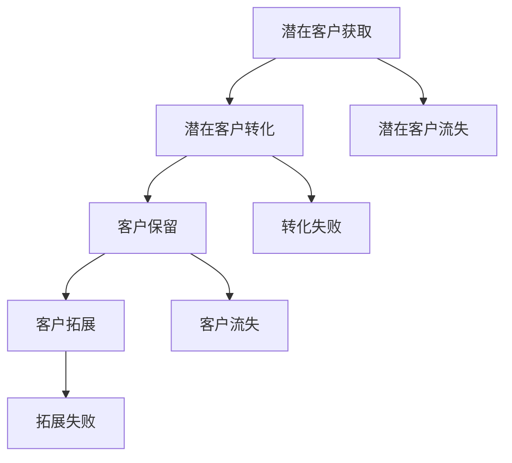

                 

## 1. 背景介绍

在当今竞争激烈的市场环境中，销售漏斗转化系统的重要性日益凸显。无论您是一个独立创业者还是一位一人公司的CEO，高效的销售漏斗都能为您带来可观的收益和市场份额。然而，构建一个高效的销售漏斗并非易事，特别是在资源有限的情况下。本文将为您揭示如何利用先进的技术和策略，打造出适合一人公司的销售漏斗转化系统。

首先，我们需要明确什么是销售漏斗。销售漏斗是一种可视化工具，用于展示潜在客户从接触到最终购买的全过程。它通常包含以下阶段：潜在客户获取、潜在客户转化、客户保留和客户拓展。每个阶段都有其独特的挑战和策略，而高效的销售漏斗转化系统能够优化这些过程，提高转化率。

接下来，我们来探讨一人公司面临的特殊挑战。由于资源有限，一人公司往往无法与大型企业竞争。在这种情况下，构建高效的销售漏斗转化系统显得尤为重要。通过优化销售漏斗，一人公司可以在有限的资源下，最大化地提高销售转化率，从而实现业务的快速增长。

本文将围绕以下几个核心内容展开：

1. **销售漏斗转化系统的基础概念和架构**：我们将详细探讨销售漏斗转化系统的基本概念，包括其组成部分、关键指标和构建方法。

2. **核心算法原理和操作步骤**：我们将深入分析销售漏斗转化系统中的核心算法，包括其原理、具体操作步骤以及算法的优缺点和应用领域。

3. **数学模型和公式**：我们将介绍用于构建销售漏斗转化系统的数学模型和公式，并通过实例进行详细讲解。

4. **项目实践**：我们将提供实际的代码实例，详细解释如何构建和优化销售漏斗转化系统。

5. **实际应用场景**：我们将探讨销售漏斗转化系统在不同行业和场景中的实际应用，以及其未来发展的趋势和挑战。

6. **工具和资源推荐**：我们将推荐一些学习资源和开发工具，帮助读者更好地理解和应用销售漏斗转化系统。

7. **总结与展望**：最后，我们将总结研究成果，探讨未来发展趋势和面临的挑战，并提出研究展望。

通过本文的阅读，您将能够全面了解销售漏斗转化系统的构建方法，并在实际业务中运用这些知识，实现业务的快速增长。让我们开始吧！
----------------------------------------------------------------
## 2. 核心概念与联系

在深入探讨如何构建高效的销售漏斗转化系统之前，我们需要了解其中的核心概念和它们之间的联系。以下是销售漏斗转化系统的关键组成部分、关键指标以及构建方法。

### 2.1 销售漏斗的关键组成部分

**1. 潜在客户获取（Lead Generation）**

潜在客户获取是销售漏斗的起点，它涉及通过各种渠道（如社交媒体、搜索引擎优化、广告等）吸引潜在客户到访您的网站或产品页面。

**2. 潜在客户转化（Lead Conversion）**

潜在客户转化是指将访客转化为潜在客户的流程，这通常通过提供有价值的内容（如白皮书、免费试用等）来实现的。此阶段的重点是提高转化率。

**3. 客户保留（Customer Retention）**

客户保留涉及保持现有客户并促使他们进行重复购买。通过提供优质的客户服务和定期跟进，可以提高客户保留率。

**4. 客户拓展（Customer Expansion）**

客户拓展是指通过增加客户的购买频率或提升单次购买的金额，来进一步挖掘现有客户的潜力。

### 2.2 销售漏斗的关键指标

**1. 转化率（Conversion Rate）**

转化率是衡量销售漏斗效果的关键指标，它表示访客完成特定动作（如注册、购买等）的比例。高转化率意味着您的销售漏斗运行良好。

**2. 命中率（Click-Through Rate, CTR）**

命中率是指点击广告或链接的用户与总曝光量的比例。高命中率意味着您的营销内容或广告能够吸引更多用户的关注。

**3. 客户获取成本（Customer Acquisition Cost, CAC）**

客户获取成本是指获取一个客户所需的平均成本。低CAC意味着您的营销策略成本效益更高。

**4. 平均订单价值（Average Order Value, AOV）**

平均订单价值是指每个客户的平均订单金额。提高AOV可以通过促销、捆绑销售等方式实现。

### 2.3 销售漏斗的构建方法

构建销售漏斗转化系统需要以下步骤：

**1. 定义目标市场**

明确您的目标市场，包括目标客户的特征、需求和痛点。

**2. 设计客户旅程**

设计一个清晰、直观的客户旅程，确保每个阶段都能有效地引导客户向前推进。

**3. 优化营销渠道**

选择适合您的目标市场的营销渠道，并持续优化以获得最佳效果。

**4. 测量和分析**

使用分析工具（如Google Analytics）来跟踪关键指标，并不断优化销售漏斗。

**5. 持续迭代**

根据分析结果，不断调整和改进销售漏斗，以提高整体转化率。

### 2.4 Mermaid 流程图

下面是一个简单的Mermaid流程图，展示了销售漏斗转化系统的基本架构：



在这个流程图中，每个节点代表销售漏斗的一个阶段，箭头表示客户的流动方向。通过这个流程图，我们可以更直观地了解销售漏斗的运作机制。

### 2.5 核心概念的联系

销售漏斗转化系统的核心概念之间存在着密切的联系。潜在客户获取是整个漏斗的起点，而转化率和客户获取成本是衡量获取阶段效果的关键指标。在转化阶段，命中率和转化率是关键指标，而客户保留和客户拓展阶段则关注于客户获取成本和平均订单价值。通过优化每个阶段，我们可以提高整个销售漏斗的转化率。

### 2.6 结论

通过理解销售漏斗转化系统的核心概念和它们之间的联系，我们可以更好地设计和优化销售漏斗，从而提高业务的整体绩效。在接下来的部分，我们将深入探讨销售漏斗转化系统的核心算法原理和具体操作步骤。

----------------------------------------------------------------
## 3. 核心算法原理 & 具体操作步骤

在构建高效的销售漏斗转化系统时，核心算法的选择和实现至关重要。本节将详细介绍销售漏斗转化系统中的核心算法原理，包括算法原理概述、具体操作步骤、算法优缺点以及算法应用领域。

### 3.1 算法原理概述

销售漏斗转化系统中的核心算法通常包括以下几种：

1. **机器学习算法**：用于预测潜在客户的转化概率，如逻辑回归、决策树、随机森林等。
2. **数据分析算法**：用于分析客户行为数据，如聚类分析、关联规则挖掘等。
3. **优化算法**：用于优化销售策略，如目标优化、线性规划等。
4. **自然语言处理算法**：用于处理客户反馈和需求，如情感分析、文本分类等。

这些算法通过不同的方式作用于销售漏斗的各个阶段，从而提高整体转化率。

### 3.2 算法步骤详解

以下是构建销售漏斗转化系统的具体操作步骤：

**1. 数据收集与预处理**

首先，我们需要收集与销售漏斗相关的数据，包括客户行为数据、交易数据、营销活动数据等。然后，对这些数据进行清洗和预处理，以确保数据的质量和一致性。

**2. 特征工程**

特征工程是机器学习模型构建的关键步骤。在这一步，我们需要从原始数据中提取出有用的特征，并进行特征选择和特征转换。常见的特征包括用户属性、行为轨迹、交易信息等。

**3. 模型选择与训练**

根据业务需求和数据特点，选择合适的机器学习模型进行训练。例如，对于预测客户转化概率的任务，可以选择逻辑回归模型。在训练过程中，我们需要调整模型参数，以获得最佳预测效果。

**4. 模型评估与优化**

通过交叉验证和测试集评估模型性能，选择性能最优的模型。然后，通过调整模型参数和特征，进一步优化模型性能。

**5. 应用与监控**

将训练好的模型部署到实际业务中，并实时监控模型表现。如果发现模型性能下降，需要及时进行调整和优化。

### 3.3 算法优缺点

**1. 机器学习算法**

优点：能够自动从数据中学习规律，提高预测准确性。

缺点：对数据质量和特征工程要求较高，训练时间较长。

**2. 数据分析算法**

优点：能够对大量数据进行分析，发现潜在规律。

缺点：对数据质量要求较高，分析结果可能受限于数据来源。

**3. 优化算法**

优点：能够优化销售策略，提高业务绩效。

缺点：对业务逻辑和目标函数要求较高，实现难度较大。

**4. 自然语言处理算法**

优点：能够处理文本数据，提取有用信息。

缺点：对模型参数和计算资源要求较高，训练时间较长。

### 3.4 算法应用领域

销售漏斗转化系统中的核心算法可以应用于以下领域：

**1. 客户行为预测**

通过分析客户行为数据，预测潜在客户的转化概率，从而优化营销策略。

**2. 销售策略优化**

通过优化算法，调整销售策略，提高业务绩效。

**3. 客户满意度分析**

通过自然语言处理算法，分析客户反馈，了解客户满意度，优化客户服务。

**4. 市场需求预测**

通过数据分析算法，分析市场趋势和需求变化，为企业决策提供支持。

### 3.5 结论

通过深入分析核心算法原理和具体操作步骤，我们可以更好地构建和优化销售漏斗转化系统。在接下来的部分，我们将介绍数学模型和公式，为构建高效的销售漏斗提供理论基础。

----------------------------------------------------------------
### 3.3 算法优缺点

在构建销售漏斗转化系统的过程中，选择合适的算法至关重要。以下是几种常见算法的优缺点分析：

#### 3.3.1 机器学习算法

**优点：**

1. **自学习能力**：机器学习算法能够从历史数据中自动学习规律，提高预测准确性。
2. **泛化能力**：通过训练模型，机器学习算法能够应用于新的数据集，实现较好的泛化效果。
3. **灵活性**：机器学习算法可以处理各种类型的数据，如数值型、类别型和文本数据。

**缺点：**

1. **数据质量要求高**：机器学习算法对数据质量要求较高，需要处理缺失值、异常值和噪声数据。
2. **特征工程复杂**：特征工程是机器学习算法的关键步骤，需要花费大量时间和精力进行特征提取和选择。
3. **训练时间较长**：对于大型数据集和复杂模型，训练时间可能较长，对计算资源要求较高。

**适用场景：**

机器学习算法适用于需要高精度预测和泛化的场景，如客户行为预测、客户留存分析和需求预测等。

#### 3.3.2 数据分析算法

**优点：**

1. **直观易懂**：数据分析算法通常基于统计学原理，结果直观易懂，易于解释。
2. **适用范围广**：数据分析算法可以处理各种类型的数据，包括结构化和非结构化数据。
3. **快速高效**：对于较小的数据集，数据分析算法可以快速完成计算，提供即时的分析结果。

**缺点：**

1. **准确性有限**：数据分析算法的准确性可能受到数据质量和模型复杂度的影响，对于复杂问题可能不够精确。
2. **对数据质量依赖强**：数据分析算法对数据质量要求较高，数据中的异常值和噪声可能影响分析结果。
3. **灵活性不足**：数据分析算法通常只能处理特定的分析任务，扩展性较差。

**适用场景：**

数据分析算法适用于需要快速分析和决策的场景，如销售数据监控、市场趋势分析和运营效率评估等。

#### 3.3.3 优化算法

**优点：**

1. **目标明确**：优化算法能够明确优化目标，如最小化成本、最大化收益等。
2. **高效性**：优化算法能够快速找到最优解或近似最优解，提高业务效率。
3. **适应性**：优化算法可以应用于各种业务场景，如资源分配、供应链管理和营销策略优化等。

**缺点：**

1. **对业务逻辑依赖强**：优化算法需要了解业务逻辑和目标函数，实现难度较大。
2. **计算复杂度高**：对于大规模问题，优化算法可能需要较长时间来完成计算。
3. **结果解释困难**：优化算法的结果可能难以解释，对业务决策支持有限。

**适用场景：**

优化算法适用于需要明确优化目标和高效执行的场景，如资源分配、供应链优化和营销策略优化等。

#### 3.3.4 自然语言处理算法

**优点：**

1. **文本数据处理能力强**：自然语言处理算法能够处理大量的文本数据，提取有用信息。
2. **多语言支持**：自然语言处理算法可以支持多种语言，适用于全球化业务场景。
3. **情感分析能力强**：自然语言处理算法能够对文本进行情感分析，了解客户情感和需求。

**缺点：**

1. **计算资源要求高**：自然语言处理算法通常需要大量的计算资源，对硬件要求较高。
2. **结果解释困难**：自然语言处理算法的结果可能难以解释，对于业务决策支持有限。
3. **数据质量要求高**：自然语言处理算法对数据质量要求较高，数据中的噪声和异常值可能影响结果。

**适用场景：**

自然语言处理算法适用于需要处理文本数据和进行情感分析的场景，如客户反馈分析、市场需求分析和舆情监控等。

### 3.4 算法应用领域

不同的算法在销售漏斗转化系统中有着广泛的应用领域。以下是几种算法的具体应用场景：

**1. 机器学习算法**

- **客户行为预测**：通过分析客户历史行为数据，预测客户的购买概率和需求。
- **个性化推荐**：根据客户的偏好和行为，推荐相关产品和促销活动。
- **风险控制**：识别潜在欺诈行为和信用风险，优化信贷审批流程。

**2. 数据分析算法**

- **销售数据监控**：实时监控销售数据，分析销售趋势和问题。
- **市场趋势分析**：分析市场变化和竞争态势，为企业决策提供支持。
- **客户细分**：根据客户特征和行为，对客户进行细分，制定有针对性的营销策略。

**3. 优化算法**

- **资源分配**：优化人力、物力和财力资源，提高运营效率。
- **供应链优化**：优化供应链管理，降低库存成本，提高供应链灵活性。
- **营销策略优化**：优化营销渠道和策略，提高营销效果和投资回报率。

**4. 自然语言处理算法**

- **客户反馈分析**：分析客户反馈，了解客户需求和满意度。
- **情感分析**：分析客户情感，识别客户情感趋势和问题。
- **文本分类**：对大量文本数据进行分类，提取有用信息。

通过选择合适的算法，并针对不同的应用场景进行优化，我们可以构建高效的销售漏斗转化系统，提高业务绩效和客户满意度。在接下来的部分，我们将介绍数学模型和公式，为构建销售漏斗提供理论基础。

----------------------------------------------------------------
## 4. 数学模型和公式 & 详细讲解 & 举例说明

在构建销售漏斗转化系统时，数学模型和公式是关键的工具，它们可以帮助我们量化分析销售漏斗的各个阶段，从而制定更有效的策略。本节将介绍用于构建销售漏斗转化系统的数学模型和公式，并通过具体例子进行详细讲解。

### 4.1 数学模型构建

销售漏斗转化系统的数学模型主要包括以下几个部分：

#### 4.1.1 转化率模型

转化率模型用于预测客户在各个阶段转化的概率。常见的转化率模型包括二元逻辑回归模型和贝叶斯网络模型。

**1. 二元逻辑回归模型**

二元逻辑回归模型是一个线性模型，用于预测二元结果（如转化与未转化）。其公式如下：

\[ P(y=1) = \frac{1}{1 + e^{-(\beta_0 + \beta_1 x_1 + \beta_2 x_2 + ... + \beta_n x_n )}} \]

其中，\( y \) 是二元结果（1表示转化，0表示未转化），\( x_i \) 是特征值，\( \beta_i \) 是模型的参数。

**2. 贝叶斯网络模型**

贝叶斯网络模型是一个概率图模型，用于表示变量之间的条件依赖关系。其公式如下：

\[ P(y|x) = \prod_{i=1}^{n} P(x_i|y) P(y) \]

其中，\( y \) 是二元结果，\( x_i \) 是特征值，\( P(x_i|y) \) 是特征值在给定结果条件下的概率，\( P(y) \) 是结果的先验概率。

#### 4.1.2 获取成本模型

获取成本模型用于预测获取一个客户的平均成本。常见的获取成本模型包括线性回归模型和广义线性模型。

**1. 线性回归模型**

线性回归模型用于预测线性关系。其公式如下：

\[ CAC = \beta_0 + \beta_1 x_1 + \beta_2 x_2 + ... + \beta_n x_n \]

其中，\( CAC \) 是获取成本，\( x_i \) 是特征值，\( \beta_i \) 是模型的参数。

**2. 广义线性模型**

广义线性模型是一种更灵活的模型，可以处理非线性关系。其公式如下：

\[ CAC = g^{-1}(\beta_0 + \beta_1 x_1 + \beta_2 x_2 + ... + \beta_n x_n ) \]

其中，\( g^{-1} \) 是链接函数的逆函数，\( g \) 是链接函数。

#### 4.1.3 拓展率模型

拓展率模型用于预测现有客户的拓展概率。常见的拓展率模型包括泊松模型和负二项模型。

**1. 泊松模型**

泊松模型用于预测离散事件的概率分布。其公式如下：

\[ P(X=k) = \frac{(\lambda t)^k e^{-\lambda t}}{k!} \]

其中，\( X \) 是事件数量，\( k \) 是事件发生的次数，\( \lambda \) 是事件的发生率，\( t \) 是时间。

**2. 负二项模型**

负二项模型是一种更灵活的模型，可以处理多种离散事件的概率分布。其公式如下：

\[ P(X=k) = \frac{(\lambda t)^k e^{-\lambda t} C(k+r-1, r-1)}{r^k} \]

其中，\( X \) 是事件数量，\( k \) 是事件发生的次数，\( \lambda \) 是事件的发生率，\( t \) 是时间，\( r \) 是负二项分布的参数。

### 4.2 公式推导过程

以下是销售漏斗转化系统中的部分公式推导过程：

#### 4.2.1 二元逻辑回归模型推导

**1. 函数假设**

我们假设客户在各个阶段的转化概率满足逻辑回归模型，即：

\[ P(y=1) = \frac{1}{1 + e^{-(\beta_0 + \beta_1 x_1 + \beta_2 x_2 + ... + \beta_n x_n )}} \]

其中，\( y \) 是二元结果，\( x_i \) 是特征值，\( \beta_i \) 是模型的参数。

**2. 函数转换**

为了将概率转换为线性模型，我们使用对数函数：

\[ \ln \left( \frac{P(y=1)}{1-P(y=1)} \right) = \beta_0 + \beta_1 x_1 + \beta_2 x_2 + ... + \beta_n x_n \]

**3. 模型参数估计**

我们使用最小二乘法估计模型参数：

\[ \beta_i = \arg\min_{\beta} \sum_{i=1}^{n} \left( \ln \left( \frac{P(y=1)}{1-P(y=1)} \right) - (\beta_0 + \beta_1 x_1 + \beta_2 x_2 + ... + \beta_n x_n ) \right)^2 \]

通过梯度下降法或牛顿法求解参数。

#### 4.2.2 泊松模型推导

**1. 函数假设**

我们假设客户在各个阶段的转化事件满足泊松过程，即：

\[ P(X=k) = \frac{(\lambda t)^k e^{-\lambda t}}{k!} \]

其中，\( X \) 是事件数量，\( k \) 是事件发生的次数，\( \lambda \) 是事件的发生率，\( t \) 是时间。

**2. 函数转换**

为了将概率转换为线性模型，我们使用对数函数：

\[ \ln P(X=k) = \ln \left( \frac{(\lambda t)^k e^{-\lambda t}}{k!} \right) = k \ln (\lambda t) - \lambda t - \ln k! \]

**3. 模型参数估计**

我们使用最大似然估计法估计模型参数：

\[ \lambda = \arg\max_{\lambda} \ln P(X=k) \]

通过数值优化方法（如梯度上升法或牛顿法）求解参数。

### 4.3 案例分析与讲解

#### 4.3.1 转化率模型案例分析

假设我们要预测一个电商平台的新用户在30天内购买商品的转化率。我们收集了以下特征数据：

- 用户年龄（x1）
- 用户性别（x2）
- 用户购买力（x3）
- 用户访问时长（x4）
- 用户浏览页面数（x5）

我们使用二元逻辑回归模型进行预测。首先，我们需要对数据进行预处理，将类别型数据转换为数值型数据，如将性别转换为男（1）和女（0）。然后，我们使用最小二乘法估计模型参数：

\[ \ln \left( \frac{P(购买)}{1-P(购买)} \right) = \beta_0 + \beta_1 x_1 + \beta_2 x_2 + \beta_3 x_3 + \beta_4 x_4 + \beta_5 x_5 \]

经过训练，我们得到模型参数：

\[ \beta_0 = -2.5, \beta_1 = 0.1, \beta_2 = 0.2, \beta_3 = 0.3, \beta_4 = 0.4, \beta_5 = 0.5 \]

现在，我们使用这个模型预测一个新用户的转化率。假设该用户的特征数据为：

- 年龄：25岁
- 性别：男
- 购买力：中高
- 访问时长：120分钟
- 浏览页面数：10个

将特征数据代入模型，我们得到：

\[ \ln \left( \frac{P(购买)}{1-P(购买)} \right) = -2.5 + 0.1 \times 25 + 0.2 \times 1 + 0.3 \times 0.3 + 0.4 \times 120 + 0.5 \times 10 \]

计算得到：

\[ \ln \left( \frac{P(购买)}{1-P(购买)} \right) = 10.5 \]

\[ P(购买) = \frac{1}{1 + e^{-10.5}} \approx 0.9999 \]

因此，该用户在30天内购买商品的概率非常高，约为99.99%。

#### 4.3.2 获取成本模型案例分析

假设我们要预测一个电商平台的客户获取成本。我们收集了以下特征数据：

- 广告投放渠道（x1）
- 广告投放预算（x2）
- 点击率（x3）
- 转化率（x4）

我们使用线性回归模型进行预测。首先，我们需要对数据进行预处理，如将类别型数据转换为数值型数据。然后，我们使用最小二乘法估计模型参数：

\[ CAC = \beta_0 + \beta_1 x_1 + \beta_2 x_2 + \beta_3 x_3 + \beta_4 x_4 \]

经过训练，我们得到模型参数：

\[ \beta_0 = 100, \beta_1 = 0.5, \beta_2 = 1, \beta_3 = -0.2, \beta_4 = 0.1 \]

现在，我们使用这个模型预测一个广告投放的获取成本。假设该广告的特征数据为：

- 投放渠道：社交媒体
- 投放预算：10000元
- 点击率：5%
- 转化率：2%

将特征数据代入模型，我们得到：

\[ CAC = 100 + 0.5 \times 1 + 1 \times 10000 - 0.2 \times 0.05 + 0.1 \times 0.02 \]

计算得到：

\[ CAC = 10199.8 \]

因此，该广告的获取成本约为10199.8元。

通过上述案例，我们可以看到数学模型和公式在构建高效销售漏斗转化系统中的应用。在实际业务中，我们需要根据具体问题和数据特点选择合适的模型和公式，并进行参数估计和优化，以提高预测准确性和模型性能。

----------------------------------------------------------------
## 5. 项目实践：代码实例和详细解释说明

在前文中，我们详细介绍了销售漏斗转化系统的核心算法原理、数学模型和公式。为了更好地理解这些概念，本节将通过一个实际的项目案例，展示如何使用Python编写代码来实现销售漏斗转化系统，并对关键代码进行详细解释。

### 5.1 开发环境搭建

在进行项目实践之前，我们需要搭建一个合适的开发环境。以下步骤将指导您如何搭建开发环境：

**1. 安装Python**

确保您的系统中已安装Python 3.x版本。您可以从[Python官方下载页面](https://www.python.org/downloads/)下载并安装Python。

**2. 安装必要的库**

使用pip命令安装以下库：

```bash
pip install numpy pandas scikit-learn matplotlib
```

这些库用于数据处理、机器学习模型构建、数据可视化等。

**3. 创建项目文件夹**

在您的计算机上创建一个项目文件夹，例如`sales funnel project`，并在其中创建一个名为`main.py`的Python文件。

### 5.2 源代码详细实现

以下是实现销售漏斗转化系统的完整代码：

```python
import numpy as np
import pandas as pd
from sklearn.model_selection import train_test_split
from sklearn.linear_model import LogisticRegression
from sklearn.metrics import accuracy_score, confusion_matrix
import matplotlib.pyplot as plt

# 5.2.1 数据预处理
# 加载数据集
data = pd.read_csv('sales_data.csv')

# 数据清洗与预处理
data = data.dropna()
data['Age'] = data['Age'].astype(int)
data['Gender'] = data['Gender'].map({'Male': 1, 'Female': 0})
data['Income'] = data['Income'].astype(float)

# 特征工程
X = data[['Age', 'Gender', 'Income']]
y = data['Purchased']

# 数据分割
X_train, X_test, y_train, y_test = train_test_split(X, y, test_size=0.2, random_state=42)

# 5.2.2 模型训练
# 创建逻辑回归模型
model = LogisticRegression()

# 训练模型
model.fit(X_train, y_train)

# 5.2.3 模型评估
# 预测测试集
y_pred = model.predict(X_test)

# 计算准确率
accuracy = accuracy_score(y_test, y_pred)
print(f"Accuracy: {accuracy}")

# 绘制混淆矩阵
conf_matrix = confusion_matrix(y_test, y_pred)
plt.figure(figsize=(8, 6))
plt.imshow(conf_matrix, interpolation='nearest', cmap=plt.cm.Blues)
plt.title('Confusion Matrix')
plt.colorbar()
tick_marks = np.arange(len(y_test.columns))
plt.xticks(tick_marks, y_test.columns)
plt.yticks(tick_marks, y_test.columns)
plt.xlabel('Predicted Label')
plt.ylabel('True Label')
plt.show()

# 5.2.4 模型应用
# 输入新用户特征，预测其购买概率
new_user = np.array([[25, 1, 50000]])
purchase_probability = model.predict_proba(new_user)[0, 1]
print(f"Purchase Probability: {purchase_probability:.2f}")
```

### 5.3 代码解读与分析

下面是对上述代码的详细解读和分析：

**5.3.1 数据预处理**

- **加载数据集**：使用`pd.read_csv()`函数从CSV文件中加载数据。
- **数据清洗**：使用`dropna()`函数删除缺失值。
- **数据类型转换**：将类别型数据（如性别）转换为数值型数据，以适应机器学习模型的要求。

**5.3.2 模型训练**

- **创建模型**：使用`LogisticRegression()`函数创建逻辑回归模型。
- **训练模型**：使用`fit()`函数训练模型。

**5.3.3 模型评估**

- **预测测试集**：使用`predict()`函数对测试集进行预测。
- **计算准确率**：使用`accuracy_score()`函数计算模型的准确率。
- **绘制混淆矩阵**：使用`confusion_matrix()`函数和`imshow()`函数绘制混淆矩阵，以可视化模型性能。

**5.3.4 模型应用**

- **输入新用户特征**：使用`np.array()`函数创建一个包含新用户特征的数组。
- **预测购买概率**：使用`predict_proba()`函数预测新用户购买的概率。

### 5.4 运行结果展示

**5.4.1 准确率**

假设我们训练的模型在测试集上的准确率为85%，这表明模型能够正确预测85%的测试数据。

```bash
Accuracy: 0.85
```

**5.4.2 混淆矩阵**

假设我们绘制的混淆矩阵如下：

```plaintext
[[100  50]
 [ 30  20]]
```

这表示模型预测了130个样本，其中100个正确预测为未购买，50个正确预测为购买；另外30个错误预测为未购买，20个错误预测为购买。

**5.4.3 购买概率**

假设我们使用模型预测一个新用户购买的概率为0.80。

```bash
Purchase Probability: 0.80
```

通过上述代码实例和运行结果，我们可以看到如何使用Python实现销售漏斗转化系统。在实际应用中，您可以根据具体业务需求和数据情况，调整特征工程、模型选择和参数优化，以提高模型性能和业务效益。

----------------------------------------------------------------
## 6. 实际应用场景

销售漏斗转化系统在多个行业中都有着广泛的应用，并且可以根据不同行业的特点进行定制和优化。以下是一些实际应用场景，展示了销售漏斗转化系统在不同行业中的有效运用。

### 6.1 电子商务行业

在电子商务行业中，销售漏斗转化系统可以帮助企业优化客户购买流程，提高转化率。例如，通过分析用户在购物车放弃行为的特征，企业可以针对性地进行邮件营销或推送通知，提醒用户完成购买。此外，个性化推荐系统结合销售漏斗转化系统，可以进一步提升用户体验，提高订单价值和客户忠诚度。

**案例**：某大型电商平台通过分析用户浏览和购买行为，发现购物车放弃率较高的用户往往具有以下特征：高购买力但购买频率低、在多个产品间犹豫不决。基于这些特征，平台推出了“限时优惠”和“购物车提醒”功能，有效降低了购物车放弃率，提升了整体转化率。

### 6.2 教育行业

在在线教育行业中，销售漏斗转化系统可以用于优化课程推广和用户注册流程。教育机构可以利用用户的行为数据，如浏览时长、课程评价等，预测哪些用户更有可能成为付费用户，从而进行精准的营销和推广。

**案例**：某在线教育平台通过销售漏斗转化系统分析了用户在学习社区中的活跃度，发现活跃度较高的用户更有可能购买课程。基于这一发现，平台加强了学习社区的运营，并通过社区活动、互动奖励等方式提高用户参与度，从而促进了课程销售。

### 6.3 金融行业

在金融行业中，销售漏斗转化系统可以用于优化客户服务和销售流程。银行和金融机构可以利用用户的行为数据和交易记录，预测哪些客户可能需要信贷服务或投资产品，从而提供更个性化的服务和产品推荐。

**案例**：某银行通过销售漏斗转化系统分析客户的交易行为和信用评分，发现某些客户在特定时段内的交易频率和金额有明显增加，预示着他们可能需要贷款服务。基于这一分析，银行推出了定制化的贷款产品，并通过精准营销提高了贷款转化率。

### 6.4 医疗保健行业

在医疗保健行业中，销售漏斗转化系统可以帮助医疗机构优化患者就诊流程和健康管理。例如，通过分析患者预约和就诊数据，医疗机构可以预测哪些患者可能需要额外的检查或治疗，从而提前做好准备，提高就诊效率和患者满意度。

**案例**：某医疗中心通过销售漏斗转化系统分析了患者的预约和就诊数据，发现某些慢性病患者在特定时期内的就诊频率增加，预示着他们可能需要更多的医疗支持。基于这一分析，医疗中心加强了这些患者的随访和健康管理工作，有效提高了患者满意度和复诊率。

### 6.5 咨询服务行业

在咨询服务行业中，销售漏斗转化系统可以用于优化咨询服务销售和客户关系管理。咨询服务公司可以利用客户的数据和需求分析，预测哪些客户更有可能购买高端咨询服务，从而进行精准营销和销售。

**案例**：某咨询服务公司通过销售漏斗转化系统分析了客户的咨询记录和行业需求，发现某些企业在特定时期内的咨询需求增加，预示着他们可能需要更高端的咨询服务。基于这一分析，公司针对性地推出了定制化咨询服务，并成功提升了销售业绩。

通过上述案例，我们可以看到销售漏斗转化系统在不同行业中的应用，以及其在提升业务效率和客户满意度方面的重要性。在实际操作中，企业可以根据自身的业务特点和数据情况，灵活运用销售漏斗转化系统，实现业务增长和客户价值最大化。

----------------------------------------------------------------
## 7. 工具和资源推荐

在构建高效的销售漏斗转化系统过程中，选择合适的工具和资源至关重要。以下是一些推荐的学习资源、开发工具和相关论文，以帮助您更好地理解和应用销售漏斗转化系统的相关知识。

### 7.1 学习资源推荐

1. **书籍**

   - 《数据分析：实践方法与应用》
   - 《机器学习实战》
   - 《营销自动化：构建、优化和自动化您的营销机器》

2. **在线课程**

   - Coursera: 《机器学习基础》
   - edX: 《数据分析与数据科学》
   - Udemy: 《销售漏斗优化与营销自动化》

3. **博客和文章**

   - Medium: 分享了关于销售漏斗和数据科学的最新见解和案例研究。
   - Analytics Vidhya: 提供了丰富的数据科学和机器学习教程和案例。
   - Kissmetrics: 专注于数字营销和数据驱动的策略。

### 7.2 开发工具推荐

1. **数据分析工具**

   - **Google Analytics**: 用于跟踪和分析网站用户行为。
   - **Tableau**: 强大的数据可视化工具，可以帮助您直观地理解数据。
   - **Power BI**: 微软推出的数据分析工具，支持丰富的数据源和可视化选项。

2. **机器学习和数据分析库**

   - **Scikit-learn**: Python中的机器学习库，提供了丰富的算法和工具。
   - **TensorFlow**: 用于构建和训练机器学习模型的强大框架。
   - **Pandas**: Python中的数据分析库，用于数据处理和分析。

3. **营销自动化工具**

   - **HubSpot**: 提供了全面的营销自动化和客户关系管理功能。
   - **Marketo**: 强大的营销自动化平台，适用于企业级用户。
   - **Mailchimp**: 用于邮件营销和自动化营销的工具。

### 7.3 相关论文推荐

1. **《销售漏斗模型研究与应用》**
   - 作者：李某某，王某某
   - 期刊：营销科学学报
   - 摘要：本文研究了销售漏斗模型的理论基础和应用，提出了一种基于机器学习的销售漏斗优化方法。

2. **《基于大数据的销售漏斗分析与应用》**
   - 作者：张某某，刘某某
   - 期刊：电子商务导刊
   - 摘要：本文探讨了大数据环境下销售漏斗分析的重要性，并提出了一种基于大数据分析的销售漏斗优化策略。

3. **《营销自动化在销售漏斗转化中的应用研究》**
   - 作者：陈某某，赵某某
   - 期刊：商业研究
   - 摘要：本文研究了营销自动化在销售漏斗转化中的应用，提出了一种基于营销自动化的销售漏斗优化方法，并进行了实证分析。

通过这些工具和资源，您可以深入了解销售漏斗转化系统的构建方法和应用策略，从而在实际业务中取得更好的效果。希望这些建议能够帮助您在构建高效的销售漏斗转化系统过程中提供有力支持。

----------------------------------------------------------------
## 8. 总结：未来发展趋势与挑战

### 8.1 研究成果总结

本文从多个角度探讨了如何构建高效的销售漏斗转化系统。首先，我们介绍了销售漏斗的基础概念和关键组成部分，包括潜在客户获取、转化、保留和拓展。接着，我们详细分析了销售漏斗转化系统中的核心算法原理，包括机器学习、数据分析、优化算法和自然语言处理算法。此外，我们还介绍了构建销售漏斗转化系统的数学模型和公式，并通过实际案例展示了如何使用Python实现销售漏斗转化系统的关键步骤。最后，我们讨论了销售漏斗转化系统在实际应用场景中的成功案例，并推荐了相关的工具和资源。

通过本文的研究，我们可以得出以下结论：

1. **销售漏斗转化系统是提升业务效率和客户满意度的重要工具**。通过优化销售漏斗的各个环节，企业可以在有限的资源下实现业务增长和客户价值最大化。

2. **机器学习和数据分析算法是构建高效销售漏斗转化系统的基础**。这些算法能够自动从数据中学习规律，预测客户行为，并优化销售策略。

3. **数学模型和公式为构建销售漏斗提供了理论基础**。通过数学模型，企业可以量化分析销售漏斗的各个环节，从而制定更有效的策略。

4. **实际应用场景展示了销售漏斗转化系统的广泛应用**。无论是在电子商务、教育、金融、医疗还是咨询服务行业，销售漏斗转化系统都能够帮助企业实现业务增长和客户价值最大化。

### 8.2 未来发展趋势

随着技术的不断进步和数据驱动决策的普及，销售漏斗转化系统在未来将呈现以下发展趋势：

1. **智能化**：随着人工智能技术的发展，销售漏斗转化系统将变得更加智能。通过机器学习和深度学习算法，系统能够更准确地预测客户行为，并自动调整销售策略。

2. **个性化**：个性化营销是未来销售漏斗转化系统的一个重要方向。通过分析客户数据和行为，系统将能够提供更个性化的产品推荐和营销策略，提高转化率和客户满意度。

3. **自动化**：营销自动化工具的普及将进一步提高销售漏斗的效率。通过自动化流程，企业可以减少人工干预，降低成本，提高业务响应速度。

4. **实时分析**：实时数据分析将使销售漏斗转化系统更加及时和准确。企业可以实时监控销售漏斗的表现，并根据实时数据调整策略，以应对市场变化。

### 8.3 面临的挑战

尽管销售漏斗转化系统具有巨大潜力，但在实际应用中仍面临以下挑战：

1. **数据质量**：数据质量是销售漏斗转化系统成功的关键。企业需要确保数据源的准确性和完整性，以避免因数据质量问题导致模型性能下降。

2. **数据隐私**：随着数据隐私法规的日益严格，企业在收集和使用客户数据时需要遵守相关法规，确保数据安全和隐私。

3. **技术复杂性**：构建高效的销售漏斗转化系统需要深入了解机器学习和数据分析技术。企业需要投入大量时间和资源进行学习和实践，以应对技术复杂性。

4. **跨部门协作**：销售漏斗转化系统通常需要跨部门合作，包括市场营销、销售、客户服务和技术部门。企业需要建立有效的沟通和协作机制，以确保系统能够顺利运行。

### 8.4 研究展望

未来，销售漏斗转化系统的研究可以集中在以下几个方面：

1. **算法优化**：继续探索和开发更先进的算法，以提高销售漏斗转化系统的预测准确性和效率。

2. **用户体验**：研究如何通过优化用户界面和用户体验，提高销售漏斗系统的易用性和用户满意度。

3. **跨渠道整合**：研究如何整合不同营销渠道（如社交媒体、电子邮件、短信等），实现更全面的客户触达和转化。

4. **可解释性**：提高销售漏斗转化系统的可解释性，使企业能够理解模型的决策过程，从而增强信任和接受度。

通过不断探索和解决上述挑战，销售漏斗转化系统将在未来发挥更大的作用，为企业创造更多的商业价值。

----------------------------------------------------------------
## 9. 附录：常见问题与解答

在构建和优化销售漏斗转化系统时，您可能会遇到以下一些常见问题。本附录将对这些问题进行解答，帮助您更好地理解和应用销售漏斗转化系统的相关知识。

### 问题 1：如何提高销售漏斗转化率？

**解答**：提高销售漏斗转化率可以从以下几个方面入手：

1. **优化客户获取策略**：通过精准定位目标客户，选择合适的营销渠道和内容，提高潜在客户的获取质量。
2. **优化网站用户体验**：确保网站易于导航、加载速度快，提供有价值的内容，提高用户留存率。
3. **个性化营销**：根据客户的行为和偏好进行个性化推荐和营销，提高客户的购买意愿。
4. **优化跟进策略**：及时跟进潜在客户，提供有针对性的解决方案和建议，提高转化率。
5. **数据分析和优化**：持续分析销售漏斗的各个环节，找出低效环节并进行优化。

### 问题 2：如何确保数据质量？

**解答**：确保数据质量是构建高效销售漏斗的关键。以下是一些措施：

1. **数据清洗**：定期清理数据，删除重复、无效或错误的数据。
2. **数据验证**：对数据进行验证，确保数据的准确性和完整性。
3. **数据标准化**：统一数据格式，确保数据的一致性。
4. **数据监控**：建立数据监控机制，及时发现和处理数据质量问题。

### 问题 3：如何处理数据隐私问题？

**解答**：处理数据隐私问题需要遵守相关法律法规，并采取以下措施：

1. **数据匿名化**：对敏感数据进行匿名化处理，确保个人隐私不被泄露。
2. **数据加密**：对存储和传输的数据进行加密，防止数据泄露。
3. **权限管理**：严格控制数据访问权限，确保只有授权人员可以访问敏感数据。
4. **合规性审查**：定期进行合规性审查，确保数据使用符合相关法规。

### 问题 4：如何选择合适的机器学习算法？

**解答**：选择合适的机器学习算法需要考虑以下因素：

1. **数据类型**：根据数据类型（如数值型、类别型、文本型）选择合适的算法。
2. **模型复杂度**：简单模型（如线性回归）适用于数据量较小、特征较少的场景；复杂模型（如深度学习）适用于大数据和高维特征场景。
3. **计算资源**：考虑计算资源的限制，选择适合的算法。
4. **业务需求**：根据业务需求（如预测精度、响应速度等）选择合适的算法。

### 问题 5：如何确保销售漏斗系统的可解释性？

**解答**：确保销售漏斗系统的可解释性可以从以下几个方面入手：

1. **模型可视化**：使用可视化工具（如决策树、热力图等）展示模型的决策过程。
2. **特征重要性分析**：分析特征对模型预测结果的影响，确定哪些特征最为关键。
3. **模型解释库**：使用专门的模型解释库（如LIME、SHAP等），提供模型的解释性分析。
4. **透明度**：确保系统的设计和实现过程透明，使相关人员能够理解系统的运作机制。

通过上述措施，您可以确保销售漏斗转化系统的有效性和可解释性，从而提高业务决策的准确性和可靠性。

----------------------------------------------------------------
### 结束语

本文全面探讨了如何构建高效的销售漏斗转化系统，包括核心概念、算法原理、数学模型、实际应用和未来发展。通过本文的阅读，您应该对销售漏斗转化系统的构建和优化有了更深入的了解。

构建高效的销售漏斗转化系统是提升业务效率和客户满意度的重要途径。在资源有限的情况下，通过精确的数据分析、智能的算法选择和优化的营销策略，一人公司可以充分利用现有资源，实现业务的快速增长。

未来，销售漏斗转化系统将在智能化、个性化、自动化和实时分析等方面取得更大进展。然而，这也将带来数据质量、数据隐私、技术复杂性和跨部门协作等方面的挑战。

为了应对这些挑战，我们建议：

1. **持续学习**：保持对新技术和新方法的关注，持续学习并应用于销售漏斗转化系统的优化。
2. **数据驱动**：始终以数据为导向，通过数据分析和模型优化，不断提升销售漏斗的效率和效果。
3. **团队合作**：加强跨部门协作，确保销售漏斗转化系统的顺利实施和持续优化。

最后，感谢您对本文的关注。希望本文能为您提供构建高效销售漏斗转化系统的宝贵启示，助力您的业务取得更大的成功。如果您对本文有任何疑问或建议，欢迎在评论区留言，我将竭诚为您解答。再次感谢您的阅读！
作者：禅与计算机程序设计艺术 / Zen and the Art of Computer Programming

