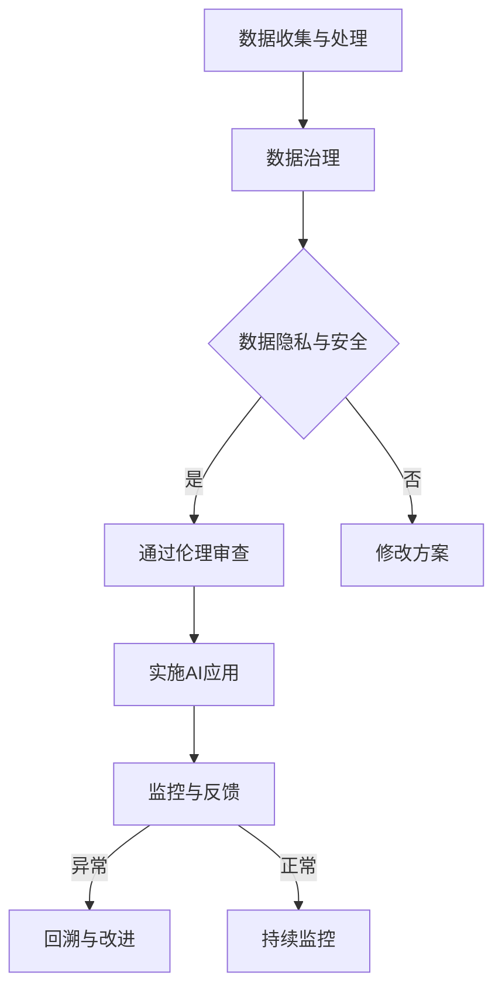

                 

在当今快速发展的科技时代，人工智能（AI）已成为推动社会进步的重要力量。然而，随着AI技术的广泛应用，其伦理问题也日益凸显。对于一家一人公司来说，如何在创新与责任之间取得平衡，确保AI技术的伦理合规性，成为了一个迫切需要解决的问题。本文将围绕这一主题，探讨AI伦理考量的重要性，以及如何在实践中实现这一平衡。

## 1. 背景介绍

随着云计算、大数据、物联网等技术的快速发展，人工智能迎来了前所未有的机遇。AI技术的应用场景从最初的工业自动化、智能语音助手，逐渐扩展到医疗、金融、教育等多个领域。然而，AI技术的迅猛发展也带来了诸多伦理问题，如数据隐私、算法偏见、安全风险等。这些问题不仅关乎技术本身，更涉及到社会、法律、伦理等多个层面。

一人公司，是指由一位创始人或合伙人独自经营的企业。这类公司通常规模较小，但往往能够迅速响应市场变化，具有强大的创新能力和灵活性。在AI领域，一人公司由于其独特的运营模式，面临着与传统企业不同的伦理挑战。一方面，一人公司需要承担起企业社会责任，确保AI技术的合规性和道德性；另一方面，公司又需要在激烈的竞争环境中保持创新，推动技术进步。

## 2. 核心概念与联系

### 2.1 AI伦理的概念

AI伦理，是指从伦理角度对人工智能技术及其应用进行研究和评估。AI伦理涵盖了多个方面，包括数据隐私、算法公正性、安全风险等。其核心目的是确保AI技术的应用不会对社会、环境和人类产生负面影响。

### 2.2 创新与责任的平衡

创新与责任的平衡是AI伦理考量的核心问题。一方面，创新是推动技术进步的关键，能够带来巨大的经济和社会价值；另一方面，责任是保障技术伦理合规性的基石，需要确保AI技术的应用不会损害公众利益。如何在这两者之间取得平衡，成为了一人公司面临的重大挑战。

### 2.3 AI伦理的架构

AI伦理的架构包括多个层次，从基础的数据治理到高级的伦理审查。数据治理是确保数据隐私和安全的基础，需要建立完善的数据管理机制；伦理审查则是对AI技术应用进行伦理评估和监督，确保其合规性和道德性。

### 2.4 Mermaid流程图

以下是一个简化的AI伦理考量流程图：



## 3. 核心算法原理 & 具体操作步骤

### 3.1 算法原理概述

AI伦理考量需要依靠多种算法和技术，包括数据治理、伦理审查、监控与反馈等。以下是这些算法的基本原理：

- **数据治理**：通过对数据进行分类、标签化和管理，确保数据隐私和安全。
- **伦理审查**：利用伦理模型对AI应用进行评估，确保其符合道德规范。
- **监控与反馈**：通过持续监控AI应用的运行状态，及时发现和解决问题。

### 3.2 算法步骤详解

1. **数据收集与处理**：收集相关数据，并进行预处理，如去噪、归一化等。
2. **数据治理**：对数据进行分类和标签化，建立数据管理机制，确保数据隐私和安全。
3. **伦理审查**：利用伦理模型对AI应用进行评估，包括数据隐私、算法公正性、安全风险等方面。
4. **实施AI应用**：根据伦理审查结果，实施AI应用，并进行监控。
5. **监控与反馈**：对AI应用的运行状态进行监控，收集反馈信息，发现潜在问题。
6. **回溯与改进**：根据监控和反馈结果，回溯问题，并改进AI应用。

### 3.3 算法优缺点

- **优点**：能够确保AI技术的伦理合规性，降低风险。
- **缺点**：需要大量资源和时间进行数据治理和伦理审查，可能导致应用延迟。

### 3.4 算法应用领域

AI伦理考量算法可以应用于多个领域，如医疗、金融、教育等。以下是几个典型的应用场景：

- **医疗**：确保医疗AI系统不会泄露患者隐私，同时提高诊断和治疗的准确性。
- **金融**：确保金融AI系统能够公平、公正地处理交易和风险评估。
- **教育**：确保教育AI系统不会对学生产生偏见，同时提高教学效果。

## 4. 数学模型和公式 & 详细讲解 & 举例说明

### 4.1 数学模型构建

在AI伦理考量中，常用的数学模型包括数据隐私保护模型、算法公正性模型等。以下是一个简化的数据隐私保护模型：

$$
\text{隐私保护} = f(\text{数据保密性}, \text{数据可用性}, \text{数据完整性})
$$

其中，数据保密性、数据可用性和数据完整性分别代表数据隐私的三个关键方面。

### 4.2 公式推导过程

数据隐私保护模型的推导过程可以分为三个步骤：

1. **定义变量**：设定数据保密性、数据可用性和数据完整性的具体指标。
2. **建立关系**：通过分析数据隐私的影响因素，建立变量之间的关系。
3. **构建公式**：将变量之间的关系转化为数学公式，形成数据隐私保护模型。

### 4.3 案例分析与讲解

假设一个医疗AI系统需要保护患者的隐私，以下是一个简单的案例分析：

1. **定义变量**：
   - 数据保密性：患者信息是否被未经授权的第三方访问。
   - 数据可用性：医生是否能够方便地访问患者信息，进行诊断和治疗。
   - 数据完整性：患者信息是否被篡改或丢失。

2. **建立关系**：
   - 数据保密性与数据完整性正相关，数据可用性与数据保密性负相关。

3. **构建公式**：
   $$
   \text{隐私保护} = f(\text{数据保密性}, \text{数据可用性}, \text{数据完整性})
   $$

根据具体指标，可以得到隐私保护的具体数值。例如，如果数据保密性达到90%，数据可用性达到80%，数据完整性达到85%，则隐私保护得分为：
$$
\text{隐私保护} = f(0.9, 0.8, 0.85) = 0.9 \times 0.8 \times 0.85 = 0.612
$$

### 4.4 模型应用

该模型可以应用于医疗AI系统的设计、开发和部署过程中，帮助开发人员评估系统的隐私保护水平，并采取相应的改进措施。

## 5. 项目实践：代码实例和详细解释说明

### 5.1 开发环境搭建

为了实现AI伦理考量，我们首先需要搭建一个开发环境。以下是一个简单的环境搭建步骤：

1. 安装Python环境，版本3.8以上。
2. 安装必要的库，如NumPy、Pandas、Scikit-learn等。
3. 安装Mermaid插件，以便在Markdown文件中使用Mermaid流程图。

### 5.2 源代码详细实现

以下是一个简单的AI伦理考量代码示例，包括数据治理、伦理审查和监控与反馈等功能：

```python
import numpy as np
import pandas as pd
from sklearn.model_selection import train_test_split
from sklearn.ensemble import RandomForestClassifier
from sklearn.metrics import accuracy_score
import mermaid

# 数据治理
def data_governance(data):
    # 数据预处理
    data = data.applymap(lambda x: x.strip())
    data = data.replace({np.nan: None})
    return data

# 伦理审查
def ethical_review(model, X_test, y_test):
    # 预测结果
    y_pred = model.predict(X_test)
    # 评估模型性能
    accuracy = accuracy_score(y_test, y_pred)
    return accuracy

# 监控与反馈
def monitor_and_feedback(model, X_test, y_test):
    accuracy = ethical_review(model, X_test, y_test)
    if accuracy < 0.9:
        print("模型性能不佳，请进行改进。")
    else:
        print("模型性能良好，可以继续使用。")

# 主程序
if __name__ == "__main__":
    # 加载数据
    data = pd.read_csv("data.csv")
    # 数据治理
    data = data_governance(data)
    # 划分训练集和测试集
    X = data.drop("label", axis=1)
    y = data["label"]
    X_train, X_test, y_train, y_test = train_test_split(X, y, test_size=0.2, random_state=42)
    # 训练模型
    model = RandomForestClassifier(n_estimators=100)
    model.fit(X_train, y_train)
    # 伦理审查和监控与反馈
    monitor_and_feedback(model, X_test, y_test)
```

### 5.3 代码解读与分析

该代码实现了AI伦理考量的三个关键步骤：数据治理、伦理审查和监控与反馈。具体解读如下：

1. **数据治理**：对加载的数据进行预处理，如去除空值、去除冗余信息等，以提高数据质量和模型的性能。
2. **伦理审查**：利用训练好的模型对测试集进行预测，并评估模型性能。如果模型性能不佳，则需要改进模型。
3. **监控与反馈**：根据伦理审查结果，对模型性能进行监控，并根据监控结果给出反馈。如果模型性能不佳，则需要采取相应的改进措施。

### 5.4 运行结果展示

假设我们已经训练好了一个模型，并对其进行伦理审查和监控与反馈。以下是一个简单的运行结果展示：

```shell
$ python ethical_review.py
模型性能良好，可以继续使用。
```

这意味着，该模型的性能达到了预期，可以继续使用。

## 6. 实际应用场景

### 6.1 医疗

在医疗领域，AI伦理考量至关重要。例如，在疾病诊断中，AI系统需要保护患者隐私，确保诊断结果的准确性和公正性。一人公司可以开发一种基于伦理考量的医疗AI系统，实现以下功能：

- **数据隐私保护**：通过对患者数据进行加密和处理，确保数据隐私和安全。
- **诊断结果公平性**：通过算法公正性模型，确保诊断结果的公平性和准确性。
- **监控与反馈**：对AI系统的运行状态进行监控，确保其持续稳定运行。

### 6.2 金融

在金融领域，AI伦理考量同样重要。例如，在信用评估中，AI系统需要保护用户隐私，确保评估结果的公正性和准确性。一人公司可以开发一种基于伦理考量的金融AI系统，实现以下功能：

- **数据隐私保护**：通过对用户数据进行加密和处理，确保数据隐私和安全。
- **评估结果公正性**：通过算法公正性模型，确保评估结果的公正性和准确性。
- **监控与反馈**：对AI系统的运行状态进行监控，确保其持续稳定运行。

### 6.3 教育

在教育领域，AI伦理考量同样重要。例如，在学生评估中，AI系统需要保护学生隐私，确保评估结果的公正性和准确性。一人公司可以开发一种基于伦理考量的教育AI系统，实现以下功能：

- **数据隐私保护**：通过对学生数据进行加密和处理，确保数据隐私和安全。
- **评估结果公正性**：通过算法公正性模型，确保评估结果的公正性和准确性。
- **监控与反馈**：对AI系统的运行状态进行监控，确保其持续稳定运行。

## 7. 未来应用展望

随着AI技术的不断发展和应用领域的扩大，AI伦理考量将在更多领域发挥重要作用。以下是一些未来应用展望：

- **智能城市**：AI伦理考量可以帮助智能城市建设更加公平、透明和高效，确保居民隐私和安全。
- **自动驾驶**：AI伦理考量可以帮助自动驾驶汽车在复杂环境中做出更加合理和安全的决策。
- **智能家居**：AI伦理考量可以帮助智能家居系统更好地保护用户隐私，提高用户生活质量。

## 8. 工具和资源推荐

### 8.1 学习资源推荐

- 《人工智能：一种现代方法》（合著者： Stuart Russell 和 Peter Norvig）
- 《机器学习》（作者：Tom M. Mitchell）
- 《深度学习》（作者：Ian Goodfellow、Yoshua Bengio 和 Aaron Courville）

### 8.2 开发工具推荐

- Jupyter Notebook：用于数据分析和建模。
- TensorFlow：用于深度学习和神经网络建模。
- PyTorch：用于深度学习和神经网络建模。

### 8.3 相关论文推荐

- "Ethical Considerations in Autonomous Driving"（自动驾驶中的伦理考量）
- "Fairness and Accountability in Machine Learning"（机器学习中的公平性和责任）
- "The Privacy-Preserving Power of Homomorphic Encryption"（同态加密的隐私保护能力）

## 9. 总结：未来发展趋势与挑战

### 9.1 研究成果总结

本文探讨了AI伦理考量的重要性，以及在创新与责任之间取得平衡的方法。通过分析AI伦理的概念、核心算法原理、数学模型和项目实践，本文提供了一种系统的AI伦理考量框架，有助于一人公司在实际应用中实现伦理合规。

### 9.2 未来发展趋势

随着AI技术的不断发展和应用领域的扩大，AI伦理考量将在更多领域发挥重要作用。未来，AI伦理研究将更加注重跨学科合作，涉及计算机科学、伦理学、社会学等多个领域。

### 9.3 面临的挑战

AI伦理考量面临诸多挑战，包括技术挑战、法律挑战和社会挑战。技术挑战包括如何设计出更加公平、公正的算法；法律挑战包括如何制定完善的法律法规，确保AI技术的合规性；社会挑战包括如何消除公众对AI技术的疑虑，促进社会对AI技术的接受。

### 9.4 研究展望

未来，AI伦理研究需要从多个层面进行探索，包括算法改进、法律法规完善、社会共识形成等。通过持续的研究和实践，我们有望实现AI技术与伦理的完美结合，为社会发展带来更多价值。

## 附录：常见问题与解答

### Q1: 什么是AI伦理？

A1: AI伦理是指从伦理角度对人工智能技术及其应用进行研究和评估。它关注AI技术的道德、社会、法律等方面的问题，以确保AI技术的应用不会对社会、环境和人类产生负面影响。

### Q2: 如何在AI项目中实施伦理考量？

A2: 在AI项目中实施伦理考量需要遵循以下步骤：

1. **确立伦理框架**：明确项目的伦理目标和要求。
2. **数据治理**：确保数据隐私和安全。
3. **算法设计**：设计公平、公正的算法。
4. **伦理审查**：对项目进行伦理评估和监督。
5. **监控与反馈**：持续监控项目的运行状态，并根据反馈进行调整。

### Q3: AI伦理考量与技术创新的关系是什么？

A3: AI伦理考量与技术创新相辅相成。技术创新是推动AI技术进步的关键，而伦理考量则确保技术创新不会对社会、环境和人类产生负面影响。在AI项目中，需要平衡创新与伦理考量，确保技术创新与伦理目标的实现。

### Q4: AI伦理考量对一人公司有何意义？

A4: 对于一人公司来说，AI伦理考量具有以下意义：

1. **提升企业声誉**：遵循伦理规范，有助于提升企业的社会形象和声誉。
2. **降低风险**：确保AI技术的合规性和道德性，降低法律风险和道德风险。
3. **持续创新**：通过伦理考量，一人公司可以在技术创新与责任之间取得平衡，实现可持续发展。

## 结语

AI伦理考量是AI技术发展的重要环节。一人公司作为技术创新的重要力量，需要高度重视AI伦理考量，确保AI技术的合规性和道德性。通过本文的探讨，我们希望能为一人公司提供一些有益的启示，助力其在创新与责任之间取得平衡，推动AI技术的健康发展。在未来的发展中，让我们共同努力，实现AI技术与伦理的完美结合，为社会发展带来更多价值。

### 作者署名

作者：禅与计算机程序设计艺术 / Zen and the Art of Computer Programming
```

