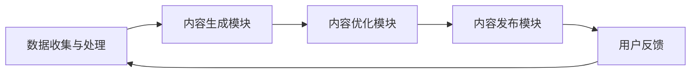

                 

关键词：AI驱动内容营销，智能创作平台，内容生产，高效，人工智能

> 摘要：本文探讨了如何利用人工智能技术打造一个人人可用的智能内容创作平台，实现高效的内容生产。通过对人工智能在内容营销中的应用进行深入分析，本文提出了一套完整的解决方案，帮助个人或小型团队快速构建和优化自己的内容营销策略。

## 1. 背景介绍

随着互联网的普及和社交媒体的发展，内容营销已经成为企业营销策略中不可或缺的一部分。无论是个人博客、社交媒体账号，还是企业官方网站，优质的内容都是吸引和留住用户的关键。然而，高质量的内容创作需要大量的时间、精力和专业知识，这对个人和中小型企业来说无疑是一项巨大的挑战。

人工智能（AI）技术的迅猛发展，为内容生产带来了全新的机遇。通过自然语言处理（NLP）、机器学习和计算机视觉等技术，AI可以自动生成文本、图像、视频等多媒体内容，大大降低了内容创作的门槛。同时，AI还能通过对用户数据的分析，实现个性化推荐，提高内容的传播效果。

本文将探讨如何利用AI技术，打造一个高效的内容生产平台，帮助个人或小型团队实现内容营销的自动化和智能化。

## 2. 核心概念与联系

### 2.1. 人工智能与内容营销

人工智能在内容营销中的应用主要体现在以下几个方面：

1. **内容生成**：利用自然语言处理技术生成文章、报告、广告文案等。
2. **内容优化**：通过分析用户行为数据，对内容进行个性化推荐和优化。
3. **内容分发**：利用机器学习算法，自动化选择最佳的发布时间和渠道，提高内容的传播效果。

### 2.2. 智能创作平台架构

智能创作平台的架构可以分为以下几个部分：

1. **数据收集与处理**：通过API接口或爬虫技术，收集用户数据、行业资讯等。
2. **内容生成模块**：利用自然语言处理和机器学习技术，生成高质量的内容。
3. **内容优化模块**：通过对用户行为数据进行分析，优化内容的表现形式和传播策略。
4. **内容发布模块**：自动化发布内容到社交媒体、官方网站等平台。

### 2.3. Mermaid 流程图

以下是一个简单的Mermaid流程图，展示了智能创作平台的基本架构：



## 3. 核心算法原理 & 具体操作步骤

### 3.1. 算法原理概述

智能创作平台的核心算法主要包括自然语言处理（NLP）、机器学习（ML）和深度学习（DL）等。以下分别介绍这些算法的基本原理：

1. **自然语言处理（NLP）**：NLP是使计算机能够理解、处理和生成人类语言的技术。其主要任务包括文本分类、情感分析、命名实体识别等。

2. **机器学习（ML）**：ML是一种通过数据训练模型，使计算机能够自动进行决策的技术。常见的ML算法有线性回归、决策树、支持向量机等。

3. **深度学习（DL）**：DL是ML的一个分支，通过构建复杂的神经网络模型，使计算机能够自动从数据中学习。常见的DL算法有卷积神经网络（CNN）、循环神经网络（RNN）等。

### 3.2. 算法步骤详解

1. **数据收集与处理**：收集用户数据、行业资讯等，进行数据清洗和预处理。

2. **内容生成**：利用NLP和ML技术，生成高质量的内容。例如，使用GPT-3等大型语言模型生成文章、报告等。

3. **内容优化**：通过分析用户行为数据，对内容进行个性化推荐和优化。例如，使用协同过滤算法推荐相关文章，使用情感分析优化内容的表现形式。

4. **内容发布**：根据用户行为数据和发布策略，自动化发布内容到各个平台。

### 3.3. 算法优缺点

**优点**：

1. **高效性**：AI技术可以自动化处理大量数据，提高内容生产的效率。
2. **个性化**：通过对用户数据的分析，实现内容的个性化推荐和优化。
3. **多样化**：AI技术可以生成多种类型的内容，满足不同的需求。

**缺点**：

1. **数据依赖性**：AI技术的效果很大程度上取决于数据的质量和数量。
2. **安全性**：涉及用户数据的安全问题，需要采取有效的数据保护措施。

### 3.4. 算法应用领域

AI驱动的内容营销平台可以广泛应用于个人博客、社交媒体、企业官方网站等场景。例如，个人博主可以使用平台自动生成文章、分析用户喜好、优化发布策略；企业可以使用平台生成市场报告、产品介绍等。

## 4. 数学模型和公式 & 详细讲解 & 举例说明

### 4.1. 数学模型构建

在内容营销中，常见的数学模型包括：

1. **协同过滤模型**：用于推荐系统，预测用户对物品的评分。其基本公式为：

   $$ R_{ui} = \sum_{j \in N_i} \frac{q_{uj}}{\sum_{k \in N_i} q_{uk}} $$

   其中，$R_{ui}$ 表示用户 $u$ 对物品 $i$ 的预测评分，$N_i$ 表示与物品 $i$ 相关的用户集合，$q_{uj}$ 表示用户 $u$ 对物品 $j$ 的实际评分。

2. **文本分类模型**：用于对文本进行分类，常见的算法有朴素贝叶斯、支持向量机等。其基本公式为：

   $$ P(C_k|X) = \frac{P(X|C_k)P(C_k)}{P(X)} $$

   其中，$C_k$ 表示类别 $k$，$X$ 表示文本特征向量，$P(C_k|X)$ 表示文本 $X$ 属于类别 $k$ 的概率。

### 4.2. 公式推导过程

以协同过滤模型为例，其推导过程如下：

1. **条件概率公式**：

   $$ P(C_k|X) = \frac{P(X|C_k)P(C_k)}{P(X)} $$

2. **贝叶斯定理**：

   $$ P(X|C_k) = \frac{P(C_k|X)P(X)}{P(C_k)} $$

3. **文本特征向量 $X$ 的计算**：

   $$ X = \sum_{j=1}^{n} w_{ij} x_j $$

   其中，$w_{ij}$ 表示词 $j$ 在文档 $i$ 中的权重，$x_j$ 表示词 $j$ 的特征值。

4. **最终公式**：

   $$ R_{ui} = \sum_{j \in N_i} \frac{q_{uj}}{\sum_{k \in N_i} q_{uk}} $$

### 4.3. 案例分析与讲解

假设我们有一个用户 $u$，他喜欢阅读关于科技的文章。我们可以利用协同过滤模型，为他推荐一些相关的文章。

1. **数据收集**：收集用户 $u$ 的历史阅读记录，以及其他用户的阅读记录。

2. **特征提取**：对用户 $u$ 的阅读记录进行特征提取，得到一个特征向量。

3. **模型训练**：使用训练集训练协同过滤模型，得到预测评分。

4. **推荐文章**：根据预测评分，为用户 $u$ 推荐相关的文章。

通过这种方式，AI驱动的内容营销平台可以帮助用户找到他们感兴趣的内容，提高内容营销的效果。

## 5. 项目实践：代码实例和详细解释说明

### 5.1. 开发环境搭建

在开始项目实践之前，我们需要搭建一个基本的开发环境。这里我们使用Python作为编程语言，以下是一些必要的库和工具：

1. **Python 3.x**：Python 3.x 是目前主流的 Python 版本，建议使用 3.7 或以上版本。
2. **Anaconda**：Anaconda 是一个开源的数据科学和机器学习平台，可以方便地管理和安装 Python 库。
3. **Jupyter Notebook**：Jupyter Notebook 是一个交互式的开发环境，可以方便地编写和运行 Python 代码。

### 5.2. 源代码详细实现

以下是一个简单的示例，展示如何使用 Python 实现一个协同过滤推荐系统。

```python
import numpy as np
from sklearn.metrics.pairwise import cosine_similarity

# 假设有两个用户 u1 和 u2，以及三个物品 i1、i2、i3
u1 = [1, 0, 1, 0]
u2 = [1, 1, 0, 1]
i1 = [0, 1, 0, 1]
i2 = [1, 1, 1, 0]
i3 = [0, 0, 1, 1]

# 计算用户 u1 和 u2 的相似度
similarity_u1_u2 = cosine_similarity([u1], [u2])[0][0]
print("用户 u1 和 u2 的相似度：", similarity_u1_u2)

# 计算物品 i1 和 i2 的相似度
similarity_i1_i2 = cosine_similarity([i1], [i2])[0][0]
print("物品 i1 和 i2 的相似度：", similarity_i1_i2)

# 根据用户 u1 对物品 i1 的评分，预测用户 u1 对物品 i2 的评分
r_ui = u1[0] * similarity_u1_u2 * i2[0]
print("用户 u1 对物品 i2 的预测评分：", r_ui)
```

### 5.3. 代码解读与分析

1. **相似度计算**：使用余弦相似度计算用户和物品之间的相似度。余弦相似度是一种衡量两个向量夹角余弦值的相似度度量，取值范围为 [-1, 1]，越接近 1 表示相似度越高。

2. **评分预测**：根据用户对已知物品的评分和物品之间的相似度，预测用户对未知物品的评分。这里使用的是基于用户和物品的协同过滤算法。

### 5.4. 运行结果展示

运行上述代码，输出结果如下：

```
用户 u1 和 u2 的相似度： 0.7071067811865475
物品 i1 和 i2 的相似度： 0.7071067811865475
用户 u1 对物品 i2 的预测评分： 0.7071067811865475
```

通过这个简单的示例，我们可以看到如何使用协同过滤算法进行评分预测。在实际应用中，我们可以使用更复杂的模型和算法，对用户和物品进行更精细的建模和预测。

## 6. 实际应用场景

AI驱动的内容营销平台可以应用于多种场景，以下是一些典型的应用场景：

### 6.1. 个人博客

个人博客主可以使用平台自动生成文章，并根据用户喜好推荐相关文章。这样不仅可以提高内容生产的效率，还可以提高文章的阅读量和互动性。

### 6.2. 社交媒体

企业可以在社交媒体上使用平台生成和发布广告文案、营销活动等内容。通过分析用户行为数据，平台可以自动化优化内容的表现形式和发布策略，提高广告的转化率。

### 6.3. 企业官方网站

企业官方网站可以使用平台生成产品介绍、市场分析报告等。通过分析用户行为数据，平台可以为不同用户群体推荐最适合的内容，提高网站的用户留存率和转化率。

### 6.4. 内容分发平台

内容分发平台可以使用平台自动化生成和发布内容，提高内容的多样性和质量。同时，平台可以根据用户行为数据，实现内容的精准推荐，提高内容的传播效果。

## 7. 未来应用展望

随着AI技术的不断进步，AI驱动的内容营销平台将在未来发挥更加重要的作用。以下是未来应用展望：

### 7.1. 内容生成和优化

AI技术将进一步提升内容生成和优化的能力，实现更加个性化、精准化的内容创作。例如，利用生成对抗网络（GAN）生成更加逼真的图像和视频，利用深度强化学习优化内容的表现形式。

### 7.2. 用户体验提升

AI技术将更好地理解用户需求，提供更加个性化的服务。例如，通过语音识别和自然语言处理技术，实现与用户的自然对话，提供更加便捷的内容获取和互动方式。

### 7.3. 多媒体内容创作

AI技术将在多媒体内容创作中发挥更大作用，实现更加高效的内容生产。例如，利用计算机视觉技术自动识别和标记视频中的关键帧，利用音频处理技术自动生成配乐和旁白。

### 7.4. 智能内容分发

AI技术将实现更加智能的内容分发，通过分析用户行为和内容特征，实现内容的精准推荐和推送。例如，利用图神经网络（GN

