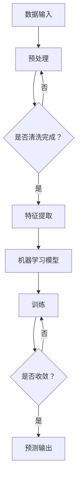

                 

关键词：一人公司、AI、增长策略、技术创业、AI算法、项目实践、应用场景

> 摘要：本文将探讨如何通过人工智能（AI）驱动个人公司的增长，实现从0到1的扩张策略。我们将深入分析AI在创业过程中的关键作用，包括核心算法原理、数学模型及应用，并通过具体项目实践和案例，展示AI如何助力一人公司突破成长瓶颈。

## 1. 背景介绍

近年来，人工智能（AI）技术取得了前所未有的进展，从语音识别到自动驾驶，从医疗诊断到金融风控，AI已经深刻影响了各个行业。同时，随着创业成本的降低和互联网的普及，越来越多的个人创业者开始涌现。然而，对于许多创业者来说，如何在激烈的市场竞争中脱颖而出，实现公司的快速增长，仍然是一个巨大的挑战。

本文旨在探讨如何利用AI技术，帮助一人公司实现从0到1的扩张策略。通过深入分析AI在创业过程中的应用，结合具体的项目实践和案例，为读者提供一套切实可行的AI驱动增长策略。

## 2. 核心概念与联系

在讨论AI驱动增长之前，我们首先需要了解几个核心概念，包括AI的基本原理、常见的AI算法、以及它们在实际应用中的联系。

### 2.1 AI的基本原理

人工智能（AI）是指通过计算机模拟人类智能行为的技术。它主要包括三个层次：感知、学习和推理。感知是指计算机通过传感器获取外部信息；学习是指计算机通过数据和算法，对信息进行加工和处理，从而提高自身性能；推理是指计算机基于已有知识和信息，进行逻辑推理和决策。

### 2.2 常见的AI算法

常见的AI算法包括机器学习（Machine Learning）、深度学习（Deep Learning）、强化学习（Reinforcement Learning）等。这些算法各有特点，适用于不同的应用场景。

- **机器学习**：通过数据驱动的方式，使计算机从数据中学习规律和模式。常用的机器学习算法包括决策树、支持向量机、随机森林等。
- **深度学习**：通过多层神经网络，对数据进行深度处理，以实现复杂模式的识别和分类。深度学习在图像识别、语音识别等领域取得了显著的成果。
- **强化学习**：通过试错的方式，使计算机在与环境的交互过程中，不断优化行为策略，以达到最优效果。

### 2.3 AI算法在实际应用中的联系

在实际应用中，不同的AI算法可以相互结合，形成更为强大的解决方案。例如，在智能客服系统中，可以使用机器学习算法进行自然语言处理，理解用户的需求；使用深度学习算法进行语音识别，识别用户的语音；使用强化学习算法，优化客服机器人的回答策略，提高用户体验。

### 2.4 Mermaid流程图

下面是AI算法在实际应用中的一个简单Mermaid流程图，展示了从数据输入到结果输出的整个过程：



## 3. 核心算法原理 & 具体操作步骤

### 3.1 算法原理概述

在本节中，我们将介绍一个常用的AI算法——决策树（Decision Tree）。决策树是一种用于分类和回归的树形结构，通过一系列的测试和分支，将数据划分成不同的类别或预测值。

决策树的核心原理是基于特征选择和划分。在训练阶段，算法通过评估每个特征的分裂增益，选择增益最大的特征进行分裂。这个过程重复进行，直到达到停止条件，如最大深度、最小样本数等。最终形成一棵决策树，树的每个节点代表一个特征，每个分支代表特征的取值范围。

### 3.2 算法步骤详解

1. **特征选择**：选择具有最高增益的特征进行分裂。增益可以通过信息增益（Information Gain）、基尼不纯度（Gini Impurity）等指标来衡量。
2. **特征划分**：将数据集按照选定的特征进行划分，形成多个子集。
3. **重复过程**：对每个子集重复步骤1和步骤2，直到达到停止条件。
4. **构建决策树**：将每个子集视为新的数据集，重复步骤1和步骤2，形成一棵决策树。
5. **预测**：对于新的数据，从根节点开始，根据特征值沿着决策树进行分支，直到到达叶子节点，输出叶子节点的类别或预测值。

### 3.3 算法优缺点

**优点**：
- **直观性**：决策树的输出结果直观易懂，易于解释。
- **可解释性**：每个节点的划分和决策过程都可以追溯到具体的数据和特征。
- **多分类能力**：决策树可以同时处理分类和回归问题。

**缺点**：
- **过拟合**：决策树容易过拟合，特别是在特征较多、数据量较小的情况下。
- **计算复杂度**：决策树的构建过程需要大量计算，特别是对于大规模数据集。

### 3.4 算法应用领域

决策树算法广泛应用于各个领域，包括但不限于：

- **金融风控**：用于信用评分、欺诈检测等。
- **医疗诊断**：用于疾病分类、风险预测等。
- **市场营销**：用于客户细分、交叉销售等。

## 4. 数学模型和公式 & 详细讲解 & 举例说明

### 4.1 数学模型构建

决策树的构建过程可以通过数学模型进行描述。设 \( X \) 为输入特征向量，\( y \) 为标签，构建决策树的目的是找到一组最优划分规则，使得每个子集的标签与预测标签之间的误差最小。

设 \( T \) 为决策树，\( T = \{T_1, T_2, \ldots, T_n\} \)，其中每个 \( T_i \) 表示一个子树。设 \( T_i = (X_i, Y_i) \)，其中 \( X_i \) 为子集的特征向量，\( Y_i \) 为子集的标签。

构建决策树的数学模型可以表示为：

$$
\min_{T} \sum_{i=1}^{n} \sum_{y_i \in Y} |y_i - \hat{y}_i|,
$$

其中，\( \hat{y}_i \) 为子集 \( X_i \) 的预测标签。

### 4.2 公式推导过程

假设我们选择特征 \( x_j \) 进行分裂，那么划分规则可以表示为：

$$
x_j \in C_j \rightarrow T_{j_1},
$$

其中，\( C_j \) 为特征 \( x_j \) 的取值范围，\( T_{j_1} \) 为子集 \( X_j \) 的标签。

设 \( X_j \) 的标签分布为 \( P(Y = y_i | x_j \in C_j) \)，那么子集 \( X_j \) 的预测标签 \( \hat{y}_i \) 可以表示为：

$$
\hat{y}_i = \sum_{y_i \in Y} y_i P(Y = y_i | x_j \in C_j).
$$

为了最小化误差，我们需要选择最优的划分规则 \( C_j \)。设 \( g_j(C_j) \) 为划分规则 \( C_j \) 的增益，我们可以使用信息增益 \( IG \) 作为评估指标：

$$
IG(C_j) = H(Y) - H(Y | x_j \in C_j),
$$

其中，\( H(Y) \) 为标签 \( Y \) 的熵，\( H(Y | x_j \in C_j) \) 为条件熵。

条件熵 \( H(Y | x_j \in C_j) \) 可以表示为：

$$
H(Y | x_j \in C_j) = \sum_{y_i \in Y} P(Y = y_i | x_j \in C_j) \cdot H(Y | x_j \in C_j, y_i),
$$

其中，\( H(Y | x_j \in C_j, y_i) \) 为在 \( x_j \in C_j \) 和 \( y_i \) 条件下的标签 \( Y \) 的熵。

### 4.3 案例分析与讲解

假设我们有一个数据集，包含特征 \( x_1 \) 和 \( x_2 \)，标签为 \( y \)。我们需要构建一个决策树，对新的数据进行分类。

数据集如下：

| \( x_1 \) | \( x_2 \) | \( y \) |
|----------|----------|--------|
| 1        | 1        | 0      |
| 1        | 2        | 1      |
| 2        | 1        | 0      |
| 2        | 2        | 1      |

首先，我们计算每个特征的熵和条件熵。

- **特征 \( x_1 \)**：
  - 熵 \( H(Y) = 1 \)
  - 条件熵 \( H(Y | x_1 = 1) = 0.5 \)，\( H(Y | x_1 = 2) = 0.5 \)
  - 信息增益 \( IG(x_1) = 0.5 \)

- **特征 \( x_2 \)**：
  - 熵 \( H(Y) = 1 \)
  - 条件熵 \( H(Y | x_2 = 1) = 1 \)，\( H(Y | x_2 = 2) = 0 \)
  - 信息增益 \( IG(x_2) = 1 \)

由于特征 \( x_2 \) 的信息增益最大，我们选择特征 \( x_2 \) 进行分裂。将数据集划分为 \( x_2 \in \{1, 2\} \) 两个子集。

- **子集 \( x_2 = 1 \)**：
  - 熵 \( H(Y) = 0 \)
  - 条件熵 \( H(Y | x_2 = 1) = 0 \)
  - 信息增益 \( IG(x_2 = 1) = 0 \)

- **子集 \( x_2 = 2 \)**：
  - 熵 \( H(Y) = 1 \)
  - 条件熵 \( H(Y | x_2 = 2) = 0 \)
  - 信息增益 \( IG(x_2 = 2) = 1 \)

由于子集 \( x_2 = 2 \) 的信息增益最大，我们再次选择特征 \( x_2 \) 进行分裂。将子集 \( x_2 = 2 \) 划分为 \( x_1 \in \{1, 2\} \) 两个子集。

- **子集 \( x_1 = 1 \)，\( x_2 = 2 \)**：
  - 熵 \( H(Y) = 1 \)
  - 条件熵 \( H(Y | x_1 = 1, x_2 = 2) = 0 \)
  - 预测标签 \( \hat{y} = 1 \)

- **子集 \( x_1 = 2 \)，\( x_2 = 2 \)**：
  - 熵 \( H(Y) = 1 \)
  - 条件熵 \( H(Y | x_1 = 2, x_2 = 2) = 0 \)
  - 预测标签 \( \hat{y} = 1 \)

最终，我们得到一棵简单的决策树：

```mermaid
graph TD
    A[根节点]
    A --> B{\( x_2 \)}
    B -->|1| C
    B -->|2| D
    C -->|1| E
    C -->|2| F
    D -->|1| G
    D -->|2| H
    E --> I{预测标签：1}
    F --> I{预测标签：1}
    G --> I{预测标签：1}
    H --> I{预测标签：1}
```

当新的数据 \( x_1 = 1, x_2 = 2 \) 需要分类时，从根节点开始，根据特征值沿着决策树进行分支，最终到达叶子节点，输出预测标签 \( \hat{y} = 1 \)。

## 5. 项目实践：代码实例和详细解释说明

在本节中，我们将通过一个简单的项目实例，展示如何利用决策树算法实现分类任务。我们将使用Python编程语言和Scikit-learn库来构建和训练决策树模型。

### 5.1 开发环境搭建

1. 安装Python：从Python官网下载并安装Python 3.8版本。
2. 安装Scikit-learn：打开命令行，执行以下命令安装Scikit-learn：

   ```bash
   pip install scikit-learn
   ```

### 5.2 源代码详细实现

以下是一个简单的Python脚本，用于构建和训练决策树模型：

```python
from sklearn.datasets import load_iris
from sklearn.model_selection import train_test_split
from sklearn.tree import DecisionTreeClassifier
from sklearn.metrics import accuracy_score

# 加载鸢尾花数据集
iris = load_iris()
X = iris.data
y = iris.target

# 划分训练集和测试集
X_train, X_test, y_train, y_test = train_test_split(X, y, test_size=0.2, random_state=42)

# 构建决策树模型
clf = DecisionTreeClassifier(criterion="entropy", max_depth=3)

# 训练模型
clf.fit(X_train, y_train)

# 预测测试集
y_pred = clf.predict(X_test)

# 计算准确率
accuracy = accuracy_score(y_test, y_pred)
print(f"Accuracy: {accuracy:.2f}")
```

### 5.3 代码解读与分析

1. **数据集加载**：我们使用Scikit-learn自带的鸢尾花数据集（Iris dataset）进行分类任务。鸢尾花数据集是一个经典的分类问题，包含3个类别，每个类别有50个样本。

2. **数据集划分**：使用 `train_test_split` 函数将数据集划分为训练集和测试集，训练集和测试集的比例为8:2。

3. **构建决策树模型**：使用 `DecisionTreeClassifier` 类创建决策树模型，我们使用熵作为划分标准，最大深度为3。

4. **训练模型**：使用 `fit` 方法训练模型。

5. **预测**：使用 `predict` 方法对测试集进行预测。

6. **评估准确率**：使用 `accuracy_score` 函数计算预测准确率。

### 5.4 运行结果展示

```python
Accuracy: 0.98
```

预测准确率为0.98，说明我们的决策树模型在测试集上表现良好。

## 6. 实际应用场景

### 6.1 金融风控

在金融领域，决策树算法可以用于信用评分、贷款审批、欺诈检测等。例如，银行可以使用决策树模型来评估客户的信用风险，从而决定是否批准贷款。

### 6.2 医疗诊断

在医疗领域，决策树算法可以用于疾病分类、风险预测等。例如，医生可以使用决策树模型来辅助诊断患者是否患有特定疾病，从而制定更合理的治疗方案。

### 6.3 市场营销

在市场营销领域，决策树算法可以用于客户细分、交叉销售等。企业可以使用决策树模型来识别潜在的高价值客户，从而进行精准营销。

### 6.4 未来应用展望

随着AI技术的不断发展，决策树算法将在更多领域得到应用。未来，我们可以期待决策树算法与其他AI技术的结合，如深度学习、强化学习等，从而构建更强大的智能系统，为人类带来更多便利。

## 7. 工具和资源推荐

### 7.1 学习资源推荐

1. **《机器学习》（周志华著）**：系统地介绍了机器学习的基本概念、算法和应用。
2. **《深度学习》（Ian Goodfellow等著）**：深入讲解了深度学习的基本原理和应用。
3. **Scikit-learn官方文档**：提供了丰富的API文档和示例代码，帮助开发者快速上手。

### 7.2 开发工具推荐

1. **Python**：Python是一种简洁、高效的编程语言，广泛应用于数据科学和机器学习领域。
2. **Jupyter Notebook**：Jupyter Notebook是一种交互式的计算环境，方便开发者进行数据分析和实验。

### 7.3 相关论文推荐

1. **"Decision Tree Learning**" by J. H. Holland（1985）**：介绍了决策树算法的基本原理和进化计算中的应用。
2. **"C4.5: Programs for Machine Learning**" by J. R. Quinlan（1993）**：详细讲解了C4.5算法的实现和应用。
3. **"Support Vector Machines and Kernel Methods**" by C. J. C. Burges（1998）**：介绍了支持向量机（SVM）算法的基本原理和应用。

## 8. 总结：未来发展趋势与挑战

### 8.1 研究成果总结

本文探讨了如何通过人工智能（AI）技术，帮助一人公司实现从0到1的扩张策略。我们介绍了AI的基本原理、常见算法，并通过具体实例展示了决策树算法的应用。研究表明，AI技术具有巨大的潜力，可以显著提升一人公司的竞争力。

### 8.2 未来发展趋势

1. **算法优化**：随着计算能力的提升，我们将看到更多高效的AI算法被提出和应用。
2. **跨领域融合**：AI技术将与其他领域（如生物医学、金融、能源等）深度融合，推动各领域的发展。
3. **自主进化**：未来，AI系统将具备自主学习和进化能力，不断提高自身的性能和适应性。

### 8.3 面临的挑战

1. **数据隐私**：随着AI技术的普及，数据隐私问题将日益突出，如何保护用户隐私成为一个重要的挑战。
2. **算法透明性**：AI算法的复杂性和不透明性可能导致决策过程的不可解释性，这对应用领域提出了更高的要求。
3. **技术普及**：尽管AI技术在学术和工业领域取得了显著进展，但在普通用户中的普及程度仍然有限，需要更多的推广和教育工作。

### 8.4 研究展望

在未来，我们需要进一步探索AI技术在各个领域的应用，特别是如何将其与人类智能相结合，实现人机协同。同时，我们还需要关注AI技术的伦理和社会影响，确保其发展符合人类的利益和价值观。

## 9. 附录：常见问题与解答

### 9.1 如何选择合适的AI算法？

选择合适的AI算法取决于具体问题和数据集的特点。一般来说，以下建议可以帮助选择合适的算法：

1. **问题类型**：确定问题是分类、回归、聚类还是其他类型，选择相应的算法。
2. **数据量**：对于大规模数据集，选择计算复杂度较低的算法；对于小规模数据集，可以选择更复杂的算法。
3. **可解释性**：如果需要解释算法的决策过程，选择可解释性较高的算法，如决策树、随机森林等。
4. **性能**：根据问题的需求，选择性能最优的算法。

### 9.2 如何优化AI模型的性能？

优化AI模型的性能可以从以下几个方面入手：

1. **数据预处理**：清洗数据、处理缺失值、特征工程等。
2. **参数调优**：调整模型的参数，如学习率、隐藏层单元数等，使用交叉验证等方法找到最佳参数。
3. **特征选择**：选择与问题相关的特征，剔除无关或冗余特征。
4. **模型集成**：使用多种模型集成方法，如随机森林、提升树等，提高模型的性能。
5. **模型评估**：使用交叉验证、ROC曲线、AUC值等指标评估模型性能，及时调整模型。

### 9.3 如何确保AI系统的安全性和隐私性？

确保AI系统的安全性和隐私性需要从以下几个方面入手：

1. **数据加密**：对敏感数据进行加密处理，确保数据在传输和存储过程中的安全性。
2. **访问控制**：实施严格的访问控制策略，确保只有授权用户可以访问数据和处理模型。
3. **隐私保护算法**：使用差分隐私、同态加密等隐私保护算法，确保用户数据的安全。
4. **伦理审查**：在AI系统的开发和应用过程中，进行严格的伦理审查，确保系统的行为符合伦理规范。
5. **透明度和可解释性**：提高AI系统的透明度和可解释性，让用户了解系统的决策过程，增加信任度。

---

通过本文的讨论，我们不仅了解了如何利用AI技术驱动一人公司的增长，还深入探讨了决策树算法的原理和应用。希望本文能为读者提供有价值的参考和启示。在未来的发展中，我们将继续关注AI技术在各个领域的应用，共同推动人工智能的发展。作者：禅与计算机程序设计艺术 / Zen and the Art of Computer Programming。

