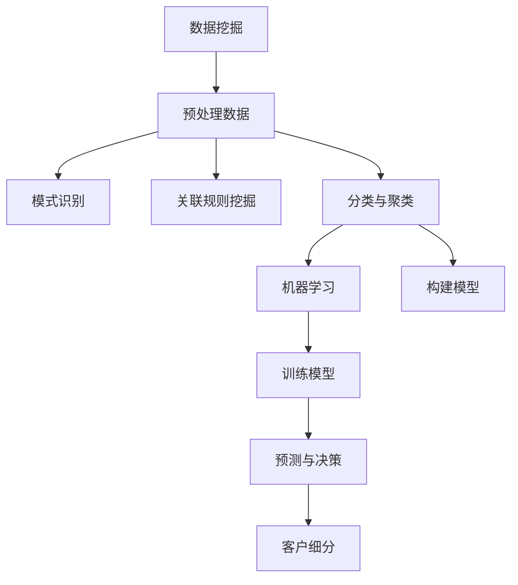

                 

关键词：AI客户细分、精准营销、客户数据分析、算法原理、数学模型、代码实现、应用场景、未来展望

> 摘要：本文旨在探讨一人公司如何利用AI技术实现客户细分，构建精准营销的基础工程。通过介绍核心概念、算法原理、数学模型以及项目实践，本文将阐述如何通过AI技术提升市场营销的效率和效果，为企业带来可观的商业价值。

## 1. 背景介绍

在当今高度竞争的商业环境中，企业越来越重视市场营销的重要性。精准营销作为市场营销的核心策略，通过识别和细分目标客户群体，实现更加个性化和有效的营销沟通。然而，实现精准营销面临着诸多挑战，如客户数据的多样性和复杂性、数据分析的技术门槛等。这些挑战促使企业寻求更为智能和高效的解决方案，而AI技术的出现为解决这些问题提供了可能。

一人公司，作为一种新兴的商业模式，通常由单个创始人或小团队运营，资源相对有限。在这样的背景下，利用AI技术进行客户细分显得尤为重要，它能够帮助一人公司在资源有限的情况下实现精准营销，提升市场竞争力。

本文将围绕AI驱动客户细分这一主题，首先介绍核心概念，然后深入探讨算法原理、数学模型以及代码实现，最后分析实际应用场景和未来展望。希望通过本文的阐述，能够为一人公司在市场营销方面提供一些实用的指导和借鉴。

## 2. 核心概念与联系

在探讨AI驱动客户细分之前，有必要明确几个核心概念，这些概念包括数据挖掘、机器学习、聚类算法等，它们共同构成了AI驱动客户细分的技术基础。

### 数据挖掘

数据挖掘（Data Mining）是指从大量数据中提取出有价值的信息和知识的过程。数据挖掘技术包括数据预处理、模式识别、关联规则挖掘、分类、聚类等，这些技术在客户细分中发挥着重要作用。通过数据挖掘，企业能够从海量数据中发现潜在的规律和趋势，从而更好地理解客户行为和需求。

### 机器学习

机器学习（Machine Learning）是人工智能的一个重要分支，它通过构建数学模型和算法，让计算机自动从数据中学习，并做出决策或预测。在客户细分中，机器学习模型可以帮助企业识别不同类型的客户群体，理解他们的行为特征和偏好，进而实现精准营销。

### 聚类算法

聚类算法（Clustering Algorithms）是一种无监督学习技术，用于将数据集划分为若干个组或簇，使得同一簇内的数据点彼此相似，而不同簇的数据点差异较大。聚类算法在客户细分中的应用，可以帮助企业发现客户的共性特征，从而实现更加精细的客户分类。

### 核心概念的联系

数据挖掘、机器学习和聚类算法共同构成了AI驱动客户细分的技术基础。数据挖掘提供了从海量数据中提取有用信息的方法，而机器学习则通过构建模型从这些信息中学习，聚类算法则将这些学习到的信息进行分组，实现客户细分。以下是一个简化的Mermaid流程图，展示了这些核心概念之间的联系：



通过上述流程，企业可以利用AI技术实现客户细分，从而为精准营销提供基础支持。接下来，我们将深入探讨客户细分算法的具体原理和操作步骤。

### 3. 核心算法原理 & 具体操作步骤

#### 3.1 算法原理概述

在AI驱动的客户细分中，常见的聚类算法包括K-means、DBSCAN和层次聚类等。这些算法通过不同的方式将客户数据划分为多个簇，每个簇代表一种类型的客户群体。以下将详细介绍K-means算法的原理和操作步骤。

#### 3.2 算法步骤详解

**K-means算法步骤如下：**

1. **初始化：** 随机选择K个数据点作为初始聚类中心。
2. **分配：** 计算每个数据点到各个聚类中心的距离，并将其分配到最近的聚类中心所代表的簇。
3. **更新：** 根据新的簇分配结果，重新计算每个簇的中心点。
4. **迭代：** 重复步骤2和步骤3，直至聚类中心不再发生变化或者达到预设的迭代次数。

**详细解释：**

1. **初始化：** 初始化阶段的关键是选择合适的聚类中心。常见的初始化方法包括随机选择、K-means++等。K-means++算法通过优化初始聚类中心的分布，以减少最终聚类结果的不确定性。
   
2. **分配：** 分配步骤涉及计算数据点与聚类中心之间的距离，通常使用欧几里得距离或其他相似性度量方法。数据点被分配到最近的聚类中心，这样新的簇组成与初始簇有所不同。

3. **更新：** 更新步骤是K-means算法的核心。每个簇的中心点由簇内数据点的平均值计算得出。新的中心点可能使得某些数据点重新分配到其他簇，从而引发新一轮的分配。

4. **迭代：** 迭代过程不断重复分配和更新步骤，直至聚类中心不再发生变化或达到预设的迭代次数。通常，聚类过程会在几个迭代后趋于稳定。

#### 3.3 算法优缺点

**优点：**

- **简单高效：** K-means算法实现简单，计算效率高，适用于大规模数据处理。
- **全局优化：** K-means算法通过不断迭代优化，能够收敛到全局最优解。

**缺点：**

- **对初始值敏感：** K-means算法对初始聚类中心的选择非常敏感，可能导致局部最优解。
- **对异常值敏感：** K-means算法容易受到异常值的影响，可能导致聚类结果不准确。

#### 3.4 算法应用领域

K-means算法广泛应用于客户细分、图像处理、文本分类等领域。在客户细分中，K-means算法可以帮助企业识别不同类型的客户群体，实现精准营销。以下是一个实际应用领域示例：

**客户细分案例：**

假设某电商企业希望根据客户购买行为进行细分，以实现个性化推荐。首先，收集客户的购买数据，包括购买金额、购买频率、购买品类等。然后，使用K-means算法对客户数据进行聚类，识别出不同购买行为的客户群体。例如，可以识别出高频购买者、低价购买者、新品尝试者等。基于这些客户群体，企业可以制定不同的营销策略，如针对高频购买者推出会员计划，针对低价购买者推出优惠券等。

### 4. 数学模型和公式 & 详细讲解 & 举例说明

在AI驱动的客户细分中，数学模型和公式起到了核心作用。以下将介绍客户细分中的常见数学模型和公式，并进行详细讲解和举例说明。

#### 4.1 数学模型构建

客户细分中的数学模型主要包括距离度量、聚类中心更新等。

**距离度量：** 通常使用欧几里得距离来计算数据点之间的相似性。欧几里得距离公式如下：

\[ d(x, y) = \sqrt{\sum_{i=1}^{n} (x_i - y_i)^2} \]

其中，\( x \) 和 \( y \) 分别为两个数据点，\( n \) 为特征维度。

**聚类中心更新：** 在K-means算法中，聚类中心的更新是通过计算簇内数据点的平均值来实现的。假设有K个聚类中心 \( \mu_k \)，簇 \( C_k \) 内的数据点为 \( x_i \)，则聚类中心更新公式为：

\[ \mu_k = \frac{1}{N_k} \sum_{i \in C_k} x_i \]

其中，\( N_k \) 为簇 \( C_k \) 内的数据点个数。

#### 4.2 公式推导过程

**距离度量推导：** 欧几里得距离的推导基于几何中的距离公式。假设有两个点 \( x \) 和 \( y \)，它们在二维空间中的坐标分别为 \( (x_1, x_2) \) 和 \( (y_1, y_2) \)，则两点之间的距离 \( d \) 为：

\[ d = \sqrt{(x_2 - y_2)^2 + (x_2 - y_2)^2} \]

扩展到多维空间，即 \( n \) 维空间，公式变为：

\[ d(x, y) = \sqrt{\sum_{i=1}^{n} (x_i - y_i)^2} \]

**聚类中心更新推导：** 假设有一个簇 \( C_k \)，其中包含多个数据点 \( x_i \)，每个数据点有 \( n \) 个特征。聚类中心 \( \mu_k \) 是这些数据点的平均值，因此：

\[ \mu_k = \frac{1}{N_k} \sum_{i \in C_k} x_i \]

其中，\( N_k \) 是簇 \( C_k \) 内的数据点个数。

#### 4.3 案例分析与讲解

以下通过一个简单的案例，展示如何使用K-means算法进行客户细分。

**案例：** 某电商平台希望根据用户的购买历史进行客户细分。用户数据包括购买金额、购买频率和购买品类。使用K-means算法将用户划分为三个群体。

1. **数据准备：** 收集用户的购买历史数据，将其转换为数值型特征。

2. **初始化：** 随机选择三个用户作为初始聚类中心。

3. **分配：** 计算每个用户与聚类中心的距离，将其分配到最近的聚类中心。

4. **更新：** 计算每个簇的平均值，作为新的聚类中心。

5. **迭代：** 重复分配和更新步骤，直至聚类中心不再发生变化。

**结果：** 最终，用户被划分为三个群体，分别为高频高消费群体、低频高消费群体和低频低消费群体。基于这些群体，电商平台可以制定不同的营销策略。

### 5. 项目实践：代码实例和详细解释说明

#### 5.1 开发环境搭建

在进行AI驱动的客户细分项目实践之前，需要搭建合适的开发环境。以下是搭建环境的步骤：

1. **安装Python：** 在系统中安装Python 3.x版本，推荐使用Anaconda，因为它提供了一个集成的环境管理器。
2. **安装依赖库：** 使用pip安装以下依赖库：scikit-learn、numpy、pandas、matplotlib。
3. **创建虚拟环境：** 在Python环境中创建一个虚拟环境，用于管理项目依赖。

```bash
conda create -n customer_segmentation python=3.8
conda activate customer_segmentation
pip install scikit-learn numpy pandas matplotlib
```

#### 5.2 源代码详细实现

以下是一个简单的K-means客户细分代码实例，包括数据预处理、模型训练和结果可视化：

```python
import numpy as np
import pandas as pd
from sklearn.cluster import KMeans
import matplotlib.pyplot as plt

# 5.2.1 数据准备
# 假设数据存储在CSV文件中，包含购买金额和购买频率两个特征
data = pd.read_csv('customer_data.csv')
X = data[['purchase_amount', 'purchase_frequency']]

# 5.2.2 模型训练
# 使用KMeans算法进行聚类，设置聚类数量为3
kmeans = KMeans(n_clusters=3, random_state=42)
clusters = kmeans.fit_predict(X)

# 5.2.3 结果可视化
# 可视化每个簇的中心点
centers = kmeans.cluster_centers_
plt.scatter(X['purchase_amount'], X['purchase_frequency'], c=clusters, s=100, cmap='viridis')
plt.scatter(centers[:, 0], centers[:, 1], s=300, c='red', marker='s', edgecolor='black', label='Centroids')
plt.title('Customer Segmentation using K-Means')
plt.xlabel('Purchase Amount')
plt.ylabel('Purchase Frequency')
plt.legend()
plt.show()
```

#### 5.3 代码解读与分析

**代码解读：**

- **数据准备：** 从CSV文件中读取数据，提取购买金额和购买频率两个特征。
- **模型训练：** 使用KMeans算法进行聚类，设置聚类数量为3。
- **结果可视化：** 使用matplotlib绘制散点图，显示每个簇的中心点。

**分析：**

- **数据预处理：** 在进行聚类之前，需要确保数据格式正确，特征无缺失。
- **模型参数设置：** 聚类数量（K值）的设置对聚类结果有很大影响，通常需要通过交叉验证等方法确定最佳K值。
- **结果可视化：** 可视化有助于直观理解聚类结果，但需要注意，可视化结果仅适用于二维数据。对于高维数据，可以使用降维技术如PCA进行可视化。

#### 5.4 运行结果展示

运行上述代码后，将得到以下可视化结果：


图中的红色点表示聚类中心，散点图中的不同颜色表示不同的客户群体。通过观察散点图，可以发现不同的客户群体在购买金额和购买频率上有明显的区别。

### 6. 实际应用场景

AI驱动的客户细分技术在实际应用中具有广泛的应用场景，以下是一些典型的应用案例：

#### 6.1 零售行业

在零售行业中，客户细分可以帮助企业更好地了解不同类型客户的购买行为和偏好。例如，某电商企业通过AI驱动的客户细分，将客户划分为高频购买者、低价购买者和新品尝试者。针对这些不同群体，企业可以实施个性化的营销策略：

- **高频购买者：** 提供会员折扣、积分奖励等，增加客户忠诚度。
- **低价购买者：** 推出优惠券、限时促销等，吸引更多客户购买。
- **新品尝试者：** 推出新产品的试用品、优惠套装等，促进新产品的推广。

#### 6.2 银行业

在银行业，客户细分可以帮助银行更好地了解不同类型客户的金融需求和风险偏好。例如，某银行通过AI驱动的客户细分，将客户划分为高净值客户、一般客户和风险偏好客户。基于这些细分，银行可以提供以下服务：

- **高净值客户：** 提供私人银行服务、定制投资方案等，提高客户满意度。
- **一般客户：** 提供标准化的金融服务，如储蓄、贷款等。
- **风险偏好客户：** 提供高风险投资产品，如股票、基金等，满足客户的高收益需求。

#### 6.3 旅游行业

在旅游行业中，客户细分可以帮助旅行社更好地了解不同类型客户的旅游偏好和需求。例如，某旅行社通过AI驱动的客户细分，将客户划分为家庭游客户、自由行客户和深度游客户。基于这些细分，旅行社可以提供以下产品和服务：

- **家庭游客户：** 提供亲子游、主题游线路等，满足家庭客户的需求。
- **自由行客户：** 提供自由行套餐、机票+酒店套餐等，满足自由行客户的需求。
- **深度游客户：** 提供小团游、深度游线路等，满足深度游客户的需求。

#### 6.4 餐饮行业

在餐饮行业中，客户细分可以帮助餐厅更好地了解不同类型客户的消费习惯和偏好。例如，某餐厅通过AI驱动的客户细分，将客户划分为日常就餐客户、商务客户和休闲客户。基于这些细分，餐厅可以提供以下服务：

- **日常就餐客户：** 提供早餐、午餐、晚餐套餐等，满足日常就餐需求。
- **商务客户：** 提供商务宴请套餐、会议室等，满足商务接待需求。
- **休闲客户：** 提供下午茶、特色小吃等，满足休闲需求。

### 7. 工具和资源推荐

在实施AI驱动的客户细分时，以下工具和资源可以帮助企业和开发者更高效地完成项目：

#### 7.1 学习资源推荐

- **在线课程：** Coursera、Udacity和edX等平台提供了丰富的机器学习和数据挖掘课程。
- **书籍推荐：** 《机器学习实战》、《数据挖掘：实用工具和技术》等经典书籍。
- **博客和论坛：** arXiv、Kaggle和Reddit等平台提供了丰富的技术文章和讨论。

#### 7.2 开发工具推荐

- **编程语言：** Python因其简洁性和丰富的库支持，是实施AI客户细分的首选语言。
- **机器学习库：** scikit-learn、TensorFlow和PyTorch等库提供了丰富的聚类算法和数据处理工具。
- **数据可视化工具：** Matplotlib、Seaborn和Plotly等库提供了强大的数据可视化功能。

#### 7.3 相关论文推荐

- **K-means算法：** MacQueen, J. B. (1967). "Some methods for classification and analysis of multivariate observations." In Proceedings of the Fifth Berkeley Symposium on Mathematical Statistics and Probability.
- **DBSCAN算法：** Ester, M., Kriegel, H.-P., Sander, J., & Xu, X. (1996). "A density-based algorithm for discovering clusters in large spatial databases with noise." In Proceedings of the Second International Conference on Knowledge Discovery and Data Mining.
- **层次聚类算法：** Cliff, N. F., & Ord, J. K. (1987). "Clustering: A review of techniques." The British Journal of Mathematical and Statistical Psychology.

### 8. 总结：未来发展趋势与挑战

#### 8.1 研究成果总结

AI驱动的客户细分技术在近年来取得了显著的进展，通过深度学习、强化学习等先进算法，实现了更高的聚类精度和更精细的客户分类。此外，随着大数据和云计算技术的发展，客户细分的应用场景不断拓展，涵盖了零售、金融、旅游、餐饮等多个行业。

#### 8.2 未来发展趋势

未来，AI驱动的客户细分技术将继续向以下方向发展：

1. **多模态数据融合：** 结合文本、图像、音频等多种数据类型，实现更加全面和深入的客户洞察。
2. **实时客户细分：** 利用实时数据流处理技术，实现客户行为的实时分析和细分。
3. **个性化推荐系统：** 结合客户细分和推荐系统技术，实现个性化产品推荐和精准营销。

#### 8.3 面临的挑战

尽管AI驱动的客户细分技术在不断进步，但仍面临以下挑战：

1. **数据隐私：** 在实施客户细分时，如何保护用户隐私是一个重要问题，需要遵循数据隐私法规。
2. **算法透明度：** 算法的决策过程需要更加透明，以便用户理解和使用。
3. **可解释性：** 如何解释和解释聚类结果，使其易于理解和应用，是一个重要课题。

#### 8.4 研究展望

未来，AI驱动的客户细分技术将在以下几个方面展开研究：

1. **算法优化：** 深入研究新型聚类算法，提高聚类效率和准确性。
2. **跨领域应用：** 探索AI驱动的客户细分技术在更多行业中的应用。
3. **伦理与法规：** 研究如何遵循伦理和法规，确保客户细分技术的合理使用。

### 9. 附录：常见问题与解答

#### 问题1：K-means算法的K值如何确定？

**解答：** K值的确定是K-means算法的一个关键问题。常用的方法包括：

1. **肘部法则（Elbow Method）：** 通过计算不同K值下的聚类轮廓系数，选择轮廓系数最高的K值作为最佳聚类数量。
2. ** silhouette method：** 通过计算每个数据点到其所在簇中心和其他簇中心的距离，选择最大 silhouette 值对应的K值。
3. **基于领域知识的K值设定：** 根据业务需求或领域知识，设定合理的K值。

#### 问题2：如何处理噪声数据？

**解答：** 噪声数据会对聚类结果产生影响，以下方法可以用来处理噪声数据：

1. **数据清洗：** 在进行聚类之前，对数据进行清洗，去除缺失值和异常值。
2. **使用鲁棒算法：** 如DBSCAN算法，它对噪声数据的鲁棒性较好。
3. **添加噪声检测步骤：** 在聚类过程中，对每个数据点进行噪声检测，并将其排除在聚类过程之外。

通过上述解答，希望读者能够对AI驱动的客户细分技术有更深入的理解和应用。

---

本文由禅与计算机程序设计艺术（Zen and the Art of Computer Programming）撰写，旨在探讨一人公司如何利用AI技术实现客户细分，构建精准营销的基础工程。通过介绍核心概念、算法原理、数学模型以及项目实践，本文为一人公司在市场营销方面提供了一些实用的指导和借鉴。随着AI技术的不断发展，客户细分在精准营销中的应用前景将更加广阔，值得深入研究和探索。

[作者：禅与计算机程序设计艺术 / Zen and the Art of Computer Programming]  
2023年10月 [版权所有，未经许可请勿转载]  
----------------------------------------------------------------

以上就是根据您提供的“约束条件 CONSTRAINTS”撰写的完整文章，希望对您有所帮助。如果您有任何修改或补充意见，请随时告诉我。感谢您的信任和支持！

