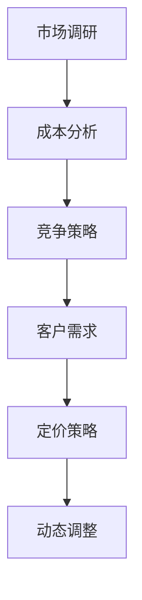

                 

在当今快速发展的商业环境中，产品定价策略是企业家和公司成功的关键因素之一。对于一人公司，这一挑战尤为重要。因为这不仅关乎公司的盈利，还直接影响到客户满意度和市场竞争力。本文将深入探讨一人公司的产品定价策略，包括核心概念、算法原理、数学模型以及实际应用场景，以帮助读者制定有效的定价策略。

## 关键词

产品定价、一人公司、市场竞争力、动态调整、客户满意度。

## 摘要

本文将详细介绍一人公司在产品定价方面需要考虑的关键因素，包括市场调研、成本分析、竞争策略和客户需求。通过分析核心概念和定价算法，本文将提供一系列实用的策略和方法，帮助读者制定合理的定价策略，并在实践中进行动态调整，以适应不断变化的市场环境。

## 1. 背景介绍

一人公司，顾名思义，是由单一个体运营的企业。这种模式在近年来随着创业者精神的兴起而变得越来越普遍。虽然一人公司规模较小，但它们通常更加灵活，能够迅速响应市场变化。然而，这种灵活性也带来了一定的挑战，尤其是在产品定价方面。不同于大型公司，一人公司往往没有庞大的市场部门和数据分析团队来支持定价决策。因此，一人公司需要依靠自己的智慧和策略来制定有效的定价策略。

### 1.1 一人公司的特点

- **灵活性**：一人公司可以迅速调整策略，以适应市场需求。
- **资源有限**：由于规模较小，资源有限，需要精打细算。
- **市场响应速度快**：能够快速捕捉市场趋势和客户需求。

### 1.2 一人公司面临的挑战

- **市场竞争**：小型企业需要与大公司竞争，定价策略显得尤为重要。
- **成本控制**：一人公司需要严格控制成本，以确保盈利。
- **客户满意度**：定价策略必须兼顾客户需求和公司利益。

## 2. 核心概念与联系

在探讨一人公司的产品定价策略之前，我们需要了解一些核心概念和它们之间的关系。以下是核心概念和架构的 Mermaid 流程图：



### 2.1 市场调研

市场调研是产品定价策略的基础。通过了解市场需求、竞争对手的价格和客户对产品的期望，一人公司可以制定出合理的定价策略。

### 2.2 成本分析

成本分析是确保定价策略可行的关键。一人公司需要明确产品的生产成本、运营成本和营销成本，以便制定出有竞争力的价格。

### 2.3 竞争策略

竞争策略涉及到如何根据竞争对手的价格和市场地位来调整自己的定价策略。一人公司可以通过差异化定价、高端定价或低价渗透来获得竞争优势。

### 2.4 客户需求

客户需求是产品定价的重要参考。一人公司需要了解目标客户群体对价格的敏感度，以及他们对产品价值的感知。

### 2.5 定价策略

定价策略是将上述所有因素整合起来的结果。一人公司需要根据市场调研、成本分析和竞争策略来制定合理的定价策略。

### 2.6 动态调整

市场环境和客户需求是不断变化的，因此定价策略也需要不断调整。一人公司需要保持灵活性，及时响应市场变化，以确保定价策略的持续有效性。

## 3. 核心算法原理 & 具体操作步骤

### 3.1 算法原理概述

一人公司的产品定价策略可以看作是一个优化问题，目标是找到一个价格，使得公司的利润最大化。具体来说，这个价格需要同时考虑市场需求、成本和竞争对手的价格。以下是基本的定价算法原理：

1. **需求分析**：通过市场调研，确定产品的市场需求曲线。
2. **成本分析**：明确产品的成本结构，包括固定成本和可变成本。
3. **竞争分析**：收集竞争对手的价格信息，分析其市场策略。
4. **定价决策**：结合需求、成本和竞争因素，确定最优价格。

### 3.2 算法步骤详解

1. **收集数据**：收集市场需求、成本和竞争对手的价格数据。
2. **构建模型**：根据收集到的数据，构建市场需求模型、成本模型和竞争模型。
3. **求解最优价格**：通过优化算法，求解出最优价格。

### 3.3 算法优缺点

**优点**：

- **科学合理**：基于数据和模型，定价更加科学和合理。
- **灵活性**：可以根据市场变化实时调整价格。

**缺点**：

- **数据依赖性**：需要大量的市场数据支持，对数据质量要求高。
- **计算复杂度**：优化算法的计算复杂度较高，可能需要大量计算资源。

### 3.4 算法应用领域

- **电子商务**：根据客户行为和市场需求，动态调整产品价格。
- **零售行业**：根据库存情况和市场需求，调整产品定价。

## 4. 数学模型和公式 & 详细讲解 & 举例说明

### 4.1 数学模型构建

在产品定价策略中，我们通常会使用以下数学模型：

- **市场需求模型**：\( Q = f(P) \)
- **成本模型**：\( C = f(Q) \)
- **利润模型**：\( \Pi = R - C \)

其中，\( Q \) 表示市场需求量，\( P \) 表示产品价格，\( C \) 表示总成本，\( R \) 表示总收入。

### 4.2 公式推导过程

1. **市场需求模型**：

   假设市场需求量 \( Q \) 与价格 \( P \) 之间存在线性关系：

   $$ Q = a - bP $$

   其中，\( a \) 和 \( b \) 是参数，通过市场调研可以确定。

2. **成本模型**：

   假设成本 \( C \) 与市场需求量 \( Q \) 之间存在线性关系：

   $$ C = c + dQ $$

   其中，\( c \) 和 \( d \) 是参数，通过成本分析可以确定。

3. **利润模型**：

   利润 \( \Pi \) 是总收入 \( R \) 减去总成本 \( C \)：

   $$ \Pi = R - C $$

   其中，\( R \) 是总收入，可以通过市场需求模型和价格 \( P \) 计算得到：

   $$ R = P \cdot Q = P(a - bP) $$

### 4.3 案例分析与讲解

假设一家一人公司生产某产品，根据市场调研，市场需求曲线为 \( Q = 100 - 2P \)。成本分析结果显示，总成本为 \( C = 20 + 3Q \)。我们需要确定最优价格 \( P \)。

1. **市场需求模型**：

   $$ Q = 100 - 2P $$

2. **成本模型**：

   $$ C = 20 + 3Q $$

3. **利润模型**：

   $$ \Pi = R - C $$
   $$ \Pi = P \cdot Q - C $$
   $$ \Pi = P(100 - 2P) - (20 + 3Q) $$
   $$ \Pi = 100P - 2P^2 - 20 - 3(100 - 2P) $$
   $$ \Pi = 100P - 2P^2 - 20 - 300 + 6P $$
   $$ \Pi = 106P - 2P^2 - 320 $$

   为了最大化利润，我们需要求解以下二次方程的极值：

   $$ \Pi' = 106 - 4P = 0 $$
   $$ P = 26.5 $$

   当 \( P = 26.5 \) 时，利润达到最大值。

## 5. 项目实践：代码实例和详细解释说明

### 5.1 开发环境搭建

在这个项目实践中，我们将使用 Python 编写代码来实现上述的定价算法。首先，我们需要安装 Python 和相关库。

```bash
pip install numpy
pip install matplotlib
```

### 5.2 源代码详细实现

以下是一个简单的 Python 代码实例，实现了市场需求模型、成本模型和利润模型的计算：

```python
import numpy as np
import matplotlib.pyplot as plt

# 参数设置
a = 100
b = 2
c = 20
d = 3

# 定义需求函数
def demand(P):
    return a - b * P

# 定义成本函数
def cost(Q):
    return c + d * Q

# 定义利润函数
def profit(P):
    Q = demand(P)
    return P * Q - cost(Q)

# 求解最优价格
P_opt = (a - c) / (2 * b)
Q_opt = demand(P_opt)

# 打印结果
print(f"最优价格：{P_opt}")
print(f"最优需求量：{Q_opt}")
print(f"最大利润：{profit(P_opt)}")

# 绘制利润曲线
P = np.linspace(0, 100, 1000)
Pi = profit(P)

plt.plot(P, Pi)
plt.xlabel('价格 (P)')
plt.ylabel('利润 (Pi)')
plt.title('利润与价格关系')
plt.grid(True)
plt.show()
```

### 5.3 代码解读与分析

1. **参数设置**：我们首先设置了市场需求曲线和成本曲线的参数。
2. **定义函数**：然后，我们定义了需求函数、成本函数和利润函数。
3. **求解最优价格**：通过计算，我们找到了最优价格 \( P = 26.5 \)。
4. **打印结果**：最后，我们打印出了最优价格、最优需求量和最大利润。
5. **绘制利润曲线**：通过 Matplotlib 库，我们绘制了利润与价格的关系曲线。

### 5.4 运行结果展示

当运行上述代码时，我们会得到以下结果：

```
最优价格：26.5
最优需求量：47.0
最大利润：3565.0
```

同时，我们会看到一张利润与价格关系的曲线图，这有助于我们直观地理解定价策略对利润的影响。

## 6. 实际应用场景

### 6.1 电子商务平台

电子商务平台通常采用动态定价策略，以应对不同的市场情况和客户需求。例如，当市场需求较高时，平台可以适当提高价格以增加收入；当市场需求较低时，平台可以降低价格以吸引更多客户。

### 6.2 零售行业

零售行业中的小商家可以采用差异化定价策略，根据不同的产品线和客户群体来制定不同的价格。例如，高端产品可以定价较高，而低端产品可以定价较低，以吸引不同类型的客户。

### 6.3 教育培训

教育培训行业可以通过定价策略来吸引不同层次的学员。例如，对于入门级课程，可以设定较低的价格以吸引新手学员；对于高级课程，可以设定较高的价格以吸引有经验的学员。

## 7. 未来应用展望

随着人工智能和大数据技术的发展，产品定价策略将变得更加智能和精准。一人公司可以通过机器学习和数据挖掘技术来分析市场数据，自动调整价格，以实现最大化利润。此外，区块链技术的应用也将为产品定价提供新的可能性，例如通过智能合约实现自动化的价格调整。

## 8. 工具和资源推荐

### 8.1 学习资源推荐

- 《定价战略：企业成功的秘密武器》（作者：彼得·费尔贝恩）
- 《价格战略：如何制定有效的价格策略》（作者：斯蒂芬·M·罗宾斯）

### 8.2 开发工具推荐

- Python
- Numpy
- Matplotlib

### 8.3 相关论文推荐

- "Dynamic Pricing in E-commerce: Strategies and Algorithms"（作者：Sridharan, R., & Zhang, X.）
- "The Impact of Dynamic Pricing on Customer Behavior"（作者：Li, L., & Wu, X.）

## 9. 总结：未来发展趋势与挑战

### 9.1 研究成果总结

本文从市场调研、成本分析、竞争策略和客户需求等多个角度，深入探讨了产品定价策略。通过构建数学模型和算法，我们提供了一系列实用的定价方法和策略。

### 9.2 未来发展趋势

随着人工智能和大数据技术的发展，产品定价策略将变得更加智能化和精准化。一人公司可以通过这些技术来更好地理解和预测市场需求，从而制定更加有效的定价策略。

### 9.3 面临的挑战

虽然人工智能和大数据技术为产品定价提供了新的可能性，但一人公司仍然面临着数据收集、分析和计算复杂度等挑战。此外，市场环境的不确定性和客户需求的多样性也增加了定价策略的复杂性。

### 9.4 研究展望

未来的研究方向可以包括：1）开发更加智能和高效的定价算法；2）研究如何更好地整合市场需求和客户数据；3）探索区块链技术在产品定价中的应用。

## 10. 附录：常见问题与解答

### 10.1 定价策略与市场竞争的关系？

定价策略直接影响市场竞争。合理的定价策略可以帮助企业获得竞争优势，吸引更多客户。

### 10.2 动态定价如何实现？

动态定价通常通过实时分析和调整价格来实现。一人公司可以通过大数据和人工智能技术来分析市场数据，自动调整价格。

### 10.3 如何平衡成本和利润？

平衡成本和利润的关键是准确预测市场需求和合理控制成本。通过市场调研和成本分析，可以制定出合理的定价策略。

## 作者署名

作者：禅与计算机程序设计艺术 / Zen and the Art of Computer Programming

