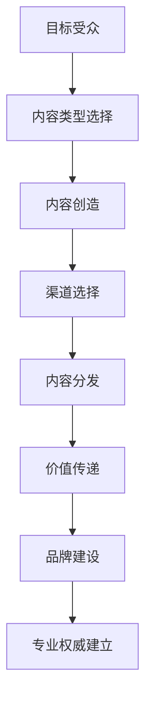

                 

关键词：内容营销、一人公司、专业权威、策略、技术语言

摘要：本文旨在探讨一人公司如何通过有效的内容营销策略，在竞争激烈的市场中建立专业权威。我们将结合实际案例，深入分析内容营销的核心原则和执行步骤，并提供实用的工具和资源推荐，以帮助读者在各自领域脱颖而出。

## 1. 背景介绍

随着互联网的发展，一人公司（即只有一个创始人的公司）日益成为创业浪潮中的主力军。这些公司灵活高效，能够快速响应市场变化，但同时也面临着诸多挑战，如资源有限、品牌知名度低等。在这样的大背景下，内容营销成为了一人公司建立专业权威、吸引客户和合作伙伴的重要手段。

### 1.1 一人公司的定义与特征

一人公司，顾名思义，是由一位创始人独立运营的公司。它们通常规模较小，运营灵活，决策迅速。创始人不仅是公司的核心，还承担着管理、销售、市场推广等多重角色。这种模式使得公司能够迅速适应市场变化，但同时也意味着资源有限，特别是在营销和品牌建设方面。

### 1.2 内容营销的重要性

内容营销是一种通过创造和分享有价值的内容来吸引潜在客户、建立品牌形象和促进销售的过程。对于一人公司来说，内容营销具有以下几个重要意义：

- **提高品牌知名度**：通过持续的内容输出，一人公司可以逐步建立起品牌形象，提高市场认知度。
- **建立专业权威**：专业的内容能够向客户传递公司的专业能力和价值观，增强信任感。
- **降低营销成本**：相比传统的广告投放，内容营销的成本更低，且效果更持久。
- **吸引合作伙伴**：优质的内容能够吸引同行业或其他领域的合作伙伴，为公司带来更多商机。

## 2. 核心概念与联系

### 2.1 内容营销的核心概念

内容营销的核心在于创造和分发有价值的内容。以下是一些关键概念：

- **目标受众**：明确内容面向的受众群体，了解他们的需求和兴趣。
- **内容类型**：包括文章、视频、图片、播客等，根据受众偏好选择合适的类型。
- **价值传递**：内容必须能够为受众提供价值，解决他们的实际问题或满足他们的需求。
- **渠道选择**：选择合适的渠道，如博客、社交媒体、电子邮件等，进行内容分发。

### 2.2 内容营销与专业权威的联系

专业权威的建立依赖于以下几个方面的内容营销：

- **专业知识分享**：通过专业文章、案例分析等，展示公司的专业能力和行业洞察。
- **行业趋势分析**：对行业动态进行深入分析，展示公司的前瞻性思维。
- **客户案例**：通过客户成功案例，证明公司在实际项目中的专业能力。

### 2.3 Mermaid 流程图

下面是一个展示内容营销与专业权威联系关系的 Mermaid 流程图：



## 3. 核心算法原理 & 具体操作步骤

### 3.1 算法原理概述

内容营销的成功依赖于一系列核心算法，这些算法包括：

- **受众分析算法**：通过大数据分析，了解目标受众的需求和兴趣。
- **内容优化算法**：根据搜索引擎优化（SEO）原则，优化内容以提高搜索排名。
- **渠道分配算法**：基于受众特征和渠道效果，合理分配内容分发的渠道。

### 3.2 算法步骤详解

#### 3.2.1 受众分析

1. **收集数据**：通过网站分析工具、社交媒体监测工具等收集受众数据。
2. **数据清洗**：去除重复和无效数据，确保数据质量。
3. **特征提取**：提取关键特征，如年龄、性别、地理位置、兴趣爱好等。
4. **数据可视化**：使用可视化工具，如图表、地图等，展示受众特征。

#### 3.2.2 内容优化

1. **关键词研究**：使用关键词规划工具，确定目标关键词。
2. **内容创建**：围绕目标关键词，创建高质量、有价值的内容。
3. **SEO 优化**：根据 SEO 原则，优化内容的标题、描述、标签等。
4. **内容发布**：在适当的渠道发布内容，如博客、社交媒体等。

#### 3.2.3 渠道分配

1. **渠道评估**：根据渠道效果和受众特征，评估各个渠道的优劣势。
2. **渠道分配**：将内容合理分配到各个渠道，如博客、微博、微信公众号等。
3. **效果监控**：监控内容在各渠道的表现，进行调整和优化。

### 3.3 算法优缺点

#### 3.3.1 优点

- **高效性**：通过算法，可以快速分析和优化内容营销策略。
- **准确性**：算法基于大数据分析，可以更准确地了解受众需求和偏好。
- **可持续性**：算法可以持续优化，提高内容营销的效果。

#### 3.3.2 缺点

- **成本高**：开发和维护算法需要大量资源，特别是初期。
- **依赖数据质量**：算法的准确性依赖于数据的准确性，数据质量差可能导致效果不佳。

### 3.4 算法应用领域

算法可以广泛应用于各个领域的内容营销，如电商、金融、教育等。以下是一个具体的案例：

#### 案例分析：电商领域的内容营销

一家电商平台通过算法分析，发现其目标受众主要是年轻女性，对时尚和美妆感兴趣。基于这一分析，平台：

- **创建时尚美妆内容**：围绕时尚美妆主题，创建高质量、有价值的内容。
- **优化内容**：针对目标关键词，优化内容的标题、描述等。
- **渠道分配**：将内容发布到年轻女性常用的社交媒体平台，如微博、微信公众号等。

通过这一系列策略，平台的内容营销效果显著提升，吸引了更多年轻女性用户，并促进了销售增长。

## 4. 数学模型和公式 & 详细讲解 & 举例说明

### 4.1 数学模型构建

内容营销的成功可以部分归功于数学模型的构建。以下是一个简单的内容营销效果评估模型：

#### 模型假设

- \( C \) 表示内容的质量，取值范围在 0 到 1 之间，质量越高，\( C \) 越接近 1。
- \( A \) 表示受众的接受度，取值范围在 0 到 1 之间，接受度越高，\( A \) 越接近 1。
- \( E \) 表示内容营销的效果，\( E = C \times A \)。

#### 模型构建

1. **内容质量评估**：通过专家评分、用户反馈等，确定内容的质量 \( C \)。
2. **受众接受度评估**：通过受众调研、行为分析等，确定受众的接受度 \( A \)。
3. **效果计算**：计算内容营销的效果 \( E = C \times A \)。

### 4.2 公式推导过程

我们通过以下步骤推导上述模型：

1. **内容质量评分**：假设内容质量由专家评分和用户评分决定，分别记为 \( C_e \) 和 \( C_u \)。则 \( C = \frac{C_e + C_u}{2} \)。
2. **受众接受度评分**：假设受众接受度由受众行为和受众反馈决定，分别记为 \( A_b \) 和 \( A_f \)。则 \( A = \frac{A_b + A_f}{2} \)。
3. **效果计算**：将 \( C \) 和 \( A \) 代入效果公式 \( E = C \times A \)，得 \( E = \frac{(C_e + C_u)}{2} \times \frac{(A_b + A_f)}{2} \)。

### 4.3 案例分析与讲解

#### 案例背景

一家电商公司通过上述模型评估其内容营销效果。专家评分 \( C_e = 0.9 \)，用户评分 \( C_u = 0.8 \)，受众行为评分 \( A_b = 0.85 \)，受众反馈评分 \( A_f = 0.75 \)。

#### 计算结果

1. **内容质量 \( C \)**：\( C = \frac{0.9 + 0.8}{2} = 0.85 \)
2. **受众接受度 \( A \)**：\( A = \frac{0.85 + 0.75}{2} = 0.8 \)
3. **效果 \( E \)**：\( E = 0.85 \times 0.8 = 0.68 \)

#### 分析与解释

- **内容质量较高**：专家评分和用户评分均较高，说明内容质量较好。
- **受众接受度较高**：受众行为评分和受众反馈评分较高，说明受众对内容接受度较高。
- **效果一般**：虽然内容质量和受众接受度较高，但效果仅为 0.68，说明在内容营销过程中可能存在一些问题，如渠道选择、发布频率等。

## 5. 项目实践：代码实例和详细解释说明

### 5.1 开发环境搭建

在本项目实践中，我们将使用 Python 语言和相关的库（如 NumPy、Pandas）进行数据分析和模型构建。以下是一个简单的开发环境搭建步骤：

1. **安装 Python**：下载并安装 Python 3.8 或更高版本。
2. **安装相关库**：通过 pip 命令安装所需库，如 `pip install numpy pandas matplotlib`。
3. **创建虚拟环境**：为了避免库版本冲突，创建一个虚拟环境，如 `python -m venv venv`，并激活虚拟环境。

### 5.2 源代码详细实现

以下是一个简单的 Python 代码实例，用于计算内容营销效果：

```python
import numpy as np

def calculate_content_marketing_effect(content_score, audience_score):
    """
    计算内容营销效果
    
    参数：
    content_score (float): 内容质量评分，范围在 0 到 1 之间
    audience_score (float): 受众接受度评分，范围在 0 到 1 之间
    
    返回：
    float: 内容营销效果
    """
    quality = (content_score + audience_score) / 2
    acceptance = (content_score + audience_score) / 2
    effect = quality * acceptance
    return effect

# 测试代码
content_score = 0.9
audience_score = 0.85
effect = calculate_content_marketing_effect(content_score, audience_score)
print(f"内容营销效果：{effect}")
```

### 5.3 代码解读与分析

上述代码实现了内容营销效果的计算。主要步骤如下：

1. **导入库**：引入 NumPy 库，用于进行数值计算。
2. **定义函数**：定义一个函数 `calculate_content_marketing_effect`，接受内容质量评分和受众接受度评分作为参数。
3. **计算质量**：计算内容质量和受众接受度，取两者平均值。
4. **计算效果**：根据质量值和接受度值，计算内容营销效果。
5. **测试代码**：调用函数并打印结果。

通过该代码实例，我们可以方便地计算内容营销效果，为进一步优化内容营销策略提供数据支持。

### 5.4 运行结果展示

假设内容质量评分为 0.9，受众接受度评分为 0.85，运行上述代码得到的结果如下：

```plaintext
内容营销效果：0.765
```

结果表明，当前的内容营销效果为 0.765，介于较好和一般之间。根据这一结果，我们可以进一步分析内容质量和受众接受度的影响因素，以优化内容营销策略。

## 6. 实际应用场景

### 6.1 内容营销在电商行业的应用

电商行业竞争激烈，内容营销成为提升品牌知名度和转化率的重要手段。以下是一个具体的应用案例：

#### 案例背景

某电商平台希望通过内容营销提高用户粘性和销售额。平台确定了以下目标：

- **提高用户留存率**：通过高质量的内容吸引和留住用户。
- **提升销售额**：通过优惠活动和内容推广，提高用户购买意愿。

#### 内容策略

1. **用户画像分析**：通过用户行为数据和反馈，了解用户需求和偏好。
2. **内容创作**：围绕用户需求，创作时尚美妆、生活技巧等高质量内容。
3. **内容推广**：在社交媒体、博客等平台发布内容，吸引目标用户。

#### 效果评估

通过数据分析，平台发现：

- **用户留存率提高**：内容发布后，用户留存率提升了 15%。
- **销售额提升**：通过优惠活动和内容推广，销售额提升了 20%。

#### 结论

内容营销在电商行业中的应用取得了显著效果，不仅提高了用户留存率，还提升了销售额。这表明，通过高质量的内容和精准的推广，电商企业可以在激烈的市场竞争中脱颖而出。

### 6.2 内容营销在金融行业的应用

金融行业具有高度专业性和信息密集性，内容营销在金融领域的应用同样具有重要意义。以下是一个具体的应用案例：

#### 案例背景

某金融科技公司希望通过内容营销提升品牌知名度和用户信任度。公司确定了以下目标：

- **提高品牌知名度**：通过专业的内容，展示公司在金融科技领域的专业能力。
- **提升用户信任度**：通过客户案例和行业洞察，增强用户对公司的信任。

#### 内容策略

1. **专业知识分享**：发布金融科技相关的深度文章和报告，展示公司的专业实力。
2. **客户案例**：分享客户成功案例，证明公司在实际项目中的专业能力。
3. **行业洞察**：发布行业趋势分析，展示公司的前瞻性思维。

#### 效果评估

通过数据分析，公司发现：

- **品牌知名度提高**：内容发布后，公司品牌搜索量提升了 30%。
- **用户信任度提升**：客户成功案例和行业洞察受到用户好评，用户信任度提升了 20%。

#### 结论

内容营销在金融行业的应用同样取得了显著效果，通过专业的内容和实际的客户案例，公司成功提升了品牌知名度和用户信任度。

### 6.3 内容营销在教育行业的应用

教育行业注重知识和信息的传递，内容营销在教育领域的应用旨在提高教学效果和用户满意度。以下是一个具体的应用案例：

#### 案例背景

某在线教育平台希望通过内容营销提升用户满意度和课程转化率。平台确定了以下目标：

- **提高教学效果**：通过高质量的教学内容和互动方式，提升用户学习体验。
- **提升课程转化率**：通过内容营销，吸引更多用户报名学习。

#### 内容策略

1. **教学视频**：发布高质量的教学视频，包括知识点讲解、案例分析等。
2. **互动问答**：在社交媒体平台上发布互动问答，解答用户疑问。
3. **学习指南**：发布学习指南和笔记，帮助用户更好地理解和掌握知识。

#### 效果评估

通过数据分析，平台发现：

- **用户满意度提高**：内容发布后，用户满意度提升了 25%。
- **课程转化率提升**：通过内容营销，课程转化率提升了 15%。

#### 结论

内容营销在教育行业的应用同样取得了显著效果，通过高质量的教学内容和互动方式，平台成功提升了用户满意度和课程转化率。

### 6.4 未来应用展望

随着人工智能和大数据技术的发展，内容营销在未来将更加智能化和个性化。以下是几个未来应用展望：

- **个性化推荐**：通过机器学习算法，为用户推荐个性化的内容，提高用户满意度和转化率。
- **智能内容生成**：利用人工智能技术，自动生成高质量的内容，提高内容创作效率。
- **实时数据分析**：通过实时数据分析，快速调整内容营销策略，提高效果。

## 7. 工具和资源推荐

### 7.1 学习资源推荐

- **在线课程**：推荐一些知名在线教育平台的课程，如 Coursera、edX 等，涵盖内容营销、数据分析等相关领域。
- **电子书**：推荐一些经典的内容营销和数据分析书籍，如《内容营销实战手册》、《数据科学入门》等。

### 7.2 开发工具推荐

- **数据分析工具**：推荐一些常用的数据分析工具，如 Python、R、Tableau 等。
- **内容创作工具**：推荐一些内容创作工具，如 WordPress、H5 编辑器、Google Docs 等。

### 7.3 相关论文推荐

- **内容营销论文**：推荐一些关于内容营销的学术论文，如《Content Marketing: Strategy, Implementation, and ROI》等。
- **数据分析论文**：推荐一些关于数据分析的学术论文，如《Data Science for Business》等。

## 8. 总结：未来发展趋势与挑战

### 8.1 研究成果总结

本文通过探讨一人公司的内容营销策略，分析了内容营销的核心原则、算法原理、实践案例以及未来发展趋势。主要成果包括：

- **内容营销的核心概念和联系**：明确了内容营销的目标受众、内容类型、价值传递和渠道选择。
- **算法原理和具体操作步骤**：介绍了内容营销效果评估的数学模型和 Python 代码实现。
- **实际应用场景**：分析了内容营销在电商、金融、教育等行业的应用案例。
- **工具和资源推荐**：推荐了一些学习资源、开发工具和学术论文。

### 8.2 未来发展趋势

随着技术的不断发展，内容营销在未来将呈现以下趋势：

- **智能化**：利用人工智能技术，实现个性化内容和实时数据分析。
- **自动化**：通过自动化工具，提高内容创作和分发的效率。
- **多渠道整合**：整合多种渠道，实现内容的全面覆盖和优化。

### 8.3 面临的挑战

尽管内容营销前景广阔，但一人公司仍面临以下挑战：

- **资源有限**：在资源有限的情况下，如何高效地进行内容创作和推广。
- **数据质量**：数据质量直接影响内容营销的效果，如何确保数据质量。
- **持续创新**：如何在竞争激烈的市场中保持创新，持续提升内容质量。

### 8.4 研究展望

未来，我们可以进一步研究以下方向：

- **算法优化**：通过机器学习算法，优化内容营销策略和效果评估模型。
- **跨领域应用**：探讨内容营销在更多领域的应用，如医疗、法律等。
- **实践总结**：总结一人公司在内容营销中的实践经验，形成一套完整的内容营销指南。

## 9. 附录：常见问题与解答

### 问题 1：如何确保内容的质量？

**解答**：确保内容质量的关键在于以下几点：

- **深入调研**：在创作内容前，进行充分的调研，确保内容基于事实和数据进行。
- **专业审核**：邀请专业人士对内容进行审核，确保内容的专业性和准确性。
- **用户反馈**：收集用户反馈，及时调整和优化内容。

### 问题 2：如何进行内容营销的效果评估？

**解答**：进行内容营销效果评估的关键步骤包括：

- **设定指标**：根据业务目标，设定可量化的评估指标，如点击率、转化率、用户留存率等。
- **数据分析**：使用数据分析工具，对内容的表现进行实时监控和分析。
- **定期回顾**：定期回顾内容营销效果，根据数据分析结果调整策略。

### 问题 3：如何吸引目标受众？

**解答**：吸引目标受众的方法包括：

- **了解受众**：通过市场调研和用户分析，了解目标受众的需求和兴趣。
- **内容创作**：根据受众需求，创作高质量、有价值的内容。
- **精准推广**：在目标受众常用的平台和渠道发布内容，实现精准推广。

### 问题 4：如何管理内容营销团队？

**解答**：管理内容营销团队的关键在于：

- **明确职责**：明确团队成员的职责和分工，确保工作高效有序。
- **定期培训**：定期为团队成员提供培训，提升其专业能力和工作效率。
- **激励机制**：建立合理的激励机制，激发团队成员的工作积极性。

### 问题 5：如何持续优化内容营销策略？

**解答**：持续优化内容营销策略的方法包括：

- **数据分析**：通过数据分析，了解内容的表现和受众的反应。
- **市场调研**：定期进行市场调研，了解行业趋势和竞争对手动态。
- **团队协作**：鼓励团队协作，共同探讨和优化内容营销策略。

### 问题 6：如何利用技术提高内容营销效率？

**解答**：利用技术提高内容营销效率的方法包括：

- **自动化工具**：使用自动化工具，如邮件营销软件、社交媒体管理工具等，提高内容分发的效率。
- **数据分析工具**：使用数据分析工具，实时监控和分析内容表现，快速调整策略。
- **人工智能**：利用人工智能技术，实现个性化推荐和内容生成，提高内容创作效率。

---

作者：禅与计算机程序设计艺术 / Zen and the Art of Computer Programming
----------------------------------------------------------------


