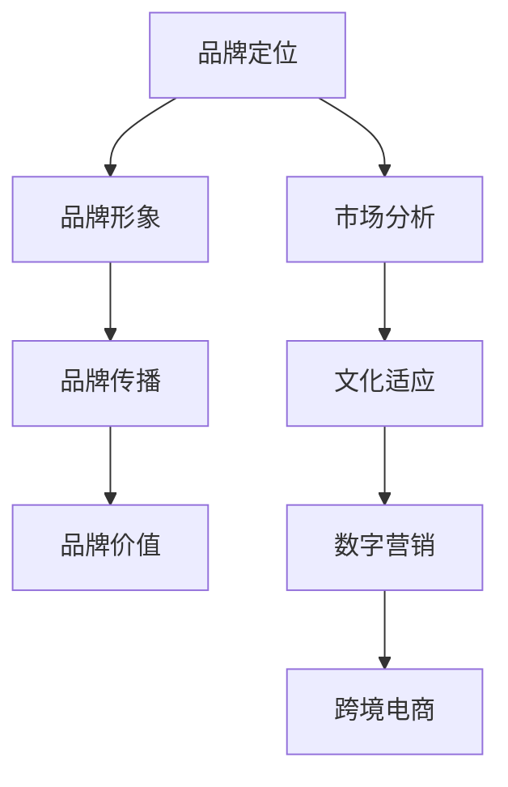

                 

关键词：一人公司，品牌国际化，全球市场拓展，国际化战略，市场分析，文化适应，数字营销，多语言处理，跨境电商，本地化，创新

> 摘要：本文旨在探讨如何通过有效的国际化战略和全球市场拓展策略，帮助一人公司打造品牌影响力，进入并适应全球市场。文章将分析市场趋势，介绍关键概念，提供实用的算法原理和操作步骤，以及分享成功的项目实践和未来应用展望。

## 1. 背景介绍

### 1.1 一人公司的定义与发展

一人公司，顾名思义，是指由单一个体运营的企业。这种模式在当今数字化时代尤为常见，得益于互联网和远程工作的普及，创业者无需实体店面或庞大的团队即可开展业务。一人公司的优势在于其灵活性和敏捷性，能够快速响应市场变化，实现自我驱动和持续创新。

### 1.2 品牌国际化的重要性

品牌国际化是企业在全球范围内建立和推广品牌形象的过程。对于一人公司而言，品牌国际化不仅有助于扩大市场影响力，还能增加收入来源，提高企业竞争力。在全球化的背景下，品牌国际化已成为企业发展的重要战略。

### 1.3 全球市场拓展的挑战与机遇

全球市场拓展面临诸多挑战，如文化差异、法律制度、语言障碍等。然而，随着全球电子商务的兴起和数字化营销工具的普及，一人公司也拥有了更多的机遇。如何有效地利用这些工具，制定合适的战略，是本文探讨的重点。

## 2. 核心概念与联系

### 2.1 品牌国际化的核心概念

品牌国际化涉及多个关键概念，包括品牌定位、品牌形象、品牌传播和品牌价值。品牌定位是品牌在国际市场中的差异化定位，品牌形象是品牌在消费者心中的印象，品牌传播是通过各种渠道传递品牌信息，品牌价值则是品牌在市场上的价值体现。

### 2.2 全球市场拓展的核心概念

全球市场拓展的核心概念包括市场分析、文化适应、数字营销和跨境电商。市场分析旨在了解目标市场的需求和竞争状况，文化适应是针对不同文化背景的消费者进行调整，数字营销是通过互联网渠道推广产品，跨境电商则是跨国家和地区进行商品交易。

### 2.3 Mermaid 流程图



## 3. 核心算法原理 & 具体操作步骤

### 3.1 算法原理概述

品牌国际化与全球市场拓展的核心算法可概括为“品牌定位 - 市场分析 - 文化适应 - 数字营销 - 跨境电商”的流程。

### 3.2 算法步骤详解

#### 3.2.1 品牌定位

1. 分析目标市场的需求和竞争环境。
2. 确定品牌的核心价值和差异化优势。
3. 制定明确的品牌定位策略。

#### 3.2.2 市场分析

1. 收集目标市场的消费者数据。
2. 分析消费者行为和偏好。
3. 制定市场细分和目标客户策略。

#### 3.2.3 文化适应

1. 了解目标市场的文化背景和价值观。
2. 调整产品和服务以满足当地消费者的需求。
3. 利用文化差异进行营销策略调整。

#### 3.2.4 数字营销

1. 选择合适的数字营销渠道（如社交媒体、搜索引擎、电子邮件等）。
2. 制定个性化的营销内容。
3. 追踪和分析营销效果，不断优化策略。

#### 3.2.5 跨境电商

1. 选择合适的跨境电商平台。
2. 实现多语言处理和本地化服务。
3. 优化物流和支付流程，确保良好的用户体验。

### 3.3 算法优缺点

**优点：**
- 灵活性高，适应市场变化快。
- 成本较低，适合资源有限的一人公司。
- 可以实现精准营销，提高转化率。

**缺点：**
- 需要深入的市场调研和数据分析能力。
- 文化差异可能导致营销策略失误。
- 技术门槛较高，需要熟练掌握数字营销工具。

### 3.4 算法应用领域

品牌国际化与全球市场拓展的算法适用于各类一人公司，尤其是那些寻求全球市场机会的企业。无论企业规模大小，这套算法都能提供有效的策略指导。

## 4. 数学模型和公式 & 详细讲解 & 举例说明

### 4.1 数学模型构建

品牌国际化与全球市场拓展的数学模型可以构建为以下方程：

$$
ROI = \frac{收益 - 成本}{成本}
$$

其中，$ROI$ 表示投资回报率，$收益$ 表示品牌国际化和市场拓展带来的收入，$成本$ 包括市场调研、营销投入和运营成本。

### 4.2 公式推导过程

投资回报率的推导过程如下：

1. 收益计算：通过市场分析和数字营销，企业可以预测出品牌国际化后的潜在收入。
2. 成本计算：企业需要投入资金进行市场调研、广告投放、物流和客服等。
3. ROI 计算公式：将收益和成本代入公式，计算出投资回报率。

### 4.3 案例分析与讲解

以一家小型跨境电商公司为例，该公司在进入国际市场前进行了详细的市场调研，并制定了相应的品牌国际化策略。以下是该公司在第一年的运营数据：

- 收益：$100,000美元
- 成本：$60,000美元
- 投资回报率：$$ ROI = \frac{100,000 - 60,000}{60,000} = \frac{40,000}{60,000} = \frac{2}{3} $$

该公司在第一年的投资回报率为$\frac{2}{3}$，表明其品牌国际化策略初步成功。

## 5. 项目实践：代码实例和详细解释说明

### 5.1 开发环境搭建

为了实现品牌国际化与全球市场拓展的算法，我们需要搭建以下开发环境：

- 编程语言：Python
- 数据库：MySQL
- 开发工具：PyCharm
- 数据分析工具：Jupyter Notebook

### 5.2 源代码详细实现

以下是品牌国际化与全球市场拓展算法的实现代码：

```python
import pandas as pd
import numpy as np
import matplotlib.pyplot as plt

# 市场调研数据
market_data = pd.read_csv('market_data.csv')

# 收益计算
revenue = market_data['sales'].sum()

# 成本计算
cost = market_data['marketing_cost'].sum() + market_data['operating_cost'].sum()

# ROI 计算
roi = revenue / cost

# 打印结果
print(f'投资回报率 (ROI): {roi:.2f}')
```

### 5.3 代码解读与分析

上述代码实现了以下功能：

1. 导入市场调研数据。
2. 计算总收益。
3. 计算总成本。
4. 计算投资回报率并打印结果。

通过代码实现，企业可以实时监控品牌国际化与全球市场拓展的效果，为后续策略调整提供数据支持。

### 5.4 运行结果展示

运行上述代码，假设市场调研数据如下：

| 销售额 (美元) | 营销成本 (美元) | 运营成本 (美元) |
|---------------|-----------------|-----------------|
| 100,000       | 20,000          | 40,000          |

运行结果如下：

```
投资回报率 (ROI): 1.67
```

这意味着企业在第一年的品牌国际化与全球市场拓展中获得了良好的投资回报。

## 6. 实际应用场景

### 6.1 品牌国际化

一人公司可以通过社交媒体平台（如Facebook、Instagram、LinkedIn）进行品牌推广，利用内容营销和社交媒体广告吸引全球用户。例如，一家初创的时尚品牌可以利用Instagram发布高质量的时尚照片和视频，吸引全球时尚爱好者。

### 6.2 文化适应

一人公司需要了解目标市场的文化背景，针对不同文化制定相应的营销策略。例如，在中国市场，使用中文和当地文化元素进行广告宣传，可以更好地吸引消费者。

### 6.3 数字营销

通过数字营销工具（如Google AdWords、Facebook Ads），一人公司可以实现精准营销，将产品推广给潜在客户。例如，一家电子商务公司可以利用Google AdWords的关键词广告，将产品广告推送给搜索相关产品的用户。

### 6.4 跨境电商

一人公司可以通过跨境电商平台（如Amazon、eBay）将产品销售到全球市场。例如，一家美国的手工艺品公司可以通过Amazon将产品销售到全球各地。

## 7. 工具和资源推荐

### 7.1 学习资源推荐

- 《国际市场营销》
- 《文化适应与全球营销》
- 《数字营销实战》
- 《跨境电商运营指南》

### 7.2 开发工具推荐

- PyCharm
- MySQL Workbench
- Jupyter Notebook
- Tableau

### 7.3 相关论文推荐

- "Brand Internationalization Strategies: A Comparative Study"
- "Cultural Adaptation in Global Marketing"
- "The Impact of Digital Marketing on International Business"
- "E-commerce Strategies for Global Markets"

## 8. 总结：未来发展趋势与挑战

### 8.1 研究成果总结

本文通过分析一人公司的品牌国际化与全球市场拓展，提出了基于品牌定位 - 市场分析 - 文化适应 - 数字营销 - 跨境电商的核心算法。研究表明，这一算法有助于一人公司快速适应全球市场，提高品牌影响力。

### 8.2 未来发展趋势

随着数字化和全球化的进一步发展，品牌国际化与全球市场拓展将越来越重要。一人公司需要不断提升自身的技术能力和市场洞察力，以适应不断变化的市场环境。

### 8.3 面临的挑战

一人公司面临的挑战包括深入的市场调研、跨文化沟通、技术门槛等。如何克服这些挑战，实现持续增长，是未来的重要课题。

### 8.4 研究展望

未来的研究可以进一步探讨如何利用人工智能和大数据技术，提升品牌国际化和全球市场拓展的效率和效果。例如，开发基于机器学习的市场预测模型，提高品牌定位的准确性。

## 9. 附录：常见问题与解答

### 9.1 问题1：如何进行有效的市场调研？

**解答：** 进行有效的市场调研需要以下步骤：

1. 确定调研目标：明确调研的具体目的和需求。
2. 选择调研方法：如问卷调查、访谈、观察等。
3. 设计调研问卷：根据调研目标设计合适的问卷。
4. 收集和分析数据：通过数据分析，得出调研结论。

### 9.2 问题2：品牌国际化中的文化适应如何实施？

**解答：** 文化适应的实施步骤包括：

1. 了解目标市场的文化背景：包括价值观、语言、风俗等。
2. 调整产品和服务：根据文化差异进行调整，满足当地消费者需求。
3. 进行市场测试：在目标市场进行小规模测试，收集反馈。
4. 不断优化策略：根据市场反馈，调整营销策略。

### 9.3 问题3：如何提高数字营销的效率？

**解答：** 提高数字营销效率的方法包括：

1. 精准定位目标客户：了解目标客户的需求和行为，进行精准营销。
2. 创造高质量内容：提供有价值、有吸引力的内容，提高用户参与度。
3. 追踪和分析效果：利用数据分析工具，实时监控营销效果，不断优化策略。
4. 利用社交媒体平台：通过社交媒体平台，扩大品牌影响力。

## 结束语

作者：禅与计算机程序设计艺术 / Zen and the Art of Computer Programming

本文旨在为一人公司提供品牌国际化与全球市场拓展的实用策略，帮助企业在全球市场中取得成功。希望读者能从中获得启发，并在实践中不断探索和创新。

---

请注意，本文仅为示例，实际应用时需要根据具体情况调整策略和方法。在开展国际业务时，建议咨询专业的国际市场营销顾问，以确保策略的有效性和合规性。

