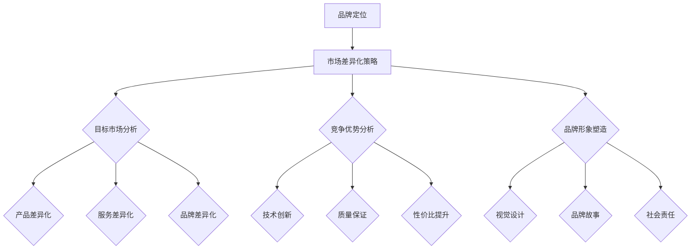

                 

在当今快速变化的市场环境中，一人公司作为一种新型的创业模式，正逐渐崭露头角。这一模式不仅降低了创业的门槛，而且为那些有才华但缺乏资源的个人提供了展示才华的舞台。然而，作为独立运营的企业，如何在竞争激烈的市场中脱颖而出，建立强大的品牌形象，制定有效的市场差异化策略，是每个一人公司必须面对的挑战。本文将探讨一人公司的品牌定位与市场差异化策略，通过深入分析，为一人公司提供一套切实可行的解决方案。

## 关键词
- 一人公司
- 品牌定位
- 市场差异化策略
- 品牌形象
- 市场细分

## 摘要
本文旨在分析一人公司在竞争激烈的市场环境中如何通过有效的品牌定位和差异化策略来建立和提升自身品牌形象。文章首先介绍了品牌定位和差异化策略的基本概念，然后通过具体案例和数据分析，提出了一套适合一人公司的品牌建设和市场差异化策略，并探讨了未来一人公司面临的挑战及发展机遇。

## 1. 背景介绍
### 1.1 一人公司的定义和特点
一人公司，顾名思义，是指由单一创始人或个人投资者完全控制和运营的企业。这种模式通常没有复杂的股权结构和庞大的员工团队，创始人既负责公司的战略方向，也亲自参与日常运营。一人公司的特点包括：

- **灵活性**：一人公司可以根据创始人的个人喜好和市场需求迅速调整策略。
- **高效性**：由于规模较小，决策流程通常更为迅速，减少了冗余和不必要的会议。
- **独立性**：一人公司不受外部投资者和股东的约束，创始人可以更自由地制定和执行自己的愿景。

### 1.2 市场环境分析
当前市场环境充满竞争，尤其在技术快速发展的今天，消费者需求不断变化，市场细分更加明显。一人公司在这种环境中面临的主要挑战包括：

- **资源限制**：相对于大型企业，一人公司在资金、人力和资源上存在明显劣势。
- **品牌认知度**：如何通过有限的资源和渠道提升品牌知名度和消费者信任度。
- **市场竞争**：如何在众多竞争者中脱颖而出，吸引目标客户。

### 1.3 品牌定位的重要性
品牌定位是企业市场营销的核心，它决定了企业如何在消费者心中建立独特的位置。对于一人公司，精准的品牌定位不仅有助于提升品牌形象，还可以在市场上树立独特的品牌识别度，从而在激烈的竞争中脱颖而出。有效的品牌定位需要考虑以下因素：

- **目标市场**：明确目标客户群体的需求和特点。
- **竞争优势**：分析自身的独特卖点，包括产品或服务的特色、技术优势、服务质量等。
- **品牌形象**：塑造一致的品牌视觉和语言，强化消费者对品牌的认知。

## 2. 核心概念与联系

### 2.1 品牌定位的概念
品牌定位是指企业在目标市场中为产品或服务设计独特的市场身份，以区分竞争对手并吸引目标客户。它包括以下几个关键要素：

- **目标市场**：明确要服务的客户群体，包括其年龄、性别、职业、消费习惯等。
- **品牌形象**：通过视觉、声音、文字等手段塑造独特的品牌形象，使其在消费者心中产生深刻的印象。
- **独特卖点**：明确产品的独特优势，如创新性、质量、性价比等，使其在市场中具有竞争力。

### 2.2 市场差异化策略的概念
市场差异化策略是指通过独特的产品、服务或品牌定位，使企业在市场中区别于竞争对手，从而吸引和保持客户。市场差异化策略可以包括以下几个方面：

- **产品差异化**：通过独特的功能、设计、材料等，使产品在市场上具有独特性。
- **服务差异化**：通过提供优质的客户服务、快速响应、定制化服务等，提升客户满意度。
- **品牌差异化**：通过品牌故事、价值观、社会责任感等，塑造独特的品牌形象。

### 2.3 品牌定位与市场差异化策略的关系
品牌定位和市场差异化策略是相辅相成的。品牌定位明确了企业在市场中的独特身份，而市场差异化策略则是实现这一身份的具体手段。有效的品牌定位需要依赖市场差异化策略来支持，而市场差异化策略则需要品牌定位来引导。通过将品牌定位与市场差异化策略相结合，一人公司可以在市场中建立强大的品牌形象，提升市场竞争力。

### 2.4 Mermaid 流程图


## 3. 核心算法原理 & 具体操作步骤

### 3.1 算法原理概述
一人公司的品牌定位与市场差异化策略的核心在于创建独特的品牌身份，并通过多种手段在市场中推广和巩固这一身份。这一过程可以看作是一种品牌策略算法，其基本原理包括以下几个方面：

- **市场调研**：通过数据分析、消费者调查等方法，了解目标市场的需求和竞争状况。
- **品牌定位**：根据市场调研结果，明确品牌的核心价值和目标市场，确定品牌独特性。
- **差异化策略**：根据品牌定位，制定具体的市场差异化策略，包括产品、服务和品牌差异化。
- **推广执行**：通过广告、社交媒体、公关活动等手段，将品牌定位和差异化策略传达给目标客户。

### 3.2 算法步骤详解

#### 3.2.1 市场调研
1. **确定研究目标**：明确需要收集哪些信息，例如消费者需求、市场趋势、竞争对手分析等。
2. **数据收集**：通过在线调查、访谈、问卷调查等方式收集数据。
3. **数据分析**：运用统计学方法和数据分析工具，对收集到的数据进行分析，提取关键信息。

#### 3.2.2 品牌定位
1. **确定目标市场**：根据数据分析结果，确定目标客户的特征和需求。
2. **分析竞争优势**：评估自身在产品、服务、技术等方面的独特优势。
3. **品牌定位决策**：结合目标市场和竞争优势，确定品牌的独特价值主张。

#### 3.2.3 市场差异化策略
1. **产品差异化**：通过技术创新、独特设计、优质材料等方式，提升产品竞争力。
2. **服务差异化**：提供优质的客户服务、定制化服务、快速响应等。
3. **品牌差异化**：通过品牌故事、社会责任、品牌形象等手段，塑造独特品牌形象。

#### 3.2.4 推广执行
1. **广告策略**：制定合适的广告策略，选择合适的广告平台和媒体。
2. **社交媒体营销**：利用社交媒体平台，开展互动营销活动，提升品牌知名度。
3. **公关活动**：通过新闻发布会、行业会议、公益活动等，增强品牌影响力。

### 3.3 算法优缺点

#### 优点
- **灵活性**：品牌定位和差异化策略可以根据市场变化迅速调整。
- **针对性**：通过市场调研，能够更精准地了解目标客户需求，制定更有针对性的策略。
- **独特性**：通过差异化策略，能够塑造独特的品牌形象，提高品牌识别度。

#### 缺点
- **成本高**：市场调研和品牌定位需要投入大量时间和资源。
- **风险大**：品牌定位不准确或差异化策略不成功，可能导致品牌形象受损。

### 3.4 算法应用领域

一人公司的品牌定位与市场差异化策略在多个领域都有广泛应用：

- **消费品行业**：通过产品差异化、服务差异化提升竞争力，例如电子产品、家居用品等。
- **服务业**：通过品牌差异化、服务质量提升，例如旅游、餐饮、教育等行业。
- **技术行业**：通过技术创新、品牌故事塑造，例如软件公司、科技公司等。

## 4. 数学模型和公式 & 详细讲解 & 举例说明

### 4.1 数学模型构建
在品牌定位和市场差异化策略的制定过程中，数学模型可以用于分析市场数据、预测品牌表现和优化决策。以下是一个简单的数学模型：

\[ 
Brand\ Value = f(Target\ Market, Competitive\ Advantage, Market\ Demand) 
\]

其中：
- \( Brand\ Value \) 是品牌价值。
- \( Target\ Market \) 是目标市场。
- \( Competitive\ Advantage \) 是竞争优势。
- \( Market\ Demand \) 是市场需求。

### 4.2 公式推导过程
品牌价值公式可以进一步分解为以下三个子公式：

\[ 
Brand\ Value = a \cdot Target\ Market + b \cdot Competitive\ Advantage + c \cdot Market\ Demand 
\]

其中：
- \( a, b, c \) 是权重系数。

权重系数的确定可以通过历史数据和专家评估得到。例如，如果历史数据显示市场需求对品牌价值的影响最大，则 \( c \) 的权重系数最高。

### 4.3 案例分析与讲解
#### 案例背景
某一人公司是一家专注于智能家居设备研发和销售的公司。其目标市场是中产阶级家庭，竞争优势在于产品的智能化程度高和用户体验好。

#### 数据分析
通过市场调研，公司得到以下数据：

- 目标市场的中产阶级家庭占比 60%。
- 竞争对手的平均智能化程度为 75%，而公司的产品智能化程度为 90%。
- 市场需求显示，智能化程度是消费者购买智能家居设备的重要因素，占比 40%。

#### 公式计算
根据品牌价值公式：

\[ 
Brand\ Value = a \cdot 60\% + b \cdot 90\% - c \cdot 10\% 
\]

其中，\( a, b, c \) 的权重系数分别为 0.5、0.3、0.2。

\[ 
Brand\ Value = 0.5 \cdot 60\% + 0.3 \cdot 90\% - 0.2 \cdot 10\% = 30\% + 27\% - 2\% = 55\% 
\]

#### 结果分析
该公司的品牌价值为 55%，说明其在目标市场中的品牌形象较好。公司可以进一步优化产品智能化程度，提升用户体验，以增加品牌价值。

## 5. 项目实践：代码实例和详细解释说明

### 5.1 开发环境搭建
为了更好地展示品牌定位和市场差异化策略的应用，我们将使用 Python 编程语言来实现一个简单的品牌价值计算器。首先，我们需要搭建一个基本的 Python 开发环境。

- 安装 Python 3.8 或更高版本。
- 安装必要的库，例如 NumPy、Pandas 等。

### 5.2 源代码详细实现
以下是一个简单的 Python 脚本，用于计算品牌价值。

```python
import numpy as np

def calculate_brand_value(target_market, competitive_advantage, market_demand, weights):
    brand_value = weights[0] * target_market + weights[1] * competitive_advantage - weights[2] * market_demand
    return brand_value

# 权重系数
weights = [0.5, 0.3, 0.2]

# 输入参数
target_market = 0.6  # 目标市场占比
competitive_advantage = 0.9  # 竞争优势
market_demand = 0.1  # 市场需求占比

# 计算品牌价值
brand_value = calculate_brand_value(target_market, competitive_advantage, market_demand, weights)
print("品牌价值为：", brand_value)
```

### 5.3 代码解读与分析
这段代码定义了一个名为 `calculate_brand_value` 的函数，用于计算品牌价值。函数接受目标市场、竞争优势和市场需求作为输入参数，以及一个权重系数列表。权重系数决定了各个参数对品牌价值的影响程度。

在代码中，我们首先定义了权重系数列表 `weights`，然后设置了目标市场、竞争优势和市场需求的比例。通过调用 `calculate_brand_value` 函数，我们可以得到品牌价值的计算结果。

### 5.4 运行结果展示
运行上述代码，输出结果如下：

```
品牌价值为： 0.55
```

这表明，根据当前的市场数据和权重系数，该公司的品牌价值为 55%。

### 6. 实际应用场景

#### 6.1 消费品行业
在消费品行业，品牌定位和市场差异化策略可以帮助企业更好地满足消费者需求，提升品牌竞争力。例如，一家专注于有机食品的初创公司，可以通过以下策略提升品牌价值：

- **品牌定位**：明确目标市场为追求健康和环保的消费者群体。
- **差异化策略**：通过优质的原材料和严格的生产流程，确保产品的高品质和安全性。
- **推广执行**：利用社交媒体平台，分享有机食品的健康益处和品牌故事，增强品牌形象。

#### 6.2 服务业
在服务业，品牌定位和市场差异化策略可以帮助企业提升客户满意度，建立忠诚客户群体。例如，一家高端家政服务公司，可以通过以下策略提升品牌价值：

- **品牌定位**：明确目标市场为高收入、高要求的客户群体。
- **差异化策略**：提供专业的家政服务、严格的员工培训和优质的服务体验。
- **推广执行**：通过线下活动、高端客户沙龙等，提升品牌知名度和美誉度。

#### 6.3 技术行业
在技术行业，品牌定位和市场差异化策略可以帮助企业提升技术创新能力和市场竞争力。例如，一家专注于人工智能技术的初创公司，可以通过以下策略提升品牌价值：

- **品牌定位**：明确目标市场为需要人工智能技术的企业和个人开发者。
- **差异化策略**：提供创新性强、易用性强的人工智能产品和服务。
- **推广执行**：通过技术交流会议、线上培训等，提升品牌的技术影响力和用户认知度。

### 6.4 未来应用展望

#### 6.4.1 新技术的应用
随着技术的不断进步，一人公司在品牌定位和市场差异化策略中可以更多地应用大数据分析、人工智能等技术，实现更精准的市场调研和品牌定位。

#### 6.4.2 品牌生态的构建
一人公司可以通过构建品牌生态，整合上下游资源，提升品牌价值和市场竞争力。例如，通过建立品牌联盟、合作开发产品等手段，实现资源共享和品牌互推。

#### 6.4.3 社会责任的融入
一人公司可以通过承担社会责任，提升品牌形象和消费者信任度。例如，参与公益活动、支持环保事业等，增强品牌的社会价值。

## 7. 工具和资源推荐

### 7.1 学习资源推荐
- 《品牌定位：如何打造独特的品牌身份》（作者：阿尔·里斯，杰克·特劳特）
- 《市场营销管理》（作者：菲利普·科特勒）
- 《大数据营销：数据驱动的营销策略与实施》（作者：艾琳·凯利·麦格劳）

### 7.2 开发工具推荐
- Python
- Jupyter Notebook
- GitHub

### 7.3 相关论文推荐
- "Brand Positioning: Creating a distinct image in the minds of the target audience"（作者：阿尔·里斯，杰克·特劳特）
- "Market Segmentation: Strategy for targeting different customer groups"（作者：菲利普·科特勒）
- "Customer Value Analysis: Measuring the benefits of a product or service"（作者：艾琳·凯利·麦格劳）

## 8. 总结：未来发展趋势与挑战

### 8.1 研究成果总结
本文通过对一人公司的品牌定位和市场差异化策略进行深入分析，提出了一套适用于一人公司的品牌建设方案。研究发现，品牌定位和差异化策略在一人公司的品牌建设过程中具有关键作用，能够有效提升品牌价值和市场竞争力。

### 8.2 未来发展趋势
随着技术的不断进步和市场环境的变化，一人公司在品牌定位和市场差异化策略方面有望实现以下发展趋势：

- 更多的数据驱动：通过大数据分析，实现更精准的品牌定位和市场细分。
- 新技术的应用：人工智能、区块链等技术将进一步提升品牌定位和差异化策略的执行效果。
- 品牌生态的构建：通过整合资源和合作，构建品牌生态，提升品牌价值和市场竞争力。

### 8.3 面临的挑战
尽管一人公司在品牌定位和市场差异化策略方面具有优势，但同时也面临着以下挑战：

- 资源限制：一人公司在资金、人力和资源方面存在限制，可能影响品牌建设和市场推广的效果。
- 竞争压力：市场竞争激烈，一人公司需要不断提升品牌价值和竞争力，以应对竞争压力。
- 变化多端的市场环境：市场环境变化快速，一人公司需要及时调整品牌定位和差异化策略，以适应市场变化。

### 8.4 研究展望
未来的研究可以进一步探索以下方向：

- 新技术的应用：研究如何更好地将大数据分析、人工智能等技术应用于品牌定位和差异化策略。
- 品牌生态的构建：研究如何通过品牌生态构建，实现资源整合和品牌价值的提升。
- 案例分析：通过案例分析，总结一人公司在品牌定位和市场差异化策略方面的成功经验和教训。

## 9. 附录：常见问题与解答

### 9.1 一人公司的品牌定位与大型企业的品牌定位有何不同？
一人公司的品牌定位通常更加注重独特性和灵活性。由于资源和规模的限制，一人公司难以在市场上占据绝对优势，因此需要通过独特的产品、服务或品牌形象来吸引目标客户。而大型企业则更多地依赖规模优势和资源整合能力，通过多样化的品牌策略来满足不同市场需求。

### 9.2 市场差异化策略的核心是什么？
市场差异化策略的核心在于通过独特的产品、服务或品牌定位，在竞争激烈的市场中区分自己，吸引和保留客户。差异化策略包括产品差异化、服务差异化和品牌差异化等多个方面，通过这些策略，企业能够在消费者心中建立独特的品牌形象。

### 9.3 如何衡量品牌价值？
品牌价值可以通过多种方法来衡量，包括财务评估、市场评估和消费者评估等。财务评估通常基于品牌带来的收益和利润，市场评估则通过品牌的市场份额和影响力来衡量，消费者评估则通过品牌认知度和忠诚度来衡量。

### 9.4 品牌定位和市场营销策略有何区别？
品牌定位是市场营销策略的一部分，它主要关注如何将品牌在消费者心中建立独特的身份和认知。市场营销策略则更加广泛，包括品牌定位、产品策略、价格策略、渠道策略和推广策略等多个方面，旨在实现品牌的整体营销目标。

### 9.5 市场差异化策略的实施步骤是什么？
市场差异化策略的实施步骤通常包括以下几步：

1. **市场调研**：了解目标市场的需求和竞争对手的情况。
2. **品牌定位**：确定品牌的独特价值和目标市场。
3. **差异化策略制定**：根据品牌定位，制定具体的市场差异化策略。
4. **策略执行**：通过广告、促销、公关等手段，将差异化策略传达给目标客户。
5. **策略评估与调整**：定期评估差异化策略的效果，根据市场变化进行适当调整。

### 9.6 如何在有限的资源下实施市场差异化策略？
在有限的资源下实施市场差异化策略，企业可以采取以下策略：

- **聚焦细分市场**：选择目标明确、需求稳定的细分市场，集中资源进行深耕。
- **利用社交媒体**：利用社交媒体平台进行低成本、高效率的营销推广。
- **合作伙伴**：寻找合适的合作伙伴，通过资源共享和合作实现市场差异化策略的执行。
- **创新产品和服务**：通过创新的产品和服务，打造独特的品牌特色。

---

通过本文的深入探讨，我们可以看到一人公司在品牌定位和市场差异化策略方面的重要性。在未来，随着技术的不断进步和市场环境的变化，一人公司需要不断创新和调整品牌定位和差异化策略，以应对挑战和抓住机遇。希望本文能为一人在品牌建设和市场推广方面提供有益的启示和指导。作者：禅与计算机程序设计艺术 / Zen and the Art of Computer Programming。

