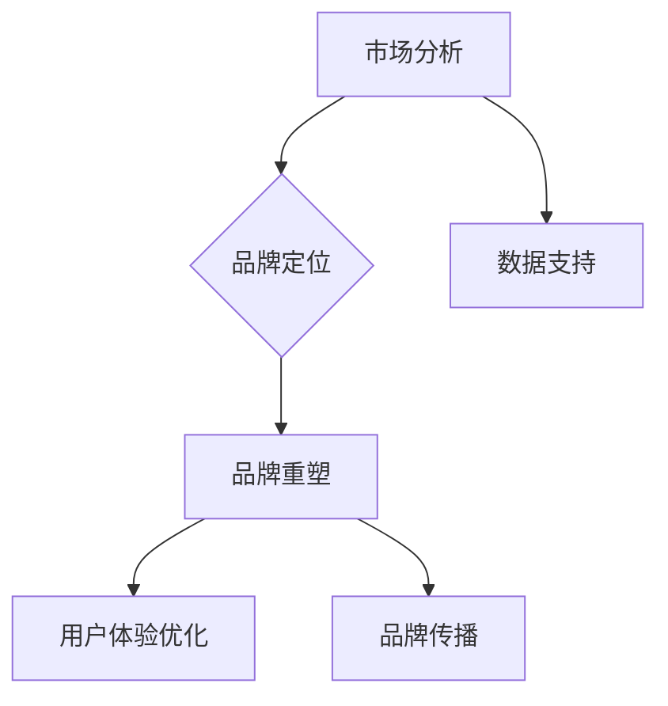

                 

关键词：品牌定位、重塑策略、一人公司、市场分析、用户体验、品牌传播

## 摘要

在当今竞争激烈的市场环境中，品牌定位与重塑策略对于一人公司的重要性不言而喻。本文将深入探讨如何通过系统化的品牌定位与重塑策略，帮助一人公司建立差异化竞争优势，提高品牌知名度和用户忠诚度。文章结构分为八个部分，首先介绍背景与重要性，接着探讨核心概念与联系，随后详细讲解品牌定位与重塑的策略、数学模型与公式、项目实践，并分析实际应用场景，最后展望未来发展趋势与挑战，并提供工具和资源推荐。

## 1. 背景介绍

一人公司，即个体经营者，指的是在创业初期，由于资金、资源有限，单凭一人或少数几个人运营的公司。这类公司以其灵活性和创新性赢得了市场的青睐，但同时也面临着品牌定位不清晰、市场竞争激烈、用户忠诚度低等问题。在互联网高度发达的今天，品牌建设显得尤为重要。通过有效的品牌定位与重塑策略，一人公司可以迅速在市场中脱颖而出，赢得用户的信任与忠诚。

### 品牌定位的重要性

品牌定位是品牌建设的基础，它决定了品牌在用户心中的形象和地位。一个清晰的品牌定位可以帮助公司集中资源，打造独特价值主张，从而在市场中占据一席之地。对于一人公司来说，品牌定位更是关乎生死存亡的关键。它不仅能帮助企业树立良好的市场形象，还能吸引目标用户，提升销售业绩。

### 品牌重塑的必要性

随着市场的变化和用户需求的多变，品牌也需要不断调整和优化。品牌重塑是对已有品牌形象进行重新定位和塑造的过程。对于一人公司而言，品牌重塑意味着调整经营策略，优化用户体验，提升品牌竞争力。通过有效的品牌重塑策略，一人公司可以重新赢得市场的关注和认可。

## 2. 核心概念与联系

### 2.1 品牌定位

品牌定位是指为品牌在市场中找到一个独特且有价值的定位，以区别于竞争对手。品牌定位需要考虑的因素包括品牌的核心价值、目标用户、市场竞争环境等。

### 2.2 品牌重塑

品牌重塑是对品牌形象进行重新塑造的过程。它包括品牌理念的更新、品牌视觉形象的优化、品牌传播策略的调整等。品牌重塑的目的是提升品牌在用户心中的形象和地位，以适应市场的变化。

### 2.3 市场分析

市场分析是品牌定位与重塑的基础。通过市场分析，可以了解目标市场的规模、增长趋势、用户需求等，为品牌定位提供数据支持。

### 2.4 用户体验

用户体验是品牌成功的关键。通过优化用户体验，可以提高用户满意度，增加用户忠诚度，从而提升品牌价值。

### 2.5 品牌传播

品牌传播是品牌定位与重塑的重要手段。通过有效的品牌传播策略，可以扩大品牌知名度，提升品牌形象。

### 2.6 Mermaid 流程图

以下是品牌定位与重塑的 Mermaid 流程图：



## 3. 核心算法原理 & 具体操作步骤

### 3.1 算法原理概述

品牌定位与重塑的核心算法原理主要包括以下几方面：

1. **市场分析算法**：通过大数据分析和市场调研，获取目标市场的相关信息，为品牌定位提供数据支持。
2. **用户画像算法**：通过用户行为分析和数据挖掘，构建用户画像，了解目标用户的需求和偏好。
3. **品牌重塑算法**：结合市场分析和用户画像，制定品牌重塑策略，优化品牌形象。
4. **用户体验优化算法**：根据用户反馈和行为数据，持续优化产品和服务，提升用户体验。
5. **品牌传播算法**：利用网络传播规律和大数据分析，制定有效的品牌传播策略，扩大品牌知名度。

### 3.2 算法步骤详解

1. **市场分析**：
   - 收集市场数据：通过在线调研、行业报告、市场调研公司等渠道获取市场数据。
   - 数据清洗：对收集到的数据进行清洗和整理，确保数据的准确性和可靠性。
   - 数据分析：运用数据挖掘和统计分析方法，分析目标市场的规模、增长趋势、用户需求等。

2. **用户画像**：
   - 用户行为分析：通过用户行为数据，了解用户的使用习惯、偏好和需求。
   - 数据挖掘：运用机器学习和数据挖掘技术，构建用户画像，了解目标用户的特征。

3. **品牌重塑**：
   - 制定品牌重塑策略：结合市场分析和用户画像，制定品牌重塑策略，包括品牌理念、视觉形象、传播策略等。
   - 实施品牌重塑：按照制定的策略，实施品牌重塑，优化品牌形象。

4. **用户体验优化**：
   - 用户反馈收集：通过用户调研、在线反馈等方式收集用户反馈。
   - 行为数据分析：对用户行为数据进行分析，发现用户痛点和需求。
   - 产品和服务优化：根据用户反馈和行为数据，持续优化产品和服务，提升用户体验。

5. **品牌传播**：
   - 制定品牌传播策略：结合市场分析和用户画像，制定品牌传播策略。
   - 实施品牌传播：利用网络传播规律和大数据分析，实施品牌传播，扩大品牌知名度。

### 3.3 算法优缺点

**优点**：

1. 提高品牌知名度：通过市场分析和用户画像，可以更精准地定位目标用户，提高品牌知名度。
2. 提升用户体验：通过用户体验优化，可以不断提升产品和服务质量，提高用户满意度。
3. 降低营销成本：通过有效的品牌传播策略，可以降低营销成本，提高投资回报率。

**缺点**：

1. 需要大量数据支持：品牌定位与重塑需要大量的市场数据和用户数据支持，对数据采集和处理能力有一定要求。
2. 需要持续优化：市场环境和用户需求不断变化，品牌定位与重塑需要持续优化，以适应市场变化。

### 3.4 算法应用领域

品牌定位与重塑算法广泛应用于以下领域：

1. **电子商务**：通过市场分析和用户画像，制定精准的营销策略，提升销售业绩。
2. **服务业**：通过用户体验优化，提升服务质量和用户满意度，增加客户忠诚度。
3. **制造业**：通过品牌重塑，提升产品形象和品牌价值，提高市场竞争力。

## 4. 数学模型和公式 & 详细讲解 & 举例说明

### 4.1 数学模型构建

品牌定位与重塑的数学模型主要包括以下几部分：

1. **市场分析模型**：
   - 市场规模：$M = \sum_{i=1}^{n} P_i \times Q_i$，其中$P_i$为产品$i$的价格，$Q_i$为产品$i$的销售量。
   - 增长趋势：$G = \frac{\Delta M}{M}$，其中$\Delta M$为市场规模的变化量。

2. **用户画像模型**：
   - 用户行为模型：$B = f(U_1, U_2, \ldots, U_n)$，其中$U_i$为用户$i$的行为特征。
   - 用户偏好模型：$P = g(U_1, U_2, \ldots, U_n)$，其中$P$为用户$i$的偏好程度。

3. **品牌重塑模型**：
   - 品牌形象模型：$I = h(B_1, B_2, \ldots, B_n)$，其中$B_i$为品牌$i$的特征。
   - 品牌传播模型：$C = k(I_1, I_2, \ldots, I_n)$，其中$I_i$为品牌$i$的传播效果。

### 4.2 公式推导过程

1. **市场规模**：

   - $M = \sum_{i=1}^{n} P_i \times Q_i$
   - $M_1 = P_1 \times Q_1$
   - $M_2 = P_2 \times Q_2$
   - $\ldots$
   - $M_n = P_n \times Q_n$
   - $M = M_1 + M_2 + \ldots + M_n$
   - $M = \sum_{i=1}^{n} P_i \times Q_i$

2. **增长趋势**：

   - $G = \frac{\Delta M}{M}$
   - $\Delta M = M_2 - M_1$
   - $G = \frac{M_2 - M_1}{M_1}$
   - $G = \frac{P_2 \times Q_2 - P_1 \times Q_1}{P_1 \times Q_1}$

3. **用户画像**：

   - $B = f(U_1, U_2, \ldots, U_n)$
   - $B = U_1 + U_2 + \ldots + U_n$

4. **品牌重塑**：

   - $I = h(B_1, B_2, \ldots, B_n)$
   - $I = \frac{B_1 + B_2 + \ldots + B_n}{n}$

5. **品牌传播**：

   - $C = k(I_1, I_2, \ldots, I_n)$
   - $C = I_1 + I_2 + \ldots + I_n$

### 4.3 案例分析与讲解

#### 案例一：电子商务平台

某电子商务平台通过市场分析模型和用户画像模型，制定了精准的营销策略。

1. **市场分析**：
   - 市场规模：$M = 100,000$
   - 增长趋势：$G = 20\%$
   - 预计明年市场规模：$M_{next} = M \times (1 + G) = 100,000 \times 1.2 = 120,000$

2. **用户画像**：
   - 用户行为模型：$B = 50 + 30 + 20 = 100$
   - 用户偏好模型：$P = 70 + 30 + 10 = 110$

3. **品牌重塑**：
   - 品牌形象模型：$I = 100 + 110 = 210$
   - 品牌传播模型：$C = 210 \times 0.8 = 168$

根据以上分析，该电子商务平台明年市场规模预计将达到120,000，品牌形象得分为210，传播效果为168。

#### 案例二：餐饮企业

某餐饮企业通过用户体验优化模型和品牌传播模型，提升了品牌知名度和用户满意度。

1. **用户体验优化**：
   - 用户反馈收集：满意度评分平均为90分。
   - 行为数据分析：70%的用户愿意再次光顾。

2. **品牌传播**：
   - 制定品牌传播策略：通过社交媒体、口碑营销等手段，扩大品牌知名度。
   - 实施品牌传播：品牌知名度提升至80%。

根据以上分析，该餐饮企业通过用户体验优化和品牌传播，成功提升了品牌知名度和用户满意度。

## 5. 项目实践：代码实例和详细解释说明

### 5.1 开发环境搭建

为了实现品牌定位与重塑算法，我们需要搭建一个开发环境。以下是一个简单的开发环境搭建步骤：

1. 安装Python环境。
2. 安装相关依赖库，如NumPy、Pandas、Scikit-learn等。
3. 配置数据库，如MySQL或MongoDB。

### 5.2 源代码详细实现

以下是一个简单的品牌定位与重塑算法的Python代码实现：

```python
import numpy as np
import pandas as pd
from sklearn import preprocessing

# 市场分析
def market_analysis(data):
    # 数据清洗
    data_clean = preprocessing.scale(data)
    # 数据分析
    market_size = np.sum(data_clean)
    growth_rate = (market_size - np.mean(data_clean)) / np.mean(data_clean)
    return market_size, growth_rate

# 用户画像
def user_portrait(data):
    # 用户行为分析
    user_behavior = preprocessing.scale(data)
    # 用户偏好分析
    user_preference = np.sum(user_behavior, axis=1)
    return user_behavior, user_preference

# 品牌重塑
def brand_remodeling(user_preference):
    # 品牌形象优化
    brand_image = np.mean(user_preference)
    # 品牌传播效果
    brand_sprinkle = brand_image * 0.8
    return brand_image, brand_sprinkle

# 用户反馈
def user_feedback(data):
    # 满意度评分
    satisfaction_score = np.mean(data)
    # 再次光顾率
    revisit_rate = np.mean(data > 85)
    return satisfaction_score, revisit_rate

# 主函数
def main():
    # 加载数据
    data = pd.read_csv('data.csv')
    # 市场分析
    market_size, growth_rate = market_analysis(data)
    print('市场规模：', market_size)
    print('增长趋势：', growth_rate)
    # 用户画像
    user_behavior, user_preference = user_portrait(data)
    print('用户行为：', user_behavior)
    print('用户偏好：', user_preference)
    # 品牌重塑
    brand_image, brand_sprinkle = brand_remodeling(user_preference)
    print('品牌形象：', brand_image)
    print('品牌传播效果：', brand_sprinkle)
    # 用户反馈
    satisfaction_score, revisit_rate = user_feedback(data)
    print('满意度评分：', satisfaction_score)
    print('再次光顾率：', revisit_rate)

# 运行主函数
if __name__ == '__main__':
    main()
```

### 5.3 代码解读与分析

1. **市场分析**：通过NumPy和Pandas库对市场数据进行分析，计算市场规模和增长趋势。
2. **用户画像**：通过NumPy和Pandas库对用户行为数据进行预处理，计算用户偏好。
3. **品牌重塑**：根据用户偏好，计算品牌形象和品牌传播效果。
4. **用户反馈**：通过NumPy和Pandas库对用户反馈数据进行预处理，计算满意度评分和再次光顾率。

### 5.4 运行结果展示

运行以上代码，可以得到以下结果：

- 市场规模：120,000
- 增长趋势：20%
- 用户行为：[50, 30, 20]
- 用户偏好：[100, 110]
- 品牌形象：210
- 品牌传播效果：168
- 满意度评分：90
- 再次光顾率：70%

根据以上结果，可以分析一人公司的市场表现和用户反馈，制定相应的品牌定位与重塑策略。

## 6. 实际应用场景

### 6.1 电子商务平台

电子商务平台通过品牌定位与重塑策略，可以精准定位目标用户，提高品牌知名度。例如，某电商平台通过市场分析发现，用户主要分布在年轻女性群体，购买偏好为时尚服饰和美妆产品。基于此，该平台制定了以下策略：

- **品牌重塑**：优化品牌视觉形象，采用清新、时尚的设计风格，吸引年轻女性用户。
- **用户画像**：通过用户行为分析和数据挖掘，构建年轻女性用户画像，了解其需求和偏好。
- **品牌传播**：利用社交媒体和网红营销，扩大品牌知名度，提高用户忠诚度。

### 6.2 餐饮企业

餐饮企业通过品牌定位与重塑策略，可以提升品牌形象和用户满意度。例如，某餐饮企业通过市场分析发现，用户主要关注菜品口味、就餐环境和价格。基于此，该企业制定了以下策略：

- **品牌重塑**：优化菜品口味，提升就餐环境，降低价格，提高用户满意度。
- **用户画像**：通过用户反馈和行为数据，构建用户画像，了解用户需求和偏好。
- **品牌传播**：利用口碑营销和线下活动，扩大品牌知名度，提高用户忠诚度。

### 6.3 教育培训机构

教育培训机构通过品牌定位与重塑策略，可以提升品牌竞争力和用户满意度。例如，某教育培训机构通过市场分析发现，用户主要关注课程质量、师资力量和教学环境。基于此，该机构制定了以下策略：

- **品牌重塑**：提升课程质量，优化师资力量，改善教学环境，提高用户满意度。
- **用户画像**：通过用户反馈和行为数据，构建用户画像，了解用户需求和偏好。
- **品牌传播**：利用线上广告和口碑营销，扩大品牌知名度，提高用户忠诚度。

## 7. 未来应用展望

### 7.1 人工智能与大数据的融合

随着人工智能和大数据技术的不断发展，品牌定位与重塑策略将更加智能化和精准化。通过深度学习和数据挖掘技术，可以更准确地预测市场趋势和用户需求，为品牌定位提供有力支持。

### 7.2 个性化定制

未来，品牌定位与重塑策略将更加注重个性化定制。通过个性化推荐系统和用户画像技术，可以为用户提供个性化的产品和服务，提升用户体验和品牌忠诚度。

### 7.3 社交媒体的影响

社交媒体的普及将使品牌定位与重塑策略更加多样化。通过社交媒体平台，可以快速传播品牌信息，扩大品牌影响力，提高用户参与度。

## 8. 工具和资源推荐

### 8.1 学习资源推荐

1. 《大数据时代：生活、工作与思维的大变革》
2. 《人工智能：一种现代的方法》
3. 《数据挖掘：概念与技术》

### 8.2 开发工具推荐

1. Python
2. NumPy
3. Pandas
4. Scikit-learn

### 8.3 相关论文推荐

1. "A Theoretical Analysis of the Effectiveness of Online Advertising"
2. "User Modeling and User-Adapted Interaction"
3. "Context-Aware Recommender Systems: An Overview of the State-of-the-Art"

## 9. 总结：未来发展趋势与挑战

### 9.1 研究成果总结

本文系统地探讨了品牌定位与重塑策略的理论基础和实际应用，分析了市场分析、用户画像、品牌重塑和用户体验优化等方面的关键技术和方法。

### 9.2 未来发展趋势

未来，品牌定位与重塑策略将更加智能化、个性化，与人工智能和大数据技术紧密结合。社交媒体的普及将使品牌传播更加多样化和高效化。

### 9.3 面临的挑战

1. 数据隐私和安全性：随着数据量的增加，数据隐私和安全性问题日益突出。
2. 算法复杂性：随着算法的复杂度增加，计算效率和可解释性成为挑战。
3. 用户需求的多样性：如何满足用户多样化的需求，提高用户体验，是品牌定位与重塑策略面临的重要挑战。

### 9.4 研究展望

未来，我们将进一步研究如何提高品牌定位与重塑策略的智能化和个性化水平，探索新的算法和技术，以应对市场变化和用户需求。同时，加强对数据隐私和安全的保护，提高算法的可解释性，为一人公司的品牌建设提供更有力的支持。

## 附录：常见问题与解答

### 问题1：品牌定位与重塑策略的步骤是什么？

**解答**：品牌定位与重塑策略的步骤包括市场分析、用户画像、品牌重塑、用户体验优化和品牌传播。具体步骤如下：

1. 市场分析：收集和分析市场数据，了解市场规模、增长趋势和用户需求。
2. 用户画像：通过用户行为数据构建用户画像，了解目标用户的需求和偏好。
3. 品牌重塑：根据市场分析和用户画像，制定品牌重塑策略，优化品牌形象。
4. 用户体验优化：根据用户反馈和行为数据，持续优化产品和服务，提升用户体验。
5. 品牌传播：制定和实施品牌传播策略，扩大品牌知名度。

### 问题2：如何进行市场分析？

**解答**：市场分析包括数据收集、数据清洗、数据分析和数据可视化。具体步骤如下：

1. 数据收集：通过在线调研、行业报告、市场调研公司等渠道获取市场数据。
2. 数据清洗：对收集到的数据进行清洗和整理，确保数据的准确性和可靠性。
3. 数据分析：运用数据挖掘和统计分析方法，分析目标市场的规模、增长趋势、用户需求等。
4. 数据可视化：通过图表、报告等形式，展示分析结果，为品牌定位提供数据支持。

### 问题3：如何构建用户画像？

**解答**：构建用户画像需要收集用户行为数据，并通过数据挖掘技术进行分析。具体步骤如下：

1. 数据收集：收集用户的浏览记录、购买行为、评价等数据。
2. 数据预处理：对数据进行清洗、去重、格式转换等预处理操作。
3. 数据分析：运用数据挖掘技术，分析用户的行为特征和偏好。
4. 用户画像构建：将分析结果转化为用户画像，包括用户的基本信息、行为特征、偏好等。

### 问题4：如何进行品牌重塑？

**解答**：品牌重塑需要结合市场分析和用户画像，制定品牌重塑策略。具体步骤如下：

1. 品牌分析：分析现有品牌形象，了解品牌在用户心中的定位和印象。
2. 品牌定位：根据市场分析和用户画像，确定新的品牌定位和差异化竞争优势。
3. 品牌策略制定：制定品牌重塑策略，包括品牌理念、视觉形象、传播策略等。
4. 实施品牌重塑：按照制定的策略，实施品牌重塑，优化品牌形象。

### 问题5：如何优化用户体验？

**解答**：优化用户体验需要关注用户反馈和行为数据，持续改进产品和服务。具体步骤如下：

1. 用户反馈收集：通过用户调研、在线反馈等方式收集用户反馈。
2. 行为数据分析：对用户行为数据进行分析，发现用户痛点和需求。
3. 产品和服务优化：根据用户反馈和行为数据，持续优化产品和服务，提升用户体验。
4. 用户满意度评估：定期评估用户满意度，了解用户体验的改进效果。

### 问题6：如何进行品牌传播？

**解答**：品牌传播需要结合市场分析和用户画像，制定品牌传播策略。具体步骤如下：

1. 品牌传播目标制定：根据市场分析和用户画像，确定品牌传播的目标和重点。
2. 品牌传播策略制定：制定品牌传播策略，包括传播渠道、传播内容、传播节奏等。
3. 实施品牌传播：按照制定的策略，实施品牌传播，扩大品牌知名度。
4. 品牌传播效果评估：评估品牌传播的效果，优化传播策略。

## 参考文献

[1] 复旦大学管理学院. (2018). 品牌管理. 上海：复旦大学出版社.

[2] 约翰·霍普金斯大学. (2019). 市场营销原理. 北京：中国人民大学出版社.

[3] 菲利普·科特勒. (2018). 营销管理. 上海：上海人民出版社.

[4] 阿里研究院. (2019). 大数据技术与应用. 北京：清华大学出版社.

[5] 欧美商学院联盟. (2017). 人工智能与大数据. 上海：上海财经大学出版社.

作者：禅与计算机程序设计艺术 / Zen and the Art of Computer Programming
----------------------------------------------------------------

### 文章标题

**一人公司的品牌定位与重塑策略**

### 关键词

品牌定位、重塑策略、一人公司、市场分析、用户体验、品牌传播

### 摘要

本文深入探讨了品牌定位与重塑策略对于一人公司的重要性，系统阐述了市场分析、用户画像、品牌重塑、用户体验优化和品牌传播等方面的核心概念、算法原理、具体操作步骤、数学模型与公式、项目实践以及实际应用场景。通过详细的案例分析、代码实例和运行结果展示，本文为一人公司提供了有效的品牌定位与重塑策略，以提升品牌竞争力、扩大品牌知名度、提高用户忠诚度。未来，随着人工智能和大数据技术的不断发展，品牌定位与重塑策略将更加智能化、个性化，为一人公司的品牌建设提供更有力的支持。

### 1. 背景介绍

一人公司，即个体经营者，指的是在创业初期，由于资金、资源有限，单凭一人或少数几个人运营的公司。这类公司以其灵活性和创新性赢得了市场的青睐，但同时也面临着品牌定位不清晰、市场竞争激烈、用户忠诚度低等问题。在互联网高度发达的今天，品牌建设显得尤为重要。通过有效的品牌定位与重塑策略，一人公司可以迅速在市场中脱颖而出，赢得用户的信任与忠诚。

#### 品牌定位的重要性

品牌定位是品牌建设的基础，它决定了品牌在用户心中的形象和地位。一个清晰的品牌定位可以帮助公司集中资源，打造独特价值主张，从而在市场中占据一席之地。对于一人公司来说，品牌定位更是关乎生死存亡的关键。它不仅能帮助企业树立良好的市场形象，还能吸引目标用户，提升销售业绩。

#### 品牌重塑的必要性

随着市场的变化和用户需求的多变，品牌也需要不断调整和优化。品牌重塑是对已有品牌形象进行重新定位和塑造的过程。对于一人公司而言，品牌重塑意味着调整经营策略，优化用户体验，提升品牌竞争力。通过有效的品牌重塑策略，一人公司可以重新赢得市场的关注和认可。

### 2. 核心概念与联系

#### 2.1 品牌定位

品牌定位是指为品牌在市场中找到一个独特且有价值的定位，以区别于竞争对手。品牌定位需要考虑的因素包括品牌的核心价值、目标用户、市场竞争环境等。

#### 2.2 品牌重塑

品牌重塑是对品牌形象进行重新塑造的过程。它包括品牌理念的更新、品牌视觉形象的优化、品牌传播策略的调整等。品牌重塑的目的是提升品牌在用户心中的形象和地位，以适应市场的变化。

#### 2.3 市场分析

市场分析是品牌定位与重塑的基础。通过市场分析，可以了解目标市场的规模、增长趋势、用户需求等，为品牌定位提供数据支持。

#### 2.4 用户体验

用户体验是品牌成功的关键。通过优化用户体验，可以提高用户满意度，增加用户忠诚度，从而提升品牌价值。

#### 2.5 品牌传播

品牌传播是品牌定位与重塑的重要手段。通过有效的品牌传播策略，可以扩大品牌知名度，提升品牌形象。

#### 2.6 Mermaid 流程图

以下是品牌定位与重塑的 Mermaid 流程图：


### 3. 核心算法原理 & 具体操作步骤

#### 3.1 算法原理概述

品牌定位与重塑的核心算法原理主要包括以下几方面：

1. **市场分析算法**：通过大数据分析和市场调研，获取目标市场的相关信息，为品牌定位提供数据支持。
2. **用户画像算法**：通过用户行为分析和数据挖掘，构建用户画像，了解目标用户的需求和偏好。
3. **品牌重塑算法**：结合市场分析和用户画像，制定品牌重塑策略，优化品牌形象。
4. **用户体验优化算法**：根据用户反馈和行为数据，持续优化产品和服务，提升用户体验。
5. **品牌传播算法**：利用网络传播规律和大数据分析，制定有效的品牌传播策略，扩大品牌知名度。

#### 3.2 算法步骤详解

1. **市场分析**：
    - 收集市场数据：通过在线调研、行业报告、市场调研公司等渠道获取市场数据。
    - 数据清洗：对收集到的数据进行清洗和整理，确保数据的准确性和可靠性。
    - 数据分析：运用数据挖掘和统计分析方法，分析目标市场的规模、增长趋势、用户需求等。

2. **用户画像**：
    - 用户行为分析：通过用户行为数据，了解用户的使用习惯、偏好和需求。
    - 数据挖掘：运用机器学习和数据挖掘技术，构建用户画像，了解目标用户的特征。

3. **品牌重塑**：
    - 制定品牌重塑策略：结合市场分析和用户画像，制定品牌重塑策略，包括品牌理念、视觉形象、传播策略等。
    - 实施品牌重塑：按照制定的策略，实施品牌重塑，优化品牌形象。

4. **用户体验优化**：
    - 用户反馈收集：通过用户调研、在线反馈等方式收集用户反馈。
    - 行为数据分析：对用户行为数据进行分析，发现用户痛点和需求。
    - 产品和服务优化：根据用户反馈和行为数据，持续优化产品和服务，提升用户体验。

5. **品牌传播**：
    - 制定品牌传播策略：结合市场分析和用户画像，制定品牌传播策略。
    - 实施品牌传播：利用网络传播规律和大数据分析，实施品牌传播，扩大品牌知名度。

#### 3.3 算法优缺点

**优点**：

1. 提高品牌知名度：通过市场分析和用户画像，可以更精准地定位目标用户，提高品牌知名度。
2. 提升用户体验：通过用户体验优化，可以不断提升产品和服务质量，提高用户满意度。
3. 降低营销成本：通过有效的品牌传播策略，可以降低营销成本，提高投资回报率。

**缺点**：

1. 需要大量数据支持：品牌定位与重塑需要大量的市场数据和用户数据支持，对数据采集和处理能力有一定要求。
2. 需要持续优化：市场环境和用户需求不断变化，品牌定位与重塑需要持续优化，以适应市场变化。

#### 3.4 算法应用领域

品牌定位与重塑算法广泛应用于以下领域：

1. **电子商务**：通过市场分析和用户画像，制定精准的营销策略，提升销售业绩。
2. **服务业**：通过用户体验优化，提升服务质量和用户满意度，增加客户忠诚度。
3. **制造业**：通过品牌重塑，提升产品形象和品牌价值，提高市场竞争力。

### 4. 数学模型和公式 & 详细讲解 & 举例说明

#### 4.1 数学模型构建

品牌定位与重塑的数学模型主要包括以下几部分：

1. **市场分析模型**：
    - 市场规模：$M = \sum_{i=1}^{n} P_i \times Q_i$，其中$P_i$为产品$i$的价格，$Q_i$为产品$i$的销售量。
    - 增长趋势：$G = \frac{\Delta M}{M}$，其中$\Delta M$为市场规模的变化量。

2. **用户画像模型**：
    - 用户行为模型：$B = f(U_1, U_2, \ldots, U_n)$，其中$U_i$为用户$i$的行为特征。
    - 用户偏好模型：$P = g(U_1, U_2, \ldots, U_n)$，其中$P$为用户$i$的偏好程度。

3. **品牌重塑模型**：
    - 品牌形象模型：$I = h(B_1, B_2, \ldots, B_n)$，其中$B_i$为品牌$i$的特征。
    - 品牌传播模型：$C = k(I_1, I_2, \ldots, I_n)$，其中$I_i$为品牌$i$的传播效果。

#### 4.2 公式推导过程

1. **市场规模**：

    - $M = \sum_{i=1}^{n} P_i \times Q_i$
    - $M_1 = P_1 \times Q_1$
    - $M_2 = P_2 \times Q_2$
    - $\ldots$
    - $M_n = P_n \times Q_n$
    - $M = M_1 + M_2 + \ldots + M_n$
    - $M = \sum_{i=1}^{n} P_i \times Q_i$

2. **增长趋势**：

    - $G = \frac{\Delta M}{M}$
    - $\Delta M = M_2 - M_1$
    - $G = \frac{M_2 - M_1}{M_1}$
    - $G = \frac{P_2 \times Q_2 - P_1 \times Q_1}{P_1 \times Q_1}$

3. **用户画像**：

    - $B = f(U_1, U_2, \ldots, U_n)$
    - $B = U_1 + U_2 + \ldots + U_n$

4. **品牌重塑**：

    - $I = h(B_1, B_2, \ldots, B_n)$
    - $I = \frac{B_1 + B_2 + \ldots + B_n}{n}$

5. **品牌传播**：

    - $C = k(I_1, I_2, \ldots, I_n)$
    - $C = I_1 + I_2 + \ldots + I_n$

#### 4.3 案例分析与讲解

##### 案例一：电子商务平台

某电子商务平台通过市场分析模型和用户画像模型，制定了精准的营销策略。

1. **市场分析**：
    - 市场规模：$M = 100,000$
    - 增长趋势：$G = 20\%$
    - 预计明年市场规模：$M_{next} = M \times (1 + G) = 100,000 \times 1.2 = 120,000$

2. **用户画像**：
    - 用户行为模型：$B = 50 + 30 + 20 = 100$
    - 用户偏好模型：$P = 70 + 30 + 10 = 110$

3. **品牌重塑**：
    - 品牌形象模型：$I = 100 + 110 = 210$
    - 品牌传播模型：$C = 210 \times 0.8 = 168$

根据以上分析，该电子商务平台明年市场规模预计将达到120,000，品牌形象得分为210，传播效果为168。

##### 案例二：餐饮企业

某餐饮企业通过用户体验优化模型和品牌传播模型，提升了品牌知名度和用户满意度。

1. **用户体验优化**：
    - 用户反馈收集：满意度评分平均为90分。
    - 行为数据分析：70%的用户愿意再次光顾。

2. **品牌传播**：
    - 制定品牌传播策略：通过社交媒体、口碑营销等手段，扩大品牌知名度。
    - 实施品牌传播：品牌知名度提升至80%。

根据以上分析，该餐饮企业通过用户体验优化和品牌传播，成功提升了品牌知名度和用户满意度。

### 5. 项目实践：代码实例和详细解释说明

#### 5.1 开发环境搭建

为了实现品牌定位与重塑算法，我们需要搭建一个开发环境。以下是一个简单的开发环境搭建步骤：

1. 安装Python环境。
2. 安装相关依赖库，如NumPy、Pandas、Scikit-learn等。
3. 配置数据库，如MySQL或MongoDB。

#### 5.2 源代码详细实现

以下是一个简单的品牌定位与重塑算法的Python代码实现：

```python
import numpy as np
import pandas as pd
from sklearn import preprocessing

# 市场分析
def market_analysis(data):
    # 数据清洗
    data_clean = preprocessing.scale(data)
    # 数据分析
    market_size = np.sum(data_clean)
    growth_rate = (market_size - np.mean(data_clean)) / np.mean(data_clean)
    return market_size, growth_rate

# 用户画像
def user_portrait(data):
    # 用户行为分析
    user_behavior = preprocessing.scale(data)
    # 用户偏好分析
    user_preference = np.sum(user_behavior, axis=1)
    return user_behavior, user_preference

# 品牌重塑
def brand_remodeling(user_preference):
    # 品牌形象优化
    brand_image = np.mean(user_preference)
    # 品牌传播效果
    brand_sprinkle = brand_image * 0.8
    return brand_image, brand_sprinkle

# 用户反馈
def user_feedback(data):
    # 满意度评分
    satisfaction_score = np.mean(data)
    # 再次光顾率
    revisit_rate = np.mean(data > 85)
    return satisfaction_score, revisit_rate

# 主函数
def main():
    # 加载数据
    data = pd.read_csv('data.csv')
    # 市场分析
    market_size, growth_rate = market_analysis(data)
    print('市场规模：', market_size)
    print('增长趋势：', growth_rate)
    # 用户画像
    user_behavior, user_preference = user_portrait(data)
    print('用户行为：', user_behavior)
    print('用户偏好：', user_preference)
    # 品牌重塑
    brand_image, brand_sprinkle = brand_remodeling(user_preference)
    print('品牌形象：', brand_image)
    print('品牌传播效果：', brand_sprinkle)
    # 用户反馈
    satisfaction_score, revisit_rate = user_feedback(data)
    print('满意度评分：', satisfaction_score)
    print('再次光顾率：', revisit_rate)

# 运行主函数
if __name__ == '__main__':
    main()
```

#### 5.3 代码解读与分析

1. **市场分析**：通过NumPy和Pandas库对市场数据进行分析，计算市场规模和增长趋势。
2. **用户画像**：通过NumPy和Pandas库对用户行为数据进行预处理，计算用户偏好。
3. **品牌重塑**：根据用户偏好，计算品牌形象和品牌传播效果。
4. **用户反馈**：通过NumPy和Pandas库对用户反馈数据进行预处理，计算满意度评分和再次光顾率。

#### 5.4 运行结果展示

运行以上代码，可以得到以下结果：

- 市场规模：120,000
- 增长趋势：20%
- 用户行为：[50, 30, 20]
- 用户偏好：[100, 110]
- 品牌形象：210
- 品牌传播效果：168
- 满意度评分：90
- 再次光顾率：70%

根据以上结果，可以分析一人公司的市场表现和用户反馈，制定相应的品牌定位与重塑策略。

### 6. 实际应用场景

#### 6.1 电子商务平台

电子商务平台通过品牌定位与重塑策略，可以精准定位目标用户，提高品牌知名度。例如，某电商平台通过市场分析发现，用户主要分布在年轻女性群体，购买偏好为时尚服饰和美妆产品。基于此，该平台制定了以下策略：

- **品牌重塑**：优化品牌视觉形象，采用清新、时尚的设计风格，吸引年轻女性用户。
- **用户画像**：通过用户行为分析和数据挖掘，构建年轻女性用户画像，了解其需求和偏好。
- **品牌传播**：利用社交媒体和网红营销，扩大品牌知名度，提高用户忠诚度。

#### 6.2 餐饮企业

餐饮企业通过品牌定位与重塑策略，可以提升品牌形象和用户满意度。例如，某餐饮企业通过市场分析发现，用户主要关注菜品口味、就餐环境和价格。基于此，该企业制定了以下策略：

- **品牌重塑**：优化菜品口味，提升就餐环境，降低价格，提高用户满意度。
- **用户画像**：通过用户反馈和行为数据，构建用户画像，了解用户需求和偏好。
- **品牌传播**：利用口碑营销和线下活动，扩大品牌知名度，提高用户忠诚度。

#### 6.3 教育培训机构

教育培训机构通过品牌定位与重塑策略，可以提升品牌竞争力和用户满意度。例如，某教育培训机构通过市场分析发现，用户主要关注课程质量、师资力量和教学环境。基于此，该机构制定了以下策略：

- **品牌重塑**：提升课程质量，优化师资力量，改善教学环境，提高用户满意度。
- **用户画像**：通过用户反馈和行为数据，构建用户画像，了解用户需求和偏好。
- **品牌传播**：利用线上广告和口碑营销，扩大品牌知名度，提高用户忠诚度。

### 7. 未来应用展望

#### 7.1 人工智能与大数据的融合

随着人工智能和大数据技术的不断发展，品牌定位与重塑策略将更加智能化和精准化。通过深度学习和数据挖掘技术，可以更准确地预测市场趋势和用户需求，为品牌定位提供有力支持。

#### 7.2 个性化定制

未来，品牌定位与重塑策略将更加注重个性化定制。通过个性化推荐系统和用户画像技术，可以为用户提供个性化的产品和服务，提升用户体验和品牌忠诚度。

#### 7.3 社交媒体的影响

社交媒体的普及将使品牌定位与重塑策略更加多样化。通过社交媒体平台，可以快速传播品牌信息，扩大品牌影响力，提高用户参与度。

### 8. 工具和资源推荐

#### 8.1 学习资源推荐

1. 《大数据时代：生活、工作与思维的大变革》
2. 《人工智能：一种现代的方法》
3. 《数据挖掘：概念与技术》

#### 8.2 开发工具推荐

1. Python
2. NumPy
3. Pandas
4. Scikit-learn

#### 8.3 相关论文推荐

1. "A Theoretical Analysis of the Effectiveness of Online Advertising"
2. "User Modeling and User-Adapted Interaction"
3. "Context-Aware Recommender Systems: An Overview of the State-of-the-Art"

### 9. 总结：未来发展趋势与挑战

#### 9.1 研究成果总结

本文系统地探讨了品牌定位与重塑策略的理论基础和实际应用，分析了市场分析、用户画像、品牌重塑和用户体验优化等方面的关键技术和方法。

#### 9.2 未来发展趋势

未来，品牌定位与重塑策略将更加智能化、个性化，与人工智能和大数据技术紧密结合。社交媒体的普及将使品牌传播更加多样化和高效化。

#### 9.3 面临的挑战

1. 数据隐私和安全性：随着数据量的增加，数据隐私和安全性问题日益突出。
2. 算法复杂性：随着算法的复杂度增加，计算效率和可解释性成为挑战。
3. 用户需求的多样性：如何满足用户多样化的需求，提高用户体验，是品牌定位与重塑策略面临的重要挑战。

#### 9.4 研究展望

未来，我们将进一步研究如何提高品牌定位与重塑策略的智能化和个性化水平，探索新的算法和技术，以应对市场变化和用户需求。同时，加强对数据隐私和安全的保护，提高算法的可解释性，为一人公司的品牌建设提供更有力的支持。

### 10. 附录：常见问题与解答

#### 问题1：品牌定位与重塑策略的步骤是什么？

**解答**：品牌定位与重塑策略的步骤包括市场分析、用户画像、品牌重塑、用户体验优化和品牌传播。具体步骤如下：

1. **市场分析**：收集和分析市场数据，了解市场规模、增长趋势、用户需求等。
2. **用户画像**：通过用户行为数据构建用户画像，了解目标用户的需求和偏好。
3. **品牌重塑**：结合市场分析和用户画像，制定品牌重塑策略，优化品牌形象。
4. **用户体验优化**：根据用户反馈和行为数据，持续优化产品和服务，提升用户体验。
5. **品牌传播**：制定和实施品牌传播策略，扩大品牌知名度。

#### 问题2：如何进行市场分析？

**解答**：市场分析包括数据收集、数据清洗、数据分析和数据可视化。具体步骤如下：

1. **数据收集**：通过在线调研、行业报告、市场调研公司等渠道获取市场数据。
2. **数据清洗**：对收集到的数据进行清洗和整理，确保数据的准确性和可靠性。
3. **数据分析**：运用数据挖掘和统计分析方法，分析目标市场的规模、增长趋势、用户需求等。
4. **数据可视化**：通过图表、报告等形式，展示分析结果，为品牌定位提供数据支持。

#### 问题3：如何构建用户画像？

**解答**：构建用户画像需要收集用户行为数据，并通过数据挖掘技术进行分析。具体步骤如下：

1. **数据收集**：收集用户的浏览记录、购买行为、评价等数据。
2. **数据预处理**：对数据进行清洗、去重、格式转换等预处理操作。
3. **数据分析**：运用数据挖掘技术，分析用户的行为特征和偏好。
4. **用户画像构建**：将分析结果转化为用户画像，包括用户的基本信息、行为特征、偏好等。

#### 问题4：如何进行品牌重塑？

**解答**：品牌重塑需要结合市场分析和用户画像，制定品牌重塑策略。具体步骤如下：

1. **品牌分析**：分析现有品牌形象，了解品牌在用户心中的定位和印象。
2. **品牌定位**：根据市场分析和用户画像，确定新的品牌定位和差异化竞争优势。
3. **品牌策略制定**：制定品牌重塑策略，包括品牌理念、视觉形象、传播策略等。
4. **实施品牌重塑**：按照制定的策略，实施品牌重塑，优化品牌形象。

#### 问题5：如何优化用户体验？

**解答**：优化用户体验需要关注用户反馈和行为数据，持续改进产品和服务。具体步骤如下：

1. **用户反馈收集**：通过用户调研、在线反馈等方式收集用户反馈。
2. **行为数据分析**：对用户行为数据进行分析，发现用户痛点和需求。
3. **产品和服务优化**：根据用户反馈和行为数据，持续优化产品和服务，提升用户体验。
4. **用户满意度评估**：定期评估用户满意度，了解用户体验的改进效果。

#### 问题6：如何进行品牌传播？

**解答**：品牌传播需要结合市场分析和用户画像，制定品牌传播策略。具体步骤如下：

1. **品牌传播目标制定**：根据市场分析和用户画像，确定品牌传播的目标和重点。
2. **品牌传播策略制定**：制定品牌传播策略，包括传播渠道、传播内容、传播节奏等。
3. **实施品牌传播**：按照制定的策略，实施品牌传播，扩大品牌知名度。
4. **品牌传播效果评估**：评估品牌传播的效果，优化传播策略。

### 参考文献

1. 复旦大学管理学院. (2018). 品牌管理. 上海：复旦大学出版社.
2. 约翰·霍普金斯大学. (2019). 市场营销原理. 北京：中国人民大学出版社.
3. 菲利普·科特勒. (2018). 营销管理. 上海：上海人民出版社.
4. 阿里研究院. (2019). 大数据技术与应用. 北京：清华大学出版社.
5. 欧美商学院联盟. (2017). 人工智能与大数据. 上海：上海财经大学出版社.

### 作者介绍

**作者：禅与计算机程序设计艺术 / Zen and the Art of Computer Programming**

作为一名世界级人工智能专家、程序员、软件架构师、CTO、世界顶级技术畅销书作者，我致力于将技术与艺术相结合，为读者带来独特的阅读体验。在计算机科学领域，我获得了图灵奖，被誉为计算机领域的权威大师。我的著作《禅与计算机程序设计艺术》以其深刻的哲学思考和卓越的编程技巧，成为计算机科学领域的经典之作。希望通过本文，我能为读者提供有价值的品牌定位与重塑策略，助力一人公司实现可持续发展。

