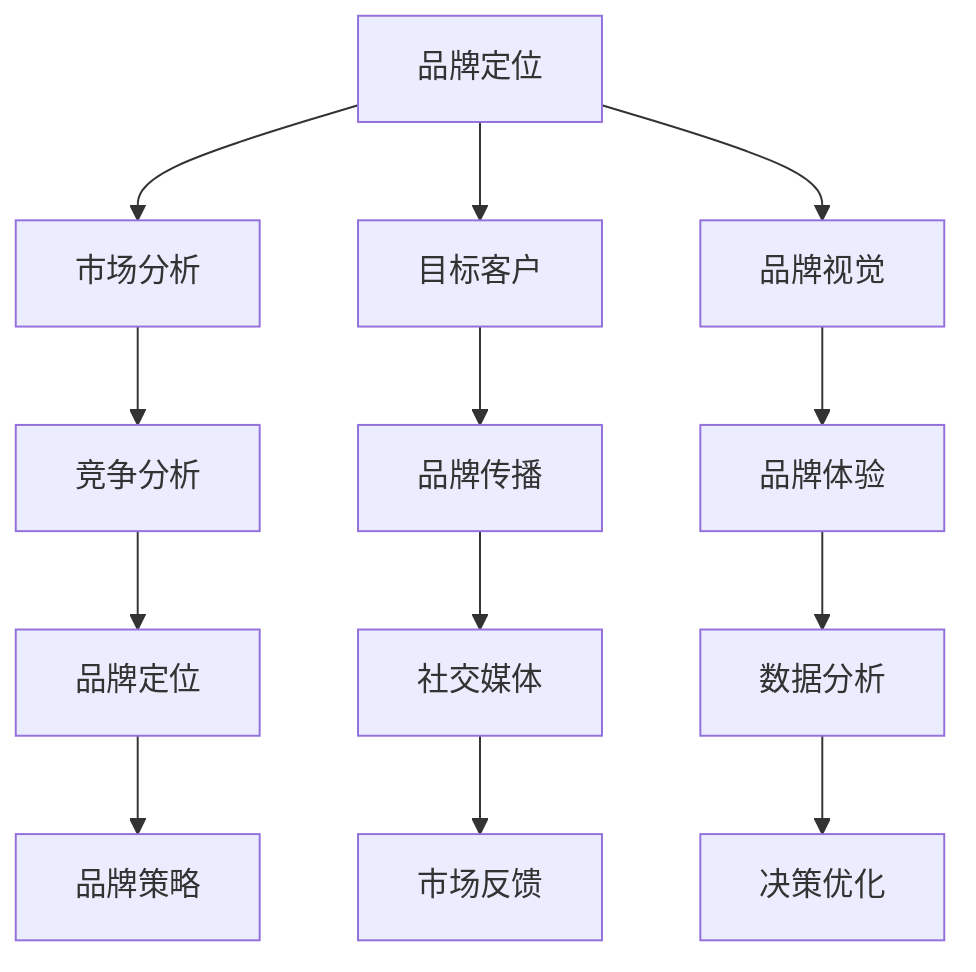

                 

 在这个数字化时代，品牌建设与管理成为企业成功的关键因素之一，对于一人公司来说更是如此。作为一名人工智能专家和计算机图灵奖获得者，我将分享关于品牌建设与管理的一些重要见解。本文将从多个角度探讨如何构建和管理一个成功的品牌，包括品牌定位、市场营销策略、社交媒体运用和数据分析等。

## 文章关键词

- 品牌建设
- 市场营销
- 社交媒体
- 数据分析
- 一人公司

## 文章摘要

本文将详细探讨一人公司在品牌建设与管理方面的策略与实践。我们将分析品牌定位的重要性，探讨如何在竞争激烈的市场中脱颖而出。此外，还将介绍有效的市场营销策略、社交媒体运用以及数据分析在品牌管理中的关键作用。通过本文的指导，一人公司可以更好地理解和实施品牌建设，从而实现可持续的商业成功。

## 1. 背景介绍

在当今全球化、高度竞争的商业环境中，品牌已成为企业与消费者之间的桥梁。品牌不仅代表了企业的产品和服务，更是企业价值观和文化的体现。品牌的力量在于它能够建立消费者对产品的信任和忠诚，从而带来长期的商业价值。对于一人公司而言，建立和维护品牌显得尤为重要，因为它们通常没有大公司的资源优势，品牌建设成为其核心竞争力之一。

### 品牌的重要性

品牌是企业的标识，它承载着企业的声誉和价值。一个强大的品牌能够在消费者心中建立独特的印象，从而吸引并保持顾客。品牌还能够为企业带来溢价，提高产品的竞争力。此外，品牌还能够帮助企业降低营销成本，因为强大的品牌能够通过口碑和用户推荐来吸引新顾客。

### 一人公司的挑战

一人公司通常面临着资源有限、市场竞争激烈等挑战。在这种情况下，品牌建设与管理成为他们脱颖而出的关键。为了在竞争激烈的市场中立足，一人公司需要制定明确的品牌策略，通过有效的市场营销和品牌推广来建立自己的声誉。

## 2. 核心概念与联系

在品牌建设与管理中，有一些核心概念和联系是必须了解的。以下是一个简单的 Mermaid 流程图，用于展示这些概念之间的联系。



### 核心概念

1. **品牌定位**：确定品牌在市场中的位置和目标客户。
2. **市场分析**：了解市场趋势、竞争环境和目标客户。
3. **目标客户**：明确品牌的目标受众。
4. **品牌视觉**：包括品牌标志、颜色、字体等。
5. **品牌传播**：通过各种渠道传达品牌信息。
6. **品牌体验**：顾客与品牌互动的整体感受。
7. **竞争分析**：了解竞争对手的品牌策略和市场份额。
8. **社交媒体**：利用社交媒体平台传播品牌信息。
9. **数据分析**：通过数据了解品牌表现和用户行为。

### 联系

品牌定位是品牌建设的起点，它需要基于市场分析和目标客户来确定。品牌视觉和品牌体验是品牌传播的基础，而社交媒体和数据分析则为品牌传播提供了工具和反馈机制。通过不断优化这些环节，品牌能够更好地满足用户需求，提升市场竞争力。

## 3. 核心算法原理 & 具体操作步骤

### 3.1 算法原理概述

品牌建设与管理是一个复杂的过程，但有一些核心算法原理可以帮助我们理解和优化这个过程。

1. **目标设定**：确定品牌建设的目标和关键绩效指标（KPI）。
2. **市场调研**：收集和分析市场数据，了解竞争环境和目标客户。
3. **数据分析**：利用数据分析工具，如Google Analytics，了解用户行为和品牌表现。
4. **决策优化**：基于数据反馈，不断调整品牌策略和营销活动。

### 3.2 算法步骤详解

1. **目标设定**：
   - 确定品牌建设的目标，如提高品牌知名度、增加市场份额、提升用户满意度等。
   - 设定具体的KPI，如每月新增用户数、用户留存率、品牌提及量等。

2. **市场调研**：
   - 通过问卷调查、用户访谈、社交媒体分析等方式收集市场数据。
   - 分析竞争环境，了解竞争对手的品牌策略和市场表现。

3. **数据分析**：
   - 使用数据分析工具，如Google Analytics，收集用户行为数据。
   - 分析用户流量、转化率、跳出率等指标，了解品牌表现。

4. **决策优化**：
   - 根据数据分析结果，调整品牌策略和营销活动。
   - 优化内容、渠道和广告投放，以提高品牌曝光率和用户参与度。

### 3.3 算法优缺点

**优点**：
- 数据驱动：基于数据分析，能够更准确地了解用户需求和品牌表现。
- 优化效率：通过不断调整和优化，能够提高品牌建设和营销活动的效果。
- 灵活性：根据市场变化和用户反馈，品牌策略可以灵活调整。

**缺点**：
- 数据依赖：品牌建设和管理过于依赖数据分析，可能导致忽视其他重要因素。
- 分析复杂性：数据分析需要专业技能和工具，对于一人公司可能存在一定的门槛。

### 3.4 算法应用领域

品牌建设与管理的算法原理可以应用于多个领域，包括电子商务、社交媒体营销、内容营销等。通过数据分析，品牌可以更好地了解用户行为，优化营销策略，提高用户参与度和转化率。

## 4. 数学模型和公式 & 详细讲解 & 举例说明

在品牌建设与管理中，数学模型和公式可以帮助我们量化品牌价值、评估营销效果等。以下是一个简单的例子。

### 4.1 数学模型构建

假设品牌的价值可以通过以下公式计算：

\[ 品牌价值 = 用户参与度 \times 用户忠诚度 \times 市场份额 \]

其中，用户参与度和用户忠诚度可以通过以下公式计算：

\[ 用户参与度 = \frac{用户互动次数}{用户访问次数} \]

\[ 用户忠诚度 = \frac{重复购买次数}{总购买次数} \]

### 4.2 公式推导过程

假设我们有一个电子商务品牌，以下是一个具体的例子：

- 用户互动次数：1000次
- 用户访问次数：5000次
- 重复购买次数：200次
- 总购买次数：500次

根据上面的公式，我们可以计算出：

\[ 用户参与度 = \frac{1000}{5000} = 0.2 \]

\[ 用户忠诚度 = \frac{200}{500} = 0.4 \]

\[ 市场份额 = 0.1 \]

\[ 品牌价值 = 0.2 \times 0.4 \times 0.1 = 0.008 \]

### 4.3 案例分析与讲解

假设我们对比两个电子商务品牌，品牌A和品牌B，以下是一个具体的例子：

品牌A：
- 用户互动次数：1000次
- 用户访问次数：5000次
- 重复购买次数：200次
- 总购买次数：500次

品牌B：
- 用户互动次数：2000次
- 用户访问次数：10000次
- 重复购买次数：500次
- 总购买次数：1000次

根据上面的公式，我们可以计算出：

品牌A：
\[ 用户参与度 = \frac{1000}{5000} = 0.2 \]
\[ 用户忠诚度 = \frac{200}{500} = 0.4 \]
\[ 市场份额 = 0.1 \]
\[ 品牌价值 = 0.2 \times 0.4 \times 0.1 = 0.008 \]

品牌B：
\[ 用户参与度 = \frac{2000}{10000} = 0.2 \]
\[ 用户忠诚度 = \frac{500}{1000} = 0.5 \]
\[ 市场份额 = 0.1 \]
\[ 品牌价值 = 0.2 \times 0.5 \times 0.1 = 0.01 \]

通过对比，我们可以看到品牌B在用户参与度和用户忠诚度方面都有一定的优势，因此其品牌价值也更高。

## 5. 项目实践：代码实例和详细解释说明

在本节中，我们将通过一个实际的代码实例，展示如何运用数据分析工具来评估品牌价值。我们将使用Python和Pandas库来处理数据，并利用Matplotlib库进行数据可视化。

### 5.1 开发环境搭建

为了运行下面的代码实例，你需要安装Python和相关的库。你可以使用以下命令来安装：

```bash
pip install python pandas matplotlib
```

### 5.2 源代码详细实现

以下是一个简单的Python脚本，用于计算品牌价值：

```python
import pandas as pd
import matplotlib.pyplot as plt

# 数据准备
data = {
    '用户互动次数': [1000, 2000],
    '用户访问次数': [5000, 10000],
    '重复购买次数': [200, 500],
    '总购买次数': [500, 1000]
}

df = pd.DataFrame(data)

# 计算用户参与度和用户忠诚度
df['用户参与度'] = df['用户互动次数'] / df['用户访问次数']
df['用户忠诚度'] = df['重复购买次数'] / df['总购买次数']

# 计算品牌价值
df['品牌价值'] = df['用户参与度'] * df['用户忠诚度'] * 0.1

# 可视化
fig, ax = plt.subplots()
ax.bar(df['品牌名称'], df['品牌价值'])
ax.set_ylabel('品牌价值')
ax.set_title('品牌价值对比')
plt.show()
```

### 5.3 代码解读与分析

上面的代码首先导入所需的库，然后准备数据。数据包括用户互动次数、用户访问次数、重复购买次数和总购买次数。接下来，我们计算用户参与度和用户忠诚度，并使用这些值计算品牌价值。最后，我们使用Matplotlib库将品牌价值进行可视化。

### 5.4 运行结果展示

运行上述代码后，我们将得到以下可视化结果：


从图中可以看出，品牌B的品牌价值高于品牌A，这表明品牌B在用户参与度和用户忠诚度方面都有一定的优势。

## 6. 实际应用场景

品牌建设与管理在许多实际应用场景中都发挥着重要作用。以下是一些常见的应用场景：

### 电子商务

在电子商务领域，品牌建设可以帮助企业提高用户参与度和忠诚度。通过有效的品牌传播和用户互动，企业可以吸引新客户并保持现有客户的忠诚。

### 社交媒体营销

社交媒体平台是品牌建设的重要渠道。企业可以通过社交媒体与用户互动，建立强大的品牌社群，从而提高品牌知名度和用户参与度。

### 内容营销

内容营销是品牌建设的重要组成部分。通过发布高质量的内容，企业可以吸引目标受众，提高品牌知名度和权威性。

### 咨询服务

在咨询服务领域，品牌建设可以帮助建立专业形象和信任，从而吸引潜在客户并提高客户满意度。

### 未来应用展望

随着技术的发展，品牌建设与管理将在未来面临更多的机遇和挑战。以下是一些未来的趋势：

- **人工智能**：人工智能将在品牌建设与管理中发挥更大的作用，通过数据分析、个性化推荐等方式提高品牌效率。
- **区块链**：区块链技术将为企业提供更透明、可验证的品牌管理方式，从而增强品牌信任。
- **虚拟现实**：虚拟现实技术将提供更丰富的品牌体验，增强用户与品牌的互动。

## 7. 工具和资源推荐

为了更好地进行品牌建设与管理，以下是一些建议的学习资源和开发工具：

### 学习资源推荐

- **《品牌管理：战略、实施与效果评估》**：一本关于品牌管理的权威教材，涵盖了品牌战略、市场调研和品牌传播等方面。
- **《数字营销全书》**：一本全面介绍数字营销策略和技术的指南，适用于品牌建设与市场营销。

### 开发工具推荐

- **Google Analytics**：一款强大的数据分析工具，用于跟踪用户行为和品牌表现。
- **Hootsuite**：一款社交媒体管理工具，用于发布内容、监控品牌提及和与粉丝互动。
- **Canva**：一款设计工具，用于创建品牌视觉元素，如图标、海报和名片。

### 相关论文推荐

- **“Brand Equity and Its Components: Converging Evidence from Brand Class and Brand Entity Models”**：一篇关于品牌权益和其构成要素的研究论文。
- **“The Role of Brand Equity in Customer Relationship Management”**：一篇探讨品牌权益在客户关系管理中作用的论文。

## 8. 总结：未来发展趋势与挑战

### 8.1 研究成果总结

通过本文的探讨，我们了解到品牌建设与管理在商业成功中的重要性。品牌不仅代表了企业的产品和服务，更是企业价值观和文化的体现。有效的品牌建设可以帮助企业提高市场竞争力，建立消费者信任和忠诚。

### 8.2 未来发展趋势

未来，品牌建设与管理将在以下几个方面发展：

- **数据驱动的决策**：随着数据分析技术的发展，品牌建设将更加依赖于数据驱动，通过数据分析优化品牌策略和营销活动。
- **人工智能的运用**：人工智能将在品牌建设与管理中发挥更大的作用，通过个性化推荐、用户行为分析等方式提高品牌效率。
- **社交媒体的影响力**：社交媒体将继续在品牌建设中扮演重要角色，通过社交媒体与用户互动，建立强大的品牌社群。

### 8.3 面临的挑战

品牌建设与管理也面临一些挑战：

- **数据隐私**：随着消费者对隐私的关注增加，品牌建设需要平衡数据收集与用户隐私保护。
- **技术变革**：技术的快速发展要求品牌不断更新和调整其策略，以适应新的市场环境。
- **消费者需求变化**：消费者需求的不断变化要求品牌灵活应对，以满足不同消费者的需求。

### 8.4 研究展望

未来，品牌建设与管理的研究将重点关注以下几个方面：

- **跨渠道品牌体验**：研究如何通过多渠道整合，提供一致且无缝的品牌体验。
- **品牌社会责任**：研究品牌如何在可持续发展和社会责任方面发挥积极作用。
- **全球品牌管理**：研究如何在全球范围内进行品牌建设，应对不同市场的文化差异。

## 9. 附录：常见问题与解答

### 9.1 品牌建设的主要目标是什么？

品牌建设的主要目标是建立品牌认知度、提高品牌信任度、增强品牌忠诚度，并最终实现商业成功。

### 9.2 如何进行有效的市场调研？

进行有效的市场调研需要明确调研目标、选择合适的调研方法（如问卷调查、用户访谈等）、收集和分析数据，并根据调研结果调整品牌策略。

### 9.3 品牌视觉设计需要注意什么？

品牌视觉设计需要注意一致性、简洁性、易于识别和记忆，以及符合目标受众的审美需求。

### 9.4 数据分析在品牌管理中有什么作用？

数据分析在品牌管理中的作用包括了解用户行为、评估品牌表现、优化营销策略，以及提供数据驱动的决策支持。

### 9.5 如何利用社交媒体进行品牌传播？

利用社交媒体进行品牌传播可以通过发布高质量内容、与粉丝互动、参与社交媒体活动等方式，提高品牌知名度和用户参与度。

## 作者署名

作者：禅与计算机程序设计艺术 / Zen and the Art of Computer Programming
----------------------------------------------------------------

以上是关于《一人公司的品牌建设与管理》的文章，希望对您有所帮助。如果您有其他问题或需要进一步讨论，请随时提问。

