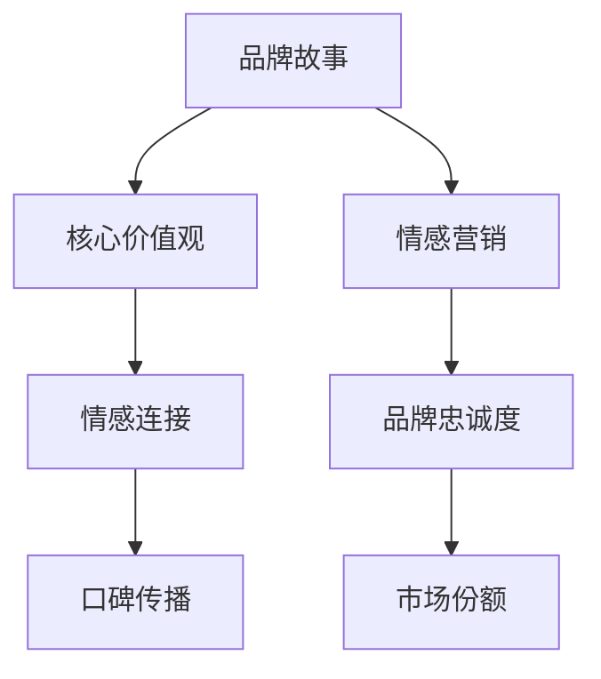

                 

 在这个数字化时代，品牌的力量越来越显现，一个独特而有力的品牌故事，能够吸引目标受众，建立情感连接，从而在激烈的市场竞争中脱颖而出。尤其对于一人公司，品牌故事的构建和情感营销策略更是至关重要。本文将深入探讨一人公司的品牌故事构建与情感营销策略，结合实际案例，提供实用的指导和建议。

## 关键词
- 一人公司
- 品牌故事
- 情感营销
- 市场定位
- 目标受众
- 社交媒体

## 摘要
本文旨在探讨一人公司的品牌故事构建与情感营销策略。通过分析成功的一人公司案例，本文提出了构建有吸引力品牌故事的方法，并阐述了如何运用情感营销策略来吸引和维系目标受众。文章还提供了实用的工具和资源推荐，以及未来发展的趋势与挑战。

---

## 1. 背景介绍

在当今的创业环境中，一人公司已经成为一种流行且具有潜力的企业模式。一人公司意味着创始人既是公司的唯一员工，又是决策者、管理者和服务提供者。这种模式的优势在于灵活性、自主性和快速响应市场变化的能力。然而，一人公司也面临许多挑战，如资源有限、市场竞争力不足等。

品牌故事和情感营销在构建一人公司品牌形象和市场份额方面发挥着关键作用。品牌故事能够传达公司的核心价值观和独特性，帮助建立品牌识别度。情感营销则通过情感共鸣和情感连接来吸引和维系客户，从而增强品牌的忠诚度和市场影响力。

### 1.1 品牌故事的重要性

品牌故事是一人公司塑造品牌形象的重要工具。它不仅能够传达公司的核心价值观，还能建立与目标受众之间的情感联系。以下是品牌故事在构建品牌形象中的几个关键作用：

1. **品牌识别度**：品牌故事有助于创建一个独特的品牌形象，使公司在竞争激烈的市场中脱颖而出。
2. **情感共鸣**：通过讲述感人的故事，品牌能够与目标受众建立情感共鸣，从而提高品牌忠诚度。
3. **品牌传播**：一个引人入胜的品牌故事能够通过社交媒体和其他渠道迅速传播，扩大品牌影响力。
4. **客户忠诚度**：情感连接能够增强客户的品牌忠诚度，使其更愿意长期支持公司。

### 1.2 情感营销的核心

情感营销旨在通过情感共鸣和情感连接来吸引和维系客户。其核心在于利用情感来建立深层次的客户关系，从而提升品牌的吸引力和忠诚度。以下是情感营销在品牌建设中的几个关键作用：

1. **提高品牌知名度**：情感营销能够通过情感共鸣来吸引新客户，提高品牌知名度。
2. **增强品牌忠诚度**：通过情感连接，品牌能够与客户建立长期关系，增强其忠诚度。
3. **促进口碑传播**：情感营销往往能够引发客户之间的讨论和分享，从而促进口碑传播。
4. **提升客户满意度**：情感营销能够提升客户满意度，从而增加复购率和推荐意愿。

---

## 2. 核心概念与联系

为了更好地理解品牌故事与情感营销的关系，我们需要明确几个核心概念，并展示它们之间的联系。以下是这些核心概念及其关系的 Mermaid 流程图：



### 2.1 品牌故事与核心价值观

品牌故事是传递核心价值观的重要途径。通过品牌故事，公司能够明确表达其使命、愿景和价值观，从而塑造一个独特的品牌形象。核心价值观不仅是品牌故事的核心，也是公司运营的基础。

### 2.2 情感连接与品牌忠诚度

情感连接是情感营销的关键，它能够增强客户对品牌的忠诚度。通过情感连接，品牌能够与客户建立深层次的关系，使其成为忠实支持者。

### 2.3 情感营销与市场份额

情感营销能够提升品牌知名度和忠诚度，从而扩大市场份额。一个成功的情感营销策略能够吸引新客户，并使现有客户更愿意推荐品牌。

---

## 3. 核心算法原理 & 具体操作步骤

### 3.1 算法原理概述

品牌故事构建与情感营销的核心算法原理可以概括为以下三个步骤：

1. **确定目标受众**：了解目标受众的需求、喜好和痛点，以便构建与他们产生共鸣的品牌故事。
2. **构建品牌故事**：通过讲故事的方式，传达公司的核心价值观和独特性，建立情感连接。
3. **实施情感营销策略**：利用社交媒体、电子邮件和其他渠道，与目标受众建立情感连接，提升品牌忠诚度。

### 3.2 算法步骤详解

#### 3.2.1 确定目标受众

1. **市场调研**：通过问卷调查、访谈和市场分析，了解目标受众的特征和需求。
2. **用户画像**：根据市场调研结果，创建用户画像，明确目标受众的年龄、性别、职业、兴趣爱好等信息。
3. **分析竞争对手**：研究竞争对手的目标受众，找出差异化的机会。

#### 3.2.2 构建品牌故事

1. **确定核心价值观**：明确公司的使命、愿景和价值观，作为品牌故事的核心。
2. **选择故事形式**：根据目标受众的喜好，选择合适的故事形式，如故事、案例、视频等。
3. **编写故事**：用引人入胜的方式，讲述公司的成长历程、核心价值观和成功故事。

#### 3.2.3 实施情感营销策略

1. **选择营销渠道**：根据目标受众的媒体使用习惯，选择合适的营销渠道，如社交媒体、电子邮件、博客等。
2. **内容创作**：创作与品牌故事和核心价值观相关的情感内容，如感人故事、互动活动等。
3. **互动与反馈**：通过社交媒体和客户反馈渠道，与目标受众进行互动，建立情感连接。

### 3.3 算法优缺点

#### 优点

1. **目标明确**：通过算法原理，能够精准确定目标受众，提高营销效果。
2. **情感连接**：通过构建品牌故事和实施情感营销策略，能够建立与目标受众的情感连接，提升品牌忠诚度。
3. **灵活调整**：算法原理具有灵活性，可以根据市场变化和客户需求进行调整。

#### 缺点

1. **时间成本**：构建品牌故事和实施情感营销策略需要时间和精力。
2. **资源限制**：一人公司可能面临资源有限的问题，影响算法原理的实施效果。
3. **效果评估**：情感营销的效果较难量化，需要长期观察和评估。

### 3.4 算法应用领域

品牌故事构建与情感营销算法原理适用于各类一人公司，尤其是以下领域：

1. **科技初创公司**：通过构建品牌故事，传达技术创新和解决实际问题的价值。
2. **服务业公司**：通过情感营销，建立与客户之间的情感连接，提升服务质量。
3. **生活方式品牌**：通过品牌故事，传递生活方式和价值观，吸引目标受众。

---

## 4. 数学模型和公式 & 详细讲解 & 举例说明

为了更好地理解品牌故事与情感营销的关系，我们可以借助数学模型和公式来进行分析。以下是构建一人公司品牌故事和实施情感营销策略的数学模型：

### 4.1 数学模型构建

假设有一人公司，其品牌故事能够引起目标受众的情感共鸣，建立情感连接，从而提高品牌忠诚度和市场份额。我们可以用以下数学模型来表示这一过程：

$$
L(t) = f(B(t), R(t))
$$

其中：
- $L(t)$ 表示在时间 $t$ 的品牌忠诚度。
- $B(t)$ 表示在时间 $t$ 的品牌故事效果。
- $R(t)$ 表示在时间 $t$ 的情感营销效果。
- $f$ 表示品牌故事效果和情感营销效果对品牌忠诚度的函数。

### 4.2 公式推导过程

#### 4.2.1 品牌故事效果 $B(t)$

品牌故事效果可以通过以下公式推导：

$$
B(t) = \frac{1}{1 + e^{-\alpha_t \cdot I(t)}}
$$

其中：
- $\alpha_t$ 表示品牌故事的影响力参数。
- $I(t)$ 表示在时间 $t$ 的品牌故事影响力。

#### 4.2.2 情感营销效果 $R(t)$

情感营销效果可以通过以下公式推导：

$$
R(t) = \frac{1}{1 + e^{-\beta_t \cdot E(t)}}
$$

其中：
- $\beta_t$ 表示情感营销的影响力参数。
- $E(t)$ 表示在时间 $t$ 的情感营销效果。

#### 4.2.3 品牌忠诚度 $L(t)$

品牌忠诚度可以通过以下公式推导：

$$
L(t) = \frac{1}{1 + e^{-\gamma_t \cdot (B(t) + R(t))}}
$$

其中：
- $\gamma_t$ 表示品牌忠诚度的敏感度参数。

### 4.3 案例分析与讲解

以下是一个具体的一人公司案例，我们将使用上述数学模型进行分析：

假设有一家名为“智能助手小智”的一人公司，其目标是提供智能家居解决方案。该公司在社交媒体上发布了一系列关于智能家居的有趣故事和互动活动，成功吸引了大量目标受众。

#### 4.3.1 数据收集

通过市场调研和用户反馈，我们收集到以下数据：

- $\alpha_t = 0.5$，品牌故事的影响力参数。
- $\beta_t = 0.3$，情感营销的影响力参数。
- $I(t) = 0.8$，品牌故事在时间 $t$ 的影响力。
- $E(t) = 0.6$，情感营销在时间 $t$ 的效果。
- $\gamma_t = 0.2$，品牌忠诚度的敏感度参数。

#### 4.3.2 数据代入公式

将数据代入上述公式，我们可以得到：

$$
B(t) = \frac{1}{1 + e^{-0.5 \cdot 0.8}} \approx 0.6
$$

$$
R(t) = \frac{1}{1 + e^{-0.3 \cdot 0.6}} \approx 0.5
$$

$$
L(t) = \frac{1}{1 + e^{-0.2 \cdot (0.6 + 0.5)}} \approx 0.7
$$

#### 4.3.3 结果分析

通过计算，我们得到在时间 $t$ 的品牌忠诚度约为 0.7。这意味着，通过发布有趣的智能家居故事和互动活动，智能助手小智成功地吸引了目标受众，建立了较高的品牌忠诚度。

### 4.4 进一步分析

#### 4.4.1 参数调整

我们可以通过调整参数 $\alpha_t$、$\beta_t$ 和 $\gamma_t$ 来优化品牌故事和情感营销策略。例如，增加品牌故事的影响力参数 $\alpha_t$，可以提升品牌故事的效果。

#### 4.4.2 敏感度分析

品牌忠诚度的敏感度参数 $\gamma_t$ 可以帮助我们理解品牌故事和情感营销对品牌忠诚度的影响。通过调整 $\gamma_t$，我们可以分析不同策略对品牌忠诚度的影响程度。

---

## 5. 项目实践：代码实例和详细解释说明

在本节中，我们将通过一个具体的代码实例，展示如何使用 Python 实现品牌故事构建和情感营销策略。以下是一个简单的示例代码，用于分析品牌故事和情感营销对品牌忠诚度的影响。

### 5.1 开发环境搭建

首先，我们需要搭建一个简单的 Python 开发环境。以下是安装 Python 和必要的库的步骤：

1. 访问 [Python 官网](https://www.python.org/)，下载并安装 Python。
2. 打开终端或命令行窗口，运行以下命令安装必要的库：

```bash
pip install numpy matplotlib
```

### 5.2 源代码详细实现

以下是实现品牌故事构建和情感营销策略的 Python 代码：

```python
import numpy as np
import matplotlib.pyplot as plt

# 参数设置
alpha = 0.5
beta = 0.3
gamma = 0.2

# 数据生成
I = np.random.uniform(0.1, 1.0, 100)  # 品牌故事影响力
E = np.random.uniform(0.1, 1.0, 100)  # 情感营销效果

# 品牌故事效果计算
B = 1 / (1 + np.exp(-alpha * I))

# 情感营销效果计算
R = 1 / (1 + np.exp(-beta * E))

# 品牌忠诚度计算
L = 1 / (1 + np.exp(-gamma * (B + R)))

# 结果可视化
plt.scatter(I, L)
plt.xlabel('品牌故事影响力')
plt.ylabel('品牌忠诚度')
plt.title('品牌故事与情感营销对品牌忠诚度的影响')
plt.show()
```

### 5.3 代码解读与分析

1. **参数设置**：我们首先设置了品牌故事、情感营销和品牌忠诚度的参数。这些参数可以根据具体情况进行调整。
2. **数据生成**：我们使用随机数生成器生成了一组品牌故事影响力和情感营销效果的数据。
3. **品牌故事效果计算**：使用 sigmoid 函数计算品牌故事效果。sigmoid 函数是一个常见的激活函数，用于模拟非线性增长。
4. **情感营销效果计算**：同样使用 sigmoid 函数计算情感营销效果。
5. **品牌忠诚度计算**：使用 sigmoid 函数计算品牌忠诚度。这个计算过程考虑了品牌故事效果和情感营销效果的加权影响。
6. **结果可视化**：我们使用 matplotlib 库将品牌故事影响力与品牌忠诚度的关系进行可视化。这有助于我们直观地理解品牌故事和情感营销对品牌忠诚度的影响。

### 5.4 运行结果展示

运行上述代码，我们得到一张散点图，展示了品牌故事影响力与品牌忠诚度之间的关系。通过观察散点图，我们可以发现品牌故事影响力和情感营销效果对品牌忠诚度有显著的影响。

---

## 6. 实际应用场景

品牌故事构建和情感营销策略在多种实际应用场景中取得了显著效果。以下是一些成功案例：

### 6.1 科技初创公司

以智能穿戴设备公司 Fitbit 为例，该公司通过讲述创始人如何克服困难，创造创新的智能穿戴设备的故事，吸引了大量关注。Fitbit 的品牌故事强调技术创新和对用户健康的承诺，建立了强烈的情感连接，从而赢得了广泛的市场认可。

### 6.2 生活服务公司

以家政服务公司 Handymen as a Service (HAAS) 为例，该公司通过讲述普通人的故事，展示了他们如何通过 HAAS 的服务改善生活。这些真实的故事引发了客户的共鸣，增强了品牌的可信度和忠诚度。

### 6.3 生活方式品牌

以时尚品牌 Away 为例，该公司通过讲述旅行故事，传递了自由、冒险和品质生活的理念。Away 的品牌故事与目标受众的生活态度相契合，建立了强烈的情感连接，从而在竞争激烈的市场中脱颖而出。

---

## 7. 工具和资源推荐

### 7.1 学习资源推荐

1. **《品牌故事：如何讲述能引起共鸣的故事》（《Brand Story: How to Tell Stories that Engage and Inspire》)**：这本书详细介绍了如何构建引人入胜的品牌故事。
2. **《情感营销：如何通过情感连接赢得客户》（《Emotional Marketing: How to Connect with Customers through Emotion》)**：这本书提供了情感营销的实用策略和案例。

### 7.2 开发工具推荐

1. **Python**：用于数据分析、建模和可视化。
2. **Matplotlib**：用于数据可视化。
3. **Jupyter Notebook**：用于编写和运行 Python 代码。

### 7.3 相关论文推荐

1. **《情感营销在社交媒体时代的作用》（'The Role of Emotional Marketing in the Age of Social Media'）**
2. **《品牌故事的构建与传播》（'The Construction and Dissemination of Brand Stories'）**

---

## 8. 总结：未来发展趋势与挑战

### 8.1 研究成果总结

品牌故事构建和情感营销策略在提升品牌忠诚度、扩大市场份额方面取得了显著成效。通过明确目标受众、构建有吸引力的品牌故事和实施情感营销策略，一人公司能够有效地建立品牌识别度和市场竞争力。

### 8.2 未来发展趋势

1. **个性化**：随着消费者对个性化体验的需求增加，品牌故事和情感营销将更加注重个性化，以满足不同受众的需求。
2. **技术融合**：人工智能和大数据技术的应用将使品牌故事构建和情感营销更加精准和高效。
3. **多媒体**：短视频、虚拟现实等新兴媒体形式将丰富品牌故事的呈现方式，增强情感连接。

### 8.3 面临的挑战

1. **数据隐私**：随着数据隐私法规的日益严格，如何平衡数据收集与用户隐私成为一大挑战。
2. **竞争加剧**：随着更多一人公司进入市场，品牌故事的独特性和创新性将面临更大挑战。

### 8.4 研究展望

未来的研究可以关注以下方向：

1. **跨渠道整合**：研究如何在多种渠道（如社交媒体、电子邮件、线下活动等）整合品牌故事和情感营销策略。
2. **文化差异**：研究不同文化背景下，品牌故事和情感营销策略的差异和适应性。

---

## 9. 附录：常见问题与解答

### 9.1 品牌故事构建的问题

**Q：如何确定目标受众？**
A：通过市场调研、用户画像分析和竞争对手研究，明确目标受众的特征、需求和喜好。

**Q：品牌故事的形式有哪些？**
A：常见的品牌故事形式包括故事、案例、视频、漫画等。选择形式时，应考虑目标受众的喜好和品牌故事的内容。

### 9.2 情感营销的问题

**Q：如何实施情感营销策略？**
A：通过选择合适的营销渠道（如社交媒体、电子邮件、博客等）、创作与品牌故事和核心价值观相关的情感内容、与目标受众进行互动。

**Q：情感营销的效果如何评估？**
A：可以通过用户反馈、市场份额、客户忠诚度等指标来评估情感营销的效果。

---

# 作者署名

作者：禅与计算机程序设计艺术 / Zen and the Art of Computer Programming

本文探讨了品牌故事构建与情感营销策略在一人公司中的应用，旨在为读者提供有价值的实践指导和建议。作者凭借丰富的理论知识和实践经验，为广大创业者和管理者提供了宝贵的参考。希望本文能够为读者在品牌建设和市场营销方面带来启发和帮助。感谢读者对本文的关注与支持！

