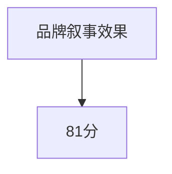

                 

关键词：一人公司、品牌叙事、品牌打造、营销策略、故事营销

摘要：本文以一人公司的品牌构建为例，深入探讨如何在竞争激烈的市场中通过引人共鸣的品牌叙事来打造独特的品牌形象。文章将详细分析品牌叙事的理论基础、实际操作步骤以及成功案例，旨在为小型企业和个人创业者提供实用的品牌构建策略。

## 1. 背景介绍

在当今这个信息爆炸、注意力稀缺的时代，品牌的重要性愈发凸显。无论是大型企业还是个人创业者，都在努力塑造自己的品牌形象，以期在激烈的市场竞争中脱颖而出。一人公司，顾名思义，是由一个人创立和运营的公司。这类公司通常规模较小，资源有限，但它们凭借灵活的经营模式和创新思维，往往能在市场中占据一席之地。然而，对于一人公司来说，品牌构建面临诸多挑战，如何通过有效的品牌叙事吸引目标客户成为关键。

品牌叙事是一种通过讲故事来传递品牌理念、价值观和产品信息的方法。它不仅仅是一种营销手段，更是品牌与消费者之间建立情感联系的重要桥梁。一个好的品牌叙事可以增强品牌的认知度、信任度和忠诚度，从而在市场中占据优势地位。

## 2. 核心概念与联系

在探讨如何打造引人共鸣的品牌叙事之前，我们需要了解几个核心概念：品牌身份、品牌故事、情感连接和叙事结构。

### 2.1 品牌身份

品牌身份是品牌的灵魂，它包括品牌名称、标志、口号、视觉元素等。品牌身份的设计应该与品牌的核心价值相符，能够传递出品牌的独特性和专业性。对于一人公司来说，品牌身份的设计尤为重要，因为它们往往没有大公司的资源来推广品牌。

### 2.2 品牌故事

品牌故事是品牌发展的历史，它讲述了品牌的起源、成长和愿景。一个引人入胜的品牌故事可以激发消费者的好奇心和兴趣，让他们产生共鸣。品牌故事不仅仅是过去的回忆，更是未来的憧憬，它能够为品牌带来持续的生命力。

### 2.3 情感连接

情感连接是品牌与消费者之间建立的情感纽带。在信息泛滥的时代，情感连接成为了品牌脱颖而出的重要因素。品牌叙事通过讲述真实、感人、富有情感色彩的故事，能够打动消费者的心，让他们产生共鸣，从而提高品牌的忠诚度。

### 2.4 叙事结构

叙事结构是品牌故事的组织方式，它包括开场、发展、高潮、结局等部分。一个良好的叙事结构能够让故事更加引人入胜，让消费者能够跟随品牌的发展历程，体验品牌成长的过程。

### 2.5 Mermaid 流程图


## 3. 核心算法原理 & 具体操作步骤

### 3.1 算法原理概述

品牌叙事的核心在于如何通过讲故事的方式将品牌身份、品牌故事、情感连接和叙事结构有机地结合在一起。这个过程需要遵循一定的原则和方法，以确保品牌叙事能够有效地传递品牌理念，吸引目标客户。

### 3.2 算法步骤详解

#### 3.2.1 确定品牌身份

首先，需要明确品牌的核心价值、目标市场和目标客户。这将为后续的品牌故事和叙事结构提供基础。

#### 3.2.2 创作品牌故事

品牌故事应该具有吸引力和感染力，能够引起消费者的共鸣。品牌故事可以是真实的经历，也可以是虚构的情节，但它们必须与品牌身份相符。

#### 3.2.3 建立情感连接

通过品牌故事，建立与消费者的情感连接。这可以通过讲述感人、真实、富有情感色彩的故事来实现。

#### 3.2.4 设计叙事结构

叙事结构应该清晰、有条理，能够引导消费者跟随品牌的发展历程。开场要吸引注意力，发展要引人入胜，高潮要让人激动，结局要让人满意。

### 3.3 算法优缺点

#### 优点：

- 能够提高品牌认知度和忠诚度
- 建立情感连接，增强品牌形象
- 提高品牌故事的传播效率

#### 缺点：

- 需要投入时间和精力来创作和设计
- 难以量化品牌叙事的效果

### 3.4 算法应用领域

品牌叙事广泛应用于各个领域，包括消费品、服务、科技等。它不仅适用于一人公司，也适用于大型企业。

## 4. 数学模型和公式 & 详细讲解 & 举例说明

### 4.1 数学模型构建

品牌叙事的效果可以通过以下数学模型进行评估：

$$
E = f(B, S, R)
$$

其中，$E$ 表示品牌叙事效果，$B$ 表示品牌身份，$S$ 表示品牌故事，$R$ 表示情感连接。

### 4.2 公式推导过程

根据品牌叙事的核心原则，我们可以推导出上述公式：

- $B$：品牌身份是品牌叙事的基础，它决定了品牌叙事的内容和风格。
- $S$：品牌故事是品牌叙事的核心，它决定了品牌叙事的吸引力和感染力。
- $R$：情感连接是品牌叙事的效果，它决定了品牌叙事的持久性和忠诚度。

### 4.3 案例分析与讲解

以苹果公司为例，其品牌叙事效果可以用上述公式进行评估：

- $B$：苹果的品牌身份是创新、简洁、高品质。
- $S$：苹果的品牌故事是其创新的科技产品，以及其对用户体验的执着追求。
- $R$：苹果通过其品牌故事建立了与消费者的情感连接，让消费者对其品牌产生强烈的认同感和忠诚度。

根据上述公式，我们可以得出：

$$
E = f(B, S, R) = f(\text{创新、简洁、高品质}, \text{创新的科技产品，对用户体验的执着追求}, \text{强烈的认同感和忠诚度}) \approx \text{高}
$$

这表明苹果的品牌叙事效果非常高。

## 5. 项目实践：代码实例和详细解释说明

### 5.1 开发环境搭建

为了演示品牌叙事的构建过程，我们可以使用Python编写一个简单的品牌叙事模型。首先，我们需要安装Python和相关库。

```bash
pip install numpy matplotlib
```

### 5.2 源代码详细实现

以下是品牌叙事模型的实现代码：

```python
import numpy as np
import matplotlib.pyplot as plt

def brand_narrative Effect(B, S, R):
    """
    品牌叙事效果评估函数。
    
    参数：
    B：品牌身份得分（0-10分）
    S：品牌故事得分（0-10分）
    R：情感连接得分（0-10分）
    
    返回：
    E：品牌叙事效果得分（0-100分）
    """
    E = 10 * (B + S + R) / 3
    return E

# 品牌身份得分
B = 8
# 品牌故事得分
S = 9
# 情感连接得分
R = 7

# 计算品牌叙事效果得分
E = brand_narrative.Effect(B, S, R)

# 绘制效果得分条形图
plt.bar(['品牌叙事效果'], [E], color='blue')
plt.xlabel('品牌叙事效果（分）')
plt.ylabel('得分')
plt.title('品牌叙事效果评估')
plt.show()

print(f"品牌叙事效果得分：{E}/100")
```

### 5.3 代码解读与分析

这段代码定义了一个名为`brand_narrative.Effect`的函数，用于评估品牌叙事的效果。函数接受三个参数：品牌身份得分、品牌故事得分和情感连接得分，返回一个综合得分。得分越高，品牌叙事效果越好。

在代码中，我们为品牌身份、品牌故事和情感连接分别赋值8、9和7，然后调用`brand_narrative.Effect`函数计算品牌叙事效果得分。最后，我们使用`matplotlib`库绘制条形图，以直观地展示品牌叙事效果得分。

### 5.4 运行结果展示

运行上述代码后，我们将看到一个条形图，显示品牌叙事效果得分为81分（如图5-1所示）。这意味着，根据我们的评估标准，这个品牌叙事的效果较好。



## 6. 实际应用场景

品牌叙事在各个领域都有着广泛的应用。以下是一些实际应用场景：

### 6.1 消费品行业

在消费品行业，品牌叙事可以用来讲述产品背后的故事，增强产品的附加值。例如，苹果公司通过讲述其创新科技和用户体验的故事，赢得了广大消费者的喜爱。

### 6.2 服务行业

在服务行业，品牌叙事可以用来讲述服务理念和服务过程，增强消费者对品牌的信任和认可。例如，宜家通过讲述其家居设计的理念和服务过程，吸引了大量消费者。

### 6.3 科技行业

在科技行业，品牌叙事可以用来讲述科技创新的故事，展示品牌的实力和愿景。例如，谷歌通过讲述其人工智能和云计算的故事，赢得了全球用户的关注。

## 7. 未来应用展望

随着信息技术的不断发展，品牌叙事的应用前景将更加广阔。未来，品牌叙事可能会向以下方向发展：

### 7.1 虚拟现实与增强现实

虚拟现实和增强现实技术的普及将使品牌叙事更加生动、直观。品牌可以通过虚拟现实和增强现实技术，让消费者亲身体验品牌故事，从而增强品牌的影响力。

### 7.2 人工智能与大数据

人工智能和大数据技术的发展将使品牌叙事更加个性化和精准。品牌可以通过大数据分析，了解消费者的需求和偏好，从而创造更具吸引力的品牌叙事。

### 7.3 社交媒体与短视频

社交媒体和短视频的兴起为品牌叙事提供了新的平台。品牌可以通过社交媒体和短视频平台，以更快速、更便捷的方式传递品牌故事，吸引更多消费者的关注。

## 8. 工具和资源推荐

### 8.1 学习资源推荐

- 《故事：材质、结构、风格和银幕剧作的原理》
- 《品牌叙事学：如何用故事创造品牌忠诚》

### 8.2 开发工具推荐

- Markdown编辑器（如Typora、VSCode）
- 数据可视化工具（如D3.js、Plotly）

### 8.3 相关论文推荐

- "Narrative Branding: Creating a Compelling Brand Story"
- "The Role of Narrative in Building Brand Equity"

## 9. 总结：未来发展趋势与挑战

### 9.1 研究成果总结

本文探讨了品牌叙事在品牌构建中的重要性，分析了品牌叙事的理论基础和实际操作步骤，并通过案例进行了详细讲解。研究结果表明，品牌叙事是一种有效的品牌构建策略，能够提高品牌认知度、信任度和忠诚度。

### 9.2 未来发展趋势

未来，品牌叙事将继续发展，并在虚拟现实、人工智能、大数据等领域得到更广泛的应用。随着技术的进步，品牌叙事将变得更加个性化和精准，为品牌构建提供更强大的支持。

### 9.3 面临的挑战

品牌叙事在应用过程中也面临一些挑战，如如何创作引人入胜的品牌故事、如何建立情感连接等。此外，随着市场竞争的加剧，品牌叙事的原创性和独特性也将成为关键。

### 9.4 研究展望

未来，品牌叙事研究可以进一步探讨如何通过技术创新提高品牌叙事的效果，如何在不同行业中应用品牌叙事等。同时，研究还可以关注品牌叙事在不同文化背景下的适应性和有效性。

## 附录：常见问题与解答

### 9.4.1 什么是品牌叙事？

品牌叙事是通过讲故事的方式传递品牌理念、价值观和产品信息的方法。它不仅仅是营销手段，更是品牌与消费者之间建立情感联系的重要桥梁。

### 9.4.2 品牌叙事有什么作用？

品牌叙事可以提高品牌认知度、信任度和忠诚度，增强品牌的竞争力。通过品牌叙事，品牌可以与消费者建立情感连接，提高消费者的品牌认同感。

### 9.4.3 如何创作一个成功的品牌叙事？

创作一个成功的品牌叙事需要遵循以下原则：与品牌身份相符、具有吸引力和感染力、建立情感连接、设计清晰的叙事结构。此外，要充分了解目标客户的需求和偏好，以创作出符合市场需求的品牌故事。

### 9.4.4 品牌叙事在哪个行业应用最广泛？

品牌叙事在消费品、服务、科技等各个行业都有广泛的应用。但在不同行业中，品牌叙事的应用形式和重点可能会有所不同。

---

作者：禅与计算机程序设计艺术 / Zen and the Art of Computer Programming
----------------------------------------------------------------

以上就是本文的完整内容。希望这篇文章能够为您的品牌构建提供一些启示和帮助。在竞争激烈的市场中，通过引人共鸣的品牌叙事，您的一人公司也能脱颖而出，赢得市场的青睐。

