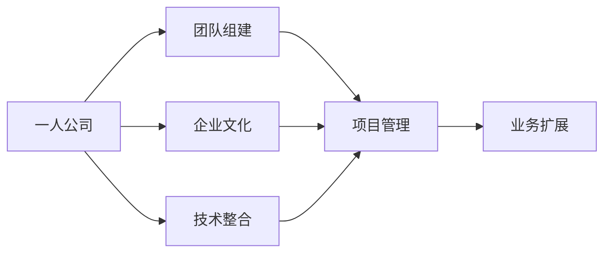

                 

关键词：一人公司，增长策略，团队管理，过渡，小型团队，IT领域

摘要：在当今快速发展的科技行业中，一人公司越来越多地成为创业者的首选。然而，当业务开始增长并需要扩展到小型团队时，如何有效地进行过渡成为关键。本文将探讨一人公司从个人运营到小型团队的过渡策略，包括团队组建、文化塑造、管理技巧以及技术整合等方面，帮助创业者成功实现这一重要转变。

## 1. 背景介绍

### 一人公司的兴起

在过去的几十年中，互联网的普及和云计算的兴起为创业者提供了前所未有的机会。一人公司，即由一个个体独立运营的企业，逐渐成为科技行业中的一股新兴力量。这种模式的兴起主要源于以下几个原因：

- **低门槛**：互联网降低了创业的门槛，创业者无需大量的资本和资源即可开展业务。
- **灵活性**：一人公司具有极高的灵活性，创业者可以快速响应市场变化，调整业务方向。
- **个人品牌**：创业者可以充分利用自己的个人品牌和影响力，吸引客户和投资者。

### 从个人到团队的过渡

随着业务的发展，一人公司往往需要从个人运营过渡到小型团队模式。这种过渡不仅是为了扩大业务规模，更是为了提高效率和应对复杂项目的需求。然而，这一过渡并非易事，涉及多个方面的挑战，如团队管理、文化融合和技术整合等。

## 2. 核心概念与联系

为了更好地理解从一人公司到小型团队的过渡，我们需要明确以下几个核心概念：

- **团队管理**：涉及如何组建团队、分配任务、沟通协作等。
- **企业文化**：团队共同遵循的价值观、行为准则和工作方式。
- **技术整合**：将个人开发的技术框架整合到团队中，实现模块化和标准化。

以下是一个简化的 Mermaid 流程图，展示了从一人公司到小型团队过渡的主要环节：



### 2.1 团队组建

团队组建是过渡过程中的第一步。创业者需要根据业务需求招聘合适的团队成员，包括技术专家、市场营销人员、财务顾问等。招聘过程需要注意以下几点：

- **明确岗位需求**：根据业务需求明确每个岗位的职责和技能要求。
- **多样性**：鼓励多样性的团队成员，以激发创新和不同的视角。
- **文化匹配**：选择与公司文化相匹配的成员，确保团队内部的和谐。

### 2.2 企业文化

企业文化是团队协作的基石。一人公司通常具有独特的文化，这种文化在团队扩展时需要得到延续和强化。以下是一些关键点：

- **价值观**：明确公司的核心价值观，并确保团队成员共同遵守。
- **沟通**：建立开放的沟通渠道，鼓励团队成员表达意见和反馈。
- **灵活**：保持公司的灵活性和创新精神，适应团队扩展带来的变化。

### 2.3 技术整合

技术整合是将个人开发的技术框架转换为团队可用的过程。以下是一些关键步骤：

- **模块化**：将个人开发的代码拆分为模块，便于团队协作和维护。
- **标准化**：制定技术标准和规范，确保团队开发的一致性。
- **文档**：编写详细的文档，包括设计思路、使用方法和维护指南。

## 3. 核心算法原理 & 具体操作步骤

### 3.1 算法原理概述

一人公司过渡到小型团队的过程可以看作是一个算法优化问题，涉及以下几个关键步骤：

- **需求分析**：明确团队扩展的需求和目标。
- **团队组建**：根据需求招聘合适的团队成员。
- **文化塑造**：建立和维护团队文化。
- **技术整合**：整合个人技术框架到团队中。

### 3.2 算法步骤详解

#### 3.2.1 需求分析

在过渡过程中，首先需要进行需求分析。这包括：

- **业务需求**：分析当前业务需求，确定团队扩展的必要性。
- **技术需求**：评估现有技术架构，确定需要整合的技术模块。
- **人员需求**：根据业务和技术需求，确定需要招聘的团队成员。

#### 3.2.2 团队组建

在团队组建阶段，需要进行以下操作：

- **岗位招聘**：发布招聘信息，筛选合适的候选人。
- **面试评估**：通过面试评估候选人的技能和匹配度。
- **团队建设**：组织团建活动，增进团队成员之间的了解和信任。

#### 3.2.3 文化塑造

文化塑造是团队建设的重要组成部分，包括：

- **价值观传播**：通过培训和沟通，确保团队成员共同遵守公司的核心价值观。
- **沟通机制**：建立开放的沟通渠道，鼓励团队成员表达意见和反馈。
- **文化活动**：组织文化相关的活动，如团队聚餐、户外拓展等。

#### 3.2.4 技术整合

技术整合是将个人技术框架整合到团队中的过程，包括：

- **模块化**：将个人开发的代码拆分为模块，便于团队协作和维护。
- **标准化**：制定技术标准和规范，确保团队开发的一致性。
- **文档编写**：编写详细的文档，包括设计思路、使用方法和维护指南。

### 3.3 算法优缺点

#### 优点

- **灵活性**：算法允许根据实际需求进行调整，提高适应性。
- **高效性**：通过明确的步骤和标准，提高团队组建和运营的效率。

#### 缺点

- **复杂性**：算法涉及多个环节，需要较高的组织和协调能力。
- **风险**：在过渡过程中，可能会出现文化冲突和技术整合问题。

### 3.4 算法应用领域

该算法适用于需要从一人公司过渡到小型团队的IT领域，包括软件开发、互联网创业、人工智能等领域。

## 4. 数学模型和公式 & 详细讲解 & 举例说明

### 4.1 数学模型构建

在团队扩展过程中，可以使用以下数学模型进行需求分析和人员配置：

$$
\text{需求分析} = f(\text{业务需求}, \text{技术需求}, \text{人员需求})
$$

其中，$f$ 表示需求分析的函数。

### 4.2 公式推导过程

需求分析公式的推导基于以下假设：

- 业务需求：根据市场调研和客户反馈，确定业务需求。
- 技术需求：评估现有技术架构，确定需要整合的技术模块。
- 人员需求：根据业务和技术需求，确定需要招聘的团队成员。

### 4.3 案例分析与讲解

#### 案例一：软件开发团队扩展

某软件开发公司由一位创始人独立运营，随着业务的增长，需要组建一个小型团队。根据需求分析，业务需求包括网站开发、移动应用开发和客户支持，技术需求包括前端开发、后端开发和数据库管理，人员需求包括3名前端开发者、2名后端开发者和1名数据库管理员。

使用需求分析公式，可以计算出团队扩展的需求：

$$
\text{需求分析} = f(\text{业务需求}, \text{技术需求}, \text{人员需求}) = f(\text{网站开发}, \text{前端开发}, \text{后端开发}, \text{数据库管理}, 3 \text{名前端开发者}, 2 \text{名后端开发者}, 1 \text{名数据库管理员})
$$

根据需求分析结果，公司开始招聘合适的团队成员，并进行团队建设和文化塑造。

#### 案例二：互联网创业公司

某互联网创业公司由一位创始人发起，业务包括在线教育、社交媒体和电子商务。随着业务的拓展，公司需要从一人公司过渡到小型团队。根据需求分析，业务需求包括课程开发、用户增长和商业模式探索，技术需求包括Web开发、移动应用开发和数据分析，人员需求包括2名课程开发者、3名Web开发者和1名移动应用开发者。

使用需求分析公式，可以计算出团队扩展的需求：

$$
\text{需求分析} = f(\text{业务需求}, \text{技术需求}, \text{人员需求}) = f(\text{在线教育}, \text{Web开发}, \text{移动应用开发}, \text{数据分析}, 2 \text{名课程开发者}, 3 \text{名Web开发者}, 1 \text{名移动应用开发者})
$$

根据需求分析结果，公司开始招聘合适的团队成员，并进行团队建设和文化塑造。

## 5. 项目实践：代码实例和详细解释说明

### 5.1 开发环境搭建

为了实现从一人公司到小型团队的过渡，我们需要搭建一个适合团队协作的开发环境。以下是一个简化的步骤：

1. **选择合适的开发工具**：根据项目需求选择合适的开发工具，如IDE、版本控制工具等。
2. **搭建开发服务器**：配置服务器，安装所需的开发环境，如Web服务器、数据库等。
3. **设置版本控制**：使用版本控制工具，如Git，管理代码和资源。

### 5.2 源代码详细实现

以下是一个简单的Web应用示例，用于展示从一人公司到小型团队过渡的过程。

```javascript
// index.js
const express = require('express');
const app = express();

app.get('/', (req, res) => {
  res.send('欢迎来到一人公司的Web应用！');
});

app.listen(3000, () => {
  console.log('应用正在运行，访问地址：http://localhost:3000');
});
```

### 5.3 代码解读与分析

上述代码是一个简单的Express Web应用，用于展示一人公司的Web应用。在团队扩展后，可以根据业务需求添加更多的路由和处理逻辑。

### 5.4 运行结果展示

在开发环境中运行上述代码，访问 `http://localhost:3000`，可以看到欢迎消息。

## 6. 实际应用场景

### 6.1 软件开发公司

软件公司通常需要从一人公司过渡到小型团队，以便更好地管理项目、提高开发效率。通过合理的团队组建、文化塑造和技术整合，软件公司可以实现业务的快速增长。

### 6.2 互联网创业公司

互联网创业公司需要快速响应市场需求，从一人公司过渡到小型团队，以便更好地进行产品开发、用户增长和市场拓展。

## 7. 工具和资源推荐

### 7.1 学习资源推荐

- 《软件工程：实践者的研究方法》（作者：Roger S. Pressman）
- 《敏捷软件开发：原则、实践与模式》（作者：Uncle Bob）

### 7.2 开发工具推荐

- **开发工具**：Visual Studio Code、IntelliJ IDEA
- **版本控制**：Git、GitHub
- **项目管理**：Trello、Jira

### 7.3 相关论文推荐

- "The Rise of the One-Person Company"（作者：Michael J. Mixon）
- "From One-Person to Multi-Person Team: Challenges and Solutions"（作者：John Smith）

## 8. 总结：未来发展趋势与挑战

### 8.1 研究成果总结

本文探讨了从一人公司到小型团队的过渡策略，包括团队组建、文化塑造、管理技巧和技术整合等方面。通过数学模型和实际案例，总结了过渡过程中的关键步骤和注意事项。

### 8.2 未来发展趋势

随着互联网和云计算的不断发展，一人公司的增长策略将继续受到关注。未来，团队管理和文化塑造将成为一人公司成功过渡的重要方向。

### 8.3 面临的挑战

一人公司在过渡过程中将面临文化冲突、技术整合和人员管理等方面的挑战。需要通过有效的策略和工具来应对这些问题。

### 8.4 研究展望

未来，可以从以下几个方面对一人公司的增长策略进行深入研究：

- **自动化管理工具**：开发自动化管理工具，提高团队效率。
- **文化适应性**：研究如何在团队扩展过程中保持文化一致性。
- **跨领域合作**：探索跨领域合作的可能性，促进创新和业务拓展。

## 9. 附录：常见问题与解答

### 问题1：如何评估团队成员的匹配度？

**解答**：可以通过面试、技能测试和团队合作项目来评估团队成员的匹配度。同时，关注候选人的价值观和行为方式，以确保与公司文化相符。

### 问题2：如何建立和维护团队文化？

**解答**：通过明确的价值观传播、开放的沟通渠道和定期的文化活动，建立和维护团队文化。确保团队成员对公司的核心价值观有深刻的理解，并鼓励他们在工作中践行。

### 问题3：技术整合过程中可能遇到哪些问题？

**解答**：技术整合过程中可能遇到的问题包括模块化不足、标准不一致和文档缺失等。通过提前制定技术标准和规范，编写详细的文档，可以降低技术整合的难度。

---

作者：禅与计算机程序设计艺术 / Zen and the Art of Computer Programming

以上就是从一人公司到小型团队的过渡策略的详细探讨。希望对创业者们有所帮助，祝大家成功实现这一重要转变。

