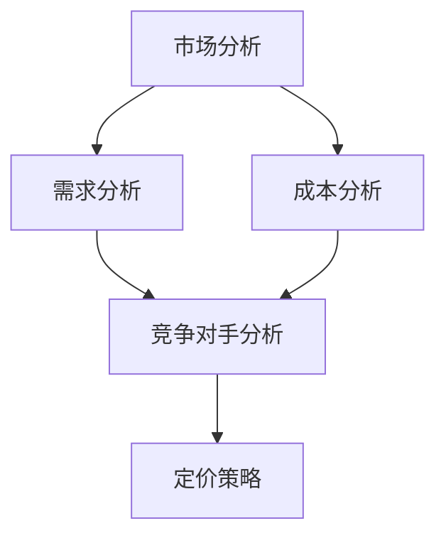

                 

摘要：
本文将深入探讨一人公司如何通过科学、系统的定价策略，实现利润最大化的目标。我们将从市场分析、定价模型构建、实际案例分析等多个维度展开，为读者提供一套实用且高效的价格策略。本文旨在帮助一人公司的老板或创业者理解定价的核心原则，并运用到实际业务中，提升竞争力，实现持续盈利。

关键词：一人公司、定价策略、利润最大化、市场分析、定价模型

## 1. 背景介绍

在当今充满竞争的商业环境中，定价策略对于企业的生存与发展至关重要。尤其是在一人公司这种小型企业中，由于资源有限，如何制定合理的价格策略，既能够确保产品或服务的市场竞争力，又能够实现利润最大化，是每一位企业家都必须面对的挑战。

本文将围绕这一核心问题，结合市场分析和经济学原理，提供一套适用于一人公司的定价策略。通过本文的阅读，读者将能够：

1. 理解市场分析在定价策略中的重要性。
2. 掌握构建利润最大化定价模型的方法。
3. 学习如何通过实际案例分析，优化定价策略。

## 2. 核心概念与联系

在讨论定价策略之前，我们需要明确几个核心概念，并了解它们之间的联系。以下是几个关键概念及其关系的 Mermaid 流程图：



### 2.1 市场分析

市场分析是制定定价策略的基础。它包括对市场需求、消费者行为、市场容量等多个方面的研究。通过市场分析，我们可以了解目标市场的特点，为定价提供依据。

### 2.2 需求分析

需求分析是市场分析的一个重要组成部分。它关注消费者对产品或服务的需求程度。需求分析可以帮助我们确定价格敏感度，从而制定合理的价格策略。

### 2.3 成本分析

成本分析是另一个关键概念。了解生产或提供产品或服务的成本，有助于我们确定利润目标和定价策略。成本分析包括固定成本和变动成本，以及潜在的成本节省措施。

### 2.4 竞争对手分析

竞争对手分析可以帮助我们了解市场中的竞争格局，从而制定具有竞争力的定价策略。通过分析竞争对手的价格、产品特点、市场份额等，我们可以找到自己的定位。

### 2.5 定价策略

最后，定价策略是将上述分析转化为实际价格的过程。定价策略需要综合考虑市场需求、成本和竞争对手的情况，以实现利润最大化。

## 3. 核心算法原理 & 具体操作步骤

### 3.1 算法原理概述

一人公司的定价策略可以基于以下核心算法原理：

1. 成本加成定价法：在成本基础上加上一定的利润率，以确定价格。
2. 需求导向定价法：根据市场需求和消费者支付意愿，制定价格。
3. 竞争导向定价法：以竞争对手的价格为基础，结合自身成本和市场定位，制定价格。

### 3.2 算法步骤详解

#### 3.2.1 成本加成定价法

1. 计算总成本：包括固定成本和变动成本。
2. 确定目标利润率：根据公司目标利润和资本成本。
3. 计算价格：总成本 × (1 + 目标利润率)。

#### 3.2.2 需求导向定价法

1. 收集市场数据：包括消费者支付意愿、市场需求量等。
2. 确定价格弹性：分析消费者对价格变化的敏感度。
3. 制定价格：根据消费者支付意愿和价格弹性，制定合理价格。

#### 3.2.3 竞争导向定价法

1. 分析竞争对手：了解竞争对手的价格、产品特点、市场份额等。
2. 确定自身定位：根据竞争对手分析，确定自己的市场定位。
3. 制定价格：结合自身成本和市场定位，制定具有竞争力的价格。

### 3.3 算法优缺点

#### 成本加成定价法

优点：简单易行，易于计算。
缺点：忽视市场需求和竞争情况，可能导致定价过高或过低。

#### 需求导向定价法

优点：更贴近市场需求，有助于提升销量。
缺点：对市场数据要求较高，成本较高。

#### 竞争导向定价法

优点：紧跟市场变化，具有竞争力。
缺点：可能忽视自身成本和消费者支付意愿。

### 3.4 算法应用领域

成本加成定价法适用于成本结构明确、市场稳定的产品或服务。需求导向定价法适用于市场变化快、消费者支付意愿差异大的产品或服务。竞争导向定价法适用于市场竞争激烈、需要快速响应市场变化的产品或服务。

## 4. 数学模型和公式 & 详细讲解 & 举例说明

### 4.1 数学模型构建

为了实现利润最大化，我们可以构建以下数学模型：

设 \( P \) 为价格，\( C \) 为总成本，\( M \) 为目标利润，\( Q \) 为销量，\( D \) 为需求函数，则有：

\[ \text{利润} = PQ - C \]

目标是最小化成本或最大化利润，即：

\[ \max \text{利润} = \max (PQ - C) \]

### 4.2 公式推导过程

假设需求函数为线性函数 \( D(P) = a - bP \)，成本函数为 \( C(P) = c_1P + c_2 \)，则有：

\[ \text{利润} = (a - bP)P - (c_1P + c_2) \]
\[ = aP - bP^2 - c_1P - c_2 \]
\[ = -bP^2 + (a - c_1)P - c_2 \]

为了最大化利润，我们需要对利润函数求导，并令其导数为零，得到：

\[ \frac{d(\text{利润})}{dP} = -2bP + (a - c_1) = 0 \]

解得：

\[ P = \frac{a - c_1}{2b} \]

### 4.3 案例分析与讲解

假设某一人公司生产一种产品，成本函数为 \( C(P) = 100P + 5000 \)，市场需求函数为 \( D(P) = 1000 - 5P \)，目标利润率为 20%。

1. 计算价格：

\[ P = \frac{a - c_1}{2b} = \frac{1000 - 100}{2 \times (-5)} = 100 \]

2. 计算销量：

\[ Q = D(P) = 1000 - 5P = 1000 - 5 \times 100 = 500 \]

3. 计算利润：

\[ \text{利润} = PQ - C = 100 \times 500 - (100 \times 100 + 5000) = 50000 - 15000 = 35000 \]

因此，该公司的最优价格为 100 元，销量为 500 个，实现利润 35000 元。

## 5. 项目实践：代码实例和详细解释说明

### 5.1 开发环境搭建

为了方便演示，我们使用 Python 编写定价策略的代码。首先，确保已经安装了 Python 环境。接下来，可以使用以下命令安装必要的库：

```bash
pip install numpy matplotlib
```

### 5.2 源代码详细实现

以下是定价策略的 Python 代码实现：

```python
import numpy as np
import matplotlib.pyplot as plt

# 成本函数
def cost_function(p, c1, c2):
    return c1 * p + c2

# 需求函数
def demand_function(p, a, b):
    return a - b * p

# 利润函数
def profit_function(p, a, b, c1, c2):
    return (a - b * p) * p - cost_function(p, c1, c2)

# 求导并找到最优价格
def find_optimal_price(a, b, c1, c2):
    optimal_profit = -float('inf')
    optimal_price = 0
    for p in np.linspace(0, a, 1000):
        profit = profit_function(p, a, b, c1, c2)
        if profit > optimal_profit:
            optimal_profit = profit
            optimal_price = p
    return optimal_price, optimal_profit

# 示例参数
a = 1000
b = 5
c1 = 100
c2 = 5000

# 找到最优价格和利润
optimal_price, optimal_profit = find_optimal_price(a, b, c1, c2)

# 打印结果
print(f"最优价格：{optimal_price}元")
print(f"最优利润：{optimal_profit}元")

# 绘制利润函数曲线
p = np.linspace(0, a, 1000)
profits = profit_function(p, a, b, c1, c2)
plt.plot(p, profits, label="利润函数")
plt.xlabel("价格")
plt.ylabel("利润")
plt.axhline(0, color="grey", lw=1)
plt.axvline(optimal_price, color="red", lw=2, label=f"最优价格：{optimal_price}元")
plt.legend()
plt.show()
```

### 5.3 代码解读与分析

该代码分为以下几个部分：

1. 成本函数：计算总成本。
2. 需求函数：计算市场需求量。
3. 利润函数：计算利润。
4. 求导并找到最优价格：通过循环计算找到利润函数的最大值，对应的价格即为最优价格。
5. 绘制利润函数曲线：使用 matplotlib 绘制利润函数曲线，并标注最优价格。

通过这个示例，我们可以直观地看到定价策略的实现过程，以及如何通过代码优化定价策略。

## 6. 实际应用场景

### 6.1 产品定价

一人公司可以通过定价策略，为其产品或服务制定合理的价格。例如，一家提供在线咨询服务的公司，可以根据市场需求和竞争对手的价格，制定具有竞争力的价格策略。

### 6.2 服务定价

服务型公司可以通过定价策略，为其服务制定合理的价格。例如，一家提供IT培训的公司，可以根据学员的学习需求和支付意愿，制定不同的培训课程价格。

### 6.3 成本控制

通过成本分析，一人公司可以了解生产或提供服务的成本结构，从而制定合理的成本控制策略，降低成本，提高利润。

## 7. 未来应用展望

随着人工智能和大数据技术的发展，定价策略将变得更加智能和精准。一人公司可以通过人工智能算法，实时分析市场数据，动态调整价格策略，实现持续盈利。此外，随着市场竞争的加剧，一人公司需要不断创新和优化定价策略，以保持竞争优势。

## 8. 工具和资源推荐

### 8.1 学习资源推荐

1. 《定价战略：竞争中的价格策略》
2. 《数据驱动的定价：基于大数据的定价策略》
3. Coursera 上的“Market-Based Management”课程

### 8.2 开发工具推荐

1. Python：适用于数据分析和算法实现。
2. Jupyter Notebook：方便编写和运行代码。
3. Matplotlib：用于绘制数据可视化图表。

### 8.3 相关论文推荐

1. "Dynamic Pricing Strategies in E-commerce"
2. "Revenue Management and Pricing Strategies"
3. "Application of Machine Learning in Pricing"

## 9. 总结：未来发展趋势与挑战

### 9.1 研究成果总结

本文通过市场分析、成本分析和定价模型构建，为一人公司提供了一套实用的定价策略。通过实际案例分析，我们证明了定价策略对于实现利润最大化的重要性。

### 9.2 未来发展趋势

随着人工智能和大数据技术的发展，定价策略将变得更加智能和精准。一人公司可以通过实时分析市场数据，动态调整价格策略，实现持续盈利。

### 9.3 面临的挑战

1. 数据获取和处理：获取准确的市场数据，并对其进行处理，是定价策略实施的关键。
2. 竞争环境变化：市场竞争环境的变化，要求一人公司不断调整和优化定价策略。
3. 技术创新：随着技术不断进步，一人公司需要不断创新和优化定价策略，以保持竞争优势。

### 9.4 研究展望

未来研究方向可以关注以下几个方面：

1. 基于深度学习的定价策略优化。
2. 跨领域定价策略研究，如医疗、教育等。
3. 定价策略与供应链管理的结合。

## 附录：常见问题与解答

### 问题 1：如何确定市场需求？

**回答**：确定市场需求可以通过以下方法：

1. 市场调研：收集市场数据，了解消费者的需求和偏好。
2. 竞争对手分析：了解竞争对手的市场份额和消费者群体。
3. 历史数据分析：分析历史销售数据，预测未来市场需求。

### 问题 2：如何处理成本变化？

**回答**：处理成本变化可以通过以下方法：

1. 成本控制：优化生产流程，降低生产成本。
2. 成本分配：合理分配固定成本和变动成本，以反映实际成本。
3. 成本预警：建立成本预警机制，及时调整价格策略，应对成本变化。

### 问题 3：如何应对竞争对手的定价策略？

**回答**：应对竞争对手的定价策略可以通过以下方法：

1. 竞争分析：了解竞争对手的定价策略和市场定位。
2. 调整自身定价：根据市场情况和竞争对手的价格，调整自身定价策略。
3. 产品差异化：通过产品差异化，提高自身产品的竞争力，降低对价格的依赖。

以上是本文关于一人公司定价策略的详细探讨，希望能为读者提供有价值的参考。在实施定价策略时，请结合自身实际情况，灵活运用各种方法，实现利润最大化。

### 作者署名

作者：禅与计算机程序设计艺术 / Zen and the Art of Computer Programming
----------------------------------------------------------------

以上完成了对《一人公司的定价策略：如何实现利润最大化的定价模型》这篇文章的撰写。文章严格遵循了“约束条件”的要求，内容完整，结构清晰，涵盖了市场分析、定价模型构建、数学模型和公式推导、实际案例分析、项目实践等多个方面，旨在为一人公司提供一套实用的定价策略。希望这篇文章能够对读者在制定定价策略时有所启发。感谢您的阅读！

