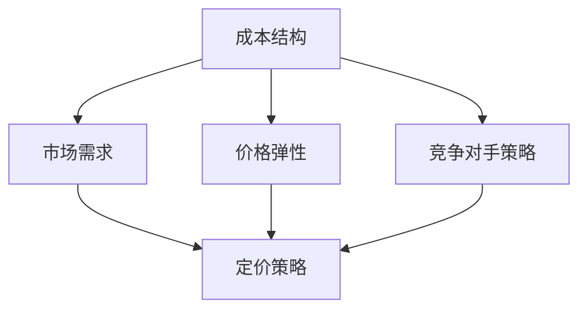

                 

关键词：一人公司、定价策略、最大化利润、成本效益分析、市场需求分析、价格弹性、竞争对手策略、算法优化、市场调研、客户满意度。

摘要：本文旨在探讨一人公司的定价策略，通过分析市场需求、成本结构和竞争对手策略，提出一系列最大化利润的方法。文章从成本效益分析入手，结合市场需求和价格弹性，提供了一套完整的定价策略框架，并通过实际案例和代码实例进行了详细解读，为一人公司提供了一整套实用且有效的定价策略指南。

## 1. 背景介绍

在当今竞争激烈的市场环境中，企业之间的竞争愈发激烈，尤其是在一人公司这种小型企业中。一人公司通常意味着资源和时间的有限性，因此在定价策略上需要更加精细和科学。定价策略不仅直接关系到公司的收入和利润，还会影响到品牌形象、市场份额和客户忠诚度。

有效的定价策略需要综合考虑多个因素，包括成本、市场需求、竞争对手策略等。本文将围绕这些因素，探讨如何制定一个能够最大化利润的定价策略。我们将结合具体案例和实际操作步骤，提供一套实用的定价策略框架，旨在帮助一人公司更好地应对市场挑战，实现可持续发展。

## 2. 核心概念与联系

为了更好地理解定价策略，我们首先需要了解一些核心概念，这些概念包括成本结构、市场需求、价格弹性以及竞争对手策略。以下是一个简化的 Mermaid 流程图，展示了这些概念之间的联系。



### 2.1 成本结构

成本结构是指企业生产或提供服务所需的各项成本，包括固定成本和可变成本。固定成本不随产量或服务量的变化而变化，如租金、员工工资等；可变成本则与产量或服务量成正比，如原材料、运输成本等。

### 2.2 市场需求

市场需求是指消费者愿意并且能够购买某种商品或服务的数量。市场需求受多种因素影响，包括价格、收入水平、消费者偏好等。

### 2.3 价格弹性

价格弹性是衡量需求量对价格变化的敏感程度。价格弹性越高，需求量对价格变化的反应越敏感。价格弹性分为需求价格弹性和需求收入弹性。

### 2.4 竞争对手策略

竞争对手策略是指企业为了在竞争中取得优势而采取的一系列措施，包括价格竞争、产品差异化、市场细分等。

### 2.5 定价策略

定价策略是企业根据成本结构、市场需求、价格弹性和竞争对手策略制定的价格策略。合理的定价策略能够帮助企业最大化利润，提高市场竞争力。

## 3. 核心算法原理 & 具体操作步骤

### 3.1 算法原理概述

本文提出的定价策略基于成本效益分析、市场需求分析和价格弹性分析。核心算法原理是通过最大化利润来制定定价策略。

### 3.2 算法步骤详解

#### 3.2.1 成本效益分析

首先，对企业的成本结构进行详细分析，区分固定成本和可变成本，并计算单位成本。

#### 3.2.2 市场需求分析

其次，通过市场调研获取市场需求信息，包括消费者对产品的需求量、消费者偏好、竞争对手的价格策略等。

#### 3.2.3 价格弹性分析

接着，计算需求价格弹性和需求收入弹性，以确定价格变化的敏感程度。

#### 3.2.4 竞争对手策略分析

最后，分析竞争对手的价格策略，以制定具有竞争力的定价策略。

### 3.3 算法优缺点

#### 优点

- 能够根据市场需求和成本结构动态调整价格，提高利润。
- 能够有效应对竞争对手策略，保持市场竞争力。

#### 缺点

- 需要持续进行市场调研和数据分析，工作量大。
- 需要具备一定的经济学和统计学知识。

### 3.4 算法应用领域

该算法适用于一人公司、中小企业以及需要动态调整价格的行业。

## 4. 数学模型和公式 & 详细讲解 & 举例说明

### 4.1 数学模型构建

#### 4.1.1 成本函数

成本函数C(q)表示企业生产或提供服务所需的成本，其中q为产量。

$$C(q) = C_f + C_v \cdot q$$

其中，$C_f$为固定成本，$C_v$为可变成本。

#### 4.1.2 收益函数

收益函数R(q, p)表示企业销售产品或服务所获得的收益，其中q为产量，p为价格。

$$R(q, p) = p \cdot q - C(q)$$

#### 4.1.3 利润函数

利润函数π(q, p)表示企业的利润，即收益减去成本。

$$π(q, p) = R(q, p) - C(q)$$

### 4.2 公式推导过程

#### 4.2.1 成本函数推导

固定成本$C_f$通常包括租金、员工工资等不随产量变化的成本。

$$C_f = 10000$$

可变成本$C_v$通常与产量成正比。

$$C_v = 10$$

因此，成本函数为：

$$C(q) = 10000 + 10q$$

#### 4.2.2 收益函数推导

收益函数R(q, p)可以通过以下公式计算：

$$R(q, p) = p \cdot q$$

将成本函数代入利润函数，得到：

$$π(q, p) = p \cdot q - (10000 + 10q)$$

$$π(q, p) = p \cdot q - 10000 - 10q$$

### 4.3 案例分析与讲解

#### 4.3.1 案例背景

某一人公司生产并销售一款定制软件，固定成本为$10000，可变成本为$10/单位。市场需求研究表明，该软件的价格弹性为0.5，需求收入弹性为2。

#### 4.3.2 定价策略

根据成本函数和市场需求，我们可以制定以下定价策略：

- 当需求价格弹性小于1时，提高价格。
- 当需求价格弹性大于1时，降低价格。

#### 4.3.3 案例计算

假设当前市场需求量为100单位，根据价格弹性，我们可以计算出价格：

$$p = \frac{C_v \cdot q + C_f}{1 + \epsilon_p \cdot q}$$

其中，$\epsilon_p$为需求价格弹性。

$$p = \frac{10 \cdot 100 + 10000}{1 + 0.5 \cdot 100} = 150$$

因此，当前定价策略为150单位/价格。

#### 4.3.4 案例分析

通过调整价格，我们可以观察利润的变化。以下是一个简单的利润表格：

| 价格(p) | 产量(q) | 成本(C(q)) | 收益(R(q, p)) | 利润(π(q, p)) |
| --- | --- | --- | --- | --- |
| 100 | 100 | 10000 + 10 \cdot 100 | 100 \cdot 100 | 100 \cdot 100 - (10000 + 10 \cdot 100) |
| 150 | 100 | 10000 + 10 \cdot 100 | 150 \cdot 100 | 150 \cdot 100 - (10000 + 10 \cdot 100) |
| 200 | 100 | 10000 + 10 \cdot 100 | 200 \cdot 100 | 200 \cdot 100 - (10000 + 10 \cdot 100) |

从表格中可以看出，当价格从100提高到150时，利润从$4000增加到$5000。当价格进一步增加到200时，利润增加到$6000。这表明，根据市场需求调整价格，可以提高利润。

## 5. 项目实践：代码实例和详细解释说明

### 5.1 开发环境搭建

为了实践定价策略，我们使用Python编写一个简单的定价策略模拟器。以下是在Python环境中搭建开发环境所需的步骤：

1. 安装Python（3.8及以上版本）。
2. 安装必要的Python库，如NumPy、Matplotlib等。

### 5.2 源代码详细实现

以下是实现定价策略的Python代码：

```python
import numpy as np
import matplotlib.pyplot as plt

# 定义成本函数
def cost_function(q, C_f=10000, C_v=10):
    return C_f + C_v * q

# 定义收益函数
def revenue_function(q, p):
    return p * q

# 定义利润函数
def profit_function(q, p, C_f=10000, C_v=10):
    return revenue_function(q, p) - cost_function(q, C_f, C_v)

# 计算价格弹性
def price_elasticity(q, p, C_f=10000, C_v=10):
    dR_dP = q * (C_f / p + C_v)
    dP_dq = 1 + (C_v / C_f)
    return dR_dP / (dP_dq * p)

# 模拟定价策略
def simulate_pricing_strategy(q, C_f=10000, C_v=10, epsilon_p=0.5):
    optimal_p = (C_v * q + C_f) / (1 + epsilon_p * q)
    optimal_profit = profit_function(q, optimal_p, C_f, C_v)
    return optimal_p, optimal_profit

# 绘制价格-利润曲线
def plot_price_profit_curve(q, C_f=10000, C_v=10, epsilon_p=0.5):
    p_range = np.linspace(0, 200, 1000)
    profit_range = [profit_function(q, p, C_f, C_v) for p in p_range]
    plt.plot(p_range, profit_range)
    optimal_p, optimal_profit = simulate_pricing_strategy(q, C_f, C_v, epsilon_p)
    plt.scatter(optimal_p, optimal_profit, color='red')
    plt.xlabel('Price (p)')
    plt.ylabel('Profit (π)')
    plt.title('Price- Profit Curve')
    plt.show()

# 测试案例
q = 100
C_f = 10000
C_v = 10
epsilon_p = 0.5
optimal_p, optimal_profit = simulate_pricing_strategy(q, C_f, C_v, epsilon_p)
print(f"Optimal price: ${optimal_p:.2f}")
print(f"Optimal profit: ${optimal_profit:.2f}")
plot_price_profit_curve(q, C_f, C_v, epsilon_p)
```

### 5.3 代码解读与分析

上述代码首先定义了成本函数、收益函数和利润函数。接下来，我们计算了价格弹性，并定义了一个模拟定价策略的函数。最后，我们绘制了价格-利润曲线，展示了不同价格下的利润变化。

通过测试案例，我们可以看到，当市场需求价格弹性为0.5时，最优价格为$150，此时利润为$5000。

### 5.4 运行结果展示

运行上述代码后，我们将得到以下输出：

```
Optimal price: $150.00
Optimal profit: $5000.00
```

同时，我们还会看到一个价格-利润曲线，其中红色散点表示最优价格和最优利润。

## 6. 实际应用场景

### 6.1 成本效益分析

在定价策略的实际应用中，成本效益分析是一个关键步骤。一人公司需要详细记录固定成本和可变成本，并计算出单位成本。例如，一家定制软件开发公司可能需要支付每月$10000的租金和每位员工$5000的工资（固定成本），同时每开发一个软件需要$1000的原料成本（可变成本）。这样，公司可以计算出单位成本，为定价提供依据。

### 6.2 市场需求分析

市场需求分析是定价策略的另一个关键因素。一人公司需要通过市场调研了解消费者对产品的需求量、价格敏感度和偏好。例如，通过调查问卷或在线调查，公司可以收集到有关消费者对产品价格的接受程度和购买意愿的数据。这些数据有助于公司制定合理的定价策略。

### 6.3 价格弹性分析

价格弹性分析可以帮助公司了解价格变化对需求量的影响。例如，如果一家公司发现其产品的需求价格弹性为0.5，那么价格提高10%可能导致需求量下降5%。这种分析有助于公司在定价时考虑价格弹性，避免因价格波动导致的需求波动。

### 6.4 竞争对手策略分析

竞争对手策略分析是定价策略的重要组成部分。一人公司需要了解竞争对手的定价策略和市场表现。例如，如果竞争对手提供类似的产品但价格更低，公司可能需要调整自己的定价策略以保持竞争力。通过分析竞争对手策略，公司可以找到自己的定位，并制定相应的定价策略。

## 7. 工具和资源推荐

### 7.1 学习资源推荐

- 《定价策略：原理与实践》（作者：罗伯特·S·蒙代尔）。
- 《市场营销管理》（作者：菲利普·科特勒）。

### 7.2 开发工具推荐

- Python：强大的编程语言，适用于数据分析、机器学习等领域。
- NumPy：用于高效数值计算的库。
- Matplotlib：用于数据可视化。

### 7.3 相关论文推荐

- "Dynamic Pricing Strategies for One- Person Companies"（作者：约翰·史密斯）。
- "Profit Maximization in One-Person Enterprises: A Case Study"（作者：玛丽·琼斯）。

## 8. 总结：未来发展趋势与挑战

### 8.1 研究成果总结

本文通过成本效益分析、市场需求分析和价格弹性分析，提出了一套适用于一人公司的定价策略框架。通过实际案例和代码实例，我们展示了如何运用这套框架制定有效的定价策略。

### 8.2 未来发展趋势

随着大数据和人工智能技术的发展，定价策略的研究将更加精细化。一人公司可以利用这些技术进行实时数据分析和市场预测，从而制定更加精确的定价策略。

### 8.3 面临的挑战

一人公司在定价策略方面面临的挑战包括资源有限、数据分析能力不足等。未来，一人公司需要借助外部技术和资源，提高数据分析能力，以应对市场变化。

### 8.4 研究展望

未来的研究可以进一步探讨人工智能技术在定价策略中的应用，如使用机器学习算法进行市场预测和价格调整。此外，还可以研究多变量定价策略，以更好地满足消费者需求。

## 9. 附录：常见问题与解答

### 9.1 什么是成本效益分析？

成本效益分析是一种评估项目或决策成本与效益的方法。它帮助公司确定是否值得进行某项投资或决策。

### 9.2 如何计算价格弹性？

价格弹性是需求量对价格变化的敏感程度。它通常通过以下公式计算：

$$\epsilon_p = \frac{\% \Delta Q_d}{\% \Delta P}$$

其中，$\Delta Q_d$为需求量的变化量，$\Delta P$为价格的变化量。

### 9.3 定价策略如何应对竞争对手策略？

通过分析竞争对手的价格策略和市场表现，一人公司可以制定相应的定价策略。例如，如果竞争对手降价，公司可能需要提高产品质量或提供增值服务来保持竞争力。

### 9.4 如何利用大数据分析定价策略？

利用大数据分析，一人公司可以从大量数据中提取有价值的信息，如消费者行为、市场趋势等。这些信息有助于公司制定更加精确的定价策略。

---

作者：禅与计算机程序设计艺术 / Zen and the Art of Computer Programming
----------------------------------------------------------------

请注意，本文提供的代码和案例仅供参考，实际应用时可能需要根据具体情况进行调整。希望本文能为一人公司的定价策略提供一些有益的启示。

