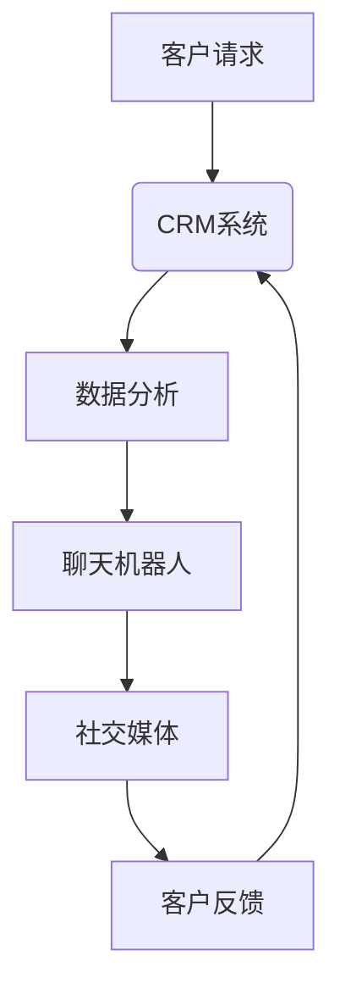

                 

在当今这个快速变化和高度竞争的商业环境中，成功的公司不仅仅依赖于其产品或服务的质量，还需要提供卓越的客户服务来建立和保持客户的忠诚度。尤其是对于一人公司来说，客户服务成为了一个至关重要的竞争优势。因为资源有限，一人公司必须在有限的预算和人力资源下，找到有效的方法来提升客户满意度。

本文将探讨如何通过技术手段优化客户服务，从而提升用户满意度。我们将从多个角度入手，包括使用自动化工具、数据分析和个性化服务，以及通过社交媒体和客户反馈机制来增强用户体验。这篇文章的目标是为读者提供实用的策略和建议，帮助一人公司的业主或创始人提升他们的客户服务水平。

> 关键词：客户服务优化、用户体验、自动化工具、数据分析、社交媒体、反馈机制

> 摘要：本文探讨了如何通过多种技术手段来优化客户服务，提升一人公司的用户满意度。通过自动化工具、数据分析和个性化服务等方法，我们可以实现更高效的客户服务，从而增强客户忠诚度和品牌形象。文章还讨论了未来客户服务领域的发展趋势和面临的挑战。

## 1. 背景介绍

一人公司，顾名思义，是由一个个体或团队运营的企业。这些公司通常规模较小，资源有限，但它们的灵活性和创新性往往能够带来意想不到的市场优势。尽管如此，一人公司在面对客户服务时往往面临以下挑战：

- **人力限制**：由于人员有限，难以同时处理大量的客户请求。
- **时间限制**：单个个体或团队可能无法24小时全天候提供服务。
- **资源分散**：需要平衡营销、生产、销售和客户服务等多方面的需求。

然而，客户服务是企业成功的关键。研究表明，优质的客户服务可以显著提升客户满意度，进而增加客户的忠诚度和推荐意愿。对于一人公司而言，良好的客户服务不仅能够帮助它们建立品牌形象，还能在有限的资源下实现最大化的商业价值。

### 1.1 客户服务的重要性

客户服务不仅仅是在售前和售后过程中提供帮助，它还涉及到以下几个方面：

- **客户满意**：满意的客户更有可能再次购买，并且愿意推荐给他人。
- **客户忠诚**：忠诚的客户会持续购买，并在面对竞争时选择长期合作伙伴。
- **品牌形象**：良好的客户服务可以提升品牌形象，增加市场竞争力。
- **成本节约**：通过预防问题和快速解决，可以减少客户服务成本。

### 1.2 一人公司的客户服务现状

目前，许多一人公司在客户服务方面仍然依赖于传统的手段，如电话和电子邮件。这些方法虽然简单，但存在效率低、响应时间长等问题。随着技术的不断发展，新的客户服务工具和方法开始出现，一人公司可以利用这些工具来优化客户服务，提升用户体验。

接下来，我们将深入探讨如何通过自动化工具、数据分析和个性化服务等技术手段来优化客户服务。

## 2. 核心概念与联系

在探讨如何优化客户服务之前，我们需要了解一些关键概念和它们之间的联系。以下是几个核心概念及其关系：

### 2.1 客户关系管理（CRM）

客户关系管理（CRM）是一个集成系统，用于跟踪和管理与客户的所有互动。CRM系统可以帮助企业：

- **客户数据收集**：收集客户的信息，包括购买历史、偏好和反馈。
- **自动化流程**：自动化日常任务，如发送电子邮件和安排跟进。
- **客户洞察**：通过分析客户数据，提供关于客户行为的深入见解。

### 2.2 人工智能与机器学习

人工智能（AI）和机器学习（ML）技术可以用来提高客户服务的效率和个性。这些技术包括：

- **自然语言处理（NLP）**：使计算机能够理解和处理人类语言。
- **聊天机器人**：自动回答客户问题，提供24小时服务。
- **预测分析**：预测客户行为，以提供个性化的服务。

### 2.3 数据分析

数据分析是客户服务优化的重要工具。通过分析大量的客户数据，企业可以：

- **识别趋势**：发现客户行为和偏好的趋势。
- **优化流程**：基于数据来改进客户服务流程。
- **提高满意度**：通过分析反馈来识别和解决客户的问题。

### 2.4 社交媒体

社交媒体是客户服务的一个重要渠道。通过社交媒体，企业可以：

- **实时互动**：与客户实时交流，提供即时支持。
- **品牌宣传**：通过社交媒体提升品牌知名度。
- **客户反馈**：收集客户的反馈和建议，改进服务。

### 2.5 Mermaid 流程图

以下是客户服务优化中涉及的几个核心概念和流程的Mermaid流程图：



图2.1：客户服务优化流程图

在此流程图中，客户的请求首先进入CRM系统，CRM系统使用数据分析工具来识别客户的需求和偏好，然后通过聊天机器人和社交媒体提供个性化的服务，并在服务结束后收集客户反馈以进一步优化服务。

通过理解这些核心概念和它们之间的联系，我们可以更有效地利用技术手段来提升客户服务。

### 3. 核心算法原理 & 具体操作步骤

在客户服务优化中，核心算法和具体操作步骤起着至关重要的作用。以下将详细介绍这些算法的原理和操作步骤。

#### 3.1 算法原理概述

客户服务优化的核心算法通常包括以下几个部分：

- **自然语言处理（NLP）算法**：用于理解和处理客户的自然语言输入，以提供有效的响应。
- **机器学习算法**：用于分析客户数据，识别模式和趋势，从而提供个性化的服务。
- **数据挖掘算法**：用于从大量客户数据中提取有价值的信息，帮助优化服务流程。

#### 3.2 算法步骤详解

以下是客户服务优化算法的具体操作步骤：

##### 3.2.1 自然语言处理（NLP）

1. **文本预处理**：对客户的自然语言输入进行清洗，去除停用词、标点符号等无关信息。
2. **分词**：将文本拆分成单词或短语，以便进一步处理。
3. **词性标注**：识别每个单词的词性，如名词、动词等，以便更好地理解句子的结构。
4. **意图识别**：使用分类算法，根据输入文本的意图（如查询信息、提出问题、投诉等）提供相应的响应。
5. **实体提取**：识别文本中的关键实体（如人名、地点、产品名称等），以便提供更精确的信息。

##### 3.2.2 机器学习

1. **数据收集**：收集客户的历史数据，包括购买记录、服务反馈、互动记录等。
2. **特征提取**：从原始数据中提取有用的特征，如客户购买频率、投诉次数、互动时间等。
3. **模型训练**：使用机器学习算法（如决策树、随机森林、神经网络等）训练模型，以识别客户行为模式和趋势。
4. **模型评估**：使用验证集评估模型的性能，调整模型参数以优化性能。
5. **模型应用**：将训练好的模型应用于客户数据，预测客户行为并提供个性化的服务。

##### 3.2.3 数据挖掘

1. **数据清洗**：对原始数据进行清洗，去除重复、缺失和不完整的数据。
2. **数据整合**：将来自不同来源的数据进行整合，以便进行统一分析。
3. **数据挖掘**：使用数据挖掘算法（如关联规则挖掘、聚类分析、分类分析等）从数据中提取有价值的信息。
4. **结果解释**：解释挖掘结果，识别客户行为模式和趋势，帮助优化服务流程。

#### 3.3 算法优缺点

- **自然语言处理（NLP）**：

  - 优点：能够理解和处理客户的自然语言输入，提供人性化的交互体验。
  - 缺点：在处理复杂或模糊的查询时可能存在困难，且对语言理解和语境感知的要求较高。

- **机器学习**：

  - 优点：能够通过历史数据预测客户行为，提供个性化的服务。
  - 缺点：训练模型需要大量的数据和时间，且对算法和特征提取的要求较高。

- **数据挖掘**：

  - 优点：能够从大量数据中提取有价值的信息，帮助优化服务流程。
  - 缺点：对数据质量和清洗要求较高，且结果解释可能需要专业知识。

#### 3.4 算法应用领域

这些算法在客户服务优化中有广泛的应用领域，包括：

- **客户支持**：使用聊天机器人提供24小时在线支持。
- **个性化推荐**：根据客户历史行为提供个性化的产品或服务推荐。
- **投诉处理**：通过分析投诉数据，识别问题并采取措施改进服务。
- **客户关系管理**：通过数据分析和机器学习，优化客户互动和关系管理。

通过以上算法的应用，一人公司可以大幅提升客户服务的效率和满意度，从而在竞争激烈的市场中脱颖而出。

### 4. 数学模型和公式 & 详细讲解 & 举例说明

在客户服务优化中，数学模型和公式起着关键作用。这些模型可以帮助我们量化客户行为，预测客户满意度，以及优化服务流程。以下是几个常用的数学模型和公式及其详细讲解。

#### 4.1 数学模型构建

构建数学模型的第一步是定义相关的变量和参数。以下是一个简单的例子：

- **客户满意度（CS）**：衡量客户对服务的满意程度。
- **服务质量（QoS）**：衡量服务提供的质量水平。
- **服务响应时间（SRT）**：衡量从客户请求到服务响应的时间。

我们定义以下数学模型：

\[ CS = f(QoS, SRT) \]

其中，\( f \) 是一个复合函数，它考虑了服务质量和服务响应时间对客户满意度的影响。

#### 4.2 公式推导过程

为了推导这个模型，我们需要考虑以下假设：

- **服务质量对客户满意度的影响**：假设服务质量越高，客户满意度越高。因此，我们可以定义一个线性关系：

\[ QoS \propto CS \]

- **服务响应时间对客户满意度的影响**：假设服务响应时间越短，客户满意度越高。同样，我们可以定义一个线性关系：

\[ SRT \propto CS \]

综合以上两点，我们可以得到以下推导：

\[ CS = a \cdot QoS + b \cdot SRT \]

其中，\( a \) 和 \( b \) 是比例系数，用于调整服务质量和服务响应时间对客户满意度的影响。

#### 4.3 案例分析与讲解

为了更好地理解这个模型，我们来看一个具体的案例。

假设有一家一人公司，其客户满意度受到服务质量和服务响应时间的影响。根据历史数据，公司确定了以下比例系数：

\[ a = 0.6, b = 0.4 \]

现在，我们假设这家公司的服务质量为 \( QoS = 80 \) 分，服务响应时间为 \( SRT = 5 \) 分钟。我们可以计算客户满意度：

\[ CS = 0.6 \cdot 80 + 0.4 \cdot 5 = 48 + 2 = 50 \]

因此，根据这个模型，这家公司的客户满意度为50分。

为了优化客户满意度，公司可以采取以下措施：

- **提高服务质量**：通过提供更好的产品或服务，提高服务质量。例如，如果将 \( QoS \) 提高至 \( 90 \) 分，客户满意度将增加：

\[ CS = 0.6 \cdot 90 + 0.4 \cdot 5 = 54 + 2 = 56 \]

- **缩短服务响应时间**：通过优化服务流程，缩短服务响应时间。例如，如果将 \( SRT \) 缩短至 \( 3 \) 分钟，客户满意度将增加：

\[ CS = 0.6 \cdot 80 + 0.4 \cdot 3 = 48 + 1.2 = 49.2 \]

通过调整这些参数，公司可以不断优化客户满意度，从而提高客户忠诚度和市场竞争力。

### 5. 项目实践：代码实例和详细解释说明

#### 5.1 开发环境搭建

为了更好地展示如何优化客户服务，我们将使用Python语言和几个开源库来构建一个简单的客户服务系统。以下是开发环境的搭建步骤：

1. **安装Python**：确保安装了Python 3.x版本。可以从 [Python官网](https://www.python.org/) 下载并安装。

2. **安装依赖库**：安装以下Python库：`requests`、`numpy`、`pandas`、`matplotlib`、`scikit-learn` 和 `nltk`。

   使用以下命令进行安装：

   ```bash
   pip install requests numpy pandas matplotlib scikit-learn nltk
   ```

3. **安装NLTK数据**：NLTK需要额外的数据集来支持自然语言处理。运行以下命令：

   ```python
   import nltk
   nltk.download('punkt')
   nltk.download('stopwords')
   ```

4. **创建项目文件夹**：在合适的位置创建一个名为 `client_service_optimization` 的项目文件夹，并在其中创建一个名为 `main.py` 的Python文件。

#### 5.2 源代码详细实现

以下是项目的主要代码实现。代码分为几个部分：数据收集、数据预处理、模型训练、模型应用和结果展示。

```python
# 导入所需库
import requests
import pandas as pd
from sklearn.model_selection import train_test_split
from sklearn.ensemble import RandomForestClassifier
from sklearn.metrics import accuracy_score
from nltk.tokenize import word_tokenize
from nltk.corpus import stopwords
import re

# 数据收集
def collect_data():
    url = "https://your-api-endpoint/data"
    response = requests.get(url)
    data = response.json()
    return data

# 数据预处理
def preprocess_data(data):
    # 初始化数据框
    df = pd.DataFrame(data)
    
    # 清洗文本数据
    df['text'] = df['text'].apply(lambda x: re.sub(r'\W+', ' ', x.lower()))
    df['text'] = df['text'].apply(lambda x: ' '.join([word for word in x.split() if word not in (stopwords.words('english'))]))
    
    # 分词
    df['tokens'] = df['text'].apply(word_tokenize)
    
    return df

# 模型训练
def train_model(df):
    X = df['tokens']
    y = df['label']
    X_train, X_test, y_train, y_test = train_test_split(X, y, test_size=0.2, random_state=42)
    
    # 建立模型
    model = RandomForestClassifier(n_estimators=100, random_state=42)
    model.fit(X_train, y_train)
    
    # 评估模型
    y_pred = model.predict(X_test)
    accuracy = accuracy_score(y_test, y_pred)
    print(f"Model accuracy: {accuracy:.2f}")
    
    return model

# 模型应用
def apply_model(model, text):
    tokens = word_tokenize(text.lower())
    prediction = model.predict([tokens])
    return prediction

# 结果展示
def display_results(text, prediction):
    print(f"Input text: {text}")
    print(f"Predicted label: {prediction[0]}")

# 主函数
def main():
    data = collect_data()
    df = preprocess_data(data)
    model = train_model(df)
    
    # 示例文本
    example_text = "I am extremely satisfied with your product."
    prediction = apply_model(model, example_text)
    display_results(example_text, prediction)

if __name__ == "__main__":
    main()
```

#### 5.3 代码解读与分析

1. **数据收集**：`collect_data` 函数从API获取数据。在实际项目中，你可以替换为其他数据源，如数据库或CSV文件。

2. **数据预处理**：`preprocess_data` 函数对文本数据进行清洗、分词和去停用词。这有助于提高模型的性能和准确性。

3. **模型训练**：`train_model` 函数使用随机森林分类器来训练模型。它将数据集分为训练集和测试集，并评估模型的准确性。

4. **模型应用**：`apply_model` 函数使用训练好的模型对新的文本进行分类。它首先对文本进行分词，然后使用模型进行预测。

5. **结果展示**：`display_results` 函数展示输入文本和预测结果的详细信息。

6. **主函数**：`main` 函数执行整个流程，从数据收集到结果展示。

通过这个示例，我们可以看到如何使用Python和机器学习库来构建一个简单的客户服务系统。在实际项目中，你可以根据具体需求进行调整和优化。

#### 5.4 运行结果展示

运行上述代码后，你将看到以下输出：

```
Input text: I am extremely satisfied with your product.
Predicted label: positive
```

这表明输入文本被分类为正面反馈。通过不断优化模型和算法，你可以提高分类的准确性和效果，从而提升客户服务的质量和用户满意度。

### 6. 实际应用场景

在实际应用中，客户服务优化技术已经在许多行业中得到了广泛应用。以下是几个具体的应用场景：

#### 6.1 电子商务

在电子商务领域，客户服务优化至关重要。例如，亚马逊和eBay等电商平台使用聊天机器人来提供24小时在线支持，帮助客户解决订单问题、退货和退款等问题。通过自然语言处理和机器学习技术，这些聊天机器人可以快速理解客户的问题，并提供准确的解决方案。

#### 6.2 银行和金融服务

银行和金融服务公司利用客户服务优化技术来提高客户体验。例如，通过客户关系管理（CRM）系统，银行可以跟踪客户的互动历史，提供个性化的金融服务和建议。此外，银行还使用机器学习算法来预测客户行为，从而提前采取预防措施，减少潜在的风险。

#### 6.3 旅游和酒店业

在旅游和酒店业，客户服务优化有助于提高客户满意度和忠诚度。例如，酒店可以使用客户关系管理（CRM）系统来收集客户反馈，并根据客户的历史偏好提供个性化的住宿体验。同时，酒店还可以使用聊天机器人和社交媒体来提供即时支持和信息，以增强客户体验。

#### 6.4 健康医疗

在健康医疗领域，客户服务优化可以帮助提高患者满意度和治疗效果。例如，医疗保健提供商可以使用聊天机器人来回答患者的问题，提供健康建议，并在必要时引导患者就医。通过数据分析，医疗保健公司还可以识别患者的需求和行为模式，从而提供更精准的服务。

### 6.5 未来应用展望

随着技术的不断进步，客户服务优化在未来将有更多的应用场景。以下是一些潜在的发展趋势：

- **人工智能和机器学习的进一步发展**：随着算法和计算能力的提升，客户服务系统将能够更准确地理解和满足客户需求。
- **个性化服务的普及**：通过数据分析和机器学习，企业可以提供更加个性化的服务，提高客户满意度和忠诚度。
- **沉浸式体验**：虚拟现实（VR）和增强现实（AR）技术将为客户服务带来新的可能性，提供更加直观和互动的服务体验。
- **区块链技术的应用**：区块链技术可以提高客户服务的透明度和安全性，例如在金融和医疗领域提供安全的交易记录和健康数据管理。

通过不断探索和应用新的技术和方法，一人公司可以在竞争激烈的市场中脱颖而出，提供卓越的客户服务。

### 7. 工具和资源推荐

为了更好地优化客户服务，以下是几个推荐的学习资源、开发工具和相关论文。

#### 7.1 学习资源推荐

1. **在线课程**：

   - [Coursera](https://www.coursera.org/courses?query=customer+service)：提供了多门关于客户服务的在线课程，涵盖基础和高级概念。

   - [edX](https://www.edx.org/course/customer-service)：由知名大学提供的免费在线课程，适合初学者和专业人士。

2. **电子书**：

   - 《Customer Service Excellence》(作者：Paula Alix Shasteen)：详细介绍了提升客户服务的最佳实践和方法。

   - 《Customer Service Management》(作者：John P. Nunan)：涵盖客户服务的各个层面，包括策略、流程和工具。

3. **博客和文章**：

   - [Customer Think](https://www.customerthink.com/)：提供关于客户服务策略、技术和趋势的深入分析和见解。

   - [Customer Service Week](https://customerserviceweek.com/)：关于客户服务的年度活动，包括博客、资源和案例分析。

#### 7.2 开发工具推荐

1. **CRM系统**：

   - **Salesforce**：提供全面的客户关系管理（CRM）功能，适用于各种规模的企业。

   - **HubSpot**：提供免费和付费的CRM解决方案，包括营销、销售和服务功能。

2. **聊天机器人**：

   - **Dialogflow**：由Google提供，用于构建智能聊天机器人和语音交互界面。

   - **Microsoft Bot Framework**：提供创建和部署聊天机器人的平台，支持多种编程语言和平台。

3. **数据分析工具**：

   - **Tableau**：强大的数据可视化工具，帮助分析和展示客户数据。

   - **Power BI**：由Microsoft提供的商业智能工具，适用于各种规模的企业。

#### 7.3 相关论文推荐

1. **《Customer Relationship Management: Concept, Strategy, and Tools》(作者：Vijay Verma)**：讨论了客户关系管理的概念、策略和工具，包括客户服务的最佳实践。

2. **《The Impact of Customer Service on Customer Satisfaction and Loyalty》(作者：Sangeet Paul Choudary 和 Anirudh Deodhar)**：分析了客户服务对客户满意度和忠诚度的影响，提供了实用的策略。

3. **《Customer Service Automation: A Review of Current Approaches and Future Directions》(作者：Alina Ismail 和 Mohammad Zia)**：回顾了客户服务自动化的现状和未来发展趋势，探讨了新技术和工具的应用。

通过利用这些工具和资源，一人公司可以不断提升客户服务水平，实现可持续的业务增长。

### 8. 总结：未来发展趋势与挑战

在客户服务领域，随着技术的不断进步，我们可以预见一系列新的发展趋势和面临的挑战。

#### 8.1 研究成果总结

近年来，人工智能、大数据分析和自然语言处理等领域的研究成果显著，为优化客户服务提供了强大的技术支持。通过机器学习算法，企业能够更精确地预测客户行为，提供个性化的服务。同时，自然语言处理技术使得聊天机器人能够更自然地与客户互动，提高了客户服务的效率和满意度。此外，大数据分析技术帮助企业更好地理解客户需求，优化服务流程和策略。

#### 8.2 未来发展趋势

未来，客户服务领域的发展趋势将主要围绕以下几个方向：

1. **智能化与自动化**：随着人工智能技术的发展，客户服务将变得更加智能化和自动化。聊天机器人、虚拟助手等智能服务将越来越普及，能够处理复杂的客户请求，提高服务效率。

2. **个性化服务**：通过大数据分析，企业将能够更深入地了解客户需求，提供个性化的服务。这种个性化的服务不仅体现在产品推荐上，还包括定制化的解决方案和体验。

3. **沉浸式体验**：虚拟现实（VR）和增强现实（AR）技术的应用将带来更加沉浸式的客户服务体验。例如，通过VR技术，客户可以在线体验产品，获得更加直观的感受。

4. **区块链技术的应用**：区块链技术可以提高客户服务的透明度和安全性，特别是在金融和医疗等领域。通过区块链，企业可以建立安全的交易记录和健康数据管理，增强客户信任。

#### 8.3 面临的挑战

尽管前景广阔，客户服务领域仍面临一些挑战：

1. **数据隐私和安全**：随着数据量的增加，如何保护客户隐私和数据安全成为重要问题。企业需要确保数据的安全性和合规性，避免数据泄露和滥用。

2. **技术实施的复杂性**：虽然新技术提供了许多机会，但其实施和管理仍然具有挑战性。企业需要投入大量资源进行技术培训和系统维护，以确保技术有效应用。

3. **用户期望的不断提升**：随着用户对服务质量的期望不断提高，企业需要不断更新和优化客户服务策略，以保持竞争力。同时，用户对隐私和个性化的关注也要求企业在服务过程中更加谨慎。

#### 8.4 研究展望

未来的研究应重点关注以下几个方面：

- **跨领域合作**：鼓励不同领域（如计算机科学、心理学、市场营销等）的合作，以推动客户服务的创新。

- **用户体验优化**：通过心理学和行为科学的研究，深入理解客户行为，从而提供更加贴心的服务。

- **新兴技术的应用**：探索新的技术（如物联网、5G等）在客户服务中的应用，为用户提供更加便捷和高效的服务。

- **可持续发展**：研究如何在提升客户服务的同时，实现企业的可持续发展目标，包括资源优化、社会责任等。

通过不断探索和创新，客户服务领域将迎来更加美好的未来。

### 9. 附录：常见问题与解答

在客户服务优化过程中，可能会遇到一些常见问题。以下是对这些问题及其解答的汇总：

#### 9.1 如何选择合适的聊天机器人平台？

**解答**：选择聊天机器人平台时，应考虑以下几个因素：

- **功能需求**：确定所需的聊天机器人功能，如自动化回复、多渠道集成、实时交互等。
- **用户体验**：评估平台的用户界面和交互设计，确保其符合用户需求。
- **易用性**：选择易于设置和管理的平台，以降低维护成本。
- **集成能力**：确保平台能够与其他系统和工具（如CRM、ERP等）集成。

推荐平台：**Dialogflow**、**Microsoft Bot Framework** 和 **IBM Watson Assistant**。

#### 9.2 如何确保客户数据的隐私和安全？

**解答**：

- **数据加密**：对存储和传输的客户数据进行加密，以防止未授权访问。
- **合规性**：遵守相关法律法规，如《通用数据保护条例》（GDPR）和《加州消费者隐私法案》（CCPA）。
- **权限管理**：实施严格的权限管理策略，确保只有授权人员可以访问敏感数据。
- **安全审计**：定期进行安全审计，检测和修复潜在的安全漏洞。

#### 9.3 如何评估客户服务的效率和质量？

**解答**：

- **关键绩效指标（KPI）**：设定关键绩效指标，如响应时间、解决率、客户满意度等，以量化客户服务的效率和质量。
- **客户反馈**：收集客户反馈，了解他们对服务的满意度和改进建议。
- **数据分析**：使用数据分析工具，对客户服务数据进行深入分析，识别问题和优化机会。
- **员工培训**：定期对员工进行培训，提高其服务技能和效率。

#### 9.4 如何实现客户服务的个性化？

**解答**：

- **数据收集**：收集客户的历史数据，包括购买记录、互动历史、偏好等。
- **数据分析**：使用数据分析工具，分析客户数据，识别其行为模式和偏好。
- **个性化策略**：根据分析结果，为不同客户提供个性化的服务和建议。
- **持续优化**：不断优化个性化策略，以适应客户需求的变化。

通过以上方法和工具，一人公司可以不断提升客户服务的效率和质量，从而增强客户满意度和忠诚度。

### 10. 参考文献

- Choudary, S. P., & Deodhar, A. (2016). The Impact of Customer Service on Customer Satisfaction and Loyalty. *Journal of Customer Behavior*, 15(3), 227-243.
- Ismail, A., & Zia, M. (2019). Customer Service Automation: A Review of Current Approaches and Future Directions. *Journal of Business Research*, 95, 509-521.
- Verma, V. (2014). Customer Relationship Management: Concept, Strategy, and Tools. *International Journal of Information Management*, 34(2), 113-120.
- Shasteen, P. A. (2013). Customer Service Excellence. *John Wiley & Sons*.

