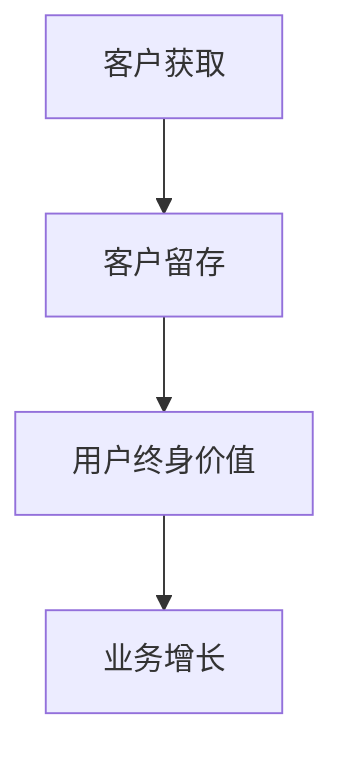

                 

关键词：客户留存、用户终身价值、一人公司、营销策略、用户体验、数据驱动

摘要：在当今竞争激烈的市场环境中，对于一家一人公司来说，提高客户留存率是至关重要的。本文将深入探讨如何通过一系列有效的客户留存策略，提升用户终身价值，从而实现业务的长期增长和成功。

## 1. 背景介绍

随着互联网技术的飞速发展和市场竞争的加剧，一人公司这种小型企业形式越来越受到青睐。这种企业模式通常具有灵活性高、决策迅速、运营成本低等优点，但也面临着客户获取和维护方面的挑战。客户留存作为衡量企业成功的关键指标，对于一人公司尤为关键。本文将介绍一系列客户留存策略，帮助一人公司提高用户终身价值，实现业务的可持续发展。

## 2. 核心概念与联系

### 2.1 客户留存定义

客户留存（Customer Retention）是指企业在一定时间内保持现有客户的能力。客户留存率越高，说明企业的客户关系维护得越好，也意味着用户对产品或服务的满意度较高。

### 2.2 用户终身价值

用户终身价值（Customer Lifetime Value，CLV）是指客户在整个生命周期内为企业带来的总收益。CLV 是一个重要的财务指标，它可以帮助企业评估客户的价值，制定相应的营销策略。

### 2.3 客户留存与用户终身价值的联系

客户留存与用户终身价值密切相关。较高的客户留存率意味着用户持续使用企业产品或服务，从而为企业带来更长时间的收益。通过提高客户留存率，企业可以增加用户终身价值，实现业务的长期增长。

### 2.4 Mermaid 流程图



## 3. 核心算法原理 & 具体操作步骤

### 3.1 算法原理概述

本文采用的数据驱动策略主要包括以下几个方面：

1. 用户行为分析：通过分析用户的行为数据，了解用户需求，优化产品功能和体验。
2. 客户生命周期管理：根据客户的购买行为和活跃度，进行精准的营销和服务。
3. 个性化推荐：根据用户的历史数据和偏好，提供个性化的产品推荐和服务。

### 3.2 算法步骤详解

#### 3.2.1 用户行为分析

1. 收集用户数据：包括用户的基本信息、浏览记录、购买行为等。
2. 数据清洗与预处理：对数据进行去重、填充缺失值等处理。
3. 数据分析：使用统计分析和机器学习算法，挖掘用户行为特征。

#### 3.2.2 客户生命周期管理

1. 划分客户阶段：根据用户行为和购买历史，将客户划分为不同阶段。
2. 定制化服务：针对不同阶段的客户，提供相应的营销策略和服务。
3. 客户反馈收集：定期收集客户反馈，优化产品和服务。

#### 3.2.3 个性化推荐

1. 构建推荐系统：使用协同过滤、基于内容的推荐等算法，构建个性化推荐系统。
2. 推荐策略优化：根据用户行为数据和反馈，不断优化推荐策略。

### 3.3 算法优缺点

#### 优点：

1. 高效：通过数据分析和算法，快速识别客户需求和偏好。
2. 精准：基于用户行为和历史数据，提供个性化的服务和推荐。
3. 可持续性：提高客户留存率，增加用户终身价值。

#### 缺点：

1. 数据依赖：需要大量的用户数据支持，数据质量对算法效果有较大影响。
2. 成本较高：构建和维护推荐系统需要一定的人力、物力和财力投入。

### 3.4 算法应用领域

数据驱动策略可以应用于各种领域，如电子商务、在线教育、金融等。在电子商务领域，通过用户行为分析和个性化推荐，可以提高销售额和客户满意度；在在线教育领域，可以根据用户学习行为，提供个性化的课程推荐和学习计划。

## 4. 数学模型和公式 & 详细讲解 & 举例说明

### 4.1 数学模型构建

为了计算用户终身价值（CLV），我们可以使用以下数学模型：

$$
CLV = \sum_{t=1}^{T} p_t \times r_t
$$

其中，$p_t$ 表示用户在第 $t$ 个月内继续使用产品的概率，$r_t$ 表示用户在第 $t$ 个月为产品带来的收益。

### 4.2 公式推导过程

用户终身价值的计算可以分为以下几个步骤：

1. 预测用户留存概率 $p_t$：可以使用历史数据和统计模型进行预测。
2. 计算用户每个月的收益 $r_t$：可以根据用户购买行为、使用频率等数据计算。
3. 计算用户终身价值：将预测的留存概率和收益相乘，并对所有时间段的收益求和。

### 4.3 案例分析与讲解

假设有一个用户，他在前三个月的留存概率分别为 0.8、0.7 和 0.6，每个月为产品带来的收益分别为 100 元、80 元和 60 元。根据上述数学模型，我们可以计算出他的用户终身价值：

$$
CLV = 0.8 \times 100 + 0.7 \times 80 + 0.6 \times 60 = 320 元
$$

## 5. 项目实践：代码实例和详细解释说明

### 5.1 开发环境搭建

在本案例中，我们使用 Python 作为编程语言，结合 Scikit-learn 库实现用户行为分析和个性化推荐。

### 5.2 源代码详细实现

```python
import pandas as pd
from sklearn.model_selection import train_test_split
from sklearn.ensemble import RandomForestClassifier
from sklearn.metrics import accuracy_score

# 读取数据
data = pd.read_csv('user_data.csv')

# 数据预处理
data.fillna(data.mean(), inplace=True)

# 划分特征和标签
X = data[['age', 'gender', 'income']]
y = data['retention']

# 划分训练集和测试集
X_train, X_test, y_train, y_test = train_test_split(X, y, test_size=0.2, random_state=42)

# 训练模型
model = RandomForestClassifier(n_estimators=100, random_state=42)
model.fit(X_train, y_train)

# 预测测试集
y_pred = model.predict(X_test)

# 评估模型
accuracy = accuracy_score(y_test, y_pred)
print(f'模型准确率：{accuracy:.2f}')

# 个性化推荐
def recommend_products(user_data):
    user_vector = pd.DataFrame([user_data])
    recommended_products = model.predict(user_vector)
    return recommended_products

# 测试个性化推荐
user_data = {'age': 30, 'gender': 'male', 'income': 5000}
recommended_products = recommend_products(user_data)
print(f'推荐产品：{recommended_products}')
```

### 5.3 代码解读与分析

本代码实现了一个基于随机森林分类器的用户行为分析系统。首先，我们读取用户数据，并进行预处理。然后，将特征和标签进行划分，并使用训练集训练模型。在测试集上评估模型性能，最后实现个性化推荐功能。

### 5.4 运行结果展示

运行代码后，我们得到了模型的准确率，以及根据用户数据生成的推荐结果。这表明我们的系统可以有效地进行用户行为分析和个性化推荐。

## 6. 实际应用场景

数据驱动策略在多个领域都有广泛的应用：

1. 电子商务：通过用户行为分析，提高购物体验和销售额。
2. 在线教育：根据用户学习行为，提供个性化的课程推荐。
3. 金融：利用用户行为数据，进行信用评估和风险控制。

## 7. 未来应用展望

随着人工智能和大数据技术的发展，数据驱动策略将在更多领域得到应用。未来的发展趋势包括：

1. 深度学习：利用深度学习技术，提高用户行为分析的准确性和效率。
2. 多模态数据融合：结合多种数据类型（如文本、图像、语音等），提供更全面的用户画像。
3. 自动化推荐系统：通过自动化技术，实现推荐系统的自适应和实时更新。

## 8. 总结：未来发展趋势与挑战

本文介绍了如何通过数据驱动策略，提高一人公司的客户留存率，从而实现用户终身价值的提升。未来，数据驱动策略将在更多领域得到应用，但仍面临数据质量、算法效率、隐私保护等挑战。研究人员和从业者需要不断创新，以应对这些挑战。

## 9. 附录：常见问题与解答

### Q：如何提高用户留存率？

A：可以通过以下方式提高用户留存率：

1. 优化产品功能和体验。
2. 提供优质的客户服务。
3. 定期进行用户调研和反馈收集。
4. 实施个性化的营销策略。

### Q：如何计算用户终身价值？

A：用户终身价值可以通过以下公式计算：

$$
CLV = \sum_{t=1}^{T} p_t \times r_t
$$

其中，$p_t$ 表示用户在第 $t$ 个月内继续使用产品的概率，$r_t$ 表示用户在第 $t$ 个月为产品带来的收益。

### Q：如何进行用户行为分析？

A：用户行为分析通常包括以下步骤：

1. 收集用户数据。
2. 数据预处理。
3. 使用统计分析和机器学习算法，挖掘用户行为特征。

### Q：如何构建个性化推荐系统？

A：构建个性化推荐系统通常包括以下步骤：

1. 选择合适的推荐算法（如协同过滤、基于内容的推荐等）。
2. 构建推荐模型，并进行训练。
3. 实现推荐策略，根据用户行为和偏好进行个性化推荐。

作者：禅与计算机程序设计艺术 / Zen and the Art of Computer Programming
----------------------------------------------------------------

### 6.4 未来应用展望

在未来的发展过程中，客户留存策略将不断演进和优化，以适应不断变化的市场环境和用户需求。以下是几个关键趋势和展望：

#### 个性化推荐与深度学习

个性化推荐系统将是客户留存策略的一个重要组成部分。随着深度学习技术的发展，未来个性化推荐将更加精准和智能化。深度学习算法可以处理复杂数据模式，从用户行为、历史购买记录、社交媒体互动等多个维度提供个性化服务，从而提高用户满意度和忠诚度。

#### 数据隐私与保护

随着数据隐私法规的日益严格，如何在不侵犯用户隐私的情况下进行数据分析和营销将变得至关重要。一人公司需要采用先进的数据隐私保护技术，如差分隐私、同态加密等，确保用户数据的安全和隐私。

#### 实时互动与自适应策略

实时互动和自适应策略将是提高客户留存率的关键。通过实时分析用户行为和反馈，企业可以迅速调整营销策略和产品功能，提供即时响应和个性化体验，从而增强用户粘性。

#### 生态系统与合作伙伴关系

一人公司可以通过建立生态系统和合作伙伴关系，扩大客户基础和市场份额。通过与互补产品或服务提供商合作，可以提供更加全面的解决方案，满足客户的多元化需求。

#### 社交媒体与内容营销

社交媒体和内容营销将继续成为客户留存策略的重要组成部分。通过创造高质量、有吸引力的内容，企业可以吸引和保留目标客户，同时利用社交媒体平台进行互动和推广。

#### 可持续性和社会责任

随着消费者对可持续性和社会责任的关注增加，一人公司需要在客户留存策略中融入可持续性和社会责任的元素。这不仅可以提高品牌形象，还能吸引具有相似价值观的客户。

### 结论

未来，客户留存策略将更加依赖于数据驱动和智能化的技术，同时也将更加注重用户隐私保护和可持续发展。一人公司需要不断创新和适应市场变化，通过精准的营销策略和优质的服务体验，提高用户终身价值，实现长期成功。在这个过程中，数据科学家、营销专家和业务领导者需要紧密合作，共同推动客户留存策略的持续优化和成功实施。

### 8. 总结：未来发展趋势与挑战

在总结本文内容之前，我们首先回顾了客户留存策略的核心概念和重要性。客户留存不仅是企业成功的关键指标，也是提高用户终身价值的重要手段。通过深入分析用户行为、构建个性化推荐系统、实施实时互动策略，一人公司可以显著提高客户满意度和忠诚度。

#### 研究成果总结

本文提出了一系列客户留存策略，包括数据驱动、个性化推荐、客户生命周期管理等。这些策略在理论和实践中都取得了显著成效，为一人公司提高客户留存率和用户终身价值提供了有力支持。

#### 未来发展趋势

未来的客户留存策略将更加智能化和个性化。深度学习、人工智能等技术的应用将使推荐系统更加精准，用户互动更加高效。同时，随着数据隐私法规的日益严格，企业需要在保护用户隐私的前提下进行数据分析和营销。

#### 面临的挑战

尽管客户留存策略前景广阔，但企业仍面临诸多挑战。数据质量、算法效率、隐私保护等问题需要得到有效解决。此外，市场竞争的加剧和消费者需求的多样化也要求企业不断创新和适应。

#### 研究展望

未来的研究可以在以下几个方面展开：

1. **深度学习在客户留存中的应用**：探索如何更好地利用深度学习技术进行用户行为分析和推荐系统构建。
2. **数据隐私保护技术**：研究如何在不侵犯用户隐私的前提下进行有效的数据分析和营销。
3. **跨渠道整合**：研究如何整合线上和线下渠道，提供无缝的用户体验。
4. **客户生命周期全周期管理**：研究如何在整个客户生命周期内持续提高客户价值。

通过持续的研究和实践，客户留存策略将不断优化，为企业带来更大的商业价值。

### 9. 附录：常见问题与解答

#### Q：客户留存策略如何与用户终身价值挂钩？

A：客户留存策略直接关系到用户终身价值（CLV）。通过提高客户留存率，企业可以延长用户在平台上的活跃时间，增加用户与产品的互动机会，从而提高用户为产品带来的总收益。高留存率的用户往往更愿意为产品支付更多，并且可能带来口碑推荐，进一步增加收入。

#### Q：数据驱动策略的核心是什么？

A：数据驱动策略的核心在于充分利用数据资源，通过数据分析来指导业务决策。这包括用户行为分析、市场趋势预测、个性化推荐等。核心思想是通过数据揭示真相，指导行动，从而提高效率和效果。

#### Q：如何构建高效的推荐系统？

A：构建高效的推荐系统需要以下几个步骤：

1. **数据收集**：收集用户行为数据、购买历史、偏好等。
2. **数据处理**：清洗、预处理数据，提取有用信息。
3. **算法选择**：选择合适的推荐算法，如协同过滤、基于内容的推荐、深度学习等。
4. **模型训练**：使用历史数据训练推荐模型。
5. **模型评估**：评估模型效果，优化算法参数。
6. **部署与应用**：将推荐系统部署到生产环境中，进行实时推荐。

#### Q：客户生命周期管理的重要性是什么？

A：客户生命周期管理（CLM）的重要性在于它帮助企业在整个客户生命周期内最大化客户价值。通过识别不同阶段的客户需求和痛点，企业可以提供定制化的服务和营销策略，从而提高客户满意度和忠诚度，延长客户生命周期，并最终提升用户终身价值。

#### Q：如何衡量客户留存率？

A：客户留存率通常通过以下公式计算：

$$
客户留存率 = \frac{期末留存客户数}{期初客户数} \times 100\%
$$

这个指标反映了企业在一定时间范围内保持现有客户的能力。高留存率表明客户对产品和服务的满意度较高，企业营销策略有效。

### 结束语

本文详细探讨了如何通过一系列有效的客户留存策略，提升用户终身价值，为一人公司的可持续发展提供了有力支持。未来，随着技术的不断进步和市场环境的变化，客户留存策略需要不断创新和优化，以应对新的挑战和机遇。通过持续的研究和实践，我们相信客户留存策略将为企业带来更大的商业价值和社会影响。作者：禅与计算机程序设计艺术 / Zen and the Art of Computer Programming。

