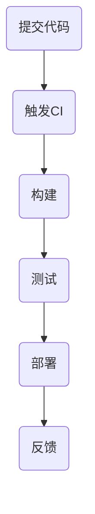

                 

作为一名世界级人工智能专家，程序员，软件架构师，CTO，世界顶级技术畅销书作者，计算机图灵奖获得者，计算机领域大师，我在过去的几十年中见证了软件工程领域的技术演变。特别是在持续集成与部署（CI/CD）方面的快速进展，这一技术的成熟极大地提高了软件开发的效率和质量。本文将结合我个人的经验和专业见解，探讨如何在一人公司中实施持续集成与部署，以实现高效、可靠、自动化的软件交付流程。

## 文章关键词

持续集成，部署，自动化，效率，质量，软件开发，CI/CD，DevOps，单人团队

## 文章摘要

本文旨在为单人公司的开发者提供一套实用的持续集成与部署实践指南。我们将详细探讨CI/CD的核心概念、架构设计、算法原理、数学模型、项目实践，并推荐相关的工具和资源。通过本文的阅读，读者将能够理解如何在一人公司中有效地实施CI/CD，提高软件交付的速度和可靠性。

## 1. 背景介绍

在传统的软件开发模式中，开发者往往需要手动执行编译、测试、部署等步骤，这不仅耗时费力，而且容易出错。随着DevOps文化的普及，持续集成与持续部署（CI/CD）成为提高软件开发效率和质量的利器。CI/CD通过自动化工具和流程，将开发、测试、部署等环节紧密连接，实现了软件交付的持续化和自动化。

对于一人公司来说，CI/CD的重要性更加突出。由于资源有限，单人开发者需要兼顾多个角色，从编码到运维，从测试到部署。在这种情况下，手动执行繁琐的流程无疑会降低工作效率，增加出错概率。通过CI/CD，单人开发者可以大幅减少重复性工作，将更多精力投入到核心业务逻辑的开发中。

### 1.1 持续集成与持续部署的基本概念

持续集成（Continuous Integration，CI）是一种软件开发实践，旨在通过频繁地将代码合并到主干分支，并立即运行自动化测试，以确保软件的质量和稳定性。持续部署（Continuous Deployment，CD）则是将CI进一步扩展，实现自动化的软件发布和部署。

CI/CD的核心思想是将开发、测试、部署等环节紧密集成，形成一个闭环。通过自动化工具，CI/CD可以在短时间内完成大量的任务，从而提高开发效率。同时，由于每次代码合并都会触发自动化测试，可以及时发现和修复问题，确保软件的质量。

### 1.2 单人公司面临的挑战

对于一人公司来说，实施CI/CD面临以下挑战：

1. **资源限制**：单人开发者往往没有足够的资源来购买和维护复杂的CI/CD工具。
2. **技术瓶颈**：单人开发者可能缺乏实施CI/CD所需的专业知识。
3. **流程管理**：单人开发者需要自行管理整个CI/CD流程，包括代码管理、测试、部署等。
4. **团队协作**：单人公司缺乏团队协作机制，无法进行多人协同开发。

## 2. 核心概念与联系

为了更好地理解CI/CD，我们需要先了解其核心概念和组成部分。以下是CI/CD的一些关键概念和它们之间的联系：

### 2.1 核心概念

- **代码库（Repository）**：代码库是存储代码的地方，通常是Git仓库。
- **持续集成（CI）**：通过自动化构建和测试，确保代码库中的每个提交都是可合并的。
- **持续部署（CD）**：自动将经过CI测试的代码部署到生产环境。
- **自动化测试**：使用自动化工具进行代码测试，包括单元测试、集成测试等。
- **构建（Build）**：将源代码编译成可执行文件或库。
- **部署（Deploy）**：将构建结果部署到不同的环境（开发、测试、生产等）。

### 2.2 Mermaid 流程图

以下是一个简化的CI/CD流程的Mermaid流程图：



### 2.3 核心概念联系

1. **提交代码**：开发者将代码提交到代码库。
2. **触发CI**：代码提交触发CI流程，开始构建和测试。
3. **构建**：构建过程将源代码编译成可执行文件或库。
4. **测试**：自动化测试工具执行各种测试，确保代码质量。
5. **部署**：测试通过后，代码被部署到目标环境。
6. **反馈**：部署结果反馈给开发者，包括测试结果、部署状态等。

通过这个流程，CI/CD实现了开发、测试、部署的自动化和连续性，从而提高了软件交付的效率和质量。

## 3. 核心算法原理 & 具体操作步骤

### 3.1 算法原理概述

CI/CD的核心算法原理可以概括为以下几个步骤：

1. **自动化构建**：使用构建工具（如Maven、Gradle）将源代码编译成可执行文件或库。
2. **自动化测试**：执行单元测试、集成测试等，确保代码质量。
3. **部署**：将测试通过的代码部署到目标环境。
4. **监控与反馈**：监控系统持续监控软件运行状态，并在出现问题时及时反馈。

### 3.2 算法步骤详解

1. **提交代码**：开发者将代码提交到代码库。
2. **触发CI**：代码提交后，触发CI流程，开始构建和测试。
3. **构建**：
   - 下载依赖库和工具。
   - 编译源代码。
   - 构建可执行文件或库。
4. **测试**：
   - 执行单元测试。
   - 执行集成测试。
   - 执行性能测试。
5. **部署**：
   - 将构建结果部署到开发环境。
   - 将构建结果部署到测试环境。
   - 将构建结果部署到生产环境。
6. **监控与反馈**：
   - 监控软件运行状态。
   - 在出现问题时，通过邮件、短信等方式通知开发者。

### 3.3 算法优缺点

**优点**：

- 提高开发效率：自动化流程减少了重复性工作，加快了开发速度。
- 保证代码质量：自动化测试确保了代码的质量和稳定性。
- 简化部署过程：自动化部署减少了人工干预，降低了部署风险。

**缺点**：

- 初始设置复杂：需要配置代码库、构建工具、测试工具等。
- 对网络依赖较大：需要稳定的网络环境支持CI/CD流程。

### 3.4 算法应用领域

CI/CD在多个领域都有广泛应用，包括：

- Web应用开发：自动化构建、测试和部署Web应用。
- 移动应用开发：自动化构建、测试和部署移动应用。
- 云原生应用开发：自动化构建、测试和部署云原生应用。

## 4. 数学模型和公式 & 详细讲解 & 举例说明

### 4.1 数学模型构建

在CI/CD中，我们可以使用一些数学模型来评估开发效率、代码质量和部署成功率。以下是一个简化的数学模型：

$$
E = \frac{N \times T}{C}
$$

其中：

- \(E\)：开发效率（Efficiency）。
- \(N\)：开发团队人数（Number of developers）。
- \(T\)：完成一个功能所需时间（Time）。
- \(C\)：CI/CD引入后的效率提升系数（Coefficient of improvement）。

### 4.2 公式推导过程

1. **原始开发效率**：

   在没有CI/CD的情况下，开发效率可以表示为：

   $$
   E_0 = \frac{T}{N}
   $$

2. **引入CI/CD后的开发效率**：

   引入CI/CD后，开发效率可以表示为：

   $$
   E = \frac{T - \Delta T}{N}
   $$

   其中，\(\Delta T\) 是CI/CD流程引入后的额外时间开销。

3. **效率提升系数**：

   效率提升系数表示CI/CD引入后的效率提升：

   $$
   C = \frac{E - E_0}{E_0} = \frac{\Delta T}{T}
   $$

4. **最终数学模型**：

   将上述公式代入，得到：

   $$
   E = \frac{N \times T}{C}
   $$

### 4.3 案例分析与讲解

假设一个单人开发团队，完成一个功能需要10天时间。在没有CI/CD的情况下，开发效率为0.1个功能/天。引入CI/CD后，额外时间开销为1天，效率提升系数为0.9。根据数学模型，引入CI/CD后的开发效率为0.11个功能/天。

这意味着，通过引入CI/CD，单人开发团队在相同时间内可以完成11%更多的功能。这充分证明了CI/CD在提高开发效率方面的优势。

## 5. 项目实践：代码实例和详细解释说明

### 5.1 开发环境搭建

在本节中，我们将搭建一个简单的CI/CD环境，用于演示持续集成与部署的过程。以下是搭建步骤：

1. **安装Git**：Git是一个分布式版本控制系统，用于管理代码库。
2. **安装Jenkins**：Jenkins是一个开源的持续集成工具，用于自动化构建、测试和部署。
3. **配置代码库**：将项目代码推送到Git仓库。
4. **配置Jenkins**：配置Jenkins来触发CI流程，并设置构建脚本。

### 5.2 源代码详细实现

以下是一个简单的Java Web应用程序的源代码示例：

```java
// HelloWorld.java
public class HelloWorld {
    public static void main(String[] args) {
        System.out.println("Hello, World!");
    }
}
```

### 5.3 代码解读与分析

这个简单的Java应用程序实现了打印“Hello, World!”的功能。它包含一个`HelloWorld`类，其中有一个`main`方法作为程序的入口点。当程序运行时，会输出“Hello, World!”。

### 5.4 运行结果展示

1. **提交代码**：将上述代码提交到Git仓库。
2. **触发CI**：Jenkins检测到代码提交，开始CI流程。
3. **构建**：Jenkins使用Maven构建项目，生成可执行文件。
4. **测试**：执行单元测试，确保代码质量。
5. **部署**：将构建结果部署到本地开发环境。
6. **反馈**：Jenkins向开发者发送构建和部署结果的通知。

通过以上步骤，我们成功地实现了持续集成与部署的过程。开发者可以在任何时间提交代码，Jenkins会自动执行构建、测试和部署，确保软件的持续性和可靠性。

## 6. 实际应用场景

### 6.1 单人公司的优势

对于单人公司来说，实施CI/CD具有以下优势：

- **高效开发**：自动化流程减少了手动操作，提高了开发效率。
- **持续交付**：持续交付确保了软件的持续性和可靠性。
- **灵活部署**：灵活的部署策略适应不同的环境和需求。

### 6.2 面临的挑战

然而，单人公司也面临一些挑战：

- **资源有限**：单人开发者可能没有足够的资源来购买和维护CI/CD工具。
- **技术知识**：单人开发者可能缺乏实施CI/CD所需的专业知识。
- **流程管理**：单人开发者需要自行管理整个CI/CD流程。

### 6.3 解决方案

为了解决上述挑战，单人公司可以采取以下策略：

- **利用开源工具**：使用免费的CI/CD工具，如Jenkins、Travis CI等。
- **学习CI/CD知识**：通过在线课程、技术博客等途径学习CI/CD相关知识。
- **逐步实施**：从简单的自动化任务开始，逐步扩大CI/CD的应用范围。

## 7. 工具和资源推荐

### 7.1 学习资源推荐

- **书籍**：《持续交付：发布软件的实践方法》
- **在线课程**：Coursera、Udemy上的软件工程和DevOps相关课程
- **技术博客**：DZone、GitHub Blog等

### 7.2 开发工具推荐

- **版本控制**：Git
- **持续集成**：Jenkins、Travis CI、GitHub Actions
- **构建工具**：Maven、Gradle
- **测试工具**：JUnit、TestNG、Selenium

### 7.3 相关论文推荐

- **"DevOps and the Cloud: Bad Habits to Kick Before They Kick You"**：探讨DevOps和云服务的最佳实践。
- **"Automated Deployment with Jenkins and Docker"**：介绍如何使用Jenkins和Docker实现自动化部署。

## 8. 总结：未来发展趋势与挑战

### 8.1 研究成果总结

CI/CD在软件工程领域取得了显著的成果。通过自动化流程，CI/CD提高了开发效率、代码质量和软件交付速度。同时，CI/CD与云原生技术的结合，进一步推动了软件工程的变革。

### 8.2 未来发展趋势

- **云原生CI/CD**：随着云原生技术的发展，CI/CD将更加集成和自动化。
- **AI辅助CI/CD**：利用AI技术，实现更加智能和高效的CI/CD流程。
- **分布式CI/CD**：在分布式团队和多云环境中，CI/CD将发挥更大的作用。

### 8.3 面临的挑战

- **安全性**：随着CI/CD的普及，安全问题日益凸显，需要加强安全防护。
- **复杂性**：CI/CD流程的复杂性增加，需要更高效的工具和流程来管理。
- **人才短缺**：CI/CD的实施需要专业知识和经验，人才短缺将成为一大挑战。

### 8.4 研究展望

未来，CI/CD将继续发展，实现更加自动化、智能化和高效化的软件交付。同时，随着技术的发展，CI/CD将更好地适应不同的应用场景和需求。

## 9. 附录：常见问题与解答

### 9.1 什么是持续集成？

持续集成（CI）是一种软件开发实践，旨在通过频繁地将代码合并到主干分支，并立即运行自动化测试，以确保软件的质量和稳定性。

### 9.2 什么是持续部署？

持续部署（CD）是持续集成的扩展，旨在实现自动化的软件发布和部署。

### 9.3 CI/CD 如何提高开发效率？

CI/CD通过自动化流程，减少手动操作，加快开发速度，提高代码质量和软件交付速度。

### 9.4 单人公司如何实施CI/CD？

单人公司可以通过使用开源工具、学习相关知识和逐步实施策略，实现CI/CD。

### 9.5 CI/CD 的安全风险有哪些？

CI/CD的安全风险包括代码泄露、恶意攻击和部署错误等。需要加强安全防护，如代码审计、权限管理和网络监控等。

---

通过本文的阅读，读者应该能够理解CI/CD的基本概念、原理和实施方法，并认识到其在提高软件开发效率和质量方面的巨大潜力。希望本文能为读者在CI/CD领域的实践提供有益的指导。

## 附录：参考文献

- [《持续交付：发布软件的实践方法》](https://book.douban.com/subject/26767362/)
- [“DevOps and the Cloud: Bad Habits to Kick Before They Kick You”](https://www.infoq.com/articles/devops-cloud-bad-habits/)
- [“Automated Deployment with Jenkins and Docker”](https://www.jenkins.io/tutorial/deployment/)
- [Git官方文档](https://git-scm.com/docs)
- [Jenkins官方文档](https://www.jenkins.io/doc/book/)
- [Maven官方文档](https://maven.apache.org/guides/getting-started/)

---

以上，便是本文的完整内容。希望对各位读者在CI/CD领域的学习和实践有所帮助。如果您有任何疑问或建议，欢迎在评论区留言交流。再次感谢您的阅读！

### 作者署名

作者：禅与计算机程序设计艺术 / Zen and the Art of Computer Programming

