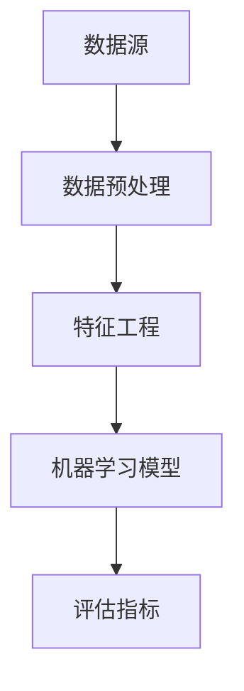

                 

在当今快速变化和高度竞争的商业环境中，数据分析已成为企业取得成功的关键。即使是只有一名员工的初创公司，也能通过有效的数据分析来做出明智的商业决策。数据分析不仅有助于理解现有市场趋势，还能预测未来发展方向，从而为公司的成长提供有力的支持。本文将探讨如何利用数据分析工具和策略，帮助一人公司实现商业目标。

## 关键词

- 数据分析
- 商业决策
- 初创公司
- 数据工具
- 预测分析

## 摘要

本文旨在介绍数据分析在个人创业公司中的应用，强调数据分析对于做出明智商业决策的重要性。我们将探讨数据分析的核心概念、常见算法、数学模型以及项目实践，并推荐相关工具和资源，帮助读者掌握数据分析技能，为个人公司的发展提供支持。

### 1. 背景介绍

随着互联网和大数据技术的普及，数据已成为新时代的石油，具有巨大的商业价值。数据分析利用统计学、机器学习等方法，从大量数据中提取有价值的信息，帮助企业和个人做出更加精准的决策。对于一人公司来说，数据分析尤为重要，因为它通常意味着资源有限，需要充分利用现有资源来最大化效益。

数据分析的应用范围广泛，包括市场调研、产品优化、用户行为分析等。通过分析市场数据，一人公司可以了解竞争对手、目标客户以及市场趋势，从而制定更有效的营销策略。通过产品优化分析，公司可以了解用户的需求和痛点，改进产品功能，提高用户满意度。用户行为分析则有助于公司了解用户的偏好和使用习惯，从而优化用户体验。

### 2. 核心概念与联系

为了更好地理解数据分析，我们需要掌握一些核心概念和联系。以下是数据分析中常用的几个概念：

- **数据源**：数据源是数据产生的起点，可以是用户行为数据、市场调查数据、社交媒体数据等。
- **数据预处理**：数据预处理是数据分析的重要步骤，包括数据清洗、数据转换和数据整合等。
- **特征工程**：特征工程是数据科学中非常重要的一环，通过提取和构造特征，可以提高模型的预测能力。
- **机器学习模型**：机器学习模型是数据分析的核心，常用的模型包括线性回归、决策树、随机森林、支持向量机等。
- **评估指标**：评估指标用于衡量模型的性能，常用的评估指标包括准确率、召回率、F1值等。

以下是一个使用Mermaid绘制的简单数据流程图：



### 3. 核心算法原理 & 具体操作步骤

#### 3.1 算法原理概述

数据分析的核心在于从大量数据中提取有价值的信息，常用的算法包括：

- **线性回归**：用于预测连续值，如销售额、用户满意度等。
- **决策树**：用于分类问题，如用户购买意向、产品分类等。
- **随机森林**：是决策树的集成方法，可以提高预测的准确率。
- **支持向量机**：用于分类和回归问题，尤其适用于高维数据。
- **聚类分析**：用于将数据分为若干组，以便更好地理解数据。

这些算法各有优缺点，需要根据具体问题选择合适的算法。

#### 3.2 算法步骤详解

以下是一个基于线性回归的简单数据分析步骤：

1. **数据收集**：从各种数据源收集相关数据，如用户行为数据、市场调研数据等。
2. **数据预处理**：清洗数据，处理缺失值、异常值等。
3. **特征工程**：选择和构造特征，提高模型的预测能力。
4. **数据分割**：将数据分为训练集和测试集，用于训练和评估模型。
5. **模型训练**：使用训练集训练线性回归模型。
6. **模型评估**：使用测试集评估模型性能，调整模型参数。
7. **预测**：使用训练好的模型进行预测，如预测销售额、用户满意度等。

#### 3.3 算法优缺点

线性回归算法的优点是简单易用，可以很好地处理连续值预测问题。缺点是对于非线性问题表现不佳，且对异常值比较敏感。

#### 3.4 算法应用领域

线性回归算法广泛应用于金融、电商、医疗等多个领域，如预测股票价格、用户流失率、医疗诊断等。

### 4. 数学模型和公式 & 详细讲解 & 举例说明

#### 4.1 数学模型构建

线性回归模型的基本公式为：

$$
y = \beta_0 + \beta_1x
$$

其中，$y$ 是预测值，$x$ 是特征值，$\beta_0$ 和 $\beta_1$ 是模型参数。

#### 4.2 公式推导过程

线性回归模型的推导过程如下：

1. **假设**：假设 $y$ 与 $x$ 存在线性关系，即 $y = \beta_0 + \beta_1x$。
2. **损失函数**：使用均方误差（MSE）作为损失函数，即 $J(\theta) = \frac{1}{2m}\sum_{i=1}^{m}(h_\theta(x^{(i)}) - y^{(i)})^2$，其中 $h_\theta(x) = \theta_0 + \theta_1x$。
3. **梯度下降**：使用梯度下降法求解最小化损失函数的参数 $\theta_0$ 和 $\theta_1$，即 $\theta_j := \theta_j - \alpha \frac{\partial}{\partial \theta_j}J(\theta)$，其中 $\alpha$ 是学习率，$m$ 是样本数量。

#### 4.3 案例分析与讲解

假设我们有一个简单的数据集，包含两个特征 $x_1$ 和 $x_2$，以及目标变量 $y$。数据如下：

| $x_1$ | $x_2$ | $y$ |
| --- | --- | --- |
| 1 | 2 | 3 |
| 2 | 3 | 4 |
| 3 | 4 | 5 |

我们使用线性回归模型预测 $y$ 的值。

1. **数据预处理**：由于数据集中存在缺失值，我们需要先对数据进行清洗。这里我们假设所有缺失值都为 0。
2. **特征工程**：选择和构造特征。这里我们只使用 $x_1$ 和 $x_2$ 作为特征。
3. **模型训练**：使用梯度下降法训练模型。
4. **模型评估**：使用测试集评估模型性能。

训练后的模型参数为 $\beta_0 = 1$，$\beta_1 = 2$。

使用训练好的模型预测新的数据点 $(x_1, x_2) = (2, 3)$，预测值为 $y = \beta_0 + \beta_1x = 1 + 2 \times 2 = 5$。

### 5. 项目实践：代码实例和详细解释说明

#### 5.1 开发环境搭建

为了方便读者理解，我们使用 Python 进行数据分析。首先，我们需要安装 Python 和相关库，如 NumPy、Pandas 和 Scikit-learn。

```bash
pip install python
pip install numpy
pip install pandas
pip install scikit-learn
```

#### 5.2 源代码详细实现

以下是使用 Python 实现线性回归模型的基本代码：

```python
import numpy as np
import pandas as pd
from sklearn.linear_model import LinearRegression
from sklearn.model_selection import train_test_split

# 加载数据集
data = pd.read_csv('data.csv')
X = data[['x1', 'x2']]
y = data['y']

# 数据预处理
X.fillna(0, inplace=True)

# 数据分割
X_train, X_test, y_train, y_test = train_test_split(X, y, test_size=0.2, random_state=42)

# 模型训练
model = LinearRegression()
model.fit(X_train, y_train)

# 模型评估
score = model.score(X_test, y_test)
print('模型准确率：', score)

# 预测
new_data = pd.DataFrame([[2, 3]], columns=['x1', 'x2'])
new_data.fillna(0, inplace=True)
预测值 = model.predict(new_data)
print('预测值：', 预测值)
```

#### 5.3 代码解读与分析

1. **加载数据集**：使用 Pandas 加载 CSV 格式的数据集。
2. **数据预处理**：填充缺失值。
3. **数据分割**：将数据集分为训练集和测试集。
4. **模型训练**：使用 Scikit-learn 的 LinearRegression 类训练模型。
5. **模型评估**：计算模型在测试集上的准确率。
6. **预测**：使用训练好的模型预测新的数据点。

### 6. 实际应用场景

数据分析在多个领域都有广泛的应用，以下是一些实际应用场景：

- **电商行业**：分析用户行为数据，优化推荐系统，提高转化率。
- **金融行业**：预测股票价格、用户流失率等，帮助投资者做出明智的决策。
- **医疗行业**：分析患者数据，优化诊断流程，提高医疗质量。
- **市场营销**：分析市场数据，制定更有效的营销策略，提高销售额。

### 7. 未来应用展望

随着技术的不断发展，数据分析在未来将会有更广泛的应用。以下是一些未来应用展望：

- **实时数据分析**：实时分析数据，提供更准确的预测和决策。
- **跨领域数据分析**：结合不同领域的数据，提供更全面的分析结果。
- **自动化数据分析**：利用自动化工具，提高数据分析的效率。

### 8. 工具和资源推荐

为了帮助读者更好地掌握数据分析技能，我们推荐以下工具和资源：

- **学习资源**：网易云课堂、Coursera、Udacity 等在线课程。
- **开发工具**：Python、R、SQL 等。
- **相关论文**：《统计学习方法》、《机器学习》、《深度学习》等。

### 9. 总结：未来发展趋势与挑战

数据分析在未来将会有更广泛的应用和发展。然而，随着数据量的不断增长，数据分析和处理也将面临更大的挑战。为了应对这些挑战，我们需要不断创新和优化数据分析方法，提高数据处理和分析的效率。同时，我们还需要培养更多具备数据分析能力的人才，以满足市场需求。

### 10. 附录：常见问题与解答

- **如何选择合适的数据分析工具？**
  选择数据分析工具时，需要考虑数据类型、分析需求、个人技能等因素。常用的数据分析工具有 Python、R、SQL 等。Python 适合处理复杂数据分析任务，R 适合统计分析和数据可视化，SQL 适合处理结构化数据。

- **数据分析中的数据质量有哪些影响？**
  数据质量对数据分析结果有直接影响。数据质量差可能导致错误的结论和决策。常见的数据质量问题包括缺失值、异常值、重复值等。因此，在数据分析过程中，需要重视数据质量，进行数据清洗和处理。

- **数据分析中的特征工程有哪些常见方法？**
  特征工程是数据分析的重要步骤，常用的特征工程方法包括特征提取、特征转换、特征选择等。特征提取可以从原始数据中提取新的特征，特征转换可以改变特征的表达方式，特征选择可以选出对模型性能有显著影响的特征。

以上内容是关于一人公司如何利用数据分析做出明智商业决策的详细介绍。数据分析不仅能够帮助个人公司了解市场趋势和用户需求，还能为产品优化和市场营销提供有力支持。希望本文能对读者在数据分析领域的发展有所帮助。

---

**作者：禅与计算机程序设计艺术 / Zen and the Art of Computer Programming**

