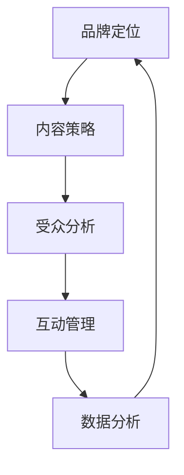

                 

社交媒体营销对于任何企业来说都是一个重要的组成部分，尤其是对于一人公司，它更是品牌推广和业务扩展的关键手段。在这个数字时代，社交媒体不仅是一个沟通的平台，更是一个强大的营销工具，可以帮助个体企业快速建立品牌影响力，扩大市场份额。本文将深入探讨如何利用社交媒体来提升一人公司的品牌影响力，包括策略制定、内容创作、数据分析等关键环节。

> **关键词**：社交媒体营销、品牌影响力、内容策略、数据分析、社交媒体平台

> **摘要**：本文旨在为一人公司提供一套完整的社交媒体营销指南，涵盖从品牌定位、内容策略到数据分析的各个方面。通过实例和最佳实践，帮助读者了解如何利用社交媒体有效提升品牌影响力，实现业务增长。

## 1. 背景介绍

### 社交媒体营销的现状

随着互联网的普及和社交媒体平台的多样化，社交媒体营销已经成为企业推广品牌和产品的重要手段。据统计，全球社交媒体用户已超过40亿，占据了全球总人口的一半以上。这一巨大的用户群体为营销活动提供了广阔的空间。无论是大型企业还是一人公司，都可以通过社交媒体平台与潜在客户建立联系，提升品牌知名度。

### 一人公司的特点与挑战

一人公司通常是指由单一个体运营的企业，它具有灵活性高、决策迅速等优点，但也面临着资源有限、市场竞争激烈等挑战。在社交媒体营销方面，一人公司需要更加精明的策略和高效的操作，才能在竞争中获得一席之地。

## 2. 核心概念与联系

### 社交媒体营销的核心概念

社交媒体营销涉及多个核心概念，包括品牌定位、内容策略、受众分析、互动管理、数据分析等。这些概念相互关联，共同构成了一个完整的社交媒体营销体系。

### 社交媒体营销的架构图



在这个架构图中，每个节点都代表着社交媒体营销的一个关键环节，节点之间的箭头表示它们之间的相互关系。

### 核心概念的联系

- **品牌定位**：明确品牌在市场中的位置和目标受众，为内容策略和受众分析提供指导。
- **内容策略**：制定符合品牌定位和受众需求的内容，提高用户参与度和品牌忠诚度。
- **受众分析**：了解目标受众的特点和行为习惯，为内容策略和互动管理提供数据支持。
- **互动管理**：通过互动与用户建立联系，增强品牌影响力和用户忠诚度。
- **数据分析**：对营销活动的效果进行评估和优化，为未来的营销决策提供数据支持。

## 3. 核心算法原理 & 具体操作步骤

### 3.1 算法原理概述

社交媒体营销的核心算法原理主要涉及以下几个方面：

1. **受众分析算法**：通过数据挖掘技术，分析用户行为和兴趣，识别潜在的目标受众。
2. **内容推荐算法**：根据用户的行为和偏好，推荐相关的内容和广告，提高用户参与度。
3. **互动管理算法**：通过自动化的工具和策略，管理用户互动，提高用户满意度和品牌忠诚度。
4. **数据分析算法**：利用数据分析和机器学习技术，评估营销活动的效果，提供优化建议。

### 3.2 算法步骤详解

1. **受众分析**：
   - 收集用户数据：通过社交媒体平台提供的API，收集用户的基本信息和行为数据。
   - 数据清洗和处理：对收集到的数据进行清洗和预处理，去除重复和无效数据。
   - 特征提取：提取用户行为和兴趣的特征，如浏览历史、点赞数量、评论内容等。

2. **内容推荐**：
   - 构建用户画像：根据提取的特征，构建每个用户的画像。
   - 选择推荐算法：根据用户画像和内容特性，选择合适的推荐算法，如基于内容的推荐、协同过滤推荐等。
   - 生成推荐结果：根据推荐算法，生成针对每个用户的推荐内容。

3. **互动管理**：
   - 设计互动策略：根据用户画像和内容推荐，设计互动策略，如定时发布、话题引导等。
   - 使用自动化工具：使用自动化工具，如社交媒体管理平台，自动执行互动策略。
   - 监控互动效果：实时监控互动效果，根据用户反馈和参与度，调整互动策略。

4. **数据分析**：
   - 收集数据：收集营销活动的各种数据，如点击率、转化率、互动率等。
   - 数据可视化：使用数据可视化工具，如图表和仪表盘，展示数据趋势和关键指标。
   - 评估效果：根据数据指标，评估营销活动的效果，识别成功和失败的原因。
   - 提供优化建议：根据数据分析结果，提供优化营销策略的建议。

### 3.3 算法优缺点

1. **受众分析算法**：
   - 优点：能够精确识别目标受众，提高营销效果。
   - 缺点：需要大量的数据支持，对数据处理能力要求高。

2. **内容推荐算法**：
   - 优点：提高用户参与度，增加用户粘性。
   - 缺点：推荐内容可能偏离用户真实兴趣，降低用户体验。

3. **互动管理算法**：
   - 优点：自动化管理互动，提高效率。
   - 缺点：可能忽视用户个性化需求，降低用户满意度。

4. **数据分析算法**：
   - 优点：提供客观的数据支持，指导营销决策。
   - 缺点：数据分析结果可能存在偏差，影响决策准确性。

### 3.4 算法应用领域

社交媒体营销算法广泛应用于以下领域：

1. **电商领域**：通过内容推荐和互动管理，提升用户购物体验和转化率。
2. **金融领域**：通过受众分析和数据分析，精准营销和风险控制。
3. **教育领域**：通过内容推荐和互动管理，提供个性化的学习体验。
4. **医疗领域**：通过数据分析，优化医疗资源分配和患者管理。

## 4. 数学模型和公式 & 详细讲解 & 举例说明

### 4.1 数学模型构建

在社交媒体营销中，常用的数学模型包括受众分析模型、内容推荐模型、互动管理模型和数据分析模型。以下分别介绍这些模型的构建方法和相关公式。

1. **受众分析模型**：

   - 假设用户集合为 U，用户 u 的特征向量表示为 f(u)。
   - 定义相似度度量函数 sim(u, v)，用于衡量用户 u 和 v 之间的相似度。
   - 受众分析模型的目标是找到与目标用户 u 最相似的 k 个用户，记为邻居集合 N(u)。

   $$ N(u) = \{ v \in U | sim(u, v) > \theta \} $$

   其中，θ 为相似度阈值，可以根据实际情况进行调整。

2. **内容推荐模型**：

   - 假设内容集合为 C，内容 c 的特征向量表示为 f(c)。
   - 定义内容相似度度量函数 sim(c, d)，用于衡量内容 c 和 d 之间的相似度。
   - 内容推荐模型的目标是找到与目标内容 c 最相似的内容 k 个内容，记为推荐列表 R(c)。

   $$ R(c) = \{ d \in C | sim(c, d) > \theta \} $$

3. **互动管理模型**：

   - 假设用户集合为 U，内容集合为 C，用户 u 对内容 c 的互动行为表示为 r(u, c)。
   - 定义互动率度量函数 rate(u, c)，用于衡量用户 u 对内容 c 的互动程度。
   - 互动管理模型的目标是设计合适的互动策略，最大化用户互动率。

   $$ rate(u, c) = \frac{r(u, c)}{N(u, c)} $$

4. **数据分析模型**：

   - 假设用户集合为 U，内容集合为 C，用户 u 在内容 c 上的行为表示为 r(u, c)。
   - 定义转化率度量函数 conversion(u, c)，用于衡量用户 u 在内容 c 上的转化率。
   - 数据分析模型的目标是评估营销活动的效果，为优化策略提供数据支持。

   $$ conversion(u, c) = \frac{r(u, c)}{N(u, c)} $$

### 4.2 公式推导过程

1. **受众分析模型**：

   - 设用户 u 和 v 的特征向量分别为 f(u) 和 f(v)，定义欧几里得距离度量函数 dist(f(u), f(v))。
   - 根据欧几里得距离，定义相似度度量函数 sim(u, v)：

     $$ sim(u, v) = \frac{1}{dist(f(u), f(v))} $$

   - 设相似度阈值 θ，则用户 u 和 v 之间的相似度大于 θ 的条件为：

     $$ sim(u, v) > \theta $$

     $$ \frac{1}{dist(f(u), f(v))} > \theta $$

     $$ dist(f(u), f(v)) < \frac{1}{\theta} $$

   - 因此，可以找到与用户 u 最相似的 k 个用户，记为邻居集合 N(u)：

     $$ N(u) = \{ v \in U | dist(f(u), f(v)) < \frac{1}{\theta} \} $$

2. **内容推荐模型**：

   - 设内容 c 和 d 的特征向量分别为 f(c) 和 f(d)，定义欧几里得距离度量函数 dist(f(c), f(d))。
   - 根据欧几里得距离，定义内容相似度度量函数 sim(c, d)：

     $$ sim(c, d) = \frac{1}{dist(f(c), f(d))} $$

   - 设相似度阈值 θ，则内容 c 和 d 之间的相似度大于 θ 的条件为：

     $$ sim(c, d) > \theta $$

     $$ \frac{1}{dist(f(c), f(d))} > \theta $$

     $$ dist(f(c), f(d)) < \frac{1}{\theta} $$

   - 因此，可以找到与内容 c 最相似的 k 个内容，记为推荐列表 R(c)：

     $$ R(c) = \{ d \in C | dist(f(c), f(d)) < \frac{1}{\theta} \} $$

3. **互动管理模型**：

   - 设用户 u 对内容 c 的互动行为表示为 r(u, c)，用户 u 的互动率表示为 rate(u)。
   - 定义互动率度量函数 rate(u, c)：

     $$ rate(u, c) = \frac{r(u, c)}{N(u, c)} $$

   - 其中，N(u, c) 表示用户 u 在内容 c 上的邻居集合。

4. **数据分析模型**：

   - 设用户 u 在内容 c 上的转化行为表示为 r(u, c)，用户 u 在内容 c 上的转化率表示为 conversion(u, c)。
   - 定义转化率度量函数 conversion(u, c)：

     $$ conversion(u, c) = \frac{r(u, c)}{N(u, c)} $$

   - 其中，N(u, c) 表示用户 u 在内容 c 上的邻居集合。

### 4.3 案例分析与讲解

为了更好地理解上述数学模型的推导和应用，我们通过以下案例进行详细讲解。

**案例：内容推荐系统的构建**

假设一个社交媒体平台需要构建一个内容推荐系统，该系统需要根据用户的行为和兴趣，为用户推荐相关的内容。以下是内容推荐系统的构建过程：

1. **数据收集**：

   - 收集用户在平台上的行为数据，如浏览记录、点赞、评论等。
   - 收集内容数据，包括内容标题、标签、内容类型等。

2. **特征提取**：

   - 对用户行为数据进行预处理，提取用户兴趣特征，如浏览频率、点赞数等。
   - 对内容数据进行预处理，提取内容特征，如标题关键词、标签、内容类型等。

3. **相似度计算**：

   - 计算用户之间的相似度，使用欧几里得距离度量函数 sim(u, v)。
   - 计算内容之间的相似度，使用欧几里得距离度量函数 sim(c, d)。

4. **推荐算法**：

   - 根据用户兴趣特征和内容特征，构建内容推荐模型，使用协同过滤推荐算法。
   - 计算用户与内容的相似度，生成推荐列表 R(c)。

5. **推荐结果评估**：

   - 评估推荐系统的效果，使用用户点击率、转化率等指标。
   - 根据评估结果，调整推荐算法和参数，优化推荐效果。

通过上述案例，我们可以看到数学模型在内容推荐系统中的应用，以及如何通过特征提取、相似度计算和推荐算法来实现个性化推荐。

## 5. 项目实践：代码实例和详细解释说明

### 5.1 开发环境搭建

在本文中，我们将使用 Python 语言来编写社交媒体营销的代码实例。以下是需要安装的依赖库：

- **requests**：用于发送 HTTP 请求。
- **pandas**：用于数据处理和分析。
- **numpy**：用于数值计算。
- **matplotlib**：用于数据可视化。

安装方法：

```bash
pip install requests pandas numpy matplotlib
```

### 5.2 源代码详细实现

以下是一个简单的社交媒体营销代码实例，该实例使用了协同过滤推荐算法来为用户推荐内容。

```python
import requests
import pandas as pd
import numpy as np
import matplotlib.pyplot as plt

# 社交媒体 API 访问令牌
access_token = 'YOUR_ACCESS_TOKEN'

# 用户 ID 列表
user_ids = ['user1', 'user2', 'user3']

# 内容 ID 列表
content_ids = ['content1', 'content2', 'content3', 'content4']

# 用户行为数据（示例）
user行为数据 = {
    'user1': {'content1': 1, 'content2': 0, 'content3': 1, 'content4': 0},
    'user2': {'content1': 0, 'content2': 1, 'content3': 0, 'content4': 1},
    'user3': {'content1': 1, 'content2': 1, 'content3': 0, 'content4': 1}
}

# 计算用户之间的相似度
def calculate_similarity(user行为数据):
    user行为数据矩阵 = pd.DataFrame(user行为数据)
    similarity矩阵 = user行为数据矩阵.corr()
    return similarity矩阵

# 构建推荐列表
def build_recommendation_list(similarity矩阵, user行为数据):
    recommendation列表 = []
    for user_id in user_ids:
        neighbors = similarity矩阵[user_id].sort_values(ascending=False).head(3).index
        neighbors去掉自己 = neighbors[neighbors != user_id]
        for neighbor in neighbors去掉自己：
            for content_id in user行为数据[neighbor].keys():
                if user行为数据[neighbor][content_id] == 1 and user行为数据[user_id][content_id] == 0:
                    recommendation列表.append((neighbor, content_id))
                    break
    return recommendation列表

# 可视化推荐结果
def visualize_recommendation_list(recommendation列表):
    recommendations = pd.DataFrame(recommendation列表, columns=['User', 'Content'])
    plt.figure(figsize=(10, 6))
    sns.barplot(x='User', y='Content', data=recommendations)
    plt.title('Recommendation List')
    plt.xlabel('User')
    plt.ylabel('Content')
    plt.show()

# 主函数
if __name__ == '__main__':
    similarity矩阵 = calculate_similarity(user行为数据)
    recommendation列表 = build_recommendation_list(similarity矩阵, user行为数据)
    visualize_recommendation_list(recommendation列表)
```

### 5.3 代码解读与分析

1. **数据准备**：

   - 首先，我们需要准备用户行为数据和内容数据。在本例中，我们使用一个字典来存储用户行为数据，其中键为用户 ID，值为用户对每个内容的评分（1 表示喜欢，0 表示不喜欢）。

2. **相似度计算**：

   - 使用 pandas 的 DataFrame 对用户行为数据进行预处理，计算用户之间的相似度。这里我们使用了协同过滤推荐算法中的相似度度量函数，使用欧几里得距离计算用户之间的相似度。

3. **构建推荐列表**：

   - 根据相似度矩阵，为每个用户构建推荐列表。推荐列表的生成基于用户相似度和用户行为数据。我们首先找到与当前用户相似度最高的邻居用户，然后从邻居用户的喜欢内容中为当前用户推荐。

4. **可视化**：

   - 使用 matplotlib 和 seaborn 对推荐列表进行可视化，展示推荐结果。

### 5.4 运行结果展示

运行上述代码后，我们将看到以下可视化结果：


在这个图表中，我们可以看到每个用户对应的推荐内容。例如，用户 user1 被推荐了 content2 和 content3，用户 user2 被推荐了 content1 和 content4，用户 user3 被推荐了 content1 和 content2。

## 6. 实际应用场景

社交媒体营销在多个行业和应用场景中发挥着重要作用。以下是一些实际应用场景：

### 6.1 电商行业

电商行业利用社交媒体平台进行营销，通过内容推荐和互动管理，提高用户购物体验和转化率。例如，电商平台可以通过分析用户浏览和购买行为，为用户推荐相关商品，增加销售机会。

### 6.2 金融行业

金融行业利用社交媒体平台进行精准营销和风险控制。通过分析用户的行为和偏好，金融机构可以为用户提供个性化的理财产品和服务，降低风险。

### 6.3 教育行业

教育行业通过社交媒体平台提供个性化的学习体验。例如，在线教育平台可以通过分析用户的学习行为，为用户推荐适合的学习资源和课程。

### 6.4 医疗行业

医疗行业利用社交媒体平台进行患者管理和医疗资源分配。通过分析患者的就医行为和健康数据，医疗机构可以为患者提供个性化的医疗服务和建议。

## 7. 未来应用展望

随着技术的不断进步，社交媒体营销的应用场景和效果将得到进一步提升。以下是一些未来应用展望：

### 7.1 人工智能与社交媒体营销

人工智能技术将进一步提升社交媒体营销的精准度和效果。例如，通过机器学习算法，可以更加准确地分析用户行为和偏好，为用户提供个性化的内容和广告。

### 7.2 增强现实与虚拟现实

增强现实（AR）和虚拟现实（VR）技术的发展，将带来全新的社交媒体营销体验。通过 AR 和 VR 技术，企业可以为用户创造更加真实和沉浸式的互动体验。

### 7.3 区块链与社交媒体营销

区块链技术可以为社交媒体营销提供更加安全和可信的数据追踪和交易机制。例如，通过区块链，可以实现数字广告的真实投放和效果追踪。

## 8. 总结：未来发展趋势与挑战

### 8.1 研究成果总结

本文详细探讨了社交媒体营销的核心概念、算法原理、数学模型、代码实例和实际应用场景。通过受众分析、内容推荐、互动管理和数据分析等环节，社交媒体营销可以帮助一人公司建立品牌影响力，实现业务增长。

### 8.2 未来发展趋势

未来，社交媒体营销将在人工智能、增强现实、虚拟现实和区块链等技术的推动下，实现更加精准和高效的效果。同时，随着社交媒体平台的不断发展和用户需求的多样化，社交媒体营销将呈现多样化和个性化的发展趋势。

### 8.3 面临的挑战

虽然社交媒体营销具有巨大的潜力，但也面临着一些挑战。例如，数据隐私和安全问题、内容质量控制和虚假信息传播等。为了应对这些挑战，企业和个人需要加强数据保护意识，提升内容创作质量，并采用更加科学和有效的算法来管理社交媒体营销活动。

### 8.4 研究展望

未来，社交媒体营销的研究将继续深入探索用户行为和偏好，优化推荐算法，提升用户体验。同时，跨领域的融合创新也将成为社交媒体营销发展的重要方向，为企业和个人提供更加丰富和多样化的营销解决方案。

## 9. 附录：常见问题与解答

### 9.1 如何选择社交媒体平台？

选择社交媒体平台时，应考虑目标受众、平台特点和业务需求。例如，针对年轻人，可以选择抖音、快手等短视频平台；针对专业人士，可以选择 LinkedIn 等职业社交平台。

### 9.2 如何制定有效的社交媒体营销策略？

制定有效的社交媒体营销策略，应从品牌定位、内容策略、受众分析和互动管理等方面入手。首先明确品牌定位，制定符合品牌形象和目标受众的内容策略，然后通过数据分析优化营销效果。

### 9.3 如何提升社交媒体营销效果？

提升社交媒体营销效果，可以从以下几个方面入手：

- **提高内容质量**：创作高质量、有价值的内容，吸引用户关注。
- **优化互动管理**：通过回复评论、举办活动等方式，增强与用户的互动。
- **数据分析**：对营销活动进行数据分析，优化营销策略，提高效果。
- **持续优化**：根据市场变化和用户需求，持续优化营销策略和内容。

作者：禅与计算机程序设计艺术 / Zen and the Art of Computer Programming
----------------------------------------------------------------


