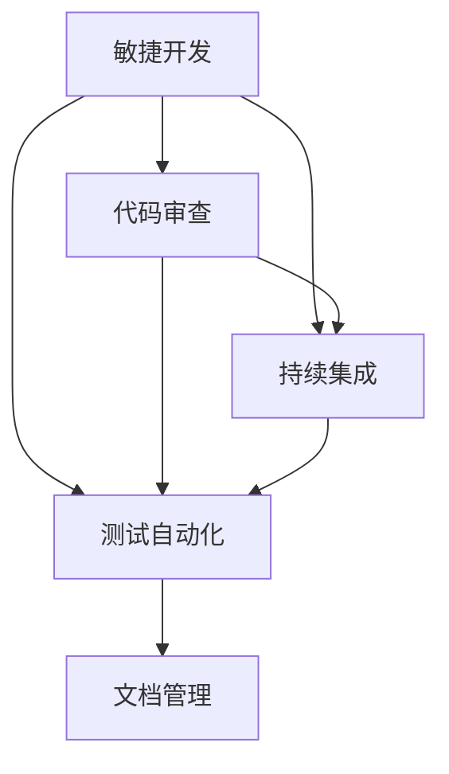

                 

关键词：一人公司、质量控制、持续改进、敏捷开发、代码审查、持续集成、测试自动化、文档管理

> 摘要：本文将探讨一人公司如何建立有效的质量控制体系，并通过持续改进实现产品质量的提升。文章涵盖了敏捷开发方法、代码审查、持续集成、测试自动化和文档管理等方面，提供了具体的实践方法和工具推荐。

## 1. 背景介绍

在当今快速发展的技术环境中，一人公司越来越普遍。这种公司形式具有灵活性、高效性和快速响应市场变化的优势。然而，对于一人公司来说，建立和维护高质量的产品成为了一项挑战。本文旨在帮助一人公司的开发者建立有效的质量控制体系，并通过持续改进来提高产品的质量。

### 1.1 质量控制的重要性

质量控制是确保产品满足用户需求、功能和性能标准的过程。它有助于减少缺陷、降低维护成本，并提高客户满意度。对于一人公司，质量控制尤为重要，因为它通常缺乏大型团队的支持，需要更高效的流程来确保产品的高质量。

### 1.2 持续改进的必要性

持续改进是一种不断寻求和实施改进的方法，它有助于提高产品的质量、效率和竞争力。对于一人公司，持续改进不仅能够提高产品质量，还能帮助开发者不断学习和成长，以适应快速变化的技术和市场环境。

## 2. 核心概念与联系

为了建立有效的质量控制体系，我们需要了解几个关键概念，包括敏捷开发、代码审查、持续集成、测试自动化和文档管理。以下是一个简化的 Mermaid 流程图，展示了这些概念之间的联系。



### 2.1 敏捷开发

敏捷开发是一种以人为核心、迭代和灵活的软件开发方法。它强调团队合作、客户参与和快速响应变化。敏捷开发有助于缩短开发周期、提高质量和客户满意度。

### 2.2 代码审查

代码审查是一种在软件开发过程中，由其他开发人员对代码进行审查和评估的方法。它有助于发现潜在的错误和缺陷，提高代码质量和可维护性。

### 2.3 持续集成

持续集成是一种将代码定期合并到主干分支的过程，以便快速发现和解决集成问题。它有助于确保代码库的一致性和稳定性。

### 2.4 测试自动化

测试自动化是使用工具和脚本自动执行测试的过程。它有助于提高测试效率、减少人工错误并确保产品质量。

### 2.5 文档管理

文档管理是一种记录和跟踪项目文档的方法。它有助于确保项目的透明性和可追溯性，提高开发效率。

## 3. 核心算法原理 & 具体操作步骤

### 3.1 算法原理概述

质量控制体系的核心在于如何有效地实施各种方法，以确保产品质量。以下是几个关键算法原理和具体操作步骤：

### 3.2 算法步骤详解

#### 3.2.1 敏捷开发

1. **需求分析**：与客户沟通，了解需求。
2. **迭代开发**：分阶段实现需求。
3. **定期回顾**：评估开发过程和产品质量。

#### 3.2.2 代码审查

1. **选择评审人员**：选择有经验的开发人员。
2. **审查代码**：检查代码风格、逻辑和性能。
3. **反馈与改进**：针对发现的问题提出改进建议。

#### 3.2.3 持续集成

1. **配置持续集成工具**：如 Jenkins、GitLab CI。
2. **编写集成脚本**：自动化构建和测试。
3. **监控构建结果**：及时发现并解决集成问题。

#### 3.2.4 测试自动化

1. **编写测试用例**：覆盖关键功能和边界条件。
2. **选择测试工具**：如 Selenium、JUnit。
3. **执行测试**：自动化运行测试用例。

#### 3.2.5 文档管理

1. **创建项目文档**：如设计文档、用户手册。
2. **使用版本控制系统**：如 Git。
3. **跟踪文档更新**：确保文档与代码库同步。

### 3.3 算法优缺点

#### 3.3.1 敏捷开发

**优点**：提高开发效率、客户满意度、团队合作。

**缺点**：可能导致需求变更频繁、项目管理复杂。

#### 3.3.2 代码审查

**优点**：提高代码质量、减少缺陷。

**缺点**：增加开发时间、对评审人员要求高。

#### 3.3.3 持续集成

**优点**：快速发现集成问题、提高代码库一致性。

**缺点**：配置和维护较复杂、可能导致构建时间较长。

#### 3.3.4 测试自动化

**优点**：提高测试效率、减少人工错误。

**缺点**：编写和维护测试用例需要时间、可能无法覆盖所有场景。

#### 3.3.5 文档管理

**优点**：提高项目透明性、方便文档更新。

**缺点**：需要定期维护和更新文档。

### 3.4 算法应用领域

这些算法原理广泛应用于一人公司的软件开发过程，尤其适用于快速迭代、需求变化频繁的项目。通过有效实施这些方法，一人公司可以确保产品的质量、提高开发效率，并在竞争激烈的市场中脱颖而出。

## 4. 数学模型和公式 & 详细讲解 & 举例说明

### 4.1 数学模型构建

质量控制体系中的数学模型主要包括缺陷率、代码复杂度、测试覆盖率等指标。以下是这些指标的数学模型：

#### 4.1.1 缺陷率

$$
缺陷率 = \frac{缺陷数量}{代码行数}
$$

#### 4.1.2 代码复杂度

$$
代码复杂度 = \frac{条件分支数 + 循环数}{代码行数}
$$

#### 4.1.3 测试覆盖率

$$
测试覆盖率 = \frac{测试用例数量}{所有可能执行路径数量}
$$

### 4.2 公式推导过程

#### 4.2.1 缺陷率

缺陷率是衡量代码质量的重要指标。它表示每行代码中存在的缺陷数量。通过统计数据，我们可以计算出代码库中的缺陷率。

#### 4.2.2 代码复杂度

代码复杂度反映了代码的可读性和可维护性。它通过计算条件分支数和循环数的总和，并与代码行数相除得到。

#### 4.2.3 测试覆盖率

测试覆盖率表示测试用例覆盖的代码路径比例。它通过计算测试用例数量与所有可能执行路径数量的比值得到。

### 4.3 案例分析与讲解

假设一个项目包含 1000 行代码，其中存在 10 个缺陷。根据缺陷率的数学模型，缺陷率为：

$$
缺陷率 = \frac{10}{1000} = 0.01
$$

假设代码中包含 20 个条件分支和 10 个循环，根据代码复杂度的数学模型，代码复杂度为：

$$
代码复杂度 = \frac{20 + 10}{1000} = 0.03
$$

假设项目中有 50 个测试用例，所有可能执行路径数量为 100，根据测试覆盖率的数学模型，测试覆盖率为：

$$
测试覆盖率 = \frac{50}{100} = 0.5
$$

通过这些数据，我们可以评估项目的质量。例如，缺陷率较低表明代码质量较好，而测试覆盖率较高则表明测试用例覆盖了更多的代码路径。

## 5. 项目实践：代码实例和详细解释说明

### 5.1 开发环境搭建

在本案例中，我们将使用 Python 作为开发语言，并搭建一个简单的 Web 应用程序。以下是搭建开发环境的步骤：

1. 安装 Python 3.8 或更高版本。
2. 安装虚拟环境工具，如 virtualenv。
3. 创建虚拟环境并激活。
4. 安装 Flask 框架和其他依赖库。

```bash
pip install flask
```

### 5.2 源代码详细实现

以下是使用 Flask 框架实现的简单 Web 应用程序的代码：

```python
from flask import Flask, jsonify

app = Flask(__name__)

@app.route('/api/data', methods=['GET'])
def get_data():
    data = {'name': 'Example', 'version': '1.0'}
    return jsonify(data)

if __name__ == '__main__':
    app.run(debug=True)
```

### 5.3 代码解读与分析

1. **Flask 框架**：Flask 是一个轻量级的 Web 框架，易于使用和扩展。

2. **路由和视图函数**：`@app.route('/api/data', methods=['GET'])` 装饰器定义了一个路由，用于处理 `/api/data` 路径的 GET 请求。`get_data` 函数是视图函数，用于处理请求并返回 JSON 数据。

3. **JSON 数据返回**：使用 `jsonify` 函数将字典数据转换为 JSON 格式，方便前端读取。

### 5.4 运行结果展示

1. 启动 Web 应用程序。

```bash
python app.py
```

2. 使用浏览器访问 `http://localhost:5000/api/data`，查看返回结果：

```json
{
    "name": "Example",
    "version": "1.0"
}
```

## 6. 实际应用场景

一人公司可以使用本文提供的方法和工具，建立有效的质量控制体系，并在实际项目中应用。以下是一些实际应用场景：

1. **敏捷开发**：快速响应客户需求，提高产品质量。
2. **代码审查**：确保代码质量和可维护性，减少缺陷。
3. **持续集成**：提高代码库一致性，快速发现和解决集成问题。
4. **测试自动化**：提高测试效率，确保产品质量。
5. **文档管理**：记录项目进展和变更，提高项目透明性。

## 7. 工具和资源推荐

为了帮助一人公司建立和完善质量控制体系，以下是一些工具和资源的推荐：

### 7.1 学习资源推荐

1. **《敏捷软件开发：实践指南》**：提供了敏捷开发的详细方法和实践。
2. **《代码大全》**：介绍了代码审查和代码质量的最佳实践。
3. **《测试驱动的开发》**：介绍了测试自动化和测试驱动开发的方法。

### 7.2 开发工具推荐

1. **Jenkins**：持续集成和自动化测试工具。
2. **Selenium**：Web 应用程序自动化测试工具。
3. **GitLab**：代码审查和持续集成工具。

### 7.3 相关论文推荐

1. **《敏捷软件开发：原则、实践与模式》**
2. **《持续集成：从理论到实践》**
3. **《自动化测试：最佳实践》**

## 8. 总结：未来发展趋势与挑战

### 8.1 研究成果总结

本文探讨了如何在一人公司中建立有效的质量控制体系，并介绍了敏捷开发、代码审查、持续集成、测试自动化和文档管理等方面的方法和工具。这些方法和工具有助于提高产品质量、开发效率和市场竞争力。

### 8.2 未来发展趋势

1. **人工智能**：将 AI 技术应用于质量控制，如代码审查、缺陷预测等。
2. **自动化**：进一步自动化测试和部署过程，提高开发效率。
3. **云计算**：利用云计算资源进行开发和测试，降低成本。

### 8.3 面临的挑战

1. **资源限制**：一人公司通常资源有限，需要更高效的流程和工具。
2. **技能要求**：需要开发者具备多方面的技能，如敏捷开发、自动化测试等。

### 8.4 研究展望

未来的研究可以关注如何更好地利用人工智能和云计算等新技术，提高质量控制体系的效率和效果。同时，研究如何帮助开发者更好地掌握多种技能，以应对不断变化的技术和市场环境。

## 9. 附录：常见问题与解答

### 9.1 如何选择代码审查工具？

选择代码审查工具时，可以考虑以下因素：

1. **支持的语言和平台**：确保工具支持您的开发语言和平台。
2. **审查流程**：选择适合您团队的审查流程，如 Pull Request、Git 提交等。
3. **用户界面**：选择界面友好、易于使用的工具。

### 9.2 持续集成和持续部署有什么区别？

持续集成（CI）是将代码定期合并到主干分支，以便快速发现和解决集成问题。持续部署（CD）是将代码部署到生产环境，包括构建、测试和部署等过程。简单来说，CI 是 CD 的前置条件，CD 是 CI 的后续过程。

### 9.3 如何提高测试覆盖率？

提高测试覆盖率的方法包括：

1. **编写更多测试用例**：覆盖更多的功能和边界条件。
2. **使用代码覆盖率工具**：如 JaCoCo，分析代码的测试覆盖率。
3. **重构代码**：优化代码结构，使其更易于测试。

### 9.4 如何管理项目文档？

管理项目文档的方法包括：

1. **使用版本控制系统**：如 Git，跟踪文档的变更和版本。
2. **创建文档模板**：使用统一的文档模板，提高文档质量和可读性。
3. **定期更新文档**：确保文档与项目进展同步，提高文档的准确性。

---

作者：禅与计算机程序设计艺术 / Zen and the Art of Computer Programming


