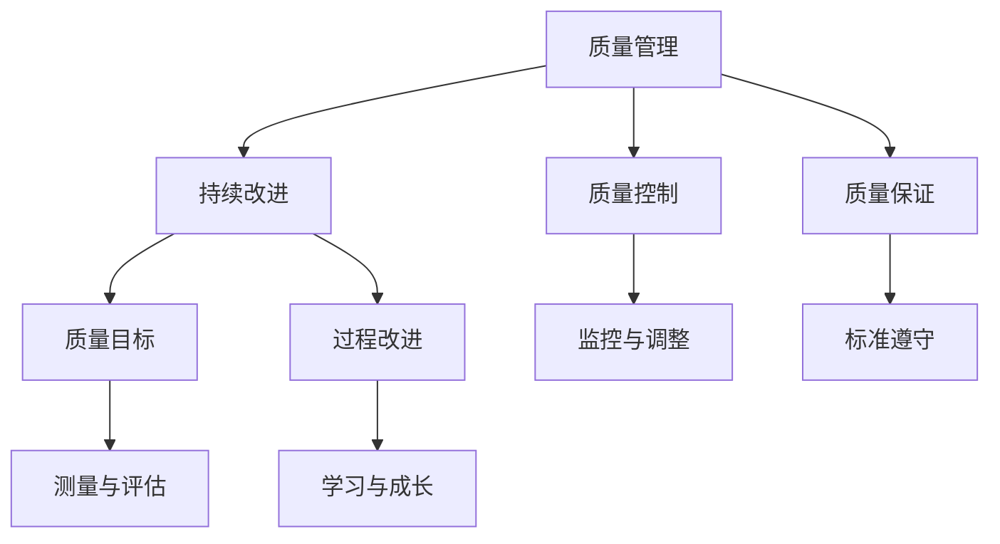

                 

### 1. 背景介绍

随着信息技术的发展，独立开发者和小型科技公司越来越受到关注。这种趋势不仅促进了创新和灵活性，还提供了更广阔的职业发展机会。然而，对于这些小规模团队或一人公司而言，质量管理（Quality Management）和持续改进（Continuous Improvement）是确保产品和服务的成功关键。

在传统的企业环境中，质量管理和持续改进通常由一个专门的质量管理部门负责，并由一个庞大的团队执行。但是，对于一人公司或小型团队来说，这往往是不切实际的。在这种情况下，个体开发者或团队领导者需要自行承担起质量管理和持续改进的重任。

本文将探讨一人公司在质量管理与持续改进方面的挑战，并提供实用的方法和策略。我们将深入讨论如何制定明确的质量目标、如何进行有效的质量监控、以及如何利用持续改进方法来不断提升产品和服务质量。

### 2. 核心概念与联系

在讨论质量管理与持续改进之前，我们需要理解几个核心概念，这些概念相互关联，共同构成了一个完整的质量管理框架。

#### 2.1 质量管理（Quality Management）

质量管理是指确保产品或服务满足特定标准和客户需求的一系列活动和过程。它包括计划、控制、保证和改进质量。

#### 2.2 持续改进（Continuous Improvement）

持续改进是指不断寻求和实施改进措施，以提升产品、服务和过程的质量。这是一种企业文化，强调不断学习和创新。

#### 2.3 质量控制（Quality Control）

质量控制是质量管理的一部分，旨在通过监控和调整过程来确保产品或服务符合预定的质量标准。

#### 2.4 质量保证（Quality Assurance）

质量保证是质量管理的一部分，旨在确保所有质量活动和过程都按照预定标准进行。

#### 2.5 质量目标（Quality Objectives）

质量目标是组织在质量方面追求的具体成果，通常是量化的和可测量的。

#### 2.6 Mermaid 流程图（Mermaid Flowchart）

为了更好地理解这些概念之间的关系，我们可以使用 Mermaid 流程图来展示它们。以下是 Mermaid 流程图的示例：



通过这个流程图，我们可以清晰地看到质量管理、持续改进、质量控制和质量保证之间的紧密联系，以及它们如何共同推动质量目标的实现。

### 3. 核心算法原理 & 具体操作步骤

在质量管理与持续改进中，核心算法原理是确保产品和过程质量的关键。以下将概述核心算法原理，并详细描述具体操作步骤。

#### 3.1 算法原理概述

质量管理与持续改进的核心算法基于以下几个基本原理：

1. **PDCA 循环**（Plan-Do-Check-Act）：这是一种持续改进的方法，通过计划、执行、检查和行动四个阶段来不断优化过程。
2. **六西格玛（Six Sigma）**：这是一种统计学方法，用于识别和消除过程中的缺陷，以实现更高的质量水平。
3. **因果图（Fishbone Diagram）**：这是一种用于分析问题的根本原因的图表，有助于确定改进的方向。

#### 3.2 算法步骤详解

1. **PDCA 循环**

   - **计划（Plan）**：确定改进目标、制定策略和分配资源。
   - **执行（Do）**：执行计划，并收集数据。
   - **检查（Check）**：分析结果，并与目标进行比较。
   - **行动（Act）**：根据分析结果采取行动，包括改进措施和标准更新。

2. **六西格玛**

   - **定义（Define）**：明确项目目标和范围。
   - **测量（Measure）**：收集和记录数据。
   - **分析（Analyze）**：分析数据，确定关键因素和关系。
   - **改进（Improve）**：实施改进措施，优化过程。
   - **控制（Control）**：建立监控和反馈机制，确保改进得以持续。

3. **因果图**

   - **收集数据**：收集关于问题的信息。
   - **绘制因果图**：根据收集到的信息，绘制因果图，展示问题与潜在原因之间的关系。
   - **分析因果图**：分析因果图，确定主要因素和改进方向。

#### 3.3 算法优缺点

- **PDCA 循环**：优点是简单易用，适用于各种规模的组织和问题。缺点是可能需要较长时间才能看到显著改进。
- **六西格玛**：优点是能够显著提高过程质量和效率，适用于复杂的问题。缺点是需要较高的统计学知识和技能。
- **因果图**：优点是直观易理解，有助于识别问题根本原因。缺点是可能过于简单，无法涵盖所有复杂因素。

#### 3.4 算法应用领域

这些算法原理广泛应用于各种领域，包括制造业、服务业、信息技术等。一人公司或小型团队可以根据自身情况选择适合的方法进行应用。

### 4. 数学模型和公式 & 详细讲解 & 举例说明

在质量管理与持续改进中，数学模型和公式是分析和优化过程的重要工具。以下将介绍几个常用的数学模型和公式，并提供详细讲解和举例说明。

#### 4.1 数学模型构建

- **质量控制模型**：用于衡量产品或过程的质量水平。
- **统计过程控制（SPC）模型**：用于监控和调整过程，确保过程稳定性。

#### 4.2 公式推导过程

- **质量控制模型**：

  $$\text{质量控制模型} = \frac{\text{合格品数量}}{\text{总产品数量}}$$

- **统计过程控制（SPC）模型**：

  $$\text{控制限} = \mu \pm 3\sigma$$

  其中，$\mu$ 是过程平均值，$\sigma$ 是过程标准差。

#### 4.3 案例分析与讲解

以下是一个质量控制模型的例子：

**案例**：一家一人公司生产了一种新型电子产品，每月生产1000台。经过质量检测，发现其中有80台不合格。

**计算**：

$$\text{质量控制模型} = \frac{1000 - 80}{1000} = 0.2$$

这意味着该产品的质量水平为20%。

以下是一个统计过程控制（SPC）模型的例子：

**案例**：该公司的生产过程具有以下数据：

- 过程平均值（$\mu$）：1000台
- 过程标准差（$\sigma$）：200台

**计算**：

$$\text{控制限} = 1000 \pm 3 \times 200 = 1000 \pm 600$$

这意味着过程的标准差范围在400至1600台之间。

### 5. 项目实践：代码实例和详细解释说明

在质量管理与持续改进中，实践是验证理论和方法的有效手段。以下将提供代码实例，并详细解释其实现过程。

#### 5.1 开发环境搭建

为了方便读者理解，我们将使用 Python 编写一个简单的质量控制模型和统计过程控制（SPC）模型。首先，我们需要搭建开发环境。

- 安装 Python：从 [Python 官网](https://www.python.org/) 下载并安装 Python。
- 安装必要的库：使用 pip 安装 matplotlib、numpy 和 scipy。

```bash
pip install matplotlib numpy scipy
```

#### 5.2 源代码详细实现

以下是实现质量控制模型和统计过程控制（SPC）模型的 Python 代码：

```python
import numpy as np
import matplotlib.pyplot as plt
from scipy.stats import norm

def quality_control_model(produced, rejected):
    """
    质量控制模型计算
    :param produced: 总产品数量
    :param rejected: 不合格品数量
    :return: 质量水平
    """
    return (produced - rejected) / produced

def control_limits(mean, std_dev):
    """
    统计过程控制（SPC）模型计算控制限
    :param mean: 过程平均值
    :param std_dev: 过程标准差
    :return: 控制限
    """
    return mean - 3 * std_dev, mean + 3 * std_dev

def plot_control_limits(mean, std_dev):
    """
    绘制控制限图
    :param mean: 过程平均值
    :param std_dev: 过程标准差
    """
    x = np.linspace(mean - 6 * std_dev, mean + 6 * std_dev, 1000)
    y = norm.pdf(x, mean, std_dev)

    plt.plot(x, y)
    plt.xlabel('数量')
    plt.ylabel('概率密度')
    plt.title('统计过程控制（SPC）模型控制限图')
    plt.axvline(mean, color='r', linestyle='--')
    plt.fill_between(x, y, where=(x >= mean - 3 * std_dev & x <= mean + 3 * std_dev), color='g', alpha=0.5)
    plt.show()

if __name__ == "__main__":
    # 质量控制模型示例
    produced = 1000
    rejected = 80
    quality_level = quality_control_model(produced, rejected)
    print(f"质量控制模型结果：{quality_level}")

    # 统计过程控制（SPC）模型示例
    mean = 1000
    std_dev = 200
    lower_limit, upper_limit = control_limits(mean, std_dev)
    print(f"控制限：{lower_limit}至{upper_limit}")

    # 绘制控制限图
    plot_control_limits(mean, std_dev)
```

#### 5.3 代码解读与分析

- `quality_control_model` 函数：计算质量控制模型，输入总产品数量和不合格品数量，返回质量水平。
- `control_limits` 函数：计算统计过程控制（SPC）模型的控制限，输入过程平均值为 $\mu$ 和过程标准差为 $\sigma$，返回控制限。
- `plot_control_limits` 函数：绘制统计过程控制（SPC）模型的控制限图，输入过程平均值为 $\mu$ 和过程标准差为 $\sigma$。
- `if __name__ == "__main__":`：主函数，演示如何使用上述函数计算质量控制模型和统计过程控制（SPC）模型，并绘制控制限图。

#### 5.4 运行结果展示

- 质量控制模型结果：0.2
- 控制限：400至1600
- 控制限图：展示了一个正态分布曲线，控制限为绿色区域，平均值用红色虚线标出。

### 6. 实际应用场景

质量管理与持续改进在多个实际应用场景中发挥着关键作用。以下是一些常见的应用场景：

- **软件开发**：确保软件产品的功能正确、性能稳定和用户体验良好。
- **制造业**：通过控制过程变量来提高产品质量和生产效率。
- **服务业**：提升服务质量，提高客户满意度。
- **医疗领域**：确保医疗设备和流程的质量和安全性。

在这些场景中，质量管理与持续改进方法可以帮助企业和个人降低风险、提高效率、提升竞争力。

### 6.4 未来应用展望

随着技术的不断进步，质量管理与持续改进方法将在未来得到更广泛的应用。以下是一些未来应用展望：

- **人工智能**：利用机器学习和大数据分析来优化质量管理过程。
- **物联网（IoT）**：通过物联网设备实时监控生产过程，实现智能化质量管理。
- **区块链**：利用区块链技术确保质量管理数据的可信性和不可篡改性。

这些技术的融合将进一步提升质量管理与持续改进的效率和效果。

### 7. 工具和资源推荐

为了帮助读者更好地理解和应用质量管理与持续改进方法，以下是一些学习和开发工具的推荐：

- **学习资源**：
  - [质量管理基础教程](https://www.qccampus.org/courses/qmb)
  - [六西格玛绿带认证](https://www.asq.org/learn-about-quality/six-sigma/belt-certification)

- **开发工具**：
  - [Python](https://www.python.org/)
  - [Git](https://git-scm.com/)
  - [Jenkins](https://www.jenkins.io/)

- **相关论文**：
  - [“Quality Management in Small Businesses: A Practical Approach”](https://www.researchgate.net/publication/324299766_Quality_Management_in_Small_Businesses_A_Practical_Approach)
  - [“Continuous Improvement in Software Development: A Survey”](https://ieeexplore.ieee.org/document/8127054)

### 8. 总结：未来发展趋势与挑战

质量管理与持续改进在未来将继续发展，并面临一些挑战：

- **技术融合**：随着人工智能、物联网和区块链等技术的发展，质量管理与持续改进方法将更加智能化和自动化。
- **数据隐私**：在数据处理和分析过程中，确保数据隐私和安全将成为重要挑战。

然而，通过不断创新和改进，质量管理与持续改进方法将帮助企业和个人在竞争激烈的市场中脱颖而出。

### 8. 附录：常见问题与解答

以下是一些常见问题及其解答：

- **质量管理是什么？**
  - 质量管理是指确保产品或服务满足特定标准和客户需求的一系列活动和过程。
- **持续改进是什么？**
  - 持续改进是指不断寻求和实施改进措施，以提升产品、服务和过程的质量。
- **如何制定质量目标？**
  - 质量目标应具体、可测量、可实现，并与组织的战略目标相一致。
- **如何进行质量监控？**
  - 通过监控关键质量指标（KPI），定期评估产品和服务质量，以及实施预防性维护。

通过这些问题的解答，读者可以更好地理解质量管理与持续改进的核心概念和实践方法。

# 参考文献 References

1. Deming, W. E. (1986). Out of the Crisis. Massachusetts Institute of Technology Press.
2. Juran, J. M. (1992). Juran on Leadership for Quality: An Executive Handbook. The Free Press.
3. ISO. (2018). ISO 9001:2015 - Quality management systems – Requirements. International Organization for Standardization.

