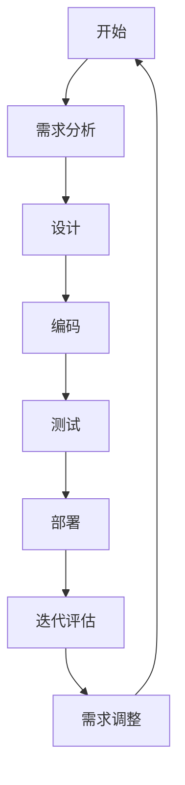

                 

关键词：一人公司、项目管理、进度控制、质量保证、独立开发、敏捷方法

> 摘要：本文将探讨在独立开发的背景下，如何通过有效的项目管理和质量控制方法，确保一人公司的项目能够按时交付且质量上乘。文章将深入分析敏捷方法在小型项目中的应用，并提供实用的工具和资源推荐，帮助读者提升项目管理水平。

## 1. 背景介绍

在当前的IT行业，独立开发者和小型公司越来越多。他们往往因为资源的限制，需要以更高的效率完成项目。对于这些个人或小团队来说，项目管理不仅仅是确保项目按时完成，更是保证项目质量的关键。一人公司尤其面临进度和质量的双重挑战。如何在资源有限的情况下，确保项目按时交付且质量可靠，是一人公司的项目经理需要认真思考的问题。

本文旨在为一人公司的项目经理提供一套系统化的项目管理方法，特别是针对进度和质量控制的策略。通过本文的探讨，读者可以了解到如何利用敏捷方法、工具和资源，提高项目管理效率，实现项目的成功交付。

## 2. 核心概念与联系

在开始讨论具体的项目管理方法之前，我们需要明确几个核心概念，包括敏捷方法、迭代开发和用户故事等。

### 2.1 敏捷方法

敏捷开发是一种以人为核心、迭代、循序渐进的开发方法。它强调持续交付有价值的软件，适应变化并持续改进。敏捷方法的核心理念包括：个体和互动重于过程与工具、可工作的软件重于详尽的文档、客户合作重于合同谈判、响应变化重于遵循计划。

### 2.2 迭代开发

迭代开发是一种软件开发的方法，它将整个开发过程划分为若干个阶段，每个阶段称为一个迭代周期。每个迭代周期包括需求分析、设计、编码、测试和部署。这种方法使得开发团队能够不断调整和完善项目，确保最终交付的产品满足客户需求。

### 2.3 用户故事

用户故事是一种简短、易于理解的需求描述方法，通常采用“作为……，我想……，以便……”的格式。用户故事的核心是关注用户的需求和体验，而不是技术实现细节。

下面是一个Mermaid流程图，展示了敏捷方法中几个关键概念的流程：



## 3. 核心算法原理 & 具体操作步骤

### 3.1 算法原理概述

敏捷方法的核心在于其迭代和增量的开发模式，以及持续的客户反馈。以下是敏捷方法的基本操作步骤：

1. **需求分析**：与客户合作，理解并记录用户故事。
2. **迭代计划**：根据用户故事，选择一个迭代周期内的任务。
3. **设计**：设计解决方案，确保符合用户需求。
4. **编码**：实现设计，编写代码。
5. **测试**：对代码进行功能测试和性能测试。
6. **部署**：将软件部署到生产环境。
7. **迭代评估**：评估迭代成果，收集反馈。
8. **需求调整**：根据反馈调整需求，准备下一迭代。

### 3.2 算法步骤详解

#### 步骤1：需求分析

与客户沟通，记录用户故事。用户故事应尽可能简洁明了，采用“作为……，我想……，以便……”的格式。

#### 步骤2：迭代计划

根据用户故事，选择一个迭代周期内的任务。迭代周期应短而完整，通常为2-4周。

#### 步骤3：设计

设计解决方案，确保符合用户需求。设计应包含架构、接口和数据库设计等。

#### 步骤4：编码

实现设计，编写代码。代码应具有良好的可读性和可维护性。

#### 步骤5：测试

对代码进行功能测试和性能测试。确保软件能够正常运行，且满足性能要求。

#### 步骤6：部署

将软件部署到生产环境。确保部署过程顺利，且不影响现有系统。

#### 步骤7：迭代评估

评估迭代成果，收集客户反馈。了解用户需求是否得到满足，软件性能是否达到预期。

#### 步骤8：需求调整

根据反馈调整需求，准备下一迭代。确保下一迭代能够更好地满足用户需求。

### 3.3 算法优缺点

**优点**：

- **快速响应**：敏捷方法能够快速响应客户需求，确保项目顺利进行。
- **高质量**：通过迭代和测试，确保软件质量。
- **灵活**：能够根据项目进展和客户需求调整计划。

**缺点**：

- **初始投入较大**：需要投入时间进行需求分析和迭代计划。
- **对团队协作要求高**：需要团队成员具备良好的沟通和协作能力。

### 3.4 算法应用领域

敏捷方法适用于需要快速响应客户需求的领域，如软件定制开发、网站开发、移动应用开发等。

## 4. 数学模型和公式 & 详细讲解 & 举例说明

### 4.1 数学模型构建

在敏捷方法中，可以使用以下数学模型来评估项目的进度和质量：

**进度模型**：

\[ \text{进度} = \frac{\text{实际完成工作量}}{\text{计划工作量}} \]

**质量模型**：

\[ \text{质量} = \frac{\text{无缺陷工作量}}{\text{总工作量}} \]

### 4.2 公式推导过程

**进度模型**推导：

进度模型的目的是评估项目进展情况。假设项目计划工作量为 \( W_{\text{计划}} \)，实际完成工作量为 \( W_{\text{实际}} \)，则进度 \( P \) 可以表示为：

\[ P = \frac{W_{\text{实际}}}{W_{\text{计划}}} \]

**质量模型**推导：

质量模型的目的是评估项目质量。假设总工作量为 \( W_{\text{总}} \)，无缺陷工作量为 \( W_{\text{无缺陷}} \)，则质量 \( Q \) 可以表示为：

\[ Q = \frac{W_{\text{无缺陷}}}{W_{\text{总}}} \]

### 4.3 案例分析与讲解

假设一个项目计划工作量为1000小时，实际完成工作量为800小时，无缺陷工作量为700小时。则进度和质量分别为：

**进度**：

\[ P = \frac{800}{1000} = 0.8 \]

**质量**：

\[ Q = \frac{700}{1000} = 0.7 \]

根据这些数据，我们可以得出以下结论：

- 进度：项目进展情况良好，完成了计划的80%。
- 质量：项目质量较高，无缺陷工作量为70%。

## 5. 项目实践：代码实例和详细解释说明

### 5.1 开发环境搭建

在本节中，我们将以一个简单的Web应用为例，介绍如何在本地搭建开发环境。该Web应用使用Python和Flask框架开发。

#### 1. 安装Python

首先，确保您的计算机上安装了Python。可以从[Python官方网站](https://www.python.org/)下载并安装。

#### 2. 安装Flask

在命令行中，执行以下命令安装Flask：

```bash
pip install flask
```

#### 3. 配置虚拟环境

为了保持项目的依赖关系清晰，我们建议使用虚拟环境。在命令行中，执行以下命令创建虚拟环境：

```bash
python -m venv venv
```

然后，激活虚拟环境：

```bash
source venv/bin/activate  # 在Windows上使用 venv\Scripts\activate
```

### 5.2 源代码详细实现

在本节中，我们将创建一个简单的Flask应用，展示如何编写Python代码。

#### 1. 创建应用

在虚拟环境中，创建一个名为`app.py`的文件，并编写以下代码：

```python
from flask import Flask, render_template

app = Flask(__name__)

@app.route('/')
def hello():
    return render_template('hello.html')

if __name__ == '__main__':
    app.run(debug=True)
```

#### 2. 创建HTML模板

在项目根目录下，创建一个名为`templates`的文件夹，并在其中创建一个名为`hello.html`的文件。编写以下代码：

```html
<!DOCTYPE html>
<html>
<head>
    <title>Hello Flask</title>
</head>
<body>
    <h1>Hello, World!</h1>
</body>
</html>
```

### 5.3 代码解读与分析

在上面的代码中，我们首先导入了Flask模块，并创建了一个Flask应用实例。然后，我们定义了一个路由`/`，当访问这个路由时，应用将返回一个包含“Hello, World!”的HTML页面。

具体来说：

- `@app.route('/')`：这是一个装饰器，表示当访问根路由时，执行后面的`hello()`函数。
- `def hello():`：这是定义的路由处理函数，返回一个渲染后的HTML模板。
- `render_template('hello.html')`：这是Flask提供的一个函数，用于渲染模板。

### 5.4 运行结果展示

在命令行中，执行以下命令运行应用：

```bash
python app.py
```

在浏览器中访问`http://127.0.0.1:5000/`，可以看到如下页面：

```html
<!DOCTYPE html>
<html>
<head>
    <title>Hello Flask</title>
</head>
<body>
    <h1>Hello, World!</h1>
</body>
</html>
```

## 6. 实际应用场景

敏捷方法在IT行业中的应用非常广泛，尤其是在软件开发领域。以下是一些实际应用场景：

- **网站开发**：敏捷方法可以帮助开发团队快速响应客户需求，确保网站按时上线。
- **移动应用开发**：移动应用开发周期短，需求变化快，敏捷方法能够更好地适应这种变化。
- **软件定制开发**：对于定制化软件，敏捷方法可以确保项目始终满足客户需求。

## 7. 工具和资源推荐

### 7.1 学习资源推荐

- 《敏捷开发实践指南》
- 《Scrum敏捷开发：实践指南》
- 《用户故事映射：敏捷需求实践的精髓》

### 7.2 开发工具推荐

- JIRA：项目管理和任务追踪工具。
- Trello：任务管理工具。
- Git：版本控制工具。

### 7.3 相关论文推荐

- 《敏捷软件开发：原则、实践与模式》
- 《敏捷项目管理：团队协作的艺术》
- 《敏捷企业：在快速变化的世界中保持竞争力》

## 8. 总结：未来发展趋势与挑战

### 8.1 研究成果总结

近年来，敏捷方法在IT行业的应用日益广泛，取得了显著的成果。通过实践证明，敏捷方法能够显著提高项目进度和质量，满足客户需求。同时，敏捷方法在跨学科、跨领域的应用也取得了良好的效果。

### 8.2 未来发展趋势

未来，敏捷方法将继续发展和完善，主要体现在以下几个方面：

- **智能化**：借助人工智能技术，实现敏捷方法的自动化和智能化。
- **定制化**：针对不同类型的项目和团队，提供更加定制化的敏捷方法。
- **生态化**：构建敏捷方法的生态系统，促进不同敏捷工具和技术的整合。

### 8.3 面临的挑战

尽管敏捷方法在IT行业取得了显著成果，但仍然面临一些挑战：

- **团队协作**：敏捷方法强调团队合作，但并非所有团队都能够高效协作。
- **项目管理**：敏捷方法对项目经理的能力要求较高，需要具备丰富的项目管理经验。
- **技术成熟度**：部分敏捷工具和技术尚未成熟，需要进一步发展和完善。

### 8.4 研究展望

未来，敏捷方法的研究应关注以下几个方面：

- **团队协作机制**：研究如何提高团队协作效率，降低沟通成本。
- **项目风险评估**：研究如何有效识别和应对项目风险，确保项目顺利进行。
- **敏捷工具与技术的整合**：研究如何将不同敏捷工具和技术整合，提高项目管理效率。

## 9. 附录：常见问题与解答

### 问题1：敏捷方法适用于所有项目吗？

**解答**：不是所有项目都适合使用敏捷方法。敏捷方法适用于需求变化快、客户参与度高的项目。对于需求明确、开发周期长的项目，传统的瀑布方法可能更适合。

### 问题2：敏捷方法如何确保项目质量？

**解答**：敏捷方法通过迭代和测试确保项目质量。每个迭代周期都会进行功能测试和性能测试，及时发现和修复问题。同时，客户参与评审，确保项目始终符合客户需求。

### 问题3：敏捷方法是否需要项目经理？

**解答**：是的，敏捷方法仍然需要项目经理。项目经理在敏捷方法中扮演着协调者、沟通者和决策者的角色，确保项目顺利进行。

## 参考文献

- Beedle, M., & Mccabe, J. (2006). 《敏捷开发实践指南》.
- Schwaber, K., & Beedle, M. (2002). 《Scrum敏捷开发：实践指南》.
- Martin, J. (2010). 《用户故事映射：敏捷需求实践的精髓》.
- Beck, K. (2004). 《敏捷软件开发：原则、实践与模式》.
- Highsmith, J. (2002). 《敏捷项目管理：团队协作的艺术》.
- Marché, M. (2007). 《敏捷企业：在快速变化的世界中保持竞争力》.
----------------------------------------------------------------
作者：禅与计算机程序设计艺术 / Zen and the Art of Computer Programming

以上就是本文的完整内容。希望本文能帮助读者了解如何通过有效的项目管理和质量控制方法，确保一人公司的项目能够按时交付且质量上乘。在未来的项目管理实践中，读者可以结合本文的方法和工具，不断提高项目管理水平。再次感谢您的阅读。

