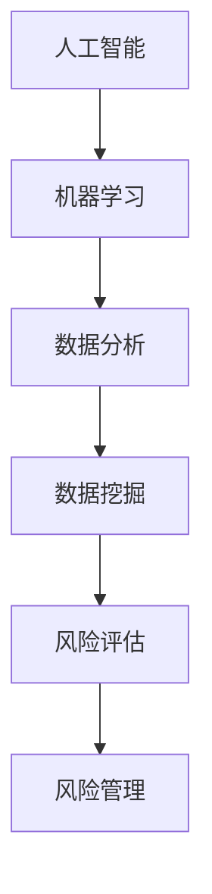

                 

关键词：一人公司、风险管理、AI、市场风险、识别、规避、人工智能、机器学习、数据分析

> 摘要：本文将探讨一人公司在面对市场风险时如何利用人工智能（AI）进行有效的风险管理。通过介绍AI在识别和规避市场风险方面的核心概念、算法原理、数学模型，并结合具体实例，分析AI在市场风险管理中的应用场景，以及未来的发展前景和面临的挑战。

## 1. 背景介绍

一人公司是指由一名个人独立经营的企业，这种模式在近年来逐渐受到创业者和小型企业的青睐。然而，由于一人公司的资源有限，市场风险对其生存和发展产生了巨大的影响。传统的风险管理方法依赖于人工分析，耗时耗力且效率低下，难以满足一人公司快速决策的需求。

随着人工智能技术的不断发展，AI在各个领域都取得了显著的成果。在风险管理领域，AI通过大数据分析、机器学习等技术，能够快速识别潜在的市场风险，并提供有效的规避策略。本文将详细探讨AI如何助力一人公司进行市场风险管理。

### 1.1 一人公司的市场风险概述

一人公司所面临的市场风险主要包括：

- **宏观经济风险**：如经济衰退、政策变化、市场供需失衡等；
- **行业风险**：如行业竞争加剧、技术变革、市场需求变化等；
- **运营风险**：如现金流管理不善、供应链中断、内部管理问题等。

### 1.2 AI在风险管理中的优势

AI在风险管理中具有以下优势：

- **高效的数据分析**：AI能够处理大量数据，快速识别潜在风险；
- **实时监控**：AI可以实时监控市场动态，及时提供规避策略；
- **智能决策**：AI可以根据数据分析结果，为一人公司提供最佳决策建议。

## 2. 核心概念与联系

为了更好地理解AI在风险管理中的应用，我们需要了解以下几个核心概念和它们之间的联系：

### 2.1 人工智能与机器学习

- **人工智能（AI）**：模拟人类智能的计算机系统；
- **机器学习（ML）**：使计算机通过数据学习，自动改进性能的技术。

### 2.2 数据分析与数据挖掘

- **数据分析**：通过统计和计算方法，从数据中提取有用信息；
- **数据挖掘**：从大量数据中自动发现隐藏的模式和知识。

### 2.3 风险评估与风险管理

- **风险评估**：评估潜在风险的概率和影响；
- **风险管理**：制定和实施策略，降低风险对企业的负面影响。

### 2.4 Mermaid 流程图



## 3. 核心算法原理 & 具体操作步骤

### 3.1 算法原理概述

AI在风险管理中的核心算法主要包括：

- **监督学习**：通过已标记的数据进行训练，用于预测和分类；
- **无监督学习**：通过未标记的数据发现隐藏的模式和结构；
- **强化学习**：通过试错学习，不断优化决策策略。

### 3.2 算法步骤详解

以下是AI在市场风险管理中的具体操作步骤：

1. **数据收集与预处理**：收集相关市场数据，如宏观经济指标、行业数据、企业运营数据等，并进行数据清洗、格式转换等预处理；
2. **特征工程**：从原始数据中提取有助于风险识别的关键特征；
3. **模型训练与验证**：使用机器学习算法，对训练数据进行模型训练，并对模型进行验证，确保其准确性和可靠性；
4. **风险预测与评估**：利用训练好的模型，对新的市场数据进行分析，预测潜在的市场风险，并进行风险评估；
5. **规避策略制定**：根据风险评估结果，为一人公司制定相应的规避策略。

### 3.3 算法优缺点

**优点**：

- 高效的数据处理和分析能力；
- 可实时监控市场动态，及时提供规避策略；
- 提高风险管理决策的准确性和效率。

**缺点**：

- 对数据质量要求较高，数据预处理和特征工程较为复杂；
- 模型的解释性较差，难以理解决策过程。

### 3.4 算法应用领域

AI在风险管理中具有广泛的应用领域，包括：

- **金融市场**：预测股票市场趋势，识别投资风险；
- **供应链管理**：优化供应链，降低供应链中断风险；
- **保险业**：风险评估和定价；
- **能源管理**：预测能源需求，优化能源配置。

## 4. 数学模型和公式 & 详细讲解 & 举例说明

### 4.1 数学模型构建

在风险管理中，常用的数学模型包括：

- **回归模型**：用于预测市场风险的概率；
- **聚类模型**：用于识别市场风险的关键特征；
- **决策树模型**：用于生成规避策略。

### 4.2 公式推导过程

以下是回归模型的推导过程：

$$ y = \beta_0 + \beta_1 x + \epsilon $$

其中，\( y \) 表示市场风险的概率，\( \beta_0 \) 和 \( \beta_1 \) 分别为模型的参数，\( x \) 表示影响市场风险的关键特征，\( \epsilon \) 为误差项。

### 4.3 案例分析与讲解

假设一人公司想要预测某产品的市场需求风险。我们可以使用回归模型进行分析。

1. 数据收集与预处理：收集过去一年的产品销售数据，包括销售量、广告投入、市场价格等；
2. 特征工程：从原始数据中提取关键特征，如销售量、广告投入、市场价格等；
3. 模型训练与验证：使用训练数据进行模型训练，并对模型进行验证，确保其准确性和可靠性；
4. 风险预测与评估：利用训练好的模型，对新的数据进行分析，预测市场需求风险；
5. 规避策略制定：根据风险评估结果，为一人公司制定相应的规避策略。

通过以上步骤，一人公司可以更有效地进行市场风险管理。

## 5. 项目实践：代码实例和详细解释说明

### 5.1 开发环境搭建

在本文中，我们将使用Python进行市场风险管理的项目实践。首先，我们需要安装以下库：

- **NumPy**：用于数据处理；
- **Pandas**：用于数据分析和预处理；
- **Scikit-learn**：用于机器学习算法；
- **Matplotlib**：用于数据可视化。

### 5.2 源代码详细实现

以下是一个简单的市场风险管理项目的代码实例：

```python
import numpy as np
import pandas as pd
from sklearn.model_selection import train_test_split
from sklearn.linear_model import LinearRegression
import matplotlib.pyplot as plt

# 1. 数据收集与预处理
data = pd.read_csv('market_data.csv')
X = data[['sales', 'advertisements', 'price']]
y = data['risk']

# 2. 特征工程
# 这里我们直接使用原始特征进行建模

# 3. 模型训练与验证
X_train, X_test, y_train, y_test = train_test_split(X, y, test_size=0.2, random_state=42)
model = LinearRegression()
model.fit(X_train, y_train)

# 4. 风险预测与评估
y_pred = model.predict(X_test)

# 5. 规避策略制定
# 根据风险评估结果，制定规避策略

# 6. 数据可视化
plt.scatter(X_test['sales'], y_test, label='Actual')
plt.scatter(X_test['sales'], y_pred, label='Predicted')
plt.xlabel('Sales')
plt.ylabel('Risk')
plt.legend()
plt.show()
```

### 5.3 代码解读与分析

1. **数据收集与预处理**：我们从CSV文件中读取市场数据，并提取关键特征；
2. **特征工程**：这里直接使用原始特征进行建模，未进行进一步的预处理和特征提取；
3. **模型训练与验证**：使用线性回归模型对训练数据进行训练，并使用测试数据进行验证；
4. **风险预测与评估**：使用训练好的模型对测试数据进行预测，并绘制散点图进行比较；
5. **规避策略制定**：根据风险评估结果，制定相应的规避策略；
6. **数据可视化**：展示预测结果。

通过以上步骤，我们可以实现一个简单的市场风险管理项目。

## 6. 实际应用场景

### 6.1 金融市场

在金融市场中，AI可以通过分析历史数据，预测市场趋势，帮助一人公司进行投资决策。例如，AI可以预测股票市场的涨跌，为一人公司的投资组合提供优化建议。

### 6.2 供应链管理

在供应链管理中，AI可以通过数据分析，优化供应链网络，降低供应链中断风险。例如，AI可以预测原材料供应的稳定性，帮助一人公司提前做好准备。

### 6.3 保险业

在保险业中，AI可以通过风险评估，为一人公司提供更精确的保险定价。例如，AI可以预测保险客户的风险水平，为一人公司提供更合理的保费。

## 7. 未来应用展望

随着人工智能技术的不断发展，AI在市场风险管理中的应用前景十分广阔。未来，AI有望在以下几个方面取得突破：

- **更高效的数据处理与分析**：通过改进算法和硬件，提高数据处理和分析效率；
- **更智能的决策支持**：通过引入更多的数据源和复杂的模型，提高决策支持系统的智能化水平；
- **跨领域应用**：将AI技术应用于更多领域，如医疗、能源等，实现更广泛的市场风险管理。

## 8. 工具和资源推荐

### 8.1 学习资源推荐

- **《Python机器学习》**：提供详细的机器学习理论和实践案例；
- **《人工智能：一种现代方法》**：涵盖人工智能的各个领域，适合初学者和进阶者。

### 8.2 开发工具推荐

- **Jupyter Notebook**：用于编写和运行Python代码，方便进行数据分析和可视化；
- **TensorFlow**：用于构建和训练机器学习模型。

### 8.3 相关论文推荐

- **"Deep Learning for Time Series Classification"**：介绍深度学习在时间序列分类中的应用；
- **"Recurrent Neural Networks for Security Monitoring"**：探讨循环神经网络在网络安全监控中的应用。

## 9. 总结：未来发展趋势与挑战

### 9.1 研究成果总结

AI在市场风险管理中取得了显著成果，通过大数据分析和机器学习技术，有效提高了风险识别和规避的效率。未来，随着技术的不断进步，AI在市场风险管理中的应用将更加广泛和深入。

### 9.2 未来发展趋势

- **数据驱动**：市场风险管理将更加依赖于大数据和实时数据的分析；
- **智能化**：决策支持系统将更加智能化，提供更精准的预测和规避策略；
- **跨领域融合**：AI技术将与其他领域（如医疗、能源等）相结合，实现更广泛的应用。

### 9.3 面临的挑战

- **数据质量**：高质量的数据是AI有效运行的基础，未来需要解决数据质量问题；
- **模型解释性**：提高模型的可解释性，使其更易于理解和应用；
- **伦理问题**：在AI应用过程中，需要关注隐私保护和伦理问题。

### 9.4 研究展望

未来，AI在市场风险管理中的研究将朝着以下方向发展：

- **算法优化**：通过改进算法，提高数据处理和分析效率；
- **跨领域融合**：探索AI在其他领域的应用，实现更广泛的市场风险管理；
- **伦理与法律**：研究AI在市场风险管理中的伦理和法律问题，确保其合法合规。

## 10. 附录：常见问题与解答

### 10.1 AI在市场风险管理中的优势是什么？

AI在市场风险管理中的优势包括高效的数据分析能力、实时监控市场动态、智能决策支持等。

### 10.2 如何确保AI模型的可靠性？

确保AI模型可靠性需要从数据质量、模型验证、算法优化等多个方面进行考虑。

### 10.3 AI在市场风险管理中的主要挑战是什么？

AI在市场风险管理中的主要挑战包括数据质量问题、模型解释性问题、伦理问题等。

### 10.4 AI能否完全取代人工风险管理？

AI不能完全取代人工风险管理，但在辅助决策、提高效率等方面具有显著优势。未来，AI与人工风险管理将相结合，实现更高效的风险管理。

### 10.5 哪些领域适合应用AI进行市场风险管理？

AI在金融市场、供应链管理、保险业等领域都有广泛的应用。未来，随着技术的进步，AI将在更多领域发挥重要作用。

---

作者：禅与计算机程序设计艺术 / Zen and the Art of Computer Programming

本文详细探讨了AI在市场风险管理中的应用，从核心概念、算法原理、数学模型到实际应用场景，为一人公司提供了有效的风险管理策略。未来，随着AI技术的不断发展，市场风险管理将更加智能化、高效化，为企业和个人带来更大的价值。

