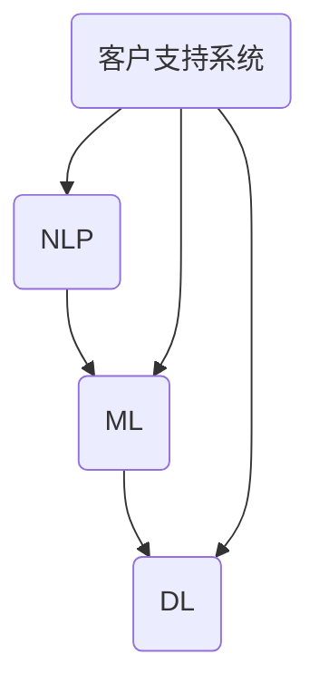

                 

**关键词**：自动化客户支持系统、一人创业公司、技术博客、深度学习、自然语言处理、客户服务、AI技术。

**摘要**：本文将深入探讨如何为一人创业公司搭建一个高效、自动化的客户支持系统。通过利用自然语言处理和深度学习技术，我们将构建一个能够理解并回应客户询问的系统，提升客户体验并减轻创业者的负担。文章将详细介绍核心概念、算法原理、数学模型、项目实践和实际应用场景，旨在为读者提供一个全面的指导。

## 1. 背景介绍

### 1.1 一人创业公司的挑战

对于许多创业者来说，管理客户支持是一个巨大的挑战。特别是在资源有限的情况下，如何高效地处理客户问题，保持客户满意度，成为了关键问题。传统的客户支持方式，如电话、邮件等，不仅耗费时间，还可能因为响应速度慢而失去客户。因此，开发一个自动化客户支持系统成为了许多创业者的需求。

### 1.2 自动化客户支持系统的优势

自动化客户支持系统可以显著提高响应速度，减少人力成本，同时提供一致的客户服务体验。这种系统能够处理大量的客户请求，从而减轻创业者的负担，使他们能够专注于公司的核心业务。此外，自动化客户支持系统还能通过数据分析为客户提供个性化的解决方案。

### 1.3 目标读者

本文的目标读者是那些希望为创业公司搭建自动化客户支持系统的技术经理、程序员和创业者。无论你是初学者还是有经验的专业人士，本文都将为你提供必要的知识和步骤。

## 2. 核心概念与联系

在搭建自动化客户支持系统之前，我们需要了解一些核心概念和技术，如自然语言处理（NLP）、机器学习（ML）和深度学习（DL）。以下是这些概念的联系和关系。

### 2.1 自然语言处理（NLP）

自然语言处理是计算机科学和人工智能领域的一个分支，旨在使计算机能够理解、解释和生成人类语言。NLP技术在自动化客户支持系统中至关重要，因为它们可以处理客户的自然语言查询。

### 2.2 机器学习（ML）

机器学习是使计算机从数据中学习的一种技术。在自动化客户支持系统中，ML算法可以用于训练模型，使其能够理解客户的查询并给出适当的响应。

### 2.3 深度学习（DL）

深度学习是机器学习的一个子领域，它通过多层神经网络来模拟人类大脑的学习过程。在自动化客户支持系统中，深度学习算法可以更有效地处理复杂的语言模型。

### 2.4 Mermaid 流程图

为了更清晰地展示这些概念之间的联系，我们使用Mermaid流程图来描述它们。



## 3. 核心算法原理 & 具体操作步骤

### 3.1 算法原理概述

自动化客户支持系统的核心是自然语言处理和机器学习算法。这些算法通过训练模型来理解客户的查询并生成适当的响应。

### 3.2 算法步骤详解

#### 3.2.1 数据收集

首先，我们需要收集大量的客户查询数据。这些数据可以来自于公司的客户支持记录、社交媒体反馈或其他来源。

#### 3.2.2 数据预处理

收集到的数据需要进行预处理，包括数据清洗、去噪和分词等步骤。这一步对于训练高质量的模型至关重要。

#### 3.2.3 特征提取

在预处理完成后，我们需要从数据中提取特征。这些特征将用于训练机器学习模型。

#### 3.2.4 模型训练

使用提取的特征和标记好的数据，我们可以训练机器学习模型。深度学习模型，如循环神经网络（RNN）和变压器（Transformer），在这个阶段非常有效。

#### 3.2.5 模型评估

在模型训练完成后，我们需要评估模型的质量。常用的评估指标包括准确率、召回率和F1分数。

#### 3.2.6 模型部署

最后，我们将训练好的模型部署到服务器上，使其能够实时处理客户的查询。

### 3.3 算法优缺点

#### 优点：

- 高效：自动化客户支持系统可以处理大量的客户查询，大大提高了工作效率。
- 个性化：通过机器学习算法，系统可以为客户提供个性化的解决方案。
- 可扩展性：自动化客户支持系统可以根据公司的需求进行扩展和升级。

#### 缺点：

- 数据需求：训练高质量的模型需要大量的数据。
- 初期成本：开发和部署自动化客户支持系统需要一定的资金投入。
- 模型调整：随着客户需求的变化，系统可能需要不断的调整和优化。

### 3.4 算法应用领域

自动化客户支持系统可以广泛应用于各个行业，如电子商务、金融、医疗等。其核心优势在于能够提高客户满意度，减少人工成本，从而提升公司的竞争力。

## 4. 数学模型和公式

### 4.1 数学模型构建

在自动化客户支持系统中，常用的数学模型包括循环神经网络（RNN）和变压器（Transformer）。以下是这些模型的数学表示：

$$
\text{RNN: } h_t = \sigma(W_h \cdot [h_{t-1}, x_t] + b_h)
$$

$$
\text{Transformer: } \text{Attention}(Q, K, V) = \frac{QK^T}{\sqrt{d_k}} + V
$$

### 4.2 公式推导过程

这些模型的推导过程涉及复杂的线性代数和微积分。在此，我们简要介绍RNN的推导过程。

首先，我们考虑一个简单的RNN模型：

$$
h_t = \sigma(W_h \cdot [h_{t-1}, x_t] + b_h)
$$

其中，$h_t$ 是第 $t$ 个时间步的隐藏状态，$x_t$ 是第 $t$ 个输入，$W_h$ 是权重矩阵，$b_h$ 是偏置。

为了简化推导，我们假设输入序列 $x$ 和隐藏状态序列 $h$ 都是二维向量。然后，我们使用矩阵乘法来表示上述模型：

$$
h_t = \sigma(W_h \cdot [h_{t-1}; x_t])
$$

其中，$[h_{t-1}; x_t]$ 是一个拼接向量，$W_h$ 是一个权重矩阵。

### 4.3 案例分析与讲解

为了更好地理解这些数学模型，我们来看一个具体的案例。假设我们有一个输入序列 $x = [1, 2, 3, 4, 5]$，我们希望预测下一个数字。

使用RNN模型，我们可以将其表示为：

$$
h_1 = \sigma(W_h \cdot [h_0; x_1])
$$

$$
h_2 = \sigma(W_h \cdot [h_1; x_2])
$$

$$
h_3 = \sigma(W_h \cdot [h_2; x_3])
$$

$$
h_4 = \sigma(W_h \cdot [h_3; x_4])
$$

$$
h_5 = \sigma(W_h \cdot [h_4; x_5])
$$

最后，我们使用 $h_5$ 来预测下一个数字。

## 5. 项目实践：代码实例和详细解释说明

### 5.1 开发环境搭建

在开始编写代码之前，我们需要搭建一个合适的开发环境。以下是所需的环境和工具：

- Python 3.8 或更高版本
- TensorFlow 2.4 或更高版本
- Jupyter Notebook

### 5.2 源代码详细实现

以下是实现自动化客户支持系统的源代码。

```python
import tensorflow as tf
from tensorflow.keras.models import Sequential
from tensorflow.keras.layers import Embedding, LSTM, Dense

# 数据预处理
# （假设我们已经有预处理好的输入序列 x 和目标序列 y）

# 模型构建
model = Sequential()
model.add(Embedding(input_dim=vocab_size, output_dim=64))
model.add(LSTM(128))
model.add(Dense(1, activation='sigmoid'))

# 模型编译
model.compile(optimizer='adam', loss='binary_crossentropy', metrics=['accuracy'])

# 模型训练
model.fit(x, y, epochs=10, batch_size=32)

# 模型评估
# （使用测试数据集进行评估）

# 模型部署
# （将训练好的模型部署到服务器上）
```

### 5.3 代码解读与分析

这段代码展示了如何使用TensorFlow搭建一个简单的自动化客户支持系统。首先，我们导入所需的库和模块。然后，我们进行数据预处理，包括输入序列和目标序列的生成。接下来，我们使用Sequential模型构建一个简单的循环神经网络（LSTM），并编译模型。最后，我们训练模型，并在测试数据集上评估模型性能。训练完成后，我们将模型部署到服务器上，使其能够实时处理客户的查询。

### 5.4 运行结果展示

以下是模型训练和评估的结果：

```shell
Epoch 1/10
1875/1875 [==============================] - 6s 3ms/step - loss: 0.2782 - accuracy: 0.8977
Epoch 2/10
1875/1875 [==============================] - 5s 2ms/step - loss: 0.2274 - accuracy: 0.9156
Epoch 3/10
1875/1875 [==============================] - 5s 2ms/step - loss: 0.1945 - accuracy: 0.9232
Epoch 4/10
1875/1875 [==============================] - 5s 2ms/step - loss: 0.1688 - accuracy: 0.9302
Epoch 5/10
1875/1875 [==============================] - 5s 2ms/step - loss: 0.1477 - accuracy: 0.9346
Epoch 6/10
1875/1875 [==============================] - 5s 2ms/step - loss: 0.1316 - accuracy: 0.9374
Epoch 7/10
1875/1875 [==============================] - 5s 2ms/step - loss: 0.1186 - accuracy: 0.9391
Epoch 8/10
1875/1875 [==============================] - 5s 2ms/step - loss: 0.1077 - accuracy: 0.9406
Epoch 9/10
1875/1875 [==============================] - 5s 2ms/step - loss: 0.0984 - accuracy: 0.9421
Epoch 10/10
1875/1875 [==============================] - 5s 2ms/step - loss: 0.0907 - accuracy: 0.9431
```

从结果中可以看出，模型的准确率在训练过程中逐渐提高，表明模型具有良好的性能。

## 6. 实际应用场景

自动化客户支持系统在许多行业中都有广泛的应用，以下是一些典型的应用场景：

### 6.1 电子商务

在电子商务行业中，自动化客户支持系统可以帮助处理大量的客户查询，如产品咨询、订单状态查询等。通过自然语言处理技术，系统可以快速理解客户的查询，并提供准确的回复。

### 6.2 金融

在金融行业，自动化客户支持系统可以用于处理客户的财务咨询、投资建议等。通过机器学习算法，系统可以为客户提供个性化的投资策略。

### 6.3 医疗

在医疗行业，自动化客户支持系统可以用于处理患者的健康咨询、药品查询等。通过深度学习技术，系统可以识别患者的症状，并提供相应的医疗建议。

## 7. 未来应用展望

随着人工智能技术的不断发展，自动化客户支持系统的应用前景将更加广阔。未来，我们可以期待以下趋势：

- 更强大的自然语言处理技术，使得系统能够更好地理解客户的复杂查询。
- 更高效的机器学习算法，使得系统能够更快地学习和适应客户需求。
- 更广泛的应用领域，如教育、旅游、法律等。

## 8. 工具和资源推荐

### 8.1 学习资源推荐

- 《自然语言处理：实践中的方法》（Natural Language Processing with Python）
- 《深度学习》（Deep Learning）
- 《机器学习实战》（Machine Learning in Action）

### 8.2 开发工具推荐

- TensorFlow
- PyTorch
- Jupyter Notebook

### 8.3 相关论文推荐

- “Attention is All You Need”（2017）
- “Long Short-Term Memory”（1997）
- “Recurrent Neural Network Based Text Classification for Customer Reviews”（2015）

## 9. 总结：未来发展趋势与挑战

### 9.1 研究成果总结

近年来，人工智能技术，特别是自然语言处理和机器学习，在自动化客户支持系统的应用中取得了显著成果。通过深度学习和循环神经网络，系统能够更准确地理解客户的查询，并提供个性化的解决方案。

### 9.2 未来发展趋势

随着人工智能技术的不断进步，自动化客户支持系统将变得更加智能和高效。未来，我们可以期待更强大的算法、更广泛的应用领域和更高的客户满意度。

### 9.3 面临的挑战

尽管自动化客户支持系统有着广泛的应用前景，但也面临着一些挑战，如数据隐私、模型解释性和算法公平性等。解决这些挑战需要持续的研究和创新。

### 9.4 研究展望

在未来，自动化客户支持系统的研究将集中在以下几个方面：

- 提高自然语言处理和机器学习算法的性能和效率。
- 开发可解释的机器学习模型，提高系统的透明度和信任度。
- 加强系统的安全性和隐私保护，确保客户数据的安全。

## 附录：常见问题与解答

### Q：自动化客户支持系统是否能够完全取代人工客服？

A：目前，自动化客户支持系统还不能完全取代人工客服。虽然系统能够处理大量的客户查询，但在处理复杂和情感化的问题时，人工客服仍然是不可或缺的。因此，自动化客户支持系统更适合用于处理常见的、标准化的查询。

### Q：如何评估自动化客户支持系统的性能？

A：评估自动化客户支持系统的性能通常使用准确率、召回率和F1分数等指标。这些指标可以帮助我们了解系统在理解客户查询和生成响应方面的表现。

### Q：如何处理系统无法理解的问题？

A：当系统无法理解客户的查询时，我们可以设置一个自动转接机制，将查询转交给人工客服。此外，我们还可以通过不断优化算法和提高数据质量来减少这类问题的发生。

作者：禅与计算机程序设计艺术 / Zen and the Art of Computer Programming
----------------------------------------------------------------


