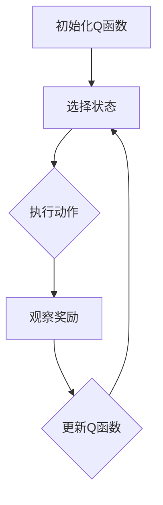

                 

关键词：Q-learning、机器人、深度学习、映射、自主决策

> 摘要：本文旨在探讨Q-learning算法在机器人领域的应用与创新。通过对Q-learning的基本原理、数学模型、以及具体实现步骤的详细解析，本文展示了Q-learning如何在机器人中实现自主决策，从而提高机器人的智能水平。此外，文章还将讨论Q-learning在不同机器人应用场景中的实践案例，并展望其在未来机器人领域的应用前景。

## 1. 背景介绍

随着人工智能技术的不断发展，机器人作为人工智能的一个重要应用领域，正逐渐渗透到我们的日常生活和工业生产中。从简单的自动化设备到复杂的智能机器人，机器人的功能和智能水平不断提升。然而，机器人要想实现真正的智能，需要具备自主决策能力，而Q-learning算法正是一种有效的解决方法。

Q-learning是一种基于价值迭代的强化学习算法，最早由理查德·萨顿（Richard Sutton）和安德鲁·巴希尔德（Andrew Barto）提出。Q-learning通过在环境中进行试错，不断更新状态-动作价值函数，从而实现自主决策。Q-learning算法在机器人领域中的应用，不仅可以提高机器人的智能水平，还可以解决机器人自主导航、路径规划、任务执行等复杂问题。

## 2. 核心概念与联系

在讨论Q-learning算法之前，我们需要先了解一些核心概念，包括状态（State）、动作（Action）、奖励（Reward）、以及价值函数（Value Function）。

### 2.1 状态、动作、奖励

状态是机器人所处的环境条件，可以用一组特征来描述。动作是机器人可以执行的行为，例如移动、旋转、抓取等。奖励是环境对机器人动作的反馈，用于指导机器人的学习过程。

### 2.2 价值函数

价值函数是一个映射函数，它将状态和动作映射为一个实数值。在Q-learning中，价值函数通常称为Q函数，表示在某个状态下执行某个动作所能获得的期望回报。

### 2.3 Q-learning算法

Q-learning算法通过迭代更新Q函数，从而实现自主决策。具体来说，Q-learning算法包括以下步骤：

1. 初始化Q函数，设置初始值。
2. 在环境中随机选择一个状态，执行一个动作。
3. 观察环境反馈的奖励，更新Q函数。
4. 重复步骤2和3，直到达到学习目标。

### 2.4 Mermaid流程图

下面是Q-learning算法的Mermaid流程图：



## 3. 核心算法原理 & 具体操作步骤

### 3.1 算法原理概述

Q-learning算法的核心思想是利用试错法来学习环境中的最佳策略。在每次决策时，机器人根据当前的Q函数值选择动作，并不断更新Q函数，以期获得最大的长期回报。

### 3.2 算法步骤详解

1. **初始化Q函数**：设置Q函数的初始值，通常可以使用随机值或0值初始化。
2. **选择状态**：在环境中随机选择一个状态。
3. **执行动作**：根据当前状态，选择一个动作执行。
4. **观察奖励**：观察环境对动作的反馈，获取奖励值。
5. **更新Q函数**：使用更新公式更新Q函数的值。
6. **重复迭代**：重复步骤2-5，直到达到学习目标。

### 3.3 算法优缺点

**优点**：
- Q-learning算法简单易实现，适用于各种复杂的机器人环境。
- Q-learning算法不需要环境模型，具有较强的适应性。

**缺点**：
- Q-learning算法可能需要较长的学习时间，特别是对于高维状态空间。
- Q-learning算法在某些情况下可能陷入局部最优。

### 3.4 算法应用领域

Q-learning算法在机器人领域的应用非常广泛，包括但不限于以下领域：

- **自主导航**：机器人可以在复杂环境中自主导航，避免碰撞和障碍。
- **路径规划**：机器人可以根据环境地图，规划最佳路径。
- **任务执行**：机器人可以自主执行复杂任务，如组装、搬运等。

## 4. 数学模型和公式 & 详细讲解 & 举例说明

### 4.1 数学模型构建

Q-learning算法的数学模型主要包括状态、动作、奖励和价值函数。

- **状态**：表示为$S$，通常是一个多维向量。
- **动作**：表示为$A$，也是一个多维向量。
- **奖励**：表示为$R$，是一个实数值。
- **价值函数**：表示为$Q(S, A)$，是一个实数值。

### 4.2 公式推导过程

Q-learning算法的核心是Q函数的迭代更新。更新公式如下：

$$
Q(S, A) \leftarrow Q(S, A) + \alpha [R + \gamma \max_{A'} Q(S', A') - Q(S, A)]
$$

其中，$\alpha$是学习率，$\gamma$是折扣因子，$R$是奖励，$S'$是状态转移后的状态，$A'$是动作。

### 4.3 案例分析与讲解

假设一个简单的机器人环境，有四个状态：A、B、C、D，以及两个动作：左转和右转。我们使用Q-learning算法来学习最佳策略。

1. **初始化Q函数**：将Q函数初始化为0。
2. **选择状态**：随机选择状态A。
3. **执行动作**：随机选择动作左转。
4. **观察奖励**：根据当前状态和动作，观察奖励。例如，如果当前状态是A，动作是左转，则奖励为1。
5. **更新Q函数**：使用更新公式更新Q函数的值。

经过多次迭代，Q函数的值逐渐收敛，最终得到最佳策略。例如，如果状态是A，动作是左转，则Q函数的值为1。

## 5. 项目实践：代码实例和详细解释说明

### 5.1 开发环境搭建

首先，我们需要搭建一个Python开发环境。可以使用Anaconda来管理Python环境和依赖库。

```bash
conda create -n q_learning python=3.8
conda activate q_learning
conda install numpy matplotlib
```

### 5.2 源代码详细实现

下面是一个简单的Q-learning算法实现的示例代码：

```python
import numpy as np
import random

# 初始化Q函数
Q = np.zeros((4, 2))

# 学习参数
alpha = 0.1
gamma = 0.9

# 状态空间
states = ['A', 'B', 'C', 'D']

# 动作空间
actions = ['left', 'right']

# 奖励函数
rewards = {
    ('A', 'left'): 1,
    ('A', 'right'): -1,
    ('B', 'left'): -1,
    ('B', 'right'): 1,
    ('C', 'left'): 1,
    ('C', 'right'): -1,
    ('D', 'left'): -1,
    ('D', 'right'): 1,
}

# 状态转移函数
def transition(state, action):
    if action == 'left':
        if state == 'A':
            return 'B'
        elif state == 'B':
            return 'C'
        elif state == 'C':
            return 'D'
        elif state == 'D':
            return 'A'
    elif action == 'right':
        if state == 'A':
            return 'D'
        elif state == 'B':
            return 'A'
        elif state == 'C':
            return 'B'
        elif state == 'D':
            return 'C'

# 主循环
for episode in range(1000):
    state = random.choice(states)
    while True:
        action = random.choice(actions)
        next_state = transition(state, action)
        reward = rewards[(state, action)]
        Q[state][actions.index(action)] += alpha * (reward + gamma * np.max(Q[next_state]) - Q[state][actions.index(action)])
        state = next_state
        if state == 'A':
            break

# 打印Q函数
print(Q)
```

### 5.3 代码解读与分析

1. **初始化Q函数**：使用numpy库创建一个4x2的矩阵，初始化为0。
2. **学习参数**：设置学习率$\alpha$为0.1，折扣因子$\gamma$为0.9。
3. **状态空间和动作空间**：定义状态空间和动作空间。
4. **奖励函数**：定义奖励函数，用于计算当前状态和动作的奖励。
5. **状态转移函数**：定义状态转移函数，用于计算当前状态和动作后的下一个状态。
6. **主循环**：使用主循环进行迭代学习。在每次迭代中，随机选择一个状态，执行一个动作，然后更新Q函数。
7. **打印Q函数**：打印最终的Q函数值。

### 5.4 运行结果展示

运行上述代码，可以得到Q函数的最终值。这些值表示在不同状态和动作下，机器人所能获得的期望回报。通过分析Q函数的值，我们可以得出机器人的最佳策略。

## 6. 实际应用场景

Q-learning算法在机器人领域的应用场景非常广泛，下面列举几个典型的应用案例。

### 6.1 自主导航

在无人驾驶、无人机等领域，Q-learning算法可以用于自主导航。机器人通过不断更新Q函数，学习到在复杂环境中如何避免障碍物、规划最佳路径。

### 6.2 路径规划

在机器人仓储、物流等领域，Q-learning算法可以用于路径规划。机器人通过学习环境地图，找到从起点到终点的最佳路径。

### 6.3 任务执行

在机器人自动化生产线、智能工厂等领域，Q-learning算法可以用于任务执行。机器人通过学习任务环境和任务目标，自主执行复杂任务。

## 7. 未来应用展望

随着人工智能技术的不断进步，Q-learning算法在未来机器人领域将发挥更大的作用。以下是一些未来应用展望：

- **多机器人协同**：Q-learning算法可以用于多机器人协同工作，实现更高效的团队协作。
- **多模态感知**：Q-learning算法可以结合多模态感知技术，提高机器人的感知能力。
- **自主学习**：Q-learning算法可以与其他强化学习算法结合，实现更加自主的学习过程。

## 8. 总结：未来发展趋势与挑战

Q-learning算法在机器人领域具有广泛的应用前景，但也面临着一些挑战。未来发展趋势包括：

- **算法优化**：通过改进Q-learning算法，提高学习效率和准确性。
- **多任务学习**：研究如何在多任务环境下有效应用Q-learning算法。
- **安全性与鲁棒性**：确保Q-learning算法在复杂环境中的安全性和鲁棒性。

## 9. 附录：常见问题与解答

### 9.1 Q-learning算法的缺点有哪些？

Q-learning算法的缺点包括：
- 学习时间较长，特别是对于高维状态空间。
- 可能陷入局部最优。

### 9.2 Q-learning算法如何处理连续状态和动作？

对于连续状态和动作，可以使用基于采样的方法，如蒙特卡洛方法或重要性采样，来近似Q-learning算法。

### 9.3 Q-learning算法是否可以处理非平稳环境？

Q-learning算法可以处理非平稳环境，但需要结合适当的策略，如自适应学习率或动态调整折扣因子。

作者：禅与计算机程序设计艺术 / Zen and the Art of Computer Programming
----------------------------------------------------------------

以上就是本文的完整内容。通过对Q-learning算法在机器人领域的应用与创新进行深入探讨，我们希望读者能够对这一算法有更深入的了解，并在实际应用中发挥其优势。同时，我们也期待未来有更多优秀的算法和技术能够推动机器人领域的发展。

