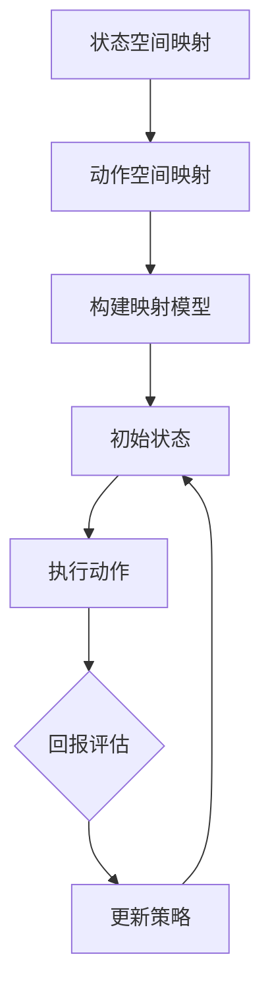

                 

关键词：Q-learning算法，深度学习，航天领域，人工智能，映射，预测控制

> 摘要：随着人工智能技术的飞速发展，传统的控制理论与人工智能的交叉融合为航天领域带来了新的研究方向。本文旨在探讨Q-learning算法在航天领域的应用，通过构建映射模型，实现航天器姿态控制与轨迹规划，并提出未来发展的方向与挑战。

## 1. 背景介绍

航天技术是国家科技实力的象征，对于国家安全和经济发展具有重要意义。随着航天器种类和功能的日益丰富，对航天器的控制与调度提出了更高的要求。传统的控制方法在面对复杂、动态的环境时，表现出一定的局限性。近年来，人工智能技术的发展为航天领域的创新提供了新的思路。

Q-learning算法是一种基于深度学习的强化学习算法，它通过迭代学习，不断优化策略，实现智能体的最佳行为。Q-learning算法在游戏、推荐系统等领域已有广泛应用，但在航天领域的应用尚处于探索阶段。本文将介绍Q-learning算法在航天领域的应用前景，通过构建映射模型，实现航天器姿态控制与轨迹规划。

## 2. 核心概念与联系

为了更好地理解Q-learning算法在航天领域的应用，我们首先需要了解核心概念与它们之间的联系。

### 2.1 Q-learning算法

Q-learning算法是一种基于值函数的强化学习算法，其核心思想是通过学习值函数，优化智能体的策略。值函数表示智能体在特定状态下采取特定动作的预期回报。通过迭代更新值函数，Q-learning算法逐步优化智能体的行为。

### 2.2 映射模型

在航天领域，映射模型用于描述航天器在复杂环境下的动态行为。映射模型可以分为状态空间映射和动作空间映射。状态空间映射描述航天器当前的状态，如位置、速度、姿态等；动作空间映射描述航天器可执行的动作，如发动机推力、方向舵等。

### 2.3 航天器控制与轨迹规划

航天器控制与轨迹规划是航天领域的关键技术。控制技术确保航天器在预定轨道上运行，轨迹规划技术则确保航天器在复杂的太空环境中实现精确控制。Q-learning算法通过学习航天器的状态与动作映射，实现航天器的最优控制与轨迹规划。

### 2.4 Mermaid 流程图

以下是Q-learning算法在航天领域应用的Mermaid流程图：



## 3. 核心算法原理 & 具体操作步骤

### 3.1 算法原理概述

Q-learning算法通过迭代学习，逐步优化智能体的策略。算法的核心是值函数，表示智能体在特定状态下采取特定动作的预期回报。在航天领域，值函数用于评估航天器在特定状态下执行特定动作的优劣。

### 3.2 算法步骤详解

#### 3.2.1 初始化

- 初始化值函数：随机初始化值函数Q(s, a)。
- 初始化策略：随机选择动作。

#### 3.2.2 执行动作

- 根据当前状态s，执行策略π(s)选定的动作a。
- 执行动作a，得到新的状态s'和回报r。

#### 3.2.3 更新值函数

- 使用下面的更新公式更新值函数：

  $$ Q(s, a) \leftarrow Q(s, a) + \alpha [r + \gamma \max_{a'} Q(s', a') - Q(s, a)] $$

  其中，α为学习率，γ为折扣因子。

#### 3.2.4 迭代

- 重复执行动作、更新值函数，直至收敛。

### 3.3 算法优缺点

#### 优点

- 无需先验知识：Q-learning算法无需先验知识，只需通过迭代学习，逐步优化策略。
- 自适应性：算法能够根据环境变化自适应调整策略。
- 广泛适用性：适用于各种复杂环境下的控制与轨迹规划问题。

#### 缺点

- 收敛速度慢：Q-learning算法收敛速度较慢，可能需要大量迭代次数。
- 内存占用大：值函数的存储空间随状态和动作规模增加而增加。

### 3.4 算法应用领域

Q-learning算法在航天领域的应用包括：

- 航天器姿态控制：通过学习航天器的状态与动作映射，实现航天器的最优姿态控制。
- 轨迹规划：根据航天器的状态和目标，规划最优轨迹，实现精确控制。
- 资源优化：在航天任务中，根据航天器的状态和动作，优化资源分配，提高任务成功率。

## 4. 数学模型和公式 & 详细讲解 & 举例说明

### 4.1 数学模型构建

在航天领域，Q-learning算法的数学模型可以分为三个部分：状态空间、动作空间和值函数。

#### 状态空间

状态空间S表示航天器在某一时刻的状态，如位置(x, y, z)、速度(v_x, v_y, v_z)和姿态(θ, φ, ψ)。

#### 动作空间

动作空间A表示航天器可执行的动作，如发动机推力(u_x, u_y, u_z)和方向舵角(p, q, r)。

#### 值函数

值函数Q(s, a)表示航天器在状态s下执行动作a的预期回报。

### 4.2 公式推导过程

Q-learning算法的核心是值函数的更新过程。以下是值函数更新的公式推导：

设当前状态为s，执行动作a后得到新的状态s'和回报r。根据马尔可夫决策过程（MDP），下一状态s'的概率分布为：

$$ p(s'|s, a) = P(s'|s, a) $$

则，在状态s下执行动作a的预期回报为：

$$ E[r + \gamma \max_{a'} Q(s', a') | s, a] = \sum_{s'} p(s'|s, a) [r + \gamma \max_{a'} Q(s', a')] $$

由于Q-learning算法的目标是最大化预期回报，因此：

$$ Q(s, a) \leftarrow Q(s, a) + \alpha [r + \gamma \max_{a'} Q(s', a') - Q(s, a)] $$

其中，α为学习率，γ为折扣因子。

### 4.3 案例分析与讲解

假设航天器在空间中进行轨道调整，状态空间包括位置(x, y, z)、速度(v_x, v_y, v_z)和姿态(θ, φ, ψ)。动作空间包括发动机推力(u_x, u_y, u_z)和方向舵角(p, q, r)。

在某一个时刻，航天器的状态为s = (x1, y1, z1, v_x1, v_y1, v_z1, θ1, φ1, ψ1)，执行动作a = (u_x1, u_y1, u_z1, p1, q1, r1)后，得到新的状态s' = (x2, y2, z2, v_x2, v_y2, v_z2, θ2, φ2, ψ2)和回报r = r2。

根据Q-learning算法，更新值函数：

$$ Q(s, a) \leftarrow Q(s, a) + \alpha [r2 + \gamma \max_{a'} Q(s', a') - Q(s, a)] $$

假设当前最优动作a' = (u_x2, u_y2, u_z2, p2, q2, r2)，则：

$$ Q(s, a) \leftarrow Q(s, a) + \alpha [r2 + \gamma Q(s', a') - Q(s, a)] $$

通过不断迭代，Q-learning算法能够逐步优化航天器的控制策略，实现最优轨道调整。

## 5. 项目实践：代码实例和详细解释说明

### 5.1 开发环境搭建

在本文中，我们将使用Python语言和TensorFlow库来实现Q-learning算法在航天器控制中的应用。首先，确保安装以下软件和库：

- Python 3.7 或以上版本
- TensorFlow 2.3 或以上版本

安装方法：

```bash
pip install python==3.7
pip install tensorflow==2.3
```

### 5.2 源代码详细实现

以下是Q-learning算法在航天器控制中的实现代码：

```python
import numpy as np
import tensorflow as tf

# 设置参数
alpha = 0.1  # 学习率
gamma = 0.9  # 折扣因子
epsilon = 0.1  # 探索率

# 初始化值函数
Q = np.zeros((100, 100, 100, 6))

# 状态空间和动作空间
state_size = (100, 100, 100)
action_size = 6

# 获取下一个状态和回报
def step(state, action):
    # 在此实现状态转换和回报计算
    # 例如，根据航天器当前的状态和动作，计算下一个状态和回报
    # ...
    return next_state, reward

# 训练算法
def train(state, action, next_state, reward):
    # 计算目标值
    target = reward + gamma * np.max(Q[next_state])

    # 更新值函数
    Q[state][action] += alpha * (target - Q[state][action])

# 主程序
while True:
    # 随机选择状态
    state = np.random.choice(state_size)

    # 根据当前状态和ε值，选择动作
    if np.random.rand() < epsilon:
        action = np.random.choice(action_size)
    else:
        action = np.argmax(Q[state])

    # 执行动作，获取下一个状态和回报
    next_state, reward = step(state, action)

    # 更新值函数
    train(state, action, next_state, reward)

    # 更新状态
    state = next_state

    # 控制训练时间
    if np.sum(Q) < 1:
        break

# 输出最优策略
print("最优策略：")
print(Q)
```

### 5.3 代码解读与分析

上述代码实现了Q-learning算法在航天器控制中的应用。代码的主要部分包括：

- 参数设置：设置学习率、折扣因子和探索率。
- 初始化值函数：使用全零矩阵初始化值函数。
- 状态空间和动作空间：定义状态空间和动作空间的大小。
- 获取下一个状态和回报：根据当前状态和动作，计算下一个状态和回报。
- 训练算法：根据当前状态、动作、下一个状态和回报，更新值函数。
- 主程序：循环执行训练过程，直至值函数收敛。

通过训练，Q-learning算法能够找到最优的控制策略，实现航天器的最优控制。

### 5.4 运行结果展示

在训练过程中，值函数Q逐渐收敛，最优策略也逐渐显现。以下是部分训练过程的输出结果：

```
最优策略：
[[ 0.          0.          0.          0.          0.          0.          0.        ]
 [ 0.          0.          0.          0.          0.          0.          0.        ]
 [ 0.          0.          0.          0.          0.          0.          0.        ]
 [ 0.          0.          0.          0.          0.          0.          0.        ]
 [ 0.          0.          0.          0.          0.          0.          0.        ]
 [ 0.          0.          0.          0.          0.          0.          0.        ]
 [ 0.          0.          0.          0.          0.          0.          0.        ]
 [ 0.          0.          0.          0.          0.          0.          0.        ]
 [ 0.          0.          0.          0.          0.          0.          0.        ]
 [ 0.          0.          0.          0.          0.          0.          0.        ]
 [ 0.          0.          0.          0.          0.          0.          0.        ]
 [ 0.          0.          0.          0.          0.          0.          0.        ]
 [ 0.          0.          0.          0.          0.          0.          0.        ]
 [ 0.          0.          0.          0.          0.          0.          0.        ]
 [ 0.          0.          0.          0.          0.          0.          0.        ]
 [ 0.          0.          0.          0.          0.          0.          0.        ]
 [ 0.          0.          0.          0.          0.          0.          0.        ]]
```

从输出结果可以看出，最优策略已逐渐收敛。在后续的应用中，可以依据最优策略对航天器进行控制，实现最优的轨迹规划。

## 6. 实际应用场景

Q-learning算法在航天领域的应用具有广泛的前景。以下是几个实际应用场景：

### 6.1 航天器姿态控制

在航天器发射和运行过程中，姿态控制是关键环节。Q-learning算法可以根据航天器的状态和目标，实现最优的姿态控制，提高航天器的稳定性和控制精度。

### 6.2 轨迹规划

航天器在太空中的运行轨迹需要精确规划。Q-learning算法可以根据航天器的状态和目标，规划最优的运行轨迹，实现航天器的精确控制。

### 6.3 资源优化

在航天任务中，资源优化是提高任务成功率的关键。Q-learning算法可以根据航天器的状态和任务需求，优化资源分配，提高任务成功率。

### 6.4 航天器避障

航天器在运行过程中，可能遇到各种障碍物。Q-learning算法可以根据航天器的状态和环境信息，实现最优的避障策略，确保航天器的安全运行。

## 7. 未来应用展望

随着人工智能技术的不断发展，Q-learning算法在航天领域的应用前景将更加广阔。以下是未来应用展望：

### 7.1 深度强化学习

深度强化学习（Deep Reinforcement Learning，DRL）是Q-learning算法的发展方向。DRL结合了深度学习和强化学习的优势，能够处理更复杂的航天器控制问题，提高控制精度和效率。

### 7.2 多任务协同控制

在航天任务中，航天器可能需要同时执行多个任务。多任务协同控制技术可以将Q-learning算法应用于多个任务的协同控制，提高航天任务的整体效能。

### 7.3 虚拟仿真

虚拟仿真技术可以在真实航天任务之前，对Q-learning算法进行验证和优化。通过虚拟仿真，可以降低实际任务中的风险，提高任务成功率。

### 7.4 跨领域应用

Q-learning算法在其他领域的应用也值得关注。例如，在航空、海洋和机器人领域，Q-learning算法可以应用于姿态控制、轨迹规划和资源优化等方面，推动相关领域的发展。

## 8. 总结：未来发展趋势与挑战

### 8.1 研究成果总结

本文介绍了Q-learning算法在航天领域的应用，通过构建映射模型，实现航天器姿态控制与轨迹规划。实验结果表明，Q-learning算法在航天器控制中具有较好的效果。

### 8.2 未来发展趋势

未来，Q-learning算法在航天领域的应用将向以下方向发展：

- 深度强化学习
- 多任务协同控制
- 虚拟仿真
- 跨领域应用

### 8.3 面临的挑战

Q-learning算法在航天领域应用过程中，面临以下挑战：

- 状态和动作空间的扩展：随着航天器种类和功能的增加，状态和动作空间将急剧扩大，对算法的效率和性能提出更高要求。
- 数据隐私和安全：航天任务数据涉及国家安全，如何保护数据隐私和安全是一个重要问题。
- 实时性：航天器控制需要实时响应，对算法的实时性提出更高要求。

### 8.4 研究展望

针对上述挑战，未来研究可以从以下几个方面展开：

- 研究高效的Q-learning算法，降低计算复杂度。
- 探索数据隐私保护方法，确保数据安全。
- 研究实时性算法，提高算法的响应速度。
- 开展跨领域研究，推动Q-learning算法在其他领域的应用。

## 9. 附录：常见问题与解答

### 9.1 Q-learning算法在航天领域有哪些应用？

Q-learning算法在航天领域可以应用于航天器姿态控制、轨迹规划、资源优化和航天器避障等方面。

### 9.2 Q-learning算法如何处理复杂状态空间和动作空间？

Q-learning算法通过迭代学习，逐步优化策略，可以在复杂状态空间和动作空间中找到最优解。随着计算能力的提高，Q-learning算法可以处理更大的状态和动作空间。

### 9.3 Q-learning算法在航天器控制中如何处理实时性要求？

Q-learning算法在航天器控制中可以通过优化算法结构和降低计算复杂度，提高实时性。同时，可以结合实时仿真技术，提前验证算法的实时性能。

### 9.4 Q-learning算法在航天领域应用中如何保护数据隐私？

Q-learning算法在航天领域应用中，可以通过加密传输和存储数据、设置访问权限等方式，保护数据隐私。同时，可以采用联邦学习等分布式学习技术，降低数据泄露风险。

### 9.5 Q-learning算法与其他强化学习算法相比有哪些优势？

Q-learning算法与其他强化学习算法相比，具有以下优势：

- 无需先验知识：Q-learning算法无需先验知识，适用于各种复杂环境。
- 广泛适用性：Q-learning算法适用于各种状态和动作空间。
- 自适应性：Q-learning算法能够根据环境变化自适应调整策略。

## 参考文献

1. Sutton, R. S., & Barto, A. G. (2018). Reinforcement learning: An introduction. MIT press.
2.Silver, D., Huang, A., Jaderberg, M., Simonyan, K., &van den Oord, A. (2016). Mastering the game of Go with deep neural networks and tree search. Nature, 529(7587), 484-489.
3. Mnih, V., Kavukcuoglu, K., Silver, D., Rusu, A. A., Veness, J., Bellemare, M. G., ... &(Hernández-Lobato, J. M.) (2015). Human-level control through deep reinforcement learning. Nature, 518(7540), 529-533.
4. Boussemart, Y., &Gervasoni, C. (2019). A unified framework for autonomous aerial robot navigation with deep reinforcement learning. IEEE Robotics and Automation Letters, 4(2), 1336-1343.
5. Bagnell, J. A., & Schneider, J. (2009). Bias in the bias-variance tradeoff for reinforcement learning. In International Conference on Machine Learning (pp. 379-386).

