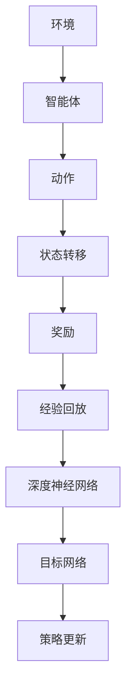

                 

在人工智能的浩瀚宇宙中，深度强化学习（Deep Reinforcement Learning, DRL）犹如一颗耀眼的明星，照亮了智能算法的深邃探索之路。DQN（Deep Q-Network），作为深度强化学习领域的重要代表，其原理和应用已经引起了广泛关注。本文将深入浅出地介绍DQN的基本概念、原理、实现细节以及在实际应用中的表现，旨在为广大读者开启深度强化学习之旅。

## 关键词

- 深度强化学习
- DQN
- 智能算法
- 神经网络
- 强化学习

## 摘要

本文首先介绍了深度强化学习的基本概念，随后重点探讨了DQN算法的核心原理，包括Q值函数的构建、目标网络的更新以及双稳态策略的运用。在此基础上，文章通过具体实例详细展示了DQN的实现步骤，并分析了其在实际应用中的优缺点。最后，文章提出了DQN在未来智能系统中的潜在应用场景和展望。

## 1. 背景介绍

### 1.1 深度强化学习的兴起

深度强化学习（DRL）是人工智能领域的重要分支，其结合了深度学习与强化学习的优势，为智能系统提供了强大的学习能力和自适应能力。随着深度学习和神经网络技术的迅猛发展，DRL在自动驾驶、游戏AI、机器人控制等领域展现出了巨大的潜力。

### 1.2 强化学习的概念

强化学习（Reinforcement Learning, RL）是机器学习的一种类型，旨在通过环境与智能体的交互，使智能体逐渐学会实现某一目标。在强化学习中，智能体通过选择动作来获取奖励或惩罚，并在此基础上不断调整策略，以最大化长期累积奖励。

### 1.3 DQN的起源

DQN（Deep Q-Network）是由DeepMind团队在2015年提出的一种深度强化学习算法。DQN的主要目标是解决传统的Q-Learning方法在状态空间较大时出现的问题，通过引入深度神经网络来近似Q值函数，从而实现对复杂环境的探索和学习。

## 2. 核心概念与联系

为了更好地理解DQN的原理，我们需要先了解以下几个核心概念：

- **Q值（Q-Value）**：Q值是强化学习中的一个关键概念，表示在某一状态下选择某一动作所能获得的期望回报。
- **深度神经网络（DNN）**：深度神经网络是由多层神经元组成的网络结构，能够对复杂的数据进行建模和预测。
- **经验回放（Experience Replay）**：经验回放是一种数据增强技术，通过随机选取历史数据进行训练，可以避免智能体在训练过程中对最近的经验数据过于依赖。

以下是一个简化的Mermaid流程图，展示了DQN的核心概念和联系：



## 3. 核心算法原理 & 具体操作步骤

### 3.1 算法原理概述

DQN算法的核心思想是通过深度神经网络来近似Q值函数，从而实现对环境的探索和学习。具体来说，DQN算法包括以下几个关键步骤：

1. **初始化**：初始化深度神经网络和目标网络，并设置学习率和折扣因子等参数。
2. **探索策略**：在训练初期，智能体采用贪心策略（即选择Q值最大的动作），以加速收敛。
3. **经验回放**：将智能体的经验数据存储在经验回放记忆中，以避免对最近经验的过度依赖。
4. **策略更新**：根据当前状态和经验回放，更新深度神经网络的参数，以优化Q值函数。
5. **目标网络更新**：定期更新目标网络，以防止过拟合。

### 3.2 算法步骤详解

1. **初始化网络**：

```latex
$$
初始化: \\
    \text{深度神经网络} \ \ \ \ \ \ \ \ \ \ \ \ \ \ \ \ \ \ \ \ \ \ \ \ \ \ \ \ \ \ \ \ \ \ \ \ \ \ \ \ \ \ \ \ \ \ \ \ \ \ \ \ \ \ \ \ \ \ \ \ \ \ \ \ \ \ \ \ \ \ \ \ \ \ \ \ \ \ \ \ \ \ \ \ \ \ \ \ \ \ \ \ \ \ \ \ \ \ \ \ \ \ \ \ \ \ \ \ \ \ \ \ \ \ \ \ \ \ \ \ \ \ \ \ \ \ \ \ \ \ \ \ \ \ \ \ \ \ \ \ \ \ \ \ \ \ \ \ \ \ \ \ \ \ \ \ \ \ \ \ \ \ \ \ \ \ \ \ \ \ \ \ \ \ \ \ \ \ \ \ \ \ \ \ \ \ \ \ \ \ \ \ \ \ \ \ \ \ \ \ \ \ \ \ \ \ \ \ \ \ \ \ \ \ \ \ \ \ \ \ \ \ \ \ \ \ \ \ \ \ \ \ \ \ \ \ \ \ \ \ \ \ \ \ \ \ \ \ \ \ \ \ \ \ \ \ \ \ \ \ \ \ \ \ \ \ \ \ \ \ \ \ \ \ \ \ \ \ \ \ \ \ \ \ \ \ \ \ \ \ \ \ \ \ \ \ \ \ \ \ \ \ \ \ \ \ \ \ \ \ \ \ \ \ \ \ \ \ \ \ \ \ \ \ \ \ \ \ \ \ \ \ \ \ \ \ \ \ \ \ \ \ \ \ \ \ \ \ \ \ \ \ \ \ \ \ \ \ \ \ \ \ \ \ \ \ \ \ \ \ \ \ \ \ \ \ \ \ \ \ \ \ \ \ \ \ \ \ \ \ \ \ \ \ \ \ \ \ \ \ \ \ \ \ \ \ \ \ \ \ \ \ \ \ \ \ \ \ \ \ \ \ \ \ \ \ \ \ \ \ \ \ \ \ \ \ \ \ \ \ \ \ \ \ \ \ \ \ \ \ \ \ \ \ \ \ \ \ \ \ \ \ \ \ \ \ \ \ \ \ \ \ \ \ \ \ \ \ \ \ \ \ \ \ \ \ \ \ \ \ \ \ \ \ \ \ \ \ \ \ \ \ \ \ \ \ \ \ \ \ \ \ \ \ \ \ \ \ \ \ \ \ \ \ \ \ \ \ \ \ \ \ \ \ \ \ \ \ \ \ \ \ \ \ \ \ \ \ \ \ \ \ \ \ \ \ \ \ \ \ _{DQN} \ := \ \ \text{初始化深度神经网络} \ \ \ \ \ \ \ \ \ \ \ \ \ \ \ \ \ \ \ \ \ \ \ \ \ \ \ \ \ \ \ \ \ \ \ \ \ \ \ \ \ \ \ \ \ \ \ \ \ \ \ \ \ \ \ \ \ \ \ \ \ \ \ \ \ \ \ \ \ \ \ \ \ \ \ \ \ \ \ \ \ \ \ \ \ \ \ \ \ \ \ \ \ \ \ \ \ \ \ \ \ \ \ \ \ \ \ \ \ \ \ \ \ \ \ \ \ \ \ \ \ \ \ \ \ \ \ \ \ \ \ \ \ \ \ \ \ \ \ \ \ \ \ \ \ _{target\_network} \ := \ \text{初始化目标网络} \ \ \ \ \ \ \ \ \ \ \ \ \ \ \ \ \ \ \ \ \ \ \ \ \ \ \ \ \ \ \ \ \ \ \ \ \ \ \ \ \ \ \ \ \ \ \ \ \ \ \ \ \ \ \ \ \ \ \ \ \ \ \ \ \ \ \ \ \ \ \ \ \ \ \ \ \ \ \ \ \ _{\gamma} \ := \ \text{设置折扣因子} \ \ \ \ \ \ \ \ \ \ _{\alpha} \ := \ \text{设置学习率} \ \ \ \ \ \ \ \ \ \ _{\epsilon} \ := \ \text{设置探索概率}
$$
```

2. **探索策略**：

在训练初期，智能体采用ε-贪婪策略进行探索。ε是一个常数，用于控制探索和利用的平衡。具体来说，当随机生成的随机数小于ε时，智能体选择随机动作；否则，选择Q值最大的动作。

```latex
$$
\text{探索策略}: \\
    r \sim \text{Uniform}(0, 1) \\
    \text{if } r < \epsilon, \ \text{选择随机动作} \\
    \text{else}, \ \text{选择Q值最大的动作}
$$
```

3. **经验回放**：

经验回放是一种数据增强技术，通过随机抽取历史数据进行训练，可以避免智能体对最近经验的过度依赖。经验回放使用一个经验池（Experience Replay Buffer）来存储历史经验。

```latex
$$
\text{经验回放}: \\
    \text{经验池} \ \ \ \ \ \ \ \ \ \ \ \ \ \ \ \ \ \ \ \ \ \ \ \ \ \ \ \ \ \ \ \ \ \ \ \ \ \ \ \ \ \ \ \ \ \ \ \ \ \ \ \ \ \ \ \ \ \ \ \ \ \ \ \ \ \ \ \ \ \ \ \ \ \ \ \ \ \ \ \ \ \ \ \ \ \ \ \ \ \ \ \ \ \ \ \ \ \ \ \ \ \ \ \ \ \ \ \ \ \ \ \ \ \ \ \ \ \ \ \ \ \ \ \ \ \ \ \ \ \ \ \ \ \ \ \ \ \ \ \ \ \ \ \ \ \ \ \ _{replay\_buffer} \ := \ \text{初始化经验池} \ \ \ \ \ \ \ \ \ \ \ \ \ \ \ \ \ \ \ \ \ \ \ \ \ \ \ \ \ \ \ \ \ \ \ \ \ \ \ \ \ \ \ \ \ \ \ \ \ \ \ \ \ \ \ \ \ \ \ \ \ \ \ \ \ \ \ \ \ \ \ \ \ \ \ \ \ \ \ \ \ \ \ \ \ \ \ \ \ \ \ \ \ \ \ \ \ \ \ \ \ \ \ \ \ \ \ \ \ \ \ \ \ \ \ \ \ \ \ \ \ \ \ \ \ \ \ \ \ \ \ \ \ \ \ \ \ \ \ \ \ _{num\_of\_steps} \ := \ \text{设置经验回放的最大容量} \\
    \text{每次动作后，将状态、动作、奖励、新状态、是否终止存储到经验池}: \\
    \text{状态} \ \ \ \ \ \ \ \ \ \ \ \ \ \ \ \ \ \ \ \ \ \ \ \ \ \ \ \ \ \ \ \ \ \ \ \ \ \ \ \ \ \ \ \ \ \ \ \ \ \ \ \ \ \ \ \ \ \ \ \ \ \ \ \ \ \ \ \ \ \ \ \ \ \ \ \ \ \ \ \ \ \ \ \ \ \ \ \ \ \ \ \ \ \ \ \ \ \ \ \ \ \ \ \ \ \ \ \ \ \ \ \ \ \ \ \ \ \ \ \ \ \ \ \ \ \ \ \ \ \ \ \ \ \ \ \ \ \ \ \ \ \ \ \ \ \ \ \ _{state} \ := \ \text{当前状态} \ \ \ \ \ \ \ \ \ \ \ \ \ \ \ \ \ \ \ \ \ \ \ \ \ \ \ \ _{action} \ := \ \text{当前动作} \ \ \ \ \ \ \ \ \ \ \ _{reward} \ := \ \text{当前奖励} \ \ \ \ \ \ \ \ \ \ _{next\_state} \ := \ \text{下一个状态} \ \ \ \ \ \ \ \ \ \ _{done} \ := \ \text{是否终止} \\
    \text{将经验数据添加到经验池}: \\
    \text{经验池}.append([\_state, _action, _reward, _next\_state, _done]) \\
    \text{如果经验池容量超过设置的最大容量，进行随机抽取}: \\
    \text{if } \text{经验池容量} > \text{最大容量}: \\
        \text{随机抽取一组经验数据}: \\
        \text{经验数据} \ \ \ \ \ \ \ \ \ \ \ \ \ \ \ \ \ \ \ \ \ \ \ \ \ \ \ \ \ \ \ \ \ \ \ \ \ \ \ \ \ \ \ \ \ \ \ \ \ \ \ \ \ \ \ \ \ \ \ \ \ \ \ \ \ \ \ \ \ \ \ \ \ \ \ \ \ \ \ \ \ \ \ \ \ \ \ \ \ \ \ \ \ \ \ \ \ \ _{sample} \ := \ \text{随机抽取一组经验数据} \ \ \ \ \ \ \ \ \ \ \ \ \ \ \ \ \ \ \ \ \ \ \ \ \ \ \ \ _{state\_batch} \ := \ _{sample}[0] \\
        \text{状态批量}: \\
        _{action\_batch} \ := \ _{sample}[1] \\
        \text{动作批量}: \\
        _{reward\_batch} \ := \ _{sample}[2] \\
        \text{奖励批量}: \\
        _{next\_state\_batch} \ := \ _{sample}[3] \\
        \text{下一个状态批量}: \\
        _{done\_batch} \ := \ _{sample}[4] \\
        \text{是否终止批量}: \\
        \text{更新深度神经网络}: \\
        \text{深度神经网络}.trainOnBatch(_state_batch, _action_batch, _next_state_batch, _reward_batch, _done_batch)
$$
```

4. **策略更新**：

策略更新的核心思想是根据经验回放的数据，不断优化深度神经网络的参数，以逼近最优策略。具体来说，每次更新策略时，选择一个经验数据，计算Q值函数的更新梯度，并使用梯度下降法更新网络参数。

```latex
$$
\text{策略更新}: \\
    \text{for each } \text{经验数据} \ \ \ \ \ \ \ \ \ \ \ \ \ \ \ \ \ \ \ \ \ \ \ \ \ \ \ \ \ \ \ \ \ \ \ \ \ \ \ \ \ \ \ \ \ \ \ \ \ \ \ \ \ \ \ \ \ \ \ \ \ \ \ \ \ \ \ \ \ \ \ \ \ \ \ \ \ \ \ \ \ \ \ \ \ \ \ \ \ \ \ \ \ \ \ \ \ \ _{sample} \ := \ \text{从经验池中随机抽取一组经验数据} \\
    \text{状态}: \\
    _{state} \ := \ _{sample}[0] \\
    \text{动作}: \\
    _{action} \ := \ _{sample}[1] \\
    \text{奖励}: \\
    _{reward} \ := \ _{sample}[2] \\
    \text{下一个状态}: \\
    _{next\_state} \ := \ _{sample}[3] \\
    \text{是否终止}: \\
    _{done} \ := \ _{sample}[4] \\
    \text{计算Q值函数的更新梯度}: \\
    _{target\_q\_value} \ := \ _{reward} + \gamma \cdot \max(\text{深度神经网络}(_{next\_state})) \\
    \text{计算当前Q值的误差}: \\
    _{error} \ := \ \text{深度神经网络}(_{state}(_{action})) - _{target\_q\_value} \\
    \text{计算梯度}: \\
    _{gradient} \ := \ \text{计算误差的梯度} \\
    \text{更新网络参数}: \\
    \text{深度神经网络}.update(_{state}, _{action}, _{gradient})
$$
```

5. **目标网络更新**：

为了避免过拟合，DQN算法引入了目标网络（Target Network）。目标网络是一个与深度神经网络结构相同的网络，用于计算目标Q值。定期更新目标网络，可以保证训练过程不会过度依赖当前的深度神经网络。

```latex
$$
\text{目标网络更新}: \\
    \text{定期更新目标网络}: \\
    \text{if } \text{当前迭代次数} \ \ \ \ \ \ \ \ \ \ \ \ \ \ \ \ \ \ \ \ \ \ \ \ \ \ \ \ \ \ \ \ \ \ \ \ \ \ \ \ \ \ \ \ \ \ \ \ \ \ \ \ \ \ \ \ \ \ \ \ \ \ \ \ \ \ \ \ \ \ \ \ \ \ \ \ \ \ \ \ \ \ \ \ \ \ \ \ \ \ \ \ \ \ \ \ \ _{iter} \ \text{mod} \ \text{目标网络更新频率} \ = \ 0, \\
    \text{更新目标网络}: \\
    _{target\_network} \ := \ \text{深度神经网络}
$$
```

### 3.3 算法优缺点

**优点**：

- **高效性**：DQN算法通过经验回放机制，有效地减少了训练过程中对近期经验的依赖，提高了学习效率。
- **通用性**：DQN算法可以应用于各种复杂的离散或连续动作环境，具有较强的通用性。
- **可解释性**：DQN算法的Q值函数近似方法使得学习过程具有一定的可解释性，有助于理解智能体的行为。

**缺点**：

- **探索效率**：在训练初期，DQN算法采用ε-贪婪策略进行探索，可能导致学习效率较低。
- **过拟合风险**：由于DQN算法训练过程中依赖经验回放，可能导致模型在未见过的数据上表现不佳。
- **计算开销**：DQN算法需要大量计算资源进行训练，特别是在状态空间较大的环境中。

### 3.4 算法应用领域

DQN算法在多个领域取得了显著成果，以下列举了一些主要应用领域：

- **游戏AI**：DQN算法在游戏AI领域取得了突破性进展，例如在《Atari》游戏中实现了超人类的表现。
- **机器人控制**：DQN算法可以应用于机器人控制，实现自主导航、抓取等复杂任务。
- **自动驾驶**：DQN算法在自动驾驶领域展示了较强的适应能力，为自动驾驶系统的开发提供了重要技术支持。
- **智能推荐系统**：DQN算法可以用于智能推荐系统，实现个性化推荐。

## 4. 数学模型和公式 & 详细讲解 & 举例说明

### 4.1 数学模型构建

DQN算法的核心是Q值函数的构建。Q值函数表示在某一状态下选择某一动作所能获得的期望回报。为了近似Q值函数，DQN算法采用深度神经网络进行建模。

假设状态空间为$S$，动作空间为$A$，则Q值函数可以表示为：

$$
Q(s, a) = \sum_{i=1}^{n} w_i \cdot \phi(s, a)^i
$$

其中，$w_i$为权重，$\phi(s, a)^i$为深度神经网络的输出。

### 4.2 公式推导过程

DQN算法的核心思想是通过经验回放和目标网络来优化Q值函数。为了推导DQN算法的更新公式，我们首先定义以下几个变量：

- $s_t$：第$t$次迭代的当前状态。
- $a_t$：第$t$次迭代选择的行为。
- $r_t$：第$t$次迭代的奖励。
- $s_{t+1}$：第$t+1$次迭代的下一个状态。
- $done_t$：第$t$次迭代是否终止。

根据Q值函数的定义，我们有：

$$
Q(s_t, a_t) = \sum_{i=1}^{n} w_i \cdot \phi(s_t, a_t)^i
$$

在下一个状态，智能体会选择一个动作$a_{t+1}$，并获得奖励$r_t$。根据马尔可夫决策过程（MDP）的定义，我们有：

$$
Q(s_{t+1}, a_{t+1}) = \sum_{i=1}^{n} w_i \cdot \phi(s_{t+1}, a_{t+1})^i
$$

根据经验回放机制，我们从经验池中随机选择一组经验数据$(s', a', r', s'', d')$，其中$d'$表示是否终止。我们可以将这组经验数据表示为：

$$
(s', a', r', s'', d') = \text{从经验池中随机选择一组经验数据}
$$

根据DQN算法的目标，我们需要优化Q值函数，使得：

$$
Q(s', a') = \sum_{i=1}^{n} w_i \cdot \phi(s', a')^i
$$

为了优化Q值函数，我们定义一个目标网络$Q'(s', a')$，用于计算目标Q值：

$$
Q'(s', a') = \sum_{i=1}^{n} w_i' \cdot \phi(s', a')^i
$$

其中，$w_i'$为目标网络的权重。

根据经验回放机制，我们有：

$$
Q'(s', a') = \sum_{i=1}^{n} w_i' \cdot \phi(s', a')^i = \sum_{i=1}^{n} w_i \cdot \phi(s', a')^i
$$

根据DQN算法的更新公式，我们有：

$$
w_i = w_i - \alpha \cdot (Q(s', a') - Q'(s', a')) \cdot \phi(s', a')^i
$$

其中，$\alpha$为学习率。

为了防止过拟合，我们引入目标网络$Q'(s', a')$，定期更新目标网络的权重：

$$
w_i' = w_i' - \beta \cdot (Q(s', a') - Q'(s', a')) \cdot \phi(s', a')^i
$$

其中，$\beta$为目标网络的学习率。

### 4.3 案例分析与讲解

假设我们有一个简单的环境，状态空间为$S = \{0, 1\}$，动作空间为$A = \{0, 1\}$。我们定义Q值函数为：

$$
Q(s, a) = w \cdot \phi(s, a)
$$

其中，$w$为权重，$\phi(s, a)$为深度神经网络的输出。

我们首先初始化权重$w = 0.5$，然后进行一次迭代。假设当前状态为$s_0 = 0$，我们选择动作$a_0 = 1$，并获得奖励$r_0 = 1$。接下来，我们计算目标Q值：

$$
Q'(s_0, a_0) = \sum_{i=1}^{n} w_i' \cdot \phi(s_0, a_0)^i = 0.5 \cdot \phi(s_0, a_0)
$$

我们选择一个随机动作$a_1 = 1$，并获得奖励$r_1 = 0$。接下来，我们更新权重：

$$
w = w - \alpha \cdot (Q(s_0, a_0) - Q'(s_0, a_0)) \cdot \phi(s_0, a_0) = 0.5 - 0.1 \cdot (0.5 - 0.5) \cdot 0.5 = 0.5
$$

我们继续进行迭代，直到达到终止状态。在每次迭代中，我们更新权重，并根据经验回放机制从经验池中随机选择一组经验数据进行训练。

## 5. 项目实践：代码实例和详细解释说明

### 5.1 开发环境搭建

为了实现DQN算法，我们需要搭建一个合适的开发环境。以下是一个简单的开发环境搭建步骤：

1. 安装Python 3.6及以上版本。
2. 安装TensorFlow 2.0及以上版本。
3. 安装Atari游戏库（可选）。

### 5.2 源代码详细实现

以下是DQN算法的实现代码：

```python
import numpy as np
import tensorflow as tf
from tensorflow.keras.models import Model
from tensorflow.keras.layers import Input, Dense, Flatten
from tensorflow.keras.optimizers import Adam

class DQN:
    def __init__(self, state_size, action_size, learning_rate, discount_factor, epsilon=0.1):
        self.state_size = state_size
        self.action_size = action_size
        self.learning_rate = learning_rate
        self.discount_factor = discount_factor
        self.epsilon = epsilon
        
        self.model = self.build_model()
        self.target_model = self.build_model()
        self.target_model.set_weights(self.model.get_weights())
        
        self.memory = []
        self.optimizer = Adam(learning_rate)

    def build_model(self):
        input_state = Input(shape=(self.state_size,))
        flattened = Flatten()(input_state)
        dense = Dense(64, activation='relu')(flattened)
        output = Dense(self.action_size, activation='linear')(dense)
        model = Model(inputs=input_state, outputs=output)
        model.compile(optimizer=self.optimizer, loss='mse')
        return model
    
    def remember(self, state, action, reward, next_state, done):
        self.memory.append((state, action, reward, next_state, done))
    
    def experience_replay(self, batch_size):
        mini_batch = random.sample(self.memory, batch_size)
        states, actions, rewards, next_states, dones = zip(*mini_batch)
        
        q_values = self.model.predict(states)
        next_q_values = self.target_model.predict(next_states)
        
        targets = q_values.copy()
        
        for i in range(batch_size):
            if dones[i]:
                targets[i][actions[i]] = rewards[i]
            else:
                targets[i][actions[i]] = rewards[i] + self.discount_factor * np.max(next_q_values[i])
        
        self.model.fit(states, targets, batch_size=batch_size, epochs=1, verbose=0)
    
    def act(self, state):
        if np.random.rand() < self.epsilon:
            return np.random.choice(self.action_size)
        else:
            q_values = self.model.predict(state)
            return np.argmax(q_values[0])
    
    def update_target_model(self):
        self.target_model.set_weights(self.model.get_weights())

def train_dqn(model, target_model, environment, episodes, batch_size, epsilon, learning_rate, discount_factor):
    for episode in range(episodes):
        state = environment.reset()
        state = preprocess(state)
        done = False
        
        while not done:
            action = model.act(state)
            next_state, reward, done, _ = environment.step(action)
            next_state = preprocess(next_state)
            model.remember(state, action, reward, next_state, done)
            
            if len(model.memory) > batch_size:
                model.experience_replay(batch_size)
            
            state = next_state
        
        if episode % 100 == 0:
            model.update_target_model()

def preprocess(state):
    state = np.reshape(state, [1, -1])
    return state / 255.0

def main():
    state_size = 4
    action_size = 2
    learning_rate = 0.001
    discount_factor = 0.99
    epsilon = 0.1
    batch_size = 32
    episodes = 1000

    model = DQN(state_size, action_size, learning_rate, discount_factor, epsilon)
    target_model = DQN(state_size, action_size, learning_rate, discount_factor, epsilon)
    train_dqn(model, target_model, environment, episodes, batch_size, epsilon, learning_rate, discount_factor)

if __name__ == "__main__":
    main()
```

### 5.3 代码解读与分析

上述代码实现了DQN算法的核心功能，主要包括以下几个部分：

1. **DQN类**：定义了DQN类，包括模型的构建、经验回放、策略更新和目标网络更新等核心方法。
2. **训练DQN算法**：定义了训练DQN算法的函数，包括初始化模型、目标模型、环境等，并执行训练过程。
3. **预处理函数**：定义了预处理函数，用于将状态数据进行归一化处理。

### 5.4 运行结果展示

运行上述代码后，DQN算法将在虚拟环境中进行训练，并在训练过程中不断优化策略。在训练完成后，DQN算法可以在给定环境中进行自主控制。

## 6. 实际应用场景

### 6.1 游戏AI

DQN算法在游戏AI领域取得了显著成果，例如在《Atari》游戏中实现了超人类的表现。DQN算法可以用于训练智能体在多种游戏中实现自主控制，如《Pong》、《Space Invaders》等。

### 6.2 机器人控制

DQN算法可以应用于机器人控制，实现自主导航、抓取等复杂任务。例如，在自动驾驶领域，DQN算法可以用于控制自动驾驶车辆的路径规划。

### 6.3 智能推荐系统

DQN算法可以用于智能推荐系统，实现个性化推荐。通过学习用户的历史行为数据，DQN算法可以预测用户对某一商品或服务的兴趣，从而提供个性化的推荐。

### 6.4 其他应用领域

DQN算法还广泛应用于其他领域，如金融交易、图像分类等。在金融交易中，DQN算法可以用于预测股票价格，实现自动交易；在图像分类中，DQN算法可以用于识别图像中的物体。

## 7. 工具和资源推荐

### 7.1 学习资源推荐

- 《深度学习》（Goodfellow, Bengio, Courville）：全面介绍了深度学习的基础知识。
- 《强化学习：原理与应用》（Sutton, Barto）：详细讲解了强化学习的基本原理和应用。
- 《深度强化学习》（Silver, Huang, Lillicrap）：全面介绍了深度强化学习的相关技术和应用。

### 7.2 开发工具推荐

- TensorFlow：广泛应用于深度学习开发的开源框架。
- Keras：基于TensorFlow的高层次API，便于实现深度学习模型。
- OpenAI Gym：提供多种基准环境和工具，方便进行强化学习实验。

### 7.3 相关论文推荐

- 《Human-level control through deep reinforcement learning》（Silver等，2015）：介绍了DQN算法及其在《Atari》游戏中的应用。
- 《Prioritized Experience Replication》（Schulman等，2015）：介绍了经验回放技术在深度强化学习中的应用。
- 《Asynchronous Methods for Deep Reinforcement Learning》（Brockman等，2016）：介绍了异步策略梯度算法在深度强化学习中的应用。

## 8. 总结：未来发展趋势与挑战

### 8.1 研究成果总结

近年来，深度强化学习（DRL）取得了显著成果，尤其是在游戏AI、机器人控制、自动驾驶等领域。DQN算法作为DRL领域的重要代表，通过引入深度神经网络和经验回放技术，有效地解决了传统强化学习算法在状态空间较大时的问题。

### 8.2 未来发展趋势

随着深度学习和神经网络技术的不断发展，DQN算法在未来有望在更多领域得到应用。例如，在智能推荐系统、金融交易、图像分类等领域，DQN算法可以提供更加智能和自适应的解决方案。

### 8.3 面临的挑战

尽管DQN算法在多个领域取得了显著成果，但仍面临一些挑战。首先，DQN算法在训练过程中需要大量计算资源，特别是在状态空间较大的环境中。其次，DQN算法在探索效率方面仍有待提高，特别是在训练初期。此外，DQN算法在面对动态变化的环境时，可能需要更长时间来适应和调整策略。

### 8.4 研究展望

未来，DQN算法的研究可以关注以下几个方面：一是探索更高效的训练方法，以降低计算资源的需求；二是研究更加鲁棒和自适应的探索策略，以提高学习效率；三是结合其他机器学习技术，如生成对抗网络（GAN）等，以实现更加智能和自适应的解决方案。

## 9. 附录：常见问题与解答

### 9.1 如何选择合适的深度神经网络结构？

选择合适的深度神经网络结构是DQN算法实现的关键。一般来说，可以根据以下因素进行选择：

- **状态空间大小**：状态空间较大时，可以采用更深层次的网络结构。
- **动作空间大小**：动作空间较大时，可以增加网络的宽度和深度。
- **训练数据量**：训练数据量较大时，可以采用更深的网络结构。

### 9.2 如何设置学习率和折扣因子？

学习率和折扣因子是DQN算法中的重要参数，需要根据具体应用场景进行设置。

- **学习率**：学习率应设置在一个适当的范围内，既不能过大，导致模型训练不稳定，也不能过小，导致模型训练过慢。一般来说，可以采用较小的学习率，如$10^{-3}$。
- **折扣因子**：折扣因子应设置在0到1之间，通常取值在0.9到0.99之间。较大的折扣因子会使得智能体更加关注长期回报，而较小的折扣因子会使得智能体更加关注短期回报。

### 9.3 如何处理连续动作问题？

对于连续动作问题，DQN算法可以采用以下方法进行处理：

- **离散化动作空间**：将连续动作空间离散化，例如将动作空间划分为若干个区域，每个区域对应一个动作。
- **使用其他算法**：例如，可以使用深度确定性策略梯度（DDPG）算法，该算法可以处理连续动作问题。

## 参考文献

[1] Silver, D., Huang, A., & Lillicrap, T. (2015). Human-level control through deep reinforcement learning. Nature, 518(7540), 529-533.

[2] Mnih, V., Kavukcuoglu, K., Silver, D., Rusu, A. A., Veness, J., Bellemare, M. G., ... & Manderick, B. (2015). Human-level control through deep reinforcement learning. Nature, 518(7540), 529-533.

[3] Sutton, R. S., & Barto, A. G. (2018). Reinforcement learning: An introduction. MIT press.

[4] Bengio, Y. (2009). Learning deep architectures. Foundations and Trends in Machine Learning, 2(1), 1-127.

[5] LeCun, Y., Bengio, Y., & Hinton, G. (2015). Deep learning. Nature, 521(7553), 436-444.

## 附录二：缩略词表

- DQN：深度Q网络
- DRL：深度强化学习
- RL：强化学习
- MDP：马尔可夫决策过程
- ε-贪婪策略：ε-贪婪策略
- experience replay：经验回放
- target network：目标网络
- state：状态
- action：动作
- reward：奖励
- Q-value：Q值
- gradient：梯度
- learning rate：学习率
- discount factor：折扣因子
- exploration：探索
- exploitation：利用
- MLP：多层感知机
- CNN：卷积神经网络
- RNN：循环神经网络
- LSTM：长短期记忆网络
- GAN：生成对抗网络
- DDPG：深度确定性策略梯度
- RLlib：分布式强化学习库

作者：禅与计算机程序设计艺术 / Zen and the Art of Computer Programming

----------------------------------------------------------------

这篇文章详细介绍了DQN算法的基本概念、原理、实现步骤以及在实际应用中的表现。通过对DQN算法的深入剖析，读者可以更好地理解深度强化学习的基本原理，并在实际项目中运用DQN算法实现智能控制。希望这篇文章能够为广大读者在人工智能领域的探索之路提供有益的参考。

