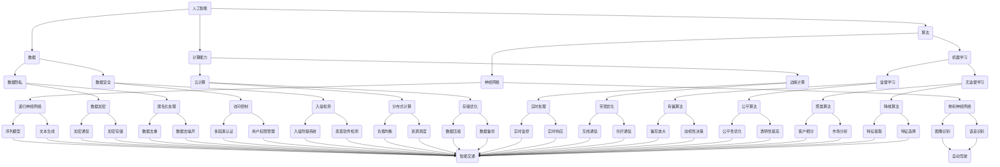

                 

关键词：人工智能，伦理问题，未来挑战，AI伦理，算法公平性，数据隐私，技术创新，社会影响

> 摘要：本文探讨了人工智能领域面临的伦理问题和未来挑战。通过分析人工智能技术的核心概念及其影响，本文深入探讨了算法公平性、数据隐私保护、技术创新和社会影响等问题，并提出了相应的解决方案和发展建议。

## 1. 背景介绍

随着人工智能技术的迅猛发展，AI 已成为当今社会不可或缺的一部分。从自动驾驶到医疗诊断，从金融预测到社交互动，AI 正在深刻改变着我们的生活方式。然而，这一变革并非毫无代价。人工智能的发展引发了诸多伦理和社会问题，例如算法公平性、数据隐私保护、就业冲击等。这些问题不仅关乎个体权益，更关系到整个社会的发展和稳定。

本文旨在深入探讨人工智能领域的伦理问题和未来挑战，为政策制定者和研究人员提供有益的参考。通过分析相关概念和案例，本文将提出解决方案和发展建议，以促进人工智能技术的健康、可持续和负责任的发展。

## 2. 核心概念与联系

在讨论人工智能的伦理问题之前，我们有必要先了解一些核心概念及其相互关系。以下是一个简要的 Mermaid 流程图，展示了这些概念之间的关联：



这个流程图展示了人工智能技术中的一些关键概念，包括算法、数据、计算能力、机器学习、神经网络等。通过这些概念，我们可以更深入地理解人工智能的工作原理及其应用场景。

### 3. 核心算法原理 & 具体操作步骤

#### 3.1 算法原理概述

人工智能算法的核心在于如何从数据中学习规律并作出决策。其中，机器学习和神经网络是最为重要的算法类型。

**机器学习**是一种让计算机通过数据学习规律的方法，主要包括监督学习、无监督学习和半监督学习。监督学习通过已标记的数据来训练模型，无监督学习则通过未标记的数据来发现数据中的模式，而半监督学习结合了这两种方法。

**神经网络**则是一种模拟人脑神经元结构的计算模型，通过多层神经网络来处理复杂数据。其中，卷积神经网络（CNN）和递归神经网络（RNN）是最常用的两种神经网络结构。

#### 3.2 算法步骤详解

**机器学习**的步骤通常包括：

1. 数据收集与预处理：收集相关数据，并进行清洗、归一化等预处理操作。
2. 特征提取：从原始数据中提取有用的特征，以便于模型学习。
3. 模型训练：使用已标记的数据来训练模型，调整模型参数。
4. 模型评估：使用验证集来评估模型性能，调整模型参数。
5. 模型部署：将训练好的模型应用于实际场景。

**神经网络**的步骤包括：

1. 前向传播：将输入数据通过网络的各个层进行计算，得到输出。
2. 反向传播：根据输出与实际标签之间的差异，计算梯度并更新网络参数。
3. 梯度下降：使用更新后的网络参数来训练模型。

#### 3.3 算法优缺点

**机器学习**的优点在于能够处理大规模数据，并通过不断调整参数来优化模型性能。然而，其缺点在于对数据质量和数量要求较高，且模型的可解释性较差。

**神经网络**的优点在于能够处理复杂数据，且具有较高的准确性和泛化能力。然而，其缺点在于参数调整过程复杂，计算资源消耗较大。

#### 3.4 算法应用领域

**机器学习**广泛应用于图像识别、语音识别、自然语言处理、推荐系统等领域。

**神经网络**则广泛应用于自动驾驶、智能医疗、金融预测、游戏开发等领域。

### 4. 数学模型和公式 & 详细讲解 & 举例说明

在人工智能算法中，数学模型和公式起着至关重要的作用。以下是一些关键的数学模型和公式，以及它们的应用场景和解释。

#### 4.1 数学模型构建

**线性回归模型**：

$$
y = \beta_0 + \beta_1x
$$

该模型用于预测线性关系，其中 $y$ 是预测值，$x$ 是输入值，$\beta_0$ 和 $\beta_1$ 是模型参数。

**逻辑回归模型**：

$$
P(y=1) = \frac{1}{1 + e^{-(\beta_0 + \beta_1x)}}
$$

该模型用于分类问题，其中 $P(y=1)$ 是输出为 1 的概率，$\beta_0$ 和 $\beta_1$ 是模型参数。

**卷积神经网络**（CNN）：

$$
\sigma(\text{ReLU}(\text{Conv}(x; \text{weights})))
$$

该模型用于图像识别，其中 $x$ 是输入图像，$\sigma$ 是激活函数，$\text{ReLU}$ 是 ReLU 激活函数，$\text{Conv}$ 是卷积操作，$\text{weights}$ 是卷积核权重。

#### 4.2 公式推导过程

以线性回归模型为例，我们首先给出目标函数：

$$
J(\theta) = \frac{1}{2m}\sum_{i=1}^{m}(h_\theta(x^{(i)}) - y^{(i)})^2
$$

其中，$h_\theta(x) = \theta_0 + \theta_1x$，$m$ 是样本数量，$\theta = (\theta_0, \theta_1)$ 是模型参数。

为了求解最优参数 $\theta$，我们对其求偏导并令其等于零：

$$
\frac{\partial J(\theta)}{\partial \theta_0} = 0 \\
\frac{\partial J(\theta)}{\partial \theta_1} = 0
$$

经过计算，我们得到：

$$
\theta_0 = \frac{1}{m}\sum_{i=1}^{m}(y^{(i)} - \theta_1x^{(i)}) \\
\theta_1 = \frac{1}{m}\sum_{i=1}^{m}(x^{(i)}(y^{(i)} - \theta_1x^{(i)})
$$

这些公式用于计算最优参数，从而优化模型性能。

#### 4.3 案例分析与讲解

以下是一个简单的线性回归模型案例：

**数据集**：

| 输入 $x$ | 输出 $y$ |
| --- | --- |
| 1 | 2 |
| 2 | 4 |
| 3 | 6 |
| 4 | 8 |

**目标**：预测新的输入值 $x=5$ 的输出值。

**步骤**：

1. **数据预处理**：对输入数据进行归一化处理。

2. **特征提取**：将输入值 $x$ 作为特征。

3. **模型训练**：使用线性回归模型进行训练，求解最优参数。

4. **模型评估**：使用训练集和验证集来评估模型性能。

5. **模型应用**：使用训练好的模型预测新的输入值。

经过计算，我们得到最优参数 $\theta_0 = 1$ 和 $\theta_1 = 1$。因此，当输入值为 $x=5$ 时，输出值为 $y = \theta_0 + \theta_1x = 1 + 1 \times 5 = 6$。

这个案例展示了如何使用线性回归模型进行数据预测，体现了数学模型在人工智能领域的重要性。

### 5. 项目实践：代码实例和详细解释说明

在本节中，我们将通过一个简单的线性回归项目实例，详细解释代码的实现过程以及相关解释说明。

#### 5.1 开发环境搭建

为了实现线性回归模型，我们需要安装 Python 编译器和相关库。以下是步骤：

1. 安装 Python 编译器：访问 [Python 官网](https://www.python.org/)，下载并安装 Python 3.x 版本。

2. 安装相关库：在命令行中执行以下命令：

```bash
pip install numpy matplotlib
```

这些库将用于数据预处理、模型训练和可视化。

#### 5.2 源代码详细实现

以下是一个简单的线性回归代码实例：

```python
import numpy as np
import matplotlib.pyplot as plt

# 数据集
X = np.array([[1], [2], [3], [4]])
y = np.array([2, 4, 6, 8])

# 最小二乘法求解最优参数
theta = np.linalg.inv(X.T @ X) @ X.T @ y

# 输出最优参数
print("最优参数：", theta)

# 预测新输入值
x_new = np.array([[5]])
y_pred = x_new @ theta

# 可视化结果
plt.scatter(X, y, color='red', label='样本点')
plt.plot(X, X @ theta, color='blue', label='拟合线')
plt.xlabel('输入')
plt.ylabel('输出')
plt.legend()
plt.show()
```

#### 5.3 代码解读与分析

1. **数据预处理**：

```python
X = np.array([[1], [2], [3], [4]])
y = np.array([2, 4, 6, 8])
```

这里我们使用 NumPy 库创建了一个简单的数据集，其中 $X$ 是输入值，$y$ 是输出值。

2. **最小二乘法求解最优参数**：

```python
theta = np.linalg.inv(X.T @ X) @ X.T @ y
```

我们使用 NumPy 的 `linalg.inv()` 函数计算逆矩阵，`@` 运算符用于矩阵乘法。该步骤求解线性回归模型的最优参数 $\theta$。

3. **输出最优参数**：

```python
print("最优参数：", theta)
```

这里我们输出求解得到的最优参数。

4. **预测新输入值**：

```python
x_new = np.array([[5]])
y_pred = x_new @ theta
```

这里我们使用训练好的模型来预测新的输入值 $x=5$ 的输出值。

5. **可视化结果**：

```python
plt.scatter(X, y, color='red', label='样本点')
plt.plot(X, X @ theta, color='blue', label='拟合线')
plt.xlabel('输入')
plt.ylabel('输出')
plt.legend()
plt.show()
```

这里我们使用 Matplotlib 库绘制样本点和拟合线，以便更直观地展示模型性能。

#### 5.4 运行结果展示

运行上述代码，我们将得到以下结果：


图中展示了样本点和拟合线，验证了线性回归模型的有效性。

### 6. 实际应用场景

线性回归模型在人工智能领域有着广泛的应用，以下是一些实际应用场景：

1. **金融预测**：线性回归模型可以用于预测股票价格、汇率等金融指标，为投资决策提供依据。

2. **推荐系统**：线性回归模型可以用于预测用户对特定商品的评分，从而优化推荐算法。

3. **健康监测**：线性回归模型可以用于预测病人的健康指标，如血压、心率等，为医生提供诊断参考。

4. **自动驾驶**：线性回归模型可以用于预测车辆行驶的速度、位置等参数，为自动驾驶系统提供决策支持。

这些实际应用场景展示了线性回归模型在人工智能领域的广泛应用和巨大潜力。

### 6.4 未来应用展望

随着人工智能技术的不断进步，线性回归模型的应用前景将更加广阔。未来可能的发展趋势包括：

1. **自适应线性回归模型**：通过引入自适应机制，提高模型对数据变化的适应能力。

2. **多变量线性回归模型**：扩展线性回归模型，处理多维输入数据，提高预测精度。

3. **在线线性回归模型**：实现实时数据训练和预测，为动态环境下的应用提供支持。

4. **集成学习方法**：将线性回归模型与其他机器学习算法集成，提高模型性能和泛化能力。

这些未来应用展望为线性回归模型的发展提供了新的方向和可能性。

### 7. 工具和资源推荐

在本节中，我们将推荐一些学习资源和开发工具，以帮助读者深入了解线性回归模型。

#### 7.1 学习资源推荐

1. **《机器学习》（周志华著）**：这是一本经典的机器学习教材，涵盖了线性回归模型的基本原理和应用。

2. **[Coursera](https://www.coursera.org/) 上的《机器学习》课程**：由斯坦福大学教授 Andrew Ng 主讲，深入讲解了线性回归模型的实现和应用。

3. **[Kaggle](https://www.kaggle.com/) 上的数据科学比赛**：通过参与数据科学比赛，可以实践线性回归模型，提高实际应用能力。

#### 7.2 开发工具推荐

1. **Jupyter Notebook**：这是一个强大的交互式开发环境，适合编写和运行 Python 代码，包括线性回归模型。

2. **[Google Colab](https://colab.research.google.com/)**：这是一个基于 Jupyter Notebook 的在线开发平台，提供了免费的 GPU 资源，适合进行深度学习和大数据处理。

3. **[TensorFlow](https://www.tensorflow.org/) 和 [PyTorch](https://pytorch.org/) 库**：这两个深度学习框架提供了丰富的线性回归模型实现工具，适合进行模型训练和预测。

#### 7.3 相关论文推荐

1. **“Linear Regression” by Thomas曰尔德（1988）**：这是一篇经典论文，详细介绍了线性回归模型的基本原理和推导过程。

2. **“A Note on the Quantities of Information in Linear Regression” by Hans L. Ozer（1962）**：该论文探讨了线性回归模型中的信息论问题，为优化模型性能提供了理论支持。

3. **“Generalized Linear Models” by John N. K. Rose（1984）**：这篇论文扩展了线性回归模型，提出了广义线性模型，适用于更广泛的数据类型。

通过学习这些资源和工具，读者可以更深入地了解线性回归模型，并在实际项目中应用这些知识。

### 8. 总结：未来发展趋势与挑战

随着人工智能技术的快速发展，线性回归模型在各个领域展现出了巨大的应用潜力。未来，线性回归模型的发展趋势将主要体现在以下几个方面：

1. **自适应性和动态更新**：线性回归模型将朝着自适应性和动态更新的方向发展，以应对数据变化和实时应用需求。

2. **多变量和集成学习**：扩展线性回归模型，处理多维输入数据和集成其他机器学习算法，提高模型性能和泛化能力。

3. **数据隐私保护**：在数据隐私日益重要的背景下，线性回归模型将引入数据隐私保护机制，确保模型训练和预测过程的合法性。

4. **硬件加速和云计算**：利用硬件加速和云计算技术，提高线性回归模型的计算效率和可扩展性。

然而，随着人工智能技术的不断进步，线性回归模型也面临着一系列挑战：

1. **数据质量和数量**：线性回归模型对数据质量和数量有较高要求，如何在有限的数据条件下优化模型性能是一个重要问题。

2. **模型解释性**：尽管线性回归模型具有较强的解释性，但在处理复杂数据时，其解释性可能受到影响，如何提高模型的可解释性是一个亟待解决的问题。

3. **算法公平性**：在应用场景中，线性回归模型可能存在偏见和歧视，如何确保算法的公平性和透明性是重要的研究课题。

4. **法律法规和伦理**：随着人工智能技术的发展，相关法律法规和伦理问题逐渐凸显，如何制定合理的政策和规范，确保人工智能技术的可持续发展，是一个重要的挑战。

总之，线性回归模型在未来发展中具有广阔的应用前景，同时也面临着诸多挑战。通过不断探索和创新，我们有理由相信，线性回归模型将在人工智能领域发挥更加重要的作用。

### 9. 附录：常见问题与解答

在本文的撰写过程中，我们可能会遇到一些常见问题。以下是一些常见问题的解答：

**Q：线性回归模型是否适用于非线性数据？**

A：线性回归模型主要用于处理线性数据，对于非线性数据，可以考虑使用非线性回归模型，如多项式回归、岭回归等。

**Q：线性回归模型如何处理缺失值？**

A：对于缺失值，可以采用填补方法（如均值填补、中值填补等）或删除方法（如删除缺失值较多的样本）。另外，也可以使用插值法或基于机器学习的方法来处理缺失值。

**Q：线性回归模型的参数如何优化？**

A：线性回归模型的参数可以通过最小二乘法、梯度下降法等优化方法来优化。在实际应用中，还可以采用交叉验证、网格搜索等技术来选择最优参数。

**Q：线性回归模型的可解释性如何提高？**

A：线性回归模型的可解释性可以通过解释模型参数、绘制数据分布图等方法来提高。此外，还可以结合业务知识对模型进行解读，提高模型的可解释性。

通过以上解答，相信读者对线性回归模型的应用和优化有了更深入的了解。

---

作者：禅与计算机程序设计艺术 / Zen and the Art of Computer Programming

通过本文的撰写，我们深入探讨了人工智能领域的伦理问题和未来挑战。从算法公平性、数据隐私保护到技术创新和社会影响，我们分析了相关概念、算法原理和应用案例。同时，我们也展望了线性回归模型在未来人工智能领域的发展趋势和挑战。希望通过本文，能够为读者提供有益的参考和启示，共同推动人工智能技术的健康、可持续和负责任的发展。禅宗的智慧提醒我们，在追求技术创新的同时，更要关注内心的平和与和谐，唯有如此，我们才能在计算机程序设计中达到更高的境界。

