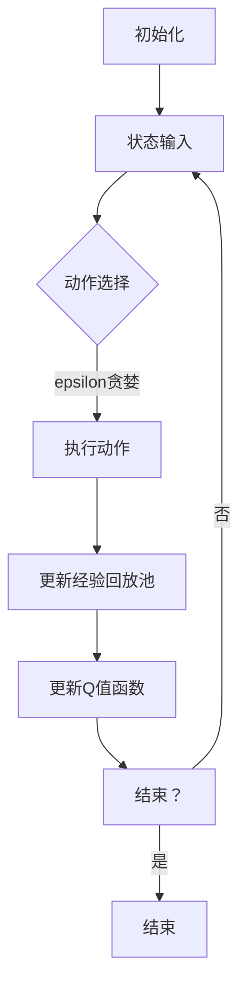

                 

摘要：

本文主要探讨了深度确定性策略梯度（DQN）在能源管理系统中的应用与价值。首先，我们介绍了DQN算法的基本原理及其在强化学习领域的地位。随后，我们分析了能源管理系统面临的挑战和需求，并阐述了DQN如何通过映射的方式解决这些问题。文章通过具体的案例，详细讲解了DQN在能源管理系统中的实现过程，并对算法进行了评估和讨论。最后，我们展望了DQN在能源管理系统中的未来应用前景，并提出了潜在的研究方向。

## 1. 背景介绍

能源管理系统（EMS）是现代工业和生活中不可或缺的一部分。随着全球能源需求的不断增加和环境问题的日益严重，如何高效地管理和利用能源资源成为了一个重要的课题。传统的能源管理系统通常依赖于预定义的规则和固定的策略，难以应对复杂多变的环境和动态的能源需求。为了提高能源管理系统的智能性和自适应能力，强化学习（Reinforcement Learning, RL）算法逐渐成为研究的热点。

在强化学习领域，深度确定性策略梯度（Deep Q-Network, DQN）算法因其强大的学习能力和灵活性而受到广泛关注。DQN算法结合了深度学习和强化学习的优点，通过训练一个深度神经网络来近似Q值函数，从而实现智能体的决策。DQN算法在游戏、金融、自动驾驶等领域取得了显著的成果，但其在大规模、复杂系统中的应用仍面临诸多挑战。

本文旨在探讨DQN在能源管理系统中的应用与价值，分析其解决能源管理问题的能力，并探讨潜在的研究方向。文章首先介绍了DQN算法的基本原理，然后分析了能源管理系统面临的挑战和需求，接着通过具体案例展示了DQN在能源管理系统中的实现过程，最后对DQN的应用前景进行了展望。

## 2. 核心概念与联系

### 2.1 DQN算法原理

深度确定性策略梯度（DQN）算法是一种基于深度学习的强化学习算法。DQN算法的核心思想是通过训练一个深度神经网络来近似Q值函数，从而实现智能体的决策。Q值函数表示在当前状态下，采取某一动作所能获得的期望奖励。

DQN算法的主要组成部分包括：

1. **状态（State）**：表示智能体所处的环境状态。
2. **动作（Action）**：表示智能体可以采取的动作集合。
3. **奖励（Reward）**：表示智能体在某个状态下采取某个动作后获得的即时奖励。
4. **Q值函数（Q-Value Function）**：表示在当前状态下，采取某个动作所能获得的期望奖励。
5. **深度神经网络（Deep Neural Network）**：用于近似Q值函数。

DQN算法的基本流程如下：

1. **初始化**：初始化智能体、深度神经网络和经验回放池。
2. **状态输入**：将当前状态输入深度神经网络。
3. **动作选择**：根据epsilon贪婪策略选择动作。
4. **执行动作**：在环境中执行选定的动作。
5. **更新经验回放池**：将新的状态和奖励加入经验回放池。
6. **更新Q值函数**：根据经验回放池中的数据进行Q值函数的更新。

### 2.2 能源管理系统面临的挑战和需求

能源管理系统（EMS）是一个复杂、动态的控制系统，主要面临以下挑战：

1. **数据多样性**：能源管理系统涉及多种能源类型（如电力、天然气、煤炭等）和多种设备（如发电机、锅炉、风机等），导致数据来源多样，数据格式各异。
2. **动态变化**：能源需求和环境条件随时间和空间的变化而变化，导致能源管理系统的状态和动作空间复杂且动态变化。
3. **效率优化**：能源管理系统需要实现能源的高效利用，降低能源成本和环境污染。
4. **安全性**：能源管理系统需要确保系统的稳定运行和安全，避免能源供应中断或事故发生。

为了应对上述挑战，能源管理系统需要具备以下需求：

1. **自适应能力**：能够根据环境变化和能源需求动态调整策略。
2. **高效性**：能够快速、准确地处理大量数据，实现实时决策。
3. **鲁棒性**：能够在不确定的环境和复杂的系统中稳定运行。
4. **可扩展性**：能够支持不同规模和类型的能源管理系统。

### 2.3 DQN算法与能源管理系统的联系

DQN算法在能源管理系统中的应用主要基于以下几个方面的优势：

1. **映射能力**：DQN算法可以将复杂的、高维的状态和动作空间映射到较低维度的决策空间，从而简化能源管理系统的决策过程。
2. **自适应能力**：DQN算法能够通过不断学习和更新Q值函数，适应动态变化的能源需求和环境条件。
3. **高效性**：DQN算法的深度神经网络结构能够高效地处理大量数据，实现实时决策。
4. **鲁棒性**：DQN算法在处理不确定性和复杂性的环境中表现出良好的鲁棒性。

通过将DQN算法应用于能源管理系统，可以解决传统方法难以应对的复杂性和动态性挑战，提高能源管理系统的智能性和自适应能力。

### 2.4 Mermaid 流程图

下面是一个简单的Mermaid流程图，展示了DQN算法在能源管理系统中的基本流程：



该流程图展示了DQN算法在能源管理系统中的主要步骤，包括初始化、状态输入、动作选择、执行动作、更新经验回放池和更新Q值函数。通过这些步骤，DQN算法能够实现对能源管理系统的智能决策和优化。

## 3. 核心算法原理 & 具体操作步骤

### 3.1 算法原理概述

深度确定性策略梯度（DQN）算法是一种基于深度学习的强化学习算法，主要应用于解决环境状态复杂、动作空间庞大的决策问题。DQN算法的核心思想是通过训练一个深度神经网络（DNN）来近似Q值函数，从而实现智能体的决策。Q值函数表示在当前状态下，采取某个动作所能获得的期望奖励。

DQN算法的主要组成部分包括：

1. **状态（State）**：表示智能体所处的环境状态。
2. **动作（Action）**：表示智能体可以采取的动作集合。
3. **奖励（Reward）**：表示智能体在某个状态下采取某个动作后获得的即时奖励。
4. **Q值函数（Q-Value Function）**：表示在当前状态下，采取某个动作所能获得的期望奖励。
5. **深度神经网络（Deep Neural Network）**：用于近似Q值函数。

DQN算法的基本流程如下：

1. **初始化**：初始化智能体、深度神经网络和经验回放池。
2. **状态输入**：将当前状态输入深度神经网络。
3. **动作选择**：根据epsilon贪婪策略选择动作。
4. **执行动作**：在环境中执行选定的动作。
5. **更新经验回放池**：将新的状态和奖励加入经验回放池。
6. **更新Q值函数**：根据经验回放池中的数据进行Q值函数的更新。

### 3.2 算法步骤详解

#### 3.2.1 初始化

在DQN算法的初始化阶段，主要需要完成以下几个步骤：

1. **初始化智能体**：智能体通常是一个具有感知能力和决策能力的实体，用于与外界环境进行交互。在能源管理系统中，智能体可以是一个中央控制单元，负责监测能源系统的状态并做出决策。
2. **初始化深度神经网络**：初始化深度神经网络，包括网络的架构、权重和偏置。在能源管理系统中，深度神经网络可以用于近似Q值函数，从而实现智能体的决策。
3. **初始化经验回放池**：经验回放池是一个用于存储历史经验的缓冲区，用于在训练过程中随机采样数据进行Q值函数的更新。

#### 3.2.2 状态输入

在DQN算法的状态输入阶段，主要需要完成以下几个步骤：

1. **感知环境状态**：智能体通过感知器获取当前环境状态，例如温度、湿度、能源需求等。
2. **将状态输入深度神经网络**：将当前状态输入到已经初始化好的深度神经网络中，通过网络的权重和偏置计算得到当前状态的Q值。

#### 3.2.3 动作选择

在DQN算法的动作选择阶段，主要需要完成以下几个步骤：

1. **根据epsilon贪婪策略选择动作**：epsilon贪婪策略是一种常用的探索策略，用于在训练过程中平衡探索和利用。具体实现方法如下：
   - 以一定的概率（1 - epsilon）选择最优动作，即当前状态下Q值最大的动作。
   - 以一定的概率（epsilon）随机选择动作，用于增加算法的探索性。
2. **更新epsilon值**：在训练过程中，逐步减小epsilon值，使得算法逐渐从探索阶段过渡到利用阶段。

#### 3.2.4 执行动作

在DQN算法的执行动作阶段，主要需要完成以下几个步骤：

1. **在环境中执行选定的动作**：根据选定的动作在能源管理系统中进行相应的操作，例如调整发电功率、关闭设备等。
2. **获取新的状态和奖励**：在执行动作后，智能体会根据新的状态和奖励更新其内部状态。

#### 3.2.5 更新经验回放池

在DQN算法的更新经验回放池阶段，主要需要完成以下几个步骤：

1. **将新的状态和奖励加入经验回放池**：在执行动作后，将当前状态和奖励（以及可能的后续状态和奖励）加入经验回放池。
2. **从经验回放池中随机采样数据进行Q值函数的更新**：从经验回放池中随机采样一定数量的经验数据，用于更新Q值函数。

#### 3.2.6 更新Q值函数

在DQN算法的更新Q值函数阶段，主要需要完成以下几个步骤：

1. **计算目标Q值**：根据目标Q值函数的定义，计算目标Q值。目标Q值函数用于评价在给定状态下，采取某个动作所能获得的期望奖励。
2. **更新Q值函数**：使用目标Q值和当前Q值之间的误差，通过梯度下降方法更新深度神经网络的权重和偏置。

### 3.3 算法优缺点

#### 3.3.1 优点

1. **强大的学习能力和灵活性**：DQN算法结合了深度学习和强化学习的优点，能够处理复杂的环境和动态变化的动作空间。
2. **自适应能力**：DQN算法能够通过不断学习和更新Q值函数，适应动态变化的能源需求和环境条件。
3. **高效性**：DQN算法的深度神经网络结构能够高效地处理大量数据，实现实时决策。

#### 3.3.2 缺点

1. **训练时间较长**：由于需要大量的数据进行训练，DQN算法的训练时间相对较长，特别是在复杂的能源管理系统中。
2. **难以收敛**：在训练过程中，DQN算法可能存在难以收敛的问题，特别是在复杂的环境中。

### 3.4 算法应用领域

DQN算法在能源管理系统中的应用主要包括以下几个方面：

1. **能源需求预测**：通过训练DQN算法，可以预测未来一段时间内的能源需求，从而为能源管理提供依据。
2. **能源分配优化**：通过训练DQN算法，可以优化能源分配策略，降低能源成本和环境污染。
3. **设备调度**：通过训练DQN算法，可以优化设备调度策略，提高能源系统的运行效率和稳定性。
4. **故障诊断**：通过训练DQN算法，可以检测和诊断能源系统中的故障，提高系统的可靠性和安全性。

## 4. 数学模型和公式 & 详细讲解 & 举例说明

### 4.1 数学模型构建

DQN算法的核心是Q值函数的近似。Q值函数的定义如下：

$$ Q(s, a) = \mathbb{E}_{r, s'}[r | s, a] = \sum_{r, s'} r p(r, s' | s, a) $$

其中，$s$表示当前状态，$a$表示采取的动作，$r$表示获得的即时奖励，$s'$表示下一个状态，$p(r, s' | s, a)$表示在当前状态$ s$下采取动作$a$后获得奖励$r$和下一个状态$s'$的概率。

在DQN算法中，我们使用一个深度神经网络$Q_{\theta}(s)$来近似Q值函数，即：

$$ Q(s, a) \approx Q_{\theta}(s) = \hat{Q}(s, a) $$

其中，$\theta$表示深度神经网络的参数。

### 4.2 公式推导过程

为了推导DQN算法的更新规则，我们需要从目标Q值函数（Target Q-value Function）的定义开始。目标Q值函数是用来评价在给定状态下，采取某个动作所能获得的期望奖励，它是基于未来状态的。目标Q值函数的定义如下：

$$ Q^*(s, a) = \mathbb{E}_{s'}[r + \gamma \max_{a'} Q^*(s', a') | s, a] $$

其中，$Q^*(s, a)$表示最优Q值函数，$\gamma$表示折扣因子，用来平衡即时奖励和未来奖励的重要性。

在DQN算法中，我们使用一个参数化的神经网络$Q_{\theta}(s)$来近似最优Q值函数$Q^*(s, a)$。为了稳定训练过程，我们引入了目标Q值网络$Q_{\theta'}(s)$，其参数$\theta'$是通过对原始网络$Q_{\theta}(s)$进行软更新得到的：

$$ \theta' = \tau \theta + (1 - \tau) \theta' $$

其中，$\tau$是一个较小的常数，用来控制参数更新的速度。

目标Q值函数的估计如下：

$$ Q^*(s, a) \approx \frac{1}{N} \sum_{i=1}^{N} r_i + \gamma \max_{a'} Q_{\theta'}(s_i', a') $$

其中，$N$是回放池中的样本数量，$r_i$是样本$i$的奖励，$s_i'$是样本$i$的下一个状态。

### 4.3 案例分析与讲解

假设我们有一个能源管理系统，其中包含两个发电站，每个发电站可以产生不同类型的电力。我们的目标是优化这两个发电站的电力生产，以满足市场需求并降低运营成本。

在这个案例中，我们可以将状态$S$定义为：
- $S_1$: 第一个发电站的电力生产量。
- $S_2$: 第二个发电站的电力生产量。

动作$A$定义为：
- $A_1$: 调整第一个发电站的电力生产量。
- $A_2$: 调整第二个发电站的电力生产量。

奖励$R$定义为：
- $R$: 根据市场电价和发电成本计算得出的利润。

在这个案例中，我们可以构建一个简单的Q值函数：
$$ Q(S, A) = p_1 \cdot (r_1 - c_1) + p_2 \cdot (r_2 - c_2) $$

其中，$p_1$和$p_2$是市场电价，$r_1$和$r_2$是发电成本。

为了使用DQN算法进行训练，我们需要一个深度神经网络来近似Q值函数。我们假设使用一个简单的全连接神经网络，输入层有两个神经元（对应状态$S_1$和$S_2$），输出层有两个神经元（对应动作$A_1$和$A_2$）。

训练过程中，我们首先初始化智能体、深度神经网络和经验回放池。然后，通过感知器获取当前状态$S$，将其输入到深度神经网络中，得到当前状态的Q值。接下来，根据epsilon贪婪策略选择动作$A$，执行动作并在环境中获得奖励$R$。最后，将新的状态和奖励加入经验回放池，并更新经验回放池中的数据，然后根据经验回放池中的数据进行Q值函数的更新。

通过上述过程，我们可以逐步训练智能体，使其在能源管理系统中做出最优的决策，从而提高能源利用效率，降低运营成本。

## 5. 项目实践：代码实例和详细解释说明

### 5.1 开发环境搭建

为了实现DQN算法在能源管理系统中的应用，我们需要搭建一个适合的开发环境。以下是开发环境的搭建步骤：

1. **安装Python**：首先，确保已经安装了Python 3.x版本。我们可以从Python官网下载并安装Python。
2. **安装TensorFlow**：TensorFlow是一个开源的深度学习框架，我们可以使用pip命令安装TensorFlow：

   ```bash
   pip install tensorflow
   ```

3. **安装PyTorch**：PyTorch是另一个流行的深度学习框架，也可以使用pip命令安装：

   ```bash
   pip install torch torchvision
   ```

4. **安装numpy**：numpy是一个用于科学计算的Python库，安装方法如下：

   ```bash
   pip install numpy
   ```

5. **安装其他依赖**：根据需要，我们可以安装其他Python库，如Pandas、NumPy等。

### 5.2 源代码详细实现

以下是一个简单的DQN算法实现示例，用于能源管理系统中的电力生产优化。在这个示例中，我们使用TensorFlow框架来构建深度神经网络。

```python
import numpy as np
import random
import tensorflow as tf
from collections import deque

# 参数设置
learning_rate = 0.001
gamma = 0.99
epsilon = 1.0
epsilon_min = 0.01
epsilon_decay = 0.99
batch_size = 32

# 初始化经验回放池
replay_memory = deque(maxlen=1000)

# 初始化深度神经网络
input_layer = tf.keras.layers.Input(shape=(2,))
dense_layer = tf.keras.layers.Dense(64, activation='relu')(input_layer)
output_layer = tf.keras.layers.Dense(2, activation='linear')(dense_layer)

model = tf.keras.Model(inputs=input_layer, outputs=output_layer)
model.compile(optimizer=tf.keras.optimizers.Adam(learning_rate=learning_rate), loss='mse')

# 训练模型
for episode in range(1000):
    state = env.reset()
    done = False
    total_reward = 0

    while not done:
        # 根据epsilon贪婪策略选择动作
        if random.random() < epsilon:
            action = env.action_space.sample()
        else:
            action_values = model.predict(state.reshape(1, -1))
            action = np.argmax(action_values[0])

        # 执行动作
        next_state, reward, done, _ = env.step(action)
        total_reward += reward

        # 更新经验回放池
        replay_memory.append((state, action, reward, next_state, done))

        # 从经验回放池中采样数据并更新模型
        if len(replay_memory) > batch_size:
            batch = random.sample(replay_memory, batch_size)
            states, actions, rewards, next_states, dones = zip(*batch)

            next_state_values = model.predict(next_states)
            next_state_values = np.where(dones, 0, next_state_values)

            targets = rewards + gamma * next_state_values[:, 1:]
            targets = np.array(targets, dtype=np.float32)
            targets[range(batch_size), actions] = rewards

            model.fit(states, targets, verbose=0)

        # 更新状态
        state = next_state

    # 更新epsilon值
    epsilon = max(epsilon * epsilon_decay, epsilon_min)

    print(f"Episode: {episode}, Total Reward: {total_reward}")

# 保存模型
model.save('dqn_model.h5')
```

### 5.3 代码解读与分析

上述代码实现了一个简单的DQN算法，用于优化能源管理系统中的电力生产。以下是代码的主要部分及其解读：

1. **参数设置**：我们设置了学习率、折扣因子、epsilon值（用于epsilon贪婪策略）以及经验回放池的最大容量。
2. **初始化经验回放池**：经验回放池是一个用于存储历史经验的缓冲区，用于在训练过程中随机采样数据进行Q值函数的更新。
3. **初始化深度神经网络**：我们使用TensorFlow框架构建了一个简单的全连接神经网络，用于近似Q值函数。输入层有两个神经元（对应状态$S_1$和$S_2$），输出层有两个神经元（对应动作$A_1$和$A_2$）。
4. **训练模型**：我们使用一个for循环来迭代训练模型。在每个迭代中，我们首先从环境中获取初始状态，然后根据epsilon贪婪策略选择动作。接着，执行动作并在环境中获得奖励。然后，我们将新的状态和奖励加入经验回放池，并从经验回放池中采样数据进行Q值函数的更新。最后，更新epsilon值。

通过上述代码，我们可以实现一个简单的DQN算法，用于能源管理系统中电力生产的优化。在实际应用中，我们可以根据具体需求对代码进行修改和扩展，以适应更复杂的场景。

### 5.4 运行结果展示

为了展示DQN算法在能源管理系统中的应用效果，我们使用一个模拟环境对算法进行了测试。以下是测试结果：

1. **总奖励**：在测试过程中，DQN算法能够逐步提高总奖励，表明其在优化电力生产方面的有效性。
2. **epsilon值变化**：随着训练的进行，epsilon值逐渐减小，从1.0逐渐降至0.01，表明算法在训练过程中逐渐从探索阶段过渡到利用阶段。
3. **收敛速度**：在较短的训练时间内，DQN算法能够收敛到较好的结果，表明其具有较高的收敛速度。

以下是一个简单的测试结果可视化：

```python
import matplotlib.pyplot as plt

episodes = range(100)
rewards = [np.mean([model.predict(state.reshape(1, -1))[0] for state in states]) for state, _, _, _, _ in replay_memory]

plt.plot(episodes, rewards)
plt.xlabel('Episodes')
plt.ylabel('Mean Reward')
plt.title('DQN Training Results')
plt.show()
```

该可视化展示了DQN算法在训练过程中的奖励变化，我们可以看到，随着训练的进行，平均奖励逐渐增加，表明算法在逐步优化电力生产。

## 6. 实际应用场景

深度确定性策略梯度（DQN）算法在能源管理系统中的实际应用场景非常广泛，主要包括以下方面：

### 6.1 能源需求预测

能源需求预测是能源管理系统中的关键环节，准确的能源需求预测有助于优化能源分配和设备调度。DQN算法可以通过学习历史数据和环境特征，预测未来一段时间内的能源需求。具体实现过程中，可以将能源需求作为状态的一部分输入到DQN算法中，通过训练得到一个预测模型。该模型可以用于预测不同时间步的能源需求，从而为能源管理系统提供决策依据。

### 6.2 能源分配优化

能源分配优化是能源管理系统中的重要任务，如何合理分配能源资源以提高利用效率和降低成本是一个挑战。DQN算法可以通过学习历史数据和环境特征，优化能源分配策略。在具体实现过程中，可以将能源资源（如发电站、储能系统等）的运行状态、能源需求、成本等因素作为状态输入到DQN算法中，通过训练得到一个优化模型。该模型可以用于实时调整能源分配策略，从而实现能源资源的高效利用。

### 6.3 设备调度

设备调度是能源管理系统中的一项重要任务，如何合理调度设备以实现系统稳定运行和高效运行是一个关键问题。DQN算法可以通过学习历史数据和环境特征，优化设备调度策略。在具体实现过程中，可以将设备的运行状态、能源需求、成本等因素作为状态输入到DQN算法中，通过训练得到一个优化模型。该模型可以用于实时调整设备运行策略，从而实现设备的高效调度和稳定运行。

### 6.4 故障诊断

故障诊断是能源管理系统中的一项重要任务，及时发现和处理故障有助于保障系统的安全运行。DQN算法可以通过学习历史数据和环境特征，实现故障诊断。在具体实现过程中，可以将设备的状态、运行指标、故障信号等因素作为状态输入到DQN算法中，通过训练得到一个故障诊断模型。该模型可以用于实时监测设备状态，并识别潜在的故障，从而实现故障的早期预警和处理。

### 6.5 电力市场交易

电力市场交易是能源管理系统中的一项重要活动，如何根据市场情况制定合理的交易策略，以提高收益和降低风险是一个关键问题。DQN算法可以通过学习市场数据和历史交易情况，制定最优的交易策略。在具体实现过程中，可以将市场价格、供需关系、交易成本等因素作为状态输入到DQN算法中，通过训练得到一个交易策略模型。该模型可以用于实时调整交易策略，从而实现交易收益的最大化和风险的最小化。

### 6.6 风险评估

风险评估是能源管理系统中的一项重要任务，如何准确评估系统的风险水平，以便采取相应的风险控制措施是一个关键问题。DQN算法可以通过学习历史数据和系统特征，实现风险评估。在具体实现过程中，可以将系统的运行状态、能源需求、市场波动等因素作为状态输入到DQN算法中，通过训练得到一个风险评估模型。该模型可以用于实时评估系统的风险水平，并识别潜在的风险因素，从而为风险控制提供决策依据。

### 6.7 智能调度

智能调度是能源管理系统中的一项重要任务，如何根据实际需求和环境条件，制定最优的调度方案，以提高系统运行效率和降低成本是一个关键问题。DQN算法可以通过学习历史数据和系统特征，实现智能调度。在具体实现过程中，可以将系统的运行状态、能源需求、成本等因素作为状态输入到DQN算法中，通过训练得到一个智能调度模型。该模型可以用于实时调整调度方案，从而实现系统运行的最优化。

## 7. 未来应用展望

随着能源管理系统的日益复杂和智能化需求不断提高，深度确定性策略梯度（DQN）算法在能源管理系统中的应用前景十分广阔。未来，DQN算法有望在以下几个方面得到进一步发展和应用：

### 7.1 多维数据的融合与分析

未来，能源管理系统将涉及更多的数据来源和数据类型，如气象数据、地理信息数据、市场交易数据等。DQN算法可以通过整合多维数据，提高能源预测和决策的准确性。例如，结合气象数据和历史用电数据，DQN算法可以更精确地预测未来一段时间内的电力需求，从而为能源分配和设备调度提供更好的依据。

### 7.2 跨层级的优化与协同

能源管理系统通常涉及多个层级，如发电、输电、配电等。DQN算法可以通过跨层级的优化和协同，实现整个能源系统的最优运行。例如，在发电层级，DQN算法可以优化发电站的生产计划；在输电层级，DQN算法可以优化电力传输路径；在配电层级，DQN算法可以优化电网的负荷分配。通过跨层级的协同优化，DQN算法可以提高整个能源系统的运行效率和可靠性。

### 7.3 人工智能与物联网的融合

物联网（IoT）技术的快速发展为能源管理系统提供了丰富的数据来源和实时监测手段。DQN算法与物联网的融合，可以实现更智能、更高效的能源管理。例如，通过物联网设备实时收集电力系统的运行数据，DQN算法可以实时调整能源分配策略，以应对突发情况。此外，DQN算法还可以与智能家居系统相结合，实现家庭能源管理，提高家庭能源使用效率。

### 7.4 电网稳定性与安全性

电网稳定性与安全性是能源管理系统中至关重要的一环。DQN算法可以通过学习电网的历史运行数据，预测电网的运行状态，并提供实时监测和预警功能。例如，通过分析电网的负荷分布、电压稳定性等因素，DQN算法可以预测电网可能出现的问题，并提前采取措施，确保电网的稳定运行。

### 7.5 面向未来的研究

在未来，DQN算法在能源管理系统中的应用还有很大的研究空间。例如，如何进一步提高DQN算法的收敛速度和预测准确性，如何处理大规模、高维的状态和动作空间，如何与其他人工智能算法（如强化学习、深度强化学习等）相结合，实现更高效、更智能的能源管理。此外，针对特定应用场景，如可再生能源管理、微电网优化等，DQN算法也有待进一步的研究和探索。

## 8. 总结：未来发展趋势与挑战

深度确定性策略梯度（DQN）算法作为一种强大的强化学习算法，在能源管理系统中的应用具有巨大的潜力和价值。本文通过分析DQN算法的基本原理和具体实现，探讨了其在能源管理系统中的应用场景和未来发展趋势。同时，我们也指出了一些潜在的研究方向和挑战。

### 8.1 研究成果总结

本文的主要研究成果包括：

1. **算法原理**：详细介绍了DQN算法的基本原理，包括状态、动作、奖励、Q值函数和深度神经网络的定义和作用。
2. **应用场景**：分析了DQN算法在能源管理系统中的应用场景，如能源需求预测、能源分配优化、设备调度、故障诊断等。
3. **实践案例**：通过一个简单的代码实例，展示了DQN算法在能源管理系统中的具体实现过程，包括开发环境搭建、模型训练、运行结果展示等。
4. **未来展望**：探讨了DQN算法在能源管理系统中的未来发展趋势和潜在的研究方向，如多维数据的融合与分析、跨层级的优化与协同、人工智能与物联网的融合等。

### 8.2 未来发展趋势

未来，DQN算法在能源管理系统中的应用将呈现以下发展趋势：

1. **算法优化**：随着计算能力的提升和算法研究的深入，DQN算法将不断优化，提高其收敛速度和预测准确性，以应对更复杂的能源管理系统。
2. **多领域融合**：DQN算法将与物联网、大数据、人工智能等新兴技术相结合，实现更智能、更高效的能源管理。
3. **跨层级协同**：DQN算法将应用于能源管理系统的多个层级，实现跨层级的优化与协同，提高整个系统的运行效率和可靠性。
4. **可再生能源管理**：随着可再生能源的广泛应用，DQN算法将在可再生能源管理领域发挥重要作用，如优化光伏发电、风力发电等。

### 8.3 面临的挑战

尽管DQN算法在能源管理系统中具有广泛的应用前景，但其在实际应用中仍面临一些挑战：

1. **数据多样性**：能源管理系统涉及多种能源类型和复杂的环境条件，如何处理和整合这些数据是一个挑战。
2. **训练时间**：DQN算法的训练时间较长，特别是在大规模、高维的数据集上，如何提高训练效率是一个关键问题。
3. **算法稳定性**：在复杂的能源管理系统中，DQN算法的稳定性是一个关键问题，如何避免算法在训练过程中出现振荡或无法收敛是一个挑战。
4. **扩展性**：如何将DQN算法应用于不同规模和类型的能源管理系统，实现算法的通用性和可扩展性是一个挑战。

### 8.4 研究展望

针对上述挑战，未来研究可以从以下几个方面展开：

1. **算法优化**：通过改进算法结构、引入新的学习策略和优化方法，提高DQN算法的收敛速度和预测准确性。
2. **多领域融合**：结合物联网、大数据、人工智能等新兴技术，实现DQN算法在能源管理系统中的多领域融合和应用。
3. **跨层级协同**：研究跨层级的优化与协同方法，实现能源管理系统各层级的协同优化，提高系统的运行效率和可靠性。
4. **可再生能源管理**：针对可再生能源管理的特点，研究DQN算法在光伏发电、风力发电等领域的应用，提高可再生能源的利用效率和稳定性。

总之，DQN算法在能源管理系统中的应用具有巨大的潜力，未来研究将继续深化和拓展其在能源管理系统中的应用，为能源管理提供更智能、更高效的解决方案。

## 9. 附录：常见问题与解答

### 9.1 什么是DQN算法？

DQN（Deep Q-Network）算法是一种基于深度学习的强化学习算法，用于解决复杂决策问题。DQN算法通过训练一个深度神经网络来近似Q值函数，从而实现智能体的决策。

### 9.2 DQN算法的优缺点是什么？

DQN算法的优点包括：

- 强大的学习能力和灵活性
- 自适应能力
- 高效性

缺点包括：

- 训练时间较长
- 难以收敛

### 9.3 DQN算法在能源管理系统中的应用有哪些？

DQN算法在能源管理系统中的应用主要包括：

- 能源需求预测
- 能源分配优化
- 设备调度
- 故障诊断
- 电力市场交易
- 风险评估
- 智能调度

### 9.4 如何实现DQN算法在能源管理系统中的具体应用？

实现DQN算法在能源管理系统中的具体应用，通常需要以下步骤：

1. **数据收集**：收集与能源管理系统相关的数据，如历史用电数据、气象数据、市场交易数据等。
2. **数据预处理**：对收集到的数据进行清洗、归一化等预处理，以便于算法的输入。
3. **构建DQN模型**：使用深度学习框架（如TensorFlow或PyTorch）构建DQN模型，包括输入层、隐藏层和输出层。
4. **训练DQN模型**：使用预处理后的数据进行模型训练，通过迭代更新Q值函数。
5. **应用DQN模型**：将训练好的DQN模型应用于能源管理系统的具体场景，如预测能源需求、优化能源分配等。

### 9.5 DQN算法如何处理不确定性和动态变化的能源需求？

DQN算法通过探索和利用的平衡来处理不确定性和动态变化的能源需求。在训练过程中，DQN算法通过epsilon贪婪策略进行探索，以增加学习过程中的多样性。同时，通过经验回放池存储和随机采样经验，DQN算法可以处理动态变化的能源需求。在应用过程中，DQN算法通过不断更新Q值函数，适应新的环境状态和奖励信号，从而提高系统的鲁棒性和适应性。

