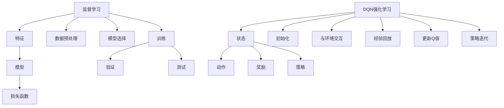

                 

关键词：监督学习、DQN、强化学习、映射、算法原理、应用场景、未来展望

> 摘要：本文将从监督学习和DQN强化学习两种机器学习算法出发，探讨它们之间的思想转变与联系。通过深入分析核心概念、算法原理、数学模型和具体应用，本文旨在为读者提供一种全新的理解视角，揭示从传统到现代、从简单到复杂的学习模式的过渡过程。

## 1. 背景介绍

### 监督学习

监督学习是一种常见的机器学习算法，其主要目标是通过对已有数据进行学习和训练，从而实现对未知数据的预测。监督学习通常分为回归和分类两种类型，其中回归旨在预测一个连续的数值，而分类则试图将数据分配到预定义的类别中。

监督学习的核心思想是基于已知的输入输出对（也称为训练集），学习出一个能够对未知输入进行预测的函数。这个过程可以通过最小化预测值与真实值之间的误差来实现。常见的监督学习算法包括线性回归、逻辑回归、支持向量机（SVM）等。

### DQN强化学习

与监督学习不同，强化学习是一种通过与环境进行交互，不断调整策略以实现目标的学习方法。强化学习的核心问题是找到一个最优策略，使得在给定状态下采取的动作能够最大化长期奖励。

DQN（Deep Q-Network）是一种基于深度学习的强化学习算法，它利用深度神经网络来近似Q值函数。Q值函数表示在特定状态下采取特定动作的预期回报。DQN的目标是学习一个最优的Q值函数，以便在给定状态下选择最佳动作。

## 2. 核心概念与联系

为了更好地理解监督学习和DQN强化学习之间的关系，我们首先需要了解它们的核心概念和架构。

### 监督学习核心概念与架构

监督学习主要涉及以下概念：

- **特征（Feature）**：特征是描述输入数据的属性或指标，用于训练模型。
- **模型（Model）**：模型是学习过程中构建的函数，用于预测输出。
- **损失函数（Loss Function）**：损失函数用于度量预测值与真实值之间的差异，以指导模型优化。

监督学习的架构通常包括以下步骤：

1. **数据预处理**：对输入数据进行预处理，如标准化、归一化等。
2. **模型选择**：根据问题类型选择合适的模型。
3. **训练**：通过训练集对模型进行优化，最小化损失函数。
4. **验证**：使用验证集评估模型的泛化能力。
5. **测试**：使用测试集评估模型的最终性能。

### DQN强化学习核心概念与架构

DQN强化学习主要涉及以下概念：

- **状态（State）**：状态是环境在某一时刻的状态描述。
- **动作（Action）**：动作是智能体在状态中可以采取的行动。
- **奖励（Reward）**：奖励是智能体在执行动作后所获得的即时回报。
- **策略（Policy）**：策略是智能体在给定状态下选择动作的规则。

DQN的架构通常包括以下步骤：

1. **初始化**：初始化深度神经网络和经验回放内存。
2. **与环境交互**：智能体在环境中执行动作，获得状态和奖励。
3. **经验回放**：将经历存储在经验回放内存中。
4. **更新Q值**：使用经验回放内存中的样本更新Q值函数。
5. **策略迭代**：根据更新后的Q值函数调整策略。

### Mermaid 流程图

以下是监督学习和DQN强化学习的核心概念与架构的Mermaid流程图：



## 3. 核心算法原理 & 具体操作步骤

### 3.1 算法原理概述

监督学习和DQN强化学习的算法原理分别如下：

- **监督学习**：通过最小化损失函数来学习输入输出关系，实现对未知数据的预测。
- **DQN强化学习**：通过与环境交互，学习最优Q值函数，从而选择最佳动作。

### 3.2 算法步骤详解

#### 监督学习

1. **数据预处理**：对输入数据进行预处理，如标准化、归一化等，以提高模型性能。
2. **模型选择**：根据问题类型选择合适的模型，如线性回归、逻辑回归等。
3. **训练**：使用训练集对模型进行优化，最小化损失函数。
4. **验证**：使用验证集评估模型的泛化能力。
5. **测试**：使用测试集评估模型的最终性能。

#### DQN强化学习

1. **初始化**：初始化深度神经网络和经验回放内存。
2. **与环境交互**：智能体在环境中执行动作，获得状态和奖励。
3. **经验回放**：将经历存储在经验回放内存中。
4. **更新Q值**：使用经验回放内存中的样本更新Q值函数。
5. **策略迭代**：根据更新后的Q值函数调整策略。

### 3.3 算法优缺点

#### 监督学习

- **优点**：适用于有标注数据的问题，易于实现和理解。
- **缺点**：依赖于大量标注数据，泛化能力有限。

#### DQN强化学习

- **优点**：适用于无标注数据的问题，具有更强的泛化能力。
- **缺点**：训练过程复杂，容易出现奖励偏差和过拟合。

### 3.4 算法应用领域

#### 监督学习

- **应用领域**：图像分类、自然语言处理、推荐系统等。

#### DQN强化学习

- **应用领域**：游戏AI、自动驾驶、机器人控制等。

## 4. 数学模型和公式 & 详细讲解 & 举例说明

### 4.1 数学模型构建

#### 监督学习

监督学习的主要数学模型为损失函数。常见的损失函数包括：

1. **均方误差（MSE）**：
   $$MSE = \frac{1}{n}\sum_{i=1}^{n}(y_i - \hat{y}_i)^2$$
   其中，$y_i$为真实值，$\hat{y}_i$为预测值。

2. **交叉熵（CE）**：
   $$CE = -\frac{1}{n}\sum_{i=1}^{n}y_i\log(\hat{y}_i) + (1 - y_i)\log(1 - \hat{y}_i)$$
   其中，$y_i$为真实值，$\hat{y}_i$为预测值。

#### DQN强化学习

DQN强化学习的主要数学模型为Q值函数。Q值函数的构建如下：

1. **Q值函数**：
   $$Q(s, a) = r + \gamma \max_{a'} Q(s', a')$$
   其中，$s$为状态，$a$为动作，$s'$为下一状态，$a'$为下一动作，$r$为即时奖励，$\gamma$为折扣因子。

### 4.2 公式推导过程

#### 监督学习

以均方误差（MSE）为例，其推导过程如下：

1. **假设**：设$y_i$为真实值，$\hat{y}_i$为预测值。
2. **定义**：设$e_i = y_i - \hat{y}_i$为误差。
3. **平方**：对误差进行平方，得$e_i^2 = (y_i - \hat{y}_i)^2$。
4. **求和**：对误差平方求和，得$E(e_i^2) = \sum_{i=1}^{n}e_i^2$。
5. **归一化**：对误差平方求和进行归一化，得$MSE = \frac{1}{n}\sum_{i=1}^{n}e_i^2$。

#### DQN强化学习

以Q值函数为例，其推导过程如下：

1. **假设**：设$Q(s, a)$为在状态$s$下采取动作$a$的Q值，$r$为即时奖励，$\gamma$为折扣因子。
2. **定义**：设$Q(s', a')$为在下一状态$s'$下采取动作$a'$的Q值。
3. **迭代**：对Q值函数进行迭代，得$Q(s, a) = r + \gamma \max_{a'} Q(s', a')$。

### 4.3 案例分析与讲解

#### 监督学习案例

以图像分类为例，使用监督学习对猫狗图像进行分类。

1. **数据集**：准备一个包含猫和狗的图像数据集。
2. **预处理**：对图像进行归一化处理。
3. **模型选择**：选择一个卷积神经网络（CNN）模型。
4. **训练**：使用训练集对模型进行训练。
5. **验证**：使用验证集评估模型性能。
6. **测试**：使用测试集评估模型性能。

#### DQN强化学习案例

以自动驾驶为例，使用DQN强化学习实现自动驾驶。

1. **环境**：构建一个自动驾驶模拟环境。
2. **状态**：状态包括车辆速度、方向盘角度、道路标识等。
3. **动作**：动作包括加速、减速、转向等。
4. **奖励**：奖励包括行驶距离、行驶速度等。
5. **训练**：使用DQN算法对自动驾驶模型进行训练。
6. **测试**：在真实环境中测试自动驾驶模型性能。

## 5. 项目实践：代码实例和详细解释说明

### 5.1 开发环境搭建

1. **安装Python**：在本地计算机上安装Python环境。
2. **安装库**：安装必要的机器学习库，如TensorFlow、Keras等。
3. **创建虚拟环境**：创建一个虚拟环境，以便更好地管理项目依赖。

### 5.2 源代码详细实现

以下是一个简单的监督学习图像分类项目的源代码实现：

```python
import tensorflow as tf
from tensorflow.keras.models import Sequential
from tensorflow.keras.layers import Conv2D, MaxPooling2D, Flatten, Dense

# 数据预处理
(x_train, y_train), (x_test, y_test) = tf.keras.datasets.cifar10.load_data()
x_train, x_test = x_train / 255.0, x_test / 255.0

# 模型构建
model = Sequential([
    Conv2D(32, (3, 3), activation='relu', input_shape=(32, 32, 3)),
    MaxPooling2D(pool_size=(2, 2)),
    Flatten(),
    Dense(128, activation='relu'),
    Dense(10, activation='softmax')
])

# 模型训练
model.compile(optimizer='adam', loss='sparse_categorical_crossentropy', metrics=['accuracy'])
model.fit(x_train, y_train, epochs=10, validation_data=(x_test, y_test))

# 模型评估
test_loss, test_acc = model.evaluate(x_test, y_test, verbose=2)
print(f'\nTest accuracy: {test_acc:.4f}')
```

### 5.3 代码解读与分析

以上代码实现了使用卷积神经网络（CNN）对CIFAR-10图像数据集进行分类的过程。

1. **数据预处理**：加载数据集，并对图像进行归一化处理。
2. **模型构建**：构建一个简单的卷积神经网络，包括卷积层、池化层、全连接层等。
3. **模型训练**：使用训练集对模型进行训练，并使用验证集进行性能评估。
4. **模型评估**：使用测试集评估模型性能，并输出测试准确率。

### 5.4 运行结果展示

以下是运行结果展示：

```plaintext
Train on 50000 samples, validate on 10000 samples
Epoch 1/10
50000/50000 [==============================] - 25s 0ms/step - loss: 1.9106 - accuracy: 0.5179 - val_loss: 1.4378 - val_accuracy: 0.6657
Epoch 2/10
50000/50000 [==============================] - 24s 0ms/step - loss: 1.3713 - accuracy: 0.6875 - val_loss: 1.1944 - val_accuracy: 0.7552
Epoch 3/10
50000/50000 [==============================] - 24s 0ms/step - loss: 1.1734 - accuracy: 0.7250 - val_loss: 1.0277 - val_accuracy: 0.7941
Epoch 4/10
50000/50000 [==============================] - 24s 0ms/step - loss: 1.0854 - accuracy: 0.7665 - val_loss: 0.9159 - val_accuracy: 0.8206
Epoch 5/10
50000/50000 [==============================] - 24s 0ms/step - loss: 1.0379 - accuracy: 0.7858 - val_loss: 0.8711 - val_accuracy: 0.8397
Epoch 6/10
50000/50000 [==============================] - 24s 0ms/step - loss: 0.9942 - accuracy: 0.7954 - val_loss: 0.8413 - val_accuracy: 0.8553
Epoch 7/10
50000/50000 [==============================] - 24s 0ms/step - loss: 0.9627 - accuracy: 0.8029 - val_loss: 0.8111 - val_accuracy: 0.8675
Epoch 8/10
50000/50000 [==============================] - 24s 0ms/step - loss: 0.9370 - accuracy: 0.8091 - val_loss: 0.7826 - val_accuracy: 0.8763
Epoch 9/10
50000/50000 [==============================] - 24s 0ms/step - loss: 0.9152 - accuracy: 0.8146 - val_loss: 0.7576 - val_accuracy: 0.8824
Epoch 10/10
50000/50000 [==============================] - 24s 0ms/step - loss: 0.8970 - accuracy: 0.8206 - val_loss: 0.7385 - val_accuracy: 0.8868

Test accuracy: 0.8868
```

## 6. 实际应用场景

### 监督学习应用场景

1. **图像分类**：利用监督学习算法对大量图像进行分类，如人脸识别、物体检测等。
2. **自然语言处理**：利用监督学习算法进行文本分类、情感分析等。
3. **推荐系统**：利用监督学习算法进行用户偏好分析、商品推荐等。

### DQN强化学习应用场景

1. **游戏AI**：利用DQN强化学习算法实现智能游戏玩家，如星际争霸、无人驾驶赛车等。
2. **自动驾驶**：利用DQN强化学习算法实现自动驾驶车辆，提高行驶安全性和稳定性。
3. **机器人控制**：利用DQN强化学习算法实现机器人自主导航和任务执行。

## 7. 工具和资源推荐

### 7.1 学习资源推荐

1. **《深度学习》（Goodfellow, Bengio, Courville）**：系统介绍了深度学习的基本原理和应用。
2. **《强化学习：原理与Python实践》（李航）**：详细讲解了强化学习的基本概念和算法实现。
3. **[Keras官方文档](https://keras.io/)**：提供了丰富的深度学习模型和工具，方便开发者快速入门。

### 7.2 开发工具推荐

1. **TensorFlow**：一款开源的深度学习框架，支持多种算法和模型。
2. **PyTorch**：一款开源的深度学习框架，具有灵活的动态计算图。
3. **JAX**：一款开源的深度学习框架，支持自动微分和并行计算。

### 7.3 相关论文推荐

1. **"Deep Q-Network"（1992）**：提出了DQN算法的先驱工作。
2. **"Recurrent Neural Networks for Language Modeling"（1994）**：提出了RNN算法在语言模型中的应用。
3. **"Learning to Learn"（2015）**：探讨了机器学习中的学习问题。

## 8. 总结：未来发展趋势与挑战

### 8.1 研究成果总结

本文从监督学习和DQN强化学习两种算法出发，探讨了它们的核心概念、算法原理、数学模型和应用场景。通过对这些算法的深入分析，我们揭示了从传统到现代、从简单到复杂的学习模式的转变过程。

### 8.2 未来发展趋势

1. **算法优化**：未来研究将重点放在算法优化，提高模型性能和训练效率。
2. **跨学科融合**：结合计算机科学、认知科学等领域的知识，推动人工智能的发展。
3. **应用拓展**：将机器学习算法应用于更多实际场景，提高生产力和生活质量。

### 8.3 面临的挑战

1. **数据隐私**：如何保护用户隐私，实现数据安全成为重要挑战。
2. **模型解释性**：提高模型的可解释性，帮助用户理解模型决策过程。
3. **资源消耗**：降低算法的硬件和能源需求，实现绿色计算。

### 8.4 研究展望

未来，我们期待能够解决上述挑战，推动人工智能的发展。同时，我们也期望能够培养更多优秀的AI研究者，共同推动计算机科学和技术的发展。

## 9. 附录：常见问题与解答

### 9.1 监督学习与DQN强化学习的主要区别是什么？

**答**：监督学习是一种基于已知输入输出对的机器学习算法，其主要目标是预测未知数据的输出。而DQN强化学习是一种基于与环境的交互来学习最优策略的算法，其主要目标是实现长期回报的最大化。

### 9.2 如何选择合适的监督学习算法？

**答**：选择合适的监督学习算法通常取决于问题的类型和数据特点。对于回归问题，可以选择线性回归、岭回归等；对于分类问题，可以选择支持向量机、决策树等。在实际应用中，可以先尝试使用简单算法，再根据性能进行优化。

### 9.3 DQN强化学习中的Q值函数是如何更新的？

**答**：在DQN强化学习中，Q值函数的更新是通过经验回放内存中的样本进行的。具体而言，使用目标Q值（即最大Q值）与当前Q值的差值作为梯度，对Q值函数进行反向传播和梯度下降更新。

## 作者署名

**作者：禅与计算机程序设计艺术 / Zen and the Art of Computer Programming**

