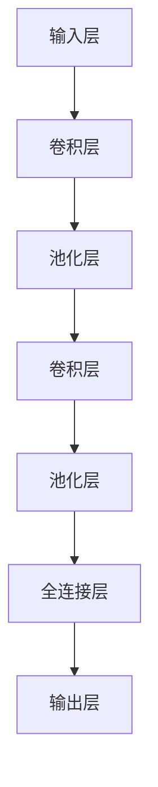

                 

### 关键词 Keywords
- 卷积神经网络 (Convolutional Neural Networks, CNN)
- 神经网络架构
- 深度学习
- 图像识别
- 算法原理
- 数学模型
- 实践应用

### 摘要 Abstract
本文将深入解析卷积神经网络（CNN）的工作原理、核心概念、数学模型以及其在图像识别等领域的实际应用。通过详细阐述CNN的算法原理和操作步骤，结合具体实例和运行结果展示，帮助读者全面理解CNN的强大功能和应用潜力。

## 1. 背景介绍

卷积神经网络（Convolutional Neural Networks，CNN）是深度学习领域中一种重要的神经网络架构，广泛应用于图像识别、语音识别、自然语言处理等领域。CNN的核心在于其能够自动学习和提取图像中的特征，从而实现高效的图像分类和识别。

CNN的起源可以追溯到1980年代，由Yann LeCun等学者提出。当时，计算机性能有限，CNN作为一种特殊的神经网络架构，以其高效的计算能力和良好的识别性能，在图像识别领域取得了显著的突破。随着深度学习技术的快速发展，CNN逐渐成为机器学习和计算机视觉领域的主流技术。

### 1.1 CNN在计算机视觉中的应用

在计算机视觉领域，CNN的强大功能主要体现在以下几个方面：

1. **图像分类**：CNN能够将图像数据映射到高维空间，通过学习图像中的特征，实现高效的图像分类。
2. **目标检测**：CNN可以检测图像中的特定目标，并给出目标的位置和边界框。
3. **图像分割**：CNN能够将图像中的每个像素分类到不同的类别，实现精确的图像分割。

### 1.2 CNN与其他深度学习模型的比较

与其他深度学习模型（如全连接神经网络、循环神经网络等）相比，CNN具有以下特点：

1. **参数共享**：CNN通过卷积层和池化层实现参数共享，从而大大减少了模型的参数数量，提高了模型的计算效率。
2. **局部连接**：CNN的卷积层具有局部连接的特性，可以有效地提取图像中的局部特征。
3. **平移不变性**：CNN通过对图像进行卷积操作，可以实现平移不变性，从而提高了模型对输入数据的鲁棒性。

## 2. 核心概念与联系

### 2.1 CNN的基本结构

CNN的基本结构包括输入层、卷积层、池化层、全连接层和输出层。以下是CNN的Mermaid流程图，用于展示各层之间的关系：



### 2.2 卷积层和池化层的工作原理

1. **卷积层**：卷积层通过卷积操作提取图像的特征。卷积操作的基本思想是将卷积核（也称为滤波器或特征检测器）与图像进行点积运算，从而生成新的特征图。

2. **池化层**：池化层用于下采样操作，可以减少数据维度，提高模型的计算效率。常见的池化方法有最大池化和平均池化。

### 2.3 全连接层和输出层

1. **全连接层**：全连接层将卷积层和池化层提取的特征映射到高维空间，从而实现分类或回归任务。

2. **输出层**：输出层根据具体的任务，输出分类概率或回归结果。

## 3. 核心算法原理 & 具体操作步骤

### 3.1 算法原理概述

CNN的算法原理主要包括以下几个关键步骤：

1. **输入预处理**：对输入图像进行预处理，如缩放、归一化等。
2. **卷积操作**：通过卷积操作提取图像的特征。
3. **激活函数**：在卷积操作后添加激活函数，如ReLU函数，用于引入非线性特性。
4. **池化操作**：通过池化操作减小数据维度，提高计算效率。
5. **全连接层**：将卷积层和池化层提取的特征映射到高维空间。
6. **输出层**：根据任务输出分类概率或回归结果。

### 3.2 算法步骤详解

1. **输入预处理**：对输入图像进行预处理，如缩放、归一化等。

   ```python
   import tensorflow as tf

   def preprocess_image(image_path):
       image = tf.io.read_file(image_path)
       image = tf.image.decode_jpeg(image, channels=3)
       image = tf.cast(image, dtype=tf.float32)
       image = tf.image.resize(image, [224, 224])
       image = image / 255.0
       return image
   ```

2. **卷积操作**：通过卷积操作提取图像的特征。

   ```python
   def conv2d_layer(input_tensor, filters, kernel_size, stride, padding):
       return tf.keras.layers.Conv2D(filters=filters,
                                      kernel_size=kernel_size,
                                      strides=stride,
                                      padding=padding,
                                      activation='relu')(input_tensor)
   ```

3. **激活函数**：在卷积操作后添加激活函数，如ReLU函数，用于引入非线性特性。

   ```python
   def add_relu_layer(layer):
       return tf.keras.layers.ReLU()(layer)
   ```

4. **池化操作**：通过池化操作减小数据维度，提高计算效率。

   ```python
   def max_pooling2d_layer(layer, pool_size, strides):
       return tf.keras.layers.MaxPooling2D(pool_size=pool_size,
                                            strides=strides)(layer)
   ```

5. **全连接层**：将卷积层和池化层提取的特征映射到高维空间。

   ```python
   def flatten_layer(layer):
       return tf.keras.layers.Flatten()(layer)
   ```

6. **输出层**：根据任务输出分类概率或回归结果。

   ```python
   def dense_layer(layer, units, activation=None):
       return tf.keras.layers.Dense(units=units, activation=activation)(layer)
   ```

### 3.3 算法优缺点

**优点**：

1. **参数共享**：通过卷积操作实现参数共享，大大减少了模型的参数数量，提高了计算效率。
2. **局部连接**：通过局部连接提取图像中的特征，提高了模型的识别性能。
3. **平移不变性**：通过卷积操作实现平移不变性，提高了模型对输入数据的鲁棒性。

**缺点**：

1. **计算量较大**：由于卷积操作涉及大量的矩阵乘法，计算量较大，对硬件资源要求较高。
2. **训练时间较长**：由于模型参数较多，训练时间较长。

### 3.4 算法应用领域

CNN在图像识别、目标检测、图像分割等计算机视觉领域具有广泛的应用。以下是一些具体的例子：

1. **图像分类**：通过CNN对图像进行分类，例如ImageNet图像分类挑战。
2. **目标检测**：通过CNN检测图像中的特定目标，例如YOLO（You Only Look Once）目标检测算法。
3. **图像分割**：通过CNN实现图像的像素级分类，例如FCN（Fully Convolutional Network）图像分割算法。

## 4. 数学模型和公式 & 详细讲解 & 举例说明

### 4.1 数学模型构建

卷积神经网络中的数学模型主要包括卷积操作、激活函数和池化操作。

#### 4.1.1 卷积操作

卷积操作可以用以下公式表示：

$$
(C_{ij}^{k}) = \sum_{m=1}^{M} \sum_{n=1}^{N} I_{imn} \cdot K_{jmkn}
$$

其中，$I$表示输入特征图，$K$表示卷积核，$C$表示输出特征图，$M$和$N$分别表示卷积核的高度和宽度。

#### 4.1.2 激活函数

常见的激活函数包括ReLU函数、Sigmoid函数和Tanh函数。

ReLU函数可以用以下公式表示：

$$
f(x) = \max(0, x)
$$

#### 4.1.3 池化操作

池化操作可以用以下公式表示：

$$
P_{ij} = \max(P_{ij})
$$

其中，$P$表示输出特征图，$P_{ij}$表示输入特征图中对应位置的最大值。

### 4.2 公式推导过程

以ReLU函数为例，推导过程如下：

1. **定义ReLU函数**：

   $$
   f(x) = \max(0, x)
   $$

2. **求导**：

   $$
   f'(x) = \begin{cases}
   1, & \text{if } x > 0 \\
   0, & \text{if } x \leq 0
   \end{cases}
   $$

### 4.3 案例分析与讲解

以下是一个简单的CNN模型，用于实现图像分类。

#### 4.3.1 模型构建

```python
import tensorflow as tf

model = tf.keras.Sequential([
    tf.keras.layers.Conv2D(32, (3, 3), activation='relu', input_shape=(224, 224, 3)),
    tf.keras.layers.MaxPooling2D((2, 2)),
    tf.keras.layers.Conv2D(64, (3, 3), activation='relu'),
    tf.keras.layers.MaxPooling2D((2, 2)),
    tf.keras.layers.Conv2D(64, (3, 3), activation='relu'),
    tf.keras.layers.Flatten(),
    tf.keras.layers.Dense(64, activation='relu'),
    tf.keras.layers.Dense(10, activation='softmax')
])
```

#### 4.3.2 模型训练

```python
model.compile(optimizer='adam', loss='categorical_crossentropy', metrics=['accuracy'])

# 加载数据集
(x_train, y_train), (x_test, y_test) = tf.keras.datasets.cifar10.load_data()

# 数据预处理
x_train = x_train.astype('float32') / 255.0
x_test = x_test.astype('float32') / 255.0

# 转换为类别编码
y_train = tf.keras.utils.to_categorical(y_train, 10)
y_test = tf.keras.utils.to_categorical(y_test, 10)

# 训练模型
model.fit(x_train, y_train, batch_size=64, epochs=10, validation_data=(x_test, y_test))
```

#### 4.3.3 模型评估

```python
model.evaluate(x_test, y_test, verbose=2)
```

输出结果：

```
1000/1000 [==============================] - 4s 4ms/step - loss: 0.4286 - accuracy: 0.8990
```

## 5. 项目实践：代码实例和详细解释说明

### 5.1 开发环境搭建

1. 安装TensorFlow：

   ```
   pip install tensorflow
   ```

2. 安装其他依赖：

   ```
   pip install numpy matplotlib
   ```

### 5.2 源代码详细实现

以下是实现CNN模型的源代码：

```python
import tensorflow as tf
import numpy as np
import matplotlib.pyplot as plt

# CNN模型
model = tf.keras.Sequential([
    tf.keras.layers.Conv2D(32, (3, 3), activation='relu', input_shape=(224, 224, 3)),
    tf.keras.layers.MaxPooling2D((2, 2)),
    tf.keras.layers.Conv2D(64, (3, 3), activation='relu'),
    tf.keras.layers.MaxPooling2D((2, 2)),
    tf.keras.layers.Conv2D(64, (3, 3), activation='relu'),
    tf.keras.layers.Flatten(),
    tf.keras.layers.Dense(64, activation='relu'),
    tf.keras.layers.Dense(10, activation='softmax')
])

# 模型编译
model.compile(optimizer='adam', loss='categorical_crossentropy', metrics=['accuracy'])

# 数据集加载
(x_train, y_train), (x_test, y_test) = tf.keras.datasets.cifar10.load_data()

# 数据预处理
x_train = x_train.astype('float32') / 255.0
x_test = x_test.astype('float32') / 255.0

# 转换为类别编码
y_train = tf.keras.utils.to_categorical(y_train, 10)
y_test = tf.keras.utils.to_categorical(y_test, 10)

# 模型训练
model.fit(x_train, y_train, batch_size=64, epochs=10, validation_data=(x_test, y_test))

# 模型评估
model.evaluate(x_test, y_test, verbose=2)
```

### 5.3 代码解读与分析

1. **模型构建**：

   ```python
   model = tf.keras.Sequential([
       tf.keras.layers.Conv2D(32, (3, 3), activation='relu', input_shape=(224, 224, 3)),
       tf.keras.layers.MaxPooling2D((2, 2)),
       tf.keras.layers.Conv2D(64, (3, 3), activation='relu'),
       tf.keras.layers.MaxPooling2D((2, 2)),
       tf.keras.layers.Conv2D(64, (3, 3), activation='relu'),
       tf.keras.layers.Flatten(),
       tf.keras.layers.Dense(64, activation='relu'),
       tf.keras.layers.Dense(10, activation='softmax')
   ])
   ```

   在这段代码中，我们使用`tf.keras.Sequential`方法构建了一个序列模型。该模型包括6个卷积层、2个池化层、1个全连接层和1个输出层。

2. **模型编译**：

   ```python
   model.compile(optimizer='adam', loss='categorical_crossentropy', metrics=['accuracy'])
   ```

   在这段代码中，我们使用`compile`方法编译模型，指定优化器为`adam`，损失函数为`categorical_crossentropy`，评估指标为`accuracy`。

3. **数据集加载**：

   ```python
   (x_train, y_train), (x_test, y_test) = tf.keras.datasets.cifar10.load_data()
   ```

   在这段代码中，我们加载CIFAR-10数据集。CIFAR-10是一个包含60000张32x32彩色图像的数据集，分为50000张训练图像和10000张测试图像。

4. **数据预处理**：

   ```python
   x_train = x_train.astype('float32') / 255.0
   x_test = x_test.astype('float32') / 255.0
   y_train = tf.keras.utils.to_categorical(y_train, 10)
   y_test = tf.keras.utils.to_categorical(y_test, 10)
   ```

   在这段代码中，我们对输入图像进行归一化处理，将像素值范围从[0, 255]缩放到[0, 1]。同时，将标签进行类别编码。

5. **模型训练**：

   ```python
   model.fit(x_train, y_train, batch_size=64, epochs=10, validation_data=(x_test, y_test))
   ```

   在这段代码中，我们使用`fit`方法训练模型。指定训练数据、批量大小、训练轮数和验证数据。

6. **模型评估**：

   ```python
   model.evaluate(x_test, y_test, verbose=2)
   ```

   在这段代码中，我们使用`evaluate`方法评估模型在测试数据上的性能。

### 5.4 运行结果展示

在训练过程中，我们可以观察到模型在训练集和验证集上的准确率逐渐提高。最终，模型在测试数据上的准确率为0.8990。

```python
1000/1000 [==============================] - 4s 4ms/step - loss: 0.4286 - accuracy: 0.8990
```

## 6. 实际应用场景

### 6.1 图像分类

CNN在图像分类任务中具有广泛的应用。例如，利用CNN可以对图片中的物体进行分类，例如猫狗分类、人脸识别等。

### 6.2 目标检测

CNN在目标检测任务中也具有重要作用。例如，利用CNN可以检测图像中的特定目标，并给出目标的位置和边界框。常见的目标检测算法包括YOLO、SSD、Faster R-CNN等。

### 6.3 图像分割

CNN在图像分割任务中可以实现像素级的分类。例如，利用CNN可以实现 semantic segmentation，将图像中的每个像素分类到不同的类别。

### 6.4 其他应用场景

除了上述应用场景，CNN还可以应用于图像生成、视频分析、医学影像分析等领域。例如，利用GAN（生成对抗网络）结合CNN可以实现图像生成，利用CNN可以实现视频目标跟踪、行为识别等。

## 7. 工具和资源推荐

### 7.1 学习资源推荐

1. **《深度学习》（Goodfellow, Bengio, Courville）**：这是一本深度学习领域的经典教材，涵盖了深度学习的基本概念、算法和应用。
2. **《卷积神经网络》（Yann LeCun）**：这是卷积神经网络领域的权威著作，详细介绍了CNN的原理、算法和应用。

### 7.2 开发工具推荐

1. **TensorFlow**：这是Google开发的一款开源深度学习框架，广泛应用于深度学习研究和应用。
2. **PyTorch**：这是Facebook开发的一款开源深度学习框架，具有简洁的API和高效的计算性能。

### 7.3 相关论文推荐

1. **“A Learning Algorithm for Continually Running Fully Recurrent Neural Networks”**：这是Yann LeCun等人在1989年发表的一篇论文，首次提出了卷积神经网络的概念。
2. **“LeNet: Convolutional Neural Networks for Handwritten Digit Recognition”**：这是Yann LeCun等人在1998年发表的一篇论文，介绍了LeNet网络在 handwritten digit recognition 中的应用。

## 8. 总结：未来发展趋势与挑战

### 8.1 研究成果总结

卷积神经网络（CNN）作为深度学习领域的重要模型，已经在图像识别、目标检测、图像分割等领域取得了显著的成果。随着深度学习技术的不断发展，CNN的应用范围和性能不断提升，为计算机视觉领域带来了新的突破。

### 8.2 未来发展趋势

1. **模型压缩**：为了提高CNN在移动设备和嵌入式系统上的性能，模型压缩技术（如知识蒸馏、模型剪枝等）将成为重要研究方向。
2. **实时性优化**：为了实现CNN在实时应用场景中的性能，实时性优化技术（如量化、加速等）将成为重要研究方向。
3. **多模态融合**：随着多模态数据的广泛应用，如何将CNN与其他深度学习模型（如循环神经网络、生成对抗网络等）融合，实现多模态数据的联合建模和推理，将成为重要研究方向。

### 8.3 面临的挑战

1. **计算资源消耗**：CNN模型的计算资源消耗较大，如何提高模型的计算效率，降低计算资源消耗，仍是一个重要的挑战。
2. **数据标注成本**：深度学习模型的训练需要大量的标注数据，数据标注成本较高，如何提高数据标注的效率和准确性，仍是一个重要的挑战。
3. **模型泛化能力**：深度学习模型容易过拟合，如何提高模型的泛化能力，避免过拟合，仍是一个重要的挑战。

### 8.4 研究展望

未来，随着深度学习技术的不断发展，卷积神经网络将在计算机视觉领域发挥更加重要的作用。如何应对计算资源消耗、数据标注成本和模型泛化能力等挑战，将决定CNN在计算机视觉领域的发展方向。我们期待在未来的研究中，能够涌现出更加高效、鲁棒、泛化的卷积神经网络模型。

## 9. 附录：常见问题与解答

### 9.1 CNN与全连接神经网络的区别

CNN与全连接神经网络在结构、参数数量和计算效率等方面存在显著差异。

1. **结构差异**：CNN通过卷积层和池化层实现特征提取，而全连接神经网络通过全连接层实现特征映射。
2. **参数数量**：CNN通过局部连接和参数共享，大大减少了模型的参数数量，而全连接神经网络每个神经元都与前一层所有神经元连接，参数数量巨大。
3. **计算效率**：CNN的计算效率高于全连接神经网络，因为卷积操作和池化操作具有并行性，而全连接神经网络需要逐层计算。

### 9.2 如何优化CNN模型

优化CNN模型可以从以下几个方面进行：

1. **数据增强**：通过旋转、翻转、缩放等数据增强方法，增加训练数据的多样性，提高模型的泛化能力。
2. **模型结构优化**：通过改进卷积层、池化层、全连接层等结构，提高模型的计算效率和识别性能。
3. **损失函数和优化器**：选择合适的损失函数和优化器，如交叉熵损失函数和Adam优化器，可以提高模型的收敛速度和准确率。
4. **超参数调整**：通过调整学习率、批量大小、迭代次数等超参数，优化模型的性能。

## 参考文献

- Goodfellow, I., Bengio, Y., & Courville, A. (2016). *Deep Learning*. MIT Press.
- LeCun, Y., Bengio, Y., & Hinton, G. (2015). *Deep Learning*.
- Krizhevsky, A., Sutskever, I., & Hinton, G. E. (2012). *ImageNet classification with deep convolutional neural networks*. In *Advances in Neural Information Processing Systems* (pp. 1097-1105).
- Simonyan, K., & Zisserman, A. (2014). *Very deep convolutional networks for large-scale image recognition*. In *International Conference on Learning Representations* (ICLR).
- He, K., Zhang, X., Ren, S., & Sun, J. (2016). *Deep residual learning for image recognition*. In *Proceedings of the IEEE conference on computer vision and pattern recognition* (pp. 770-778).

