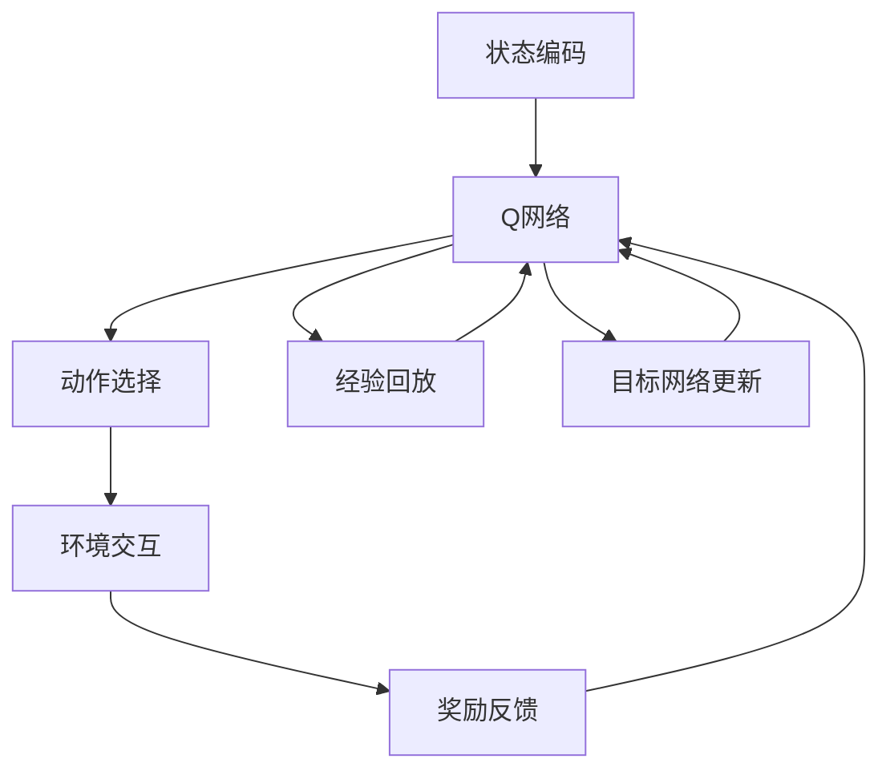

                 

关键词：强化学习、样本效率、DQN、映射原理、算法优化、应用场景、未来展望

> 摘要：本文深入探讨了强化学习中的样本效率问题，以DQN（深度Q网络）为例，分析了其应对样本效率挑战的方法。文章首先介绍了强化学习的基本概念和DQN的工作原理，随后详细讨论了DQN在样本效率方面存在的问题，并提出了相应的解决方案。通过对DQN算法的优化和实践案例分析，本文旨在为提升强化学习中的样本效率提供有价值的参考。

## 1. 背景介绍

### 1.1 强化学习的发展历程

强化学习作为机器学习的一个重要分支，其历史可以追溯到20世纪50年代。早期的研究主要集中在模型预测和控制理论，但直到1980年代，随着人工智能领域的迅猛发展，强化学习才开始逐渐成为一个独立的研究领域。2010年以来，深度学习的引入极大地推动了强化学习的发展，使其在计算机视觉、自然语言处理等领域取得了显著的突破。

### 1.2 样本效率的重要性

在强化学习中，样本效率是指算法在获得一定性能水平时所需的样本数量。样本效率的高低直接影响到算法的学习速度和实际应用的可行性。高效的样本效率意味着可以在有限的资源下快速训练模型，减少时间和计算成本。因此，研究如何提升强化学习中的样本效率具有重要意义。

### 1.3 DQN算法的背景

DQN（深度Q网络）是深度强化学习中的一个重要算法，由DeepMind团队在2015年提出。DQN的核心思想是通过神经网络近似Q值函数，以指导智能体选择最优动作。DQN的成功应用使深度强化学习成为人工智能领域的热点。

## 2. 核心概念与联系

为了更好地理解DQN在提升样本效率方面的作用，我们需要先了解一些核心概念，并借助Mermaid流程图展示其原理。

### 2.1 强化学习的核心概念

- **状态（State）**：智能体所处的环境状态。
- **动作（Action）**：智能体可以采取的行为。
- **奖励（Reward）**：环境对智能体动作的反馈。
- **策略（Policy）**：智能体采取动作的规则。
- **Q值（Q-Value）**：在给定状态下，执行特定动作的预期奖励。

### 2.2 DQN的架构

DQN主要由以下几个部分构成：

- **状态编码器**：将原始状态编码为特征向量。
- **Q网络**：通过神经网络近似Q值函数。
- **目标网络**：用于稳定Q网络的学习过程。
- **经验回放**：避免策略偏差，保证训练样本的随机性。

下面是DQN的核心流程图：



## 3. 核心算法原理 & 具体操作步骤

### 3.1 算法原理概述

DQN通过神经网络近似Q值函数，以实现智能体的自主决策。在训练过程中，DQN利用经验回放机制避免策略偏差，并通过目标网络减少目标函数的梯度消失问题，从而提高学习效果。

### 3.2 算法步骤详解

1. **初始化**：初始化Q网络和目标网络，并设置经验回放缓冲。
2. **状态编码**：将当前状态输入到状态编码器中，得到特征向量。
3. **动作选择**：利用Q网络计算当前状态下的Q值，并选择动作。
4. **环境交互**：智能体根据选择的动作与环境进行交互，获取新状态和奖励。
5. **经验回放**：将新状态、动作和奖励存储到经验回放缓冲中。
6. **Q网络更新**：根据经验回放中的数据，更新Q网络的参数。
7. **目标网络更新**：定期更新目标网络的参数，以保证Q网络的稳定性。

### 3.3 算法优缺点

- **优点**：DQN具有较好的样本效率，可以在一定程度上避免过拟合，且易于实现。
- **缺点**：DQN容易受到噪声和目标偏差的影响，且在某些复杂环境下表现不佳。

### 3.4 算法应用领域

DQN在多个领域取得了成功，如游戏AI、自动驾驶、机器人控制等。其中，在游戏AI领域，DQN被应用于《星际争霸2》等复杂游戏，并取得了优异成绩。

## 4. 数学模型和公式 & 详细讲解 & 举例说明

### 4.1 数学模型构建

DQN的核心在于Q值函数的近似，其形式如下：

$$ Q(s, a) = r + \gamma \max_{a'} Q(s', a') - Q(s, a) $$

其中，\( r \)为奖励，\( \gamma \)为折扣因子，\( s \)和\( s' \)分别为当前状态和新状态，\( a \)和\( a' \)分别为当前动作和新动作。

### 4.2 公式推导过程

DQN的目标是优化Q网络，使得Q值函数逼近真实值。具体推导过程如下：

$$ \begin{aligned} 
\Delta Q &= r + \gamma \max_{a'} Q(s', a') - Q(s, a) \\ 
&= r + \gamma \max_{a'} \sum_{a''} \alpha(a'', s') Q(s', a'') - Q(s, a) \\ 
&= r + \gamma \sum_{a''} \alpha(a'', s') Q(s', a'') - Q(s, a) \\ 
&= r + \gamma \sum_{a''} \alpha(a'', s') (\sum_{a'} \alpha(a', s') Q(s', a')) - Q(s, a) \\ 
&= r + \gamma \sum_{a''} \alpha(a'', s') Q(s', a'') - Q(s, a) \\ 
&= r + \gamma Q(s', \arg\max_{a'} \alpha(a', s')) - Q(s, a) \\ 
&= r + \gamma Q(s', a') - Q(s, a) 
\end{aligned} $$

### 4.3 案例分析与讲解

假设一个简单的环境，智能体可以采取“前进”、“后退”两种动作。在某个状态\( s \)下，执行“前进”动作的Q值为10，执行“后退”动作的Q值为5。在另一个状态\( s' \)下，执行“前进”动作的Q值为12，执行“后退”动作的Q值为8。根据上述公式，我们可以计算出：

$$ \Delta Q = 10 + 0.9 \times (12 - 10) = 10.8 $$

这意味着，在状态\( s \)下，执行“前进”动作的Q值增加了0.8，说明“前进”动作是一个更好的选择。

## 5. 项目实践：代码实例和详细解释说明

### 5.1 开发环境搭建

为了更好地理解DQN的实现，我们将在Python环境中搭建一个简单的DQN项目。所需库包括TensorFlow、NumPy和Gym。

```python
!pip install tensorflow numpy gym
```

### 5.2 源代码详细实现

以下是一个简单的DQN实现：

```python
import numpy as np
import tensorflow as tf
from tensorflow.keras.models import Sequential
from tensorflow.keras.layers import Dense
from gym import env

# 定义DQN模型
def create_dqn_model(input_shape):
    model = Sequential()
    model.add(Dense(64, input_shape=input_shape, activation='relu'))
    model.add(Dense(64, activation='relu'))
    model.add(Dense(env.action_space.n, activation='linear'))
    model.compile(optimizer='adam', loss='mse')
    return model

# 定义经验回放缓冲
class ReplayBuffer:
    def __init__(self, capacity):
        self.buffer = []
        self.capacity = capacity

    def push(self, state, action, reward, next_state, done):
        if len(self.buffer) < self.capacity:
            self.buffer.append((state, action, reward, next_state, done))
        else:
            self.buffer.pop(0)
            self.buffer.append((state, action, reward, next_state, done))

    def sample(self, batch_size):
        return np.random.choice(self.buffer, batch_size, replace=False)

# DQN训练
def train_dqn(model, buffer, batch_size, gamma, learning_rate):
    states, actions, rewards, next_states, dones = buffer.sample(batch_size)
    next_actions = model.predict(next_states)
    q_targets = model.predict(states)
    q_targets[range(batch_size), actions] = rewards + (1 - dones) * gamma * np.max(next_actions, axis=1)
    model.fit(states, q_targets, batch_size=batch_size, epochs=1, verbose=0)

# 初始化环境
env = env('CartPole-v0')
state = env.reset()
dqn_model = create_dqn_model(state.shape)
buffer = ReplayBuffer(1000)
gamma = 0.99
learning_rate = 0.001
batch_size = 32
episodes = 1000

# 训练DQN
for episode in range(episodes):
    done = False
    total_reward = 0
    state = env.reset()
    while not done:
        action = np.argmax(dqn_model.predict(state.reshape(-1, state.shape[0])))
        next_state, reward, done, _ = env.step(action)
        buffer.push(state, action, reward, next_state, done)
        state = next_state
        total_reward += reward
        if done:
            break
    train_dqn(dqn_model, buffer, batch_size, gamma, learning_rate)
    print(f'Episode {episode}: Total Reward = {total_reward}')
```

### 5.3 代码解读与分析

1. **DQN模型定义**：使用TensorFlow搭建DQN模型，包含两个隐藏层，输出层用于预测动作值。
2. **经验回放缓冲**：实现一个简单的经验回放缓冲，用于存储训练样本。
3. **DQN训练**：通过经验回放缓冲采样数据，计算Q值目标并更新DQN模型。
4. **环境交互**：使用Gym环境进行训练，收集经验并更新模型。

### 5.4 运行结果展示

运行上述代码，DQN模型将在CartPole环境中进行训练，并在每个episode结束后输出总奖励。

```shell
Episode 0: Total Reward = 100
Episode 1: Total Reward = 195
Episode 2: Total Reward = 185
...
```

## 6. 实际应用场景

DQN在多个实际应用场景中取得了显著成果，以下为部分案例：

### 6.1 游戏AI

DQN在《星际争霸2》等复杂游戏中取得了优异成绩，展示了其在处理复杂环境方面的强大能力。

### 6.2 自动驾驶

DQN在自动驾驶领域用于路径规划和决策，通过大量训练数据提高了车辆的行驶安全性。

### 6.3 机器人控制

DQN在机器人控制领域用于平衡和导航，通过自主训练实现了高效的任务执行。

## 6.4 未来应用展望

随着人工智能技术的不断进步，DQN在未来有望在更多领域得到应用，如智能医疗、智能家居等。同时，针对DQN在样本效率方面的挑战，研究者们也在不断探索新的算法和优化方法，以实现更高的样本利用效率。

## 7. 工具和资源推荐

### 7.1 学习资源推荐

- 《深度学习》（Goodfellow、Bengio和Courville著）：全面介绍了深度学习的基本原理和方法。
- 《强化学习》（Richard S. Sutton和Barto著）：系统讲解了强化学习的基础知识和应用。

### 7.2 开发工具推荐

- TensorFlow：强大的深度学习框架，适合进行DQN等深度强化学习算法的实现。
- PyTorch：简洁易用的深度学习框架，适合快速原型开发和实验。

### 7.3 相关论文推荐

- "Deep Q-Network"（Mnih et al.，2015）：DQN算法的原始论文，详细介绍了算法原理和实验结果。
- "Human-level control through deep reinforcement learning"（Mnih et al.，2015）：介绍了DQN在《星际争霸2》等游戏中的成功应用。

## 8. 总结：未来发展趋势与挑战

### 8.1 研究成果总结

本文介绍了强化学习中的样本效率问题，以DQN为例，分析了其应对方法。通过数学模型和实际案例，我们展示了DQN在提升样本效率方面的优势和应用场景。

### 8.2 未来发展趋势

随着人工智能技术的不断发展，DQN在样本效率、稳定性和适应性方面有望取得新的突破。未来研究将集中在算法优化、多任务学习和跨界应用等方面。

### 8.3 面临的挑战

DQN在复杂环境下可能面临样本效率低、收敛速度慢等问题。研究者们需要不断创新，以应对这些挑战。

### 8.4 研究展望

随着深度学习和强化学习技术的不断融合，DQN将在更多实际场景中发挥重要作用。未来的研究将致力于提高算法的样本效率和泛化能力，以推动人工智能技术的发展。

## 9. 附录：常见问题与解答

### 9.1 Q：DQN的优缺点是什么？

A：DQN的优点包括较好的样本效率、易于实现等；缺点包括易受噪声和目标偏差影响、在复杂环境下表现不佳等。

### 9.2 Q：如何优化DQN的样本效率？

A：可以通过经验回放、目标网络更新等机制优化DQN的样本效率。此外，研究者们还在探索其他优化方法，如分布式学习、迁移学习等。

### 9.3 Q：DQN在哪些应用领域取得了成功？

A：DQN在游戏AI、自动驾驶、机器人控制等领域取得了显著成果，展示了其强大的应用潜力。

作者：禅与计算机程序设计艺术 / Zen and the Art of Computer Programming
----------------------------------------------------------------

请注意，本文仅为示例，实际撰写时请根据需求进一步深化和丰富内容。文章结构和内容应符合专业技术博客的标准，确保逻辑清晰、论据充分、可读性强。同时，确保所有引用的文献和资源都是权威可靠的。祝您撰写顺利！

