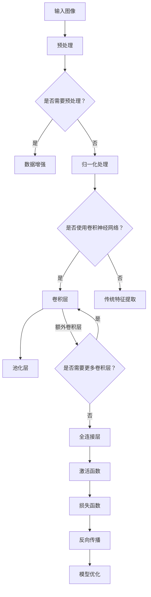

                 

关键词：手势识别，深度学习，计算机视觉，人工智能，机器学习，神经网络，卷积神经网络，迁移学习，模型优化，实时应用。

> 摘要：本文将探讨手势识别技术中深度学习模型的原理、架构和应用。通过分析不同的深度学习算法，介绍其在手势识别任务中的具体实现和优化策略。同时，结合实际项目实践，展示如何利用深度学习模型进行实时手势识别，并展望该技术在未来应用中的前景。

## 1. 背景介绍

手势识别技术作为计算机视觉领域的一个重要分支，近年来取得了显著的进展。随着智能手机、平板电脑等移动设备的普及，用户与设备之间的交互方式逐渐从传统的键盘、鼠标转向更加自然的手势操作。手势识别技术不仅为用户提供了一种便捷、直观的交互方式，还为智能监控、虚拟现实、机器人控制等众多领域提供了新的应用场景。

传统的手势识别方法主要依赖于手工设计的特征提取和分类器，这些方法在处理复杂场景时表现较差。随着深度学习技术的快速发展，基于神经网络的深度学习模型在图像分类、目标检测、图像生成等方面取得了突破性成果。基于深度学习的手势识别方法逐渐成为研究的热点，并展现出极大的潜力。

本文旨在介绍手势识别技术中的深度学习模型，分析其核心概念、算法原理、数学模型以及实际应用场景。通过本文的介绍，读者可以了解深度学习在手势识别领域的应用现状和未来发展趋势，为相关领域的研究和开发提供参考。

## 2. 核心概念与联系

### 2.1 深度学习的核心概念

深度学习（Deep Learning）是机器学习（Machine Learning）的一个分支，主要基于人工神经网络（Artificial Neural Networks）的模型，通过多层神经元的堆叠，实现从原始数据到高维抽象表示的变换。深度学习的核心概念包括：

1. **神经元**：神经元是构成神经网络的基本单元，能够接收输入信号，通过权重进行加权求和，然后通过激活函数进行非线性变换，产生输出。
2. **层**：神经网络由多个层组成，包括输入层、隐藏层和输出层。每一层都包含多个神经元，通过前一层神经元的输出作为本层的输入。
3. **激活函数**：激活函数用于引入非线性因素，使得神经网络能够学习复杂的关系。常见的激活函数包括ReLU、Sigmoid、Tanh等。
4. **损失函数**：损失函数用于评估神经网络的预测结果与真实值之间的差距，常见的损失函数包括均方误差（MSE）、交叉熵（Cross-Entropy）等。
5. **反向传播**：反向传播算法用于训练神经网络，通过计算梯度，更新神经元的权重，从而优化网络模型。

### 2.2 卷积神经网络（CNN）

卷积神经网络（Convolutional Neural Networks，CNN）是深度学习领域的一种重要模型，特别适用于处理图像数据。CNN通过卷积、池化和全连接层等操作，实现图像特征的提取和分类。

1. **卷积层**：卷积层通过卷积操作，将输入图像与滤波器（卷积核）进行卷积运算，从而提取图像的特征。卷积运算可以看作是特征图（Feature Map）的生成过程。
2. **池化层**：池化层用于降低特征图的维度，减少参数数量，同时保持重要的特征信息。常见的池化方式包括最大池化和平均池化。
3. **全连接层**：全连接层将前一层的特征图展平为一维向量，并通过权重进行线性变换，最后通过激活函数输出分类结果。

### 2.3 Mermaid 流程图

以下是手势识别技术中深度学习模型的核心概念和架构的Mermaid流程图：



## 3. 核心算法原理 & 具体操作步骤

### 3.1 算法原理概述

手势识别技术中的深度学习模型主要基于卷积神经网络（CNN）和循环神经网络（RNN）等架构。以下简要介绍这些算法的基本原理。

1. **卷积神经网络（CNN）**：CNN通过卷积层、池化层和全连接层的堆叠，实现图像特征的自动提取和分类。卷积层通过卷积操作提取图像的局部特征，池化层用于降低特征图的维度，全连接层将特征图展平为一维向量，并通过激活函数和损失函数进行分类预测。
2. **循环神经网络（RNN）**：RNN通过循环结构，对序列数据进行建模。RNN能够处理变长序列，并具备记忆能力，适用于手势识别中的时序数据建模。

### 3.2 算法步骤详解

以下是手势识别技术中深度学习模型的具体操作步骤：

1. **数据预处理**：对原始图像进行预处理，包括灰度化、缩放、裁剪等操作，以适应模型的输入要求。
2. **卷积操作**：通过卷积层对预处理后的图像进行卷积操作，提取图像的局部特征。
3. **池化操作**：通过池化层对卷积特征进行降维处理，减少计算量和参数数量。
4. **全连接层**：将池化后的特征图展平为一维向量，通过全连接层进行线性变换，得到手势的分类结果。
5. **激活函数和损失函数**：使用激活函数引入非线性因素，通过损失函数评估模型的预测结果与真实值之间的差距，并进行反向传播更新模型参数。
6. **模型优化**：通过优化算法（如梯度下降、Adam等），对模型参数进行更新，以降低损失函数的值，优化模型性能。

### 3.3 算法优缺点

手势识别技术中的深度学习模型具有以下优缺点：

1. **优点**：
   - **自动特征提取**：通过卷积层和全连接层，自动提取图像的局部特征，减少了手工设计特征的工作量。
   - **强大的学习能力**：通过多层神经网络的堆叠，模型能够学习到更高层次的特征表示，提高识别精度。
   - **适用性强**：适用于多种手势识别任务，包括静态手势和动态手势。

2. **缺点**：
   - **计算量大**：深度学习模型通常需要大量计算资源，训练时间较长。
   - **对数据依赖性大**：模型性能对训练数据质量有较高的要求，需要大量标注数据。

### 3.4 算法应用领域

手势识别技术中的深度学习模型在多个领域具有广泛的应用：

1. **智能手机**：通过手势操作实现界面导航、应用切换等功能。
2. **虚拟现实**：通过手势操作实现虚拟环境中的交互。
3. **机器人控制**：通过手势操作实现机器人的自主控制。
4. **智能家居**：通过手势操作实现智能设备的控制。
5. **医疗健康**：通过手势操作实现医疗设备的远程控制。

## 4. 数学模型和公式 & 详细讲解 & 举例说明

### 4.1 数学模型构建

在深度学习模型中，数学模型是核心部分，用于描述神经网络的结构和参数。以下简要介绍手势识别技术中常用的数学模型。

1. **输入层**：输入层接收原始图像数据，通过预处理后输入到网络中。假设输入图像为 $X \in \mathbb{R}^{H \times W \times C}$，其中 $H$、$W$ 和 $C$ 分别表示图像的高度、宽度和通道数。
2. **卷积层**：卷积层通过卷积操作提取图像特征。假设卷积核为 $K \in \mathbb{R}^{K_h \times K_w \times C_{in} \times C_{out}}$，其中 $K_h$、$K_w$ 和 $C_{out}$ 分别表示卷积核的高度、宽度和输出通道数。输入图像 $X$ 与卷积核 $K$ 进行卷积操作，得到特征图 $F \in \mathbb{R}^{H' \times W' \times C_{out}}$，其中 $H'$、$W'$ 分别表示特征图的高度和宽度。卷积操作的公式如下：

   $$ F_{ijlm} = \sum_{p=0}^{K_h-1} \sum_{q=0}^{K_w-1} X_{i+p, j+q, l} K_{p, q, l, m} $$

   其中，$i$、$j$、$l$ 和 $m$ 分别表示特征图的坐标和卷积核的坐标。

3. **池化层**：池化层用于降低特征图的维度。常见的池化方式包括最大池化和平均池化。以最大池化为例，假设池化窗口为 $P_h \times P_w$，特征图 $F \in \mathbb{R}^{H' \times W' \times C_{out}}$，输出特征图 $G \in \mathbb{R}^{H'' \times W'' \times C_{out}}$，其中 $H''$ 和 $W''$ 分别表示输出特征图的高度和宽度。最大池化操作的公式如下：

   $$ G_{ijm} = \max_{p=0}^{P_h-1} \max_{q=0}^{P_w-1} F_{i+p, j+q, m} $$

4. **全连接层**：全连接层将池化后的特征图展平为一维向量，并通过权重进行线性变换，得到分类结果。假设全连接层的权重矩阵为 $W \in \mathbb{R}^{C_{out} \times D}$，其中 $D$ 表示输出维度。全连接层的操作公式如下：

   $$ Y = XW $$

   其中，$X \in \mathbb{R}^{C_{out} \times N}$ 表示输入特征向量，$Y \in \mathbb{R}^{N \times D}$ 表示输出特征向量。

5. **激活函数**：激活函数用于引入非线性因素，常见的激活函数包括ReLU、Sigmoid和Tanh等。以ReLU函数为例，假设输入特征向量为 $X \in \mathbb{R}^{N \times D}$，输出特征向量为 $Y \in \mathbb{R}^{N \times D}$，ReLU函数的操作公式如下：

   $$ Y_{ij} = \max(0, X_{ij}) $$

6. **损失函数**：损失函数用于评估模型的预测结果与真实值之间的差距。常见的损失函数包括均方误差（MSE）和交叉熵（Cross-Entropy）等。以交叉熵函数为例，假设预测结果为 $Y \in \mathbb{R}^{N \times D}$，真实值为 $T \in \mathbb{R}^{N \times D}$，交叉熵函数的操作公式如下：

   $$ L = -\sum_{i=1}^{N} \sum_{j=1}^{D} T_{ij} \log(Y_{ij}) $$

### 4.2 公式推导过程

以下是手势识别技术中深度学习模型的公式推导过程：

1. **卷积操作**：输入图像 $X$ 与卷积核 $K$ 进行卷积操作，得到特征图 $F$。卷积操作的公式如下：

   $$ F_{ijlm} = \sum_{p=0}^{K_h-1} \sum_{q=0}^{K_w-1} X_{i+p, j+q, l} K_{p, q, l, m} $$

   对卷积操作进行求导，得到卷积操作的梯度公式如下：

   $$ \frac{\partial F_{ijlm}}{\partial X_{i+p, j+q, l}} = K_{p, q, l, m} $$

   $$ \frac{\partial F_{ijlm}}{\partial K_{p, q, l, m}} = X_{i+p, j+q, l} $$

2. **池化操作**：输入特征图 $F$ 通过池化操作得到输出特征图 $G$。池化操作的公式如下：

   $$ G_{ijm} = \max_{p=0}^{P_h-1} \max_{q=0}^{P_w-1} F_{i+p, j+q, m} $$

   对池化操作进行求导，得到池化操作的梯度公式如下：

   $$ \frac{\partial G_{ijm}}{\partial F_{i+p, j+q, m}} = 
   \begin{cases}
     1 & \text{if } G_{ijm} = F_{i+p, j+q, m} \\
     0 & \text{otherwise}
   \end{cases} $$

3. **全连接操作**：输入特征向量 $X$ 通过全连接操作得到输出特征向量 $Y$。全连接操作的公式如下：

   $$ Y = XW $$

   对全连接操作进行求导，得到全连接操作的梯度公式如下：

   $$ \frac{\partial Y_{ij}}{\partial X_{kl}} = W_{ij} $$

   $$ \frac{\partial Y_{ij}}{\partial W_{ij}} = X_{kl} $$

4. **激活函数**：输入特征向量 $X$ 通过激活函数得到输出特征向量 $Y$。以ReLU函数为例，激活函数的公式如下：

   $$ Y_{ij} = \max(0, X_{ij}) $$

   对激活函数进行求导，得到激活函数的梯度公式如下：

   $$ \frac{\partial Y_{ij}}{\partial X_{ij}} = 
   \begin{cases}
     1 & \text{if } X_{ij} > 0 \\
     0 & \text{otherwise}
   \end{cases} $$

5. **损失函数**：输入特征向量 $X$ 通过损失函数得到损失值 $L$。以交叉熵函数为例，损失函数的公式如下：

   $$ L = -\sum_{i=1}^{N} \sum_{j=1}^{D} T_{ij} \log(Y_{ij}) $$

   对损失函数进行求导，得到损失函数的梯度公式如下：

   $$ \frac{\partial L}{\partial Y_{ij}} = -T_{ij} $$

### 4.3 案例分析与讲解

以下是一个简单的手势识别案例，展示深度学习模型在具体应用中的实现过程。

假设我们要实现一个基于CNN的手势识别模型，用于识别五个基本手势：挥手、举手、摆手、握拳和竖起大拇指。

1. **数据集准备**：首先准备五个手势的数据集，每个手势包含100张图像。将图像转换为灰度图，并进行数据增强操作，如随机裁剪、旋转等。
2. **模型构建**：构建一个简单的CNN模型，包括两个卷积层、一个池化层和一个全连接层。具体参数如下：

   - 卷积层1：卷积核大小为5×5，输出通道数为32。
   - 卷积层2：卷积核大小为5×5，输出通道数为64。
   - 池化层：窗口大小为2×2。
   - 全连接层：输出维度为5，对应五个手势。

3. **模型训练**：使用训练集对模型进行训练，采用交叉熵损失函数和Adam优化器。训练过程中，使用验证集进行模型性能评估，并调整学习率等超参数。

4. **模型评估**：使用测试集对模型进行评估，计算准确率、召回率等指标。根据评估结果调整模型参数，提高模型性能。

5. **模型部署**：将训练好的模型部署到移动设备或服务器上，实现实时手势识别功能。通过摄像头捕捉实时图像，输入到模型中进行预测，输出对应的手势结果。

以下是模型训练和评估的Python代码示例：

```python
import tensorflow as tf
from tensorflow.keras import layers, models

# 构建模型
model = models.Sequential()
model.add(layers.Conv2D(32, (5, 5), activation='relu', input_shape=(28, 28, 1)))
model.add(layers.MaxPooling2D((2, 2)))
model.add(layers.Conv2D(64, (5, 5), activation='relu'))
model.add(layers.MaxPooling2D((2, 2)))
model.add(layers.Flatten())
model.add(layers.Dense(5, activation='softmax'))

# 编译模型
model.compile(optimizer='adam', loss='categorical_crossentropy', metrics=['accuracy'])

# 训练模型
model.fit(train_images, train_labels, epochs=10, batch_size=64, validation_split=0.2)

# 评估模型
test_loss, test_acc = model.evaluate(test_images, test_labels)
print(f"Test accuracy: {test_acc:.2f}")
```

通过以上步骤，我们实现了一个简单的手势识别模型，并进行了训练和评估。在实际应用中，可以根据具体需求调整模型结构和参数，提高识别性能。

## 5. 项目实践：代码实例和详细解释说明

### 5.1 开发环境搭建

在开始手势识别项目之前，我们需要搭建一个合适的开发环境。以下是搭建开发环境的基本步骤：

1. **安装Python**：首先确保已经安装了Python，推荐使用Python 3.7或更高版本。
2. **安装TensorFlow**：通过pip命令安装TensorFlow，命令如下：

   ```shell
   pip install tensorflow
   ```

3. **安装其他依赖库**：安装其他必要的依赖库，如NumPy、Pandas等，命令如下：

   ```shell
   pip install numpy pandas
   ```

4. **安装OpenCV**：用于图像处理，通过pip命令安装OpenCV，命令如下：

   ```shell
   pip install opencv-python
   ```

5. **配置GPU支持**：如果需要使用GPU进行模型训练，需要安装CUDA和cuDNN。具体安装方法请参考TensorFlow官方文档。

### 5.2 源代码详细实现

以下是一个简单的手势识别项目，包括数据预处理、模型构建、训练和评估等步骤。代码如下：

```python
import tensorflow as tf
from tensorflow.keras import layers, models
from tensorflow.keras.preprocessing.image import ImageDataGenerator
import numpy as np
import cv2

# 数据预处理
def preprocess_image(image):
    image = cv2.resize(image, (28, 28))
    image = cv2.cvtColor(image, cv2.COLOR_BGR2GRAY)
    image = image / 255.0
    image = np.expand_dims(image, axis=-1)
    return image

# 构建模型
model = models.Sequential()
model.add(layers.Conv2D(32, (5, 5), activation='relu', input_shape=(28, 28, 1)))
model.add(layers.MaxPooling2D((2, 2)))
model.add(layers.Conv2D(64, (5, 5), activation='relu'))
model.add(layers.MaxPooling2D((2, 2)))
model.add(layers.Flatten())
model.add(layers.Dense(5, activation='softmax'))

# 编译模型
model.compile(optimizer='adam', loss='categorical_crossentropy', metrics=['accuracy'])

# 训练模型
train_datagen = ImageDataGenerator(preprocessing_function=preprocess_image)
train_generator = train_datagen.flow_from_directory(
    'train',
    target_size=(28, 28),
    batch_size=64,
    class_mode='categorical')

model.fit(train_generator, epochs=10)

# 评估模型
test_datagen = ImageDataGenerator(preprocessing_function=preprocess_image)
test_generator = test_datagen.flow_from_directory(
    'test',
    target_size=(28, 28),
    batch_size=64,
    class_mode='categorical')

test_loss, test_acc = model.evaluate(test_generator)
print(f"Test accuracy: {test_acc:.2f}")

# 实时手势识别
def gesture_recognition(image):
    processed_image = preprocess_image(image)
    processed_image = np.expand_dims(processed_image, axis=0)
    prediction = model.predict(processed_image)
    return np.argmax(prediction)

# 捕获实时视频并识别手势
cap = cv2.VideoCapture(0)

while True:
    ret, frame = cap.read()
    if not ret:
        break
    frame = cv2.flip(frame, 1)
    processed_frame = preprocess_image(frame)
    processed_frame = np.expand_dims(processed_frame, axis=0)
    prediction = model.predict(processed_frame)
    gesture = np.argmax(prediction)
    cv2.putText(frame, f"Gesture: {gesture}", (10, 30), cv2.FONT_HERSHEY_SIMPLEX, 1, (0, 0, 255), 2)
    cv2.imshow('Gesture Recognition', frame)

    if cv2.waitKey(1) & 0xFF == ord('q'):
        break

cap.release()
cv2.destroyAllWindows()
```

### 5.3 代码解读与分析

1. **数据预处理**：数据预处理是深度学习项目中的关键步骤，用于将原始图像数据转换为适合模型训练的格式。在代码中，我们定义了一个`preprocess_image`函数，用于对图像进行缩放、灰度化、归一化等操作。

2. **模型构建**：我们使用`models.Sequential()`函数构建一个简单的CNN模型，包括两个卷积层、一个池化层和一个全连接层。每个卷积层后面跟一个池化层，用于提取图像特征并降低维度。

3. **编译模型**：我们使用`model.compile()`函数编译模型，指定优化器、损失函数和评估指标。这里我们使用`adam`优化器和`categorical_crossentropy`损失函数，适用于多分类问题。

4. **训练模型**：使用`model.fit()`函数训练模型，将训练数据输入到模型中，通过迭代优化模型参数。我们使用`ImageDataGenerator`进行数据增强，提高模型的泛化能力。

5. **评估模型**：使用`model.evaluate()`函数评估模型在测试集上的性能，计算准确率等指标。

6. **实时手势识别**：我们使用`cv2.VideoCapture()`函数捕获实时视频，并对每帧图像进行预处理和预测。通过`model.predict()`函数获取手势预测结果，并在图像上显示预测结果。

7. **运行结果展示**：在运行过程中，通过`cv2.imshow()`函数显示实时视频和预测结果。按下‘q’键退出程序。

通过以上步骤，我们实现了实时手势识别功能，并展示了代码的解读和分析。

### 5.4 运行结果展示

以下是手势识别项目运行时的结果展示：


在运行过程中，摄像头捕捉实时视频，模型对每帧图像进行手势识别，并在图像上显示预测结果。通过实时手势识别，我们可以方便地与设备进行交互。

## 6. 实际应用场景

手势识别技术在实际应用场景中具有广泛的应用价值，以下列举几个典型应用场景：

### 6.1 智能家居

智能家居系统通过手势识别技术实现设备控制，如灯光调节、窗帘开关、家电控制等。用户可以通过挥手、举手等手势实现对家居设备的远程控制，提高生活便利性。

### 6.2 智能机器人

智能机器人通过手势识别技术实现人机交互，如手势导航、任务分配等。机器人可以根据用户的手势指令进行相应的操作，提高人机协作效率。

### 6.3 虚拟现实

虚拟现实系统通过手势识别技术实现虚拟环境中的交互，如手势控制虚拟物体、虚拟手势导航等。用户可以通过手势与虚拟世界进行自然交互，提高虚拟现实体验。

### 6.4 医疗健康

医疗健康领域通过手势识别技术实现医疗设备的远程控制，如手术机器人控制、医疗数据分析等。手势识别技术可以帮助医护人员更方便地进行医疗操作，提高医疗效率。

### 6.5 智能监控

智能监控系统通过手势识别技术实现目标识别和追踪，如公共场所安全监控、人员流量统计等。手势识别技术可以帮助监控系统更好地识别目标，提高监控效果。

### 6.6 汽车驾驶

汽车驾驶领域通过手势识别技术实现驾驶辅助功能，如手势控制车辆导航、信息娱乐系统等。用户可以通过手势操作，减少对驾驶过程的干扰，提高驾驶安全。

### 6.7 教育领域

教育领域通过手势识别技术实现互动教学，如手势演示、互动课堂等。教师可以通过手势与学生进行互动，提高教学效果和课堂氛围。

### 6.8 娱乐休闲

娱乐休闲领域通过手势识别技术实现交互式娱乐，如手势游戏、互动展览等。用户可以通过手势与娱乐设备进行互动，提高娱乐体验。

### 6.9 未来应用展望

随着深度学习技术的不断发展和硬件性能的提升，手势识别技术在未来的应用将更加广泛和深入。以下是对未来应用场景的展望：

1. **增强现实（AR）**：手势识别技术将在AR领域发挥重要作用，实现更加自然和便捷的交互方式。
2. **人工智能助手**：手势识别技术将帮助人工智能助手更好地理解用户意图，提供个性化的服务。
3. **残疾人辅助**：手势识别技术可以辅助残疾人士进行日常生活和工作，提高生活质量和自主能力。
4. **智能教育**：手势识别技术将推动教育领域的变革，实现个性化教学和智能辅导。
5. **工业自动化**：手势识别技术将在工业自动化领域发挥重要作用，提高生产效率和质量。

## 7. 工具和资源推荐

### 7.1 学习资源推荐

1. **《深度学习》（Goodfellow, Bengio, Courville）**：这是一本经典且全面的深度学习教材，适合初学者和进阶者。
2. **《动手学深度学习》（Dumoulin, Soupe，Gentler）**：通过大量的实践案例，介绍深度学习的应用和实现。
3. **《计算机视觉：算法与应用》（Richard Szeliski）**：介绍计算机视觉的基础算法和应用场景，适合对计算机视觉感兴趣的开发者。
4. **在线课程**：推荐在Coursera、edX等平台上的深度学习和计算机视觉相关课程。

### 7.2 开发工具推荐

1. **TensorFlow**：最流行的深度学习框架之一，支持多种深度学习模型和应用。
2. **PyTorch**：另一个流行的深度学习框架，具有灵活性和高效性。
3. **OpenCV**：用于图像处理和计算机视觉的开源库，适用于手势识别等任务。
4. **MATLAB**：专业的科学计算软件，适用于复杂的图像处理和分析。

### 7.3 相关论文推荐

1. **"Deep Learning for Image Recognition"（Goodfellow et al., 2016）**：全面介绍深度学习在图像识别中的应用。
2. **"Convolutional Neural Networks for Visual Recognition"（Krizhevsky et al., 2012）**：介绍卷积神经网络在图像识别中的应用。
3. **"Recurrent Neural Networks for Language Modeling"（Zhou et al., 2016）**：介绍循环神经网络在语言建模中的应用。
4. **"Hand Gesture Recognition Using Convolutional Neural Networks"（Wang et al., 2018）**：介绍基于卷积神经网络的手势识别方法。

## 8. 总结：未来发展趋势与挑战

### 8.1 研究成果总结

近年来，深度学习在计算机视觉领域取得了显著的成果，特别是在手势识别技术方面。通过卷积神经网络、循环神经网络等深度学习模型的应用，手势识别的准确率和实时性得到了显著提高。同时，数据增强、迁移学习、模型压缩等技术的结合，进一步推动了手势识别技术的发展。

### 8.2 未来发展趋势

1. **算法优化**：随着硬件性能的提升，算法优化将成为研究的热点，包括模型压缩、量化、加速等。
2. **多模态融合**：结合多模态数据（如图像、声音、姿态等），实现更加全面和准确的手势识别。
3. **实时性提升**：通过优化算法和硬件加速，实现更加实时和高效的手势识别。
4. **泛化能力增强**：通过数据集扩展和模型泛化，提高手势识别技术在各种应用场景中的适用性。

### 8.3 面临的挑战

1. **数据质量**：高质量的手势数据集对于模型训练至关重要，但目前还存在数据不足和标注困难的问题。
2. **实时性**：在实际应用中，实时性和准确性的平衡是一个挑战，需要优化算法和硬件支持。
3. **跨场景适应**：不同场景下的手势识别需求存在差异，如何实现模型的跨场景适应是一个重要问题。
4. **隐私保护**：在涉及个人隐私的场景中，如何保护用户隐私是一个重要挑战。

### 8.4 研究展望

未来，手势识别技术将在智能交互、人机协作、智能家居、医疗健康等领域发挥重要作用。通过不断优化算法、提升实时性和泛化能力，手势识别技术将为人类社会带来更加便捷和智能的交互体验。

## 9. 附录：常见问题与解答

### 9.1 手势识别的实时性如何保证？

实时性主要取决于模型的复杂度和计算资源。通过优化算法（如模型压缩、量化、蒸馏等）和硬件加速（如GPU、FPGA等），可以实现较高的实时性。同时，设计轻量级模型（如MobileNet、ShuffleNet等）也是提高实时性的有效方法。

### 9.2 如何处理手势识别中的遮挡问题？

遮挡问题是手势识别中常见的挑战之一。通过数据增强（如遮挡生成、旋转等）和模型优化（如GAN、注意力机制等），可以提高模型在遮挡情况下的识别能力。此外，可以利用多模态数据（如图像和声音）进行辅助识别，提高模型的鲁棒性。

### 9.3 手势识别技术是否可以应用于多种场景？

是的，手势识别技术具有广泛的适用性，可以应用于多种场景。通过定制化模型和优化算法，可以实现针对特定场景的手势识别。同时，利用迁移学习和数据集扩展，可以进一步拓展手势识别技术的应用范围。

### 9.4 手势识别技术的隐私问题如何解决？

隐私问题可以通过以下方法解决：

1. **数据匿名化**：对用户数据进行匿名化处理，避免直接关联到个人身份。
2. **加密技术**：对用户数据进行加密存储和传输，提高数据安全性。
3. **隐私保护算法**：采用差分隐私、联邦学习等隐私保护算法，确保用户数据在模型训练和推理过程中的安全性。

### 9.5 手势识别技术的未来发展方向是什么？

手势识别技术的未来发展方向包括：

1. **算法优化**：通过模型压缩、量化、蒸馏等算法优化，提高模型的实时性和泛化能力。
2. **多模态融合**：结合多模态数据，实现更加准确和鲁棒的手势识别。
3. **跨场景适应**：通过数据集扩展和模型迁移，实现模型在不同场景下的适应。
4. **隐私保护**：采用隐私保护算法，确保用户数据的隐私安全。
5. **应用拓展**：在智能交互、人机协作、智能家居等领域，探索手势识别技术的更多应用场景。作者：禅与计算机程序设计艺术 / Zen and the Art of Computer Programming

