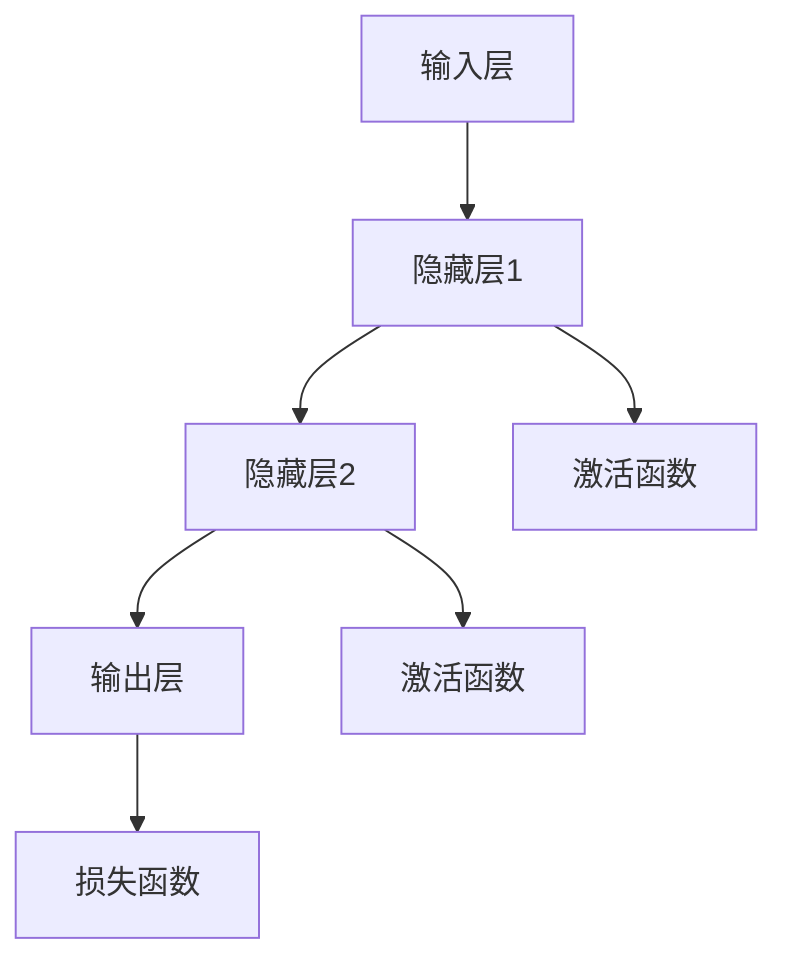

                 

 **关键词**：神经网络、深度学习、映射、算法、数学模型、实践指南

**摘要**：本文旨在为初学者提供一份清晰、易懂的神经网络入门指南。我们将从背景介绍开始，深入探讨神经网络的原理和构建方法，然后通过数学模型和实例讲解，帮助读者理解神经网络的运作机制，并最终展示如何将神经网络应用于实际项目中。文章将包括核心概念、算法原理、数学模型、项目实践以及未来展望等多个部分，旨在帮助读者全面掌握神经网络技术。

## 1. 背景介绍

神经网络作为人工智能的核心技术之一，自20世纪80年代以来，经过了几次重要的迭代和发展。早期的神经网络模型如感知机、多层感知机等，虽然在理论上取得了重要的突破，但由于训练速度慢、效果不佳等问题，使得其在实际应用中受到限制。随着计算能力的提升和算法的改进，特别是深度学习的崛起，神经网络再次焕发出强大的生命力。

深度学习通过构建深度神经网络，实现了在图像识别、自然语言处理、语音识别等领域的重大突破。目前，神经网络已经成为人工智能应用的重要基础，广泛应用于推荐系统、自动驾驶、医疗诊断等领域。随着技术的不断进步，神经网络的应用前景将更加广阔。

本文将重点关注神经网络的入门构建，旨在帮助读者理解神经网络的基本原理和构建方法，为后续深入学习打下坚实的基础。

## 2. 核心概念与联系

### 2.1 神经网络的基本组成

神经网络由大量的简单计算单元（神经元）组成，这些神经元通过加权连接形成一个复杂的网络结构。每个神经元接收多个输入信号，并通过加权求和后经过激活函数输出一个值。神经网络通过不断调整连接的权重，使得网络能够对输入数据进行有效的映射和分类。

### 2.2 深度神经网络的层次结构

深度神经网络（DNN）包括输入层、隐藏层和输出层。输入层接收外部输入数据，隐藏层对输入数据进行特征提取和变换，输出层生成最终的预测结果。每一层的神经元都通过前一层神经元的输出进行加权求和，并通过激活函数进行非线性变换。

### 2.3 神经网络的映射原理

神经网络的映射原理可以通过一个简单的例子来解释。假设我们要构建一个简单的神经网络，用于将二维输入空间映射到一维输出空间。输入空间中的每个点都表示一个具体的输入数据，输出空间中的每个点都表示这个输入数据对应的预测结果。

在训练过程中，神经网络通过不断调整连接权重，使得输入空间中的每个点能够被准确地映射到输出空间中的对应点上。这个过程类似于学习一个函数，将输入空间映射到输出空间。随着训练的进行，神经网络的映射能力逐渐提高，能够处理更复杂的输入数据。

### 2.4 Mermaid 流程图



在上面的 Mermaid 流程图中，A 表示输入层，B、C、D 分别表示隐藏层和输出层，E、F 表示激活函数，G 表示损失函数。输入层接收外部输入数据，通过隐藏层进行特征提取和变换，最终通过输出层生成预测结果。激活函数用于引入非线性变换，使得神经网络能够处理更复杂的问题。损失函数用于衡量预测结果与真实值之间的差距，以指导网络权重的调整。

## 3. 核心算法原理 & 具体操作步骤

### 3.1 算法原理概述

神经网络的训练过程主要基于梯度下降算法。梯度下降算法通过计算损失函数关于网络权重的梯度，不断调整权重，以最小化损失函数。具体来说，神经网络训练包括以下几个步骤：

1. **前向传播**：将输入数据通过网络前向传播，得到输出结果。
2. **计算损失**：计算输出结果与真实值之间的差距，得到损失值。
3. **反向传播**：计算损失函数关于网络权重的梯度，并更新权重。
4. **重复迭代**：重复上述步骤，直到损失函数值趋于最小。

### 3.2 算法步骤详解

1. **初始化权重**：随机初始化网络权重。
2. **前向传播**：
   - 输入数据通过输入层进入网络。
   - 数据经过隐藏层，每个神经元接收来自前一层神经元的输出，通过加权求和后经过激活函数得到输出。
   - 最终输出层生成预测结果。
3. **计算损失**：
   - 计算预测结果与真实值之间的差距，得到损失值。
   - 损失值通常使用均方误差（MSE）或交叉熵损失（Cross Entropy Loss）等函数计算。
4. **反向传播**：
   - 从输出层开始，计算损失函数关于网络权重的梯度。
   - 通过链式法则，将梯度反向传播到隐藏层，并逐层更新权重。
5. **权重更新**：
   - 根据梯度更新权重，以最小化损失函数。
   - 更新策略通常采用梯度下降法，可以使用学习率等超参数调整更新速度。

### 3.3 算法优缺点

**优点**：
- 神经网络具有高度的非线性表达能力，能够处理复杂的非线性问题。
- 通过大量数据和迭代训练，神经网络能够逐渐提高预测精度。
- 神经网络可以自动提取特征，减少人工特征工程的工作量。

**缺点**：
- 训练过程需要大量计算资源，训练时间较长。
- 网络参数较多，容易过拟合。
- 对于特定的任务，神经网络可能需要大量的数据和长时间的训练才能达到较好的效果。

### 3.4 算法应用领域

神经网络的应用领域非常广泛，包括但不限于以下方面：

- **图像识别**：如人脸识别、物体检测、图像分类等。
- **自然语言处理**：如情感分析、机器翻译、文本分类等。
- **语音识别**：将语音信号转换为文本或命令。
- **推荐系统**：基于用户历史行为和偏好推荐相关商品或内容。
- **医学诊断**：如疾病预测、医学图像分析等。
- **自动驾驶**：环境感知、路径规划、决策控制等。

## 4. 数学模型和公式 & 详细讲解 & 举例说明

### 4.1 数学模型构建

神经网络的数学模型主要包括以下几个方面：

- **输入层**：表示输入数据的特征向量。
- **权重矩阵**：表示输入特征与神经元之间的连接权重。
- **激活函数**：用于引入非线性变换，常见的激活函数有 sigmoid、ReLU、Tanh 等。
- **损失函数**：用于衡量预测结果与真实值之间的差距，常见的损失函数有均方误差（MSE）、交叉熵损失（Cross Entropy Loss）等。
- **梯度下降算法**：用于训练网络，通过迭代更新权重，最小化损失函数。

### 4.2 公式推导过程

以下是一个简单的多层感知机（MLP）神经网络的数学模型推导：

假设我们有输入数据 $X$，网络包括 $L$ 层，其中 $l$ 层的输入为 $a^{l-1}$，输出为 $a^l$。第 $l$ 层的神经元输出可以表示为：

$$
a^l = \sigma(W^l a^{l-1} + b^l)
$$

其中，$W^l$ 为第 $l$ 层的权重矩阵，$b^l$ 为第 $l$ 层的偏置向量，$\sigma$ 为激活函数，如 sigmoid 函数：

$$
\sigma(x) = \frac{1}{1 + e^{-x}}
$$

损失函数通常使用均方误差（MSE）：

$$
J = \frac{1}{m} \sum_{i=1}^{m} (\hat{y}^i - y^i)^2
$$

其中，$\hat{y}^i$ 为预测结果，$y^i$ 为真实值，$m$ 为样本数量。

### 4.3 案例分析与讲解

假设我们要构建一个简单的神经网络，用于分类问题。输入数据为二维特征向量，输出为类别标签。网络结构为 1 个输入层、1 个隐藏层和 1 个输出层。

- **输入层**：1 个神经元，表示输入特征向量。
- **隐藏层**：2 个神经元，用于特征提取和变换。
- **输出层**：1 个神经元，表示预测类别。

激活函数使用 ReLU，损失函数使用交叉熵损失。

- **权重矩阵**：$W^1 \in \mathbb{R}^{2 \times 1}$，$W^2 \in \mathbb{R}^{1 \times 2}$，$W^3 \in \mathbb{R}^{1 \times 1}$。
- **偏置向量**：$b^1 \in \mathbb{R}^{2}$，$b^2 \in \mathbb{R}^{1}$，$b^3 \in \mathbb{R}^{1}$。

输入数据为 $X = \begin{bmatrix} 1 \\ 0 \end{bmatrix}$，真实标签为 $y = 1$。

- **前向传播**：

$$
a^1 = X = \begin{bmatrix} 1 \\ 0 \end{bmatrix} \\
a^2 = \sigma(W^1 a^1 + b^1) = \sigma(\begin{bmatrix} 1 & 0 \end{bmatrix} \begin{bmatrix} 1 \\ 0 \end{bmatrix} + \begin{bmatrix} 1 \\ 0 \end{bmatrix}) = \begin{bmatrix} 1 \\ 0 \end{bmatrix} \\
a^3 = \sigma(W^2 a^2 + b^2) = \sigma(\begin{bmatrix} 1 & 0 \end{bmatrix} \begin{bmatrix} 1 \\ 0 \end{bmatrix} + \begin{bmatrix} 0 \\ 1 \end{bmatrix}) = \begin{bmatrix} 1 \\ 1 \end{bmatrix} \\
\hat{y} = \sigma(W^3 a^3 + b^3) = \sigma(\begin{bmatrix} 1 \end{bmatrix} \begin{bmatrix} 1 \\ 1 \end{bmatrix} + \begin{bmatrix} 0 \end{bmatrix}) = \begin{bmatrix} 1 \end{bmatrix}
$$

- **计算损失**：

$$
J = \frac{1}{1} (\hat{y} - y)^2 = (\begin{bmatrix} 1 \end{bmatrix} - \begin{bmatrix} 1 \end{bmatrix})^2 = \begin{bmatrix} 0 \end{bmatrix}
$$

- **反向传播**：

$$
\frac{\partial J}{\partial W^3} = \frac{\partial}{\partial W^3} (\hat{y} - y) = \begin{bmatrix} \end{bmatrix} \\
\frac{\partial J}{\partial b^3} = \frac{\partial}{\partial b^3} (\hat{y} - y) = \begin{bmatrix} \end{bmatrix} \\
\frac{\partial J}{\partial a^3} = \frac{\partial}{\partial a^3} (\hat{y} - y) = \begin{bmatrix} 1 \end{bmatrix} \\
\frac{\partial J}{\partial a^2} = \frac{\partial}{\partial a^2} (\hat{y} - y) = \begin{bmatrix} 1 & 1 \end{bmatrix} \\
\frac{\partial J}{\partial a^1} = \frac{\partial}{\partial a^1} (\hat{y} - y) = \begin{bmatrix} 1 & 0 \end{bmatrix}
$$

根据链式法则，有：

$$
\frac{\partial J}{\partial W^2} = \frac{\partial J}{\partial a^3} a^2 = \begin{bmatrix} 1 \end{bmatrix} \begin{bmatrix} 1 \\ 1 \end{bmatrix} = \begin{bmatrix} 1 & 1 \end{batrix} \\
\frac{\partial J}{\partial b^2} = \frac{\partial J}{\partial a^3} = \begin{bmatrix} 1 \end{bmatrix} \\
\frac{\partial J}{\partial W^1} = \frac{\partial J}{\partial a^2} a^1 = \begin{bmatrix} 1 & 0 \end{bmatrix} \begin{bmatrix} 1 \\ 0 \end{bmatrix} = \begin{bmatrix} 1 \end{bmatrix} \\
\frac{\partial J}{\partial b^1} = \frac{\partial J}{\partial a^2} = \begin{bmatrix} 1 \end{bmatrix}
$$

- **权重更新**：

$$
W^3 \leftarrow W^3 - \alpha \frac{\partial J}{\partial W^3} = W^3 - \alpha \begin{bmatrix} \end{bmatrix} \\
b^3 \leftarrow b^3 - \alpha \frac{\partial J}{\partial b^3} = b^3 - \alpha \begin{bmatrix} \end{bmatrix} \\
W^2 \leftarrow W^2 - \alpha \frac{\partial J}{\partial W^2} = W^2 - \alpha \begin{bmatrix} 1 & 1 \end{bmatrix} \\
b^2 \leftarrow b^2 - \alpha \frac{\partial J}{\partial b^2} = b^2 - \alpha \begin{bmatrix} 1 \end{bmatrix} \\
W^1 \leftarrow W^1 - \alpha \frac{\partial J}{\partial W^1} = W^1 - \alpha \begin{bmatrix} 1 \end{bmatrix} \\
b^1 \leftarrow b^1 - \alpha \frac{\partial J}{\partial b^1} = b^1 - \alpha \begin{bmatrix} 1 \end{bmatrix}
$$

其中，$\alpha$ 为学习率。

通过上述步骤，我们可以完成一次神经网络的训练迭代。重复执行这个过程，直到损失函数值趋于最小，即可获得一个训练好的神经网络模型。

## 5. 项目实践：代码实例和详细解释说明

### 5.1 开发环境搭建

在本文的代码实例中，我们将使用 Python 编程语言和 TensorFlow 深度学习框架来实现一个简单的神经网络。首先，我们需要安装必要的依赖。

```bash
pip install tensorflow numpy matplotlib
```

### 5.2 源代码详细实现

下面是一个简单的神经网络实现，用于实现二分类问题。

```python
import tensorflow as tf
import numpy as np
import matplotlib.pyplot as plt

# 设置随机种子
tf.random.set_seed(42)

# 初始化网络参数
input_shape = (2,)
hidden_units = 2
output_shape = 1

# 创建模型
model = tf.keras.Sequential([
    tf.keras.layers.Dense(units=hidden_units, activation='relu', input_shape=input_shape),
    tf.keras.layers.Dense(units=output_shape, activation='sigmoid')
])

# 编译模型
model.compile(optimizer='adam', loss='binary_crossentropy', metrics=['accuracy'])

# 创建训练数据
X = np.random.rand(100, 2)
y = np.array([0 if (x[0] + x[1] < 0.5) else 1 for x in X])

# 训练模型
model.fit(X, y, epochs=100, batch_size=10)

# 创建测试数据
X_test = np.random.rand(10, 2)
y_test = np.array([0 if (x[0] + x[1] < 0.5) else 1 for x in X_test])

# 测试模型
model.evaluate(X_test, y_test)
```

### 5.3 代码解读与分析

- **导入依赖**：首先，我们导入 TensorFlow、NumPy 和 Matplotlib 三个库。TensorFlow 是一个开源的深度学习框架，NumPy 用于数值计算，Matplotlib 用于可视化。
- **设置随机种子**：为了确保实验的可重复性，我们设置随机种子。
- **初始化网络参数**：我们定义输入层、隐藏层和输出层的单元数量。这里我们使用 ReLU 激活函数和 sigmoid 输出函数。
- **创建模型**：使用 `tf.keras.Sequential` 依次添加层，构建一个简单的神经网络模型。
- **编译模型**：配置优化器、损失函数和评估指标，准备训练模型。
- **创建训练数据**：使用 NumPy 生成随机训练数据，这里我们使用简单的线性关系进行分类。
- **训练模型**：使用 `model.fit` 方法训练模型，设置训练轮次和批量大小。
- **创建测试数据**：生成测试数据，用于评估模型性能。
- **测试模型**：使用 `model.evaluate` 方法计算测试数据的损失和准确率。

### 5.4 运行结果展示

运行上述代码后，我们可以在控制台看到训练过程中损失函数值的变化，以及测试数据的准确率。通过可视化工具（如 Matplotlib），我们还可以绘制输入空间的决策边界。

```python
# 可视化决策边界
def plot_decision_boundary(model, X, y):
    plt.figure(figsize=(8, 6))
    plt.scatter(X[:, 0], X[:, 1], c=y, cmap=plt.cm.coolwarm, s=40)
    ax = plt.gca()
    xlim = ax.get_xlim()
    ylim = ax.get_ylim()

    # 初始化决策边界图
    xx, yy = np.meshgrid(np.linspace(xlim[0], xlim[1], 30), np.linspace(ylim[0], ylim[1], 30))
    Z = model.predict(np.c_[xx.ravel(), yy.ravel()]).reshape(xx.shape)

    # 绘制决策边界
    ax.contour(xx, yy, Z, colors=['k'], levels=[0.5], linewidths=2, origin='lower')

    # 设置坐标轴标签和标题
    ax.set_xlabel('Feature 1')
    ax.set_ylabel('Feature 2')
    ax.set_title('Decision Boundary')

    # 显示图像
    plt.show()

# 可视化训练数据
plot_decision_boundary(model, X, y)

# 可视化测试数据
X_test = np.random.rand(10, 2)
y_test = np.array([0 if (x[0] + x[1] < 0.5) else 1 for x in X_test])
plot_decision_boundary(model, X_test, y_test)
```

通过可视化，我们可以清楚地看到神经网络在不同数据集上的决策边界，这有助于我们理解神经网络的映射能力。

## 6. 实际应用场景

神经网络在各个领域都有广泛的应用，以下是一些典型的实际应用场景：

- **图像识别**：通过卷积神经网络（CNN）实现图像分类、物体检测和图像分割。
- **自然语言处理**：利用循环神经网络（RNN）和长短时记忆网络（LSTM）进行文本分类、情感分析和机器翻译。
- **语音识别**：使用递归神经网络（RNN）和卷积神经网络（CNN）将语音信号转换为文本或命令。
- **推荐系统**：利用神经网络学习用户的历史行为和偏好，实现个性化推荐。
- **医学诊断**：通过深度学习模型对医学图像进行分析，辅助医生进行疾病诊断。
- **自动驾驶**：利用神经网络进行环境感知、路径规划和决策控制，实现自动驾驶功能。

在这些应用场景中，神经网络通过学习大量的数据和模式，实现了对复杂问题的自动求解和预测。随着技术的不断发展，神经网络的未来应用前景将更加广阔。

## 7. 工具和资源推荐

### 7.1 学习资源推荐

- **书籍**：
  - 《深度学习》（Goodfellow, Bengio, Courville 著）
  - 《神经网络与深度学习》（邱锡鹏 著）
  - 《动手学深度学习》（阿斯顿·张 著）

- **在线课程**：
  - Coursera 上的《深度学习》课程
  - Udacity 上的《深度学习工程师纳米学位》
  - fast.ai 上的《深度学习基础》课程

### 7.2 开发工具推荐

- **TensorFlow**：一个开源的深度学习框架，适用于各种规模的深度学习项目。
- **PyTorch**：一个流行的深度学习框架，支持动态计算图和自动微分。
- **Keras**：一个高层次的深度学习框架，基于 TensorFlow 和 Theano，简化了深度学习模型的构建和训练。

### 7.3 相关论文推荐

- **《A Guide to Committee Machine Learning》**：介绍了如何组合多个模型以提高预测性能。
- **《Very Deep Convolutional Networks for Large-Scale Image Recognition》**：介绍了卷积神经网络在图像识别中的应用。
- **《Sequence to Sequence Learning with Neural Networks》**：介绍了循环神经网络在序列生成任务中的应用。

通过这些工具和资源，您可以更好地掌握神经网络技术，并将其应用于实际问题中。

## 8. 总结：未来发展趋势与挑战

### 8.1 研究成果总结

神经网络作为人工智能的核心技术，经过多年的发展，已经取得了显著的成果。从早期的简单神经网络到现在的深度学习模型，神经网络在图像识别、自然语言处理、语音识别等领域的应用取得了重大突破。同时，神经网络的训练算法和优化方法也在不断改进，提高了模型的训练速度和预测性能。

### 8.2 未来发展趋势

未来，神经网络将继续朝着更高效、更智能的方向发展。以下是一些可能的发展趋势：

- **更深的网络结构**：随着计算能力的提升，更深的神经网络结构将逐渐成为主流，以处理更复杂的任务。
- **更有效的训练算法**：针对大规模数据集和模型，研究者将致力于开发更高效的训练算法，以降低训练时间和计算成本。
- **跨模态学习**：通过融合不同类型的数据（如文本、图像、声音等），实现跨模态的智能理解和交互。
- **可解释性**：提高神经网络的透明度和可解释性，使其在关键应用场景中更具实用价值。

### 8.3 面临的挑战

尽管神经网络取得了显著进展，但仍然面临一些挑战：

- **计算资源需求**：神经网络训练需要大量的计算资源，这对资源有限的场景提出了挑战。
- **过拟合风险**：神经网络模型容易过拟合，需要设计更有效的正则化方法。
- **数据隐私和安全**：在处理敏感数据时，如何保护数据隐私和安全是一个重要问题。
- **模型可解释性**：提高模型的可解释性，使其在决策过程中更具可信度。

### 8.4 研究展望

未来，研究者将继续探索神经网络的深度和广度，开发更高效、更智能的神经网络模型。同时，神经网络与其他人工智能技术的融合也将成为一个重要方向，以实现更强大的智能系统。通过不断的创新和突破，神经网络将在更多领域发挥重要作用，推动人工智能的发展。

## 9. 附录：常见问题与解答

### Q：如何选择合适的神经网络结构？

A：选择合适的神经网络结构需要考虑以下几个因素：

- **任务类型**：不同的任务可能需要不同类型的神经网络结构，如卷积神经网络（CNN）适用于图像识别，循环神经网络（RNN）适用于序列数据处理。
- **数据规模**：对于大规模数据集，可能需要更深的网络结构；对于小规模数据集，较浅的网络可能已经足够。
- **计算资源**：较深的网络结构需要更多的计算资源，需要根据实际情况进行权衡。

### Q：如何避免神经网络过拟合？

A：避免神经网络过拟合可以采取以下方法：

- **数据增强**：通过增加数据的多样性，提高模型的泛化能力。
- **正则化**：使用正则化技术，如 L1、L2 正则化，限制模型复杂度。
- **dropout**：在训练过程中随机丢弃一部分神经元，减少模型依赖。
- **提前停止**：在训练过程中，当验证集的性能不再提升时，提前停止训练。

### Q：如何优化神经网络训练速度？

A：优化神经网络训练速度可以采取以下方法：

- **批量归一化**：在每一层的输出进行归一化处理，加快梯度下降过程。
- **优化器选择**：选择合适的优化器，如 Adam、RMSProp 等，提高训练效率。
- **模型剪枝**：去除不重要的神经元和连接，减少模型参数。
- **混合精度训练**：使用混合精度训练，降低计算成本。

通过以上方法，可以有效提高神经网络的训练速度和性能。

作者：禅与计算机程序设计艺术 / Zen and the Art of Computer Programming

