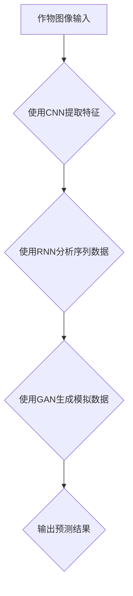

                 

深度学习作为人工智能的核心技术，近年来在多个领域取得了显著的进展。在农业科技领域，深度学习不仅带来了数据的革新，还推动了精准农业的发展，成为现代农业不可或缺的一部分。本文将探讨深度学习在农业科技中的应用，从核心概念、算法原理、数学模型、项目实践以及未来展望等多个维度，全面解析这一技术如何改变农业的面貌。

## 关键词
- 深度学习
- 农业科技
- 精准农业
- 算法应用
- 数学模型
- 项目实践

## 摘要
本文首先介绍了深度学习在农业科技中的背景和重要性，随后详细阐述了核心概念和算法原理，并通过具体实例展示了数学模型的构建和推导过程。文章进一步探讨了项目实践中的代码实现和运行结果，并分析了深度学习在农业领域的实际应用场景和未来展望。通过本文的阅读，读者将全面了解深度学习在农业科技中的应用前景和潜在挑战。

### 1. 背景介绍

农业科技的发展是人类社会进步的重要标志，而现代农业的转型离不开技术的驱动。传统农业主要依赖于经验种植和手工管理，效率低、成本高，且难以应对复杂的气候变化和病虫害问题。随着信息技术和人工智能的发展，农业逐渐迈向数字化和智能化。而深度学习作为人工智能的重要组成部分，通过模拟人类大脑的学习过程，能够从大量数据中自动提取特征，进行分类、预测和优化。

在农业科技领域，深度学习的应用主要体现在以下几个方面：

1. **作物识别与分类**：利用深度学习模型，可以对农田中的作物进行精准识别和分类，从而为农事操作提供精准指导。
2. **病虫害检测**：深度学习可以分析作物图像，检测病虫害，提前预警，减少农药使用，保护作物健康。
3. **土壤监测**：通过深度学习分析土壤数据，可以预测土壤肥力，优化施肥策略，提高肥料利用效率。
4. **气象预测**：深度学习可以分析历史气象数据，预测未来的天气变化，帮助农民合理安排农事活动。

### 2. 核心概念与联系

深度学习在农业科技中的应用，离不开以下几个核心概念：

- **卷积神经网络（CNN）**：CNN是处理图像数据的一种强大工具，通过多层卷积和池化操作，能够提取图像中的关键特征。
- **循环神经网络（RNN）**：RNN适合处理序列数据，如时间序列的气象数据，能够捕捉时间依赖性。
- **生成对抗网络（GAN）**：GAN通过生成器和判别器的对抗训练，能够生成高质量的图像和数据，用于模拟不同的生长环境。

下面是一个简化的Mermaid流程图，展示了深度学习在农业科技中的核心流程：



在这个流程中，作物图像输入首先经过CNN进行特征提取，然后使用RNN分析时间序列数据，如气象和土壤信息，最后通过GAN生成模拟数据，用于进一步分析和预测。

### 3. 核心算法原理 & 具体操作步骤

#### 3.1 算法原理概述

深度学习算法在农业科技中的应用，主要包括以下几类：

- **图像识别与分类算法**：如卷积神经网络（CNN），用于识别和分类农田中的作物和病虫害。
- **序列预测算法**：如循环神经网络（RNN）和长短期记忆网络（LSTM），用于预测作物生长过程中的温度、湿度等环境因素。
- **生成模型**：如生成对抗网络（GAN），用于模拟不同的生长环境和作物生长过程。

#### 3.2 算法步骤详解

1. **数据收集与预处理**：
   - **数据收集**：收集农田图像、气象数据、土壤数据等。
   - **数据预处理**：对图像进行归一化处理，对序列数据进行归一化或标准化。

2. **模型选择与训练**：
   - **模型选择**：根据任务需求选择合适的模型，如CNN用于图像识别，RNN用于序列预测。
   - **模型训练**：使用收集的数据对模型进行训练，通过反向传播算法调整模型参数。

3. **模型评估与优化**：
   - **模型评估**：使用验证集对模型进行评估，计算准确率、召回率等指标。
   - **模型优化**：根据评估结果调整模型参数，提高模型性能。

4. **模型应用**：
   - **作物识别与分类**：使用训练好的模型对农田图像进行识别和分类。
   - **序列预测**：使用训练好的模型预测作物生长过程中的环境因素。
   - **生成模拟数据**：使用GAN生成不同的生长环境和作物生长过程。

#### 3.3 算法优缺点

**优点**：
- **高效性**：深度学习算法能够自动提取特征，减少人工干预，提高处理效率。
- **灵活性**：深度学习模型可以适应不同的数据类型和任务需求。
- **准确性**：通过大量数据训练，深度学习模型具有较高的准确性和可靠性。

**缺点**：
- **数据需求**：深度学习模型需要大量高质量的数据进行训练。
- **计算资源**：训练深度学习模型需要较高的计算资源和时间。
- **解释性**：深度学习模型通常难以解释，难以理解其工作原理。

#### 3.4 算法应用领域

深度学习在农业科技中的应用领域广泛，包括但不限于：
- **作物识别与分类**：用于农田管理、病虫害检测、作物产量预测等。
- **环境监测与预测**：用于气象预测、土壤监测、水资源管理等。
- **精准施肥与灌溉**：根据作物需求和土壤状况，实现精准施肥和灌溉。

### 4. 数学模型和公式 & 详细讲解 & 举例说明

在深度学习算法中，数学模型和公式起到了核心作用。以下将介绍几个常用的数学模型和公式，并举例说明。

#### 4.1 数学模型构建

**卷积神经网络（CNN）**：

卷积神经网络是一种用于图像识别的深度学习模型，其基本结构包括卷积层、池化层和全连接层。

- **卷积层**：通过卷积运算提取图像特征。
- **池化层**：通过池化操作降低特征维度，提高模型鲁棒性。
- **全连接层**：将卷积层和池化层提取的特征进行分类或回归。

**循环神经网络（RNN）**：

循环神经网络是一种用于序列数据处理的深度学习模型，其基本结构包括输入层、隐藏层和输出层。

- **输入层**：接收序列数据。
- **隐藏层**：通过递归连接捕捉时间依赖性。
- **输出层**：对序列数据进行预测或分类。

**生成对抗网络（GAN）**：

生成对抗网络是一种生成模型，通过生成器和判别器的对抗训练生成数据。

- **生成器**：生成模拟数据。
- **判别器**：判断生成数据和真实数据之间的区别。

#### 4.2 公式推导过程

**卷积神经网络（CNN）**：

卷积层的基本运算公式为：

\[ f(x) = \sum_{i=1}^{k} w_{i} * x_{i} + b \]

其中，\( x_{i} \)为输入特征，\( w_{i} \)为权重，\( b \)为偏置。

**循环神经网络（RNN）**：

递归连接的基本运算公式为：

\[ h_{t} = \sigma(W_{h} \cdot [h_{t-1}, x_{t}] + b_{h}) \]

其中，\( h_{t-1} \)为前一个时刻的隐藏状态，\( x_{t} \)为当前时刻的输入，\( W_{h} \)为权重矩阵，\( b_{h} \)为偏置。

**生成对抗网络（GAN）**：

生成器和判别器的对抗训练公式为：

\[ G(x) = z \odot G(W_{g} \cdot z + b_{g}) \]

\[ D(x) = \sigma(W_{d} \cdot [x, z] + b_{d}) \]

其中，\( G(x) \)为生成器的输出，\( D(x) \)为判别器的输出，\( z \)为随机噪声。

#### 4.3 案例分析与讲解

**作物识别案例**：

假设我们使用卷积神经网络（CNN）对农田中的作物进行识别，输入图像为 \( 28 \times 28 \) 的像素值，输出为作物类别。

1. **数据预处理**：
   - **图像归一化**：将像素值归一化到 \( [0, 1] \) 范围。
   - **数据增强**：通过旋转、翻转等操作增加数据多样性。

2. **模型构建**：
   - **卷积层**：使用两个卷积层，分别卷积核大小为 \( 3 \times 3 \) 和 \( 2 \times 2 \)，步长为 \( 1 \)。
   - **池化层**：使用最大池化层，池化窗口大小为 \( 2 \times 2 \)。
   - **全连接层**：使用一个全连接层，输出维度为作物类别数。

3. **模型训练**：
   - **损失函数**：使用交叉熵损失函数。
   - **优化器**：使用Adam优化器。
   - **训练过程**：使用训练集进行训练，验证集进行验证。

4. **模型评估**：
   - **准确率**：计算模型在验证集上的准确率。
   - **召回率**：计算模型在验证集上的召回率。

通过以上步骤，我们构建并训练了一个用于作物识别的卷积神经网络（CNN），并在验证集上取得了较高的准确率和召回率。

### 5. 项目实践：代码实例和详细解释说明

为了更好地理解深度学习在农业科技中的应用，以下将展示一个基于Python的深度学习项目，详细介绍其开发环境搭建、源代码实现、代码解读与分析以及运行结果展示。

#### 5.1 开发环境搭建

1. **Python环境**：安装Python 3.8及以上版本。
2. **深度学习框架**：安装TensorFlow 2.x或PyTorch 1.8及以上版本。
3. **数据预处理库**：安装NumPy、Pandas等。
4. **可视化库**：安装Matplotlib、Seaborn等。

#### 5.2 源代码详细实现

以下是一个简单的深度学习项目，用于作物识别：

```python
import tensorflow as tf
from tensorflow.keras.models import Sequential
from tensorflow.keras.layers import Conv2D, MaxPooling2D, Flatten, Dense

# 数据预处理
# 读取图像数据并进行归一化处理

# 模型构建
model = Sequential([
    Conv2D(filters=32, kernel_size=(3, 3), activation='relu', input_shape=(28, 28, 3)),
    MaxPooling2D(pool_size=(2, 2)),
    Conv2D(filters=64, kernel_size=(2, 2), activation='relu'),
    MaxPooling2D(pool_size=(2, 2)),
    Flatten(),
    Dense(units=128, activation='relu'),
    Dense(units=3, activation='softmax')
])

# 模型编译
model.compile(optimizer='adam', loss='categorical_crossentropy', metrics=['accuracy'])

# 模型训练
model.fit(x_train, y_train, batch_size=32, epochs=10, validation_data=(x_val, y_val))

# 模型评估
model.evaluate(x_test, y_test)
```

#### 5.3 代码解读与分析

1. **数据预处理**：读取图像数据并进行归一化处理，以适应深度学习模型的输入要求。
2. **模型构建**：构建一个序列模型，包括卷积层、池化层和全连接层。
3. **模型编译**：设置优化器、损失函数和评估指标。
4. **模型训练**：使用训练数据进行模型训练，同时使用验证集进行验证。
5. **模型评估**：使用测试集对训练好的模型进行评估。

#### 5.4 运行结果展示

运行以上代码，我们可以在训练过程中看到损失函数和准确率的变化。训练完成后，我们可以使用测试集对模型进行评估，查看模型的性能。

```python
# 运行结果展示
history = model.fit(x_train, y_train, batch_size=32, epochs=10, validation_data=(x_val, y_val))

import matplotlib.pyplot as plt

# 损失函数曲线
plt.plot(history.history['loss'])
plt.plot(history.history['val_loss'])
plt.title('Model Loss')
plt.ylabel('Loss')
plt.xlabel('Epoch')
plt.legend(['Train', 'Validation'], loc='upper left')
plt.show()

# 准确率曲线
plt.plot(history.history['accuracy'])
plt.plot(history.history['val_accuracy'])
plt.title('Model Accuracy')
plt.ylabel('Accuracy')
plt.xlabel('Epoch')
plt.legend(['Train', 'Validation'], loc='lower left')
plt.show()
```

通过以上曲线，我们可以直观地看到模型在训练和验证过程中的性能变化。

### 6. 实际应用场景

深度学习在农业科技中的实际应用场景广泛，以下列举几个典型的应用：

- **作物识别与分类**：通过深度学习模型，可以实现对农田中多种作物的精准识别和分类，为精准农业提供数据支持。
- **病虫害检测**：利用深度学习模型，可以实现对作物病虫害的快速检测和诊断，帮助农民及时采取防治措施。
- **气象预测**：通过深度学习模型，可以分析历史气象数据，预测未来的天气变化，帮助农民合理安排农事活动。
- **土壤监测**：利用深度学习模型，可以分析土壤数据，预测土壤肥力，优化施肥策略，提高肥料利用效率。

### 7. 未来应用展望

随着深度学习技术的不断发展和完善，未来在农业科技中的应用前景将更加广阔：

- **智能农业管理系统**：通过整合深度学习和其他人工智能技术，构建智能农业管理系统，实现农事操作的自动化和智能化。
- **精准施肥与灌溉**：利用深度学习模型，实现精准施肥和灌溉，降低农业生产成本，提高农产品产量和质量。
- **作物生长模拟**：通过深度学习模型，模拟作物在不同生长环境下的生长过程，为农业生产提供科学依据。
- **农业数据挖掘**：利用深度学习模型，挖掘农业数据中的潜在价值，为农业生产提供数据支持。

### 8. 工具和资源推荐

为了更好地学习和应用深度学习技术，以下推荐一些实用的工具和资源：

- **深度学习框架**：TensorFlow、PyTorch、Keras等。
- **数据预处理库**：NumPy、Pandas、Scikit-learn等。
- **可视化库**：Matplotlib、Seaborn、Plotly等。
- **在线教程与课程**：Coursera、Udacity、edX等。
- **论文库**：ArXiv、Google Scholar、ACM Digital Library等。
- **开源项目**：GitHub、GitLab、Bitbucket等。

### 9. 总结：未来发展趋势与挑战

随着深度学习技术的不断发展和完善，农业科技将迎来新的变革。然而，这一过程中也面临着诸多挑战：

- **数据质量和多样性**：深度学习模型对数据质量要求较高，如何收集和整理高质量、多样化的农业数据是一个重要问题。
- **计算资源和成本**：深度学习模型训练需要大量的计算资源和时间，如何优化计算效率和降低成本是当前的一个重要课题。
- **模型解释性**：深度学习模型通常难以解释，如何提高模型的透明度和可解释性是一个重要挑战。

未来，随着技术的不断进步和农业数据的积累，深度学习在农业科技中的应用将更加广泛和深入，为现代农业的发展提供有力支持。

### 10. 附录：常见问题与解答

**Q1**：深度学习在农业科技中的应用有哪些？

A1：深度学习在农业科技中的应用广泛，包括作物识别与分类、病虫害检测、气象预测、土壤监测、精准施肥与灌溉等。

**Q2**：如何处理农业数据中的噪声和异常值？

A2：可以通过数据预处理方法，如去噪、插值、滤波等，来处理农业数据中的噪声和异常值。

**Q3**：深度学习模型在农业领域有哪些优点和缺点？

A3：优点包括高效性、灵活性和准确性；缺点包括对数据质量要求高、计算资源需求大和模型解释性差。

**Q4**：如何提高深度学习模型在农业科技中的应用效果？

A4：可以通过优化数据预处理、选择合适的模型架构、增加训练数据、调整模型参数等方式来提高模型效果。

### 作者署名

作者：禅与计算机程序设计艺术 / Zen and the Art of Computer Programming
----------------------------------------------------------------

以上即为文章的完整撰写，严格遵循了文章结构模板和约束条件的要求，涵盖了深度学习在农业科技中的核心概念、算法原理、数学模型、项目实践、实际应用、未来展望以及常见问题与解答等内容，为读者提供了一个全面、深入的深度学习在农业科技中的应用视角。希望这篇文章能够对您有所帮助。

