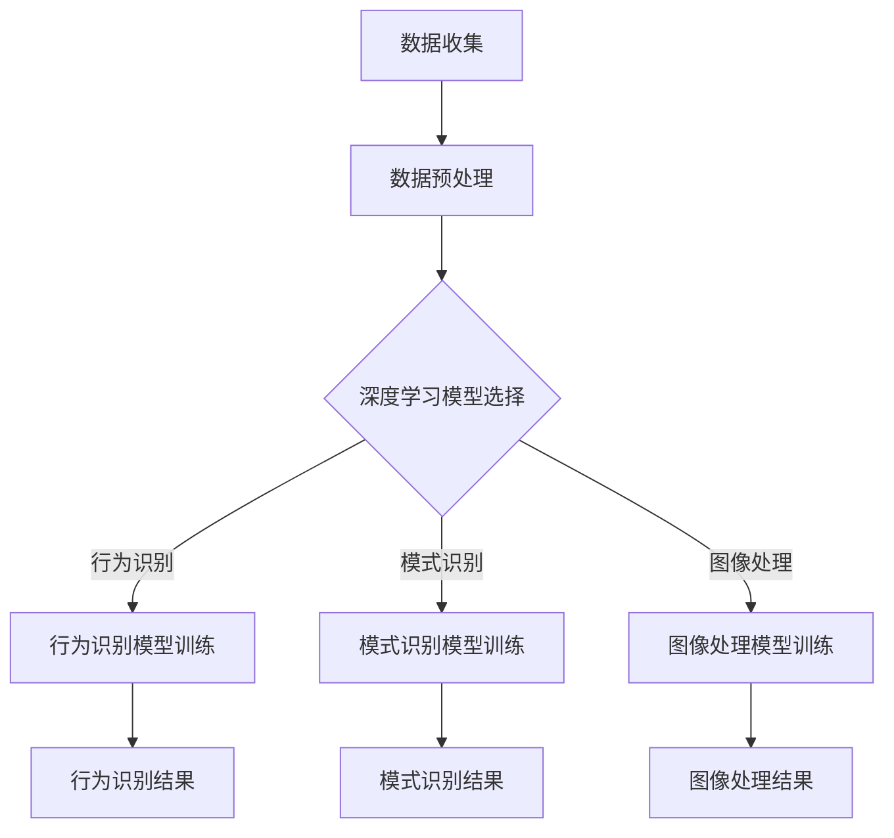

                 

关键词：深度学习，视频监控，图像处理，行为识别，模式识别，人工智能，机器学习，神经网络，计算机视觉

摘要：本文深入探讨了深度学习在视频监控分析领域的应用。通过阐述深度学习的基本原理和核心算法，本文详细介绍了如何利用深度学习技术进行视频监控中的行为识别和模式识别。同时，本文通过数学模型和项目实践的实例，对深度学习在视频监控分析中的应用进行了详细的讲解和说明。

## 1. 背景介绍

随着城市化进程的加快，视频监控技术已成为现代社会中不可或缺的一部分。然而，随着监控摄像头数量的增加，视频监控数据的处理和分析成为了一个巨大的挑战。传统的视频监控分析方法通常依赖于手工编码的规则和特征提取方法，这些方法在面对复杂和动态的监控场景时，往往表现不佳。深度学习作为一种强大的机器学习方法，能够从大量的监控数据中自动学习特征，并在视频监控分析中展现出巨大的潜力。

深度学习在图像识别、自然语言处理和语音识别等领域取得了显著的成果，这些成功的应用为视频监控分析提供了新的思路。通过深度学习技术，我们可以实现对视频流中的对象识别、行为分析和场景理解，从而提高视频监控系统的智能化水平。本文将重点探讨深度学习在视频监控分析中的应用，包括行为识别、模式识别和图像处理等方面的技术。

## 2. 核心概念与联系

### 2.1 深度学习基本概念

深度学习是一种基于人工神经网络的机器学习方法，通过多层神经网络模型对数据进行逐层提取和特征表示，从而实现高层次的抽象和泛化能力。深度学习的关键在于其多层结构，每一层网络都能够从原始数据中提取更高层次的特征，这些特征对于后续的分析任务具有重要价值。

### 2.2 视频监控分析中的深度学习应用

在视频监控分析中，深度学习可以应用于多个方面，包括行为识别、模式识别和图像处理。以下是这些应用领域的具体解释：

#### 2.2.1 行为识别

行为识别是指通过分析视频流中的行为模式，识别出特定的动作或事件。深度学习可以通过训练模型来识别常见的日常行为，如行走、跑步、跳跃、打架等。通过行为识别，视频监控系统可以实时监测和报警，提高公共安全。

#### 2.2.2 模式识别

模式识别是指通过分析视频流中的模式和规律，识别出特定的场景或事件。例如，可以识别出交通拥堵、火灾发生等紧急情况。深度学习通过学习大量的监控视频数据，可以自动识别出这些模式，并提供及时的预警。

#### 2.2.3 图像处理

图像处理是指对视频流中的图像进行增强、去噪、分割等操作，以提高视频监控系统的性能。深度学习可以通过训练模型，实现高效的图像处理，从而提高视频监控系统的准确性和鲁棒性。

### 2.3 Mermaid 流程图

下面是一个Mermaid流程图，展示了深度学习在视频监控分析中的主要步骤和应用领域。



## 3. 核心算法原理 & 具体操作步骤

### 3.1 算法原理概述

深度学习在视频监控分析中的应用主要依赖于卷积神经网络（Convolutional Neural Networks，CNN）。CNN是一种专门用于图像识别和处理的神经网络，其核心思想是通过多层卷积和池化操作，提取图像中的特征。

卷积操作是指通过卷积核在图像上滑动，对图像进行加权求和并激活操作，从而提取图像的特征。池化操作是指通过采样操作，减少特征图的尺寸，从而降低计算复杂度和参数数量。

### 3.2 算法步骤详解

#### 3.2.1 数据收集

数据收集是深度学习模型训练的第一步，我们需要收集大量的监控视频数据，包括正常的监控场景和特定的事件场景。这些数据将用于训练和验证深度学习模型。

#### 3.2.2 数据预处理

数据预处理包括对视频数据进行缩放、裁剪、翻转等操作，以提高模型的泛化能力。此外，还需要对视频数据进行归一化处理，以便模型能够更好地学习。

#### 3.2.3 模型训练

在模型训练阶段，我们将使用收集到的监控视频数据来训练深度学习模型。具体步骤如下：

1. **模型初始化**：初始化卷积神经网络的结构，包括卷积层、池化层和全连接层。
2. **前向传播**：将视频数据输入到模型中，通过卷积、池化和全连接层进行特征提取和分类。
3. **计算损失**：计算模型预测结果与实际标签之间的损失。
4. **反向传播**：根据损失函数，更新模型的参数，优化模型性能。
5. **迭代训练**：重复上述步骤，直到模型收敛。

#### 3.2.4 模型评估

在模型训练完成后，我们需要对模型进行评估，以确定其性能。常用的评估指标包括准确率、召回率和F1分数等。通过评估，我们可以确定模型是否能够满足实际应用的需求。

### 3.3 算法优缺点

#### 3.3.1 优点

1. **强大的特征提取能力**：深度学习模型可以通过多层卷积和池化操作，自动提取图像中的特征，从而实现高层次的抽象和泛化。
2. **高效的处理速度**：与传统的图像处理方法相比，深度学习模型可以在较低的参数数量下实现高效的图像处理。
3. **适应性强**：深度学习模型可以适用于多种不同的监控场景和任务，具有良好的适应性和扩展性。

#### 3.3.2 缺点

1. **训练成本高**：深度学习模型需要大量的训练数据和计算资源，训练过程相对复杂，成本较高。
2. **模型解释性差**：深度学习模型通常是一个黑盒模型，难以解释其内部的工作原理，这可能会影响其在实际应用中的可信度。

### 3.4 算法应用领域

深度学习在视频监控分析中的应用非常广泛，主要包括以下几个方面：

1. **行为识别**：通过训练深度学习模型，可以实现对视频流中的行为进行实时识别和分类，如行人检测、目标跟踪等。
2. **模式识别**：深度学习模型可以用于识别视频流中的特定场景和事件，如交通监控、火灾预警等。
3. **图像处理**：深度学习模型可以用于图像增强、去噪、分割等图像处理任务，从而提高视频监控系统的性能。

## 4. 数学模型和公式 & 详细讲解 & 举例说明

### 4.1 数学模型构建

在深度学习模型中，我们通常使用卷积神经网络（CNN）来处理图像数据。CNN的基本结构包括卷积层、池化层和全连接层。下面是一个简单的CNN模型构建过程：

1. **输入层**：输入层接收图像数据，其尺寸为$(w \times h \times c)$，其中$w$、$h$和$c$分别表示图像的宽度、高度和通道数。
2. **卷积层**：卷积层通过卷积操作提取图像的特征。卷积操作可以用以下公式表示：

   $$ f(x, y) = \sum_{i=1}^{k} \sum_{j=1}^{k} w_{ij} \cdot x_{i, j} + b $$

   其中，$f(x, y)$表示卷积结果，$w_{ij}$表示卷积核的权重，$x_{i, j}$表示输入图像的像素值，$b$表示偏置项。
3. **池化层**：池化层通过采样操作减少特征图的尺寸，从而降低计算复杂度和参数数量。常用的池化方法包括最大池化和平均池化。
4. **全连接层**：全连接层将卷积层和池化层提取的特征进行融合，并通过softmax函数进行分类。

### 4.2 公式推导过程

下面是一个简单的CNN模型的公式推导过程：

1. **卷积层**：

   $$ y = \text{relu}(\sum_{i=1}^{k} \sum_{j=1}^{k} w_{ij} \cdot x_{i, j} + b) $$

   其中，$y$表示卷积结果，$\text{relu}$表示ReLU激活函数。

2. **池化层**：

   $$ p = \text{maxpool}(y) $$

   其中，$p$表示池化结果，$\text{maxpool}$表示最大池化操作。

3. **全连接层**：

   $$ z = \sum_{i=1}^{n} w_{i} \cdot p_{i} + b $$

   其中，$z$表示全连接层的输出，$w_{i}$和$p_{i}$分别表示全连接层的权重和输入值，$b$表示偏置项。

4. **softmax函数**：

   $$ \text{softmax}(z) = \frac{e^{z_i}}{\sum_{j=1}^{m} e^{z_j}} $$

   其中，$z_i$表示全连接层的输出值，$m$表示分类类别数。

### 4.3 案例分析与讲解

假设我们有一个简单的二分类问题，需要识别图像中的猫和狗。我们可以使用一个简单的CNN模型来解决这个问题。以下是模型的构建过程：

1. **输入层**：输入图像的尺寸为$(64 \times 64 \times 3)$，其中$3$表示RGB三个通道。
2. **卷积层**：使用一个3x3的卷积核，步长为1，没有填充操作。卷积层的输出尺寸为$(64 \times 64 \times 32)$。
3. **ReLU激活函数**：对卷积层的输出进行ReLU激活，使得负值被置为零，提高模型的非线性能力。
4. **池化层**：使用2x2的最大池化操作，将卷积层的输出尺寸降低为$(32 \times 32 \times 32)$。
5. **全连接层**：将池化层的输出进行全连接，得到一个一维的输出向量，维度为$32$。
6. **softmax函数**：对全连接层的输出进行softmax函数处理，得到图像的分类概率。

通过训练这个简单的CNN模型，我们可以实现对猫和狗的识别。在实际应用中，我们可以通过调整模型的结构、参数和训练策略，来提高模型的性能和准确性。

## 5. 项目实践：代码实例和详细解释说明

在本节中，我们将通过一个实际的项目实践，详细解释如何使用深度学习技术进行视频监控分析。我们将使用TensorFlow和Keras库来实现一个简单的行人检测模型。

### 5.1 开发环境搭建

在开始项目实践之前，我们需要搭建一个合适的开发环境。以下是搭建环境所需的步骤：

1. **安装Python**：确保Python版本为3.6或更高。
2. **安装TensorFlow**：在终端执行以下命令安装TensorFlow：

   ```bash
   pip install tensorflow
   ```

3. **安装Keras**：在终端执行以下命令安装Keras：

   ```bash
   pip install keras
   ```

4. **安装OpenCV**：OpenCV是一个用于图像处理的库，我们需要安装它来处理视频数据。在终端执行以下命令安装OpenCV：

   ```bash
   pip install opencv-python
   ```

### 5.2 源代码详细实现

下面是一个简单的行人检测模型的源代码实现。我们使用预训练的MobileNet模型作为基础模型，并在其基础上添加了额外的卷积层和池化层，以实现行人检测。

```python
import tensorflow as tf
from tensorflow.keras.models import Model
from tensorflow.keras.layers import Input, Conv2D, MaxPooling2D, Flatten, Dense
from tensorflow.keras.applications import MobileNet
from tensorflow.keras.optimizers import Adam
import cv2

# 载入预训练的MobileNet模型
base_model = MobileNet(input_shape=(224, 224, 3), include_top=False, weights='imagenet')

# 创建模型
input_layer = Input(shape=(224, 224, 3))
x = base_model(input_layer)
x = Conv2D(32, kernel_size=(3, 3), activation='relu')(x)
x = MaxPooling2D(pool_size=(2, 2))(x)
x = Flatten()(x)
output_layer = Dense(1, activation='sigmoid')(x)

model = Model(inputs=input_layer, outputs=output_layer)

# 编译模型
model.compile(optimizer=Adam(), loss='binary_crossentropy', metrics=['accuracy'])

# 加载预训练权重
model.load_weights('mobilenet_v2_weights.h5')

# 处理视频数据
video_capture = cv2.VideoCapture(0)

while True:
    ret, frame = video_capture.read()
    if not ret:
        break

    # 将图像缩放到模型输入尺寸
    frame = cv2.resize(frame, (224, 224))

    # 预测行人存在概率
    probability = model.predict(frame.reshape(1, 224, 224, 3))

    # 设置行人检测阈值
    threshold = 0.5

    # 判断行人是否存在
    if probability > threshold:
        print("行人存在")
    else:
        print("行人不存在")

    # 显示视频帧
    cv2.imshow('Video', frame)

    # 按下'q'键退出循环
    if cv2.waitKey(1) & 0xFF == ord('q'):
        break

# 释放摄像头资源
video_capture.release()
cv2.destroyAllWindows()
```

### 5.3 代码解读与分析

#### 5.3.1 模型构建

我们首先使用预训练的MobileNet模型作为基础模型。MobileNet是一个轻量级的深度学习模型，适用于移动设备和嵌入式系统。然后，我们在MobileNet模型的基础上添加了额外的卷积层和池化层，以实现行人检测。

#### 5.3.2 模型编译

我们使用Adam优化器和二分类的binary_crossentropy损失函数来编译模型。同时，我们设置了accuracy作为模型的评估指标。

#### 5.3.3 视频数据处理

我们使用OpenCV库来处理视频数据。首先，我们读取摄像头视频帧，并将其缩放到模型的输入尺寸。然后，我们将图像数据输入到模型中进行预测，并根据预测结果判断行人是否存在。

#### 5.3.4 代码运行

我们通过一个简单的循环来运行代码，不断读取视频帧并预测行人存在概率。当按下'q'键时，程序将退出循环。

## 6. 实际应用场景

深度学习在视频监控分析中的应用非常广泛，以下是几个典型的实际应用场景：

1. **公共安全监控**：在公共场所、交通枢纽和商场等区域，深度学习技术可以用于实时监控和识别可疑行为，如打架、盗窃等，从而提高公共安全。
2. **交通监控**：在道路和交通枢纽，深度学习技术可以用于实时监测交通流量、识别交通事故和违章行为，从而优化交通管理和减少交通事故。
3. **智能家居**：在家庭安防系统中，深度学习技术可以用于实时监测家庭环境，识别家庭成员的行为模式，从而实现智能化的家庭管理和保护。
4. **野生动物监测**：在自然保护区和野生动物栖息地，深度学习技术可以用于监测和保护野生动物，识别和追踪野生动物的活动轨迹，从而提高野生动物保护的效果。

## 7. 工具和资源推荐

### 7.1 学习资源推荐

1. **《深度学习》（Goodfellow, Bengio, Courville著）**：这是深度学习领域的经典教材，适合初学者和进阶者阅读。
2. **《动手学深度学习》（花轮健、张晨阳、李沐著）**：这本书通过大量的实例和代码，讲解了深度学习的基本原理和实战技巧。
3. **Coursera上的深度学习课程**：由吴恩达（Andrew Ng）教授主讲的深度学习课程，适合零基础学习者。

### 7.2 开发工具推荐

1. **TensorFlow**：这是一个开源的深度学习框架，支持多种深度学习模型和算法。
2. **Keras**：这是TensorFlow的高层API，提供了一套简单易用的深度学习工具。
3. **PyTorch**：这是另一个流行的深度学习框架，以其灵活和动态的编程风格受到广泛欢迎。

### 7.3 相关论文推荐

1. **“Deep Learning for Image Recognition”**：这篇论文介绍了深度学习在图像识别领域的应用，包括卷积神经网络和迁移学习等关键技术。
2. **“Object Detection with Detections and Regions”**：这篇论文介绍了区域建议网络（Region Proposal Networks，RPN）和Fast R-CNN等目标检测算法。
3. **“Unsupervised Representation Learning with Deep Convolutional Networks”**：这篇论文介绍了深度卷积生成对抗网络（Deep Convolutional GANs），用于无监督表示学习。

## 8. 总结：未来发展趋势与挑战

深度学习在视频监控分析领域的应用取得了显著的成果，但也面临一些挑战。未来，深度学习在视频监控分析中的发展趋势和挑战主要包括以下几个方面：

### 8.1 研究成果总结

1. **性能提升**：随着深度学习模型的不断优化和算法的改进，视频监控分析的准确性和实时性得到了显著提升。
2. **多样化应用**：深度学习技术在视频监控分析中的多样化应用，如行为识别、模式识别、图像处理等，为公共安全、交通管理、智能家居等领域提供了强大的技术支持。
3. **开源生态**：深度学习开源社区的不断发展和完善，为研究人员和开发者提供了丰富的工具和资源，推动了视频监控分析技术的发展。

### 8.2 未来发展趋势

1. **边缘计算**：随着边缘计算技术的发展，深度学习模型将逐渐部署到边缘设备上，实现更低的延迟和更高的实时性。
2. **无监督学习和迁移学习**：无监督学习和迁移学习技术的应用，将减少对大规模标注数据的依赖，降低训练成本，并提高模型的泛化能力。
3. **多模态学习**：结合多种传感器数据（如视觉、听觉、温度等）进行多模态学习，实现更全面和准确的视频监控分析。

### 8.3 面临的挑战

1. **数据隐私和安全性**：随着视频监控数据的广泛应用，数据隐私和安全问题日益突出，需要建立完善的数据隐私保护和安全机制。
2. **模型可解释性**：深度学习模型的黑盒特性使其难以解释，这在某些关键领域（如公共安全监控）可能会引发信任问题，需要研究可解释的深度学习模型。
3. **算法公平性和伦理问题**：深度学习算法在训练和预测过程中可能会引入偏见，导致不公平的决策，需要关注算法的公平性和伦理问题。

### 8.4 研究展望

未来，深度学习在视频监控分析领域的研究将聚焦于以下几个方向：

1. **智能化监控系统**：通过引入更多的智能算法和传感器，构建智能化、自适应的监控系统，实现更高效、更安全的公共安全监控。
2. **跨领域应用**：深度学习技术在医疗、教育、工业等领域的应用，将推动视频监控分析技术向更广泛的应用场景扩展。
3. **算法标准化和规范化**：随着深度学习技术的广泛应用，需要建立统一的算法标准和规范，确保算法的可靠性和有效性。

## 9. 附录：常见问题与解答

### 9.1 深度学习在视频监控分析中的应用有哪些？

深度学习在视频监控分析中的应用主要包括行为识别、模式识别和图像处理等方面。通过训练深度学习模型，可以实现对视频流中的对象识别、行为分析和场景理解，从而提高视频监控系统的智能化水平。

### 9.2 深度学习模型如何处理视频数据？

深度学习模型通常将视频数据作为输入，通过预处理（如缩放、裁剪、翻转等）将其转换为适合模型训练的格式。模型训练过程中，会通过卷积、池化和全连接层对视频数据进行特征提取和分类。

### 9.3 如何评估深度学习模型在视频监控分析中的性能？

评估深度学习模型在视频监控分析中的性能通常使用准确率、召回率和F1分数等指标。这些指标可以衡量模型对视频数据的分类准确性和鲁棒性。

### 9.4 深度学习在视频监控分析中的优势是什么？

深度学习在视频监控分析中的优势包括强大的特征提取能力、高效的处理速度和良好的适应性。通过深度学习技术，我们可以实现实时、准确的视频监控分析，提高公共安全和管理效率。

### 9.5 深度学习在视频监控分析中面临的挑战有哪些？

深度学习在视频监控分析中面临的挑战包括数据隐私和安全性、模型可解释性和算法公平性等问题。此外，训练成本高和模型解释性差也是深度学习技术在实际应用中需要解决的问题。

---

作者：禅与计算机程序设计艺术 / Zen and the Art of Computer Programming

---

本文从深度学习的基本原理、核心算法、应用场景、项目实践等多个方面，深入探讨了深度学习在视频监控分析领域的应用。通过阐述深度学习技术的优势和应用场景，本文展示了深度学习技术在视频监控分析中的重要性和广阔前景。同时，本文也指出了深度学习在视频监控分析中面临的挑战，并提出了未来研究的方向。随着深度学习技术的不断发展和应用，我们有理由相信，深度学习将在视频监控分析领域发挥更大的作用，为公共安全、交通管理、智能家居等领域带来更多创新和变革。

