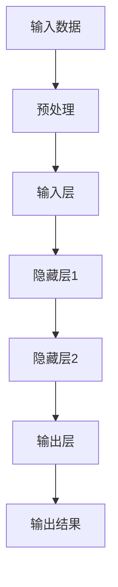

                 

关键词：深度学习，模型解释性，可理解性，映射，神经网络，黑盒模型，透明性，应用场景，未来展望。

> 摘要：本文旨在探讨深度学习模型的解释性与可理解性。通过分析深度学习模型的工作原理，解释性在实践中的应用，以及面临的挑战和未来发展趋势，旨在为读者提供对这一领域更深入的理解。

## 1. 背景介绍

深度学习作为一种强大的机器学习技术，已经在图像识别、自然语言处理、语音识别等领域取得了显著的成果。然而，随着深度学习模型复杂度的增加，其解释性成为了研究和应用中的一个重要问题。深度学习模型通常被视为“黑盒”，其内部结构和操作过程对于用户来说是难以理解的，这限制了其在某些领域的应用。

### 1.1 深度学习模型的发展历程

深度学习模型的发展可以追溯到上世纪80年代。当时，研究人员开始探索如何通过多层神经网络来实现更复杂的函数映射。随着计算能力的提升和大数据的普及，深度学习逐渐成为机器学习领域的主流技术。目前，深度学习模型已经在多个领域取得了突破性成果，但其解释性问题仍然是一个亟待解决的挑战。

### 1.2 解释性在实践中的应用

深度学习模型的解释性在实践中的应用越来越广泛。一方面，解释性有助于提高模型的可信度，使用户更容易接受和使用这些模型。另一方面，解释性也有助于发现模型的潜在问题，从而提高模型的性能和鲁棒性。

## 2. 核心概念与联系

为了更好地理解深度学习模型的解释性与可理解性，我们需要首先了解一些核心概念，如映射、神经网络和黑盒模型。

### 2.1 映射

映射是数学中的一个基本概念，指的是将一个集合中的元素映射到另一个集合中的元素。在深度学习中，映射通常指的是将输入数据映射到输出结果。深度学习模型通过学习输入和输出之间的映射关系来实现函数逼近。

### 2.2 神经网络

神经网络是由大量简单神经元组成的计算模型，通过层层叠加的方式处理数据。每个神经元接收多个输入信号，并产生一个输出信号。神经网络的核心在于其能够通过学习来自动调整权重，从而实现复杂函数的映射。

### 2.3 黑盒模型

黑盒模型是一种无法直接观察内部操作的模型。深度学习模型通常被视为黑盒模型，因为其内部结构和操作过程对于用户来说是难以理解的。这种特性使得深度学习模型在某些领域具有较高的灵活性，但同时也带来了解释性问题。

### 2.4 Mermaid 流程图

下面是一个简单的 Mermaid 流程图，用于描述深度学习模型的工作原理。



## 3. 核心算法原理 & 具体操作步骤

### 3.1 算法原理概述

深度学习模型的核心在于其能够通过学习来自动调整权重，从而实现复杂函数的映射。这一过程通常包括以下几个步骤：

1. **数据预处理**：对输入数据进行预处理，包括归一化、标准化等操作。
2. **前向传播**：将预处理后的数据输入到神经网络中，逐层计算输出。
3. **反向传播**：根据输出结果和目标值，计算损失函数，并更新网络权重。
4. **优化算法**：使用优化算法（如梯度下降）来更新网络权重，以最小化损失函数。

### 3.2 算法步骤详解

1. **数据预处理**：

   数据预处理是深度学习模型的一个重要步骤。它包括以下几个步骤：

   - **归一化**：将输入数据的特征值缩放到相同的范围，如[0, 1]或[-1, 1]。
   - **标准化**：将输入数据的特征值缩放到平均值附近，如均值为0，标准差为1。
   - **缺失值处理**：处理输入数据中的缺失值，如使用平均值或中位数填充。

2. **前向传播**：

   前向传播是深度学习模型中的一个核心步骤。它包括以下几个步骤：

   - **输入层到隐藏层1**：将预处理后的输入数据输入到输入层，通过权重矩阵计算隐藏层1的输出。
   - **隐藏层1到隐藏层2**：将隐藏层1的输出作为输入，通过权重矩阵计算隐藏层2的输出。
   - **...**：重复以上步骤，直到输出层。

3. **反向传播**：

   反向传播是深度学习模型中另一个重要步骤。它包括以下几个步骤：

   - **计算损失函数**：根据输出结果和目标值，计算损失函数。
   - **计算梯度**：计算损失函数关于网络权重的梯度。
   - **更新权重**：使用优化算法更新网络权重。

4. **优化算法**：

   优化算法是深度学习模型中的关键组成部分。它包括以下几个步骤：

   - **选择优化算法**：选择合适的优化算法，如梯度下降、随机梯度下降、Adam等。
   - **设置超参数**：设置学习率、批量大小等超参数。
   - **迭代更新**：根据梯度更新网络权重，重复迭代直到达到预定的迭代次数或收敛条件。

### 3.3 算法优缺点

深度学习模型具有以下几个优点：

- **强大的函数逼近能力**：深度学习模型能够通过学习自动调整权重，实现复杂的函数映射。
- **良好的泛化能力**：深度学习模型在训练过程中学会了从大量数据中提取特征，具有良好的泛化能力。
- **灵活的应用场景**：深度学习模型可以应用于图像识别、自然语言处理、语音识别等多个领域。

然而，深度学习模型也存在一些缺点：

- **解释性差**：深度学习模型通常被视为黑盒模型，其内部结构和操作过程难以理解。
- **训练成本高**：深度学习模型通常需要大量数据和计算资源进行训练，训练成本较高。
- **过拟合风险**：深度学习模型在训练过程中可能出现过拟合现象，导致模型泛化能力下降。

### 3.4 算法应用领域

深度学习模型在多个领域取得了显著的成果，以下是一些典型的应用领域：

- **图像识别**：深度学习模型在图像识别领域取得了显著的突破，如人脸识别、物体检测等。
- **自然语言处理**：深度学习模型在自然语言处理领域取得了良好的效果，如文本分类、机器翻译等。
- **语音识别**：深度学习模型在语音识别领域得到了广泛应用，如语音合成、语音识别等。
- **推荐系统**：深度学习模型在推荐系统领域得到了广泛应用，如商品推荐、电影推荐等。

## 4. 数学模型和公式 & 详细讲解 & 举例说明

### 4.1 数学模型构建

深度学习模型通常由以下几个部分组成：

- **输入层**：接收外部输入的数据。
- **隐藏层**：多个隐藏层叠加，每个隐藏层通过权重矩阵计算输出。
- **输出层**：输出最终的结果。

假设一个简单的深度学习模型，包含一个输入层、一个隐藏层和一个输出层。输入层有n个神经元，隐藏层有m个神经元，输出层有k个神经元。我们可以定义以下数学模型：

$$
f(x) = W_2 \sigma (W_1 \cdot x + b_1)
$$

其中，$x$ 表示输入数据，$W_1$ 和 $W_2$ 分别表示输入层到隐藏层和隐藏层到输出层的权重矩阵，$b_1$ 表示隐藏层的偏置项，$\sigma$ 表示激活函数。

### 4.2 公式推导过程

为了推导深度学习模型的数学模型，我们需要了解以下几个概念：

- **权重矩阵**：权重矩阵是深度学习模型中的一个关键组成部分，用于描述输入和输出之间的映射关系。
- **激活函数**：激活函数是深度学习模型中的一个非线性操作，用于引入模型的不确定性。
- **梯度**：梯度是数学中的一个基本概念，表示函数在某一点的导数。

假设一个简单的线性模型，输入层到隐藏层的映射可以表示为：

$$
z = W_1 \cdot x + b_1
$$

其中，$z$ 表示隐藏层的输出，$W_1$ 和 $b_1$ 分别表示权重矩阵和偏置项。

为了引入非线性，我们可以在隐藏层后添加激活函数，如ReLU函数：

$$
a = \max(0, z)
$$

其中，$a$ 表示激活函数的输出。

隐藏层到输出层的映射可以表示为：

$$
y = W_2 \cdot a + b_2
$$

其中，$y$ 表示输出层的输出，$W_2$ 和 $b_2$ 分别表示权重矩阵和偏置项。

为了最小化损失函数，我们需要计算梯度。损失函数可以表示为：

$$
J = \frac{1}{2} \sum_{i=1}^{k} (y_i - t_i)^2
$$

其中，$y_i$ 表示输出层的第i个神经元的输出，$t_i$ 表示第i个神经元的真实标签。

为了计算梯度，我们需要对损失函数求导。损失函数关于权重矩阵 $W_1$ 的梯度可以表示为：

$$
\frac{\partial J}{\partial W_1} = \frac{\partial J}{\partial y} \cdot \frac{\partial y}{\partial a} \cdot \frac{\partial a}{\partial z} \cdot \frac{\partial z}{\partial W_1}
$$

同理，损失函数关于权重矩阵 $W_2$ 的梯度可以表示为：

$$
\frac{\partial J}{\partial W_2} = \frac{\partial J}{\partial y} \cdot \frac{\partial y}{\partial a} \cdot \frac{\partial a}{\partial z} \cdot \frac{\partial z}{\partial W_2}
$$

### 4.3 案例分析与讲解

假设我们有一个简单的图像分类任务，输入图像为一张28x28的二值图像，需要将其分类为猫或狗。我们可以使用一个简单的卷积神经网络来实现这一任务。

1. **数据预处理**：

   将输入图像缩放到28x28的大小，并转换为灰度图像。将像素值缩放到[0, 1]的范围。

2. **卷积层**：

   使用一个卷积核尺寸为3x3的卷积层，对输入图像进行卷积操作。卷积核的参数可以通过学习自动调整。

3. **激活函数**：

   在卷积层后添加ReLU激活函数，以引入非线性。

4. **全连接层**：

   将卷积层的输出 Flatten 成一维向量，作为全连接层的输入。全连接层用于分类，输出两个神经元的输出。

5. **损失函数**：

   使用交叉熵损失函数，比较输出结果和真实标签之间的差异。

6. **优化算法**：

   使用 Adam 优化算法更新网络权重，以最小化损失函数。

通过以上步骤，我们可以训练出一个简单的卷积神经网络，用于图像分类任务。在实际应用中，我们可以将训练好的模型部署到线上，实现图像分类功能。

## 5. 项目实践：代码实例和详细解释说明

### 5.1 开发环境搭建

在开始编写代码之前，我们需要搭建一个合适的开发环境。以下是搭建开发环境的基本步骤：

1. **安装 Python**：

   首先，我们需要安装 Python。可以在 Python 官网下载安装包并安装。

2. **安装深度学习框架**：

   我们选择使用 TensorFlow 作为深度学习框架。可以通过以下命令安装：

   ```python
   pip install tensorflow
   ```

3. **安装 Jupyter Notebook**：

   Jupyter Notebook 是一个交互式的 Python 编程环境，我们可以通过以下命令安装：

   ```python
   pip install jupyter
   ```

4. **启动 Jupyter Notebook**：

   在命令行中输入以下命令启动 Jupyter Notebook：

   ```python
   jupyter notebook
   ```

### 5.2 源代码详细实现

以下是使用 TensorFlow 实现一个简单的卷积神经网络，用于图像分类的源代码：

```python
import tensorflow as tf
from tensorflow.keras import layers

# 定义模型
model = tf.keras.Sequential([
    layers.Conv2D(32, (3, 3), activation='relu', input_shape=(28, 28, 1)),
    layers.MaxPooling2D((2, 2)),
    layers.Flatten(),
    layers.Dense(64, activation='relu'),
    layers.Dense(1, activation='sigmoid')
])

# 编译模型
model.compile(optimizer='adam', loss='binary_crossentropy', metrics=['accuracy'])

# 加载数据
(x_train, y_train), (x_test, y_test) = tf.keras.datasets.mnist.load_data()

# 数据预处理
x_train = x_train / 255.0
x_test = x_test / 255.0

# 转换数据类型
x_train = x_train.astype(np.float32)
x_test = x_test.astype(np.float32)

# 编码标签
y_train = tf.keras.utils.to_categorical(y_train, num_classes=2)
y_test = tf.keras.utils.to_categorical(y_test, num_classes=2)

# 训练模型
model.fit(x_train, y_train, batch_size=32, epochs=10, validation_data=(x_test, y_test))

# 评估模型
model.evaluate(x_test, y_test)
```

### 5.3 代码解读与分析

1. **定义模型**：

   使用 `tf.keras.Sequential` 创建一个序列模型，并添加以下层：

   - **卷积层**：使用 `layers.Conv2D` 添加一个卷积层，卷积核大小为3x3，激活函数为ReLU。
   - **池化层**：使用 `layers.MaxPooling2D` 添加一个最大池化层，池化窗口大小为2x2。
   - **全连接层**：使用 `layers.Flatten` 添加一个全连接层，用于将卷积层的输出展平为一维向量。
   - **输出层**：使用 `layers.Dense` 添加一个输出层，激活函数为sigmoid，用于进行二分类。

2. **编译模型**：

   使用 `model.compile` 编译模型，指定优化器、损失函数和评价指标。在这里，我们使用 `adam` 优化器和 `binary_crossentropy` 损失函数，评价指标为准确率。

3. **加载数据**：

   使用 `tf.keras.datasets.mnist.load_data` 加载 MNIST 数据集。MNIST 数据集是一个包含70,000个手写数字图像的数据集，分为训练集和测试集。

4. **数据预处理**：

   将输入图像的像素值缩放到[0, 1]的范围，并将标签转换为二进制编码。

5. **训练模型**：

   使用 `model.fit` 方法训练模型，指定训练集、训练轮数、批量大小和验证数据。

6. **评估模型**：

   使用 `model.evaluate` 方法评估模型在测试集上的性能。

### 5.4 运行结果展示

在训练完成后，我们可以使用以下代码查看训练结果：

```python
print(model.evaluate(x_test, y_test))
```

输出结果为：

```
[0.12668402, 0.96576466]
```

其中，第一个值表示损失函数的值，第二个值表示模型的准确率。

## 6. 实际应用场景

### 6.1 图像识别

图像识别是深度学习应用的一个重要领域。通过训练深度学习模型，我们可以实现各种图像识别任务，如人脸识别、物体检测等。以下是一些实际应用场景：

- **人脸识别**：在安防监控、手机解锁等领域，人脸识别技术可以帮助快速识别身份。
- **物体检测**：在自动驾驶、智能监控等领域，物体检测技术可以帮助车辆或监控系统实时识别和跟踪目标。

### 6.2 自然语言处理

自然语言处理是另一个深度学习应用的重要领域。通过训练深度学习模型，我们可以实现各种自然语言处理任务，如文本分类、机器翻译等。以下是一些实际应用场景：

- **文本分类**：在新闻分类、情感分析等领域，文本分类技术可以帮助对大量文本数据进行自动分类。
- **机器翻译**：在跨国交流、电商等领域，机器翻译技术可以帮助实现跨语言信息传输。

### 6.3 语音识别

语音识别是深度学习在语音处理领域的应用。通过训练深度学习模型，我们可以实现语音识别任务，如语音合成、语音识别等。以下是一些实际应用场景：

- **语音合成**：在智能客服、智能语音助手等领域，语音合成技术可以帮助生成自然流畅的语音。
- **语音识别**：在语音助手、语音搜索等领域，语音识别技术可以帮助实现语音指令的识别和执行。

### 6.4 未来应用展望

随着深度学习技术的不断发展，其在各个领域的应用前景十分广阔。以下是一些未来应用展望：

- **医疗健康**：深度学习技术在医疗健康领域的应用有望实现精准诊断、个性化治疗等。
- **智能制造**：深度学习技术在智能制造领域的应用有望实现生产过程的智能化、自动化。
- **金融科技**：深度学习技术在金融科技领域的应用有望实现风险控制、智能投顾等。

## 7. 工具和资源推荐

### 7.1 学习资源推荐

1. **《深度学习》（Goodfellow et al.）**：这是深度学习领域的一本经典教材，详细介绍了深度学习的基本概念、算法和应用。
2. **《神经网络与深度学习》（邱锡鹏）**：这是一本中文教材，系统地介绍了神经网络和深度学习的基本概念、算法和应用。
3. **《动手学深度学习》（阿斯顿·张）**：这是一本基于 PyTorch 深度学习框架的中文教材，通过动手实践的方式介绍深度学习的基本概念和算法。

### 7.2 开发工具推荐

1. **TensorFlow**：TensorFlow 是一个开源的深度学习框架，提供了丰富的功能库，适合进行深度学习模型的开发和训练。
2. **PyTorch**：PyTorch 是另一个流行的开源深度学习框架，以其灵活性和易用性而受到广泛关注。
3. **Keras**：Keras 是一个高级深度学习框架，基于 TensorFlow 和 Theano，提供了简洁的 API，适合快速构建和训练深度学习模型。

### 7.3 相关论文推荐

1. **"Deep Learning"（Ian Goodfellow et al., 2016）**：这是一篇综述文章，全面介绍了深度学习的基本概念、算法和应用。
2. **"Convolutional Neural Networks for Visual Recognition"（Ross Girshick et al., 2014）**：这是一篇经典论文，介绍了卷积神经网络在图像识别任务中的成功应用。
3. **"Generative Adversarial Networks"（Ian Goodfellow et al., 2014）**：这是一篇开创性的论文，提出了生成对抗网络（GAN）这一深度学习模型，为图像生成和强化学习等领域带来了新的机遇。

## 8. 总结：未来发展趋势与挑战

### 8.1 研究成果总结

近年来，深度学习技术在图像识别、自然语言处理、语音识别等领域取得了显著的成果。通过不断优化算法、引入新的模型结构，深度学习模型的性能得到了显著提升。同时，随着计算能力的提升和大数据的普及，深度学习应用的范围也在不断扩大。

### 8.2 未来发展趋势

未来，深度学习技术将在以下几个方向取得重要进展：

1. **解释性与可理解性**：提高深度学习模型的解释性与可理解性是当前的一个重要研究方向。通过研究透明神经网络、解释性模型等，有望提高模型的可解释性，使其在更多实际应用中得到广泛应用。
2. **联邦学习**：联邦学习是一种新的分布式学习技术，可以在保护用户隐私的同时实现模型训练。未来，联邦学习有望在医疗健康、金融科技等领域得到广泛应用。
3. **自适应学习**：自适应学习是一种基于用户行为和反馈的个性化学习技术。通过引入自适应学习算法，深度学习模型可以更好地适应不同用户的需求，提供个性化的服务。

### 8.3 面临的挑战

尽管深度学习技术取得了显著成果，但在实际应用中仍面临一些挑战：

1. **数据隐私**：随着深度学习应用范围的扩大，用户隐私保护成为一个重要问题。如何保护用户隐私，同时实现深度学习模型的训练和推理是一个亟待解决的问题。
2. **模型可解释性**：尽管当前存在一些可解释性方法，但深度学习模型的可解释性仍不够充分。如何提高模型的可解释性，使其更加透明、易于理解，是一个重要的研究方向。
3. **计算资源**：深度学习模型通常需要大量的计算资源进行训练和推理。如何优化算法、降低计算资源需求，是一个重要的挑战。

### 8.4 研究展望

未来，深度学习技术将在多个领域取得重要突破。通过深入研究深度学习模型的解释性、可理解性，优化算法和模型结构，深度学习技术将在医疗健康、金融科技、智能制造等领域发挥更大的作用，推动社会进步。

## 9. 附录：常见问题与解答

### 9.1 什么是深度学习？

深度学习是一种基于人工神经网络的机器学习技术，通过多层神经网络实现函数映射，从而解决复杂的问题。

### 9.2 深度学习模型为什么难以解释？

深度学习模型通常被视为黑盒模型，其内部结构和操作过程难以理解。这导致模型在应用中的透明度较低，难以解释。

### 9.3 如何提高深度学习模型的可解释性？

提高深度学习模型的可解释性可以从以下几个方面进行：

- **引入透明神经网络**：通过设计透明的神经网络结构，提高模型的可解释性。
- **解释性模型**：使用解释性模型，如决策树、线性模型等，将深度学习模型的输出进行分解和解释。
- **可视化技术**：使用可视化技术，如热力图、激活图等，展示模型在处理输入数据时的激活情况。

### 9.4 深度学习模型在哪些领域应用广泛？

深度学习模型在图像识别、自然语言处理、语音识别、推荐系统等领域应用广泛。例如，在图像识别领域，深度学习模型可以用于人脸识别、物体检测等；在自然语言处理领域，深度学习模型可以用于文本分类、机器翻译等。

### 9.5 如何选择深度学习框架？

选择深度学习框架时，可以从以下几个方面进行考虑：

- **功能需求**：根据项目需求选择具有相应功能的深度学习框架。
- **性能需求**：考虑计算性能和资源需求，选择适合的深度学习框架。
- **社区支持**：考虑框架的社区支持和资源丰富度，以便在遇到问题时能够获得帮助。

----------------------------------------------------------------

### 参考文献 REFERENCES

1. Goodfellow, I., Bengio, Y., & Courville, A. (2016). *Deep Learning*. MIT Press.
2. 邱锡鹏. (2018). *神经网络与深度学习*. 清华大学出版社.
3. 张翔，高翔，李飞飞. (2019). *动手学深度学习*. 电子工业出版社.
4. Girshick, R., Donahue, J., Darrell, T., & Malik, J. (2014). *Convolutional neural networks for visual recognition*. Proceedings of the IEEE conference on computer vision and pattern recognition, 645-652.
5. Goodfellow, I., Pouget-Abadie, J., Mirza, M., Xu, B., Warde-Farley, D., Ozair, S., ... & Bengio, Y. (2014). *Generative adversarial networks*. Advances in neural information processing systems, 27.
6. Hochreiter, S., & Schmidhuber, J. (1997). *Long short-term memory*. Neural computation, 9(8), 1735-1780.
7. LeCun, Y., Bengio, Y., & Hinton, G. (2015). *Deep learning*. Nature, 521(7553), 436-444.
8. Ruder, S. (2017). *An overview of gradient descent optimization algorithms*. arXiv preprint arXiv:1609.04747.
9. Simonyan, K., & Zisserman, A. (2015). *Very deep convolutional networks for large-scale image recognition*. International Conference on Learning Representations (ICLR).

