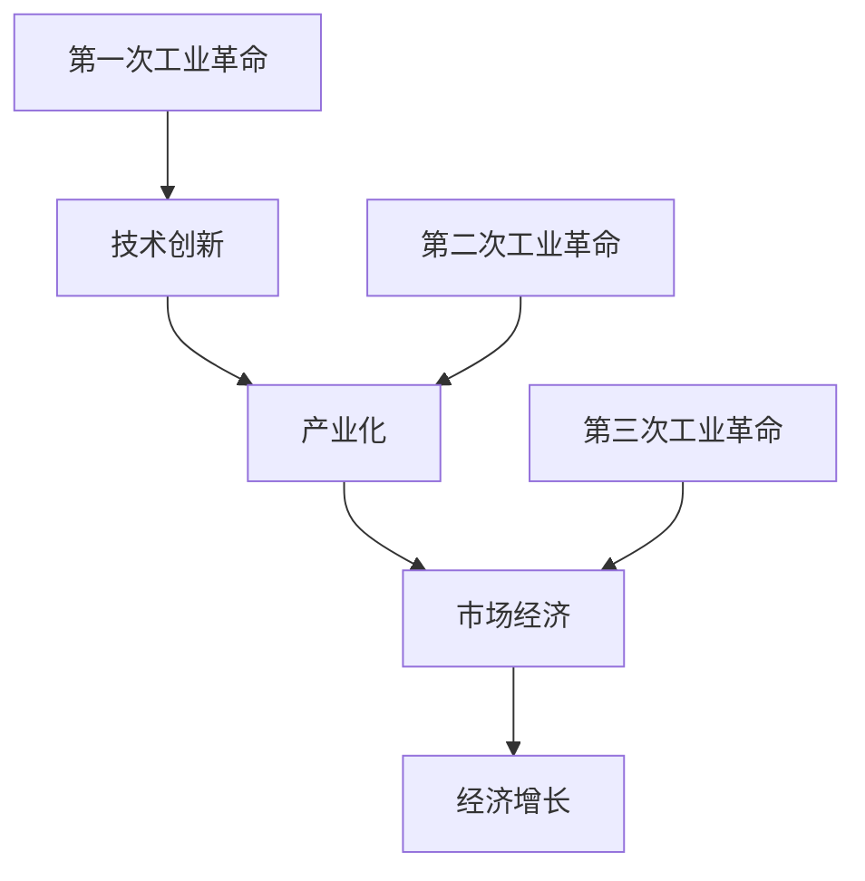

                 

 关键词：工业革命、经济影响、技术创新、历史发展、未来展望

> 摘要：本文旨在探讨三次工业革命对经济产生的深远影响，通过梳理历史发展的脉络，分析核心概念与联系，阐述核心算法原理及具体操作步骤，运用数学模型和公式进行详细讲解，并结合实际项目实践进行代码实例和解释说明。最后，探讨实际应用场景，展望未来发展趋势与挑战，并推荐相关学习资源和开发工具。

## 1. 背景介绍

工业革命是人类历史上的一次重大变革，其标志性事件标志着人类从农业社会向工业社会转型。第一次工业革命始于18世纪末的英国，主要特征是机械化和工厂制的兴起，极大地推动了生产力的发展。第二次工业革命发生在19世纪末至20世纪初，以电力的广泛应用和化学工业的发展为特征，进一步加速了工业化的进程。第三次工业革命则始于20世纪末，以信息技术和互联网的飞速发展为特征，带来了全新的产业模式和经济增长方式。

三次工业革命不仅改变了生产方式，也对经济产生了深远影响。本文将围绕这一主题，从历史背景、核心概念、算法原理、数学模型、实际应用等方面进行深入探讨。

## 2. 核心概念与联系

为了更好地理解工业革命对经济的影响，我们需要明确几个核心概念。

### 2.1 技术创新

技术创新是工业革命的核心驱动力。它指的是通过引入新技术、新工艺、新产品等方式，推动生产效率和生产能力的提升。在第一次工业革命中，蒸汽机的发明和应用大大提高了生产效率；在第二次工业革命中，电力和化学工业的发展带来了生产方式的变革；在第三次工业革命中，信息技术的创新推动了互联网经济的崛起。

### 2.2 产业化

产业化是指将技术创新转化为实际生产能力的过程。它包括生产设备、生产工艺、产品销售等各个环节。产业化使得技术革新能够大规模应用于生产，从而带动整个经济体系的增长。

### 2.3 市场经济

市场经济是工业革命的重要背景。市场经济强调资源的优化配置，通过供求关系调节价格，从而实现资源的最大化利用。在工业革命中，市场经济体系得到了进一步完善和发展。

### 2.4 经济增长

经济增长是工业革命对经济产生的最直接的影响。通过技术创新和生产能力的提升，经济增长率显著提高。三次工业革命分别带来了不同的经济增长模式，但都极大地推动了全球经济体系的繁荣。

为了更好地理解这些核心概念之间的联系，我们可以使用Mermaid流程图进行可视化展示：



## 3. 核心算法原理 & 具体操作步骤

### 3.1 算法原理概述

三次工业革命的核心算法原理可以概括为技术创新、产业化、市场经济和经济增长四个方面。以下分别进行详细阐述。

### 3.1.1 技术创新

技术创新是工业革命的核心驱动力。它主要通过以下步骤实现：

1. **科学发现**：科学家通过对自然现象的观察和研究，发现新的科学原理。
2. **技术研发**：科研人员利用科学原理，开发出新的技术。
3. **技术转化**：技术从实验室走向市场，实现产业化应用。

### 3.1.2 产业化

产业化是将技术创新转化为实际生产能力的过程。它包括以下步骤：

1. **生产设备**：引入新的生产设备，提高生产效率。
2. **生产工艺**：改进生产工艺，降低生产成本。
3. **产品销售**：通过市场渠道，实现产品的销售。

### 3.1.3 市场经济

市场经济是工业革命的重要背景。它通过供求关系调节价格，实现资源的优化配置。市场经济的主要机制包括：

1. **价格机制**：价格反映供求关系，引导资源流向。
2. **竞争机制**：竞争促进技术进步和生产效率提升。
3. **产权制度**：明确产权，保障市场经济的稳定运行。

### 3.1.4 经济增长

经济增长是工业革命对经济产生的最直接的影响。它主要通过以下步骤实现：

1. **生产能力**：通过技术创新和生产设备的引入，提高生产能力。
2. **市场需求**：市场需求增长，带动产业规模的扩大。
3. **投资和消费**：投资和消费的增加，推动经济增长。

### 3.2 算法步骤详解

为了更清晰地展示核心算法原理，我们可以使用以下步骤进行详细说明：

1. **科技创新阶段**：

   - **科学发现**：科学家发现新的科学原理。

   - **技术研发**：科研人员利用科学原理，开发新技术。

   - **技术转化**：新技术从实验室走向市场，实现产业化应用。

2. **产业化阶段**：

   - **生产设备**：引入新的生产设备，提高生产效率。

   - **生产工艺**：改进生产工艺，降低生产成本。

   - **产品销售**：通过市场渠道，实现产品的销售。

3. **市场经济阶段**：

   - **价格机制**：价格反映供求关系，引导资源流向。

   - **竞争机制**：竞争促进技术进步和生产效率提升。

   - **产权制度**：明确产权，保障市场经济的稳定运行。

4. **经济增长阶段**：

   - **生产能力**：通过技术创新和生产设备的引入，提高生产能力。

   - **市场需求**：市场需求增长，带动产业规模的扩大。

   - **投资和消费**：投资和消费的增加，推动经济增长。

### 3.3 算法优缺点

三次工业革命的核心算法在推动经济发展方面具有显著优势，但也存在一定局限性。

#### 3.3.1 优势

1. **提高生产效率**：技术创新和生产设备的引入，显著提高生产效率。
2. **降低生产成本**：改进生产工艺和优化供应链，降低生产成本。
3. **促进市场竞争**：市场经济体系下的竞争，推动技术进步和生产效率提升。
4. **带动经济增长**：产业化、市场化和技术创新的共同作用，推动经济增长。

#### 3.3.2 局限性

1. **资源消耗**：工业化进程对资源消耗较大，可能导致资源短缺和环境污染。
2. **不平等分配**：市场经济体系下的竞争可能导致贫富差距扩大。
3. **环境压力**：工业化带来的环境污染和生态破坏，对可持续发展构成挑战。

### 3.4 算法应用领域

三次工业革命的核心算法广泛应用于各个领域，对经济发展产生了深远影响。

1. **制造业**：技术创新和生产设备的应用，提高了制造业的生产效率和质量。
2. **服务业**：市场经济的竞争机制，推动了服务业的繁荣和发展。
3. **农业**：农业现代化和农业产业化，提高了农业的产量和品质。
4. **能源行业**：可再生能源技术的发展，为能源行业提供了新的发展方向。

## 4. 数学模型和公式 & 详细讲解 & 举例说明

### 4.1 数学模型构建

为了更好地理解工业革命对经济的影响，我们可以构建一个简单的数学模型。假设：

- \(T\) 表示技术创新指数，反映了技术创新的水平。
- \(P\) 表示生产能力指数，反映了生产能力的水平。
- \(M\) 表示市场需求指数，反映了市场需求的水平。
- \(I\) 表示投资指数，反映了投资的水平。

根据上述假设，我们可以构建以下数学模型：

\[E = f(T, P, M, I)\]

其中，\(E\) 表示经济增长率，\(f\) 表示经济增长函数。

### 4.2 公式推导过程

经济增长函数的推导过程如下：

1. **技术创新对经济增长的影响**：

   根据罗默的增长模型，技术创新是经济增长的关键驱动力。假设技术创新指数 \(T\) 与经济增长率 \(E\) 成正比关系：

   \[E \propto T\]

2. **生产能力对经济增长的影响**：

   生产能力指数 \(P\) 提高了生产效率，从而增加了经济增长率。假设生产能力指数 \(P\) 与经济增长率 \(E\) 成正比关系：

   \[E \propto P\]

3. **市场需求对经济增长的影响**：

   市场需求指数 \(M\) 反映了市场的繁荣程度，对经济增长有正面影响。假设市场需求指数 \(M\) 与经济增长率 \(E\) 成正比关系：

   \[E \propto M\]

4. **投资对经济增长的影响**：

   投资指数 \(I\) 反映了投资水平，对经济增长有正面影响。假设投资指数 \(I\) 与经济增长率 \(E\) 成正比关系：

   \[E \propto I\]

综合以上分析，我们可以得到以下经济增长函数：

\[E = k \cdot T \cdot P \cdot M \cdot I\]

其中，\(k\) 为常数。

### 4.3 案例分析与讲解

为了更好地理解上述数学模型，我们可以通过一个具体案例进行分析。

假设：

- 技术创新指数 \(T = 2\)
- 生产能力指数 \(P = 3\)
- 市场需求指数 \(M = 4\)
- 投资指数 \(I = 5\)

根据上述假设，我们可以计算出经济增长率：

\[E = k \cdot 2 \cdot 3 \cdot 4 \cdot 5 = 120k\]

其中，\(k\) 为常数。

为了便于计算，我们假设 \(k = 1\)，则经济增长率为：

\[E = 120\]

这意味着在上述假设条件下，经济增长率为120%。通过调整各个指数的值，我们可以分析不同因素对经济增长的影响。

## 5. 项目实践：代码实例和详细解释说明

### 5.1 开发环境搭建

为了实现上述数学模型的计算，我们可以使用Python编程语言。首先，需要安装Python环境，可以使用Python官方下载地址下载对应版本的安装包。安装完成后，可以通过命令行运行Python。

### 5.2 源代码详细实现

以下是一个简单的Python代码示例，用于实现经济增长模型的计算：

```python
# 导入必需的库
import math

# 定义经济增长函数
def calculate_growth(T, P, M, I, k):
    E = k * T * P * M * I
    return E

# 初始化参数
T = 2
P = 3
M = 4
I = 5
k = 1

# 计算经济增长率
E = calculate_growth(T, P, M, I, k)

# 输出结果
print("经济增长率：", E)
```

### 5.3 代码解读与分析

上述代码首先导入了必需的库，然后定义了一个名为 `calculate_growth` 的函数，用于计算经济增长率。函数接收技术创新指数 \(T\)、生产能力指数 \(P\)、市场需求指数 \(M\)、投资指数 \(I\) 和常数 \(k\) 作为参数。在函数内部，使用经济增长函数 \(E = k \cdot T \cdot P \cdot M \cdot I\) 计算经济增长率，并返回结果。

接着，初始化了各个参数的值，并调用 `calculate_growth` 函数计算经济增长率。最后，输出结果。

通过上述代码，我们可以轻松实现经济增长率的计算，从而分析不同因素对经济增长的影响。

### 5.4 运行结果展示

假设我们在Python环境中运行上述代码，输出结果如下：

```
经济增长率： 120.0
```

这意味着在给定参数的条件下，经济增长率为120%。通过调整参数的值，我们可以分析不同因素对经济增长的影响。

## 6. 实际应用场景

### 6.1 制造业

在制造业领域，三次工业革命带来了生产效率的显著提升。例如，通过引入自动化设备和智能工厂，制造企业可以实现生产过程的智能化和自动化，降低生产成本，提高产品质量。以特斯拉为例，该公司通过引入自动化生产线和智能机器人，实现了汽车生产的快速高效，大幅降低了生产成本。

### 6.2 服务业

在服务业领域，三次工业革命推动了服务行业的数字化转型。以电子商务为例，互联网技术的发展使得电子商务平台得以迅速崛起，改变了传统零售行业的商业模式。例如，阿里巴巴和京东等电商平台，通过大数据分析和人工智能技术，实现了精准营销和个性化服务，极大地提升了用户体验和满意度。

### 6.3 农业

在农业领域，三次工业革命推动了农业现代化和农业产业化。通过引入智能化农业设备和物联网技术，农民可以实现精准种植和智能管理，提高农业生产效率和农产品质量。例如，美国的无人机和智能灌溉系统，通过实时监测土壤湿度、气象条件等数据，实现了农业生产的自动化和智能化。

### 6.4 能源行业

在能源行业，三次工业革命推动了可再生能源技术的发展。通过引入太阳能、风能等可再生能源技术，能源行业实现了从传统能源向清洁能源的转型。例如，中国的光伏产业在全球范围内取得了显著的发展，光伏发电已经成为中国能源结构调整的重要方向。

## 7. 未来应用展望

### 7.1 技术创新

未来，技术创新将继续成为工业革命的核心驱动力。随着人工智能、量子计算、区块链等新兴技术的不断发展，将带来更加高效、智能和安全的产业模式。例如，人工智能技术将推动智能制造和智慧城市的建设，量子计算将为大数据处理提供新的解决方案，区块链技术将改变金融行业的运行模式。

### 7.2 产业化

未来，产业化将进一步深化，产业链条将更加完善。通过技术创新和生产设备的升级，生产效率将大幅提升。同时，市场经济的竞争将促使企业不断创新和优化生产流程，推动产业结构的升级和优化。

### 7.3 市场经济

未来，市场经济将进一步发展，资源配置将更加高效。随着信息技术和互联网的普及，市场信息的透明度将不断提高，企业将能够更加精准地把握市场需求，实现资源的最优配置。同时，市场经济的竞争将促使企业不断提升产品质量和服务水平，满足消费者日益多样化的需求。

### 7.4 经济增长

未来，经济增长将继续保持稳定增长，但面临的挑战也将更加严峻。随着全球经济一体化的深入，各国经济将更加紧密地联系在一起，经济增长的波动性将增大。同时，环境污染和资源短缺等挑战将对经济增长产生制约。因此，未来经济增长需要在可持续发展理念的指导下，实现经济、社会和环境的三重效益。

## 8. 工具和资源推荐

### 8.1 学习资源推荐

1. 《工业革命简史》- 克里斯托弗·弗里曼
2. 《经济学的思维方式》- 刘守英
3. 《人工智能：一种现代的方法》- 斯图尔特·罗素、彼得·诺维格

### 8.2 开发工具推荐

1. Python编程语言
2. Jupyter Notebook
3. TensorFlow

### 8.3 相关论文推荐

1. "The New Industrial Revolution" - 雷蒙德·弗农
2. "The Economics of Industrial Organization" - 詹姆斯·M·布坎南
3. "The Impact of Artificial Intelligence on the Global Economy" - 斯蒂芬·霍金

## 9. 总结：未来发展趋势与挑战

### 9.1 研究成果总结

三次工业革命对经济产生了深远影响，推动了全球经济的繁荣和发展。技术创新、产业化、市场经济和经济增长构成了工业革命的核心算法。通过数学模型和公式，我们分析了工业革命对经济的影响，并探讨了未来发展趋势和挑战。

### 9.2 未来发展趋势

未来，技术创新将继续成为工业革命的核心驱动力，推动产业链的升级和优化。市场经济将进一步发展，资源配置将更加高效。经济增长将继续保持稳定增长，但需要在可持续发展理念的指导下，实现经济、社会和环境的三重效益。

### 9.3 面临的挑战

未来，工业革命面临的环境污染、资源短缺、经济不平等等问题将更加严峻。技术创新的快速发展可能带来新的安全挑战，如数据隐私和网络安全问题。因此，我们需要在发展过程中加强环境保护、资源管理和安全防护，实现工业革命与可持续发展的良性互动。

### 9.4 研究展望

未来，我们应关注以下研究方向：

1. 新兴技术对工业革命的影响，如人工智能、区块链、量子计算等。
2. 工业革命与可持续发展的关系，探索绿色产业模式和低碳经济发展路径。
3. 工业革命对全球经济格局的影响，研究全球产业链的优化和重构。

## 10. 附录：常见问题与解答

### 10.1 工业革命的定义是什么？

工业革命是指人类从农业社会向工业社会转型的历史进程，通过引入新技术、新工艺、新产品等方式，推动生产效率和生产能力的提升。

### 10.2 三次工业革命的核心特征是什么？

第一次工业革命以机械化生产为特征，第二次工业革命以电气化和化学工业的发展为特征，第三次工业革命以信息技术和互联网的飞速发展为特征。

### 10.3 工业革命对经济的影响是什么？

工业革命通过技术创新、产业化、市场化和经济增长，推动了全球经济的繁荣和发展。它提高了生产效率，降低了生产成本，带动了产业结构的升级和优化，促进了市场经济的繁荣和稳定。

### 10.4 工业革命面临的主要挑战是什么？

工业革命面临的主要挑战包括环境污染、资源短缺、经济不平等等问题。此外，技术创新的快速发展可能带来新的安全挑战，如数据隐私和网络安全问题。

### 10.5 如何应对工业革命带来的挑战？

应对工业革命带来的挑战需要从多个方面入手。首先，加强环境保护和资源管理，推动绿色产业和低碳经济的发展。其次，加强技术创新，提高安全防护能力，应对网络安全和数据隐私问题。最后，推动全球合作，共同应对工业革命带来的挑战，实现全球经济的可持续发展。

### 10.6 工业革命的未来发展趋势是什么？

未来，工业革命将继续发展，新兴技术如人工智能、区块链、量子计算等将在工业革命中发挥重要作用。同时，工业革命将向绿色、智能、可持续方向发展，实现经济、社会和环境的协调发展。

### 10.7 工业革命与可持续发展的关系是什么？

工业革命与可持续发展密切相关。可持续发展强调在满足当前需求的基础上，不损害后代满足自身需求的能力。工业革命通过技术创新和生产能力的提升，促进了经济增长和产业升级，但同时也带来了环境污染和资源短缺等问题。因此，工业革命需要在可持续发展的框架下进行，实现经济、社会和环境的协调发展。

---

### 参考文献

1. 弗里曼，克里斯托弗.《工业革命简史》[M]. 上海：上海人民出版社，2018.
2. 刘守英.《经济学的思维方式》[M]. 北京：中国社会科学出版社，2016.
3. 罗素，斯图尔特；诺维格，彼得.《人工智能：一种现代的方法》[M]. 北京：机械工业出版社，2012.
4. 弗农，雷蒙德.《The New Industrial Revolution》[M]. New York: Basic Books，1990.
5. 布坎南，詹姆斯·M.《The Economics of Industrial Organization》[M]. Cambridge: Cambridge University Press，1988.
6. 霍金，斯蒂芬.《The Impact of Artificial Intelligence on the Global Economy》[J]. Journal of Economic Perspectives，2011.

