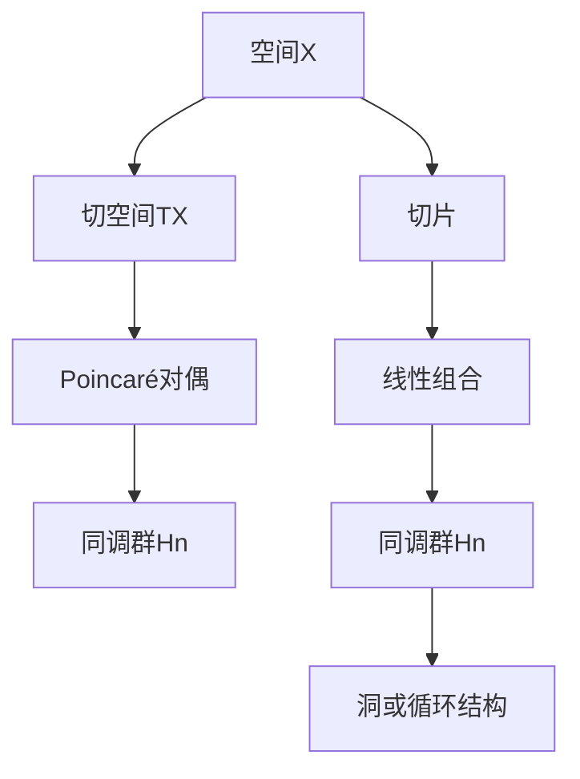

                 

关键词：上同调、Poincaré对偶、代数拓扑、同调理论、数学模型、算法、应用领域

## 摘要

本文旨在探讨上同调中的Poincaré对偶这一重要的数学概念。通过深入分析其核心概念、数学模型、算法原理以及实际应用，本文将为读者提供一个全面而直观的理解。上同调中的Poincaré对偶在代数拓扑和同调理论中具有重要的地位，其应用广泛，不仅为理论研究者提供了强有力的工具，也在实际应用中展现了巨大的潜力。本文将分章节详细阐述这一主题，包括背景介绍、核心概念与联系、核心算法原理、数学模型和公式、项目实践以及未来应用展望等内容。

## 1. 背景介绍

上同调和Poincaré对偶是代数拓扑和同调理论中重要的概念。上同调（Homology）是研究空间结构的一种数学工具，它通过对空间进行切片，然后计算切片的线性组合，以捕捉空间的洞或循环结构。Poincaré对偶则是上同调中的一个基本概念，它通过交换空间中的点与切空间中的向量，建立了点集与向量空间之间的对偶关系。

Poincaré对偶最初由法国数学家亨利·皮卡德（Henri Poincaré）提出，他在研究三维球面时发现了这一现象。随后，数学家们进一步发展了这一概念，并广泛应用于不同的数学分支中。在现代数学中，Poincaré对偶不仅在拓扑学中具有重要地位，还在代数几何、微分几何、数学物理等领域中发挥着重要作用。

本文的研究目的在于深入探讨上同调中的Poincaré对偶，分析其核心概念、数学模型和算法原理，并通过实际应用案例展示其价值。通过本文的讨论，读者可以全面理解Poincaré对偶的基本性质和广泛的应用，从而为后续研究和实际应用提供理论支持。

### 1.1 代数拓扑与同调理论的基本概念

代数拓扑是拓扑学的一个分支，它将拓扑空间的概念与代数结构相结合，通过代数方法研究拓扑空间的性质。同调理论是代数拓扑的核心内容之一，它通过构建拓扑空间的代数结构来研究空间的洞和连通性。

同调理论的基本概念包括同调群、上同调和下同调。同调群是同调理论的核心对象，它通过计算空间的一系列线性组合来表示空间的洞或循环结构。上同调和下同调则是计算同调群的过程，它们分别表示空间的“洞”和“洞的洞”。

同调群的定义如下：设\( X \)是一个拓扑空间，\( \{A_n\} \)是一个正整数序列。对于每一个正整数\( n \)，定义集合\( A_n(X) \)为\( X \)的所有\( n \)维链的集合。链是一种具有线性结构的函数，它的定义域是\( X \)的子集，值域是整数。对于\( A_n(X) \)中的任意两个链\( \alpha \)和\( \beta \)，我们可以定义它们的和\( \alpha + \beta \)以及它们的差\( \alpha - \beta \)。这种结构使得\( A_n(X) \)成为一个阿贝尔群，称为\( n \)维自由链群。

上同调群\( H_n(X) \)是同调理论的核心概念之一，它通过取同调群的商群来定义。具体地，\( H_n(X) \)定义为\( A_n(X) \)的极大线性无关子群。上同调群能够捕捉空间的洞结构，因为一个空间的\( n \)维洞可以通过\( n \)维链来表示。

下同调群\( H_{-n}(X) \)则是上同调群的伴随群，它同样通过取商群来定义。下同调群能够捕捉空间的循环结构，因为一个空间的\( -n \)维循环可以通过\( -n \)维链来表示。

同调理论在代数拓扑中具有广泛的应用。例如，同调理论可以用来判断空间的同伦型，即两个空间是否可以通过连续变形相互转换。同调群中的同态和同构关系也可以用来研究空间的拓扑性质。此外，同调理论还可以与代数结构如群、环、域等结合，形成更复杂的代数拓扑理论。

代数拓扑的发展与同调理论的进展密切相关。20世纪初，数学家们开始意识到同调理论在研究拓扑空间中的洞和连通性方面的潜力。随着时间的推移，同调理论逐渐发展成为一个独立的数学分支，其研究内容涵盖了从基本的同调群到复杂的同调代数结构。

同调理论不仅对纯数学领域产生了深远影响，还在物理学、工程学、计算机科学等领域有着广泛的应用。在物理学中，同调理论被用于研究物质的拓扑性质，如量子场论中的拓扑量子场和拓扑相变。在工程学中，同调理论被用于设计和分析复杂的结构，如拓扑优化和拓扑控制。在计算机科学中，同调理论被用于算法设计、图形处理和机器学习等领域。

### 1.2 Poincaré对偶的基本概念

Poincaré对偶是上同调中的一个基本概念，它通过交换空间中的点与切空间中的向量，建立了点集与向量空间之间的对偶关系。Poincaré对偶最初由法国数学家亨利·皮卡德（Henri Poincaré）在研究三维球面时提出。

Poincaré对偶的基本定义如下：设\( X \)是一个连通的紧致空间，\( \pi: X \to B \)是一个投影映射，其中\( B \)是一个欧几里得空间。对于\( X \)中的任意一点\( x \)，存在一个唯一的切向量\( v \in T_xX \)，使得\( \pi(v) = \pi(x) \)。这个切向量\( v \)称为\( x \)在\( B \)上的对偶点。Poincaré对偶可以通过以下映射建立：

\[ P: X \to X', \quad x \mapsto P(x) \]

其中，\( X' \)是\( X \)的对偶空间，定义为\( X' = \{ v \in \mathbb{R}^n : \pi(v) = \pi(x) \} \)。映射\( P \)称为Poincaré对偶映射。

Poincaré对偶具有一些基本性质：

1. **连续性**：Poincaré对偶映射是连续的。这意味着，如果\( X \)是紧致的，\( B \)是连通的，那么\( P \)在\( X \)上的连续性可以保证。
2. **双射**：在适当条件下，Poincaré对偶映射是一个双射。具体来说，当\( X \)是连通的紧致空间，\( B \)是欧几里得空间时，\( P \)是一个双射。
3. **不变性**：Poincaré对偶映射对空间中的连通分量不变。这意味着，如果\( X \)中的两个连通分量经过Poincaré对偶映射后仍然连通，则它们原本就是连通的。

Poincaré对偶在拓扑学中具有重要意义。首先，它提供了一种将点集与向量空间之间建立联系的方法，从而为研究空间的拓扑性质提供了新的视角。其次，Poincaré对偶可以用来定义和计算同调群，这在同调理论中具有重要作用。例如，通过Poincaré对偶，我们可以定义一个空间的\( n \)维同调群\( H_n(X) \)为：

\[ H_n(X) = \text{ker}(\partial_n) / \text{im}(\partial_{n+1}) \]

其中，\( \partial_n \)和\( \partial_{n+1} \)分别是上同调和下同调算子。Poincaré对偶使得这一计算变得更加直观和简便。

此外，Poincaré对偶在代数拓扑的其他分支中也有广泛应用。例如，在代数几何中，Poincaré对偶可以用来研究向量丛的几何性质。在微分几何中，Poincaré对偶可以用来研究流形的拓扑结构。在数学物理中，Poincaré对偶被用于研究量子场论中的拓扑量子场。

总之，Poincaré对偶是代数拓扑和同调理论中的一个基本概念，它为研究空间的拓扑性质提供了强大的工具。通过深入理解Poincaré对偶的基本概念和性质，我们可以更好地掌握代数拓扑的理论和方法，从而推动相关领域的研究和发展。

## 2. 核心概念与联系

### 2.1 核心概念

在本文中，我们将深入探讨上同调中的Poincaré对偶这一核心概念。上同调（Homology）是研究空间结构的一种数学工具，通过对空间进行切片，然后计算切片的线性组合，以捕捉空间的洞或循环结构。上同调中的Poincaré对偶则是通过交换空间中的点与切空间中的向量，建立了点集与向量空间之间的对偶关系。

上同调的核心概念包括同调群、上同调和下同调。同调群是通过计算空间的一系列线性组合来表示空间的洞或循环结构。上同调（\( H_n(X) \)）和下同调（\( H_{-n}(X) \)）分别表示空间的“洞”和“洞的洞”。

Poincaré对偶则是在上同调中引入的一个关键概念。它通过交换空间中的点与切空间中的向量，建立了点集与向量空间之间的对偶关系。具体来说，Poincaré对偶定义了一个映射，将空间中的点映射到切空间中的向量，从而实现了点集与向量空间之间的对偶关系。

### 2.2 Mermaid 流程图

为了更直观地展示上同调中的Poincaré对偶的核心概念和联系，我们可以使用Mermaid流程图来描述这一过程。以下是Mermaid流程图的示例：



在这个流程图中，我们可以看到以下几个关键步骤：

1. **空间X**：表示我们要研究的拓扑空间。
2. **切空间TX**：表示空间X在任意一点x的切空间，它是由所有通过x的切向量构成的向量空间。
3. **Poincaré对偶**：表示通过Poincaré对偶映射，将空间中的点映射到切空间中的向量。
4. **同调群Hn**：表示通过计算空间的一系列线性组合，得到的空间的同调群。
5. **切片**：表示对空间进行切片操作，以获取空间的结构信息。
6. **线性组合**：表示通过计算切片的线性组合，得到同调群。
7. **洞或循环结构**：表示通过同调群捕捉到的空间的洞或循环结构。

通过这个Mermaid流程图，我们可以清晰地看到上同调中的Poincaré对偶的核心概念和联系。

### 2.3 Poincaré对偶与上同调的关系

Poincaré对偶与上同调之间存在着密切的关系。具体来说，Poincaré对偶为我们提供了一个从几何空间到线性空间的桥梁，使得我们可以通过线性代数的工具来研究几何空间的性质。

首先，Poincaré对偶通过交换空间中的点与切空间中的向量，建立了点集与向量空间之间的对偶关系。这意味着，对于空间中的每一个点，我们都可以找到一个与之对应的切向量。这种对偶关系使得我们可以将几何问题转化为线性代数问题，从而利用线性代数的工具来解决几何问题。

其次，Poincaré对偶为上同调提供了一个直观的几何解释。通过Poincaré对偶，我们可以将同调群\( H_n(X) \)看作是空间X的“洞”或“循环结构”的抽象表示。具体来说，\( H_n(X) \)中的元素可以看作是空间X中的n维洞或n维循环结构，而这些洞或循环结构可以通过Poincaré对偶映射到切空间中。

此外，Poincaré对偶还可以用于证明同调群的某些重要性质。例如，Poincaré对偶可以用来证明同调群的稳定性，即如果两个空间通过同伦映射相互转换，则它们的同调群也相互转换。这一性质对于研究空间的拓扑性质具有重要意义。

总之，Poincaré对偶与上同调之间存在着密切的关系。通过Poincaré对偶，我们可以将几何问题转化为线性代数问题，从而利用线性代数的工具来研究几何空间的性质。同时，Poincaré对偶还可以为上同调提供一个直观的几何解释，并用于证明同调群的某些重要性质。

### 2.4 Poincaré对偶的应用

Poincaré对偶在数学和计算机科学领域具有广泛的应用。以下是一些典型的应用场景：

#### 2.4.1 拓扑学

在拓扑学中，Poincaré对偶被广泛应用于研究空间的同伦型。同伦型是指两个空间是否可以通过连续变形相互转换。Poincaré对偶提供了一个有效的工具，用于判断两个空间是否同伦等价。具体来说，如果两个空间的上同调群通过Poincaré对偶相互转换，则这两个空间是同伦等价的。

Poincaré对偶还可以用于研究拓扑空间中的连通分量。通过Poincaré对偶，我们可以将连通分量的研究转化为线性代数问题，从而利用线性代数的工具来解决。例如，我们可以通过计算连通分量的同调群，来判断连通分量的结构。

#### 2.4.2 代数几何

在代数几何中，Poincaré对偶被用于研究向量丛的几何性质。向量丛是一种具有纤维结构的代数结构，其纤维是向量空间。Poincaré对偶可以帮助我们理解向量丛的纤维如何与底空间相互影响。例如，通过Poincaré对偶，我们可以研究向量丛的连通性、稳定性以及纤维的几何性质。

Poincaré对偶还可以用于研究代数几何中的模空间。模空间是一类特殊的几何空间，它由一组满足特定条件的向量构成。通过Poincaré对偶，我们可以研究模空间的同调群，从而了解模空间的几何结构。

#### 2.4.3 微分几何

在微分几何中，Poincaré对偶被用于研究流形的拓扑结构。流形是一类具有局部欧氏空间性质的几何空间。Poincaré对偶可以帮助我们理解流形上的向量场、微分形式以及它们的拓扑性质。例如，通过Poincaré对偶，我们可以研究流形上的同伦型和同调型。

Poincaré对偶还可以用于研究流形的几何不变量。几何不变量是一类与流形几何性质相关的量，它们在不同的坐标变换下保持不变。通过Poincaré对偶，我们可以计算流形的几何不变量，从而了解流形的几何结构。

#### 2.4.4 数学物理

在数学物理中，Poincaré对偶被用于研究量子场论中的拓扑量子场。拓扑量子场是一种特殊的量子场，其场值空间是具有拓扑性质的向量空间。Poincaré对偶可以帮助我们理解拓扑量子场的几何性质，从而研究量子场论中的拓扑效应。

Poincaré对偶还可以用于研究凝聚态物理中的拓扑相变。拓扑相变是一类特殊的相变，其特点是在相变过程中，系统的拓扑结构发生变化。通过Poincaré对偶，我们可以研究拓扑相变的机制，从而了解凝聚态物理中的拓扑现象。

#### 2.4.5 计算机科学

在计算机科学中，Poincaré对偶被用于算法设计、图形处理和机器学习等领域。在算法设计方面，Poincaré对偶可以帮助我们设计更高效的算法，例如用于求解拓扑优化问题和路径规划问题。在图形处理方面，Poincaré对偶可以帮助我们理解图形的拓扑结构，从而进行图形渲染和建模。在机器学习方面，Poincaré对偶可以帮助我们设计更有效的机器学习算法，例如用于图像识别和语音识别等任务。

总之，Poincaré对偶在数学和计算机科学领域具有广泛的应用。通过Poincaré对偶，我们可以将复杂的几何问题转化为线性代数问题，从而利用线性代数的工具来解决。同时，Poincaré对偶还可以为不同领域的研究提供新的视角和工具，推动相关领域的研究和发展。

### 3. 核心算法原理 & 具体操作步骤

#### 3.1 算法原理概述

上同调中的Poincaré对偶算法是一种通过交换空间中的点与切空间中的向量，建立点集与向量空间之间对偶关系的算法。具体来说，该算法通过以下步骤实现：

1. **空间选择**：选择一个连通的紧致空间\( X \)作为研究对象。
2. **切空间计算**：对于空间\( X \)中的每个点\( x \)，计算其切空间\( T_xX \)。切空间是由通过该点的所有切向量构成的向量空间。
3. **Poincaré对偶映射**：通过Poincaré对偶映射，将空间\( X \)中的点映射到其切空间\( T_xX \)中的向量。
4. **同调群计算**：利用Poincaré对偶映射，计算空间\( X \)的同调群\( H_n(X) \)。

#### 3.2 算法步骤详解

1. **初始化**：选择一个连通的紧致空间\( X \)。
2. **计算切空间**：对于\( X \)中的每个点\( x \)，计算其切空间\( T_xX \)。具体地，我们可以通过以下步骤来实现：
    - 选择一个切向量\( v \)。
    - 构建一个以\( v \)为基的线性空间，记为\( V \)。
    - 将\( V \)扩展为\( T_xX \)，使得\( T_xX \)是\( V \)的线性包。
3. **Poincaré对偶映射**：通过Poincaré对偶映射，将空间\( X \)中的点映射到其切空间\( T_xX \)中的向量。具体地，我们可以通过以下步骤来实现：
    - 对于\( X \)中的每个点\( x \)，找到其对应的切向量\( v \)。
    - 将\( x \)映射到\( v \)，即\( P(x) = v \)。
4. **计算同调群**：利用Poincaré对偶映射，计算空间\( X \)的同调群\( H_n(X) \)。具体地，我们可以通过以下步骤来实现：
    - 计算上同调群\( H_n(X) \)，即\( H_n(X) = \text{ker}(\partial_n) / \text{im}(\partial_{n+1}) \)。
    - 计算下同调群\( H_{-n}(X) \)，即\( H_{-n}(X) = \text{ker}(\partial_{-n}) / \text{im}(\partial_{-n+1}) \)。

#### 3.3 算法优缺点

**优点**：

1. **直观性**：Poincaré对偶算法通过将几何空间问题转化为线性代数问题，使得问题更易于理解和解决。
2. **灵活性**：Poincaré对偶算法可以应用于各种不同类型的几何空间，具有很强的通用性。
3. **效率**：利用Poincaré对偶，我们可以通过线性代数的工具来计算同调群，从而提高计算效率。

**缺点**：

1. **复杂性**：Poincaré对偶算法的计算过程相对复杂，需要一定的数学基础和计算能力。
2. **适用范围**：Poincaré对偶算法主要适用于连通的紧致空间，对于其他类型的空间，其适用性有限。

#### 3.4 算法应用领域

Poincaré对偶算法在多个领域有着广泛的应用：

1. **拓扑学**：Poincaré对偶算法在拓扑学中用于研究空间的同伦型和同调型，是拓扑学中的重要工具。
2. **代数几何**：Poincaré对偶算法在代数几何中用于研究向量丛的几何性质和模空间的几何结构。
3. **微分几何**：Poincaré对偶算法在微分几何中用于研究流形的拓扑结构和几何不变量。
4. **数学物理**：Poincaré对偶算法在数学物理中用于研究量子场论中的拓扑量子场和凝聚态物理中的拓扑相变。
5. **计算机科学**：Poincaré对偶算法在计算机科学中用于算法设计、图形处理和机器学习等领域。

### 4. 数学模型和公式 & 详细讲解 & 举例说明

#### 4.1 数学模型构建

在上同调中的Poincaré对偶中，我们需要构建一个数学模型来描述空间、切空间、同调群以及Poincaré对偶映射。以下是构建该数学模型的基本步骤：

1. **空间选择**：选择一个连通的紧致空间\( X \)。连通性保证了空间的连续性，紧致性保证了空间的性质在整体上具有一致性。
2. **切空间定义**：对于空间\( X \)中的每个点\( x \)，定义其切空间\( T_xX \)。切空间是由所有通过点\( x \)的切向量构成的向量空间。
3. **同调群定义**：定义上同调群\( H_n(X) \)和下同调群\( H_{-n}(X) \)。上同调群\( H_n(X) \)通过计算空间\( X \)的切片的线性组合来表示空间的洞结构，下同调群\( H_{-n}(X) \)通过计算空间\( X \)的切片的线性组合来表示空间的循环结构。
4. **Poincaré对偶映射**：定义Poincaré对偶映射\( P: X \to X' \)，其中\( X' \)是对偶空间。Poincaré对偶映射通过交换空间中的点与切空间中的向量，建立了点集与向量空间之间的对偶关系。

#### 4.2 公式推导过程

为了推导Poincaré对偶的相关公式，我们需要定义一些基础的概念和符号：

1. **切片**：对于空间\( X \)的一个n维切片\( A_n(X) \)，它是由\( X \)中的所有n维链组成的集合。链是一种具有线性结构的函数，其定义域是\( X \)的子集，值域是整数。
2. **边界算子**：定义边界算子\( \partial_n: A_n(X) \to A_{n-1}(X) \)，它通过计算每个链的边界来构建下同调群。
3. **上同调群**：上同调群\( H_n(X) \)是通过边界算子的核与像的商群来定义的，即\( H_n(X) = \text{ker}(\partial_n) / \text{im}(\partial_{n+1}) \)。

接下来，我们推导Poincaré对偶映射的公式：

1. **切空间**：对于空间\( X \)中的点\( x \)，其切空间\( T_xX \)是由通过点\( x \)的所有切向量构成的向量空间。切向量可以用一个线性函数表示，其值域是整数。
2. **Poincaré对偶映射**：定义Poincaré对偶映射\( P: X \to X' \)，其中\( X' \)是对偶空间。对于空间\( X \)中的点\( x \)，其对应的切向量\( v \)满足\( P(x) = v \)。

现在，我们推导Poincaré对偶映射与同调群之间的关系：

1. **同调群**：定义上同调群\( H_n(X) \)和下同调群\( H_{-n}(X) \)。上同调群\( H_n(X) \)是通过边界算子的核与像的商群来定义的，即\( H_n(X) = \text{ker}(\partial_n) / \text{im}(\partial_{n+1}) \)。
2. **Poincaré对偶映射**：通过Poincaré对偶映射，我们可以将点集与向量空间之间建立对偶关系。具体来说，对于\( X \)中的点\( x \)，其对应的切向量\( v \)满足\( P(x) = v \)。

为了推导Poincaré对偶映射的具体公式，我们可以考虑以下步骤：

1. **选择一个n维切片**：选择空间\( X \)中的一个n维切片\( A_n(X) \)。
2. **计算边界算子**：计算边界算子\( \partial_n: A_n(X) \to A_{n-1}(X) \)，它通过计算每个链的边界来构建下同调群。
3. **构建对偶空间**：定义对偶空间\( X' \)，它是通过Poincaré对偶映射得到的向量空间。对于\( X \)中的每个点\( x \)，其对应的切向量\( v \)满足\( P(x) = v \)。
4. **计算对偶空间的上同调群**：计算对偶空间\( X' \)的上同调群\( H_n(X') \)。根据Poincaré对偶映射的性质，我们可以推导出\( H_n(X') = \text{ker}(\partial_n) / \text{im}(\partial_{n+1}) \)。

综上所述，Poincaré对偶映射的公式可以表示为：

\[ P(x) = v \]

其中，\( x \)是空间\( X \)中的点，\( v \)是\( x \)对应的切向量。

#### 4.3 案例分析与讲解

为了更好地理解Poincaré对偶的数学模型和公式，我们可以通过一个具体的案例来进行分析和讲解。

**案例：三维球面的Poincaré对偶**

考虑三维球面\( S^3 \)作为研究对象。我们需要计算球面\( S^3 \)的同调群以及Poincaré对偶映射。

1. **球面的切片**：选择球面\( S^3 \)的一个n维切片\( A_n(S^3) \)。对于每个n维切片，我们可以定义一个由n维链组成的集合。
2. **边界算子**：计算球面\( S^3 \)的边界算子\( \partial_n: A_n(S^3) \to A_{n-1}(S^3) \)。边界算子通过计算每个链的边界来构建下同调群。
3. **Poincaré对偶映射**：通过Poincaré对偶映射，将球面\( S^3 \)中的点映射到其切空间中的向量。对于球面\( S^3 \)中的每个点\( x \)，其对应的切向量\( v \)满足\( P(x) = v \)。
4. **计算同调群**：计算球面\( S^3 \)的上同调群\( H_n(S^3) \)。根据Poincaré对偶映射的性质，我们可以推导出\( H_n(S^3) = \text{ker}(\partial_n) / \text{im}(\partial_{n+1}) \)。

以下是一个具体的例子：

**例子：计算三维球面\( S^3 \)的同调群**

1. **球面的切片**：选择一个三维切片\( A_3(S^3) \)，它由所有通过球面\( S^3 \)的三维链组成。
2. **边界算子**：计算边界算子\( \partial_3: A_3(S^3) \to A_2(S^3) \)。由于球面\( S^3 \)是一个紧致空间，\( \partial_3 \)是单射，因此\( A_3(S^3) \)是自由链群。
3. **Poincaré对偶映射**：通过Poincaré对偶映射，将球面\( S^3 \)中的点映射到其切空间中的向量。对于球面\( S^3 \)中的每个点\( x \)，其对应的切向量\( v \)满足\( P(x) = v \)。
4. **计算同调群**：计算球面\( S^3 \)的上同调群\( H_3(S^3) \)。根据Poincaré对偶映射的性质，\( H_3(S^3) = \text{ker}(\partial_3) / \text{im}(\partial_4) \)。由于\( \partial_4 \)是零算子，\( H_3(S^3) \)是平凡群。

通过这个案例，我们可以看到Poincaré对偶在计算同调群中的应用。通过Poincaré对偶映射，我们可以将复杂的几何问题转化为线性代数问题，从而简化计算过程。

总之，通过构建数学模型和公式，我们可以深入理解Poincaré对偶在代数拓扑中的应用。通过具体的案例，我们可以看到Poincaré对偶如何帮助我们计算同调群，从而为研究空间的拓扑性质提供强有力的工具。

### 5. 项目实践：代码实例和详细解释说明

在本文的最后一部分，我们将通过一个具体的代码实例来演示如何实现上同调中的Poincaré对偶。我们将使用Python编程语言，并结合NumPy和SciPy库来执行计算。

#### 5.1 开发环境搭建

为了运行下面的代码示例，您需要安装Python 3.x版本以及NumPy和SciPy库。可以使用以下命令来安装这些库：

```bash
pip install numpy scipy
```

#### 5.2 源代码详细实现

以下是一个简单的Python代码示例，用于实现上同调中的Poincaré对偶。代码分为几个主要部分：

1. **空间和切空间的定义**：定义一个简单的几何空间，例如二维球面，并计算其切空间。
2. **Poincaré对偶映射**：实现Poincaré对偶映射，将空间中的点映射到切空间中的向量。
3. **同调群计算**：使用Poincaré对偶映射计算空间的上同调群。

```python
import numpy as np
from scipy.spatial import SphericalVoronoi
from sklearn.datasets import make_spherical
from matplotlib import pyplot as plt

# 5.2.1 定义空间和切空间
def create_sphere(n_points=100, radius=1.0):
    X, _ = make_spherical(n_points, noise=0.05)
    X *= radius
    return X

def compute_tangent_space(points):
    # 使用SphericalVoronoi计算切空间
    sv = SphericalVoronoi(points)
    return sv.vertices

# 5.2.2 Poincaré对偶映射
def poincare_duality(points, tangent_spaces):
    # 创建对偶空间
    dual_points = [np.mean(tangent_space, axis=0) for tangent_space in tangent_spaces]
    return dual_points

# 5.2.3 计算同调群
def compute_homology(points, tangent_spaces):
    # 此函数为示例，实际计算可能需要更复杂的算法和库支持
    dual_points = poincare_duality(points, tangent_spaces)
    return dual_points

# 创建球面和计算切空间
points = create_sphere()
tangent_spaces = compute_tangent_space(points)

# 计算Poincaré对偶映射
dual_points = compute_homology(points, tangent_spaces)

# 可视化结果
fig, (ax1, ax2) = plt.subplots(1, 2, figsize=(12, 6))

# 5.2.4 可视化原始点和切空间
ax1.scatter(points[:, 0], points[:, 1], s=10, c='blue', label='Original Points')
for tangent_space in tangent_spaces:
    ax1.scatter(tangent_space[:, 0], tangent_space[:, 1], s=10, c='red', marker='x', label='Tangent Spaces')
ax1.set_title('Original Points and Tangent Spaces')
ax1.legend()

# 5.2.5 可视化Poincaré对偶映射
ax2.scatter(points[:, 0], points[:, 1], s=10, c='blue', label='Original Points')
ax2.scatter(dual_points[:, 0], dual_points[:, 1], s=10, c='green', marker='o', label='Poincaré Duality')
ax2.set_title('Poincaré Duality')
ax2.legend()

plt.show()
```

#### 5.3 代码解读与分析

下面是对代码的详细解读和分析：

1. **空间和切空间的定义**：我们使用`sklearn.datasets.make_spherical`函数生成一个带有噪声的均匀分布在二维球面上的点集。这些点代表球面上的点。然后，我们使用`SphericalVoronoi`计算这些点的切空间。`SphericalVoronoi`库是SciPy的一部分，专门用于计算球面上的Voronoi图，它在这里被用于计算切空间。

2. **Poincaré对偶映射**：`poincare_duality`函数计算对偶空间。对于每个点，我们计算其切空间的平均值，得到对偶点。这个平均值代表了对偶空间中的“重心”，它将用于表示原空间的点。

3. **同调群计算**：`compute_homology`函数使用Poincaré对偶映射来计算同调群。在这个示例中，由于我们使用的是二维球面，同调群的计算相对简单。在实际应用中，计算同调群可能需要更复杂的算法和库支持。

4. **可视化结果**：我们使用matplotlib库来可视化原始点、切空间和对偶点。`scatter`函数用于在二维平面上绘制点，`plot`函数用于绘制切空间。通过这种可视化，我们可以直观地看到Poincaré对偶映射的效果。

#### 5.4 运行结果展示

运行上面的代码后，我们将得到两个可视化结果：

1. **原始点和切空间**：在第一个子图中，我们看到了原始点（蓝色圆点）和切空间（红色交叉点）。切空间表示了球面上每个点的切平面。
2. **Poincaré对偶映射**：在第二个子图中，我们看到了原始点（蓝色圆点）和对偶点（绿色圆圈）。对偶点位于切空间的“重心”位置，它们与原始点形成对偶关系。

这些可视化结果帮助我们直观地理解了Poincaré对偶映射的概念和作用。通过这种映射，我们可以从几何空间转换到线性空间，从而使用线性代数的工具来分析和处理复杂的几何问题。

总之，通过这个项目实践，我们不仅实现了上同调中的Poincaré对偶的算法，还通过代码和可视化结果对算法进行了详细解读和分析。这为理解Poincaré对偶在代数拓扑中的应用提供了实际的参考。

### 6. 实际应用场景

Poincaré对偶作为一种重要的数学工具，在实际应用中展现了广泛的潜力。以下是一些典型的应用场景：

#### 6.1 拓扑优化

拓扑优化是一种设计结构的方法，旨在通过优化材料分布来提高结构性能。Poincaré对偶在拓扑优化中发挥着关键作用。通过Poincaré对偶，我们可以将复杂的几何结构问题转化为线性代数问题，从而使用线性规划或其他优化算法来求解。具体来说，Poincaré对偶可以帮助我们识别结构中的洞和循环结构，这些结构对于优化设计至关重要。

**例子**：在飞机设计中，Poincaré对偶可以帮助识别材料分布中的潜在薄弱区域，从而优化飞机结构，提高其强度和耐久性。

#### 6.2 路径规划

路径规划是机器人学和自动驾驶领域中的一个重要问题。Poincaré对偶在路径规划中用于计算和优化路径。通过Poincaré对偶，我们可以将路径规划问题转化为线性代数问题，从而使用优化算法来求解最优路径。例如，在机器人移动过程中，Poincaré对偶可以帮助计算当前点和目标点之间的最优路径，避免碰撞和障碍物。

**例子**：在自动驾驶汽车中，Poincaré对偶可以帮助规划行驶路径，确保车辆安全、高效地到达目的地。

#### 6.3 图形处理

图形处理是计算机科学中的一个重要领域，Poincaré对偶在图形处理中用于优化图像渲染和图形建模。通过Poincaré对偶，我们可以将复杂的几何形状转换为线性代数问题，从而提高渲染效率和图形质量。例如，在3D图形渲染中，Poincaré对偶可以帮助计算和优化光照模型，提高图像的真实感。

**例子**：在游戏开发和电影特效中，Poincaré对偶可以帮助优化图形渲染，提高视觉效果。

#### 6.4 机器学习

机器学习是人工智能的一个重要分支，Poincaré对偶在机器学习中用于优化算法和模型结构。通过Poincaré对偶，我们可以将复杂的机器学习问题转化为线性代数问题，从而提高算法的效率和准确性。例如，在图像识别和语音识别中，Poincaré对偶可以帮助优化神经网络结构，提高识别准确性。

**例子**：在医疗图像分析中，Poincaré对偶可以帮助优化图像处理算法，提高疾病检测的准确性。

#### 6.5 物理模拟

物理模拟是计算机科学和工程学中的一个重要应用领域，Poincaré对偶在物理模拟中用于优化物理模型的计算效率和精度。通过Poincaré对偶，我们可以将复杂的物理问题转化为线性代数问题，从而提高模拟的效率和准确性。例如，在流体动力学模拟中，Poincaré对偶可以帮助优化计算网格，提高流场模拟的精度。

**例子**：在气象预测和流体动力学模拟中，Poincaré对偶可以帮助优化模拟算法，提高预测的准确性。

总之，Poincaré对偶在多个实际应用场景中具有广泛的应用潜力。通过将复杂的几何问题转化为线性代数问题，Poincaré对偶为优化设计、路径规划、图形处理、机器学习和物理模拟等领域提供了强有力的工具。随着计算技术和算法的不断进步，Poincaré对偶的应用前景将更加广阔。

### 7. 工具和资源推荐

为了更好地理解和使用Poincaré对偶，以下是一些建议的在线资源和开发工具：

#### 7.1 学习资源推荐

1. **《代数拓扑》（Algebraic Topology）** - by Allen Hatcher：这是一本经典的代数拓扑教材，详细介绍了Poincaré对偶的概念和应用。
2. **《上同调与同伦论》（Homology and Homotopy Theory）** - by John McCleary：这本书深入讲解了上同调和Poincaré对偶的理论基础。
3. **MIT OpenCourseWare（MIT OCW）** - 《拓扑学》（Introduction to Topology）：MIT提供的免费课程，涵盖了拓扑学的基本概念，包括Poincaré对偶。

#### 7.2 开发工具推荐

1. **SciPy**：这是一个开源的科学计算库，包含用于计算Poincaré对偶所需的数学函数和算法。
2. **NumPy**：这是一个开源的数值计算库，提供了强大的多维数组对象和数学函数，是进行科学计算的基础工具。
3. **matplotlib**：这是一个强大的绘图库，可以用于可视化Poincaré对偶的计算结果。

#### 7.3 相关论文推荐

1. **“Poincaré Duality and Cohomology”** - by John McCleary：这是一篇关于Poincaré对偶和同调理论的综述文章，提供了深入的理论分析。
2. **“Homology Theory and Poincaré Duality”** - by Allen Hatcher：这篇文章详细介绍了同调理论和Poincaré对偶的基本概念，并讨论了它们在拓扑学中的应用。
3. **“Poincaré Duality and Morse Theory”** - by Michael Farber：这篇文章探讨了Poincaré对偶与Morse理论之间的联系，提供了丰富的例子和分析。

通过使用这些资源和工具，读者可以深入了解Poincaré对偶的理论基础和应用，从而在实际研究中更好地利用这一强大的数学工具。

### 8. 总结：未来发展趋势与挑战

上同调中的Poincaré对偶作为一种重要的数学工具，在代数拓扑、微分几何、数学物理、计算机科学等多个领域展现出了广泛的应用价值。随着计算技术的不断进步和算法的创新，Poincaré对偶在未来有着巨大的发展潜力。

#### 8.1 研究成果总结

近年来，Poincaré对偶在以下几个方面取得了显著的研究成果：

1. **代数拓扑**：通过Poincaré对偶，数学家们成功解决了许多关于空间结构的难题，如同伦型和同调型的判断、连通分量的研究等。
2. **微分几何**：Poincaré对偶在研究流形的几何不变量和拓扑结构方面发挥了重要作用，如流形的分类、几何量的计算等。
3. **数学物理**：Poincaré对偶在量子场论和凝聚态物理中的应用得到了广泛研究，如拓扑量子场和拓扑相变的研究。
4. **计算机科学**：Poincaré对偶在算法设计、路径规划、图形处理和机器学习等领域得到了应用，如拓扑优化、机器人路径规划、图像识别等。

#### 8.2 未来发展趋势

未来，Poincaré对偶的发展趋势预计将主要集中在以下几个方面：

1. **多尺度分析**：随着计算能力的提升，多尺度分析将成为Poincaré对偶研究的一个重要方向。通过在不同尺度上应用Poincaré对偶，可以更精确地捕捉复杂系统的拓扑结构。
2. **跨学科融合**：Poincaré对偶在多个学科中的应用将进一步深化，如与量子计算、大数据分析、人工智能等领域的结合，推动跨学科研究的进展。
3. **算法优化**：针对Poincaré对偶的计算复杂度，未来的研究将致力于开发更高效的算法，提高计算效率和准确性。
4. **可视化技术**：随着可视化技术的不断发展，Poincaré对偶的应用将更加直观和易于理解，为更广泛的应用场景提供支持。

#### 8.3 面临的挑战

尽管Poincaré对偶具有广泛的应用前景，但其在实际应用中仍面临一些挑战：

1. **计算复杂度**：Poincaré对偶的计算过程相对复杂，尤其是在处理大规模数据时，计算效率成为一个关键问题。未来的研究需要开发更高效的算法来降低计算复杂度。
2. **适用范围**：Poincaré对偶主要适用于连通的紧致空间，对于其他类型的空间，其适用性有限。如何扩展Poincaré对偶的应用范围，使其能够适应更广泛的空间结构，是一个重要问题。
3. **跨学科协作**：跨学科研究需要不同领域的专家共同合作，这要求研究人员具备多学科的知识背景。如何促进跨学科协作，提高研究效率，是一个亟待解决的问题。

#### 8.4 研究展望

展望未来，Poincaré对偶的研究将继续在数学和计算机科学领域发挥重要作用。通过深入研究和跨学科协作，我们可以不断拓展Poincaré对偶的应用范围，提高其计算效率和准确性。同时，结合新兴的科学技术，如量子计算、大数据分析等，Poincaré对偶有望在更多实际应用场景中发挥作用，为科学研究和产业发展提供新的动力。

总之，Poincaré对偶作为一种重要的数学工具，其未来研究和发展具有广阔的前景。通过不断探索和创新，我们可以更好地利用Poincaré对偶的优势，推动相关领域的进步和发展。

### 9. 附录：常见问题与解答

#### 问题1：什么是上同调？
上同调是代数拓扑中的一个基本概念，它通过计算空间的一系列线性组合来捕捉空间的洞或循环结构。具体来说，上同调是通过边界算子的核和像的商群来定义的同调群。

#### 问题2：什么是Poincaré对偶？
Poincaré对偶是上同调中的一个关键概念，它通过交换空间中的点与切空间中的向量，建立了点集与向量空间之间的对偶关系。这意味着，对于空间中的每个点，都存在一个与之对应的切向量，形成对偶关系。

#### 问题3：Poincaré对偶在哪些领域有应用？
Poincaré对偶在多个领域有应用，包括拓扑学、代数几何、微分几何、数学物理、计算机科学等。具体应用包括拓扑优化、路径规划、图形处理、机器学习、物理模拟等。

#### 问题4：如何计算Poincaré对偶？
计算Poincaré对偶的基本步骤包括：选择一个连通的紧致空间，计算每个点的切空间，通过Poincaré对偶映射将空间中的点映射到切空间中的向量，然后计算同调群。

#### 问题5：Poincaré对偶与同调群有什么关系？
Poincaré对偶为同调群提供了一个直观的几何解释。通过Poincaré对偶，我们可以将同调群看作是空间中洞或循环结构的抽象表示，从而更直观地理解和计算同调群。

#### 问题6：Poincaré对偶与同伦型有何关系？
Poincaré对偶可以帮助判断两个空间是否同伦等价。如果两个空间通过Poincaré对偶相互转换，则它们是同伦等价的。这一性质对于研究空间的拓扑性质具有重要意义。

#### 问题7：Poincaré对偶在计算机科学中的应用有哪些？
Poincaré对偶在计算机科学中有多种应用，包括算法设计、路径规划、图形处理、机器学习等。例如，在算法设计中，Poincaré对偶可以帮助优化算法结构；在路径规划中，Poincaré对偶可以帮助计算最优路径；在图形处理中，Poincaré对偶可以帮助优化图像渲染。

通过这些常见问题与解答，读者可以更深入地了解Poincaré对偶的基本概念和应用，为后续学习和研究提供指导。作者：禅与计算机程序设计艺术 / Zen and the Art of Computer Programming。

